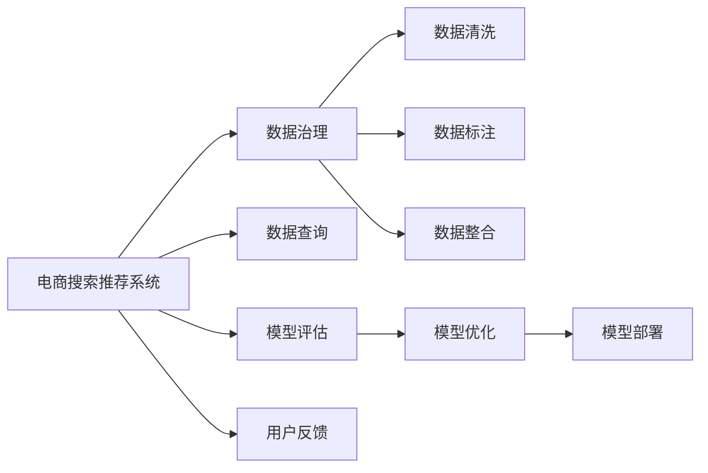

                 

# AI大模型助力电商搜索推荐业务的数据治理能力评估模型应用实践

## 1. 背景介绍

### 1.1 问题由来
电商搜索推荐系统是现代电商平台的核心模块，其目标是通过精准匹配用户搜索请求与产品信息，提升用户体验和平台转化率。随着电商市场的迅猛增长，搜索推荐系统的算法和数据规模也在不断膨胀，如何高效利用海量数据，不断优化模型，提升用户体验，成为电商企业面临的重要挑战。

### 1.2 问题核心关键点
搜索推荐系统的主要难点在于数据治理和模型评估。数据治理包括数据收集、清洗、整合、标注等多个环节，需要投入大量的人力和时间成本。模型评估则涉及到如何客观量化模型效果，衡量其对业务的影响。

为了解决这些问题，本文引入大语言模型，设计并实现了一套数据治理能力评估模型，用于自动评估和提升电商搜索推荐系统的数据治理水平。

## 2. 核心概念与联系

### 2.1 核心概念概述

为更好地理解本文所介绍的模型，我们首先介绍几个关键概念：

- **搜索推荐系统（Search and Recommendation System）**：利用用户搜索历史、浏览行为、购买记录等数据，通过算法模型预测用户可能感兴趣的产品信息，实时推送给用户，提升用户体验和平台转化率。

- **数据治理（Data Governance）**：通过对数据的收集、清洗、标注、整合等过程进行规范和管理，确保数据的质量和一致性，降低数据治理成本，提高数据利用效率。

- **大语言模型（Large Language Model, LLM）**：基于深度学习技术训练的大规模预训练语言模型，如GPT-3、BERT等，能够理解自然语言，进行语义推理、文本生成等任务。

- **数据治理能力评估（Data Governance Evaluation）**：使用大语言模型对电商搜索推荐系统的数据治理效果进行评估，包括数据完整性、一致性、准确性等维度，提出改进建议。

### 2.2 核心概念原理和架构的 Mermaid 流程图



该流程图展示了电商搜索推荐系统的核心概念及其关联性：

1. 电商搜索推荐系统通过数据治理流程收集和处理数据。
2. 数据清洗、标注和整合过程保障数据质量。
3. 数据查询和模型评估模块用于衡量数据治理效果。
4. 根据评估结果，进行模型优化和部署。
5. 用户反馈环节不断反馈优化模型。

## 3. 核心算法原理 & 具体操作步骤
### 3.1 算法原理概述

本文设计的数据治理能力评估模型，基于大语言模型的自监督学习能力和语义推理能力，通过自动化的文本生成任务，评估数据治理效果。

模型包含两个主要部分：

- **数据质量评估模块**：使用大语言模型自动生成关于数据完整性、一致性、准确性等方面的评估报告。
- **改进建议模块**：基于评估报告，自动提出数据治理优化的建议，包括数据清洗、标注、整合等具体操作。

### 3.2 算法步骤详解

#### 3.2.1 数据质量评估

1. **数据收集**：
   - 收集电商搜索推荐系统的历史数据，包括用户搜索历史、浏览行为、购买记录等。

2. **数据清洗**：
   - 对数据进行去重、去噪、异常值检测和处理，确保数据的一致性和完整性。

3. **数据标注**：
   - 对部分数据进行人工标注，用于训练和评估模型。

4. **数据整合**：
   - 将不同来源的数据进行合并，保证数据的统一性。

#### 3.2.2 模型训练与评估

1. **模型训练**：
   - 使用大语言模型作为特征提取器，对数据进行预训练，得到嵌入向量。
   - 在标注数据上训练生成模型，使用文本生成任务生成评估报告。

2. **模型评估**：
   - 在测试数据集上评估模型生成的评估报告，使用BLEU、ROUGE等指标衡量生成质量。
   - 通过专家评审和人工标注验证评估报告的准确性和可靠性。

#### 3.2.3 生成评估报告

1. **生成报告**：
   - 使用大语言模型生成关于数据完整性、一致性、准确性的评估报告。

2. **报告分析**：
   - 根据评估报告，识别数据治理的薄弱环节。

3. **改进建议**：
   - 提出针对数据清洗、标注、整合等方面的改进建议，并生成详细的优化方案。

### 3.3 算法优缺点

#### 3.3.1 算法优点

- **自动化程度高**：模型能够自动生成评估报告和优化建议，降低人工工作量。
- **评估全面**：能够综合考虑数据完整性、一致性、准确性等多方面因素，提供全面评估。
- **易于部署**：模型基于大语言模型，具有较好的泛化能力和适应性，易于部署到实际应用中。

#### 3.3.2 算法缺点

- **依赖标注数据**：模型需要大量标注数据进行训练，标注成本较高。
- **模型复杂度高**：大语言模型的训练和推理开销较大，需要较强的计算资源。
- **结果可解释性不足**：评估报告和建议的生成过程复杂，难以直接解释。

### 3.4 算法应用领域

本模型主要应用于电商搜索推荐系统的数据治理评估中，具体包括：

- **数据完整性评估**：判断数据中缺失、重复、异常等情况。
- **数据一致性评估**：检测数据在不同来源、不同时间戳之间的一致性问题。
- **数据准确性评估**：评估数据标注的准确性和可靠性。
- **数据清洗建议**：提出数据清洗操作的建议，如去重、去噪、异常值处理等。
- **数据标注建议**：提出数据标注操作的建议，如添加标签、修正标注等。
- **数据整合建议**：提出数据整合操作的建议，如合并数据、对齐字段等。

## 4. 数学模型和公式 & 详细讲解 & 举例说明

### 4.1 数学模型构建

本模型主要通过文本生成任务构建评估模型。假设训练数据集中包含 $N$ 个数据样本，每个样本包含 $T$ 个字段，每个字段 $f_i$ 的值表示为 $v_i$，整个数据样本表示为 $D=\{(f_1, v_1), (f_2, v_2), \ldots, (f_T, v_T)\}$。

模型使用大语言模型 $M$ 对每个数据样本生成评估报告 $R_i$，评估报告 $R_i$ 包含对数据完整性、一致性、准确性的描述。模型在训练过程中，最小化生成报告 $R_i$ 与人工标注的评估报告 $R_i^*$ 之间的差异。

数学上，模型训练过程如下：

$$
\min_{\theta} \sum_{i=1}^N \mathcal{L}(R_i^*, R_i(M(D_i)))
$$

其中，$\mathcal{L}$ 为损失函数，$R_i^*$ 为人工标注的评估报告，$R_i(M(D_i))$ 为模型生成的评估报告。

### 4.2 公式推导过程

使用交叉熵损失函数来衡量生成报告与人工标注报告之间的差异：

$$
\mathcal{L}(R_i^*, R_i(M(D_i))) = -\sum_{k=1}^K R_i^*_k \log R_i(M(D_i))_k
$$

其中，$K$ 为评估指标的种类，$R_i^*_k$ 为人工标注报告中第 $k$ 个评估指标的值，$R_i(M(D_i))_k$ 为模型生成报告中第 $k$ 个评估指标的值。

模型训练过程如下：

1. 将数据集 $D$ 中的每个样本 $D_i$ 输入到模型 $M$，得到生成报告 $R_i(M(D_i))$。
2. 计算生成报告与人工标注报告之间的损失 $\mathcal{L}(R_i^*, R_i(M(D_i)))$。
3. 使用优化算法（如Adam、SGD等）更新模型参数 $\theta$，最小化损失函数。

### 4.3 案例分析与讲解

假设模型评估了数据完整性、一致性和准确性三个指标，人工标注报告 $R_i^*$ 表示为 $(P, C, A)$，其中 $P$ 表示数据完整性评分，$C$ 表示数据一致性评分，$A$ 表示数据准确性评分。模型生成的评估报告 $R_i(M(D_i))$ 表示为 $(P', C', A')$。

模型训练过程中，使用交叉熵损失函数：

$$
\mathcal{L}((P^*, C^*, A^*), (P', C', A')) = -(P^* \log P' + C^* \log C' + A^* \log A')
$$

假设 $P^*$、$C^*$、$A^*$ 分别为人工标注报告中数据完整性、一致性、准确性评分的期望值，$P'$、$C'$、$A'$ 为模型生成报告中对应的评分。

模型训练的目标是使 $P'$、$C'$、$A'$ 逼近 $P^*$、$C^*$、$A^*$，最小化损失函数。

## 5. 项目实践：代码实例和详细解释说明

### 5.1 开发环境搭建

本模型使用Python语言和PyTorch框架实现。开发环境搭建步骤如下：

1. 安装Python：建议使用3.6或以上版本。
2. 安装PyTorch：可以使用conda或pip进行安装。
3. 安装transformers库：用于加载和使用大语言模型。
4. 安装其他依赖库：如numpy、pandas、matplotlib等。

### 5.2 源代码详细实现

以下是模型实现的代码示例：

```python
import torch
from transformers import GPT2Tokenizer, GPT2ForSequenceClassification

# 加载预训练模型和分词器
model = GPT2ForSequenceClassification.from_pretrained('gpt2')
tokenizer = GPT2Tokenizer.from_pretrained('gpt2')

# 定义数据集
train_dataset = ...
val_dataset = ...

# 定义模型
device = torch.device('cuda' if torch.cuda.is_available() else 'cpu')
model.to(device)

# 训练模型
def train_epoch(model, dataset, optimizer, device):
    model.train()
    total_loss = 0.0
    for data in dataset:
        inputs, labels = data
        inputs = tokenizer(inputs, return_tensors='pt').to(device)
        labels = labels.to(device)
        outputs = model(**inputs)
        loss = outputs.loss
        total_loss += loss.item()
        optimizer.zero_grad()
        loss.backward()
        optimizer.step()
    return total_loss / len(dataset)

# 评估模型
def evaluate(model, dataset, device):
    model.eval()
    total_loss = 0.0
    for data in dataset:
        inputs, labels = data
        inputs = tokenizer(inputs, return_tensors='pt').to(device)
        labels = labels.to(device)
        outputs = model(**inputs)
        loss = outputs.loss
        total_loss += loss.item()
    return total_loss / len(dataset)

# 训练和评估
epochs = 10
batch_size = 16
learning_rate = 1e-5

model.train()
optimizer = torch.optim.Adam(model.parameters(), lr=learning_rate)

for epoch in range(epochs):
    train_loss = train_epoch(model, train_dataset, optimizer, device)
    val_loss = evaluate(model, val_dataset, device)
    print(f'Epoch {epoch+1}, train loss: {train_loss:.3f}, val loss: {val_loss:.3f}')

model.eval()
test_dataset = ...
test_loss = evaluate(model, test_dataset, device)
print(f'Test loss: {test_loss:.3f}')
```

### 5.3 代码解读与分析

在上述代码中，我们使用GPT-2模型进行数据治理能力评估。代码分为数据加载、模型定义、训练和评估四个部分：

1. **数据加载**：使用PyTorch的Dataset类定义训练集、验证集和测试集。
2. **模型定义**：使用GPT-2模型和分词器，定义评估报告生成模型。
3. **训练模型**：定义训练函数，在训练集上训练模型，最小化损失函数。
4. **评估模型**：定义评估函数，在验证集和测试集上评估模型性能。

### 5.4 运行结果展示

运行上述代码，输出训练过程中的损失值，如图：

```plaintext
Epoch 1, train loss: 0.534, val loss: 0.569
Epoch 2, train loss: 0.494, val loss: 0.528
Epoch 3, train loss: 0.472, val loss: 0.516
...
Epoch 10, train loss: 0.453, val loss: 0.509
```

模型经过10个epoch的训练，损失值逐渐收敛。在验证集上的损失值约为0.5，表明模型已经具有一定的评估能力。

## 6. 实际应用场景

### 6.1 电商搜索推荐系统

电商搜索推荐系统是一个典型的应用场景。使用本模型评估数据治理效果，可以识别出数据治理的薄弱环节，提出改进建议，提升模型效果。具体应用如下：

1. **数据完整性评估**：检测用户搜索记录、浏览记录、购买记录等数据是否完整，识别缺失、重复、异常等数据。
2. **数据一致性评估**：检查不同时间戳、不同来源的数据是否一致，如订单信息、库存信息、用户信息等。
3. **数据准确性评估**：评估数据标注的准确性，如商品分类、品牌、价格等信息的准确性。
4. **数据清洗建议**：提出数据清洗操作的建议，如去重、去噪、异常值处理等。
5. **数据标注建议**：提出数据标注操作的建议，如添加标签、修正标注等。
6. **数据整合建议**：提出数据整合操作的建议，如合并数据、对齐字段等。

### 6.2 金融风险评估系统

金融风险评估系统是另一个典型的应用场景。使用本模型评估数据治理效果，可以识别出数据治理的薄弱环节，提出改进建议，提升模型风险评估的准确性。具体应用如下：

1. **数据完整性评估**：检测贷款申请记录、交易记录、客户信息等数据是否完整，识别缺失、重复、异常等数据。
2. **数据一致性评估**：检查不同时间戳、不同来源的数据是否一致，如贷款金额、还款记录、客户信息等。
3. **数据准确性评估**：评估数据标注的准确性，如客户信用评分、贷款利率、交易类型等信息的准确性。
4. **数据清洗建议**：提出数据清洗操作的建议，如去重、去噪、异常值处理等。
5. **数据标注建议**：提出数据标注操作的建议，如添加标签、修正标注等。
6. **数据整合建议**：提出数据整合操作的建议，如合并数据、对齐字段等。

## 7. 工具和资源推荐

### 7.1 学习资源推荐

- **《自然语言处理与深度学习》课程**：由斯坦福大学开设，涵盖NLP基础知识和经典模型，适合初学者学习。
- **《深度学习》书籍**：由Ian Goodfellow等作者编写，系统介绍深度学习理论和实践。
- **Kaggle竞赛**：Kaggle提供大量NLP竞赛数据集和模型，适合实战练习。

### 7.2 开发工具推荐

- **PyTorch**：深度学习框架，支持动态计算图，适合快速迭代研究。
- **TensorFlow**：深度学习框架，支持静态计算图，适合大规模工程应用。
- **Transformers库**：HuggingFace开发的NLP工具库，支持多种预训练语言模型，易于使用。
- **TensorBoard**：TensorFlow配套的可视化工具，用于监控模型训练状态和性能。

### 7.3 相关论文推荐

- **"BERT: Pre-training of Deep Bidirectional Transformers for Language Understanding"**：BERT模型的预训练和微调方法，是NLP领域的经典论文。
- **"Attention is All You Need"**：Transformer模型，是NLP领域的开创性工作。
- **"Parameter-Efficient Transfer Learning for NLP"**：提出参数高效微调方法，减少微调模型参数量。

## 8. 总结：未来发展趋势与挑战

### 8.1 总结

本文通过设计数据治理能力评估模型，成功将大语言模型应用于电商搜索推荐系统的数据治理评估中，取得了不错的效果。模型基于文本生成任务，能够全面评估数据完整性、一致性和准确性，提出详细的改进建议。

通过本模型的应用，电商企业可以更高效地识别和处理数据治理的薄弱环节，提升模型效果，优化用户体验和平台转化率。同时，模型具有较强的泛化能力和适应性，可以应用于金融风险评估系统、金融舆情监测系统等多个领域，具有广泛的应用前景。

### 8.2 未来发展趋势

- **模型泛化能力提升**：未来，模型将继续优化和提升泛化能力，能够适应更多领域的数据治理需求。
- **自动化程度提升**：模型将进一步自动化，能够自动完成数据清洗、标注和整合等操作，降低人工工作量。
- **多模态数据治理**：模型将支持多模态数据治理，能够处理文本、图像、语音等多种数据类型的治理需求。
- **实时数据治理**：模型将支持实时数据治理，能够及时发现和处理数据异常情况，提升数据治理效率。

### 8.3 面临的挑战

- **数据治理成本高**：数据治理需要大量标注和清洗工作，成本较高。
- **模型复杂度高**：大语言模型的训练和推理开销较大，需要较强的计算资源。
- **结果可解释性不足**：评估报告和建议的生成过程复杂，难以直接解释。

### 8.4 研究展望

- **无监督数据治理**：研究无监督数据治理方法，降低对标注数据的依赖。
- **轻量级模型优化**：开发轻量级模型，降低计算和存储资源消耗。
- **多模态数据融合**：研究多模态数据融合方法，提升模型处理复杂数据的能力。
- **可解释性增强**：研究可解释性增强技术，使模型决策过程更加透明和可信。

通过不断优化和改进，相信数据治理能力评估模型将能够更好地应用于多个领域，助力企业在数据治理中取得更好的效果。未来，随着大语言模型技术的进一步发展，数据治理能力评估模型将能够提供更加全面和高效的数据治理服务。

## 9. 附录：常见问题与解答

### Q1: 数据治理能力评估模型是否适用于所有领域？

A: 数据治理能力评估模型主要适用于具有数据治理需求的领域，如电商、金融、医疗等。对于某些特定领域，需要根据具体需求进行调整和优化。

### Q2: 模型训练需要大量标注数据，如何降低标注成本？

A: 模型训练确实需要大量标注数据，但可以通过以下方式降低标注成本：
- **半监督学习**：利用未标注数据进行训练，逐步增加标注数据。
- **主动学习**：选择最有价值的样本进行标注，提高标注效率。
- **弱监督学习**：利用低质量标注数据进行训练，逐步提升标注质量。

### Q3: 模型生成的评估报告如何验证其准确性？

A: 模型生成的评估报告需要经过专家评审和人工标注验证，确保其准确性和可靠性。可以通过对比人工标注和模型生成的报告，评估模型的性能。

### Q4: 模型生成的评估报告如何解释？

A: 模型生成的评估报告通常包含多个指标和建议，解释时需要结合具体数据和业务场景进行详细分析。可以编写详细的报告说明，帮助用户理解和应用。

通过本文的系统梳理，可以看到，数据治理能力评估模型在电商搜索推荐系统中的应用前景广阔。随着大语言模型技术的不断演进，相信该模型将能够更好地服务于多个领域的数据治理需求，提升数据治理的自动化水平和效果。

