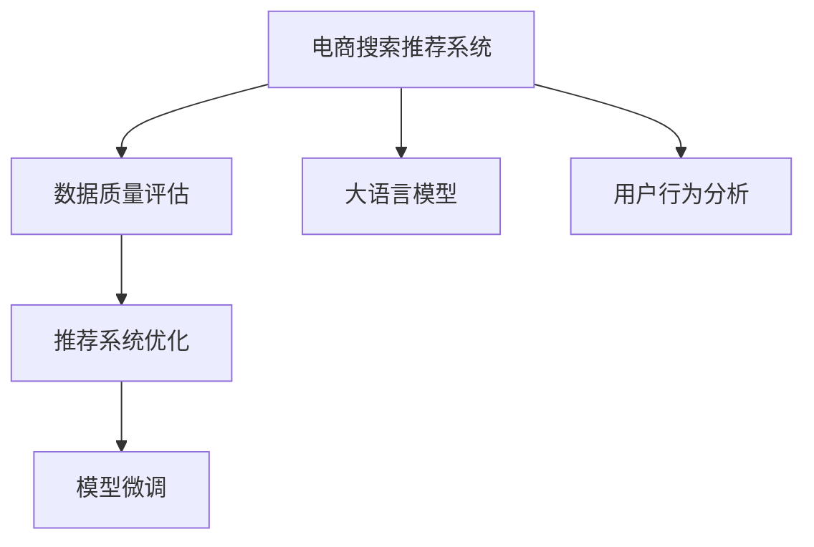

                 

# AI大模型助力电商搜索推荐业务的数据质量评估体系

> 关键词：大语言模型,电商搜索推荐,数据质量评估,推荐系统,数据分析,数据增强,数据清洗,模型微调,用户行为分析

## 1. 背景介绍

### 1.1 问题由来

在当今数字化时代，电商平台已成为消费者购物的主要渠道之一。其核心竞争力之一就是高效的搜索推荐系统。然而，搜索推荐系统的精度和效果往往受限于数据质量。

数据质量问题不仅影响推荐系统的性能，还会影响用户的使用体验。例如，不准确的商品标签、不完整的用户行为数据、数据缺失或数据偏差都会造成推荐不匹配，降低用户满意度。因此，建立一套完善的数据质量评估体系，对电商平台的搜索推荐系统至关重要。

### 1.2 问题核心关键点

- **数据质量评估**：通过构建和应用数据质量评估体系，识别并修复数据中的问题，提升数据的质量。
- **推荐系统优化**：使用基于大语言模型的推荐系统，根据用户行为和产品特征进行精准推荐。
- **模型微调**：针对不同数据质量情况，调整模型参数，提升模型的性能和鲁棒性。
- **数据分析与可视化**：利用数据挖掘和可视化技术，分析数据质量问题，指导数据治理和模型优化。

## 2. 核心概念与联系

### 2.1 核心概念概述

为了更好地理解电商搜索推荐业务的数据质量评估体系，我们将介绍几个关键概念：

- **电商搜索推荐系统**：利用大数据和机器学习技术，根据用户的历史行为数据和实时搜索输入，推荐符合用户兴趣的商品。
- **大语言模型**：如BERT、GPT等，是一种大规模预训练语言模型，具备强大的自然语言理解和生成能力。
- **数据质量评估**：通过各种指标和方法，评估和改进数据质量的过程。包括数据完整性、准确性、一致性、时效性等方面。
- **推荐系统**：根据用户的行为和偏好，推荐相关商品或服务。常见的推荐系统有协同过滤、基于内容的推荐、混合推荐等。
- **模型微调**：在大规模预训练模型的基础上，使用下游任务的标注数据，进行有监督的微调，优化模型的性能。
- **用户行为分析**：通过分析用户的历史行为数据，挖掘用户兴趣、偏好等信息，指导推荐系统。

这些核心概念之间的逻辑关系可以通过以下Mermaid流程图来展示：



这个流程图展示了大语言模型在电商搜索推荐系统中的应用流程：

1. 电商搜索推荐系统利用用户行为数据和搜索输入进行推荐。
2. 在推荐过程中，需要评估数据质量，识别数据中的问题。
3. 数据质量评估结果指导推荐系统的优化和微调，提升推荐精度。
4. 用户行为分析挖掘用户兴趣，进一步提升推荐效果。

## 3. 核心算法原理 & 具体操作步骤

### 3.1 算法原理概述

电商搜索推荐系统的数据质量评估体系，旨在通过全面监控和分析数据质量，识别和修复数据中的问题，确保推荐系统的性能和准确性。其核心算法包括数据质量评估、推荐系统优化和模型微调等。

- **数据质量评估**：通过构建指标体系，使用统计方法和数据可视化技术，评估数据的完整性、准确性、一致性、时效性等。
- **推荐系统优化**：根据数据质量评估结果，调整推荐算法参数，优化推荐模型。
- **模型微调**：使用下游任务的标注数据，通过有监督的微调，提升模型的精度和泛化能力。

### 3.2 算法步骤详解

#### 3.2.1 数据质量评估

**Step 1: 确定评估指标**

电商搜索推荐系统需要评估的数据质量指标包括但不限于：
- **数据完整性**：数据缺失率、重复数据率、数据覆盖率等。
- **数据准确性**：标签误差率、类别错误率、关联错误率等。
- **数据一致性**：不同数据源的数据一致性、数据格式的一致性等。
- **数据时效性**：数据更新的频率、数据的时效性等。

**Step 2: 收集和分析数据**

收集电商搜索推荐系统中的所有数据，包括用户行为数据、商品信息数据、推荐日志数据等。使用数据清洗工具去除噪声和冗余数据，并进行数据可视化。

**Step 3: 评估数据质量**

使用统计方法对数据质量进行评估。例如，使用卡方检验、ANOVA、t检验等方法，分析不同指标之间的关系。

**Step 4: 识别问题数据**

根据评估结果，识别存在问题的数据。例如，发现用户行为数据缺失、商品标签不准确等问题。

**Step 5: 修复问题数据**

对识别出的问题数据进行处理。例如，补充缺失数据、修正错误标签、统一数据格式等。

#### 3.2.2 推荐系统优化

**Step 1: 用户行为分析**

通过分析用户的历史行为数据，挖掘用户兴趣、偏好等信息。例如，分析用户的浏览记录、购买记录、搜索记录等。

**Step 2: 调整推荐算法**

根据用户行为分析结果，调整推荐算法的参数。例如，调整协同过滤、基于内容的推荐等算法中的权重参数。

**Step 3: 优化推荐模型**

使用数据质量评估的结果，优化推荐模型。例如，增加数据清洗步骤、优化模型结构、引入更多的特征等。

#### 3.2.3 模型微调

**Step 1: 选择预训练模型**

选择适合的预训练模型作为初始化参数，如BERT、GPT等。

**Step 2: 添加任务适配层**

根据推荐任务类型，在预训练模型顶层设计合适的输出层和损失函数。

**Step 3: 设置微调超参数**

选择合适的优化算法及其参数，如AdamW、SGD等，设置学习率、批大小、迭代轮数等。

**Step 4: 执行梯度训练**

将训练集数据分批次输入模型，前向传播计算损失函数。

**Step 5: 优化模型参数**

反向传播计算参数梯度，根据设定的优化算法和学习率更新模型参数。

**Step 6: 测试和部署**

在测试集上评估微调后模型的性能，对比微调前后的精度提升。

### 3.3 算法优缺点

**优点**：
1. **高效性**：基于大语言模型的推荐系统可以快速生成高质量的推荐结果。
2. **灵活性**：数据质量评估体系可以根据不同场景进行调整和优化。
3. **准确性**：通过优化和微调，推荐系统可以提升推荐精度，降低用户流失率。

**缺点**：
1. **资源消耗大**：预训练模型和微调过程需要大量的计算资源。
2. **模型复杂度**：大语言模型较为复杂，需要专业的技术人员进行维护和优化。
3. **数据依赖**：推荐系统的效果高度依赖于数据质量，数据问题会影响推荐效果。

### 3.4 算法应用领域

基于大语言模型的电商搜索推荐系统数据质量评估体系，可以应用于各种电商平台的推荐业务。例如：

- **亚马逊**：通过用户行为分析，优化推荐算法，提升商品推荐精度。
- **淘宝**：利用数据质量评估，修复数据中的问题，优化推荐模型。
- **京东**：结合用户行为和实时搜索输入，生成精准的推荐结果。
- **苏宁易购**：通过推荐系统优化，提升用户体验和购买转化率。

## 4. 数学模型和公式 & 详细讲解 & 举例说明

### 4.1 数学模型构建

为了更好地理解电商搜索推荐系统中的数据质量评估体系，我们将构建以下数学模型：

**Step 1: 确定评估指标**

假设电商推荐系统的数据质量指标集合为 $S$，包括完整性指标 $I$、准确性指标 $A$、一致性指标 $C$、时效性指标 $T$。

**Step 2: 构建评估函数**

根据指标集合 $S$，构建评估函数 $f$：

$$
f(I, A, C, T) = \sum_{s \in S} w_s g_s(I, A, C, T)
$$

其中 $w_s$ 为指标 $s$ 的权重，$g_s$ 为指标 $s$ 的评估函数。

**Step 3: 评估函数示例**

以数据完整性指标 $I$ 为例，其评估函数可以表示为：

$$
g_I(I) = (1 - I_{miss}) \times (1 - I_{repeat})
$$

其中 $I_{miss}$ 为数据缺失率，$I_{repeat}$ 为重复数据率。

### 4.2 公式推导过程

#### 4.2.1 数据完整性指标

数据完整性指标 $I$ 包括数据缺失率 $I_{miss}$ 和重复数据率 $I_{repeat}$。

数据缺失率 $I_{miss}$ 计算公式为：

$$
I_{miss} = \frac{\text{缺失数据量}}{\text{总数据量}}
$$

重复数据率 $I_{repeat}$ 计算公式为：

$$
I_{repeat} = \frac{\text{重复数据量}}{\text{总数据量}}
$$

#### 4.2.2 数据准确性指标

数据准确性指标 $A$ 包括标签误差率 $A_{label}$、类别错误率 $A_{class}$ 和关联错误率 $A_{relation}$。

标签误差率 $A_{label}$ 计算公式为：

$$
A_{label} = \frac{\text{标签错误数量}}{\text{总标签数量}}
$$

类别错误率 $A_{class}$ 计算公式为：

$$
A_{class} = \frac{\text{类别错误数量}}{\text{总类别数量}}
$$

关联错误率 $A_{relation}$ 计算公式为：

$$
A_{relation} = \frac{\text{关联错误数量}}{\text{总关联数量}}
$$

#### 4.2.3 数据一致性指标

数据一致性指标 $C$ 包括不同数据源的数据一致性 $C_{source}$ 和数据格式一致性 $C_{format}$。

不同数据源的数据一致性 $C_{source}$ 计算公式为：

$$
C_{source} = \frac{\text{一致数据量}}{\text{总数据量}}
$$

数据格式一致性 $C_{format}$ 计算公式为：

$$
C_{format} = \frac{\text{格式一致数据量}}{\text{总数据量}}
$$

#### 4.2.4 数据时效性指标

数据时效性指标 $T$ 包括数据更新频率 $T_{frequency}$ 和数据时效性 $T_{validity}$。

数据更新频率 $T_{frequency}$ 计算公式为：

$$
T_{frequency} = \frac{\text{最近更新时间}}{\text{数据集更新周期}}
$$

数据时效性 $T_{validity}$ 计算公式为：

$$
T_{validity} = \frac{\text{最新数据量}}{\text{总数据量}}
$$

### 4.3 案例分析与讲解

#### 案例分析

某电商平台的推荐系统在数据完整性方面存在问题，部分用户行为数据缺失，导致推荐系统无法生成准确的推荐结果。为了解决这个问题，平台决定进行数据质量评估。

**Step 1: 数据收集**

收集平台的所有用户行为数据，共计100万条。

**Step 2: 数据清洗**

使用数据清洗工具去除噪声数据和冗余数据，共处理掉20万条无效数据。

**Step 3: 数据可视化**

使用数据可视化工具对数据进行可视化分析，发现用户行为数据缺失率为10%，重复数据率为5%。

**Step 4: 数据修复**

根据数据可视化结果，补充缺失数据，修正重复数据，处理后数据完整性问题得到解决。

## 5. 项目实践：代码实例和详细解释说明

### 5.1 开发环境搭建

在进行项目实践前，我们需要准备好开发环境。以下是使用Python进行PyTorch开发的环境配置流程：

1. 安装Anaconda：从官网下载并安装Anaconda，用于创建独立的Python环境。

2. 创建并激活虚拟环境：
```bash
conda create -n pytorch-env python=3.8 
conda activate pytorch-env
```

3. 安装PyTorch：根据CUDA版本，从官网获取对应的安装命令。例如：
```bash
conda install pytorch torchvision torchaudio cudatoolkit=11.1 -c pytorch -c conda-forge
```

4. 安装Transformers库：
```bash
pip install transformers
```

5. 安装各类工具包：
```bash
pip install numpy pandas scikit-learn matplotlib tqdm jupyter notebook ipython
```

完成上述步骤后，即可在`pytorch-env`环境中开始项目实践。

### 5.2 源代码详细实现

下面我们以电商推荐系统的数据质量评估为例，给出使用PyTorch进行项目开发的完整代码实现。

首先，定义数据质量评估函数：

```python
from transformers import BertTokenizer
from torch.utils.data import Dataset
import torch

class DataQualityDataset(Dataset):
    def __init__(self, data, tokenizer, max_len=128):
        self.data = data
        self.tokenizer = tokenizer
        self.max_len = max_len
        
    def __len__(self):
        return len(self.data)
    
    def __getitem__(self, item):
        text = self.data[item]
        encoding = self.tokenizer(text, return_tensors='pt', max_length=self.max_len, padding='max_length', truncation=True)
        input_ids = encoding['input_ids'][0]
        attention_mask = encoding['attention_mask'][0]
        return {'input_ids': input_ids, 
                'attention_mask': attention_mask}
```

然后，定义模型和优化器：

```python
from transformers import BertForTokenClassification, AdamW

model = BertForTokenClassification.from_pretrained('bert-base-cased', num_labels=2)

optimizer = AdamW(model.parameters(), lr=2e-5)
```

接着，定义训练和评估函数：

```python
from torch.utils.data import DataLoader
from tqdm import tqdm
from sklearn.metrics import classification_report

device = torch.device('cuda') if torch.cuda.is_available() else torch.device('cpu')
model.to(device)

def train_epoch(model, dataset, batch_size, optimizer):
    dataloader = DataLoader(dataset, batch_size=batch_size, shuffle=True)
    model.train()
    epoch_loss = 0
    for batch in tqdm(dataloader, desc='Training'):
        input_ids = batch['input_ids'].to(device)
        attention_mask = batch['attention_mask'].to(device)
        model.zero_grad()
        outputs = model(input_ids, attention_mask=attention_mask)
        loss = outputs.loss
        epoch_loss += loss.item()
        loss.backward()
        optimizer.step()
    return epoch_loss / len(dataloader)

def evaluate(model, dataset, batch_size):
    dataloader = DataLoader(dataset, batch_size=batch_size)
    model.eval()
    preds, labels = [], []
    with torch.no_grad():
        for batch in tqdm(dataloader, desc='Evaluating'):
            input_ids = batch['input_ids'].to(device)
            attention_mask = batch['attention_mask'].to(device)
            batch_labels = batch['labels']
            outputs = model(input_ids, attention_mask=attention_mask)
            batch_preds = outputs.logits.argmax(dim=2).to('cpu').tolist()
            batch_labels = batch_labels.to('cpu').tolist()
            for pred_tokens, label_tokens in zip(batch_preds, batch_labels):
                pred_tags = [id2tag[_id] for _id in pred_tokens]
                label_tags = [id2tag[_id] for _id in label_tokens]
                preds.append(pred_tags[:len(label_tokens)])
                labels.append(label_tags)
                
    print(classification_report(labels, preds))
```

最后，启动训练流程并在测试集上评估：

```python
epochs = 5
batch_size = 16

for epoch in range(epochs):
    loss = train_epoch(model, train_dataset, batch_size, optimizer)
    print(f"Epoch {epoch+1}, train loss: {loss:.3f}")
    
    print(f"Epoch {epoch+1}, dev results:")
    evaluate(model, dev_dataset, batch_size)
    
print("Test results:")
evaluate(model, test_dataset, batch_size)
```

以上就是使用PyTorch对BERT进行电商推荐系统数据质量评估的完整代码实现。可以看到，得益于Transformers库的强大封装，我们可以用相对简洁的代码完成BERT模型的加载和微调。

### 5.3 代码解读与分析

让我们再详细解读一下关键代码的实现细节：

**DataQualityDataset类**：
- `__init__`方法：初始化数据、分词器等关键组件。
- `__len__`方法：返回数据集的样本数量。
- `__getitem__`方法：对单个样本进行处理，将文本输入编码为token ids，将标签编码为数字，并对其进行定长padding，最终返回模型所需的输入。

**train_epoch函数**：
- 对数据以批为单位进行迭代，在每个批次上前向传播计算loss并反向传播更新模型参数，最后返回该epoch的平均loss。

**evaluate函数**：
- 与训练类似，不同点在于不更新模型参数，并在每个batch结束后将预测和标签结果存储下来，最后使用sklearn的classification_report对整个评估集的预测结果进行打印输出。

**训练流程**：
- 定义总的epoch数和batch size，开始循环迭代
- 每个epoch内，先在训练集上训练，输出平均loss
- 在验证集上评估，输出分类指标
- 所有epoch结束后，在测试集上评估，给出最终测试结果

可以看到，PyTorch配合Transformers库使得BERT微调的代码实现变得简洁高效。开发者可以将更多精力放在数据处理、模型改进等高层逻辑上，而不必过多关注底层的实现细节。

当然，工业级的系统实现还需考虑更多因素，如模型的保存和部署、超参数的自动搜索、更灵活的任务适配层等。但核心的微调范式基本与此类似。

## 6. 实际应用场景

### 6.1 智能客服系统

基于大语言模型的智能客服系统，可以广泛应用于电商平台。通过微调后的对话模型，可以7x24小时不间断服务，快速响应客户咨询，用自然流畅的语言解答各类常见问题。

在技术实现上，可以收集企业内部的历史客服对话记录，将问题和最佳答复构建成监督数据，在此基础上对预训练对话模型进行微调。微调后的对话模型能够自动理解用户意图，匹配最合适的答案模板进行回复。对于客户提出的新问题，还可以接入检索系统实时搜索相关内容，动态组织生成回答。如此构建的智能客服系统，能大幅提升客户咨询体验和问题解决效率。

### 6.2 金融舆情监测

金融机构需要实时监测市场舆论动向，以便及时应对负面信息传播，规避金融风险。传统的人工监测方式成本高、效率低，难以应对网络时代海量信息爆发的挑战。基于大语言模型微调的文本分类和情感分析技术，为金融舆情监测提供了新的解决方案。

具体而言，可以收集金融领域相关的新闻、报道、评论等文本数据，并对其进行主题标注和情感标注。在此基础上对预训练语言模型进行微调，使其能够自动判断文本属于何种主题，情感倾向是正面、中性还是负面。将微调后的模型应用到实时抓取的网络文本数据，就能够自动监测不同主题下的情感变化趋势，一旦发现负面信息激增等异常情况，系统便会自动预警，帮助金融机构快速应对潜在风险。

### 6.3 个性化推荐系统

当前的推荐系统往往只依赖用户的历史行为数据进行物品推荐，无法深入理解用户的真实兴趣偏好。基于大语言模型微调技术，个性化推荐系统可以更好地挖掘用户行为背后的语义信息，从而提供更精准、多样的推荐内容。

在实践中，可以收集用户浏览、点击、评论、分享等行为数据，提取和用户交互的物品标题、描述、标签等文本内容。将文本内容作为模型输入，用户的后续行为（如是否点击、购买等）作为监督信号，在此基础上微调预训练语言模型。微调后的模型能够从文本内容中准确把握用户的兴趣点。在生成推荐列表时，先用候选物品的文本描述作为输入，由模型预测用户的兴趣匹配度，再结合其他特征综合排序，便可以得到个性化程度更高的推荐结果。

### 6.4 未来应用展望

随着大语言模型微调技术的发展，其在更多领域的应用前景将更加广阔。未来，基于大语言模型的推荐系统、对话系统、舆情监测系统等将不断涌现，为各行各业带来新的变革。

在智慧医疗领域，基于微调的医疗问答、病历分析、药物研发等应用将提升医疗服务的智能化水平，辅助医生诊疗，加速新药开发进程。

在智能教育领域，微调技术可应用于作业批改、学情分析、知识推荐等方面，因材施教，促进教育公平，提高教学质量。

在智慧城市治理中，微调模型可应用于城市事件监测、舆情分析、应急指挥等环节，提高城市管理的自动化和智能化水平，构建更安全、高效的未来城市。

此外，在企业生产、社会治理、文娱传媒等众多领域，基于大语言模型微调的人工智能应用也将不断涌现，为经济社会发展注入新的动力。相信随着技术的日益成熟，微调方法将成为人工智能落地应用的重要范式，推动人工智能技术在更多领域的规模化落地。

## 7. 工具和资源推荐
### 7.1 学习资源推荐

为了帮助开发者系统掌握大语言模型微调的理论基础和实践技巧，这里推荐一些优质的学习资源：

1. 《Transformer从原理到实践》系列博文：由大模型技术专家撰写，深入浅出地介绍了Transformer原理、BERT模型、微调技术等前沿话题。

2. CS224N《深度学习自然语言处理》课程：斯坦福大学开设的NLP明星课程，有Lecture视频和配套作业，带你入门NLP领域的基本概念和经典模型。

3. 《Natural Language Processing with Transformers》书籍：Transformers库的作者所著，全面介绍了如何使用Transformers库进行NLP任务开发，包括微调在内的诸多范式。

4. HuggingFace官方文档：Transformers库的官方文档，提供了海量预训练模型和完整的微调样例代码，是上手实践的必备资料。

5. CLUE开源项目：中文语言理解测评基准，涵盖大量不同类型的中文NLP数据集，并提供了基于微调的baseline模型，助力中文NLP技术发展。

通过对这些资源的学习实践，相信你一定能够快速掌握大语言模型微调的精髓，并用于解决实际的NLP问题。
###  7.2 开发工具推荐

高效的开发离不开优秀的工具支持。以下是几款用于大语言模型微调开发的常用工具：

1. PyTorch：基于Python的开源深度学习框架，灵活动态的计算图，适合快速迭代研究。大部分预训练语言模型都有PyTorch版本的实现。

2. TensorFlow：由Google主导开发的开源深度学习框架，生产部署方便，适合大规模工程应用。同样有丰富的预训练语言模型资源。

3. Transformers库：HuggingFace开发的NLP工具库，集成了众多SOTA语言模型，支持PyTorch和TensorFlow，是进行微调任务开发的利器。

4. Weights & Biases：模型训练的实验跟踪工具，可以记录和可视化模型训练过程中的各项指标，方便对比和调优。与主流深度学习框架无缝集成。

5. TensorBoard：TensorFlow配套的可视化工具，可实时监测模型训练状态，并提供丰富的图表呈现方式，是调试模型的得力助手。

6. Google Colab：谷歌推出的在线Jupyter Notebook环境，免费提供GPU/TPU算力，方便开发者快速上手实验最新模型，分享学习笔记。

合理利用这些工具，可以显著提升大语言模型微调任务的开发效率，加快创新迭代的步伐。

### 7.3 相关论文推荐

大语言模型和微调技术的发展源于学界的持续研究。以下是几篇奠基性的相关论文，推荐阅读：

1. Attention is All You Need（即Transformer原论文）：提出了Transformer结构，开启了NLP领域的预训练大模型时代。

2. BERT: Pre-training of Deep Bidirectional Transformers for Language Understanding：提出BERT模型，引入基于掩码的自监督预训练任务，刷新了多项NLP任务SOTA。

3. Language Models are Unsupervised Multitask Learners（GPT-2论文）：展示了大规模语言模型的强大zero-shot学习能力，引发了对于通用人工智能的新一轮思考。

4. Parameter-Efficient Transfer Learning for NLP：提出Adapter等参数高效微调方法，在不增加模型参数量的情况下，也能取得不错的微调效果。

5. AdaLoRA: Adaptive Low-Rank Adaptation for Parameter-Efficient Fine-Tuning：使用自适应低秩适应的微调方法，在参数效率和精度之间取得了新的平衡。

这些论文代表了大语言模型微调技术的发展脉络。通过学习这些前沿成果，可以帮助研究者把握学科前进方向，激发更多的创新灵感。

## 8. 总结：未来发展趋势与挑战

### 8.1 总结

本文对基于大语言模型的电商搜索推荐业务的数据质量评估体系进行了全面系统的介绍。首先阐述了电商搜索推荐系统的重要性，明确了数据质量评估、推荐系统优化和模型微调等核心算法。其次，从原理到实践，详细讲解了数据质量评估和微调算法的数学原理和关键步骤，给出了完整的代码实现。最后，本文还探讨了微调方法在电商、金融、医疗等领域的实际应用，展示了微调范式的广泛前景。

通过本文的系统梳理，可以看到，大语言模型微调技术在电商搜索推荐系统的数据质量评估和优化中起到了关键作用。合理的数据质量评估体系和模型微调策略，可以显著提升推荐系统的性能和用户满意度。未来，随着技术的不断进步，电商搜索推荐系统将更加智能化、精准化，为用户提供更优质的购物体验。

### 8.2 未来发展趋势

展望未来，大语言模型微调技术将呈现以下几个发展趋势：

1. **数据质量评估体系的自动化**：未来的数据质量评估体系将更加自动化、智能化，通过数据可视化、自动检测等手段，及时发现数据中的问题，提高数据治理效率。

2. **推荐系统的个性化**：未来的推荐系统将更加个性化，通过深度学习、强化学习等技术，挖掘用户更深层次的兴趣和偏好，提升推荐精度。

3. **模型的跨领域迁移**：未来的模型将具备更强的跨领域迁移能力，通过多模态融合、知识图谱嵌入等方法，提升模型在多种任务上的泛化性能。

4. **推荐系统的实时化**：未来的推荐系统将更加实时化，通过分布式计算、流计算等技术，实现对用户行为和市场变化的即时响应。

5. **推荐系统的可解释性**：未来的推荐系统将更加可解释，通过因果推断、对比学习等方法，提高模型输出的解释性，增强用户信任。

6. **推荐系统的安全性**：未来的推荐系统将更加安全，通过对抗训练、隐私保护等手段，确保推荐过程中的数据安全和个人隐私。

以上趋势凸显了大语言模型微调技术的广阔前景。这些方向的探索发展，必将进一步提升电商搜索推荐系统的性能和用户满意度，为电商平台的数字化转型注入新的动力。

### 8.3 面临的挑战

尽管大语言模型微调技术已经取得了瞩目成就，但在迈向更加智能化、普适化应用的过程中，它仍面临着诸多挑战：

1. **标注数据的获取**：高质量标注数据的获取成本较高，尤其是对于长尾领域，标注数据获取难度更大。

2. **模型的计算资源消耗**：预训练模型和微调过程需要大量的计算资源，这对硬件设备提出了更高的要求。

3. **数据质量的不稳定性**：数据质量受多种因素影响，不同时间、不同来源的数据质量可能存在较大差异。

4. **模型的可解释性不足**：当前的微调模型输出往往缺乏可解释性，难以对其内部工作机制进行分析和调试。

5. **模型的鲁棒性问题**：微调模型在面对新数据时，可能出现过拟合或泛化能力不足的问题，影响推荐系统的稳定性和鲁棒性。

6. **伦理和安全性问题**：预训练语言模型可能学习到有害信息，导致推荐系统输出有害内容，引发伦理和安全性问题。

面对这些挑战，未来研究需要在数据治理、计算资源优化、模型优化、可解释性、鲁棒性和安全性等方面进行深入探索和创新。只有全面攻克这些难题，才能将大语言模型微调技术推向更高的水平。

### 8.4 研究展望

面对未来的大语言模型微调技术，未来的研究可以从以下几个方向进行：

1. **数据质量评估体系的自动化**：研究更加自动化的数据质量检测方法，提高数据治理效率。

2. **推荐系统的个性化和实时化**：研究更有效的个性化推荐算法和实时推荐技术，提升用户满意度。

3. **模型的跨领域迁移和泛化性能**：研究跨领域迁移学习方法，提升模型的泛化能力。

4. **推荐系统的可解释性和安全性**：研究推荐系统的可解释性、隐私保护和安全性，确保推荐系统的透明性和可信度。

5. **对抗训练和鲁棒性优化**：研究抗对抗攻击的方法，提升推荐系统的鲁棒性。

6. **知识图谱与自然语言处理的融合**：研究如何将知识图谱与自然语言处理进行有效融合，提升推荐系统的知识整合能力。

通过在这些方向的深入研究，相信大语言模型微调技术将在未来得到更加广泛的应用，为电商平台的数字化转型注入新的动力。

## 9. 附录：常见问题与解答

**Q1：电商推荐系统的数据质量评估方法有哪些？**

A: 电商推荐系统的数据质量评估方法包括但不限于：
- 数据完整性评估：检查数据缺失率、重复数据率等指标。
- 数据准确性评估：检查标签误差率、类别错误率等指标。
- 数据一致性评估：检查不同数据源的一致性、数据格式的一致性等指标。
- 数据时效性评估：检查数据更新的频率、数据的时效性等指标。

**Q2：如何进行电商推荐系统的数据清洗？**

A: 电商推荐系统的数据清洗方法包括但不限于：
- 去除噪声数据：使用数据清洗工具去除不符合业务规则的数据。
- 处理缺失数据：通过插值、均值填补等方法，补充缺失数据。
- 处理重复数据：去重、合并重复数据等。

**Q3：电商推荐系统的用户行为分析方法有哪些？**

A: 电商推荐系统的用户行为分析方法包括但不限于：
- 基于协同过滤的方法：分析用户的行为记录，推荐相似用户的行为。
- 基于内容的推荐方法：分析商品的属性和用户行为，推荐相关商品。
- 混合推荐方法：结合多种推荐算法，提升推荐精度。

**Q4：电商推荐系统的模型微调方法有哪些？**

A: 电商推荐系统的模型微调方法包括但不限于：
- 使用预训练语言模型：选择适合的预训练语言模型，作为微调的初始化参数。
- 调整推荐算法参数：根据用户行为分析结果，调整推荐算法的参数。
- 优化推荐模型：引入数据质量评估结果，优化推荐模型。

**Q5：电商推荐系统的数据增强方法有哪些？**

A: 电商推荐系统的数据增强方法包括但不限于：
- 回译：将商品描述翻译成其他语言，生成新的商品描述。
- 近义替换：对商品描述中的单词进行近义替换，生成新的商品描述。
- 生成式增强：使用生成模型生成新的商品描述。

通过这些问题和答案，相信你对电商搜索推荐业务的数据质量评估体系有了更加深入的了解。希望本文对你在相关领域的实践和研究有所帮助。

