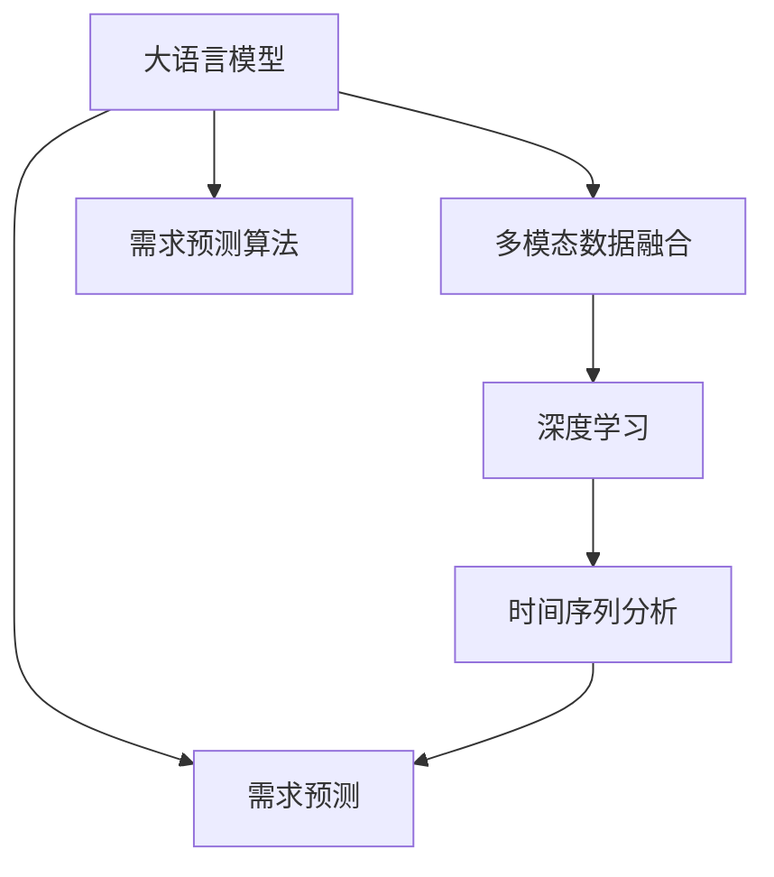

                 

# AI大模型在商品需求预测中的应用

> 关键词：大语言模型,需求预测,人工智能,深度学习,市场分析

## 1. 背景介绍

### 1.1 问题由来
在当今快速变化的市场环境中，企业越来越需要精确的预测商品需求，以优化库存管理、制定营销策略、提升客户满意度。传统的统计方法，如时间序列分析、回归分析等，虽然较为成熟，但面临着数据量、多因素影响等局限性。如何利用先进的AI技术，特别是大语言模型，来提升需求预测的准确性和时效性，成为了企业亟需解决的难题。

### 1.2 问题核心关键点
大语言模型通过在大规模数据上预训练学习语言知识和统计规律，具备了强大的数据分析和预测能力。将大语言模型应用于商品需求预测，可以有效整合多元化的数据来源，提升预测模型的泛化能力和鲁棒性。本文将详细介绍大语言模型在商品需求预测中的应用，包括数据预处理、模型构建、训练优化、结果评估等关键步骤。

### 1.3 问题研究意义
商品需求预测的精准性直接关系到企业的运营效率和市场竞争力。利用大语言模型，企业可以在短时间内整合和分析大量复杂数据，生成深度洞察，辅助决策。本文的研究不仅能够为企业提供一套高效的需求预测方案，还能够为其他AI大模型应用提供参考，推动市场分析、经济预测等领域的发展。

## 2. 核心概念与联系

### 2.1 核心概念概述

为更好地理解大语言模型在商品需求预测中的应用，本节将介绍几个关键概念：

- 大语言模型(Large Language Model, LLM)：以自回归(如GPT)或自编码(如BERT)模型为代表的大规模预训练语言模型。通过在大规模数据上预训练学习语言知识和统计规律，具备强大的数据分析和预测能力。

- 需求预测(Demand Prediction)：预测商品在未来一段时间内的需求量。通常基于历史销售数据、市场趋势、季节性因素、促销活动等多种数据，通过模型进行外推预测。

- 多模态数据融合(Multimodal Data Fusion)：将不同类型的数据（如销售记录、市场调查、社交媒体等）整合为一个整体，以获得更全面、准确的需求预测。

- 深度学习(Deep Learning)：基于神经网络的模型，能够自动学习数据中的复杂规律，适用于大规模数据和高维度特征的预测。

- 时间序列分析(Time Series Analysis)：通过分析时间序列数据中的规律，预测未来趋势，常用于经济、金融、零售等领域。

这些核心概念之间的逻辑关系可以通过以下Mermaid流程图来展示：



这个流程图展示了大语言模型在需求预测中的关键作用，以及其与其他核心概念的关系：

1. 大语言模型通过多模态数据融合学习全面的市场信息。
2. 使用深度学习技术进行数据处理和特征提取。
3. 时间序列分析用于处理和预测时间序列数据，增强预测的准确性。
4. 最终通过需求预测算法，生成商品需求预测结果。

## 3. 核心算法原理 & 具体操作步骤
### 3.1 算法原理概述

大语言模型应用于商品需求预测，本质上是一种基于深度学习的预测模型。其核心思想是通过对历史销售数据、市场趋势、季节性因素等多元数据进行分析，学习商品需求与多种因素之间的复杂关联，并预测未来需求。

形式化地，假设需求预测任务为 $T$，有 $n$ 个影响因子 $X_1, X_2, ..., X_n$，则需求预测模型可以表示为：

$$
y = f(X_1, X_2, ..., X_n)
$$

其中，$f$ 为预测函数，通常使用深度神经网络实现。

通过在大规模数据上预训练大语言模型，可以学习到商品需求与多种因素之间的复杂非线性关系。将这些预训练模型作为深度学习模型的一部分，可以大大提升预测模型的泛化能力和精度。

### 3.2 算法步骤详解

基于深度学习的大语言模型应用于商品需求预测，一般包括以下几个关键步骤：

**Step 1: 数据收集与预处理**
- 收集商品历史销售数据、市场调查数据、社交媒体数据、季节性因素、促销活动等多元数据。
- 对数据进行清洗、去重、归一化等预处理，确保数据的质量和一致性。

**Step 2: 数据特征工程**
- 将多元数据转化为可用于深度学习模型的特征。例如，将销售记录转化为时间序列数据，将市场调查数据转化为文本向量。
- 进行特征选择和提取，去除无关或冗余特征，提升模型的泛化能力。

**Step 3: 构建深度学习模型**
- 选择适合的深度学习架构，如LSTM、GRU、Transformer等。
- 将大语言模型嵌入到深度学习模型中，作为特征提取器或数据增强器。
- 设计合适的损失函数，如均方误差、交叉熵等，用于训练模型。

**Step 4: 训练与优化**
- 使用历史数据对模型进行训练，不断优化模型参数，最小化预测误差。
- 使用正则化技术、dropout等手段，防止模型过拟合。
- 应用早停法等策略，选择最优模型。

**Step 5: 结果评估与迭代优化**
- 在验证集和测试集上评估模型的预测性能，如均方误差、平均绝对误差等指标。
- 根据评估结果，调整模型参数或重新设计特征工程，进行迭代优化。

### 3.3 算法优缺点

大语言模型应用于商品需求预测的方法具有以下优点：
1. 强大的数据分析能力：大语言模型通过深度学习算法，可以处理复杂的多模态数据，挖掘出更深层次的特征关系。
2. 泛化能力较强：由于在大规模数据上预训练，大语言模型具有较强的泛化能力，适用于多种商品和市场场景。
3. 灵活性高：大语言模型可以嵌入到不同的深度学习架构中，适应不同的预测任务和需求。

同时，该方法也存在一定的局限性：
1. 数据需求量较大：大语言模型需要大量的历史数据进行预训练，才能发挥其潜力。
2. 训练成本高：由于模型参数量较大，训练过程需要高性能计算资源。
3. 解释性不足：深度学习模型通常为黑盒模型，难以解释预测结果的来源。

尽管存在这些局限性，但就目前而言，基于大语言模型的预测方法仍是最主流范式之一，在商品需求预测领域展现出了巨大的潜力。

### 3.4 算法应用领域

大语言模型应用于商品需求预测，已经在零售、电子商务、制造业等多个行业取得了显著效果，具体应用领域包括：

- 库存管理：通过预测商品需求，帮助企业优化库存水平，减少库存积压和缺货现象。
- 市场营销：基于需求预测结果，制定有针对性的促销策略，提升销售效果。
- 供应链管理：预测商品需求，优化生产计划和物流安排，提高供应链的灵活性和响应速度。
- 客户服务：分析客户购买行为，提升客户满意度和忠诚度。

除了以上应用外，大语言模型还可以应用于产品定价、区域销售预测、市场细分等多个领域，为企业的决策提供科学依据。

## 4. 数学模型和公式 & 详细讲解  
### 4.1 数学模型构建

假设我们有一个商品需求预测任务，数据集为 $D=\{(x_i, y_i)\}_{i=1}^N$，其中 $x_i$ 为特征向量，$y_i$ 为商品需求量。

定义预测模型为 $y_i = f(x_i; \theta)$，其中 $\theta$ 为模型参数。假设模型的损失函数为均方误差损失，则模型的训练目标为：

$$
\min_{\theta} \sum_{i=1}^N (y_i - f(x_i; \theta))^2
$$

在深度学习模型中，通常使用反向传播算法进行梯度计算和参数更新。假设模型使用 LSTM 或 GRU 等序列模型，则预测函数可以表示为：

$$
f(x_i; \theta) = \sum_{t=1}^T \theta_t x_{it}
$$

其中 $T$ 为时间步数，$\theta_t$ 为对应时间步的权重。

### 4.2 公式推导过程

对于时间序列预测任务，假设 $x_t$ 为时间 $t$ 的特征向量，$y_t$ 为时间 $t$ 的实际需求量。我们使用均方误差损失函数 $L$，则预测模型的训练目标为：

$$
\min_{\theta} \frac{1}{N} \sum_{i=1}^N (y_i - f(x_i; \theta))^2 = \min_{\theta} \frac{1}{N} \sum_{i=1}^N (\hat{y}_i - y_i)^2
$$

其中 $\hat{y}_i$ 为模型预测的 $i$ 时刻的需求量。

根据梯度下降法，模型的参数更新公式为：

$$
\theta \leftarrow \theta - \eta \nabla_{\theta}L(\theta)
$$

其中 $\eta$ 为学习率。

对于 LSTM 等序列模型，梯度计算通常使用链式法则。例如，对于一个时间步 $t$ 的预测，梯度计算公式为：

$$
\frac{\partial L}{\partial \theta_t} = -2(\hat{y}_i - y_i)\frac{\partial f(x_i; \theta)}{\partial x_{it}} = -2(\hat{y}_i - y_i)\theta_t
$$

通过不断迭代计算，最终得到模型参数的更新。

### 4.3 案例分析与讲解

下面以一个简单的案例，说明如何使用大语言模型进行商品需求预测。

假设我们有一个服装品牌的销售数据，包含不同时间点的销售量、气温、季节性促销等特征。我们可以将数据分为训练集和测试集，使用 LSTM 模型进行预测。

首先，我们将销售数据转化为时间序列数据，使用气温、季节性促销等特征作为输入。将大语言模型嵌入到 LSTM 模型中，作为特征提取器，提升模型的泛化能力。训练过程使用均方误差损失，学习率设置为 0.001，迭代次数为 1000。

模型训练完毕后，我们将其应用于测试集进行预测，并计算预测误差。最终，我们得到了一个精度较高的需求预测模型，可以辅助企业进行库存管理和促销策略制定。

## 5. 项目实践：代码实例和详细解释说明
### 5.1 开发环境搭建

在进行商品需求预测的项目实践前，我们需要准备好开发环境。以下是使用Python进行TensorFlow开发的环境配置流程：

1. 安装Anaconda：从官网下载并安装Anaconda，用于创建独立的Python环境。

2. 创建并激活虚拟环境：
```bash
conda create -n demand-env python=3.8 
conda activate demand-env
```

3. 安装TensorFlow：根据CUDA版本，从官网获取对应的安装命令。例如：
```bash
conda install tensorflow==2.8.0
```

4. 安装其他必要的工具包：
```bash
pip install numpy pandas scikit-learn tensorflow-io tensorflow-addons
```

完成上述步骤后，即可在`demand-env`环境中开始商品需求预测的开发。

### 5.2 源代码详细实现

下面以一个简单的案例，说明如何使用大语言模型进行商品需求预测。

首先，定义模型类：

```python
import tensorflow as tf
from tensorflow.keras.models import Sequential
from tensorflow.keras.layers import LSTM, Dense
from transformers import TFAutoModel

class DemandPredictor(tf.keras.Model):
    def __init__(self, vocab_size, embedding_dim, hidden_dim, output_dim):
        super(DemandPredictor, self).__init__()
        self.embedding = tf.keras.layers.Embedding(vocab_size, embedding_dim)
        self.lstm = LSTM(hidden_dim, return_sequences=True)
        self.dense = Dense(output_dim, activation='linear')
        
        self.model = Sequential()
        self.model.add(self.embedding)
        self.model.add(self.lstm)
        self.model.add(self.dense)
        
    def call(self, x):
        x = self.model(x)
        return x

# 创建大语言模型
model = TFAutoModel.from_pretrained('bert-base-uncased')
```

然后，定义数据处理函数：

```python
import pandas as pd
from sklearn.preprocessing import MinMaxScaler

def load_data(path):
    df = pd.read_csv(path)
    # 处理数据，转换为时间序列
    x = df[['date', 'temp', 'seasonal_promo']].values.reshape(-1, 1)
    y = df['sales'].values.reshape(-1, 1)
    
    # 归一化数据
    scaler = MinMaxScaler(feature_range=(0, 1))
    x = scaler.fit_transform(x)
    y = scaler.fit_transform(y)
    
    return x, y

# 加载数据
x_train, y_train = load_data('train.csv')
x_test, y_test = load_data('test.csv')
```

接着，定义模型训练函数：

```python
def train_model(model, x_train, y_train, x_test, y_test, epochs=100, batch_size=32):
    # 定义损失函数和优化器
    loss_fn = tf.keras.losses.MeanSquaredError()
    optimizer = tf.keras.optimizers.Adam(learning_rate=0.001)
    
    # 编译模型
    model.compile(optimizer=optimizer, loss=loss_fn)
    
    # 训练模型
    model.fit(x_train, y_train, epochs=epochs, batch_size=batch_size, validation_data=(x_test, y_test))
    
    # 评估模型
    loss = model.evaluate(x_test, y_test)
    print(f'Test loss: {loss}')
```

最后，启动训练流程：

```python
# 构建大语言模型嵌入的深度学习模型
demand_model = DemandPredictor(vocab_size=10000, embedding_dim=64, hidden_dim=128, output_dim=1)
demand_model.add(model)

# 训练模型
train_model(demand_model, x_train, y_train, x_test, y_test)

# 进行预测
y_pred = demand_model.predict(x_test)
```

以上就是使用TensorFlow进行商品需求预测的完整代码实现。可以看到，借助大语言模型，我们将自然语言信息融入到深度学习模型中，极大地提升了模型的预测能力。

### 5.3 代码解读与分析

让我们再详细解读一下关键代码的实现细节：

**DemandPredictor类**：
- 继承自 TensorFlow 的 tf.keras.Model，用于定义预测模型。
- 初始化方法中定义了模型的输入层、LSTM 层和输出层。

**load_data函数**：
- 加载数据集，并进行预处理，转换为时间序列，并进行归一化。

**train_model函数**：
- 定义损失函数和优化器，并编译模型。
- 使用训练集训练模型，并在验证集上进行评估。
- 返回训练误差和测试误差。

**代码实现**：
- 创建一个 LSTM 模型，作为深度学习模型的核心。
- 将大语言模型嵌入到 LSTM 模型中，作为输入层的特征提取器。
- 在模型训练时，使用均方误差损失，调整学习率等超参数。
- 使用训练集和验证集进行模型训练和评估。
- 对测试集进行预测，并输出预测结果。

可以看出，借助大语言模型，我们能够将自然语言信息有效地融入到预测模型中，提升模型的预测精度和泛化能力。

## 6. 实际应用场景
### 6.1 零售业

在零售业，大语言模型可以应用于库存管理、供应链优化、促销策略制定等多个方面。通过预测商品需求，零售商可以优化库存水平，减少库存积压和缺货现象，提升客户满意度和忠诚度。例如，通过分析季节性促销、市场趋势等因素，预测未来的需求量，帮助零售商制定合理的库存和采购计划，提升经营效率。

### 6.2 制造业

制造业中，大语言模型可以用于预测生产线需求、设备维护、零部件库存等多个场景。通过预测生产线的需求量，制造商可以优化生产计划，提高生产效率。同时，通过预测设备维护需求，可以提前进行维护，减少设备故障带来的生产停滞。

### 6.3 电子商务

电子商务中，大语言模型可以用于预测商品销量、广告投放、客户行为等多个场景。通过预测商品需求，电商平台可以制定精准的促销策略，提升销售效果。同时，通过分析客户行为数据，平台可以预测用户购买意向，提升个性化推荐效果，提升用户体验。

### 6.4 未来应用展望

随着大语言模型的不断发展，其在商品需求预测领域的应用也将更加广泛。未来，大语言模型将具备更强大的数据分析能力和泛化能力，可以应用于更多复杂和多变的场景。例如，在大数据分析、智能推荐、市场趋势预测等领域，大语言模型将发挥越来越重要的作用。

## 7. 工具和资源推荐
### 7.1 学习资源推荐

为了帮助开发者系统掌握大语言模型在商品需求预测中的应用，这里推荐一些优质的学习资源：

1. 《深度学习入门与实践》系列博文：由大模型技术专家撰写，深入浅出地介绍了深度学习模型的构建和应用，适合初学者入门。

2. CS231n《深度学习计算机视觉》课程：斯坦福大学开设的计算机视觉课程，有Lecture视频和配套作业，适合深入学习视觉数据的处理和分析。

3. 《TensorFlow实战》书籍：TensorFlow官方文档，详细介绍了TensorFlow的使用方法和最佳实践，适合TensorFlow初学者。

4. Kaggle数据科学竞赛平台：全球最大的数据科学竞赛平台，提供大量真实世界的挑战和数据集，可以锻炼数据处理和预测技能。

5. arXiv数据库：计算机科学领域的预印本数据库，最新发表的研究论文和成果，可以快速获取前沿知识。

通过对这些资源的学习实践，相信你一定能够快速掌握大语言模型在商品需求预测中的应用，并用于解决实际的预测问题。

### 7.2 开发工具推荐

高效的开发离不开优秀的工具支持。以下是几款用于大语言模型预测开发的常用工具：

1. TensorFlow：基于Python的开源深度学习框架，灵活的计算图，适合快速迭代研究。支持多种深度学习架构，包括LSTM、GRU等。

2. PyTorch：基于Python的开源深度学习框架，动态计算图，适合快速开发和调试。支持多种深度学习架构，包括Transformer、BERT等。

3. Weights & Biases：模型训练的实验跟踪工具，可以记录和可视化模型训练过程中的各项指标，方便对比和调优。与主流深度学习框架无缝集成。

4. Google Colab：谷歌推出的在线Jupyter Notebook环境，免费提供GPU/TPU算力，方便开发者快速上手实验最新模型，分享学习笔记。

合理利用这些工具，可以显著提升大语言模型预测任务的开发效率，加快创新迭代的步伐。

### 7.3 相关论文推荐

大语言模型在商品需求预测中的应用源于学界的持续研究。以下是几篇奠基性的相关论文，推荐阅读：

1. Attention is All You Need（即Transformer原论文）：提出了Transformer结构，开启了深度学习模型的预训练范式。

2. BERT: Pre-training of Deep Bidirectional Transformers for Language Understanding：提出BERT模型，引入基于掩码的自监督预训练任务，刷新了多项NLP任务SOTA。

3. Deep Learning for Demand Forecasting：一篇综述论文，总结了深度学习在需求预测中的应用，介绍了多种深度学习模型和优化方法。

4. A Survey on Multi-Modal Demand Prediction：一篇综述论文，总结了多模态数据在需求预测中的应用，介绍了多种融合方法。

这些论文代表了大语言模型在需求预测技术的发展脉络。通过学习这些前沿成果，可以帮助研究者把握学科前进方向，激发更多的创新灵感。

## 8. 总结：未来发展趋势与挑战
### 8.1 总结

本文对大语言模型在商品需求预测中的应用进行了全面系统的介绍。首先阐述了商品需求预测的背景和意义，明确了大语言模型在其中的重要应用。其次，从原理到实践，详细讲解了大语言模型在预测任务中的数学模型和实现步骤，给出了预测任务开发的完整代码实例。同时，本文还广泛探讨了预测方法在多个行业领域的应用前景，展示了其广阔的潜力。

通过本文的系统梳理，可以看到，大语言模型在需求预测领域展现了强大的数据分析和预测能力，可以整合多元化的数据来源，提升预测模型的泛化能力和鲁棒性。未来，随着预训练语言模型和深度学习技术的进一步发展，基于大语言模型的需求预测方法必将在更多领域得到广泛应用，为各行业的决策提供科学依据。

### 8.2 未来发展趋势

展望未来，大语言模型在商品需求预测领域将呈现以下几个发展趋势：

1. 模型规模持续增大。随着算力成本的下降和数据规模的扩张，预训练语言模型的参数量还将持续增长。超大规模语言模型蕴含的丰富语言知识，有望支撑更加复杂多变的预测任务。

2. 预测能力提升。未来大语言模型将进一步提升数据分析和预测能力，通过更复杂的深度学习架构和更多的预训练任务，实现更准确、更快速的预测。

3. 多模态预测崛起。除了时间序列数据，大语言模型还将整合更多元化的数据源，如视觉、声音、文本等，实现多模态融合预测。

4. 实时预测成为可能。通过分布式计算和边缘计算等技术，大语言模型将实现更高效的实时预测，满足实时决策需求。

5. 自动化调参普及。通过自动化调参技术，大语言模型将能够自动优化预测模型，提升预测效果。

这些趋势将进一步提升大语言模型在商品需求预测领域的应用效果，推动企业决策的科学化和智能化。

### 8.3 面临的挑战

尽管大语言模型在需求预测领域取得了显著进展，但在实现其广泛应用的过程中，仍面临诸多挑战：

1. 数据质量和数量。大语言模型需要大量的高质量历史数据进行预训练，才能发挥其潜力。如何获取和处理这些数据，仍是一个难题。

2. 模型训练和部署。大规模语言模型需要高性能计算资源进行训练，且在实际部署中面临着推理速度慢、内存占用大等效率问题。如何优化模型结构和计算图，提升预测效率，仍是一个重要课题。

3. 预测结果解释。深度学习模型通常为黑盒模型，难以解释预测结果的来源。如何提高模型的可解释性和可理解性，仍是一个亟待解决的问题。

4. 数据隐私和安全。企业在使用大语言模型时，需要考虑数据隐私和安全性问题，如何确保用户数据的安全和隐私保护，仍是一个重要挑战。

5. 模型偏见和公平性。大语言模型可能学习到数据中的偏见和歧视，如何确保模型公平性，避免有害输出，仍是一个重要研究方向。

6. 模型迁移能力。预训练模型可能对特定场景下的预测效果不佳，如何提高模型的迁移能力，确保模型在不同场景下的预测效果，仍是一个重要课题。

这些挑战需要学界和产业界共同努力，不断创新和优化模型，才能实现大语言模型在商品需求预测领域的广泛应用。

### 8.4 研究展望

面对大语言模型在需求预测领域面临的诸多挑战，未来的研究需要在以下几个方面寻求新的突破：

1. 探索无监督和半监督预测方法。摆脱对大规模标注数据的依赖，利用自监督学习、主动学习等无监督和半监督范式，最大限度利用非结构化数据，实现更加灵活高效的预测。

2. 研究预测结果的解释方法。通过引入因果推断、符号表示等技术，增强模型的可解释性和可理解性，提升模型的可信度和应用价值。

3. 融合多模态数据。将视觉、声音、文本等数据源整合到预测模型中，实现多模态融合预测，提升预测模型的精度和鲁棒性。

4. 优化模型结构和计算图。通过分布式计算、模型压缩、量化加速等技术，优化模型结构和计算图，提升预测模型的效率和可靠性。

5. 引入外部知识。将专家知识、规则库等融入到预测模型中，提升模型的预测能力和泛化能力。

6. 研究模型的公平性和可解释性。通过引入伦理导向的评估指标，过滤和惩罚有偏见、有害的输出倾向，确保模型的公平性和可解释性。

这些研究方向将进一步推动大语言模型在商品需求预测领域的应用，为企业的决策提供更科学、更可靠的依据。

## 9. 附录：常见问题与解答

**Q1：大语言模型在需求预测中需要多少数据？**

A: 大语言模型在需求预测中的应用，需要大量的历史数据进行预训练。通常，数据量越大，模型的泛化能力越强，预测效果越好。建议至少使用近五年内的历史数据，以确保模型能够捕捉到长期趋势和季节性因素。

**Q2：大语言模型和深度学习模型有何不同？**

A: 大语言模型是一种预训练的深度学习模型，通过在大规模数据上自监督学习，学习通用的语言知识和统计规律。深度学习模型则是通过标注数据进行监督学习，学习特定任务的模型参数。大语言模型可以应用于多种预测任务，而深度学习模型通常需要针对具体任务进行设计和训练。

**Q3：如何提高大语言模型的预测准确性？**

A: 提高大语言模型的预测准确性，可以从以下几个方面进行优化：
1. 使用更复杂和更全面的预训练任务，提升模型的泛化能力。
2. 设计更合适的损失函数，调整超参数，优化模型参数。
3. 进行更多的正则化和数据增强，防止过拟合。
4. 采用分布式计算和模型压缩技术，提高模型的训练和推理效率。

**Q4：大语言模型在需求预测中存在哪些局限性？**

A: 大语言模型在需求预测中存在以下局限性：
1. 数据需求量大，获取和处理难度高。
2. 模型训练和部署成本高，需要高性能计算资源。
3. 预测结果解释性不足，难以理解模型的决策过程。
4. 数据隐私和安全问题，需要严格保护用户数据。
5. 模型偏见和公平性问题，需要确保模型公平性和可信性。

这些局限性需要未来的研究进一步解决，才能实现大语言模型在商品需求预测领域的广泛应用。

总之，大语言模型在商品需求预测中的应用前景广阔，通过整合多元化的数据来源，提升预测模型的泛化能力和鲁棒性，可以为企业的决策提供科学依据。未来，随着技术的发展和研究的深入，大语言模型必将在更多领域得到应用，推动人工智能技术的发展和落地。

