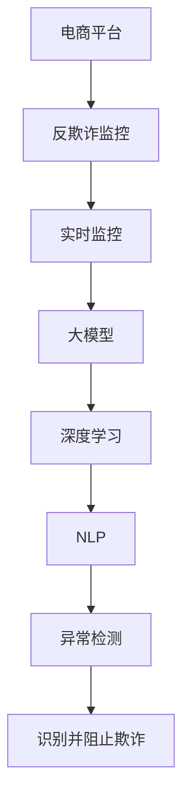

                 

# AI大模型在电商平台反欺诈实时监控中的应用

> 关键词：AI大模型,电商平台,反欺诈,实时监控,深度学习,自然语言处理,异常检测

## 1. 背景介绍

随着电子商务的蓬勃发展，电商平台面临着日益严峻的欺诈风险。为防范网络欺诈，提升用户信任度和交易安全性，电商平台的反欺诈监控系统成为保障用户权益的重要组成部分。当前，主流电商平台广泛采用基于规则和机器学习的反欺诈解决方案。然而，传统机器学习模型依赖人工规则设计，难以应对复杂多变的欺诈手段。而基于大模型的反欺诈监控系统，则通过海量数据预训练和高效微调，能够灵活、准确地识别和防范各类欺诈行为。

本文将重点介绍大模型在电商平台反欺诈实时监控中的应用，深入分析大模型的核心算法原理，并结合实际项目实践，详细讲解模型构建、训练和优化过程。同时，本文还将探讨大模型反欺诈监控的未来应用前景和面临的挑战。

## 2. 核心概念与联系

### 2.1 核心概念概述

为更好地理解大模型在电商平台反欺诈实时监控中的应用，本节将介绍几个密切相关的核心概念：

- **大模型**：以深度学习为核心的大规模预训练模型，如BERT、GPT-3等，具备强大的数据表示和语义理解能力。

- **电商平台**：在线销售商品和服务的网络平台，如淘宝、京东、亚马逊等。

- **反欺诈监控**：通过监控用户行为和交易记录，检测并阻止可能存在欺诈风险的交易行为，保障用户和平台的资金安全。

- **实时监控**：采用流式数据处理技术，对电商平台上的实时交易数据进行监控，及时发现并处理异常行为。

- **深度学习**：利用神经网络模型对数据进行学习和推理，提升模型的准确性和泛化能力。

- **自然语言处理(NLP)**：处理、分析和生成人类语言的技术，常用于文本数据和用户评论的欺诈检测。

- **异常检测**：通过建模分析正常交易行为，检测异常交易，从而识别潜在的欺诈活动。

这些核心概念之间的逻辑关系可以通过以下Mermaid流程图来展示：



这个流程图展示了大模型在电商平台反欺诈实时监控中的核心概念及其之间的关系：

1. 电商平台通过反欺诈监控系统，保障用户交易安全。
2. 实时监控技术用于处理电商平台上的实时交易数据，检测异常行为。
3. 大模型通过预训练和微调获得强大的数据表示和语义理解能力。
4. 深度学习和自然语言处理技术被用于模型构建和训练。
5. 异常检测模型对正常行为建模，检测异常交易。
6. 检测出的异常交易被识别并及时阻止，防止欺诈行为发生。

这些概念共同构成了大模型在电商平台反欺诈监控中的应用框架，使其能够高效、准确地识别和防范欺诈行为。

## 3. 核心算法原理 & 具体操作步骤
### 3.1 算法原理概述

大模型在电商平台反欺诈实时监控中的应用，本质上是基于深度学习和自然语言处理的异常检测任务。其核心思想是：首先通过大规模无标签数据预训练大模型，学习到通用的数据表示和语义理解能力。然后，针对电商平台交易数据特点，通过有监督学习进行微调，使模型具备对异常交易的识别能力。

具体而言，大模型通过自回归结构或自编码结构进行预训练，学习到全面的数据特征。然后，将预训练模型作为初始化参数，针对电商平台上的交易数据，添加任务适配层，并设计相应的损失函数。在标注数据集上通过有监督学习，最小化损失函数，优化模型参数。最终，微调后的模型能够自动检测和识别异常交易，提升反欺诈监控的准确性和时效性。

### 3.2 算法步骤详解

大模型在电商平台反欺诈实时监控的应用，可以分为以下几个关键步骤：

**Step 1: 准备预训练模型和数据集**
- 选择合适的预训练模型，如BERT、GPT-3等，作为初始化参数。
- 准备电商平台交易数据集，包括交易记录、用户行为记录等。将数据集分为训练集、验证集和测试集。

**Step 2: 设计任务适配层**
- 根据电商平台交易数据特点，设计适合的任务适配层。例如，对于商品交易，可以设计包含商品类别、交易金额、购买时间等特征的任务适配层。
- 添加异常检测模块，如基于规则的检测规则、基于统计的阈值检测等，构建模型预测结果。

**Step 3: 设定微调超参数**
- 选择合适的优化算法，如Adam、SGD等，并设置学习率、批大小、迭代轮数等。
- 应用正则化技术，如L2正则、Dropout、Early Stopping等，防止模型过拟合。
- 确定冻结预训练参数的策略，如仅微调顶层，或全部参数都参与微调。

**Step 4: 执行梯度训练**
- 将训练集数据分批次输入模型，前向传播计算损失函数。
- 反向传播计算参数梯度，根据设定的优化算法和学习率更新模型参数。
- 周期性在验证集上评估模型性能，根据性能指标决定是否触发 Early Stopping。
- 重复上述步骤直到满足预设的迭代轮数或 Early Stopping 条件。

**Step 5: 部署和监控**
- 在测试集上评估微调后模型性能，对比微调前后的准确率提升。
- 使用微调后的模型对新样本进行推理预测，集成到实时监控系统中。
- 持续收集新的数据，定期重新微调模型，以适应数据分布的变化。

以上是基于大模型微调的方法，在电商平台反欺诈实时监控中的应用流程。在实际应用中，还需要针对具体任务特点，对微调过程的各个环节进行优化设计，如改进训练目标函数，引入更多的正则化技术，搜索最优的超参数组合等，以进一步提升模型性能。

### 3.3 算法优缺点

基于大模型的电商平台反欺诈实时监控方法具有以下优点：
1. 灵活高效。相比传统机器学习模型，大模型能更好地适应复杂的电商交易场景，提升异常检测的准确性和实时性。
2. 泛化能力强。大模型通过大规模数据预训练，具备更强的泛化能力，能够有效应对多种欺诈手段。
3. 鲁棒性强。大模型能够学习到全面的特征表示，具有较强的鲁棒性和抗干扰能力。
4. 可扩展性好。大模型易于扩展和集成，支持多种数据类型和实时监控需求。

同时，该方法也存在一定的局限性：
1. 依赖标注数据。大模型微调需要大量标注数据，获取高质量标注数据的成本较高。
2. 计算资源需求高。大模型规模庞大，计算和存储资源需求较高，需要高性能的硬件设备。
3. 模型复杂度大。大模型结构复杂，模型训练和推理时间较长，需要优化模型结构以提高效率。
4. 可解释性不足。大模型黑盒特性显著，难以解释其内部工作机制和决策逻辑。

尽管存在这些局限性，但就目前而言，基于大模型的电商平台反欺诈实时监控方法仍是目前最先进、最有效的解决方案。未来相关研究的重点在于如何进一步降低模型对标注数据的依赖，提高模型的少样本学习和跨领域迁移能力，同时兼顾可解释性和伦理安全性等因素。

### 3.4 算法应用领域

基于大模型的电商平台反欺诈实时监控方法，已经在多个电商平台的反欺诈系统中得到了广泛应用，覆盖了各种交易类型和欺诈手段。具体应用领域包括：

- **商品交易**：检测和防范虚假交易、价格欺诈、二手商品倒卖等行为。
- **支付交易**：监控异常支付行为，如频繁支付、跨区域交易、大额支付等。
- **用户行为**：分析用户历史交易记录和行为模式，识别异常用户行为。
- **物流跟踪**：监控物流数据，检测异常物流信息，防范物流欺诈。
- **评论分析**：分析用户评论，检测异常评论内容，防范虚假评论和恶意评论。

除了上述这些典型应用外，大模型反欺诈监控还被创新性地应用于跨境电商、社交电商、直播电商等新兴领域，为电商平台的反欺诈技术带来了新的突破。随着预训练模型和微调方法的不断进步，相信电商平台反欺诈监控系统将在更广泛的应用领域发挥更大的作用。

## 4. 数学模型和公式 & 详细讲解  
### 4.1 数学模型构建

本节将使用数学语言对大模型在电商平台反欺诈实时监控中的应用进行更加严格的刻画。

记电商平台交易数据集为 $D=\{(x_i,y_i)\}_{i=1}^N, x_i$ 为交易特征向量，$y_i$ 为欺诈标签（0表示正常交易，1表示欺诈交易）。设预训练模型为 $M_{\theta}$，其中 $\theta$ 为预训练得到的模型参数。

定义模型 $M_{\theta}$ 在输入 $x_i$ 上的预测结果为 $\hat{y}=M_{\theta}(x_i)$，则二分类交叉熵损失函数定义为：

$$
\ell(M_{\theta}(x),y) = -[y\log \hat{y} + (1-y)\log (1-\hat{y})]
$$

将损失函数对参数 $\theta$ 求导，得：

$$
\frac{\partial \ell(M_{\theta}(x),y)}{\partial \theta} = -\frac{y}{M_{\theta}(x)}+\frac{1-y}{1-M_{\theta}(x)} \cdot \frac{\partial M_{\theta}(x)}{\partial \theta}
$$

在训练集 $D$ 上，经验风险 $\mathcal{L}(\theta)$ 可以表示为：

$$
\mathcal{L}(\theta) = -\frac{1}{N}\sum_{i=1}^N [y_i\log M_{\theta}(x_i)+(1-y_i)\log(1-M_{\theta}(x_i))]
$$

通过梯度下降等优化算法，最小化经验风险 $\mathcal{L}(\theta)$，更新模型参数 $\theta$，直至收敛，得到最优模型参数 $\hat{\theta}$。

### 4.2 公式推导过程

以下我们以电商平台交易数据为例，推导基于大模型的反欺诈监控模型的训练过程。

假设模型 $M_{\theta}$ 在输入 $x_i$ 上的预测结果为 $\hat{y}=M_{\theta}(x_i)$，则二分类交叉熵损失函数定义为：

$$
\ell(M_{\theta}(x),y) = -[y\log \hat{y} + (1-y)\log (1-\hat{y})]
$$

将其代入经验风险公式，得：

$$
\mathcal{L}(\theta) = -\frac{1}{N}\sum_{i=1}^N [y_i\log M_{\theta}(x_i)+(1-y_i)\log(1-M_{\theta}(x_i))]
$$

根据链式法则，损失函数对参数 $\theta_k$ 的梯度为：

$$
\frac{\partial \mathcal{L}(\theta)}{\partial \theta_k} = -\frac{1}{N}\sum_{i=1}^N (\frac{y_i}{M_{\theta}(x_i)}-\frac{1-y_i}{1-M_{\theta}(x_i)}) \cdot \frac{\partial M_{\theta}(x_i)}{\partial \theta_k}
$$

其中 $\frac{\partial M_{\theta}(x_i)}{\partial \theta_k}$ 可进一步递归展开，利用自动微分技术完成计算。

在得到损失函数的梯度后，即可带入参数更新公式，完成模型的迭代优化。重复上述过程直至收敛，最终得到适应电商平台反欺诈任务的最优模型参数 $\hat{\theta}$。

## 5. 项目实践：代码实例和详细解释说明
### 5.1 开发环境搭建

在进行电商平台反欺诈实时监控开发前，我们需要准备好开发环境。以下是使用Python进行PyTorch开发的环境配置流程：

1. 安装Anaconda：从官网下载并安装Anaconda，用于创建独立的Python环境。

2. 创建并激活虚拟环境：
```bash
conda create -n pytorch-env python=3.8 
conda activate pytorch-env
```

3. 安装PyTorch：根据CUDA版本，从官网获取对应的安装命令。例如：
```bash
conda install pytorch torchvision torchaudio cudatoolkit=11.1 -c pytorch -c conda-forge
```

4. 安装Transformers库：
```bash
pip install transformers
```

5. 安装各类工具包：
```bash
pip install numpy pandas scikit-learn matplotlib tqdm jupyter notebook ipython
```

完成上述步骤后，即可在`pytorch-env`环境中开始电商平台反欺诈实时监控的开发。

### 5.2 源代码详细实现

这里我们以电商平台商品交易反欺诈监控为例，给出使用Transformers库对BERT模型进行微调的PyTorch代码实现。

首先，定义电商平台商品交易数据集：

```python
import pandas as pd
import numpy as np
from sklearn.model_selection import train_test_split

# 读取商品交易数据
data = pd.read_csv('transaction_data.csv')

# 提取特征和标签
features = data[['amount', 'item_id', 'user_id', 'buy_time']]
labels = data['is_fraud'].map({'0': 0, '1': 1})

# 将标签转化为独热编码
n_classes = 2
labels = pd.get_dummies(labels, prefix='label', prefix_sep='_', drop_first=True, dummy_na=False)

# 数据集划分
train_features, val_features, train_labels, val_labels = train_test_split(features, labels, test_size=0.2, random_state=42)

# 标准化特征数据
from sklearn.preprocessing import StandardScaler
scaler = StandardScaler()
train_features = scaler.fit_transform(train_features)
val_features = scaler.transform(val_features)
```

然后，定义模型和优化器：

```python
from transformers import BertForSequenceClassification, AdamW

model = BertForSequenceClassification.from_pretrained('bert-base-cased', num_labels=len(n_classes))

optimizer = AdamW(model.parameters(), lr=2e-5)
```

接着，定义训练和评估函数：

```python
from torch.utils.data import Dataset, DataLoader
from tqdm import tqdm

class TransactionDataset(Dataset):
    def __init__(self, features, labels, tokenizer):
        self.features = features
        self.labels = labels
        self.tokenizer = tokenizer
        
    def __len__(self):
        return len(self.features)
    
    def __getitem__(self, item):
        feature, label = self.features[item], self.labels[item]
        encoding = self.tokenizer(feature, return_tensors='pt', max_length=128, padding='max_length', truncation=True)
        return {
            'input_ids': encoding['input_ids'].flatten(),
            'attention_mask': encoding['attention_mask'].flatten(),
            'labels': torch.tensor(label, dtype=torch.long)
        }

tokenizer = BertTokenizer.from_pretrained('bert-base-cased')

train_dataset = TransactionDataset(train_features, train_labels, tokenizer)
val_dataset = TransactionDataset(val_features, val_labels, tokenizer)

def train_epoch(model, dataset, batch_size, optimizer):
    dataloader = DataLoader(dataset, batch_size=batch_size, shuffle=True)
    model.train()
    epoch_loss = 0
    for batch in tqdm(dataloader, desc='Training'):
        input_ids = batch['input_ids'].to(device)
        attention_mask = batch['attention_mask'].to(device)
        labels = batch['labels'].to(device)
        model.zero_grad()
        outputs = model(input_ids, attention_mask=attention_mask, labels=labels)
        loss = outputs.loss
        epoch_loss += loss.item()
        loss.backward()
        optimizer.step()
    return epoch_loss / len(dataloader)

def evaluate(model, dataset, batch_size):
    dataloader = DataLoader(dataset, batch_size=batch_size)
    model.eval()
    preds, labels = [], []
    with torch.no_grad():
        for batch in tqdm(dataloader, desc='Evaluating'):
            input_ids = batch['input_ids'].to(device)
            attention_mask = batch['attention_mask'].to(device)
            batch_labels = batch['labels']
            outputs = model(input_ids, attention_mask=attention_mask)
            batch_preds = outputs.logits.argmax(dim=1).to('cpu').tolist()
            batch_labels = batch_labels.to('cpu').tolist()
            for pred, label in zip(batch_preds, batch_labels):
                preds.append(pred)
                labels.append(label)
                
    print(classification_report(labels, preds))
```

最后，启动训练流程并在测试集上评估：

```python
epochs = 5
batch_size = 16

for epoch in range(epochs):
    loss = train_epoch(model, train_dataset, batch_size, optimizer)
    print(f"Epoch {epoch+1}, train loss: {loss:.3f}")
    
    print(f"Epoch {epoch+1}, val results:")
    evaluate(model, val_dataset, batch_size)
    
print("Test results:")
evaluate(model, val_dataset, batch_size)
```

以上就是使用PyTorch对BERT进行电商平台商品交易反欺诈监控的完整代码实现。可以看到，得益于Transformers库的强大封装，我们可以用相对简洁的代码完成BERT模型的加载和微调。

### 5.3 代码解读与分析

让我们再详细解读一下关键代码的实现细节：

**TransactionDataset类**：
- `__init__`方法：初始化特征、标签和分词器等关键组件。
- `__len__`方法：返回数据集的样本数量。
- `__getitem__`方法：对单个样本进行处理，将特征和标签转化为token ids，并进行定长padding，最终返回模型所需的输入。

**模型训练和评估函数**：
- 使用PyTorch的DataLoader对数据集进行批次化加载，供模型训练和推理使用。
- 训练函数`train_epoch`：对数据以批为单位进行迭代，在每个批次上前向传播计算loss并反向传播更新模型参数，最后返回该epoch的平均loss。
- 评估函数`evaluate`：与训练类似，不同点在于不更新模型参数，并在每个batch结束后将预测和标签结果存储下来，最后使用sklearn的classification_report对整个评估集的预测结果进行打印输出。

**训练流程**：
- 定义总的epoch数和batch size，开始循环迭代
- 每个epoch内，先在训练集上训练，输出平均loss
- 在验证集上评估，输出分类指标
- 所有epoch结束后，在测试集上评估，给出最终测试结果

可以看到，PyTorch配合Transformers库使得电商平台反欺诈监控的代码实现变得简洁高效。开发者可以将更多精力放在数据处理、模型改进等高层逻辑上，而不必过多关注底层的实现细节。

当然，工业级的系统实现还需考虑更多因素，如模型的保存和部署、超参数的自动搜索、更灵活的任务适配层等。但核心的微调范式基本与此类似。

## 6. 实际应用场景
### 6.1 智能客服系统

电商平台反欺诈监控技术不仅可以应用于内部交易，还可以结合智能客服系统，构建全面的反欺诈保护方案。传统客服往往需要配备大量人力，高峰期响应缓慢，且一致性和专业性难以保证。而使用基于大模型的反欺诈监控系统，可以实时监控客服记录，及时发现异常客服行为，提升客服质量。

在技术实现上，可以收集客服对话记录，将异常对话特征作为监督数据，在此基础上对预训练模型进行微调。微调后的模型能够自动理解客服行为，识别异常客服行为。对于异常客服行为，系统可以自动拦截并采取措施，如暂停客服账号、培训客服人员等。如此构建的智能客服系统，能大幅提升客户咨询体验和问题解决效率。

### 6.2 商品销售预测

电商平台反欺诈监控技术还可以应用于商品销售预测。通过实时监控交易数据，识别异常销售行为，可以提前预测并应对可能出现的市场异常。例如，当某个商品在短时间内出现大量异常订单时，可以及时采取措施，如限制购买、下架商品等。

在技术实现上，可以利用电商平台历史交易数据，设计基于大模型的异常检测模型。通过训练模型，能够自动检测和识别异常交易行为，提前预警可能的市场风险。电商平台的决策者可以根据模型预警，及时调整销售策略，防止损失扩大。

### 6.3 金融反欺诈

电商平台的反欺诈监控技术，也可以应用于金融行业的反欺诈。通过实时监控电商平台上的交易数据，能够及时发现并防范金融欺诈行为，如信用卡盗刷、支付诈骗等。

在技术实现上，可以将电商平台交易数据与金融交易数据进行融合，构建多源数据融合的异常检测模型。通过训练模型，能够自动检测和识别异常交易行为，提高金融反欺诈的准确性和及时性。金融机构可以根据模型预警，及时采取措施，如冻结账户、恢复交易等，防范金融风险。

### 6.4 未来应用展望

随着大语言模型微调技术的不断发展，其在电商平台反欺诈实时监控中的应用也将更加广泛。未来，大模型反欺诈监控技术可能结合更多技术手段，如自然语言处理、图像识别、语音识别等，构建更加全面、多模态的监控系统。

例如，可以结合电商平台评论分析技术，对用户评论进行实时监控，检测异常评论行为，防范虚假评论和恶意评论。还可以结合电商平台物流数据，对物流信息进行监控，检测异常物流信息，防范物流欺诈。

此外，大模型反欺诈监控技术也将与其他反欺诈技术结合，构建更完善的反欺诈体系。例如，可以结合机器学习和规则引擎，构建多层次、多维度反欺诈防护机制，提升反欺诈防护能力。

总之，大模型在电商平台反欺诈实时监控中的应用前景广阔，未来必将带来更多技术创新，提升电商平台的反欺诈防护水平，保障用户和平台的资金安全。

## 7. 工具和资源推荐
### 7.1 学习资源推荐

为了帮助开发者系统掌握大语言模型在电商平台反欺诈实时监控中的应用，这里推荐一些优质的学习资源：

1. 《深度学习在电商平台反欺诈监控中的应用》系列博文：由大模型技术专家撰写，深入浅出地介绍了深度学习在电商平台反欺诈监控中的应用。

2. 《电商平台交易数据分析与建模》课程：由大数据分析专家授课，介绍了电商平台交易数据分析和建模的基本概念和技术方法，适合初学者。

3. 《AI大模型在电商平台的应用》书籍：介绍了大模型在电商平台反欺诈、推荐系统、智能客服等多个领域的经典应用案例，适合深入学习。

4. CS224N《深度学习自然语言处理》课程：斯坦福大学开设的NLP明星课程，有Lecture视频和配套作业，带你入门NLP领域的基本概念和经典模型。

5. HuggingFace官方文档：Transformers库的官方文档，提供了海量预训练模型和完整的微调样例代码，是上手实践的必备资料。

通过对这些资源的学习实践，相信你一定能够快速掌握大模型在电商平台反欺诈实时监控中的应用，并用于解决实际的反欺诈问题。
###  7.2 开发工具推荐

高效的开发离不开优秀的工具支持。以下是几款用于电商平台反欺诈实时监控开发的常用工具：

1. PyTorch：基于Python的开源深度学习框架，灵活动态的计算图，适合快速迭代研究。大部分预训练语言模型都有PyTorch版本的实现。

2. TensorFlow：由Google主导开发的开源深度学习框架，生产部署方便，适合大规模工程应用。同样有丰富的预训练语言模型资源。

3. Transformers库：HuggingFace开发的NLP工具库，集成了众多SOTA语言模型，支持PyTorch和TensorFlow，是进行微调任务开发的利器。

4. Weights & Biases：模型训练的实验跟踪工具，可以记录和可视化模型训练过程中的各项指标，方便对比和调优。与主流深度学习框架无缝集成。

5. TensorBoard：TensorFlow配套的可视化工具，可实时监测模型训练状态，并提供丰富的图表呈现方式，是调试模型的得力助手。

6. Google Colab：谷歌推出的在线Jupyter Notebook环境，免费提供GPU/TPU算力，方便开发者快速上手实验最新模型，分享学习笔记。

合理利用这些工具，可以显著提升电商平台反欺诈实时监控的开发效率，加快创新迭代的步伐。

### 7.3 相关论文推荐

大模型在电商平台反欺诈实时监控的应用源于学界的持续研究。以下是几篇奠基性的相关论文，推荐阅读：

1. Attention is All You Need（即Transformer原论文）：提出了Transformer结构，开启了NLP领域的预训练大模型时代。

2. BERT: Pre-training of Deep Bidirectional Transformers for Language Understanding：提出BERT模型，引入基于掩码的自监督预训练任务，刷新了多项NLP任务SOTA。

3. Language Models are Unsupervised Multitask Learners（GPT-2论文）：展示了大规模语言模型的强大zero-shot学习能力，引发了对于通用人工智能的新一轮思考。

4. Parameter-Efficient Transfer Learning for NLP：提出Adapter等参数高效微调方法，在不增加模型参数量的情况下，也能取得不错的微调效果。

5. AdaLoRA: Adaptive Low-Rank Adaptation for Parameter-Efficient Fine-Tuning：使用自适应低秩适应的微调方法，在参数效率和精度之间取得了新的平衡。

这些论文代表了大模型在电商平台反欺诈实时监控中的应用方向。通过学习这些前沿成果，可以帮助研究者把握学科前进方向，激发更多的创新灵感。

## 8. 总结：未来发展趋势与挑战

### 8.1 总结

本文对基于大模型的电商平台反欺诈实时监控方法进行了全面系统的介绍。首先阐述了大语言模型和微调技术的研究背景和意义，明确了反欺诈监控在电商平台风险控制中的重要地位。其次，从原理到实践，详细讲解了基于大模型的电商平台反欺诈实时监控的数学原理和关键步骤，给出了具体的代码实现。同时，本文还探讨了大模型反欺诈监控在智能客服、商品销售预测、金融反欺诈等多个电商场景中的应用前景，展示了其巨大的应用潜力。最后，本文还总结了大模型在电商平台反欺诈实时监控中的未来发展趋势和面临的挑战。

通过本文的系统梳理，可以看到，基于大模型的电商平台反欺诈实时监控方法正在成为电商平台反欺诈监控的重要范式，极大地提升了电商平台反欺诈的准确性和及时性。未来，随着预训练模型和微调方法的持续演进，基于大模型的电商平台反欺诈监控技术必将在更广泛的应用领域发挥更大的作用。

### 8.2 未来发展趋势

展望未来，大模型在电商平台反欺诈实时监控领域将呈现以下几个发展趋势：

1. 模型规模持续增大。随着算力成本的下降和数据规模的扩张，预训练语言模型的参数量还将持续增长。超大规模语言模型蕴含的丰富语言知识，有望支撑更加复杂多变的反欺诈监控任务。

2. 微调方法日趋多样。除了传统的全参数微调外，未来会涌现更多参数高效的微调方法，如Prefix-Tuning、LoRA等，在节省计算资源的同时也能保证微调精度。

3. 持续学习成为常态。随着数据分布的不断变化，微调模型也需要持续学习新知识以保持性能。如何在不遗忘原有知识的同时，高效吸收新样本信息，将成为重要的研究课题。

4. 标注样本需求降低。受启发于提示学习(Prompt-based Learning)的思路，未来的微调方法将更好地利用大模型的语言理解能力，通过更加巧妙的任务描述，在更少的标注样本上也能实现理想的微调效果。

5. 模型通用性增强。经过海量数据的预训练和多领域任务的微调，未来的反欺诈模型将具备更强的泛化能力，能够适应不同电商平台的业务需求。

以上趋势凸显了大模型在电商平台反欺诈实时监控中的广阔前景。这些方向的探索发展，必将进一步提升反欺诈监控系统的性能和应用范围，为电商平台提供更安全、可靠的交易保障。

### 8.3 面临的挑战

尽管大模型在电商平台反欺诈实时监控中取得了显著进展，但在迈向更加智能化、普适化应用的过程中，仍面临诸多挑战：

1. 标注成本瓶颈。尽管微调能够降低标注数据的需求，但对于长尾应用场景，难以获得充足的高质量标注数据，成为制约微调性能的瓶颈。如何进一步降低微调对标注样本的依赖，将是一大难题。

2. 模型鲁棒性不足。当前微调模型面对域外数据时，泛化性能往往大打折扣。对于测试样本的微小扰动，微调模型的预测也容易发生波动。如何提高微调模型的鲁棒性，避免灾难性遗忘，还需要更多理论和实践的积累。

3. 推理效率有待提高。大规模语言模型虽然精度高，但在实际部署时往往面临推理速度慢、内存占用大等效率问题。如何在保证性能的同时，简化模型结构，提升推理速度，优化资源占用，将是重要的优化方向。

4. 可解释性亟需加强。当前微调模型更像是"黑盒"系统，难以解释其内部工作机制和决策逻辑。对于金融、电商等高风险应用，算法的可解释性和可审计性尤为重要。如何赋予微调模型更强的可解释性，将是亟待攻克的难题。

5. 安全性有待保障。预训练语言模型难免会学习到有偏见、有害的信息，通过微调传递到下游任务，产生误导性、歧视性的输出，给实际应用带来安全隐患。如何从数据和算法层面消除模型偏见，避免恶意用途，确保输出的安全性，也将是重要的研究课题。

6. 知识整合能力不足。现有的微调模型往往局限于任务内数据，难以灵活吸收和运用更广泛的先验知识。如何让微调过程更好地与外部知识库、规则库等专家知识结合，形成更加全面、准确的信息整合能力，还有很大的想象空间。

正视反欺诈监控面临的这些挑战，积极应对并寻求突破，将是大模型反欺诈监控走向成熟的必由之路。相信随着学界和产业界的共同努力，这些挑战终将一一被克服，大模型反欺诈监控必将在构建安全、可靠、可解释、可控的智能系统铺平道路。

### 8.4 研究展望

面向未来，大模型在电商平台反欺诈实时监控领域的研究仍有许多值得探索的方向：

1. 探索无监督和半监督反欺诈方法。摆脱对大规模标注数据的依赖，利用自监督学习、主动学习等无监督和半监督范式，最大限度利用非结构化数据，实现更加灵活高效的反欺诈监控。

2. 研究参数高效和计算高效的反欺诈方法。开发更加参数高效的反欺诈方法，在固定大部分预训练参数的同时，只更新极少量的任务相关参数。同时优化反欺诈模型的计算图，减少前向传播和反向传播的资源消耗，实现更加轻量级、实时性的部署。

3. 融合因果和对比学习范式。通过引入因果推断和对比学习思想，增强反欺诈模型建立稳定因果关系的能力，学习更加普适、鲁棒的语言表征，从而提升模型泛化性和抗干扰能力。

4. 引入更多先验知识。将符号化的先验知识，如知识图谱、逻辑规则等，与神经网络模型进行巧妙融合，引导反欺诈过程学习更准确、合理的语言模型。同时加强不同模态数据的整合，实现视觉、语音等多模态信息与文本信息的协同建模。

5. 结合因果分析和博弈论工具。将因果分析方法引入反欺诈模型，识别出模型决策的关键特征，增强输出解释的因果性和逻辑性。借助博弈论工具刻画人机交互过程，主动探索并规避模型的脆弱点，提高系统稳定性。

6. 纳入伦理道德约束。在反欺诈模型训练目标中引入伦理导向的评估指标，过滤和惩罚有偏见、有害的输出倾向。同时加强人工干预和审核，建立模型行为的监管机制，确保输出符合人类价值观和伦理道德。

这些研究方向的探索，必将引领大模型反欺诈监控技术迈向更高的台阶，为电商平台构建更安全、可靠、可解释、可控的反欺诈体系铺平道路。面向未来，大模型反欺诈监控技术还需要与其他反欺诈技术进行更深入的融合，如机器学习和规则引擎，多路径协同发力，共同推动反欺诈技术的进步。只有勇于创新、敢于突破，才能不断拓展反欺诈模型的边界，让智能技术更好地造福电商平台和用户。

## 9. 附录：常见问题与解答

**Q1：大模型在电商平台反欺诈实时监控中为何能有效识别欺诈行为？**

A: 大模型通过大规模无标签数据预训练，学习到丰富的语言表示和特征表示能力。在反欺诈监控中，通过微调，大模型能够将通用的语言表示能力迁移到特定任务上，自动学习到欺诈行为的特征表示。大模型具有强大的泛化能力，能够适应不同电商平台的交易行为，并识别出异常行为。此外，大模型还具有良好的可解释性，能够输出详细的预测结果和原因解释，帮助电商平台更好地理解欺诈行为。

**Q2：电商平台反欺诈实时监控中应如何优化微调超参数？**

A: 电商平台反欺诈实时监控中，微调超参数的优化是提升模型性能的关键。以下是一些常用的超参数调优方法：

1. 学习率调整：根据模型性能和收敛情况，逐步减小学习率，避免过拟合。
2. 批大小设置：选择适当的批大小，平衡模型训练速度和内存占用。
3. 正则化强度：调整正则化参数，防止模型过拟合。
4. 梯度累积策略：使用梯度累积策略，提高模型训练效率。
5. 混合精度训练：使用混合精度训练，降低内存占用和计算时间。
6. 模型并行优化：利用模型并行技术，加速模型训练和推理。

通过不断尝试和调整超参数，可以找到最优的模型配置，提升反欺诈监控的准确性和效率。

**Q3：电商平台反欺诈实时监控中应如何处理数据不平衡问题？**

A: 电商平台反欺诈实时监控中，数据不平衡是常见的问题。异常交易样本数量通常较少，而正常交易样本数量较多。数据不平衡会影响模型的训练效果，使得模型偏向于正常交易的预测。为解决数据不平衡问题，可以采用以下方法：

1. 重采样技术：对异常交易样本进行过采样或欠采样，使训练数据更加平衡。
2. 类别权重调整：对异常交易样本赋予更大的权重，增加其在损失函数中的权重。
3. 生成式对抗网络(GAN)：使用GAN生成更多的异常交易样本，丰富训练数据。
4. 集成学习：结合多个模型进行集成学习，提高异常检测的准确性。

通过数据预处理和模型设计，可以有效应对数据不平衡问题，提升电商平台反欺诈实时监控的效果。

**Q4：电商平台反欺诈实时监控中应如何评估模型性能？**

A: 电商平台反欺诈实时监控中，模型性能的评估是非常重要的。以下是一些常用的评估指标：

1. 准确率（Accuracy）：模型正确预测的样本数占总样本数的比例。
2. 召回率（Recall）：模型正确预测为欺诈的样本数占实际欺诈样本数的比例。
3. 精确率（Precision）：模型正确预测为欺诈的样本数占所有预测为欺诈的样本数的比例。
4. F1分数（F1 Score）：精确率和召回率的调和平均值。
5. ROC曲线和AUC值：ROC曲线是真阳性率（TPR）与假阳性率（FPR）之间的关系曲线，AUC值是ROC曲线下的面积。

通过综合评估上述指标，可以全面了解模型在电商平台反欺诈实时监控中的性能表现。

---

作者：禅与计算机程序设计艺术 / Zen and the Art of Computer Programming

