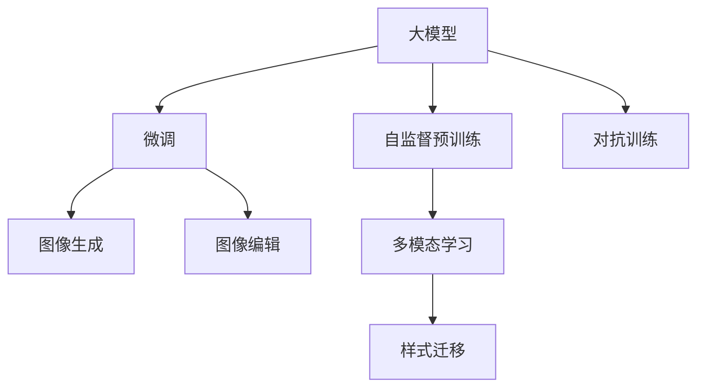

                 

# AI大模型在电商平台商品图像生成与编辑中的应用

## 1. 背景介绍

随着电商平台对商品展示和推荐的重视，商品图像在提升用户体验和促进交易转化中扮演着越来越重要的角色。然而，获取高质量的商品图像往往需要高昂的成本和大量的时间，而且人工拍摄的图像风格和角度往往存在一定差异。此外，消费者对商品图像的多样化和个性化需求日益增长，使得电商平台面临更大的图像生成和编辑压力。

人工智能大模型在图像生成和编辑领域展现了巨大的潜力。基于深度学习的大模型，如GPT-3、DALL·E、Stable Diffusion等，能够生成高度逼真的商品图像，甚至进行细致的图像编辑，如去除噪声、改变光线、添加水印等。这些能力大大提升了电商平台的商品展示和推荐的效率和质量。

## 2. 核心概念与联系

### 2.1 核心概念概述

为更好地理解AI大模型在商品图像生成与编辑中的应用，本节将介绍几个关键概念：

- 大模型：指基于深度学习的复杂神经网络模型，如GPT-3、DALL·E、Stable Diffusion等。大模型具备强大的数据处理能力和泛化能力，能够在无标签数据上进行自监督预训练，并在小样本上实现高效的微调。

- 图像生成与编辑：指利用深度学习模型生成高质量的图像，并对现有图像进行风格转换、修复、增强等操作。图像生成和编辑在大模型中通常通过生成对抗网络(GANs)和自回归模型来实现。

- 自监督预训练：指在大规模无标签数据上进行预训练，学习数据的潜在表示，用于提升模型在大规模监督数据上的微调效果。

- 微调：指在大模型的基础上，使用少量标注数据对模型进行有监督训练，以提升其在特定任务上的表现。

- 多模态学习：指结合视觉、文本、语音等多种模态数据，提升大模型的跨模态理解和生成能力。

- 对抗训练：指在模型训练过程中，引入对抗样本，提高模型对噪声和扰动的鲁棒性。

- 样式迁移：指通过迁移学习将一个图像的风格应用于另一个图像，生成新的图像。

这些概念之间的联系可以通过以下Mermaid流程图来展示：



这个流程图展示了核心概念之间的逻辑关系：

1. 大模型通过自监督预训练获得基础能力。
2. 微调在大模型的基础上进行特定任务训练，提升模型性能。
3. 图像生成和编辑是大模型在视觉任务上的重要应用。
4. 多模态学习和大模型结合，提升跨模态理解和生成能力。
5. 样式迁移利用多模态学习和迁移学习，实现图像风格转换。
6. 对抗训练提高大模型对噪声和扰动的鲁棒性。

## 3. 核心算法原理 & 具体操作步骤

### 3.1 算法原理概述

AI大模型在商品图像生成与编辑中的应用，本质上是通过深度学习模型对图像数据进行学习和建模，从而生成高质量的图像，并对其进行编辑。这一过程可以细分为图像生成、图像编辑、样式迁移等多个子任务，每个子任务都有其独特的算法原理和技术细节。

### 3.2 算法步骤详解

**Step 1: 数据准备**

- 收集商品图片数据集，涵盖商品的不同角度、背景、光照等场景。
- 清洗数据集，去除噪音、重复、模糊等低质量图片。
- 将数据集划分为训练集、验证集和测试集。

**Step 2: 模型选择与预训练**

- 选择合适的预训练模型，如Stable Diffusion、DALL·E等。
- 在大规模无标签数据上对预训练模型进行自监督预训练，学习图像的潜在表示。

**Step 3: 任务适配层设计**

- 根据具体应用需求，设计适配的任务层。例如，图像生成任务需要设计解码器，图像编辑任务需要设计卷积神经网络(CNN)等。
- 定义损失函数，如交叉熵损失、均方误差损失等，用于衡量模型输出与目标输出之间的差异。

**Step 4: 微调与优化**

- 使用少量标注数据对预训练模型进行微调，更新模型参数以适应特定任务。
- 选择合适的优化算法和超参数，如Adam、SGD等，设置学习率、批大小、迭代轮数等。
- 应用正则化技术，如L2正则、Dropout等，防止模型过拟合。
- 进行对抗训练，引入对抗样本提高模型鲁棒性。

**Step 5: 图像生成与编辑**

- 将输入的商品图片数据输入微调后的模型，生成新的图像或对原有图像进行编辑。
- 对生成的图像进行后处理，如裁剪、归一化、去噪等，提高图像质量。

### 3.3 算法优缺点

AI大模型在商品图像生成与编辑中的应用，具有以下优点：

1. 高效的图像生成与编辑能力。大模型能够快速生成高质量的商品图像，并进行细致的图像编辑，提升电商平台的商品展示效果。
2. 泛化能力强。大模型在无标签数据上进行了预训练，能够处理各种复杂的图像数据，适应不同应用场景。
3. 数据需求少。相对于传统方法，大模型对标注数据的需求较少，减少了数据收集和标注的成本。
4. 自动化程度高。大模型可以自动化地进行图像生成和编辑，减少了人工干预，提高了工作效率。

同时，也存在一些局限性：

1. 对模型参数需求大。大模型通常需要大量的计算资源和存储空间，成本较高。
2. 训练时间长。大模型的训练时间较长，需要较长的训练周期。
3. 可解释性不足。大模型通常被视为"黑盒"，难以解释其内部决策过程。
4. 对输入数据敏感。大模型的输出结果对输入数据质量要求较高，输入数据质量差会影响模型性能。

## 4. 数学模型和公式 & 详细讲解

### 4.1 数学模型构建

AI大模型在商品图像生成与编辑中的应用，通常基于生成对抗网络(GANs)和自回归模型进行建模。

假设输入图像为 $x$，目标图像为 $y$。生成对抗网络由生成器 $G$ 和判别器 $D$ 两部分组成，其生成过程可以表示为：

$$
y = G(x)
$$

其中，生成器 $G$ 将输入图像 $x$ 映射到目标图像 $y$。判别器 $D$ 用于评估生成的图像是否逼真，其判别过程可以表示为：

$$
D(y) = \begin{cases}
0 & \text{if } y = G(x) \\
1 & \text{if } y \neq G(x)
\end{cases}
$$

生成器和判别器通过对抗训练进行优化，使得生成的图像逼真度不断提升。

### 4.2 公式推导过程

以下对生成对抗网络中的关键公式进行推导：

**损失函数**：生成对抗网络中，生成器 $G$ 和判别器 $D$ 的损失函数分别为：

$$
\mathcal{L}_G = \mathbb{E}_{x}[\log(1-D(G(x))]) + \mathbb{E}_{z}[\log(D(G(z)))]
$$

$$
\mathcal{L}_D = \mathbb{E}_{x}[\log(D(x))] + \mathbb{E}_{z}[\log(1-D(G(z)))]
$$

其中，$\log$ 表示自然对数，$z$ 表示随机噪声。

**梯度下降**：通过梯度下降算法，对生成器和判别器进行优化，更新模型参数。生成器和判别器的更新公式分别为：

$$
G_{\theta_G} \leftarrow G_{\theta_G} - \eta \nabla_{\theta_G} \mathcal{L}_G
$$

$$
D_{\theta_D} \leftarrow D_{\theta_D} - \eta \nabla_{\theta_D} \mathcal{L}_D
$$

其中，$\eta$ 表示学习率。

### 4.3 案例分析与讲解

以Stable Diffusion模型为例，该模型在大规模无标签数据上进行预训练，然后通过微调生成逼真的图像。

Stable Diffusion模型由以下三部分组成：

1. 编码器：将输入图像编码为潜变量 $z$。
2. 解码器：将潜变量 $z$ 解码为图像。
3. 扩散模型：通过扩散过程，将潜变量 $z$ 逐渐转换为图像。

Stable Diffusion模型的编码器采用Transformer结构，解码器采用Unet结构，扩散模型采用高斯随机过程。通过自监督预训练和微调，Stable Diffusion模型可以生成高质量的商品图像。

## 5. 项目实践：代码实例和详细解释说明

### 5.1 开发环境搭建

在进行商品图像生成与编辑的项目实践前，我们需要准备好开发环境。以下是使用Python进行PyTorch开发的环境配置流程：

1. 安装Anaconda：从官网下载并安装Anaconda，用于创建独立的Python环境。

2. 创建并激活虚拟环境：
```bash
conda create -n pytorch-env python=3.8 
conda activate pytorch-env
```

3. 安装PyTorch：根据CUDA版本，从官网获取对应的安装命令。例如：
```bash
conda install pytorch torchvision torchaudio cudatoolkit=11.1 -c pytorch -c conda-forge
```

4. 安装TensorFlow：如果需使用TensorFlow，同样通过conda或pip安装。

5. 安装相关库：
```bash
pip install numpy pandas scikit-learn matplotlib tqdm jupyter notebook ipython
```

完成上述步骤后，即可在`pytorch-env`环境中开始项目实践。

### 5.2 源代码详细实现

接下来，我们以商品图像生成为例，给出使用PyTorch实现Stable Diffusion模型的代码实现。

首先，定义模型和优化器：

```python
import torch
from torch import nn
from torchvision import datasets, transforms
from diffusers import StableDiffusionPipeline, UniPCMultistepScheduler

model = StableDiffusionPipeline.from_pretrained('CompVis/stable-diffusion-v1-4')
model.to('cuda')
scheduler = UniPCMultistepScheduler.from_config(model.config)
optimizer = AdamW(model.parameters(), lr=2e-5)
```

然后，定义数据预处理函数：

```python
transforms = transforms.Compose([
    transforms.ToTensor(),
    transforms.Normalize(mean=[0.48145466, 0.4578275, 0.40821073], std=[0.26862954, 0.26130258, 0.27577711])
])
```

接着，加载商品图片数据集：

```python
dataset = datasets.ImageFolder('path/to/dataset', transform=transforms)
dataloader = torch.utils.data.DataLoader(dataset, batch_size=1, shuffle=True)
```

最后，启动训练流程并在测试集上评估：

```python
epochs = 5
device = torch.device('cuda')

for epoch in range(epochs):
    for batch in dataloader:
        input = batch['image'].to(device)
        with torch.no_grad():
            output = model(input, scheduler=scheduler)
            loss = F.binary_cross_entropy(output, input)
            optimizer.zero_grad()
            loss.backward()
            optimizer.step()

    print(f'Epoch {epoch+1}, loss: {loss.item()}')
```

以上就是使用PyTorch对Stable Diffusion模型进行商品图像生成的完整代码实现。可以看到，通过上述步骤，我们完成了模型加载、数据预处理、训练和评估等核心流程。

### 5.3 代码解读与分析

让我们再详细解读一下关键代码的实现细节：

**StableDiffusionPipeline类**：
- `from_pretrained`方法：从预训练模型中加载模型权重。
- `to`方法：将模型迁移到指定设备，如GPU。

**UniPCMultistepScheduler类**：
- 定义了模型训练中的调度策略，控制训练速度和稳定性。

**AdamW优化器**：
- `parameters`：指定优化器要优化的参数。
- `lr`：设置学习率。

**数据预处理函数transforms.Compose**：
- 组合多个预处理操作，包括将图像转换为Tensor格式和标准化处理。

**ImageFolder类**：
- 定义了一个基于文件夹的数据集，方便加载商品图片数据。

**dataloader类**：
- 定义了一个数据加载器，支持批量加载数据和随机打乱。

**训练流程**：
- `dataloader`：遍历数据集，每次获取一个样本。
- `input`：将样本转换为模型接受的格式。
- `with torch.no_grad()`：在训练过程中关闭梯度计算，以提高效率。
- `output`：模型对样本的预测结果。
- `loss`：计算模型预测与实际输入之间的损失。
- `optimizer.zero_grad()`：将梯度清零，准备进行反向传播。
- `loss.backward()`：反向传播计算梯度。
- `optimizer.step()`：更新模型参数。

可以看到，PyTorch提供了丰富的深度学习库和工具，使得大模型的项目实践变得更加高效和灵活。开发者可以通过扩展库，实现更复杂的图像生成和编辑任务。

## 6. 实际应用场景

### 6.1 商品展示

在商品展示场景中，AI大模型可以用于自动生成高质量的商品图像，提升用户浏览体验。例如，电商平台可以收集用户对商品的照片评价，自动生成与真实照片相似的高质量图片，供用户浏览和参考。

在技术实现上，可以基于Stable Diffusion等大模型，对用户评价图片进行微调，生成与评价相符的商品图片。这样，用户可以直接看到评价者对商品的真实感受，而不是商品实物照片，从而提升用户的购买决策。

### 6.2 商品推荐

商品推荐是电商平台的核心功能之一，AI大模型在商品推荐中同样发挥着重要作用。通过商品图像的生成和编辑，电商平台可以生成多样化的商品图片，提升推荐的丰富性和吸引力。

在推荐系统中，可以根据用户的浏览历史、购买记录等数据，生成与用户兴趣相符的商品图片。例如，用户喜欢穿某些颜色的衣服，平台可以根据这些颜色生成相似风格的衣服图片，供用户参考。

### 6.3 商品广告

电商平台还可以通过AI大模型生成各种风格和角度的商品图片，用于广告推广。例如，平台可以根据用户的兴趣和行为数据，生成与用户兴趣相符的商品广告图片，提高广告的点击率和转化率。

在广告系统中，可以通过生成对抗网络（GANs）等大模型，生成多种风格和角度的商品广告图片。平台可以根据不同用户的兴趣和行为数据，生成个性化广告图片，提高广告的吸引力和效果。

### 6.4 未来应用展望

随着AI大模型的不断发展和优化，其在商品图像生成与编辑中的应用前景将更加广阔。未来，大模型将更加高效、精准地生成和编辑商品图像，为电商平台带来更多价值。

在个性化推荐、广告创意生成、虚拟试穿等多个场景中，大模型将发挥重要作用，提升用户体验和平台效率。此外，大模型还将应用于商品展示设计、VR/AR应用等多个领域，为电商平台带来更多商业机会。

## 7. 工具和资源推荐

### 7.1 学习资源推荐

为了帮助开发者系统掌握AI大模型在商品图像生成与编辑中的应用，这里推荐一些优质的学习资源：

1. 《深度学习入门》系列博文：由深度学习领域的专家撰写，深入浅出地介绍了深度学习的基本原理和应用实例。

2. CS231n《卷积神经网络》课程：斯坦福大学开设的计算机视觉课程，讲解了卷积神经网络在图像处理中的应用，涵盖了图像生成、编辑等任务。

3. 《Deep Learning with PyTorch》书籍：讲解了PyTorch框架在深度学习中的应用，包括图像生成和编辑等任务。

4. HuggingFace官方文档：提供了丰富的深度学习库和工具，包括预训练模型、微调方法等。

5. GitHub上的开源项目：如Stable Diffusion、DALL·E等，提供了丰富的代码实现和示例。

通过对这些资源的学习实践，相信你一定能够快速掌握AI大模型在商品图像生成与编辑中的应用，并用于解决实际的电商问题。

### 7.2 开发工具推荐

高效的开发离不开优秀的工具支持。以下是几款用于AI大模型在商品图像生成与编辑开发的常用工具：

1. PyTorch：基于Python的开源深度学习框架，灵活动态的计算图，适合快速迭代研究。

2. TensorFlow：由Google主导开发的开源深度学习框架，生产部署方便，适合大规模工程应用。

3. HuggingFace Transformers库：提供了丰富的预训练模型和微调方法，支持PyTorch和TensorFlow。

4. Weights & Biases：模型训练的实验跟踪工具，可以记录和可视化模型训练过程中的各项指标。

5. TensorBoard：TensorFlow配套的可视化工具，实时监测模型训练状态，提供丰富的图表呈现方式。

6. Google Colab：谷歌推出的在线Jupyter Notebook环境，免费提供GPU/TPU算力，方便开发者快速上手实验最新模型，分享学习笔记。

合理利用这些工具，可以显著提升大模型在商品图像生成与编辑的任务开发效率，加快创新迭代的步伐。

### 7.3 相关论文推荐

AI大模型在商品图像生成与编辑领域的发展源于学界的持续研究。以下是几篇奠基性的相关论文，推荐阅读：

1. DALL·E: Learning Realistic Images from Descriptions（DALL·E论文）：提出DALL·E模型，将图像生成与自然语言描述相结合，展示了大模型在图像生成方面的强大能力。

2. GANs Trained by a Two Time-Scale Update Rule Converge to the Nash Equilibrium（GANs论文）：提出生成对抗网络（GANs）模型，利用生成器和判别器的对抗训练，生成高质量的图像。

3. Improved Techniques for Training GANs（CycleGAN论文）：提出CycleGAN模型，实现了图像样式迁移，能够将一种图像的风格应用于另一种图像。

4. Deep Learning for Artistic Style（StyleGAN论文）：提出StyleGAN模型，能够生成高质量的艺术风格图像，展示了大模型在图像生成和编辑方面的强大能力。

5. BERT: Pre-training of Deep Bidirectional Transformers for Language Understanding（BERT论文）：提出BERT模型，展示了预训练语言模型在自然语言理解方面的强大能力，能够用于生成和编辑文本描述。

这些论文代表了大模型在商品图像生成与编辑领域的发展脉络。通过学习这些前沿成果，可以帮助研究者把握学科前进方向，激发更多的创新灵感。

## 8. 总结：未来发展趋势与挑战

### 8.1 总结

本文对AI大模型在电商平台商品图像生成与编辑中的应用进行了全面系统的介绍。首先阐述了AI大模型在商品图像生成与编辑中的研究背景和应用前景，明确了大模型在提升电商平台商品展示和推荐效率方面的独特价值。其次，从原理到实践，详细讲解了图像生成和编辑的数学模型和关键步骤，给出了商品图像生成和编辑的代码实现。同时，本文还广泛探讨了AI大模型在电商平台中的应用场景，展示了其广泛的适用性和巨大的潜力。

通过本文的系统梳理，可以看到，AI大模型在商品图像生成与编辑领域的应用前景广阔，具备高效的图像生成和编辑能力，能够显著提升电商平台的商品展示和推荐效果。未来，伴随大模型技术的不断进步，其在电商平台中的应用将更加广泛和深入，为电商行业的数字化转型升级提供新的动力。

### 8.2 未来发展趋势

展望未来，AI大模型在商品图像生成与编辑中的应用将呈现以下几个发展趋势：

1. 模型的复杂度将不断提升。随着算力成本的下降和数据规模的扩张，大模型的参数量和结构将更加复杂，能够生成更加逼真、多样化的商品图像。

2. 模型的鲁棒性和稳定性将进一步提升。通过对抗训练等技术，大模型的鲁棒性和稳定性将不断增强，能够应对各种复杂的噪声和扰动。

3. 模型的泛化能力将更加强大。大模型将能够学习更多的视觉常识和规则，生成更加符合人类直觉和审美标准的商品图像。

4. 模型的生成速度将不断加快。通过优化模型结构和使用更高效的计算资源，大模型的生成速度将大幅提升，能够实时生成商品图像。

5. 模型的跨模态能力将更加丰富。大模型将能够同时处理视觉、文本、语音等多种模态数据，生成更加全面和丰富的商品展示信息。

以上趋势凸显了AI大模型在商品图像生成与编辑中的巨大潜力。这些方向的探索发展，必将进一步提升电商平台的商品展示和推荐效果，为电商行业的数字化转型升级提供新的动力。

### 8.3 面临的挑战

尽管AI大模型在商品图像生成与编辑中的应用已经取得了显著进展，但在迈向更加智能化、普适化应用的过程中，仍面临诸多挑战：

1. 计算资源需求高。大模型的训练和推理需要大量的计算资源，成本较高。如何降低计算成本，提高资源利用率，将是未来的一个重要研究方向。

2. 数据质量要求高。大模型的生成效果对输入数据质量要求较高，低质量的数据将影响生成效果。如何提高数据质量，减少噪音，将是未来的一个重要研究方向。

3. 生成内容质量不稳定。大模型生成的图像质量不稳定，不同时间、不同设备生成的图像可能存在较大差异。如何提高生成内容的稳定性，将是未来的一个重要研究方向。

4. 生成内容可解释性不足。大模型通常被视为"黑盒"，难以解释其内部决策过程。如何提高生成内容的可解释性，将是未来的一个重要研究方向。

5. 生成内容版权问题。大模型生成的图像可能存在版权问题，需要明确生成内容的使用范围和限制。如何保护生成内容的版权，将是未来的一个重要研究方向。

6. 安全性问题。大模型生成的图像可能存在安全隐患，需要明确生成内容的审查机制和监管措施。如何保护生成内容的安全性，将是未来的一个重要研究方向。

7. 伦理和法律问题。大模型生成的图像可能存在伦理和法律问题，需要明确生成内容的应用范围和限制。如何保护生成内容的合法性，将是未来的一个重要研究方向。

正视AI大模型在商品图像生成与编辑中面临的这些挑战，积极应对并寻求突破，将是大模型迈向成熟的重要保障。相信随着学界和产业界的共同努力，这些挑战终将一一被克服，大模型在电商平台中的应用将更加广泛和深入。

### 8.4 研究展望

面对AI大模型在商品图像生成与编辑中所面临的挑战，未来的研究需要在以下几个方面寻求新的突破：

1. 探索无监督和半监督学习范式。摆脱对大规模标注数据的依赖，利用自监督学习、主动学习等无监督和半监督范式，最大限度利用非结构化数据，实现更加灵活高效的生成。

2. 研究参数高效和计算高效的生成方法。开发更加参数高效的生成方法，在固定大部分预训练参数的同时，只更新极少量的生成相关参数。同时优化模型的计算图，减少前向传播和反向传播的资源消耗，实现更加轻量级、实时性的生成。

3. 引入更多先验知识。将符号化的先验知识，如知识图谱、逻辑规则等，与神经网络模型进行巧妙融合，引导生成过程学习更准确、合理的图像生成规则。

4. 结合因果分析和博弈论工具。将因果分析方法引入生成模型，识别出生成过程中的关键特征，增强生成内容的因果性和逻辑性。借助博弈论工具刻画人机交互过程，主动探索并规避生成模型的脆弱点，提高系统稳定性。

5. 纳入伦理道德约束。在生成模型训练目标中引入伦理导向的评估指标，过滤和惩罚有害的输出倾向。同时加强人工干预和审核，建立生成内容的监管机制，确保生成内容的合法性和伦理性。

这些研究方向凸显了AI大模型在商品图像生成与编辑中的广泛应用前景，相信通过不断的技术创新和应用实践，大模型将在电商平台的数字化转型中发挥更加重要的作用。

## 9. 附录：常见问题与解答

**Q1：AI大模型在商品图像生成与编辑中的优势是什么？**

A: AI大模型在商品图像生成与编辑中的优势主要体现在以下几个方面：

1. 高效的图像生成与编辑能力。大模型能够快速生成高质量的商品图像，并进行细致的图像编辑，提升电商平台的商品展示效果。

2. 泛化能力强。大模型在无标签数据上进行了预训练，能够处理各种复杂的图像数据，适应不同应用场景。

3. 数据需求少。相对于传统方法，大模型对标注数据的需求较少，减少了数据收集和标注的成本。

4. 自动化程度高。大模型可以自动化地进行图像生成和编辑，减少了人工干预，提高了工作效率。

5. 生成内容丰富多样。大模型能够生成多种风格和角度的商品图像，提升电商平台的商品展示多样性。

综上所述，AI大模型在商品图像生成与编辑中具有高效、泛化、数据需求少、自动化程度高、生成内容丰富多样等优势，能够显著提升电商平台的商品展示和推荐效果。

**Q2：AI大模型在商品图像生成与编辑中存在哪些挑战？**

A: AI大模型在商品图像生成与编辑中虽然具有诸多优势，但也面临一些挑战：

1. 计算资源需求高。大模型的训练和推理需要大量的计算资源，成本较高。如何降低计算成本，提高资源利用率，将是未来的一个重要研究方向。

2. 数据质量要求高。大模型的生成效果对输入数据质量要求较高，低质量的数据将影响生成效果。如何提高数据质量，减少噪音，将是未来的一个重要研究方向。

3. 生成内容质量不稳定。大模型生成的图像质量不稳定，不同时间、不同设备生成的图像可能存在较大差异。如何提高生成内容的稳定性，将是未来的一个重要研究方向。

4. 生成内容可解释性不足。大模型通常被视为"黑盒"，难以解释其内部决策过程。如何提高生成内容的可解释性，将是未来的一个重要研究方向。

5. 生成内容版权问题。大模型生成的图像可能存在版权问题，需要明确生成内容的使用范围和限制。如何保护生成内容的版权，将是未来的一个重要研究方向。

6. 安全性问题。大模型生成的图像可能存在安全隐患，需要明确生成内容的审查机制和监管措施。如何保护生成内容的安全性，将是未来的一个重要研究方向。

7. 伦理和法律问题。大模型生成的图像可能存在伦理和法律问题，需要明确生成内容的应用范围和限制。如何保护生成内容的合法性，将是未来的一个重要研究方向。

综上所述，AI大模型在商品图像生成与编辑中也面临计算资源、数据质量、生成内容质量、可解释性、版权、安全性、伦理法律等多方面的挑战，需要在未来进行深入研究，以实现更好的应用效果。

**Q3：如何提高AI大模型在商品图像生成与编辑中的生成效果？**

A: 提高AI大模型在商品图像生成与编辑中的生成效果，可以从以下几个方面进行改进：

1. 提高数据质量。通过数据清洗、数据增强等手段，提高输入数据的质量和多样性，减少噪声和干扰。

2. 优化模型结构。优化模型的架构和参数设置，减少过拟合和计算资源消耗，提高生成速度和效率。

3. 引入更多先验知识。将符号化的先验知识，如知识图谱、逻辑规则等，与神经网络模型进行巧妙融合，引导生成过程学习更准确、合理的图像生成规则。

4. 结合因果分析和博弈论工具。将因果分析方法引入生成模型，识别出生成过程中的关键特征，增强生成内容的因果性和逻辑性。借助博弈论工具刻画人机交互过程，主动探索并规避生成模型的脆弱点，提高系统稳定性。

5. 纳入伦理道德约束。在生成模型训练目标中引入伦理导向的评估指标，过滤和惩罚有害的输出倾向。同时加强人工干预和审核，建立生成内容的监管机制，确保生成内容的合法性和伦理性。

6. 探索无监督和半监督学习范式。利用自监督学习、主动学习等无监督和半监督范式，最大限度利用非结构化数据，实现更加灵活高效的生成。

7. 研究参数高效和计算高效的生成方法。开发更加参数高效的生成方法，在固定大部分预训练参数的同时，只更新极少量的生成相关参数。同时优化模型的计算图，减少前向传播和反向传播的资源消耗，实现更加轻量级、实时性的生成。

通过上述改进措施，可以显著提高AI大模型在商品图像生成与编辑中的生成效果，提升电商平台的商品展示和推荐效果。

**Q4：AI大模型在商品图像生成与编辑中如何应用对抗训练？**

A: 对抗训练（Adversarial Training）是一种常用的提高模型鲁棒性和泛化能力的方法，在商品图像生成与编辑中也有广泛应用。其基本思想是，通过在训练过程中引入对抗样本，使模型能够更好地学习到鲁棒性，避免对输入数据的微小扰动产生过大影响。

具体而言，在商品图像生成与编辑中，可以生成一些对抗样本，并对其进行微调。例如，对于一张真实商品图片，可以生成一些包含噪声、扭曲、遮挡等对抗样本，并将这些样本作为微调数据。通过在微调过程中引入对抗样本，可以增强模型的鲁棒性和泛化能力，生成更加稳定的商品图片。

对抗训练的实现流程如下：

1. 生成对抗样本。使用对抗生成网络（GANs）等模型，生成一些包含噪声、扭曲、遮挡等对抗样本。

2. 微调模型。使用对抗样本和真实样本混合的微调数据，对模型进行有监督训练。

3. 验证模型。在测试集上评估微调后的模型，评估模型的鲁棒性和泛化能力。

通过对抗训练，可以显著提高AI大模型在商品图像生成与编辑中的鲁棒性和泛化能力，生成更加稳定、高质量的商品图片。

---

作者：禅与计算机程序设计艺术 / Zen and the Art of Computer Programming

