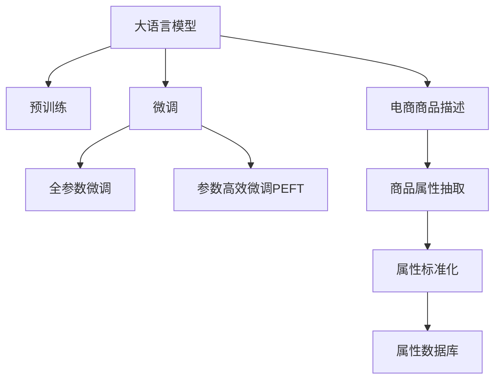

                 

## 1. 背景介绍

### 1.1 问题由来

在当前电商领域，商品属性的抽取与标准化对于搜索引擎优化、个性化推荐、购物体验等方面具有重要影响。但由于商品描述中的属性信息格式不一、噪音较多，自动抽取和标准化这些信息成为电商平台数据处理的一大难题。现有技术手段如基于规则的抽取、传统机器学习模型等，存在规则编写复杂、模型泛化能力不足等问题，难以适应快速变化的电商商品描述。

大语言模型如GPT、BERT等，通过在大规模无标签文本数据上进行自监督学习，获得了丰富的语言知识。这些模型被广泛应用于自然语言处理领域，展示出强大的文本理解和生成能力。如何利用这些大模型在电商平台商品属性抽取与标准化中发挥作用，是一个值得探讨的新方向。

### 1.2 问题核心关键点

大语言模型在电商平台商品属性抽取与标准化中的应用，其核心在于如何充分利用模型预训练获得的知识，通过微调训练，提升模型对电商商品描述中的属性信息进行自动抽取和标准化的能力。具体的关键点包括：

- 选择合适的预训练模型：如GPT、BERT等，这些模型在自然语言处理领域表现优异。
- 设计任务适配层：根据电商商品属性信息的特点，设计合适的模型输出层和损失函数。
- 微调优化：选择合适的超参数，利用标签数据对模型进行优化训练。
- 推理与部署：将训练好的模型集成到电商平台的商品信息抽取系统中，实时处理新商品描述。

这些关键点构成了利用大语言模型在电商领域属性抽取与标准化的整体框架。

## 2. 核心概念与联系

### 2.1 核心概念概述

为更好地理解大语言模型在电商商品属性抽取与标准化中的应用，本节将介绍几个密切相关的核心概念：

- 大语言模型(Large Language Model, LLM)：以自回归(如GPT)或自编码(如BERT)模型为代表的大规模预训练语言模型。通过在大规模无标签文本语料上进行预训练，学习通用的语言表示，具备强大的语言理解和生成能力。
- 预训练(Pre-training)：指在大规模无标签文本语料上，通过自监督学习任务训练通用语言模型的过程。常见的预训练任务包括言语建模、掩码语言模型等。预训练使得模型学习到语言的通用表示。
- 微调(Fine-tuning)：指在预训练模型的基础上，使用下游任务的少量标注数据，通过有监督学习优化模型在该任务上的性能。通常只需要调整顶层分类器或解码器，并以较小的学习率更新全部或部分的模型参数。
- 迁移学习(Transfer Learning)：指将一个领域学习到的知识，迁移应用到另一个不同但相关的领域的学习范式。大模型的预训练-微调过程即是一种典型的迁移学习方式。
- 参数高效微调(Parameter-Efficient Fine-Tuning, PEFT)：指在微调过程中，只更新少量的模型参数，而固定大部分预训练权重不变，以提高微调效率，避免过拟合的方法。
- 电商商品描述：商品在电商平台上的销售页面描述文本，通常包含商品属性信息、描述内容、评价等，对电商平台的用户体验和个性化推荐具有重要影响。
- 商品属性：指商品描述中的可量化、可比较的属性特征，如品牌、尺码、颜色等。

这些核心概念之间的逻辑关系可以通过以下Mermaid流程图来展示：



这个流程图展示了大语言模型的核心概念及其之间的关系：

1. 大语言模型通过预训练获得基础能力。
2. 微调是对预训练模型进行任务特定的优化，可以分为全参数微调和参数高效微调（PEFT）。
3. 电商商品描述是微调的具体应用场景。
4. 商品属性抽取是微调的具体任务，属性标准化则是该任务的一个子任务。
5. 最终的属性信息存储在属性数据库中，供电商平台的搜索、推荐等系统使用。

这些概念共同构成了利用大语言模型在电商领域进行商品属性抽取与标准化的整体框架。

## 3. 核心算法原理 & 具体操作步骤
### 3.1 算法原理概述

基于大语言模型的电商商品属性抽取与标准化方法，本质上是一种基于监督学习的迁移学习过程。其核心思想是：将预训练的大语言模型视作一个强大的"特征提取器"，通过在电商商品描述数据集上进行有监督的微调，使得模型能够自动抽取和标准化商品描述中的属性信息。

形式化地，假设预训练模型为 $M_{\theta}$，其中 $\theta$ 为预训练得到的模型参数。给定电商商品描述数据集 $D=\{(x_i, y_i)\}_{i=1}^N$，其中 $x_i$ 为商品描述文本，$y_i$ 为相应的属性信息。微调的目标是找到新的模型参数 $\hat{\theta}$，使得：

$$
\hat{\theta}=\mathop{\arg\min}_{\theta} \mathcal{L}(M_{\theta},D)
$$

其中 $\mathcal{L}$ 为针对电商商品属性抽取任务设计的损失函数，用于衡量模型预测属性信息与真实标签之间的差异。常见的损失函数包括交叉熵损失、均方误差损失等。

通过梯度下降等优化算法，微调过程不断更新模型参数 $\theta$，最小化损失函数 $\mathcal{L}$，使得模型输出逼近真实标签。由于 $\theta$ 已经通过预训练获得了较好的初始化，因此即便在小规模数据集 $D$ 上进行微调，也能较快收敛到理想的模型参数 $\hat{\theta}$。

### 3.2 算法步骤详解

基于大语言模型在电商商品属性抽取与标准化中的应用，一般包括以下几个关键步骤：

**Step 1: 准备预训练模型和数据集**
- 选择合适的预训练语言模型 $M_{\theta}$ 作为初始化参数，如 BERT、GPT等。
- 准备电商商品描述数据集 $D$，划分为训练集、验证集和测试集。一般要求数据与预训练数据的分布不要差异过大。

**Step 2: 设计任务适配层**
- 根据电商商品描述中属性信息的特点，设计合适的输出层和损失函数。
- 对于属性抽取任务，通常在顶层添加序列到标签的交叉熵损失函数。
- 对于属性标准化任务，可以设计多类别分类器进行属性类别预测，并使用交叉熵损失。

**Step 3: 设置微调超参数**
- 选择合适的优化算法及其参数，如 AdamW、SGD 等，设置学习率、批大小、迭代轮数等。
- 设置正则化技术及强度，包括权重衰减、Dropout、Early Stopping等。
- 确定冻结预训练参数的策略，如仅微调顶层，或全部参数都参与微调。

**Step 4: 执行梯度训练**
- 将训练集数据分批次输入模型，前向传播计算损失函数。
- 反向传播计算参数梯度，根据设定的优化算法和学习率更新模型参数。
- 周期性在验证集上评估模型性能，根据性能指标决定是否触发 Early Stopping。
- 重复上述步骤直到满足预设的迭代轮数或 Early Stopping 条件。

**Step 5: 测试和部署**
- 在测试集上评估微调后模型 $M_{\hat{\theta}}$ 的性能，对比微调前后的精度提升。
- 使用微调后的模型对新商品描述进行属性抽取与标准化，集成到电商平台的商品信息抽取系统中。
- 持续收集新的商品描述，定期重新微调模型，以适应数据分布的变化。

以上是基于大语言模型在电商领域商品属性抽取与标准化的通用流程。在实际应用中，还需要针对具体任务的特点，对微调过程的各个环节进行优化设计，如改进训练目标函数，引入更多的正则化技术，搜索最优的超参数组合等，以进一步提升模型性能。

### 3.3 算法优缺点

基于大语言模型在电商商品属性抽取与标准化中的应用方法，具有以下优点：

1. 简单高效。只需准备少量标注数据，即可对预训练模型进行快速适配，获得较大的性能提升。
2. 泛化能力强。大模型经过大规模无标签语料预训练，具备强大的语言理解能力，能够在多种电商商品描述中表现优异。
3. 适应性强。电商商品描述的快速变化能够被模型实时适应，保证属性抽取与标准化的准确性。
4. 可解释性高。大语言模型的预训练与微调过程透明，能够提供较好的推理解释。

同时，该方法也存在一定的局限性：

1. 依赖标注数据。微调的效果很大程度上取决于标注数据的质量和数量，获取高质量标注数据的成本较高。
2. 模型复杂度高。大语言模型的参数量较大，推理速度较慢，内存占用高。
3. 部分属性信息可能缺失。电商商品描述中存在属性缺失的情况，模型难以准确抽取。
4. 应用场景受限。当前方法主要应用于商品属性抽取与标准化，对商品描述外的场景处理能力有限。

尽管存在这些局限性，但就目前而言，基于大语言模型的商品属性抽取与标准化方法仍是大语言模型应用的最主流范式。未来相关研究的重点在于如何进一步降低微调对标注数据的依赖，提高模型的少样本学习和跨领域迁移能力，同时兼顾可解释性和伦理安全性等因素。

### 3.4 算法应用领域

基于大语言模型在电商商品属性抽取与标准化的方法，已经在电商平台的商品搜索、推荐、广告投放等众多场景中得到应用，为电商平台的运营效率和用户体验带来了显著提升。具体应用场景包括：

- **商品搜索**：利用商品属性信息进行精准匹配，提升搜索排名和用户体验。
- **个性化推荐**：分析用户对商品属性的偏好，进行个性化推荐，提升用户转化率。
- **广告投放**：利用商品属性信息进行精准广告投放，提升广告点击率和转化率。
- **用户反馈分析**：通过分析用户对商品属性的评价，优化商品描述和推荐系统。

除了上述这些经典应用外，大语言模型在电商领域的应用还在不断拓展，如实时商品属性更新、多模态商品信息抽取等，为电商平台带来了新的突破。随着大语言模型的不断进步，相信其在电商领域的广泛应用将进一步推动电商技术的迭代和升级。

## 4. 数学模型和公式 & 详细讲解  
### 4.1 数学模型构建

本节将使用数学语言对基于大语言模型的电商商品属性抽取与标准化的微调过程进行更加严格的刻画。

记预训练语言模型为 $M_{\theta}$，其中 $\theta$ 为预训练得到的模型参数。假设电商商品描述数据集为 $D=\{(x_i,y_i)\}_{i=1}^N, x_i \in \mathcal{X}, y_i \in \mathcal{Y}$。其中 $\mathcal{X}$ 为电商商品描述的文本集合，$\mathcal{Y}$ 为属性信息集合。

定义模型 $M_{\theta}$ 在输入 $x$ 上的输出为 $\hat{y}=M_{\theta}(x) \in \mathcal{Y}$，表示模型预测的商品属性信息。真实标签 $y \in \mathcal{Y}$。则电商商品属性抽取任务的交叉熵损失函数定义为：

$$
\ell(M_{\theta}(x),y) = -[y\log \hat{y} + (1-y)\log (1-\hat{y})]
$$

将其代入经验风险公式，得：

$$
\mathcal{L}(\theta) = -\frac{1}{N}\sum_{i=1}^N [y_i\log M_{\theta}(x_i)+(1-y_i)\log(1-M_{\theta}(x_i))]
$$

根据链式法则，损失函数对参数 $\theta_k$ 的梯度为：

$$
\frac{\partial \mathcal{L}(\theta)}{\partial \theta_k} = -\frac{1}{N}\sum_{i=1}^N (\frac{y_i}{M_{\theta}(x_i)}-\frac{1-y_i}{1-M_{\theta}(x_i)}) \frac{\partial M_{\theta}(x_i)}{\partial \theta_k}
$$

其中 $\frac{\partial M_{\theta}(x_i)}{\partial \theta_k}$ 可进一步递归展开，利用自动微分技术完成计算。

在得到损失函数的梯度后，即可带入参数更新公式，完成模型的迭代优化。重复上述过程直至收敛，最终得到适应电商商品属性抽取任务的最优模型参数 $\theta^*$。

### 4.2 公式推导过程

以下我们以电商商品描述中属性抽取任务为例，推导交叉熵损失函数及其梯度的计算公式。

假设模型 $M_{\theta}$ 在输入 $x$ 上的输出为 $\hat{y}=M_{\theta}(x) \in [0,1]$，表示模型预测属性信息为正的概率。真实标签 $y \in \{0,1\}$。则二分类交叉熵损失函数定义为：

$$
\ell(M_{\theta}(x),y) = -[y\log \hat{y} + (1-y)\log (1-\hat{y})]
$$

将其代入经验风险公式，得：

$$
\mathcal{L}(\theta) = -\frac{1}{N}\sum_{i=1}^N [y_i\log M_{\theta}(x_i)+(1-y_i)\log(1-M_{\theta}(x_i))]
$$

根据链式法则，损失函数对参数 $\theta_k$ 的梯度为：

$$
\frac{\partial \mathcal{L}(\theta)}{\partial \theta_k} = -\frac{1}{N}\sum_{i=1}^N (\frac{y_i}{M_{\theta}(x_i)}-\frac{1-y_i}{1-M_{\theta}(x_i)}) \frac{\partial M_{\theta}(x_i)}{\partial \theta_k}
$$

其中 $\frac{\partial M_{\theta}(x_i)}{\partial \theta_k}$ 可进一步递归展开，利用自动微分技术完成计算。

在得到损失函数的梯度后，即可带入参数更新公式，完成模型的迭代优化。重复上述过程直至收敛，最终得到适应电商商品属性抽取任务的最优模型参数 $\theta^*$。

## 5. 项目实践：代码实例和详细解释说明
### 5.1 开发环境搭建

在进行微调实践前，我们需要准备好开发环境。以下是使用Python进行PyTorch开发的环境配置流程：

1. 安装Anaconda：从官网下载并安装Anaconda，用于创建独立的Python环境。

2. 创建并激活虚拟环境：
```bash
conda create -n pytorch-env python=3.8 
conda activate pytorch-env
```

3. 安装PyTorch：根据CUDA版本，从官网获取对应的安装命令。例如：
```bash
conda install pytorch torchvision torchaudio cudatoolkit=11.1 -c pytorch -c conda-forge
```

4. 安装Transformers库：
```bash
pip install transformers
```

5. 安装各类工具包：
```bash
pip install numpy pandas scikit-learn matplotlib tqdm jupyter notebook ipython
```

完成上述步骤后，即可在`pytorch-env`环境中开始微调实践。

### 5.2 源代码详细实现

这里我们以电商商品属性抽取为例，给出使用Transformers库对BERT模型进行微调的PyTorch代码实现。

首先，定义商品属性抽取任务的数据处理函数：

```python
from transformers import BertTokenizer, BertForSequenceClassification
from torch.utils.data import Dataset
import torch

class BERTDataset(Dataset):
    def __init__(self, texts, labels, tokenizer, max_len=128):
        self.texts = texts
        self.labels = labels
        self.tokenizer = tokenizer
        self.max_len = max_len
        
    def __len__(self):
        return len(self.texts)
    
    def __getitem__(self, item):
        text = self.texts[item]
        label = self.labels[item]
        
        encoding = self.tokenizer(text, return_tensors='pt', max_length=self.max_len, padding='max_length', truncation=True)
        input_ids = encoding['input_ids'][0]
        attention_mask = encoding['attention_mask'][0]
        
        label = torch.tensor(label, dtype=torch.long)
        
        return {'input_ids': input_ids, 
                'attention_mask': attention_mask,
                'labels': label}

# 标签与id的映射
label2id = {'属性1': 1, '属性2': 2, '属性3': 3}
id2label = {v: k for k, v in label2id.items()}

# 创建dataset
tokenizer = BertTokenizer.from_pretrained('bert-base-cased')

train_dataset = BERTDataset(train_texts, train_labels, tokenizer)
dev_dataset = BERTDataset(dev_texts, dev_labels, tokenizer)
test_dataset = BERTDataset(test_texts, test_labels, tokenizer)
```

然后，定义模型和优化器：

```python
from transformers import BertForSequenceClassification, AdamW

model = BertForSequenceClassification.from_pretrained('bert-base-cased', num_labels=len(label2id))

optimizer = AdamW(model.parameters(), lr=2e-5)
```

接着，定义训练和评估函数：

```python
from torch.utils.data import DataLoader
from tqdm import tqdm
from sklearn.metrics import classification_report

device = torch.device('cuda') if torch.cuda.is_available() else torch.device('cpu')
model.to(device)

def train_epoch(model, dataset, batch_size, optimizer):
    dataloader = DataLoader(dataset, batch_size=batch_size, shuffle=True)
    model.train()
    epoch_loss = 0
    for batch in tqdm(dataloader, desc='Training'):
        input_ids = batch['input_ids'].to(device)
        attention_mask = batch['attention_mask'].to(device)
        labels = batch['labels'].to(device)
        model.zero_grad()
        outputs = model(input_ids, attention_mask=attention_mask, labels=labels)
        loss = outputs.loss
        epoch_loss += loss.item()
        loss.backward()
        optimizer.step()
    return epoch_loss / len(dataloader)

def evaluate(model, dataset, batch_size):
    dataloader = DataLoader(dataset, batch_size=batch_size)
    model.eval()
    preds, labels = [], []
    with torch.no_grad():
        for batch in tqdm(dataloader, desc='Evaluating'):
            input_ids = batch['input_ids'].to(device)
            attention_mask = batch['attention_mask'].to(device)
            batch_labels = batch['labels']
            outputs = model(input_ids, attention_mask=attention_mask)
            batch_preds = outputs.logits.argmax(dim=2).to('cpu').tolist()
            batch_labels = batch_labels.to('cpu').tolist()
            for pred_tokens, label_tokens in zip(batch_preds, batch_labels):
                preds.append(pred_tokens)
                labels.append(label_tokens)
                
    print(classification_report(labels, preds))
```

最后，启动训练流程并在测试集上评估：

```python
epochs = 5
batch_size = 16

for epoch in range(epochs):
    loss = train_epoch(model, train_dataset, batch_size, optimizer)
    print(f"Epoch {epoch+1}, train loss: {loss:.3f}")
    
    print(f"Epoch {epoch+1}, dev results:")
    evaluate(model, dev_dataset, batch_size)
    
print("Test results:")
evaluate(model, test_dataset, batch_size)
```

以上就是使用PyTorch对BERT进行电商商品属性抽取任务的微调的完整代码实现。可以看到，得益于Transformers库的强大封装，我们可以用相对简洁的代码完成BERT模型的加载和微调。

### 5.3 代码解读与分析

让我们再详细解读一下关键代码的实现细节：

**BERTDataset类**：
- `__init__`方法：初始化文本、标签、分词器等关键组件。
- `__len__`方法：返回数据集的样本数量。
- `__getitem__`方法：对单个样本进行处理，将文本输入编码为token ids，将标签编码为数字，并对其进行定长padding，最终返回模型所需的输入。

**label2id和id2label字典**：
- 定义了属性标签与数字id之间的映射关系，用于将模型预测结果解码回属性的真实标签。

**训练和评估函数**：
- 使用PyTorch的DataLoader对数据集进行批次化加载，供模型训练和推理使用。
- 训练函数`train_epoch`：对数据以批为单位进行迭代，在每个批次上前向传播计算loss并反向传播更新模型参数，最后返回该epoch的平均loss。
- 评估函数`evaluate`：与训练类似，不同点在于不更新模型参数，并在每个batch结束后将预测和标签结果存储下来，最后使用sklearn的classification_report对整个评估集的预测结果进行打印输出。

**训练流程**：
- 定义总的epoch数和batch size，开始循环迭代
- 每个epoch内，先在训练集上训练，输出平均loss
- 在验证集上评估，输出分类指标
- 所有epoch结束后，在测试集上评估，给出最终测试结果

可以看到，PyTorch配合Transformers库使得BERT微调的代码实现变得简洁高效。开发者可以将更多精力放在数据处理、模型改进等高层逻辑上，而不必过多关注底层的实现细节。

当然，工业级的系统实现还需考虑更多因素，如模型的保存和部署、超参数的自动搜索、更灵活的任务适配层等。但核心的微调范式基本与此类似。

## 6. 实际应用场景
### 6.1 智能客服系统

基于大语言模型在电商领域商品属性抽取与标准化的技术，可以应用于智能客服系统的构建。传统客服往往需要配备大量人力，高峰期响应缓慢，且一致性和专业性难以保证。而使用微调后的商品属性抽取模型，可以自动从商品描述中提取关键属性信息，生成简明的摘要，实时回答用户咨询，提升客服系统的智能化水平。

在技术实现上，可以收集用户的历史咨询记录，将问题中的关键属性信息作为微调数据，训练模型学习抽取商品属性。微调后的模型能够自动理解用户意图，匹配最合适的商品信息，并在自动回复中生成简明的摘要。对于用户提出的新问题，还可以接入检索系统实时搜索相关内容，动态组织生成回答。如此构建的智能客服系统，能大幅提升客户咨询体验和问题解决效率。

### 6.2 商品推荐系统

商品推荐系统是电商平台的核心功能之一。传统的推荐算法往往依赖用户的历史行为数据进行物品推荐，难以捕捉用户未消费过的商品属性信息。基于大语言模型微调的商品属性抽取与标准化技术，可以为推荐系统提供丰富的商品属性信息，提升推荐算法的准确性和多样性。

在实际应用中，可以收集用户浏览、点击、评论、分享等行为数据，提取和用户交互的物品标题、描述、标签等文本内容。将文本内容作为模型输入，用户的后续行为（如是否点击、购买等）作为监督信号，在此基础上微调预训练语言模型。微调后的模型能够从文本内容中准确把握用户的兴趣点，结合历史行为数据，生成更精准、个性化的推荐结果。

### 6.3 用户画像系统

用户画像系统是电商平台用户行为分析的重要工具，能够帮助企业了解用户特征、挖掘潜在需求，从而提升用户体验和转化率。传统的用户画像系统往往依赖用户填写的问卷或行为数据，获取信息较为有限。基于大语言模型微调的商品属性抽取与标准化技术，能够从商品描述中自动提取用户可能感兴趣的商品属性，构建更加全面、准确的用户画像。

在技术实现上，可以分析用户对商品属性的评价，挖掘用户偏好的属性类型，建立用户画像。同时，可以通过分析用户对商品属性的评价，挖掘用户偏好的属性类型，建立用户画像。这种方法能够自动收集用户的隐式信息，提升画像的丰富度和准确性。

### 6.4 未来应用展望

随着大语言模型微调技术的发展，其在电商领域的广泛应用将进一步拓展。未来，基于大语言模型在电商领域的应用将包括：

- **实时商品描述更新**：利用微调后的商品属性抽取模型，实时分析商品描述中的属性信息，快速更新商品描述，提升用户体验。
- **多模态商品信息抽取**：结合图像、视频等多模态信息，进行综合商品信息抽取，提升商品描述的准确性。
- **智能商品生成**：利用生成式大模型，自动生成商品描述，提升商品内容的多样性和丰富度。
- **个性化搜索结果**：结合微调后的属性抽取和标准化模型，提升搜索结果的个性化和相关性，提升用户体验。

这些应用场景将进一步推动电商平台的智能化升级，为电商运营带来新的突破。随着大语言模型微调技术的不断进步，相信其在电商领域的广泛应用将带来更加深刻的变革，助力电商平台实现数字化转型。

## 7. 工具和资源推荐
### 7.1 学习资源推荐

为了帮助开发者系统掌握大语言模型在电商商品属性抽取与标准化的技术基础和实践技巧，这里推荐一些优质的学习资源：

1. 《Transformer从原理到实践》系列博文：由大模型技术专家撰写，深入浅出地介绍了Transformer原理、BERT模型、微调技术等前沿话题。

2. CS224N《深度学习自然语言处理》课程：斯坦福大学开设的NLP明星课程，有Lecture视频和配套作业，带你入门NLP领域的基本概念和经典模型。

3. 《Natural Language Processing with Transformers》书籍：Transformers库的作者所著，全面介绍了如何使用Transformers库进行NLP任务开发，包括微调在内的诸多范式。

4. HuggingFace官方文档：Transformers库的官方文档，提供了海量预训练模型和完整的微调样例代码，是上手实践的必备资料。

5. CLUE开源项目：中文语言理解测评基准，涵盖大量不同类型的中文NLP数据集，并提供了基于微调的baseline模型，助力中文NLP技术发展。

通过对这些资源的学习实践，相信你一定能够快速掌握大语言模型在电商商品属性抽取与标准化的精髓，并用于解决实际的NLP问题。
###  7.2 开发工具推荐

高效的开发离不开优秀的工具支持。以下是几款用于大语言模型微调开发的常用工具：

1. PyTorch：基于Python的开源深度学习框架，灵活动态的计算图，适合快速迭代研究。大部分预训练语言模型都有PyTorch版本的实现。

2. TensorFlow：由Google主导开发的开源深度学习框架，生产部署方便，适合大规模工程应用。同样有丰富的预训练语言模型资源。

3. Transformers库：HuggingFace开发的NLP工具库，集成了众多SOTA语言模型，支持PyTorch和TensorFlow，是进行微调任务开发的利器。

4. Weights & Biases：模型训练的实验跟踪工具，可以记录和可视化模型训练过程中的各项指标，方便对比和调优。与主流深度学习框架无缝集成。

5. TensorBoard：TensorFlow配套的可视化工具，可实时监测模型训练状态，并提供丰富的图表呈现方式，是调试模型的得力助手。

6. Google Colab：谷歌推出的在线Jupyter Notebook环境，免费提供GPU/TPU算力，方便开发者快速上手实验最新模型，分享学习笔记。

合理利用这些工具，可以显著提升大语言模型在电商商品属性抽取与标准化任务的开发效率，加快创新迭代的步伐。

### 7.3 相关论文推荐

大语言模型和微调技术的发展源于学界的持续研究。以下是几篇奠基性的相关论文，推荐阅读：

1. Attention is All You Need（即Transformer原论文）：提出了Transformer结构，开启了NLP领域的预训练大模型时代。

2. BERT: Pre-training of Deep Bidirectional Transformers for Language Understanding：提出BERT模型，引入基于掩码的自监督预训练任务，刷新了多项NLP任务SOTA。

3. Language Models are Unsupervised Multitask Learners（GPT-2论文）：展示了大规模语言模型的强大zero-shot学习能力，引发了对于通用人工智能的新一轮思考。

4. Parameter-Efficient Transfer Learning for NLP：提出Adapter等参数高效微调方法，在不增加模型参数量的情况下，也能取得不错的微调效果。

5. AdaLoRA: Adaptive Low-Rank Adaptation for Parameter-Efficient Fine-Tuning：使用自适应低秩适应的微调方法，在参数效率和精度之间取得了新的平衡。

这些论文代表了大语言模型微调技术的发展脉络。通过学习这些前沿成果，可以帮助研究者把握学科前进方向，激发更多的创新灵感。

## 8. 总结：未来发展趋势与挑战

### 8.1 总结

本文对基于大语言模型的电商商品属性抽取与标准化方法进行了全面系统的介绍。首先阐述了电商商品描述的自动化处理需求及其重要性，明确了利用大语言模型进行微调的技术框架。其次，从原理到实践，详细讲解了基于大语言模型的电商商品属性抽取与标准化的数学原理和关键步骤，给出了微调任务开发的完整代码实例。同时，本文还广泛探讨了微调方法在智能客服、商品推荐、用户画像等多个电商应用场景中的应用前景，展示了微调范式的巨大潜力。此外，本文精选了微调技术的各类学习资源，力求为读者提供全方位的技术指引。

通过本文的系统梳理，可以看到，基于大语言模型的电商商品属性抽取与标准化方法正在成为电商领域的重要范式，极大地拓展了电商平台的智能化应用边界，为电商运营带来了新的突破。未来，伴随大语言模型微调技术的不断发展，基于微调的方法将在电商平台的各个环节发挥越来越重要的作用，助力电商平台实现数字化转型。

### 8.2 未来发展趋势

展望未来，大语言模型在电商商品属性抽取与标准化领域的发展趋势包括：

1. **模型规模持续增大**：随着算力成本的下降和数据规模的扩张，预训练语言模型的参数量还将持续增长。超大规模语言模型蕴含的丰富语言知识，有望支撑更加复杂多变的电商商品描述微调。

2. **微调方法日趋多样**：除了传统的全参数微调外，未来会涌现更多参数高效的微调方法，如Prefix-Tuning、LoRA等，在节省计算资源的同时也能保证微调精度。

3. **持续学习成为常态**：随着电商商品描述的快速变化，微调模型也需要持续学习新知识以保持性能。如何在不遗忘原有知识的同时，高效吸收新样本信息，将成为重要的研究课题。

4. **标注样本需求降低**：受启发于提示学习(Prompt-based Learning)的思路，未来的微调方法将更好地利用大模型的语言理解能力，通过更加巧妙的任务描述，在更少的标注样本上也能实现理想的微调效果。

5. **多模态微调崛起**：当前的微调主要聚焦于纯文本数据，未来会进一步拓展到图像、视频、语音等多模态数据微调。多模态信息的融合，将显著提升语言模型对现实世界的理解和建模能力。

6. **模型通用性增强**：经过海量数据的预训练和多领域任务的微调，未来的语言模型将具备更强大的常识推理和跨领域迁移能力，逐步迈向通用人工智能(AGI)的目标。

以上趋势凸显了大语言模型在电商商品属性抽取与标准化领域的广阔前景。这些方向的探索发展，必将进一步提升电商平台的智能化水平，为电商运营带来新的突破。

### 8.3 面临的挑战

尽管大语言模型在电商商品属性抽取与标准化领域已经取得了瞩目成就，但在迈向更加智能化、普适化应用的过程中，它仍面临诸多挑战：

1. **标注成本瓶颈**：尽管微调能够降低标注数据的需求，但对于长尾应用场景，难以获得充足的高质量标注数据，成为制约微调性能的瓶颈。如何进一步降低微调对标注样本的依赖，将是一大难题。

2. **模型鲁棒性不足**：当前微调模型面对域外数据时，泛化性能往往大打折扣。对于测试样本的微小扰动，微调模型的预测也容易发生波动。如何提高微调模型的鲁棒性，避免灾难性遗忘，还需要更多理论和实践的积累。

3. **推理效率有待提高**：大规模语言模型虽然精度高，但在实际部署时往往面临推理速度慢、内存占用大等效率问题。如何在保证性能的同时，简化模型结构，提升推理速度，优化资源占用，将是重要的优化方向。

4. **可解释性亟需加强**：当前微调模型更像是"黑盒"系统，难以解释其内部工作机制和决策逻辑。对于医疗、金融等高风险应用，算法的可解释性和可审计性尤为重要。如何赋予微调模型更强的可解释性，将是亟待攻克的难题。

5. **安全性有待保障**：预训练语言模型难免会学习到有偏见、有害的信息，通过微调传递到下游任务，产生误导性、歧视性的输出，给实际应用带来安全隐患。如何从数据和算法层面消除模型偏见，避免恶意用途，确保输出的安全性，也将是重要的研究课题。

6. **知识整合能力不足**：现有的微调模型往往局限于任务内数据，难以灵活吸收和运用更广泛的先验知识。如何让微调过程更好地与外部知识库、规则库等专家知识结合，形成更加全面、准确的信息整合能力，还有很大的想象空间。

正视微调面临的这些挑战，积极应对并寻求突破，将是大语言模型在电商领域商品属性抽取与标准化走向成熟的必由之路。相信随着学界和产业界的共同努力，这些挑战终将一一被克服，大语言模型在电商领域的广泛应用将进一步推动电商技术的迭代和升级。

### 8.4 研究展望

面对大语言模型在电商领域商品属性抽取与标准化所面临的挑战，未来的研究需要在以下几个方面寻求新的突破：

1. **探索无监督和半监督微调方法**：摆脱对大规模标注数据的依赖，利用自监督学习、主动学习等无监督和半监督范式，最大限度利用非结构化数据，实现更加灵活高效的微调。

2. **研究参数高效和计算高效的微调范式**：开发更加参数高效的微调方法，在固定大部分预训练参数的同时，只更新极少量的任务相关参数。同时优化微调模型的计算图，减少前向传播和反向传播的资源消耗，实现更加轻量级、实时性的部署。

3. **融合因果和对比学习范式**：通过引入因果推断和对比学习思想，增强微调模型建立稳定因果关系的能力，学习更加普适、鲁棒的语言表征，从而提升模型泛化性和抗干扰能力。

4. **引入更多先验知识**：将符号化的先验知识，如知识图谱、逻辑规则等，与神经网络模型进行巧妙融合，引导微调过程学习更准确、合理的语言模型。同时加强不同模态数据的整合，实现视觉、语音等多模态信息与文本信息的协同建模。

5. **结合因果分析和博弈论工具**：将因果分析方法引入微调模型，识别出模型决策的关键特征，增强输出解释的因果性和逻辑性。借助博弈论工具刻画人机交互过程，主动探索并规避模型的脆弱点，提高系统稳定性。

6. **纳入伦理道德约束**：在模型训练目标中引入伦理导向的评估指标，过滤和惩罚有偏见、有害的输出倾向。同时加强人工干预和审核，建立模型行为的监管机制，确保输出符合人类价值观和伦理道德。

这些研究方向的探索，必将引领大语言模型在电商领域商品属性抽取与标准化的技术发展，为构建安全、可靠、可解释、可控的智能系统铺平道路。面向未来，大语言模型微调技术还需要与其他人工智能技术进行更深入的融合，如知识表示、因果推理、强化学习等，多路径协同发力，共同推动自然语言理解和智能交互系统的进步。只有勇于创新、敢于突破，才能不断拓展语言模型的边界，让智能技术更好地造福人类社会。

## 9. 附录：常见问题与解答

**Q1：大语言模型在电商领域商品属性抽取与标准化是否适用于所有商品描述？**

A: 大语言模型在电商领域商品属性抽取与标准化的应用，主要适用于商品描述规范、属性信息较为集中的商品。对于商品描述格式不统一、属性信息零散的商品，模型需要结合具体业务逻辑进行优化。例如，对于艺术品等复杂商品，可以设计专门的模型模块，针对其属性信息进行细致抽取与标准化。

**Q2：大语言模型在电商商品属性抽取与标准化过程中，如何处理属性缺失情况？**

A: 电商商品描述中存在属性缺失的情况，可以通过以下方法进行处理：
1. 补全策略：根据上下文语义进行属性补全，如利用语言模型预测缺失属性。
2. 缺失标记：将缺失属性标记为特殊标签，进行单独处理。
3. 多属性抽取：在抽取属性时，允许模型同时输出所有可能属性，结合多任务学习进行融合。

这些方法可以结合具体业务场景进行优化，提升属性抽取的准确性和完整性。

**Q3：大语言模型在电商商品属性抽取与标准化中，如何处理商品描述中的噪音信息？**

A: 电商商品描述中可能包含大量的噪音信息，如无关词汇、商品名称、特殊符号等。可以采用以下方法进行处理：
1. 文本清洗：去除无关词汇和特殊符号，保留属性信息。
2. 数据增强：利用同义词、近义词等扩展训练集，提升模型鲁棒性。
3. 正则化：通过L2正则、Dropout等技术，防止模型过拟合。

这些方法可以结合具体业务场景进行优化，提升属性抽取的准确性和鲁棒性。

**Q4：大语言模型在电商商品属性抽取与标准化过程中，如何提升模型泛化能力？**

A: 电商商品描述的快速变化对模型的泛化能力提出了较高要求。可以采用以下方法进行优化：
1. 多任务学习：结合多任务训练，提升模型对不同属性的泛化能力。
2. 自监督学习：通过自监督任务训练模型，增强模型的泛化能力。
3. 数据增强：利用数据增强技术，扩大训练集多样性。

这些方法可以结合具体业务场景进行优化，提升模型在实际应用中的泛化能力。

**Q5：大语言模型在电商商品属性抽取与标准化中，如何保证模型的鲁棒性？**

A: 大语言模型在电商商品属性抽取与标准化过程中，面对噪音数据和属性缺失等情况，模型的鲁棒性至关重要。可以采用以下方法进行优化：
1. 多模型集成：训练多个微调模型，取平均输出，降低单模型过拟合风险。
2. 对抗训练：引入对抗样本，提高模型鲁棒性。
3. 参数高效微调：只调整少量参数，保留大部分预训练权重不变，减少过拟合风险。

这些方法可以结合具体业务场景进行优化，提升模型在实际应用中的鲁棒性。

正视大语言模型在电商领域商品属性抽取与标准化所面临的这些挑战，积极应对并寻求突破，将是大语言模型在电商领域商品属性抽取与标准化走向成熟的必由之路。相信随着学界和产业界的共同努力，这些挑战终将一一被克服，大语言模型在电商领域的广泛应用将进一步推动电商技术的迭代和升级。

