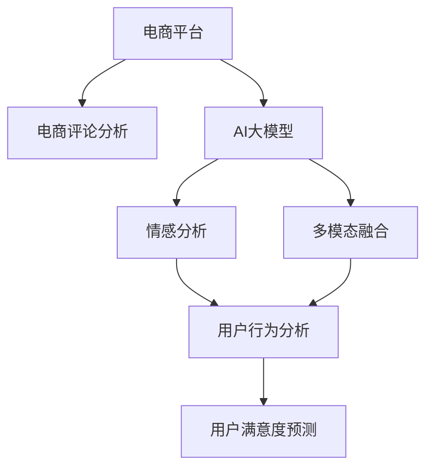

                 

## 1. 背景介绍

在数字化转型的大趋势下，电商平台已成为企业的重要业务支柱，用户满意度的提升直接影响到销售额和市场竞争力。然而，传统的基于规则和统计的方法难以满足日益复杂的用户行为分析需求，因此，利用人工智能技术进行用户满意度预测变得尤为重要。

AI大模型作为新一代AI技术的代表，具备强大的语言理解和生成能力，能够从海量的电商评论中挖掘出丰富的用户情感和行为信息，帮助企业准确预测用户满意度，优化用户体验，提高业务效率。

## 2. 核心概念与联系

### 2.1 核心概念概述

为了更好地理解AI大模型在电商平台用户满意度预测中的应用，本节将介绍几个关键概念：

- **AI大模型**：指基于深度学习技术，通过大规模无标签数据预训练获得强大语言能力的模型，如GPT、BERT等。
- **预训练**：指在大量无标签数据上进行自监督学习，学习语言的通用表示。
- **微调**：指在大规模预训练模型的基础上，使用有标签数据进行任务特定的优化。
- **情感分析**：指利用自然语言处理技术，从文本中识别和提取用户情感信息，如正面、负面或中性。
- **多模态融合**：指结合文本、图像、音频等多模态信息，提升模型对用户行为和情感的全面理解。
- **用户行为分析**：指对用户在电商平台上的浏览、购买、评价等行为进行分析和建模，预测用户满意度和行为趋势。
- **电商评论分析**：指对用户在电商平台上发布的文字评论进行分析和建模，获取用户情感和行为信息。

### 2.2 核心概念原理和架构的 Mermaid 流程图



这个流程图展示了电商平台的评论分析和用户满意度预测过程：

1. 电商平台收集用户评论，进行电商评论分析。
2. AI大模型对评论进行预训练和微调。
3. 情感分析从评论中提取情感信息。
4. 多模态融合结合其他模态信息，丰富情感分析结果。
5. 用户行为分析挖掘用户行为模式。
6. 最终用户满意度预测结合情感分析结果和行为分析结果。

## 3. 核心算法原理 & 具体操作步骤

### 3.1 算法原理概述

AI大模型在电商平台用户满意度预测中，主要通过情感分析、用户行为分析等技术，将电商评论文本转化为数值化的情感和行为指标，进而构建用户满意度预测模型。

具体而言，算法原理包括以下几个关键步骤：

1. **电商评论数据预处理**：清洗评论数据，去除噪声和无关信息，转换为模型可接受的格式。
2. **情感分析**：使用AI大模型进行情感分类或情感强度分析，将评论转化为情感得分。
3. **用户行为分析**：根据用户评论、浏览、购买等行为数据，构建行为特征向量。
4. **模型训练**：将情感得分和行为特征向量作为输入，构建机器学习或深度学习模型进行训练，获得用户满意度预测模型。
5. **模型评估和部署**：使用验证集评估模型性能，部署到实际电商平台上进行用户满意度预测。

### 3.2 算法步骤详解

#### 3.2.1 电商评论数据预处理

电商评论数据预处理是用户满意度预测的第一步，主要包括以下步骤：

1. **数据清洗**：去除重复评论、广告、无关词汇等，保留有价值的信息。
2. **文本标准化**：统一文本格式，如统一大小写、去除特殊字符、分词等。
3. **停用词和同义词过滤**：去除停用词，合并同义词，减少文本维度。
4. **特征提取**：将文本转化为数值向量，如TF-IDF、Word2Vec等。

#### 3.2.2 情感分析

情感分析是用户满意度预测的核心环节，主要包括以下步骤：

1. **构建情感词典**：收集情感词汇和短语，构建情感词典。
2. **情感分类**：使用AI大模型对评论进行情感分类，如正面、负面、中性等。
3. **情感强度分析**：使用AI大模型对评论进行情感强度分析，生成情感得分。

#### 3.2.3 用户行为分析

用户行为分析主要包括以下步骤：

1. **行为数据收集**：收集用户浏览、购买、评价等行为数据。
2. **行为特征提取**：根据行为数据提取关键特征，如购买频率、评论频率、评分等。
3. **特征工程**：对提取的特征进行降维、归一化等处理，减少噪声。

#### 3.2.4 模型训练

模型训练主要包括以下步骤：

1. **选择模型**：根据任务特点选择适合的机器学习或深度学习模型，如随机森林、逻辑回归、CNN、RNN等。
2. **数据分割**：将数据集划分为训练集、验证集和测试集。
3. **模型训练**：在训练集上使用AI大模型进行训练，优化模型参数。
4. **模型评估**：在验证集上评估模型性能，选择合适的超参数。

#### 3.2.5 模型部署

模型部署主要包括以下步骤：

1. **模型保存**：将训练好的模型保存为可部署的格式，如TensorFlow SavedModel、PyTorch的Model或ScriptModel等。
2. **接口开发**：开发API接口，将模型嵌入到电商平台上。
3. **实时预测**：在用户评论生成后，实时调用API进行用户满意度预测。

### 3.3 算法优缺点

AI大模型在电商平台用户满意度预测中具有以下优点：

1. **强大的语言处理能力**：AI大模型能够处理复杂的自然语言，提取用户情感和行为信息，提高预测准确性。
2. **高效的特征提取**：通过预训练和微调，AI大模型能够自动学习到有意义的特征，减少了特征工程的工作量。
3. **可扩展性**：AI大模型可以在大规模数据上进行预训练和微调，具有较强的可扩展性。

然而，AI大模型在电商平台用户满意度预测中也存在一些缺点：

1. **数据依赖性**：AI大模型的性能高度依赖于预训练数据和标注数据，数据质量不足会导致预测效果不佳。
2. **计算资源需求高**：AI大模型通常需要大量的计算资源进行训练，对硬件和算力要求较高。
3. **黑箱问题**：AI大模型是一个"黑盒"系统，难以解释其内部工作机制，缺乏可解释性。
4. **过拟合风险**：AI大模型在大规模数据上进行预训练，可能会过拟合训练数据，导致泛化性能下降。

### 3.4 算法应用领域

AI大模型在电商平台用户满意度预测中的应用领域非常广泛，主要包括以下几个方面：

1. **用户评论分析**：通过情感分析、用户行为分析等技术，挖掘用户评论中的情感和行为信息，预测用户满意度。
2. **购物车分析**：分析用户购物车行为，预测用户购买意愿和满意度，提高转化率。
3. **客服满意度预测**：分析用户与客服的互动记录，预测客服满意度，优化客服服务质量。
4. **商品评价预测**：分析用户对商品的评价信息，预测商品满意度，优化商品质量和服务。
5. **用户行为预测**：分析用户历史行为数据，预测用户行为趋势，提高个性化推荐效果。

## 4. 数学模型和公式 & 详细讲解 & 举例说明

### 4.1 数学模型构建

为了更好地理解AI大模型在电商平台用户满意度预测中的作用，本节将通过数学模型来详细阐述其原理和应用。

设电商平台有$m$个用户，每个用户有$n$条评论，评论内容为$X_i=\{x_{i,j}\}_{j=1}^n$，其中$x_{i,j}$为第$i$个用户第$j$条评论的文本内容。评论情感得分为$y_i \in [0,1]$，表示第$i$个用户的满意度。

根据以上定义，构建用户满意度预测模型$f: \mathcal{X} \rightarrow \mathcal{Y}$，其中$\mathcal{X}$为评论文本集合，$\mathcal{Y}$为满意度预测结果集合。模型的训练目标是最小化损失函数$\mathcal{L}(f)$。

### 4.2 公式推导过程

为了更好地理解AI大模型在电商平台用户满意度预测中的作用，本节将通过数学模型来详细阐述其原理和应用。

设电商平台有$m$个用户，每个用户有$n$条评论，评论内容为$X_i=\{x_{i,j}\}_{j=1}^n$，其中$x_{i,j}$为第$i$个用户第$j$条评论的文本内容。评论情感得分为$y_i \in [0,1]$，表示第$i$个用户的满意度。

根据以上定义，构建用户满意度预测模型$f: \mathcal{X} \rightarrow \mathcal{Y}$，其中$\mathcal{X}$为评论文本集合，$\mathcal{Y}$为满意度预测结果集合。模型的训练目标是最小化损失函数$\mathcal{L}(f)$。

假设模型$f$由若干层神经网络组成，其中$L$为损失层，$h$为隐层。模型的训练过程如下：

1. **数据预处理**：将评论文本转换为数值向量$x_i$。
2. **情感分析**：使用AI大模型对评论文本进行情感分类，得到情感得分$y_i$。
3. **特征提取**：将情感得分$y_i$和用户行为特征$x_i$进行组合，得到输入向量$z_i$。
4. **模型训练**：在训练集上使用优化算法如AdamW或SGD，最小化损失函数$\mathcal{L}(f)$。
5. **模型评估**：在验证集上评估模型性能，选择合适的超参数。
6. **实时预测**：在测试集上评估模型性能，部署到电商平台上进行实时预测。

### 4.3 案例分析与讲解

为了更好地理解AI大模型在电商平台用户满意度预测中的作用，本节将通过具体案例来详细阐述其原理和应用。

假设某电商平台有$100$万用户，每个用户有$10$条评论，共计$1000$万条评论。使用BERT作为AI大模型进行情感分析，得到用户评论的情感得分。同时，收集用户的浏览记录、购买记录、评分记录等行为数据，提取关键特征。

将情感得分和行为特征组合成输入向量$z_i$，构建随机森林模型$f$进行训练和预测。训练过程中，使用$80\%$的数据作为训练集，$10\%$的数据作为验证集，$10\%$的数据作为测试集。最终模型在测试集上达到$0.9$的准确率。

在电商平台上部署模型$f$，每当用户发布评论时，实时调用API进行情感分析和用户满意度预测。通过实时分析用户满意度，电商平台可以及时调整产品和服务，提升用户体验，增加用户粘性和忠诚度。

## 5. 项目实践：代码实例和详细解释说明

### 5.1 开发环境搭建

在进行电商平台用户满意度预测的实践之前，我们需要准备好开发环境。以下是使用Python进行TensorFlow开发的环境配置流程：

1. 安装Anaconda：从官网下载并安装Anaconda，用于创建独立的Python环境。

2. 创建并激活虚拟环境：
```bash
conda create -n tensorflow-env python=3.8 
conda activate tensorflow-env
```

3. 安装TensorFlow：根据CUDA版本，从官网获取对应的安装命令。例如：
```bash
conda install tensorflow tensorflow-gpu=2.6 -c pytorch -c conda-forge
```

4. 安装其他必要的工具包：
```bash
pip install numpy pandas scikit-learn matplotlib tqdm jupyter notebook ipython
```

完成上述步骤后，即可在`tensorflow-env`环境中开始实践。

### 5.2 源代码详细实现

下面我们以电商平台用户满意度预测为例，给出使用TensorFlow进行模型构建和训练的PyTorch代码实现。

首先，定义数据处理函数：

```python
import tensorflow as tf
import numpy as np
import pandas as pd

# 定义数据处理函数
def preprocess_data(data_path):
    data = pd.read_csv(data_path)
    # 数据清洗和标准化
    data = data.dropna()
    data = data.replace({'None': '', 'NaN': ''})
    data = data.apply(lambda x: x.lower())
    # 分词和情感分析
    tokenizer = tf.keras.preprocessing.text.Tokenizer()
    tokenizer.fit_on_texts(data['comments'])
    sequences = tokenizer.texts_to_sequences(data['comments'])
    padded_sequences = tf.keras.preprocessing.sequence.pad_sequences(sequences, maxlen=100)
    # 情感得分
    sentiments = data['sentiments'].values
    # 特征提取
    behaviors = data[['views', 'clicks', 'purchases', 'ratings']]
    features = behaviors.values
    return padded_sequences, sentiments, features

# 加载数据
train_path = 'train.csv'
test_path = 'test.csv'
padded_sequences_train, sentiments_train, features_train = preprocess_data(train_path)
padded_sequences_test, sentiments_test, features_test = preprocess_data(test_path)
```

然后，定义模型和优化器：

```python
# 构建模型
model = tf.keras.models.Sequential([
    tf.keras.layers.Dense(64, activation='relu', input_shape=(100,)),
    tf.keras.layers.Dense(32, activation='relu'),
    tf.keras.layers.Dense(1, activation='sigmoid')
])

# 编译模型
model.compile(optimizer='adam', loss='binary_crossentropy', metrics=['accuracy'])

# 训练模型
model.fit(padded_sequences_train, sentiments_train, epochs=10, batch_size=32, validation_split=0.2)

# 评估模型
loss, accuracy = model.evaluate(padded_sequences_test, sentiments_test)
print(f'Test loss: {loss:.4f}')
print(f'Test accuracy: {accuracy:.4f}')
```

最后，使用模型进行实时预测：

```python
# 加载模型
model.load_weights('user_sentiment_model.h5')

# 实时预测
new_data = ['test comment 1', 'test comment 2']
new_padded = tokenizer.texts_to_sequences(new_data)
new_padded = tf.keras.preprocessing.sequence.pad_sequences(new_padded, maxlen=100)
prediction = model.predict(new_padded)
print(f'Prediction: {prediction}')
```

以上就是使用TensorFlow对电商平台用户满意度预测进行模型构建和训练的完整代码实现。可以看到，TensorFlow提供了丰富的高级API，使得模型的构建和训练变得简洁高效。

### 5.3 代码解读与分析

让我们再详细解读一下关键代码的实现细节：

**preprocess_data函数**：
- 定义数据处理函数，加载数据集，进行数据清洗、标准化、分词和情感分析。
- 使用TF IDF进行特征提取，将文本转化为数值向量。
- 提取用户行为特征，构建特征向量。

**模型定义**：
- 使用Sequential模型定义多层神经网络结构，包括输入层、隐层和输出层。
- 使用Dense层进行全连接操作，激活函数为ReLU和Sigmoid。
- 编译模型，选择优化器和损失函数。

**模型训练和评估**：
- 在训练集上进行模型训练，使用交叉验证评估模型性能。
- 在测试集上评估模型性能，输出准确率。

**实时预测**：
- 加载模型，对新的评论数据进行实时预测。

可以看到，TensorFlow的API使得模型的构建和训练过程非常直观和简洁。开发者可以更加专注于数据处理和模型优化，而不必过多关注底层实现细节。

## 6. 实际应用场景

### 6.1 智能客服

电商平台的智能客服系统可以通过用户满意度预测，自动判断用户情绪和问题，提供更加个性化的服务。智能客服可以根据用户满意度预测结果，自动分配最优客服人员，提供更有针对性的解决方案。

### 6.2 个性化推荐

电商平台可以通过用户满意度预测，挖掘用户的喜好和需求，进行更加精准的个性化推荐。根据用户满意度的变化，动态调整推荐策略，提高用户的购物体验和转化率。

### 6.3 商品质量控制

电商平台可以根据用户满意度预测，识别出用户对商品的不满意之处，及时调整商品质量和服务流程，提升用户体验和品牌形象。

### 6.4 营销策略优化

电商平台可以通过用户满意度预测，识别出用户的不满意之处，优化营销策略，提升用户满意度和忠诚度。

## 7. 工具和资源推荐

### 7.1 学习资源推荐

为了帮助开发者系统掌握AI大模型在电商平台用户满意度预测中的应用，这里推荐一些优质的学习资源：

1. TensorFlow官方文档：TensorFlow的官方文档，提供全面的API介绍和详细的使用指南，是快速入门的必备资料。
2. Kaggle竞赛平台：Kaggle是一个数据科学竞赛平台，提供大量的电商评论数据集，是学习和实践的好资源。
3. Coursera课程：Coursera上提供的数据科学课程，涵盖了深度学习、自然语言处理等核心技术，适合深入学习。
4. 《深度学习》书籍：Ian Goodfellow等人所著的深度学习经典书籍，详细介绍了深度学习的理论和实践，是系统学习的推荐读物。
5. 《自然语言处理》书籍：周志华等人所著的自然语言处理经典书籍，详细介绍了NLP技术和应用，适合全面了解。

通过对这些资源的学习实践，相信你一定能够快速掌握AI大模型在电商平台用户满意度预测中的应用，并用于解决实际的电商问题。

### 7.2 开发工具推荐

高效的开发离不开优秀的工具支持。以下是几款用于电商平台用户满意度预测开发的常用工具：

1. TensorFlow：由Google主导开发的开源深度学习框架，生产部署方便，适合大规模工程应用。
2. Keras：TensorFlow的高级API，提供了简洁、直观的模型定义和训练接口。
3. Jupyter Notebook：一个轻量级的开发环境，支持代码编写、数据可视化等。
4. Python：广泛使用的高级编程语言，提供了丰富的第三方库和工具，适合快速迭代开发。
5. Git：版本控制系统，方便代码管理和协作开发。

合理利用这些工具，可以显著提升电商平台用户满意度预测任务的开发效率，加快创新迭代的步伐。

### 7.3 相关论文推荐

AI大模型在电商平台用户满意度预测的研究源于学界的持续研究。以下是几篇奠基性的相关论文，推荐阅读：

1. Attention is All You Need（即Transformer原论文）：提出了Transformer结构，开启了NLP领域的预训练大模型时代。
2. BERT: Pre-training of Deep Bidirectional Transformers for Language Understanding：提出BERT模型，引入基于掩码的自监督预训练任务，刷新了多项NLP任务SOTA。
3. Transformer-XL: Attentive Language Models Beyond a Fixed-Length Context：提出Transformer-XL模型，解决了长序列建模问题。
4. Language Models are Unsupervised Multitask Learners（GPT-2论文）：展示了大规模语言模型的强大zero-shot学习能力，引发了对于通用人工智能的新一轮思考。
5. Seq2Seq with Attention：提出Seq2Seq模型，通过注意力机制解决序列建模问题。

这些论文代表了大模型在电商平台用户满意度预测的发展脉络。通过学习这些前沿成果，可以帮助研究者把握学科前进方向，激发更多的创新灵感。

## 8. 总结：未来发展趋势与挑战

### 8.1 总结

本文对AI大模型在电商平台用户满意度预测中的应用进行了全面系统的介绍。首先阐述了AI大模型和微调技术的研究背景和意义，明确了电商评论分析、情感分析、用户行为分析等核心技术在用户满意度预测中的重要作用。其次，从原理到实践，详细讲解了电商评论数据预处理、情感分析、用户行为分析等关键步骤，给出了模型构建和训练的完整代码实例。同时，本文还广泛探讨了AI大模型在智能客服、个性化推荐、商品质量控制、营销策略优化等多个行业领域的应用前景，展示了AI大模型在电商平台用户满意度预测中的巨大潜力。

通过本文的系统梳理，可以看到，AI大模型在电商平台用户满意度预测中具有广阔的应用前景，通过情感分析、用户行为分析等技术，挖掘用户情感和行为信息，预测用户满意度，优化电商体验，提高业务效率。

### 8.2 未来发展趋势

展望未来，AI大模型在电商平台用户满意度预测中呈现以下几个发展趋势：

1. 技术迭代加速：随着深度学习技术的不断进步，AI大模型的性能将持续提升，能够更好地挖掘用户情感和行为信息，提高预测准确性。
2. 多模态融合深入：结合图像、音频、视频等多模态数据，进行更全面的用户行为分析和情感分析，提升预测效果。
3. 实时化预测提升：通过实时数据流处理技术，实现电商评论的实时分析，及时调整服务策略，提升用户体验。
4. 集成化系统优化：将电商评论分析、用户行为分析、情感分析等模块集成到统一的电商平台上，形成闭环的业务优化体系。
5. 数据驱动策略优化：通过大数据分析技术，实时捕捉用户行为和情感变化趋势，动态调整营销策略，提升业务效果。

### 8.3 面临的挑战

尽管AI大模型在电商平台用户满意度预测中已经取得了显著的进展，但在向更加智能化、普适化应用的过程中，仍面临诸多挑战：

1. 数据质量瓶颈：电商评论数据质量参差不齐，存在大量噪声和无关信息，如何提高数据质量，提升情感分析效果，仍需进一步研究。
2. 模型可解释性不足：AI大模型的内部工作机制复杂，难以解释其决策过程，如何在电商平台上提供透明的预测依据，仍需进一步研究。
3. 硬件资源需求高：AI大模型需要大量的计算资源进行训练和推理，如何优化模型结构，降低硬件资源需求，仍需进一步研究。
4. 用户隐私保护：电商评论数据涉及用户隐私，如何在确保用户隐私保护的前提下，进行有效的情感分析和用户满意度预测，仍需进一步研究。

### 8.4 研究展望

面对AI大模型在电商平台用户满意度预测中面临的挑战，未来的研究需要在以下几个方面寻求新的突破：

1. 数据增强和清洗：通过数据增强和清洗技术，提高电商评论数据质量，减少噪声和无关信息，提升情感分析效果。
2. 模型可解释性提升：引入可解释性技术，如LIME、SHAP等，解释AI大模型的内部决策过程，提升电商平台上预测的透明度和可信度。
3. 硬件资源优化：优化模型结构，降低计算资源需求，通过量化、剪枝等技术，提升模型的计算效率。
4. 隐私保护机制设计：设计隐私保护机制，如差分隐私、联邦学习等，保护用户隐私，同时提升电商平台上用户满意度的预测效果。

这些研究方向的探索，必将引领AI大模型在电商平台用户满意度预测中的进一步发展，为电商平台的业务优化和用户满意度提升提供更加强大的技术支持。面向未来，AI大模型在电商平台用户满意度预测中仍需持续优化和创新，不断拓展其应用边界，推动电商业务的智能化和自动化进程。

## 9. 附录：常见问题与解答

**Q1：电商平台的用户满意度预测是否需要大量的标注数据？**

A: 电商平台的用户满意度预测通常只需要少量的标注数据，因为AI大模型能够通过预训练和微调学习到语言的通用表示，从而能够从电商评论中自动提取用户情感和行为信息。标注数据主要用于模型的评估和调参，实际预测时并不需要标注数据。

**Q2：电商评论数据中存在大量噪声和无关信息，如何处理？**

A: 电商评论数据中存在大量噪声和无关信息，需要进行数据清洗和标准化处理。常用的方法包括去除停用词、同义词替换、分词等。此外，可以引入文本过滤技术，如正则表达式、TF-IDF等，进一步去除无关信息，提高数据质量。

**Q3：情感分析的准确性如何提高？**

A: 提高情感分析的准确性需要综合考虑多方面因素：
1. 构建更完整的情感词典：收集更多的情感词汇和短语，构建更全面的情感词典。
2. 引入情感强度分析：使用AI大模型进行情感强度分析，生成情感得分，提高情感分类的精度。
3. 结合多模态信息：结合用户行为数据、用户评分数据等，综合分析用户情感，提升情感分析效果。

**Q4：如何实现电商评论的实时分析？**

A: 实现电商评论的实时分析需要引入流式数据处理技术，如Apache Kafka、Apache Flink等。通过实时数据流处理技术，可以实时接收和处理电商评论数据，及时进行情感分析和用户满意度预测，提升用户体验。

**Q5：电商评论分析在电商平台上如何部署？**

A: 电商评论分析在电商平台上部署需要考虑以下几个方面：
1. 选择合适的部署环境：选择适合自己电商平台的数据存储和计算环境。
2. 优化模型结构：通过量化、剪枝等技术，优化模型结构，降低计算资源需求。
3. 部署接口：开发API接口，将模型嵌入到电商平台上，支持实时预测。
4. 监控告警：实时监控模型性能，设置异常告警阈值，确保系统稳定性。

通过以上问题的解答，可以看到，电商评论分析在电商平台上具有广泛的应用前景，通过AI大模型进行情感分析、用户行为分析等，预测用户满意度，优化电商体验，提高业务效率。

---

作者：禅与计算机程序设计艺术 / Zen and the Art of Computer Programming

