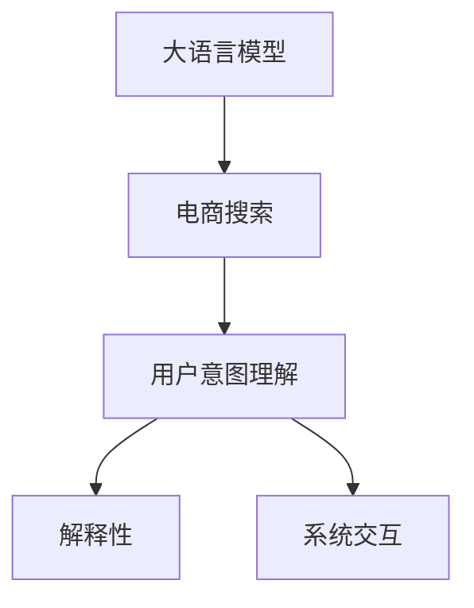

                 

# AI大模型在电商搜索结果解释性中的应用

> 关键词：
1. 大语言模型
2. 电商搜索
3. 解释性
4. 用户意图理解
5. 模型评估
6. 系统交互
7. 人工智能与电商

## 1. 背景介绍

在电商行业，用户搜索行为直接影响着企业的销售和收益。如何更准确地理解用户意图，提供符合其需求的搜索结果，是提升用户满意度和业务转化率的关键。然而，传统的电商搜索系统往往依赖于简单的关键词匹配，无法深入理解用户真实的搜索需求，导致搜索结果不精准，用户体验不佳。近年来，随着大语言模型的兴起，其在自然语言处理领域的卓越性能，使得其在电商搜索中的应用成为可能。利用大语言模型，电商搜索系统可以实现更深层次的用户意图理解，提供更加个性化和准确的搜索结果，从而提升整体搜索体验和商业价值。

## 2. 核心概念与联系

### 2.1 核心概念概述

为了深入理解大语言模型在电商搜索中的应用，我们首先需要明确几个核心概念：

- **大语言模型(Large Language Models, LLMs)**：如BERT、GPT等，通过大规模无标签文本数据的自监督学习，学习到语言的通用表示。在大规模预训练基础上，利用小规模标注数据进行微调，可以大幅提升模型在特定任务上的表现。

- **电商搜索**：用户通过输入关键词，希望找到符合自己需求的商品信息。电商搜索系统需通过理解和分析用户意图，返回最相关的商品信息，提升用户体验和转化率。

- **用户意图理解**：准确理解用户搜索词背后的真实需求，是大语言模型在电商搜索中的主要应用目标。用户意图可能是寻找某个商品，也可能是比较不同商品，甚至可能是询问关于商品的信息。

- **解释性(Explainability)**：大语言模型在电商搜索中的应用不仅需要准确性，还需要能够提供用户意图的解释，使用户了解搜索系统推荐的商品为何能满足其需求，从而增强用户信任，提升满意度。

- **系统交互(Interactivity)**：与用户进行交互，通过对话、问答等方式，实时调整搜索结果，提升用户体验。

这些概念之间的联系可通过以下Mermaid流程图来展示：



这个流程图展示了从大语言模型到电商搜索，再到用户意图理解、解释性、系统交互的全过程：

1. 大语言模型通过学习大规模文本数据，获得了丰富的语言知识和表达能力。
2. 电商搜索系统利用大语言模型进行用户意图理解，识别用户真实的搜索需求。
3. 系统根据用户意图输出相关商品，并提供解释性信息，使用户了解推荐理由。
4. 系统通过与用户的互动，进一步优化搜索结果，提升用户体验。

## 3. 核心算法原理 & 具体操作步骤

### 3.1 算法原理概述

大语言模型在电商搜索中的应用，核心在于通过自然语言处理技术，理解用户搜索词背后的真实意图，从而提供更精准的搜索结果和解释性信息。算法原理可概括为以下几个步骤：

1. **用户搜索词输入**：用户通过输入关键词，向电商搜索系统提出查询需求。
2. **大语言模型预处理**：将用户搜索词输入模型进行预处理，转化为模型能够理解的文本表示。
3. **用户意图理解**：利用大语言模型进行意图分类，识别出用户的真实意图。
4. **搜索结果生成**：根据用户意图，生成符合其需求的搜索结果，并进行排序。
5. **解释性信息输出**：提供搜索结果的解释性信息，解释为何推荐这些商品。
6. **系统交互优化**：根据用户反馈，实时调整搜索结果，提升用户体验。

### 3.2 算法步骤详解

#### 3.2.1 用户搜索词预处理

用户搜索词往往包含错别字、缩写、同义词等噪声，需要通过预处理步骤进行清洗和标准化。具体步骤如下：

1. **拼写纠错**：利用基于深度学习的拼写纠错模型，对搜索词进行拼写校验和修正。
2. **词干提取**：使用词干提取算法，将不同形式的单词转化为标准形式，如将"running"转化为"run"。
3. **同义词替换**：通过词向量相似度计算，替换搜索词的同义词，以扩大搜索范围。
4. **停用词过滤**：去除常用但无意义的停用词，如"a"、"the"等。

预处理后的搜索词，输入到大语言模型中进行意图理解。

#### 3.2.2 用户意图理解

用户意图理解是电商搜索的关键环节，通过大语言模型的预训练和微调，可以实现对用户搜索词的深入理解。主要步骤包括：

1. **模型输入**：将预处理后的搜索词输入大语言模型，进行嵌入表示。
2. **意图分类**：利用多分类模型或序列标注模型，对输入进行意图分类，识别出具体的搜索类型（如产品查询、价格比较、信息咨询等）。
3. **上下文理解**：结合用户搜索历史和输入上下文，进一步理解搜索词背后的真实意图。
4. **意图增强**：通过对话生成模型，在已有意图的基础上，进一步细化意图描述，提升意图理解准确性。

#### 3.2.3 搜索结果生成与排序

根据用户意图，生成符合其需求的搜索结果，并进行排序，主要步骤如下：

1. **商品检索**：通过搜索引擎，检索与用户意图相关的商品信息。
2. **商品排序**：利用排序算法，如排序神经网络(SNLI)，对检索结果进行排序，输出相关性最高的商品。
3. **多样性控制**：控制搜索结果的多样性，避免过度偏向某个商品或品牌，确保用户能够全面了解市场。
4. **动态调整**：根据用户互动反馈，实时调整搜索结果，提升用户体验。

#### 3.2.4 解释性信息输出

为了增强用户对搜索结果的信任，需要提供解释性信息，主要步骤如下：

1. **特征提取**：提取商品的重要特征，如价格、销量、用户评价等。
2. **文本生成**：利用生成模型，将特征信息转化为自然语言文本。
3. **结果解释**：将解释性文本与搜索结果一起返回给用户，解释为何推荐这些商品。

#### 3.2.5 系统交互优化

用户与系统的互动，可以通过对话生成模型实现，主要步骤如下：

1. **用户输入解析**：解析用户输入的自然语言文本，转化为系统可理解的结构化数据。
2. **意图识别**：根据解析结果，利用意图识别模型，确定用户的新搜索意图。
3. **结果返回**：根据新意图，生成新的搜索结果，并进行排序。
4. **对话生成**：使用对话生成模型，生成系统回复，向用户解释搜索结果的依据。

### 3.3 算法优缺点

大语言模型在电商搜索中的应用，具有以下优点：

1. **理解深度高**：通过预训练和微调，大语言模型可以深入理解用户搜索词背后的真实意图。
2. **个性化强**：根据用户历史行为和上下文信息，提供个性化搜索结果。
3. **动态调整**：通过实时互动，动态调整搜索结果，提升用户体验。
4. **解释性信息丰富**：提供详细的解释性信息，增强用户信任。

然而，大语言模型在电商搜索中也存在一些局限：

1. **计算资源需求高**：大语言模型通常需要高性能GPU和大量内存，初期投入成本较高。
2. **模型复杂度高**：模型结构复杂，需要较长的训练和推理时间，对实时性要求较高的场景可能不适用。
3. **数据依赖性强**：需要大量高质量的标注数据进行微调，标注成本较高。
4. **交互局限**：对于非文本形式的输入（如语音、图像等），大语言模型的应用存在局限。

### 3.4 算法应用领域

大语言模型在电商搜索中的应用，主要包括以下几个方面：

1. **商品推荐**：通过用户搜索词，提供符合其需求的商品推荐。
2. **智能客服**：通过对话生成模型，与用户进行实时互动，解决用户咨询问题。
3. **价格比较**：识别用户进行价格比较的需求，提供不同商品的价格对比信息。
4. **用户评论分析**：分析用户评论文本，识别用户对商品的态度和需求，进行相应的搜索结果调整。
5. **搜索优化**：通过用户互动反馈，不断优化搜索算法和意图理解模型。

## 4. 数学模型和公式 & 详细讲解

### 4.1 数学模型构建

电商搜索系统中，大语言模型的应用主要涉及以下几个数学模型：

1. **用户意图理解模型**：通过多分类或序列标注模型，对用户搜索词进行意图分类。
2. **搜索结果排序模型**：通过排序神经网络，对检索结果进行排序，确保相关性最高的商品排在前面。
3. **对话生成模型**：通过生成模型，将用户输入转化为自然语言回复。

以用户意图理解模型为例，其数学模型可以表示为：

$$
P(Y|X; \theta) = \frac{e^{\mathcal{L}(Y, X; \theta)}}{\sum_{y\in \mathcal{Y}}e^{\mathcal{L}(y, X; \theta)}}
$$

其中，$Y$表示用户意图分类标签，$X$表示预处理后的搜索词，$\theta$表示模型参数，$\mathcal{L}$表示损失函数，通常使用交叉熵损失。

### 4.2 公式推导过程

以用户意图理解模型为例，其损失函数可以表示为：

$$
\mathcal{L}(Y, X; \theta) = -\sum_{i=1}^N \log P(Y_i|X_i; \theta)
$$

其中，$N$表示训练样本数量，$Y_i$和$X_i$分别表示第$i$个样本的标签和特征向量。

利用反向传播算法，可以求得模型参数$\theta$的梯度，并更新模型：

$$
\frac{\partial \mathcal{L}(Y, X; \theta)}{\partial \theta} = -\sum_{i=1}^N \frac{\partial \log P(Y_i|X_i; \theta)}{\partial \theta}
$$

通过迭代优化，最小化损失函数，训练出用户意图理解模型。

### 4.3 案例分析与讲解

以下是一个简单的案例，演示如何使用大语言模型进行电商搜索中的意图理解：

假设用户搜索词为"运动鞋推荐"，通过预处理，转化为模型输入"购买推荐 运动鞋"。将输入输入到训练好的用户意图理解模型中，得到意图标签"产品查询"。根据此标签，生成相关商品推荐，并提供解释性信息：

1. 提取商品特征：价格、销量、用户评价。
2. 生成解释性文本："您可能对价格低、销量高且用户评价好的运动鞋感兴趣，以下推荐商品价格均在XX元以下，且用户评价良好：商品A、商品B、商品C"。

## 5. 项目实践：代码实例和详细解释说明

### 5.1 开发环境搭建

为了实现大语言模型在电商搜索中的应用，需要搭建以下开发环境：

1. **安装深度学习框架**：如PyTorch、TensorFlow等。
2. **安装大语言模型库**：如HuggingFace Transformers库，包含多种预训练模型。
3. **安装电商搜索系统**：如ELK Stack、Apache Solr等。
4. **安装数据库**：如MySQL、MongoDB等。
5. **安装API开发工具**：如Flask、FastAPI等。

完成环境搭建后，即可进行电商搜索系统的开发和测试。

### 5.2 源代码详细实现

下面是一个简单的电商搜索系统代码实现示例：

```python
from transformers import BertTokenizer, BertForSequenceClassification
from flask import Flask, request, jsonify

app = Flask(__name__)

# 初始化模型和分词器
tokenizer = BertTokenizer.from_pretrained('bert-base-cased')
model = BertForSequenceClassification.from_pretrained('bert-base-cased', num_labels=3)

@app.route('/search', methods=['POST'])
def search():
    # 获取用户搜索词
    search_word = request.json.get('search_word')
    # 预处理搜索词
    search_word = preprocess_search_word(search_word)
    # 分词
    input_ids = tokenizer.encode(search_word, max_length=512, return_tensors='pt')
    # 模型预测意图
    intent_labels = model.predict(input_ids)[0]
    # 生成推荐商品
    recommendation = generate_recommendation(intent_labels)
    # 生成解释性信息
    explanation = generate_explanation(intent_labels)
    # 返回结果
    return jsonify({'recommendation': recommendation, 'explanation': explanation})

def preprocess_search_word(search_word):
    # 拼写纠错、词干提取、同义词替换、停用词过滤等预处理步骤
    # 返回预处理后的搜索词
    pass

def generate_recommendation(intent_labels):
    # 根据意图标签生成推荐商品列表
    # 返回推荐商品列表
    pass

def generate_explanation(intent_labels):
    # 根据意图标签生成解释性信息
    # 返回解释性文本
    pass
```

代码中，使用了HuggingFace库的BERT模型进行用户意图理解，并结合用户搜索词生成推荐商品和解释性信息。通过Flask框架，将API接口暴露给前端，供用户调用。

### 5.3 代码解读与分析

在上述代码中，我们使用了以下关键技术：

1. **BERT模型**：用于用户意图理解，通过多分类模型预测搜索词的意图标签。
2. **API接口**：使用Flask框架，将搜索API暴露给前端，供用户调用。
3. **推荐生成**：根据意图标签生成推荐商品列表，通过电商搜索系统检索相关商品。
4. **解释性生成**：根据意图标签生成解释性信息，使用户了解推荐理由。

## 6. 实际应用场景

### 6.1 智能推荐系统

智能推荐系统是电商搜索的核心应用场景之一。通过大语言模型进行用户意图理解，推荐系统可以更加精准地推荐符合用户需求的商品，提升用户体验和转化率。

1. **用户意图理解**：根据用户搜索词和上下文信息，利用大语言模型进行意图分类。
2. **推荐商品生成**：根据意图标签，生成符合用户需求的推荐商品。
3. **解释性信息输出**：提供详细的解释性信息，增强用户对推荐商品的信任。

### 6.2 实时客服系统

实时客服系统通过对话生成模型，与用户进行实时互动，解答用户咨询，提升客户服务体验。

1. **用户咨询解析**：解析用户输入的自然语言文本，转化为系统可理解的结构化数据。
2. **意图识别**：根据解析结果，利用意图识别模型，确定用户的新搜索意图。
3. **系统回复生成**：使用对话生成模型，生成系统回复，向用户解释搜索结果的依据。

### 6.3 价格比较系统

价格比较系统通过大语言模型，识别用户进行价格比较的需求，提供不同商品的价格对比信息，帮助用户做出更好的购买决策。

1. **价格对比信息提取**：通过电商搜索系统，提取不同商品的价格信息。
2. **意图理解**：利用大语言模型，识别用户进行价格比较的意图。
3. **价格对比结果生成**：根据用户意图，生成详细的价格对比信息。

### 6.4 未来应用展望

未来，大语言模型在电商搜索中的应用将更加广泛，以下几个方向值得关注：

1. **多模态融合**：将文本、图像、语音等多种数据源进行融合，提供更加全面和丰富的用户搜索体验。
2. **跨域迁移**：将大语言模型的知识迁移到其他领域，提升其他领域应用的性能。
3. **实时调整**：通过实时互动，动态调整搜索结果，提升用户体验。
4. **主动推荐**：基于用户行为数据和上下文信息，主动推荐用户可能感兴趣的商品。
5. **用户反馈循环**：通过用户反馈，不断优化模型和算法，提升搜索结果的准确性和个性化程度。

## 7. 工具和资源推荐

### 7.1 学习资源推荐

为了帮助开发者系统掌握大语言模型在电商搜索中的应用，推荐以下学习资源：

1. **自然语言处理教程**：如《自然语言处理综论》、《深度学习与自然语言处理》等书籍，介绍自然语言处理的基本概念和前沿技术。
2. **电商搜索课程**：如Coursera上的《电商搜索与推荐系统》课程，涵盖电商搜索的基本原理和算法实现。
3. **大语言模型文档**：如HuggingFace官方文档，提供多种预训练模型的详细介绍和使用方法。
4. **开源项目**：如ELK Stack、Apache Solr等，提供电商搜索系统的开源实现和部署方案。

### 7.2 开发工具推荐

以下是几款用于大语言模型在电商搜索中应用的常用工具：

1. **深度学习框架**：如PyTorch、TensorFlow，用于模型训练和推理。
2. **自然语言处理库**：如NLTK、SpaCy，用于文本预处理和意图理解。
3. **API开发框架**：如Flask、FastAPI，用于构建API接口，提供服务。
4. **数据库管理工具**：如MySQL、MongoDB，用于存储和检索数据。
5. **可视化工具**：如TensorBoard，用于模型训练和调试。

### 7.3 相关论文推荐

大语言模型在电商搜索中的应用，涉及多个交叉领域。以下是几篇代表性论文，推荐阅读：

1. **《Attention is All You Need》**：Transformer模型，提出自注意力机制，开启大语言模型的时代。
2. **《BERT: Pre-training of Deep Bidirectional Transformers for Language Understanding》**：BERT模型，利用掩码语言模型进行预训练，取得SOTA效果。
3. **《Integrated Search Model for E-commerce》**：介绍电商搜索系统的基本原理和算法实现。
4. **《E-commerce Search with Deep Learning》**：使用深度学习技术，优化电商搜索系统的性能。
5. **《E-commerce Product Recommendation using Natural Language Processing》**：利用NLP技术，提供个性化商品推荐。

## 8. 总结：未来发展趋势与挑战

### 8.1 研究成果总结

本文详细介绍了大语言模型在电商搜索结果解释性中的应用，通过用户意图理解、搜索结果生成、解释性信息输出和系统交互等关键环节，展示了其在电商搜索中的广泛应用潜力。使用大语言模型，电商搜索系统能够提供更加精准、个性化和解释性的搜索结果，提升用户满意度和转化率。

### 8.2 未来发展趋势

未来，大语言模型在电商搜索中的应用将呈现以下几个发展趋势：

1. **多模态融合**：将文本、图像、语音等多种数据源进行融合，提供更加全面和丰富的用户搜索体验。
2. **跨域迁移**：将大语言模型的知识迁移到其他领域，提升其他领域应用的性能。
3. **实时调整**：通过实时互动，动态调整搜索结果，提升用户体验。
4. **主动推荐**：基于用户行为数据和上下文信息，主动推荐用户可能感兴趣的商品。
5. **用户反馈循环**：通过用户反馈，不断优化模型和算法，提升搜索结果的准确性和个性化程度。

### 8.3 面临的挑战

尽管大语言模型在电商搜索中的应用前景广阔，但仍面临诸多挑战：

1. **计算资源需求高**：大语言模型通常需要高性能GPU和大量内存，初期投入成本较高。
2. **模型复杂度高**：模型结构复杂，需要较长的训练和推理时间，对实时性要求较高的场景可能不适用。
3. **数据依赖性强**：需要大量高质量的标注数据进行微调，标注成本较高。
4. **交互局限**：对于非文本形式的输入（如语音、图像等），大语言模型的应用存在局限。

### 8.4 研究展望

未来，大语言模型在电商搜索中的应用需要在以下几个方面进行深入研究：

1. **多模态融合**：研究如何将文本、图像、语音等多种数据源进行有效融合，提升搜索结果的全面性和丰富性。
2. **实时调整**：研究如何通过实时互动，动态调整搜索结果，提升用户体验。
3. **主动推荐**：研究如何基于用户行为数据和上下文信息，主动推荐用户可能感兴趣的商品。
4. **用户反馈循环**：研究如何通过用户反馈，不断优化模型和算法，提升搜索结果的准确性和个性化程度。

大语言模型在电商搜索中的应用，需要多路径协同发力，共同推动自然语言理解和智能交互系统的进步。只有勇于创新、敢于突破，才能不断拓展语言模型的边界，让智能技术更好地造福人类社会。

---

作者：禅与计算机程序设计艺术 / Zen and the Art of Computer Programming

