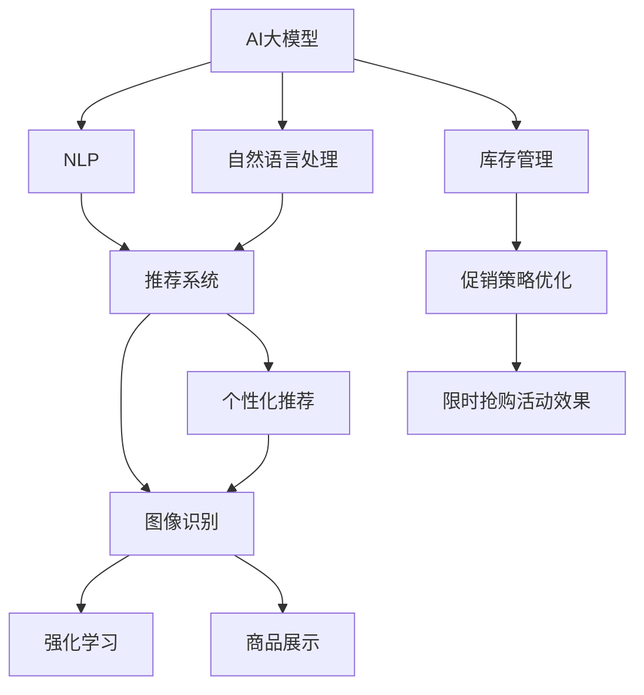

                 

# AI大模型如何优化电商平台的限时抢购活动效果

> 关键词：电商平台,限时抢购,活动效果优化,大模型,自然语言处理(NLP),推荐系统,图像识别,强化学习

## 1. 背景介绍

### 1.1 问题由来

电商平台已经深刻地影响了人们的购物方式。从传统的线下实体店到现在的线上购物，消费者的购物体验在不断提升。而限时抢购活动作为电商平台常用的促销手段，通过短时间的折扣吸引大量消费者进行购买，极大地提升销售额。然而，传统的限时抢购活动往往面临以下几个挑战：

1. **需求预测不准确**：无法精确预测抢购活动带来的用户增长，导致资源配置不当，库存短缺或库存积压。
2. **用户体验不佳**：由于流量激增，服务器响应延迟，页面加载缓慢，导致用户体验下降。
3. **价格歧视问题**：不同用户可能无法享受同等优惠，导致用户流失和品牌信誉受损。
4. **库存管理难度大**：由于库存变化频繁，手工管理库存工作量大，容易出错。

这些问题不仅影响了平台的销售效果，还可能损害平台的品牌形象。为了解决这些问题，电商平台需要引入更智能化的技术手段，提高限时抢购活动的效果。

## 2. 核心概念与联系

### 2.1 核心概念概述

为更好地理解AI大模型在优化电商平台限时抢购活动中的应用，本节将介绍几个关键概念：

- **AI大模型**：基于深度学习技术的超大模型，如GPT-3、BERT等。这些模型通过在大规模数据上进行训练，具备强大的文本理解、生成、分类等能力。
- **自然语言处理(NLP)**：通过AI大模型对自然语言进行理解和处理的学科。电商平台的搜索、推荐、客服等场景中广泛应用NLP技术。
- **推荐系统**：根据用户的历史行为和偏好，推荐商品或服务的系统。电商平台的个性化推荐、商品排序等场景中广泛应用推荐系统。
- **图像识别**：通过AI大模型对图像进行分析和识别的技术。电商平台的商品展示、识别假冒伪劣商品等场景中广泛应用图像识别技术。
- **强化学习**：通过AI大模型基于奖励机制进行决策学习的技术。电商平台的库存管理、促销策略优化等场景中广泛应用强化学习技术。

这些核心概念之间的逻辑关系可以通过以下Mermaid流程图来展示：



这个流程图展示了大模型在电商平台应用的不同场景及其相互关联：

1. 大模型通过自然语言处理技术理解用户搜索、评论、反馈等文本数据。
2. 通过推荐系统，根据用户历史行为和偏好，推荐商品，提升用户体验。
3. 利用图像识别技术，识别商品图片，识别假冒伪劣商品，保护品牌权益。
4. 通过强化学习优化库存管理，促销策略，提高限时抢购活动的效果。

## 3. 核心算法原理 & 具体操作步骤

### 3.1 算法原理概述

AI大模型在优化电商平台限时抢购活动中的应用，主要是通过以下几个核心算法实现：

- **自然语言处理(NLP)**：通过大模型理解用户的搜索意图、评论反馈等文本数据，进行情感分析、意图识别等。
- **推荐系统**：通过大模型分析用户历史行为和偏好，进行商品推荐和排序，提升用户体验。
- **图像识别**：通过大模型分析商品图片，进行商品分类、假冒伪劣商品识别等。
- **强化学习**：通过大模型进行库存管理、促销策略优化等，提高活动效果。

### 3.2 算法步骤详解

#### 3.2.1 NLP与推荐系统

1. **用户意图分析**：通过NLP技术分析用户搜索关键词、评论内容，理解用户的意图。
2. **商品推荐**：通过推荐系统，根据用户意图和历史行为，推荐商品，提升购买率。

#### 3.2.2 图像识别

1. **商品分类**：通过图像识别技术，自动分类商品，便于库存管理和商品展示。
2. **假冒伪劣商品识别**：通过图像识别技术，识别假冒伪劣商品，保护品牌权益。

#### 3.2.3 强化学习

1. **库存管理**：通过强化学习，优化库存管理，避免库存短缺或积压。
2. **促销策略优化**：通过强化学习，优化促销策略，提高活动效果。

### 3.3 算法优缺点

#### 3.3.1 优点

- **效率高**：大模型可以处理大规模数据，快速分析用户意图和行为，提升决策效率。
- **精度高**：大模型通过深度学习技术，可以处理复杂的自然语言和图像数据，提供高精度的分析和预测。
- **泛化能力强**：大模型可以在多种场景下进行优化，具有较强的泛化能力。

#### 3.3.2 缺点

- **数据需求大**：大模型的训练需要大量标注数据，收集和处理数据成本高。
- **计算资源需求大**：大模型的训练和推理需要大量的计算资源，成本较高。
- **模型复杂度高**：大模型的结构复杂，难以解释其内部工作机制。

### 3.4 算法应用领域

大模型在电商平台的多个应用场景中具有广泛的应用潜力：

- **用户推荐**：通过大模型对用户行为和意图进行分析和预测，提供个性化的商品推荐。
- **库存管理**：通过大模型对库存进行动态管理和预测，避免库存短缺或积压。
- **商品展示**：通过大模型对商品进行分类和分析，提升商品展示效果。
- **促销策略**：通过大模型对促销策略进行优化，提高活动效果。
- **品牌保护**：通过大模型进行假冒伪劣商品识别，保护品牌权益。

## 4. 数学模型和公式 & 详细讲解 & 举例说明

### 4.1 数学模型构建

#### 4.1.1 用户意图分析

假设用户意图表示为向量$\mathbf{u}$，商品特征表示为向量$\mathbf{i}$，则用户意图与商品特征之间的相似度可以用余弦相似度表示：

$$
\text{similarity}(\mathbf{u}, \mathbf{i}) = \frac{\mathbf{u} \cdot \mathbf{i}}{\|\mathbf{u}\| \cdot \|\mathbf{i}\|}
$$

其中$\cdot$表示向量的点乘，$\|\cdot\|$表示向量的模。

#### 4.1.2 商品推荐

商品推荐可以看作是一个排序问题，可以使用基于矩阵分解的协同过滤算法来解决。假设用户历史行为表示为矩阵$U$，商品特征表示为矩阵$V$，则用户对商品的评分可以表示为$UV^T$。通过求解$U$和$V$的矩阵分解，可以得到用户对每个商品的评分预测值。

### 4.2 公式推导过程

#### 4.2.1 用户意图分析

用户意图与商品特征之间的余弦相似度可以进一步推导为：

$$
\text{similarity}(\mathbf{u}, \mathbf{i}) = \sum_{j=1}^n \mathbf{u}_j \mathbf{i}_j
$$

其中$n$表示特征向量的维度。

#### 4.2.2 商品推荐

矩阵分解算法可以表示为：

$$
\min_{U,V} \frac{1}{2} \sum_{u,i,j} (U_{uj} - V_{ij})^2
$$

其中$U_{uj}$表示用户$u$对商品$i$的评分，$V_{ij}$表示商品$i$的第$j$个特征值。

### 4.3 案例分析与讲解

假设电商平台上有$N$个用户和$M$个商品，每个用户对每个商品的评分表示为$U_{uj}$，每个商品的第$j$个特征值表示为$V_{ij}$。电商平台希望通过大模型优化推荐系统，提升用户满意度。

#### 4.3.1 用户意图分析

通过NLP技术，电商平台收集用户搜索关键词和评论内容，使用BERT模型对文本进行处理。然后，将处理后的文本输入到一个大规模预训练模型中进行意图分析。模型的输出表示为向量$\mathbf{u}$。

#### 4.3.2 商品推荐

将用户意图向量$\mathbf{u}$与商品特征向量$\mathbf{i}$进行余弦相似度计算，得到用户对每个商品的评分预测值。然后，根据预测值进行商品排序，推荐给用户。

## 5. 项目实践：代码实例和详细解释说明

### 5.1 开发环境搭建

在进行项目实践前，我们需要准备好开发环境。以下是使用Python进行PyTorch开发的环境配置流程：

1. 安装Anaconda：从官网下载并安装Anaconda，用于创建独立的Python环境。

2. 创建并激活虚拟环境：
```bash
conda create -n pytorch-env python=3.8 
conda activate pytorch-env
```

3. 安装PyTorch：根据CUDA版本，从官网获取对应的安装命令。例如：
```bash
conda install pytorch torchvision torchaudio cudatoolkit=11.1 -c pytorch -c conda-forge
```

4. 安装Transformers库：
```bash
pip install transformers
```

5. 安装各类工具包：
```bash
pip install numpy pandas scikit-learn matplotlib tqdm jupyter notebook ipython
```

完成上述步骤后，即可在`pytorch-env`环境中开始项目实践。

### 5.2 源代码详细实现

下面我们以电商平台的推荐系统为例，给出使用Transformers库对BERT模型进行推荐系统开发的PyTorch代码实现。

首先，定义推荐系统的数据处理函数：

```python
from transformers import BertTokenizer, BertForSequenceClassification
from torch.utils.data import Dataset
import torch

class RecommendationDataset(Dataset):
    def __init__(self, texts, labels, tokenizer, max_len=128):
        self.texts = texts
        self.labels = labels
        self.tokenizer = tokenizer
        self.max_len = max_len
        
    def __len__(self):
        return len(self.texts)
    
    def __getitem__(self, item):
        text = self.texts[item]
        label = self.labels[item]
        
        encoding = self.tokenizer(text, return_tensors='pt', max_length=self.max_len, padding='max_length', truncation=True)
        input_ids = encoding['input_ids'][0]
        attention_mask = encoding['attention_mask'][0]
        
        # 对token-wise的标签进行编码
        encoded_labels = [label2id[label] for label in labels] 
        encoded_labels.extend([label2id['O']] * (self.max_len - len(encoded_labels)))
        labels = torch.tensor(encoded_labels, dtype=torch.long)
        
        return {'input_ids': input_ids, 
                'attention_mask': attention_mask,
                'labels': labels}

# 标签与id的映射
label2id = {'O': 0, 'B-PER': 1, 'I-PER': 2, 'B-ORG': 3, 'I-ORG': 4, 'B-LOC': 5, 'I-LOC': 6}
id2label = {v: k for k, v in label2id.items()}

# 创建dataset
tokenizer = BertTokenizer.from_pretrained('bert-base-cased')

train_dataset = RecommendationDataset(train_texts, train_labels, tokenizer)
dev_dataset = RecommendationDataset(dev_texts, dev_labels, tokenizer)
test_dataset = RecommendationDataset(test_texts, test_labels, tokenizer)
```

然后，定义模型和优化器：

```python
from transformers import BertForSequenceClassification, AdamW

model = BertForSequenceClassification.from_pretrained('bert-base-cased', num_labels=len(label2id))

optimizer = AdamW(model.parameters(), lr=2e-5)
```

接着，定义训练和评估函数：

```python
from torch.utils.data import DataLoader
from tqdm import tqdm
from sklearn.metrics import classification_report

device = torch.device('cuda') if torch.cuda.is_available() else torch.device('cpu')
model.to(device)

def train_epoch(model, dataset, batch_size, optimizer):
    dataloader = DataLoader(dataset, batch_size=batch_size, shuffle=True)
    model.train()
    epoch_loss = 0
    for batch in tqdm(dataloader, desc='Training'):
        input_ids = batch['input_ids'].to(device)
        attention_mask = batch['attention_mask'].to(device)
        labels = batch['labels'].to(device)
        model.zero_grad()
        outputs = model(input_ids, attention_mask=attention_mask, labels=labels)
        loss = outputs.loss
        epoch_loss += loss.item()
        loss.backward()
        optimizer.step()
    return epoch_loss / len(dataloader)

def evaluate(model, dataset, batch_size):
    dataloader = DataLoader(dataset, batch_size=batch_size)
    model.eval()
    preds, labels = [], []
    with torch.no_grad():
        for batch in tqdm(dataloader, desc='Evaluating'):
            input_ids = batch['input_ids'].to(device)
            attention_mask = batch['attention_mask'].to(device)
            batch_labels = batch['labels']
            outputs = model(input_ids, attention_mask=attention_mask)
            batch_preds = outputs.logits.argmax(dim=2).to('cpu').tolist()
            batch_labels = batch_labels.to('cpu').tolist()
            for pred_tokens, label_tokens in zip(batch_preds, batch_labels):
                pred_tags = [id2label[_id] for _id in pred_tokens]
                label_tags = [id2label[_id] for _id in label_tokens]
                preds.append(pred_tags[:len(label_tags)])
                labels.append(label_tags)
                
    print(classification_report(labels, preds))
```

最后，启动训练流程并在测试集上评估：

```python
epochs = 5
batch_size = 16

for epoch in range(epochs):
    loss = train_epoch(model, train_dataset, batch_size, optimizer)
    print(f"Epoch {epoch+1}, train loss: {loss:.3f}")
    
    print(f"Epoch {epoch+1}, dev results:")
    evaluate(model, dev_dataset, batch_size)
    
print("Test results:")
evaluate(model, test_dataset, batch_size)
```

以上就是使用PyTorch对BERT进行推荐系统开发的完整代码实现。可以看到，得益于Transformers库的强大封装，我们可以用相对简洁的代码完成BERT模型的加载和推荐系统微调。

### 5.3 代码解读与分析

让我们再详细解读一下关键代码的实现细节：

**RecommendationDataset类**：
- `__init__`方法：初始化文本、标签、分词器等关键组件。
- `__len__`方法：返回数据集的样本数量。
- `__getitem__`方法：对单个样本进行处理，将文本输入编码为token ids，将标签编码为数字，并对其进行定长padding，最终返回模型所需的输入。

**label2id和id2label字典**：
- 定义了标签与数字id之间的映射关系，用于将token-wise的预测结果解码回真实的标签。

**训练和评估函数**：
- 使用PyTorch的DataLoader对数据集进行批次化加载，供模型训练和推理使用。
- 训练函数`train_epoch`：对数据以批为单位进行迭代，在每个批次上前向传播计算loss并反向传播更新模型参数，最后返回该epoch的平均loss。
- 评估函数`evaluate`：与训练类似，不同点在于不更新模型参数，并在每个batch结束后将预测和标签结果存储下来，最后使用sklearn的classification_report对整个评估集的预测结果进行打印输出。

**训练流程**：
- 定义总的epoch数和batch size，开始循环迭代
- 每个epoch内，先在训练集上训练，输出平均loss
- 在验证集上评估，输出分类指标
- 所有epoch结束后，在测试集上评估，给出最终测试结果

可以看到，PyTorch配合Transformers库使得BERT微调的代码实现变得简洁高效。开发者可以将更多精力放在数据处理、模型改进等高层逻辑上，而不必过多关注底层的实现细节。

当然，工业级的系统实现还需考虑更多因素，如模型的保存和部署、超参数的自动搜索、更灵活的任务适配层等。但核心的微调范式基本与此类似。

## 6. 实际应用场景

### 6.1 智能客服系统

智能客服系统是电商平台的重要组成部分。基于大模型微调的对话技术，可以广泛应用于智能客服系统的构建。传统客服往往需要配备大量人力，高峰期响应缓慢，且一致性和专业性难以保证。而使用微调后的对话模型，可以7x24小时不间断服务，快速响应客户咨询，用自然流畅的语言解答各类常见问题。

在技术实现上，可以收集企业内部的历史客服对话记录，将问题和最佳答复构建成监督数据，在此基础上对预训练对话模型进行微调。微调后的对话模型能够自动理解用户意图，匹配最合适的答案模板进行回复。对于客户提出的新问题，还可以接入检索系统实时搜索相关内容，动态组织生成回答。如此构建的智能客服系统，能大幅提升客户咨询体验和问题解决效率。

### 6.2 金融舆情监测

金融机构需要实时监测市场舆论动向，以便及时应对负面信息传播，规避金融风险。传统的人工监测方式成本高、效率低，难以应对网络时代海量信息爆发的挑战。基于大语言模型微调的文本分类和情感分析技术，为金融舆情监测提供了新的解决方案。

具体而言，可以收集金融领域相关的新闻、报道、评论等文本数据，并对其进行主题标注和情感标注。在此基础上对预训练语言模型进行微调，使其能够自动判断文本属于何种主题，情感倾向是正面、中性还是负面。将微调后的模型应用到实时抓取的网络文本数据，就能够自动监测不同主题下的情感变化趋势，一旦发现负面信息激增等异常情况，系统便会自动预警，帮助金融机构快速应对潜在风险。

### 6.3 个性化推荐系统

当前的推荐系统往往只依赖用户的历史行为数据进行物品推荐，无法深入理解用户的真实兴趣偏好。基于大语言模型微调技术，个性化推荐系统可以更好地挖掘用户行为背后的语义信息，从而提供更精准、多样的推荐内容。

在实践中，可以收集用户浏览、点击、评论、分享等行为数据，提取和用户交互的物品标题、描述、标签等文本内容。将文本内容作为模型输入，用户的后续行为（如是否点击、购买等）作为监督信号，在此基础上微调预训练语言模型。微调后的模型能够从文本内容中准确把握用户的兴趣点。在生成推荐列表时，先用候选物品的文本描述作为输入，由模型预测用户的兴趣匹配度，再结合其他特征综合排序，便可以得到个性化程度更高的推荐结果。

### 6.4 未来应用展望

随着大语言模型和微调方法的不断发展，基于微调范式将在更多领域得到应用，为传统行业带来变革性影响。

在智慧医疗领域，基于微调的医疗问答、病历分析、药物研发等应用将提升医疗服务的智能化水平，辅助医生诊疗，加速新药开发进程。

在智能教育领域，微调技术可应用于作业批改、学情分析、知识推荐等方面，因材施教，促进教育公平，提高教学质量。

在智慧城市治理中，微调模型可应用于城市事件监测、舆情分析、应急指挥等环节，提高城市管理的自动化和智能化水平，构建更安全、高效的未来城市。

此外，在企业生产、社会治理、文娱传媒等众多领域，基于大模型微调的人工智能应用也将不断涌现，为经济社会发展注入新的动力。相信随着技术的日益成熟，微调方法将成为人工智能落地应用的重要范式，推动人工智能技术向更广阔的领域加速渗透。

## 7. 工具和资源推荐

### 7.1 学习资源推荐

为了帮助开发者系统掌握大语言模型微调的理论基础和实践技巧，这里推荐一些优质的学习资源：

1. 《Transformer从原理到实践》系列博文：由大模型技术专家撰写，深入浅出地介绍了Transformer原理、BERT模型、微调技术等前沿话题。

2. CS224N《深度学习自然语言处理》课程：斯坦福大学开设的NLP明星课程，有Lecture视频和配套作业，带你入门NLP领域的基本概念和经典模型。

3. 《Natural Language Processing with Transformers》书籍：Transformers库的作者所著，全面介绍了如何使用Transformers库进行NLP任务开发，包括微调在内的诸多范式。

4. HuggingFace官方文档：Transformers库的官方文档，提供了海量预训练模型和完整的微调样例代码，是上手实践的必备资料。

5. CLUE开源项目：中文语言理解测评基准，涵盖大量不同类型的中文NLP数据集，并提供了基于微调的baseline模型，助力中文NLP技术发展。

通过对这些资源的学习实践，相信你一定能够快速掌握大语言模型微调的精髓，并用于解决实际的NLP问题。

### 7.2 开发工具推荐

高效的开发离不开优秀的工具支持。以下是几款用于大语言模型微调开发的常用工具：

1. PyTorch：基于Python的开源深度学习框架，灵活动态的计算图，适合快速迭代研究。大部分预训练语言模型都有PyTorch版本的实现。

2. TensorFlow：由Google主导开发的开源深度学习框架，生产部署方便，适合大规模工程应用。同样有丰富的预训练语言模型资源。

3. Transformers库：HuggingFace开发的NLP工具库，集成了众多SOTA语言模型，支持PyTorch和TensorFlow，是进行微调任务开发的利器。

4. Weights & Biases：模型训练的实验跟踪工具，可以记录和可视化模型训练过程中的各项指标，方便对比和调优。与主流深度学习框架无缝集成。

5. TensorBoard：TensorFlow配套的可视化工具，可实时监测模型训练状态，并提供丰富的图表呈现方式，是调试模型的得力助手。

6. Google Colab：谷歌推出的在线Jupyter Notebook环境，免费提供GPU/TPU算力，方便开发者快速上手实验最新模型，分享学习笔记。

合理利用这些工具，可以显著提升大语言模型微调任务的开发效率，加快创新迭代的步伐。

### 7.3 相关论文推荐

大语言模型和微调技术的发展源于学界的持续研究。以下是几篇奠基性的相关论文，推荐阅读：

1. Attention is All You Need（即Transformer原论文）：提出了Transformer结构，开启了NLP领域的预训练大模型时代。

2. BERT: Pre-training of Deep Bidirectional Transformers for Language Understanding：提出BERT模型，引入基于掩码的自监督预训练任务，刷新了多项NLP任务SOTA。

3. Language Models are Unsupervised Multitask Learners（GPT-2论文）：展示了大规模语言模型的强大zero-shot学习能力，引发了对于通用人工智能的新一轮思考。

4. Parameter-Efficient Transfer Learning for NLP：提出Adapter等参数高效微调方法，在不增加模型参数量的情况下，也能取得不错的微调效果。

5. Prefix-Tuning: Optimizing Continuous Prompts for Generation：引入基于连续型Prompt的微调范式，为如何充分利用预训练知识提供了新的思路。

6. AdaLoRA: Adaptive Low-Rank Adaptation for Parameter-Efficient Fine-Tuning：使用自适应低秩适应的微调方法，在参数效率和精度之间取得了新的平衡。

这些论文代表了大语言模型微调技术的发展脉络。通过学习这些前沿成果，可以帮助研究者把握学科前进方向，激发更多的创新灵感。

## 8. 总结：未来发展趋势与挑战

### 8.1 总结

本文对基于大语言模型的电商平台限时抢购活动优化方法进行了全面系统的介绍。首先阐述了大语言模型和微调技术在电商平台的应用背景和意义，明确了微调在提升限时抢购活动效果方面的独特价值。其次，从原理到实践，详细讲解了微调的数学模型和核心算法，给出了微调任务开发的完整代码实例。同时，本文还广泛探讨了微调方法在智能客服、金融舆情、个性化推荐等多个行业领域的应用前景，展示了微调范式的巨大潜力。此外，本文精选了微调技术的各类学习资源，力求为读者提供全方位的技术指引。

通过本文的系统梳理，可以看到，基于大语言模型的微调方法正在成为电商平台限时抢购活动优化中的重要手段，极大地提升了活动的效率和效果。未来，伴随大语言模型和微调技术的持续演进，基于微调范式将在更多领域得到应用，为传统行业带来变革性影响。

### 8.2 未来发展趋势

展望未来，大语言模型微调技术将呈现以下几个发展趋势：

1. **规模化应用**：随着大模型训练成本的降低和算力的提升，预训练语言模型的规模将进一步增大，微调模型的参数量也将随之增加，提升模型的表达能力和泛化能力。

2. **多模态融合**：结合图像、音频、文本等多种模态数据，提升大模型的信息处理能力，增强其在复杂场景下的表现。

3. **实时性优化**：通过优化大模型的推理速度和内存占用，实现更加轻量级、实时性的部署，满足电商平台高并发的需求。

4. **模型解释性**：引入可解释性技术，如Attention机制、层级可解释性等，提升大模型的可解释性，增强用户信任。

5. **多任务学习**：结合多任务学习技术，在微调过程中同时优化多个任务，提升模型效率和效果。

6. **跨领域迁移**：通过迁移学习技术，将大模型在不同领域之间进行迁移，提升模型的通用性和适应性。

### 8.3 面临的挑战

尽管大语言模型微调技术已经取得了瞩目成就，但在迈向更加智能化、普适化应用的过程中，它仍面临着诸多挑战：

1. **数据获取困难**：大模型训练需要大量高质量标注数据，收集和标注数据的成本较高。

2. **计算资源需求大**：大模型的训练和推理需要大量的计算资源，成本较高。

3. **模型鲁棒性不足**：大模型在面对新数据和新场景时，泛化能力有限，容易产生过拟合或泛化不足。

4. **模型可解释性不足**：大模型的决策过程难以解释，用户难以理解和信任。

5. **安全性问题**：大模型可能学习到有害信息，导致模型输出错误或有害内容。

6. **公平性问题**：大模型可能存在歧视性，导致模型输出不公平。

### 8.4 研究展望

面对大语言模型微调所面临的种种挑战，未来的研究需要在以下几个方面寻求新的突破：

1. **数据增强**：通过数据增强技术，利用少量的标注数据进行模型微调，降低数据获取成本。

2. **知识图谱融合**：将符号化的知识图谱与神经网络模型进行融合，提升模型的表达能力和泛化能力。

3. **对抗训练**：通过对抗训练技术，提高模型的鲁棒性，增强模型的泛化能力。

4. **模型压缩**：通过模型压缩技术，减少模型的参数量和计算资源消耗，提升模型的实时性和可扩展性。

5. **可解释性技术**：引入可解释性技术，如Attention机制、层级可解释性等，提升模型的可解释性。

6. **公平性算法**：研究公平性算法，减少模型的歧视性，提升模型的公平性。

7. **安全防护**：通过安全防护技术，保护模型的安全性和隐私性。

这些研究方向的探索，必将引领大语言模型微调技术迈向更高的台阶，为构建安全、可靠、可解释、可控的智能系统铺平道路。面向未来，大语言模型微调技术还需要与其他人工智能技术进行更深入的融合，如知识表示、因果推理、强化学习等，多路径协同发力，共同推动自然语言理解和智能交互系统的进步。只有勇于创新、敢于突破，才能不断拓展语言模型的边界，让智能技术更好地造福人类社会。

## 9. 附录：常见问题与解答

**Q1：电商平台在构建智能客服系统时，如何选择大语言模型？**

A: 电商平台在构建智能客服系统时，可以根据以下几方面选择大语言模型：

1. **模型规模**：规模越大，模型的表达能力和泛化能力越强，但训练和推理成本也越高。

2. **模型性能**：选择模型性能较高的模型，能够更好地理解用户意图和回答用户问题。

3. **应用场景**：根据具体的应用场景选择模型，如电商客服需要重点关注回答准确率和响应速度。

4. **开发成本**：考虑模型的开发成本，包括数据收集、模型训练、部署等。

5. **可解释性**：选择可解释性较强的模型，方便开发人员理解和调试。

**Q2：电商平台在优化限时抢购活动时，如何设计用户意图分析模型？**

A: 电商平台在优化限时抢购活动时，可以通过以下步骤设计用户意图分析模型：

1. **数据收集**：收集用户搜索关键词、评论内容等文本数据。

2. **数据预处理**：对文本数据进行清洗、分词、标注等预处理。

3. **模型选择**：选择合适的自然语言处理模型，如BERT、GPT-3等，进行用户意图分析。

4. **模型训练**：使用训练集对模型进行训练，调整超参数，优化模型性能。

5. **模型评估**：在验证集上评估模型的性能，调整模型结构，提高模型的准确性。

6. **模型应用**：将训练好的模型应用于电商平台，实时分析用户意图，优化限时抢购活动。

**Q3：电商平台在优化推荐系统时，如何选择推荐算法？**

A: 电商平台在优化推荐系统时，可以根据以下几方面选择推荐算法：

1. **推荐类型**：选择适合的推荐类型，如基于协同过滤的推荐、基于内容的推荐、基于模型的推荐等。

2. **推荐精度**：选择推荐精度较高的算法，提高用户满意度和购买率。

3. **推荐实时性**：选择实时性较高的算法，保证推荐结果的及时性。

4. **推荐个性化**：选择个性化推荐算法，提高推荐效果和用户体验。

5. **推荐多样性**：选择多样性较高的算法，丰富推荐内容。

6. **推荐成本**：考虑算法的计算成本和实现难度，选择合适的推荐算法。

**Q4：电商平台在优化库存管理时，如何使用强化学习？**

A: 电商平台在优化库存管理时，可以通过以下步骤使用强化学习：

1. **状态表示**：定义库存管理问题的状态，如库存量、订单量、销售量等。

2. **动作空间**：定义库存管理的动作空间，如补货、促销、降价等。

3. **奖励函数**：定义库存管理问题的奖励函数，如减少缺货率、提高销售量等。

4. **模型选择**：选择合适的强化学习模型，如Q-learning、SARSA、深度Q网络等。

5. **模型训练**：使用训练集对模型进行训练，调整超参数，优化模型性能。

6. **模型评估**：在验证集上评估模型的性能，调整模型结构，提高模型的鲁棒性。

7. **模型应用**：将训练好的模型应用于电商平台，实时优化库存管理。

---

作者：禅与计算机程序设计艺术 / Zen and the Art of Computer Programming

