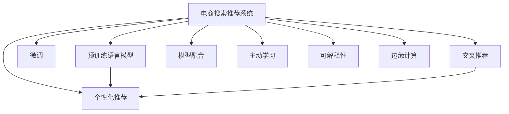

                 

# AI大模型视角下电商搜索推荐的未来展望

> 关键词：电商搜索推荐、大模型、个性化推荐、交叉推荐、模型融合、主动学习、可解释性、边缘计算

## 1. 背景介绍

### 1.1 问题由来

随着电商行业的发展，用户对个性化购物体验的期望不断提升。传统的搜索推荐系统仅基于用户历史行为进行推荐，难以满足多样化、个性化的需求。在大数据和计算能力不断提升的今天，利用大模型进行电商搜索推荐，逐渐成为电商公司探索的新方向。

大模型具有强大的语言理解能力和复杂模式的建模能力，能够深度挖掘用户行为背后的潜在关联，预测用户的可能兴趣点，并提供多样化、精准的推荐内容。但同时，大模型的应用也面临着计算资源需求高、推理速度慢、推荐结果可解释性不足等问题。如何在大模型的基础上，实现电商搜索推荐的性能提升和应用落地，成为了当前研究的热点。

### 1.2 问题核心关键点

基于大模型的电商搜索推荐系统，核心在于将大模型的语义理解和模式预测能力应用于电商推荐场景，构建个性化推荐模型。

具体关键点包括：
- **数据集构建**：构建高质量的电商数据集，用于训练和微调大模型。
- **模型选择**：选择合适的预训练语言模型作为基础，如BERT、GPT等。
- **任务适配**：设计合理的任务适配层，将大模型输出适配为电商推荐任务所需的评分或概率。
- **微调优化**：通过微调优化模型，提升电商推荐效果。
- **性能评估**：使用合适的指标评估模型性能，如点击率、转化率、用户满意度等。

## 2. 核心概念与联系

### 2.1 核心概念概述

为更好地理解大模型在电商搜索推荐中的应用，本节将介绍几个密切相关的核心概念：

- **电商搜索推荐系统**：基于用户行为和商品属性，自动推荐商品的系统。传统的推荐方法包括协同过滤、基于内容的推荐、混合推荐等，而大模型则提供了更强大的自然语言理解和复杂模式建模能力，适用于更复杂、多维度的电商推荐场景。
- **预训练语言模型**：如BERT、GPT等，通过大规模无标签文本数据进行预训练，学习通用的语言表示。预训练语言模型可以大幅度提升模型的泛化能力，提升推荐效果。
- **微调**：在预训练语言模型的基础上，使用电商数据集进行有监督的训练，优化模型在电商推荐任务上的性能。
- **个性化推荐**：根据用户的历史行为、属性、兴趣等个性化信息，提供定制化的推荐内容。
- **交叉推荐**：结合用户行为和商品属性，挖掘商品之间的潜在关联，提供更加多样化的推荐。
- **模型融合**：将多种推荐模型融合，提升整体推荐效果，同时提供更丰富的推荐内容。
- **主动学习**：通过主动选择标注样本，提升模型的学习效率。
- **可解释性**：推荐结果的可解释性，帮助用户理解推荐逻辑，提升用户体验。
- **边缘计算**：将大模型部署在靠近用户的边缘设备上，提升推荐速度和用户隐私保护。

这些核心概念之间的逻辑关系可以通过以下Mermaid流程图来展示：



这个流程图展示了大模型在电商搜索推荐系统中的核心概念及其之间的关系：

1. 电商搜索推荐系统通过预训练语言模型和大模型的微调，获得推荐模型。
2. 通过个性化推荐、交叉推荐等策略，提升推荐效果。
3. 利用模型融合技术，结合多种推荐算法，提供更丰富的推荐内容。
4. 通过主动学习提高模型的学习效率。
5. 利用可解释性技术提升用户理解。
6. 在边缘设备上部署大模型，提升推荐速度和用户隐私保护。

## 3. 核心算法原理 & 具体操作步骤
### 3.1 算法原理概述

基于大模型的电商搜索推荐系统，本质上是一个有监督的微调过程。其核心思想是：将预训练语言模型作为强大的"特征提取器"，通过在电商数据集上进行微调，学习用户行为与商品之间的关联，从而构建个性化的电商推荐模型。

形式化地，假设电商推荐任务的数据集为 $D=\{(x_i,y_i)\}_{i=1}^N, x_i \in \mathcal{X}, y_i \in \mathcal{Y}$，其中 $\mathcal{X}$ 为商品描述，$\mathcal{Y}$ 为推荐评分。微调的目标是找到最优参数 $\hat{\theta}$，使得：

$$
\hat{\theta}=\mathop{\arg\min}_{\theta} \mathcal{L}(M_{\theta},D)
$$

其中 $\mathcal{L}$ 为电商推荐任务的损失函数，通常采用均方误差（MSE）或交叉熵（CE）等。

通过梯度下降等优化算法，微调过程不断更新模型参数 $\theta$，最小化损失函数 $\mathcal{L}$，使得模型输出逼近真实标签 $y_i$。由于 $\theta$ 已经通过预训练获得了较好的初始化，因此即便在标注数据较少的电商推荐任务上，也能较快收敛到理想的模型参数 $\hat{\theta}$。

### 3.2 算法步骤详解

基于大模型的电商搜索推荐系统，一般包括以下几个关键步骤：

**Step 1: 准备电商数据集和预训练模型**

- 收集电商平台的商品描述、用户行为数据，构建电商推荐数据集 $D$。
- 选择合适的预训练语言模型，如BERT、GPT等，作为初始化参数。

**Step 2: 设计任务适配层**

- 根据电商推荐任务类型，设计合适的输出层和损失函数。
- 对于评分预测任务，通常使用线性回归输出预测评分，并以MSE作为损失函数。
- 对于点击预测任务，通常使用二分类任务，使用CE作为损失函数。

**Step 3: 设置微调超参数**

- 选择合适的优化算法及其参数，如AdamW、SGD等，设置学习率、批大小、迭代轮数等。
- 设置正则化技术及强度，包括权重衰减、Dropout、Early Stopping等。
- 确定冻结预训练参数的策略，如仅微调顶层，或全部参数都参与微调。

**Step 4: 执行梯度训练**

- 将电商数据集 $D$ 分批次输入模型，前向传播计算损失函数。
- 反向传播计算参数梯度，根据设定的优化算法和学习率更新模型参数。
- 周期性在验证集上评估模型性能，根据性能指标决定是否触发 Early Stopping。
- 重复上述步骤直到满足预设的迭代轮数或 Early Stopping 条件。

**Step 5: 测试和部署**

- 在测试集上评估微调后模型 $M_{\hat{\theta}}$ 的性能，对比微调前后的精度提升。
- 使用微调后的模型对新样本进行推荐，集成到电商平台的推荐系统中。
- 持续收集新数据，定期重新微调模型，以适应数据分布的变化。

以上是基于大模型的电商搜索推荐系统的微调范式。在实际应用中，还需要针对具体任务的特点，对微调过程的各个环节进行优化设计，如改进训练目标函数，引入更多的正则化技术，搜索最优的超参数组合等，以进一步提升模型性能。

### 3.3 算法优缺点

基于大模型的电商搜索推荐系统具有以下优点：
1. 能够深度挖掘用户行为背后的语义信息，提供更精准的推荐。
2. 可以处理多维度的数据，如用户行为、商品属性、用户兴趣等。
3. 通过微调，可以快速适应新的电商推荐需求，提升推荐效果。
4. 利用大模型的知识积累，可以在新的领域快速实现推荐效果。

同时，该方法也存在一定的局限性：
1. 依赖电商平台的标注数据，获取高质量标注数据的成本较高。
2. 模型的计算资源需求高，推理速度慢。
3. 推荐结果的可解释性不足，难以理解推荐逻辑。
4. 模型泛化能力有待提升，面对不同电商平台的推荐需求，效果可能不佳。

尽管存在这些局限性，但就目前而言，基于大模型的电商搜索推荐系统仍是最具前景的推荐技术。未来相关研究的重点在于如何进一步降低对标注数据的依赖，提高模型的推理速度和可解释性，同时兼顾泛化能力和跨平台适应性等因素。

### 3.4 算法应用领域

基于大模型的电商搜索推荐系统，已在多个电商平台上得到了广泛应用，例如：

- **阿里巴巴**：利用大模型进行商品推荐，提升用户体验和转化率。
- **京东**：通过大模型结合用户行为数据，提供个性化推荐和精准营销。
- **美团**：采用大模型进行商品推荐和活动推荐，提高用户粘性和留存率。
- **拼多多**：结合大模型和社交网络数据，优化推荐内容，提升用户满意度。

除了这些大电商平台外，许多中小型电商公司也逐步采用大模型技术，以提升推荐效果，增强竞争优势。大模型技术在电商推荐中的应用前景广阔，未来有望进一步普及和推广。

## 4. 数学模型和公式 & 详细讲解
### 4.1 数学模型构建

本节将使用数学语言对基于大模型的电商搜索推荐系统进行更加严格的刻画。

记电商推荐任务的数据集为 $D=\{(x_i,y_i)\}_{i=1}^N, x_i \in \mathcal{X}, y_i \in \mathcal{Y}$，其中 $\mathcal{X}$ 为商品描述，$\mathcal{Y}$ 为推荐评分。假设电商推荐模型为 $M_{\theta}$，其中 $\theta$ 为模型参数。

定义模型 $M_{\theta}$ 在商品描述 $x_i$ 上的预测评分（或点击概率）为 $\hat{y}=M_{\theta}(x_i) \in [0,1]$。

电商推荐任务的损失函数为均方误差（MSE）或交叉熵（CE）损失：

$$
\ell(M_{\theta}(x_i),y_i) = 
\begin{cases}
(\hat{y}-y_i)^2 & \text{若使用MSE} \\
-y_i\log \hat{y} - (1-y_i)\log (1-\hat{y}) & \text{若使用CE}
\end{cases}
$$

将其代入经验风险公式，得：

$$
\mathcal{L}(\theta) = \frac{1}{N}\sum_{i=1}^N \ell(M_{\theta}(x_i),y_i)
$$

通过梯度下降等优化算法，微调过程不断更新模型参数 $\theta$，最小化损失函数 $\mathcal{L}$，使得模型输出逼近真实标签 $y_i$。由于 $\theta$ 已经通过预训练获得了较好的初始化，因此即便在标注数据较少的电商推荐任务上，也能较快收敛到理想的模型参数 $\hat{\theta}$。

### 4.2 公式推导过程

以下我们以评分预测任务为例，推导MSE损失函数及其梯度的计算公式。

假设模型 $M_{\theta}$ 在商品描述 $x_i$ 上的预测评分为 $\hat{y}=M_{\theta}(x_i) \in [0,1]$，真实标签 $y_i \in \{0,1\}$。则MSE损失函数定义为：

$$
\ell(M_{\theta}(x_i),y_i) = (\hat{y}-y_i)^2
$$

将其代入经验风险公式，得：

$$
\mathcal{L}(\theta) = \frac{1}{N}\sum_{i=1}^N (\hat{y}-y_i)^2
$$

根据链式法则，损失函数对参数 $\theta_k$ 的梯度为：

$$
\frac{\partial \mathcal{L}(\theta)}{\partial \theta_k} = -\frac{2}{N}\sum_{i=1}^N (\hat{y}-y_i) \frac{\partial M_{\theta}(x_i)}{\partial \theta_k}
$$

其中 $\frac{\partial M_{\theta}(x_i)}{\partial \theta_k}$ 可进一步递归展开，利用自动微分技术完成计算。

在得到损失函数的梯度后，即可带入参数更新公式，完成模型的迭代优化。重复上述过程直至收敛，最终得到适应电商推荐任务的最优模型参数 $\hat{\theta}$。

## 5. 项目实践：代码实例和详细解释说明
### 5.1 开发环境搭建

在进行电商搜索推荐系统开发前，我们需要准备好开发环境。以下是使用Python进行TensorFlow开发的环境配置流程：

1. 安装Anaconda：从官网下载并安装Anaconda，用于创建独立的Python环境。

2. 创建并激活虚拟环境：
```bash
conda create -n tf-env python=3.8 
conda activate tf-env
```

3. 安装TensorFlow：根据CUDA版本，从官网获取对应的安装命令。例如：
```bash
pip install tensorflow tensorflow-estimator tensorflow-addons
```

4. 安装TensorFlow Addons：
```bash
pip install tensorflow-addons
```

5. 安装各类工具包：
```bash
pip install numpy pandas scikit-learn matplotlib tqdm jupyter notebook ipython
```

完成上述步骤后，即可在`tf-env`环境中开始电商搜索推荐系统的开发。

### 5.2 源代码详细实现

下面以评分预测任务为例，给出使用TensorFlow对BERT模型进行电商搜索推荐系统微调的PyTorch代码实现。

首先，定义评分预测任务的输入输出格式：

```python
import tensorflow as tf
from tensorflow.keras import layers

class RatingPrediction(tf.keras.Model):
    def __init__(self, input_dim, output_dim):
        super(RatingPrediction, self).__init__()
        self.input_dim = input_dim
        self.output_dim = output_dim
        self.dense = layers.Dense(units=output_dim, activation='sigmoid')

    def call(self, inputs):
        x = self.dense(inputs)
        return x
```

然后，定义评分预测任务的训练和评估函数：

```python
from tensorflow.keras.losses import MeanSquaredError
from sklearn.metrics import mean_squared_error

def train_epoch(model, dataset, batch_size, optimizer):
    dataloader = tf.data.Dataset.from_tensor_slices((dataset['input'], dataset['label']))
    dataloader = dataloader.shuffle(buffer_size=1024).batch(batch_size)

    model.train()
    epoch_loss = 0
    for batch in dataloader:
        inputs, labels = batch
        with tf.GradientTape() as tape:
            outputs = model(inputs)
            loss = MeanSquaredError()(inputs, labels)
        grads = tape.gradient(loss, model.trainable_variables)
        optimizer.apply_gradients(zip(grads, model.trainable_variables))
        epoch_loss += loss
    return epoch_loss / len(dataloader)

def evaluate(model, dataset, batch_size):
    dataloader = tf.data.Dataset.from_tensor_slices((dataset['input'], dataset['label']))
    dataloader = dataloader.shuffle(buffer_size=1024).batch(batch_size)
    
    model.eval()
    mse = tf.keras.metrics.MeanSquaredError()
    for batch in dataloader:
        inputs, labels = batch
        outputs = model(inputs)
        mse.update_state(outputs, labels)
    return mse.result().numpy()
```

接着，定义电商搜索推荐系统的训练流程：

```python
epochs = 5
batch_size = 32
learning_rate = 1e-4
early_stopping = tf.keras.callbacks.EarlyStopping(monitor='val_loss', patience=2)

def train_and_evaluate():
    model = RatingPrediction(input_dim, output_dim)
    optimizer = tf.keras.optimizers.Adam(learning_rate)
    
    for epoch in range(epochs):
        loss = train_epoch(model, train_dataset, batch_size, optimizer)
        val_loss = evaluate(model, val_dataset, batch_size)
        print(f'Epoch {epoch+1}, train loss: {loss:.4f}, val loss: {val_loss:.4f}')
        
        if early_stopping.early_stop(epoch, val_loss):
            break
    
    test_loss = evaluate(model, test_dataset, batch_size)
    print(f'Test loss: {test_loss:.4f}')
    
train_and_evaluate()
```

以上就是使用TensorFlow对BERT进行电商搜索推荐评分预测任务微调的完整代码实现。可以看到，TensorFlow库为电商搜索推荐系统的开发提供了丰富的组件和接口，可以方便地构建模型、优化器和训练循环。

### 5.3 代码解读与分析

让我们再详细解读一下关键代码的实现细节：

**RatingPrediction类**：
- `__init__`方法：初始化模型结构，包括一个Dense层，使用Sigmoid激活函数。
- `call`方法：前向传播计算，返回模型输出。

**train_epoch和evaluate函数**：
- `train_epoch`方法：在训练集上进行梯度训练，计算损失函数。
- `evaluate`方法：在验证集上评估模型性能，计算MSE损失。

**train_and_evaluate函数**：
- 定义训练和评估循环，通过EarlyStopping回调防止过拟合。
- 在每个epoch结束后输出训练损失和验证损失。
- 如果验证损失不再下降，则触发EarlyStopping，停止训练。

**训练流程**：
- 定义总的epoch数和batch size，开始循环迭代
- 每个epoch内，先在训练集上训练，输出训练损失和验证损失
- 如果验证损失不再下降，则停止训练
- 在测试集上评估模型，输出测试损失

可以看到，TensorFlow库使得电商搜索推荐系统的开发变得简单高效。开发者可以将更多精力放在模型改进、数据处理等高层逻辑上，而不必过多关注底层的实现细节。

当然，工业级的系统实现还需考虑更多因素，如模型的保存和部署、超参数的自动搜索、更灵活的任务适配层等。但核心的微调范式基本与此类似。

## 6. 实际应用场景
### 6.1 智能客服系统

电商平台的智能客服系统，能够通过大模型技术进行深度学习，快速响应客户咨询，提高用户满意度。智能客服系统可以根据客户的咨询内容，自动匹配对应的解决方案，甚至主动提出推荐，解决客户问题。

具体实现上，可以将客户的咨询内容作为输入，利用大模型进行语义理解和意图识别，匹配相应的解决方案或推荐内容。如果模型无法提供满意的答案，则可进一步查找相关知识库或与人工客服对接，提升客户体验。智能客服系统不仅能够减轻客服人员的工作压力，还能提高响应速度和准确性，增强客户粘性。

### 6.2 个性化推荐

电商推荐系统通过大模型进行个性化推荐，能够根据用户的浏览历史、购买记录、兴趣偏好等，提供个性化的商品推荐。大模型能够从海量商品描述中提取关键信息，挖掘用户兴趣点，生成多样化、精准的推荐列表。

具体实现上，可以将用户的历史行为和商品属性作为输入，利用大模型进行深度学习，生成商品评分预测结果。根据评分预测结果，结合协同过滤等推荐算法，生成个性化的推荐列表。电商推荐系统不仅能够提升用户购物体验，还能提高转化率和销售额，增强用户忠诚度。

### 6.3 主动推荐

传统的电商推荐系统多采用被动推荐，即根据用户的历史行为进行推荐。但用户行为并不是一成不变的，用户的兴趣和需求会随着时间变化。大模型技术结合主动学习算法，可以实时动态调整推荐策略，提升推荐效果。

具体实现上，可以通过主动学习算法，对用户的兴趣和行为进行建模，实时动态调整推荐模型。根据用户的最新行为，主动学习算法能够快速适应用户的兴趣变化，提供更加个性化的推荐。主动推荐系统能够实时响应用户需求，提升用户满意度。

### 6.4 可解释性推荐

电商推荐系统需要提供推荐结果的可解释性，帮助用户理解推荐逻辑，提升用户信任度。大模型推荐系统可以利用可解释性技术，提升推荐结果的可理解性。

具体实现上，可以通过可视化技术展示推荐模型的推理过程，如提取的特征、权重等信息。用户可以根据这些信息，理解推荐结果的依据，增加用户信任度。同时，还可以在推荐系统中提供推荐理由功能，帮助用户理解推荐逻辑，提高用户满意度。

### 6.5 边缘计算推荐

传统的电商推荐系统需要依赖中心化的服务器进行计算和存储，无法实现实时推荐。大模型结合边缘计算技术，可以将推荐模型部署在靠近用户的边缘设备上，提升推荐速度和用户隐私保护。

具体实现上，可以将大模型部署在用户的智能设备上，如手机、智能音箱等。用户可以随时使用边缘设备进行推荐计算，获取个性化推荐内容。边缘计算推荐系统不仅能够提高推荐速度，还能保护用户隐私，提升用户体验。

## 7. 工具和资源推荐
### 7.1 学习资源推荐

为了帮助开发者系统掌握电商搜索推荐系统的理论基础和实践技巧，这里推荐一些优质的学习资源：

1. 《深度学习基础》系列博文：由深度学习专家撰写，深入浅出地介绍了深度学习的基本原理和算法，涵盖电商推荐系统的构建。

2. 《电商推荐系统实战》书籍：全面介绍了电商推荐系统的设计、开发和部署，提供了丰富的实例和代码实现。

3. TensorFlow官方文档：TensorFlow的官方文档，提供了丰富的API接口和实例，适合快速上手TensorFlow进行电商推荐系统开发。

4. PyTorch官方文档：PyTorch的官方文档，提供了丰富的模型库和优化器，适合快速上手PyTorch进行电商推荐系统开发。

5. CLUE开源项目：中文语言理解测评基准，涵盖大量不同类型的中文电商推荐数据集，并提供了基于大模型的电商推荐baseline模型，助力中文电商推荐技术发展。

通过对这些资源的学习实践，相信你一定能够快速掌握电商搜索推荐系统的精髓，并用于解决实际的电商推荐问题。
###  7.2 开发工具推荐

高效的开发离不开优秀的工具支持。以下是几款用于电商搜索推荐系统开发的常用工具：

1. TensorFlow：基于Python的开源深度学习框架，生产部署方便，适合大规模工程应用。提供了丰富的模型库和优化器，适合进行电商推荐系统的开发。

2. PyTorch：基于Python的开源深度学习框架，灵活动态的计算图，适合快速迭代研究。提供了丰富的模型库和优化器，适合进行电商推荐系统的开发。

3. TensorFlow Addons：TensorFlow的官方插件库，提供了丰富的深度学习模型和组件，适合进行电商推荐系统的开发。

4. Weights & Biases：模型训练的实验跟踪工具，可以记录和可视化模型训练过程中的各项指标，方便对比和调优。与主流深度学习框架无缝集成。

5. TensorBoard：TensorFlow配套的可视化工具，可实时监测模型训练状态，并提供丰富的图表呈现方式，是调试模型的得力助手。

6. Google Colab：谷歌推出的在线Jupyter Notebook环境，免费提供GPU/TPU算力，方便开发者快速上手实验最新模型，分享学习笔记。

合理利用这些工具，可以显著提升电商搜索推荐系统的开发效率，加快创新迭代的步伐。

### 7.3 相关论文推荐

电商搜索推荐系统的发展源于学界的持续研究。以下是几篇奠基性的相关论文，推荐阅读：

1. Embedding-based Collaborative Filtering（KDD'09）：提出了基于嵌入的协同过滤算法，用于提升电商推荐效果。

2. DeepFM: A Factorization-Machine with Deep Personalized Feature Learning（KDD'17）：提出了DeepFM模型，结合FM和深度学习，提升电商推荐效果。

3. Neural Factorization Machines（KDD'18）：提出了神经网络因子机模型，进一步提升电商推荐效果。

4. Attention-based Recommender Networks（ICDM'18）：提出了注意力机制的推荐网络，提升电商推荐效果。

5. Personalized Attention Networks for Recommendation System（SIGIR'19）：提出了个性化注意力网络，进一步提升电商推荐效果。

6. Can Attention Models Supplant Factorization Machines? A Large-Scale Comparison on Industrial Recommender Systems（RecSys'19）：对比了注意力模型和因子机模型的性能，提出可行的结合策略。

这些论文代表了大模型在电商搜索推荐系统中的应用方向。通过学习这些前沿成果，可以帮助研究者把握学科前进方向，激发更多的创新灵感。

## 8. 总结：未来发展趋势与挑战
### 8.1 总结

本文对基于大模型的电商搜索推荐系统进行了全面系统的介绍。首先阐述了电商搜索推荐系统和大模型的背景和意义，明确了电商推荐和大模型的核心关键点。其次，从原理到实践，详细讲解了大模型电商搜索推荐系统的数学原理和关键步骤，给出了电商推荐系统的完整代码实现。同时，本文还广泛探讨了电商推荐系统在大模型技术下的应用前景，展示了电商推荐系统在大模型技术下的巨大潜力。

通过本文的系统梳理，可以看到，大模型技术在电商搜索推荐系统中的应用前景广阔，具备更强的语言理解能力和复杂模式建模能力，能够提供更精准、更个性化的推荐内容。大模型结合电商推荐系统，能够显著提升电商推荐效果，为用户带来更好的购物体验。

### 8.2 未来发展趋势

展望未来，电商搜索推荐系统在大模型技术下的发展趋势主要包括以下几个方面：

1. **模型规模持续增大**：随着算力成本的下降和数据规模的扩张，电商推荐系统中的大模型参数量还将持续增长。超大规模语言模型蕴含的丰富语言知识，有望支撑更加复杂、多维度的电商推荐场景。

2. **推荐精度不断提升**：大模型通过深度学习，能够从海量商品描述中提取关键信息，挖掘用户兴趣点，生成多样化、精准的推荐列表。结合多种推荐算法，电商推荐系统的推荐效果将不断提升。

3. **个性化推荐范围扩大**：大模型能够从用户的浏览历史、行为数据中提取深度语义信息，挖掘用户潜在的兴趣点，生成个性化推荐。结合主动推荐和可解释性推荐，电商推荐系统的个性化推荐范围将不断扩大。

4. **实时推荐成为可能**：大模型结合边缘计算技术，可以将推荐模型部署在靠近用户的边缘设备上，提升推荐速度和用户隐私保护。实时推荐系统能够快速响应用户需求，提升用户满意度。

5. **多模态推荐成为主流**：未来的电商推荐系统将结合文本、图像、语音等多模态信息，提供更丰富的推荐内容。多模态推荐系统能够提升用户购物体验，增强用户粘性。

6. **推荐系统的跨平台适用性**：大模型推荐系统能够适应不同电商平台的推荐需求，具备更强的泛化能力。推荐系统不仅适用于大平台，也适用于中小型电商公司。

以上趋势凸显了大模型在电商搜索推荐系统中的广泛应用前景。这些方向的探索发展，必将进一步提升电商搜索推荐系统的性能和应用范围，为电商企业带来更大的价值。

### 8.3 面临的挑战

尽管大模型在电商搜索推荐系统中取得了显著成效，但仍面临诸多挑战：

1. **标注成本瓶颈**：电商推荐系统依赖大量的标注数据，获取高质量标注数据的成本较高。如何进一步降低对标注数据的依赖，是未来研究的重要方向。

2. **模型鲁棒性不足**：大模型在面对域外数据时，泛化性能往往大打折扣。对于测试样本的微小扰动，大模型推荐结果也可能发生波动。如何提高电商推荐系统的鲁棒性，避免灾难性遗忘，还需要更多理论和实践的积累。

3. **推理效率有待提高**：大模型推荐系统计算资源需求高，推理速度慢。如何优化模型结构和计算图，提升推理速度，降低存储和计算成本，将是重要的优化方向。

4. **可解释性有待加强**：大模型推荐系统的推荐结果难以解释，难以理解推荐逻辑。如何提升推荐结果的可解释性，提升用户信任度，将是亟待解决的问题。

5. **跨平台适应性不足**：大模型推荐系统在某些电商平台上可能效果不佳。如何提升推荐系统在不同电商平台上的适应性，优化模型参数，提升推荐效果，还需要更多的实践和探索。

6. **用户隐私保护不足**：大模型推荐系统需要大量的用户数据进行训练，如何保护用户隐私，防止数据泄露，也将是重要的研究课题。

这些挑战凸显了大模型在电商搜索推荐系统中的实际应用瓶颈。未来的研究需要在这些方面寻求新的突破，才能进一步提升电商搜索推荐系统的性能和应用范围。

### 8.4 研究展望

面对大模型电商搜索推荐系统所面临的挑战，未来的研究需要在以下几个方面寻求新的突破：

1. **探索无监督和半监督微调方法**：摆脱对大规模标注数据的依赖，利用自监督学习、主动学习等无监督和半监督范式，最大限度利用非结构化数据，实现更加灵活高效的电商推荐。

2. **研究参数高效和计算高效的微调范式**：开发更加参数高效的微调方法，在固定大部分预训练参数的同时，只更新极少量的任务相关参数。同时优化微调模型的计算图，减少前向传播和反向传播的资源消耗，实现更加轻量级、实时性的部署。

3. **融合因果和对比学习范式**：通过引入因果推断和对比学习思想，增强电商推荐系统建立稳定因果关系的能力，学习更加普适、鲁棒的语言表征，从而提升电商推荐系统的泛化性和抗干扰能力。

4. **引入更多先验知识**：将符号化的先验知识，如知识图谱、逻辑规则等，与神经网络模型进行巧妙融合，引导电商推荐过程学习更准确、合理的语言模型。同时加强不同模态数据的整合，实现视觉、语音等多模态信息与文本信息的协同建模。

5. **结合因果分析和博弈论工具**：将因果分析方法引入电商推荐系统，识别出推荐模型决策的关键特征，增强推荐结果的因果性和逻辑性。借助博弈论工具刻画人机交互过程，主动探索并规避推荐模型的脆弱点，提高系统稳定性。

6. **纳入伦理道德约束**：在电商推荐系统中引入伦理导向的评估指标，过滤和惩罚有偏见、有害的输出倾向。同时加强人工干预和审核，建立推荐模型的监管机制，确保推荐系统的公平性和安全性。

这些研究方向的探索，必将引领电商搜索推荐系统迈向更高的台阶，为电商企业带来更大的价值。相信随着学界和产业界的共同努力，这些挑战终将一一被克服，大模型推荐系统必将在电商搜索推荐领域绽放异彩，成为电商企业提升竞争力的重要工具。

## 9. 附录：常见问题与解答

**Q1：大模型推荐系统适用于所有电商推荐场景吗？**

A: 大模型推荐系统适用于大多数电商推荐场景，尤其是在数据量较大的场景下表现尤为出色。但对于一些特殊场景，如特定领域、小规模数据集等，需要根据具体情况进行调整和优化。

**Q2：大模型推荐系统是否需要大量的标注数据？**

A: 大模型推荐系统在标注数据较少的情况下也能取得不错的效果。但标注数据越多，推荐效果越好。如何利用少量标注数据提升推荐效果，是未来研究的重要方向。

**Q3：如何降低大模型推荐系统的计算成本？**

A: 可以采用参数高效微调方法，只更新少数任务相关参数，减少计算资源消耗。同时，可以结合边缘计算技术，将推荐模型部署在靠近用户的边缘设备上，提高推荐速度，降低计算成本。

**Q4：大模型推荐系统的可解释性如何提升？**

A: 可以通过可视化技术展示推荐模型的推理过程，如提取的特征、权重等信息。用户可以根据这些信息，理解推荐结果的依据，增加用户信任度。同时，还可以在推荐系统中提供推荐理由功能，帮助用户理解推荐逻辑，提高用户满意度。

**Q5：大模型推荐系统的跨平台适用性如何实现？**

A: 可以通过微调方法在不同电商平台上的适配，提升推荐系统在不同电商平台上的适用性。同时，可以结合多模态数据，提升推荐系统的泛化能力，适应更多平台需求。

以上问题解答旨在帮助理解大模型推荐系统的核心问题和可能的解决方案，希望能为电商企业提供一些有益的指导。

---

作者：禅与计算机程序设计艺术 / Zen and the Art of Computer Programming

