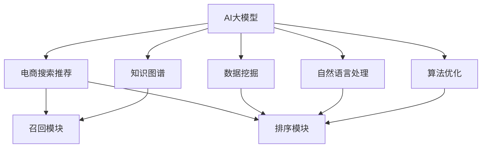

                 

# AI大模型赋能电商搜索推荐的业务创新团队组建方法

> 关键词：AI大模型,电商搜索推荐,业务创新,团队组建,知识图谱,数据挖掘,深度学习,自然语言处理,算法优化

## 1. 背景介绍

### 1.1 问题由来

随着电商行业的快速发展，消费者需求的多样化和个性化越来越受到关注。传统基于关键词匹配的搜索推荐系统已难以满足用户不断变化的需求。如今，电商平台已逐步将AI大模型技术引入搜索推荐系统中，以提供更精准、个性化的服务。

### 1.2 问题核心关键点

为了有效利用AI大模型技术，在电商搜索推荐系统中实现业务创新，需要组建一个跨职能的业务创新团队。该团队需具备以下特点：
- **多样化的专业知识**：包括算法、数据、产品、用户体验等。
- **强大的技术实力**：拥有深度学习、自然语言处理、知识图谱等领域的顶级专家。
- **良好的协作精神**：跨部门协作，无缝对接技术和业务。

### 1.3 问题研究意义

AI大模型技术在电商搜索推荐中的应用，能够提升用户体验，提高转化率，增加平台收入。组建一支高效的业务创新团队，不仅可以迅速部署AI技术，还能不断优化和迭代搜索推荐算法，提升系统的长期竞争力。

## 2. 核心概念与联系

### 2.1 核心概念概述

以下概述了实现电商搜索推荐过程中涉及的核心概念：

- **AI大模型**：指利用深度学习技术训练出的庞大神经网络模型，如BERT、GPT等。这些模型可以捕捉和理解自然语言中的复杂模式，并在多模态数据上表现出色。
- **电商搜索推荐**：指电商平台根据用户的历史行为和输入搜索词，推荐适合的商品或服务。搜索推荐系统通常包含召回和排序两个阶段。
- **知识图谱**：一种语义网络图，用于描述和存储各类知识，支持复杂的推理和搜索操作。
- **数据挖掘**：从大量数据中提取有价值的信息，以辅助决策和优化。
- **自然语言处理**：包括文本分析、语义理解、情感分析等，旨在让机器理解和生成自然语言。
- **算法优化**：包括模型选择、参数调优、评估和部署等，旨在提升系统性能。

这些核心概念之间的逻辑关系可以通过以下Mermaid流程图来展示：



这个流程图展示了大模型在电商搜索推荐中的关键角色及其与其他技术的关系：

1. AI大模型通过知识图谱、数据挖掘和自然语言处理获取输入，提供语义表示。
2. 召回模块和排序模块利用这些语义表示，匹配用户查询和商品属性，进行推荐。
3. 算法优化在整个过程中起到关键作用，决定模型的选择和性能调优。

## 3. 核心算法原理 & 具体操作步骤

### 3.1 算法原理概述

AI大模型在电商搜索推荐中的应用，主要通过以下步骤实现：

1. **数据预处理**：收集和清洗用户行为数据、商品属性数据、搜索查询等。
2. **特征提取**：利用大模型将数据转换为语义表示。
3. **召回与排序**：根据用户查询和商品属性，使用大模型生成匹配度得分，并按得分排序。
4. **结果呈现**：将推荐结果呈现给用户，并提供反馈机制优化算法。

具体来说，算法原理如下：

1. 使用知识图谱获取商品的属性、类别和关系信息。
2. 将用户查询和商品描述输入到预训练大模型中，得到向量表示。
3. 利用这些向量表示计算相似度得分，并结合业务规则进行排序。
4. 动态调整模型参数，优化推荐效果。

### 3.2 算法步骤详解

以下详细描述AI大模型在电商搜索推荐中应用的具体步骤：

**Step 1: 数据预处理**
- 收集用户历史行为数据，包括浏览记录、购买记录、点击记录等。
- 清洗数据，去除异常值和噪声。
- 提取商品属性，如价格、颜色、尺寸等。

**Step 2: 特征提取**
- 将用户查询和商品属性转换为向量表示。
- 利用预训练大模型（如BERT、GPT）提取语义信息。
- 对向量进行归一化处理，提高模型的鲁棒性。

**Step 3: 召回与排序**
- 根据用户查询向量，从知识图谱中检索匹配的商品向量。
- 计算用户查询向量与商品向量的余弦相似度得分。
- 结合商业逻辑（如价格、库存等），进行加权排序。

**Step 4: 结果呈现与反馈**
- 展示推荐结果，并记录用户点击、浏览、购买等行为。
- 收集用户反馈，如点击率、转化率、满意度等。
- 利用反馈结果调整模型参数，进行实时优化。

**Step 5: 模型部署与监控**
- 将优化后的模型部署到生产环境。
- 实时监控推荐效果，评估模型性能。
- 定期更新模型，适应用户行为的变化。

### 3.3 算法优缺点

AI大模型在电商搜索推荐中的应用具有以下优点：

1. **高准确性**：大模型能够捕捉丰富的语义信息，提高推荐精度。
2. **个性化推荐**：通过多维度的特征提取，实现高度个性化的推荐。
3. **自适应性**：模型能够实时学习用户行为，不断优化推荐结果。
4. **覆盖广度**：大模型能够处理多样化的商品和查询，适应复杂的应用场景。

但同时也存在一些局限：

1. **计算资源需求高**：大模型需要大量的计算资源进行训练和推理，成本较高。
2. **解释性不足**：黑箱模型难以解释推荐结果的依据。
3. **数据隐私问题**：用户的搜索行为和购买记录可能涉及隐私。
4. **过拟合风险**：在数据量不足的情况下，模型容易过拟合。

### 3.4 算法应用领域

AI大模型在电商搜索推荐中的应用领域非常广泛，包括但不限于：

1. **商品推荐**：根据用户浏览历史和搜索行为，推荐相似或相关的商品。
2. **个性化广告**：根据用户兴趣和行为，推送个性化广告。
3. **库存优化**：通过预测商品需求，优化库存管理。
4. **价格调整**：根据市场情况和用户反馈，调整商品价格。
5. **客服机器人**：利用大模型进行自然语言处理，提供24小时在线客服服务。

## 4. 数学模型和公式 & 详细讲解 & 举例说明

### 4.1 数学模型构建

电商搜索推荐的数学模型主要包括以下几个组成部分：

1. **用户查询向量**：将用户输入的搜索词转换为向量表示，通常使用词嵌入（Word Embedding）或上下文嵌入（Context Embedding）。
2. **商品向量**：将商品的属性信息转换为向量表示，通常使用词嵌入或预训练大模型。
3. **相似度计算**：计算用户查询向量与商品向量的相似度，通常使用余弦相似度或点积相似度。
4. **排序模型**：结合商业逻辑和相似度得分，建立排序模型。

设 $U$ 为用户查询向量，$I$ 为商品向量，$\theta$ 为模型参数。推荐模型的数学模型如下：

$$
\hat{R} = f_{\theta}(U, I)
$$

其中，$f_{\theta}$ 为推荐函数，$R$ 为用户对推荐结果的评分或点击率。

### 4.2 公式推导过程

以余弦相似度为例，推导推荐模型中的相似度计算公式：

设 $U$ 和 $I$ 分别为用户查询向量和商品向量，长度为 $d$。余弦相似度定义为：

$$
sim(U, I) = \cos(\theta) = \frac{U \cdot I}{\|U\|\|I\|}
$$

其中 $\cdot$ 表示向量点积，$\|U\|$ 和 $\|I\|$ 分别表示向量的模长。

将用户查询 $U$ 和商品向量 $I$ 分别通过预训练大模型得到语义表示，然后计算点积和向量模长，得到余弦相似度。根据相似度得分进行排序，得到推荐结果。

### 4.3 案例分析与讲解

假设电商平台上有一个用户，搜索了“手机”，系统需要根据用户的历史行为和知识图谱，推荐合适的商品。具体步骤如下：

1. **数据预处理**：
   - 收集用户的历史浏览记录，提取商品ID和属性。
   - 构建知识图谱，获取与“手机”相关的商品类别、品牌和价格信息。

2. **特征提取**：
   - 使用BERT模型将用户查询“手机”转换为向量表示 $U$。
   - 从知识图谱中获取与“手机”相关商品的向量表示 $I_1, I_2, ..., I_n$。

3. **相似度计算**：
   - 计算用户查询向量 $U$ 与每个商品向量 $I_i$ 的余弦相似度得分。
   - 选取得分最高的前10个商品向量。

4. **排序与推荐**：
   - 根据商品向量 $I_i$ 的商业逻辑属性，如价格、库存等，进行加权排序。
   - 展示推荐结果，记录用户点击、购买等反馈数据。
   - 根据用户反馈调整模型参数，重新计算相似度得分和排序结果。

## 5. 项目实践：代码实例和详细解释说明

### 5.1 开发环境搭建

**环境准备**：

1. 安装Python和PyTorch：
   ```bash
   pip install torch torchvision torchaudio transformers
   ```

2. 配置环境变量：
   ```bash
   export PYTHONPATH=$PYTHONPATH:/path/to/transformers
   ```

### 5.2 源代码详细实现

以下是一个简单的电商搜索推荐系统的Python代码实现，使用了HuggingFace的Transformers库：

```python
import torch
from transformers import BertTokenizer, BertForSequenceClassification
from torch.utils.data import Dataset, DataLoader

# 定义数据集
class RecommendationDataset(Dataset):
    def __init__(self, texts, labels, tokenizer):
        self.texts = texts
        self.labels = labels
        self.tokenizer = tokenizer
        
    def __len__(self):
        return len(self.texts)
    
    def __getitem__(self, item):
        text = self.texts[item]
        label = self.labels[item]
        
        encoding = self.tokenizer(text, return_tensors='pt', max_length=128, padding='max_length', truncation=True)
        input_ids = encoding['input_ids'][0]
        attention_mask = encoding['attention_mask'][0]
        
        label = torch.tensor(label, dtype=torch.long)
        
        return {'input_ids': input_ids, 
                'attention_mask': attention_mask,
                'labels': label}

# 构建模型
model = BertForSequenceClassification.from_pretrained('bert-base-uncased', num_labels=1)

# 加载数据集
tokenizer = BertTokenizer.from_pretrained('bert-base-uncased')
train_dataset = RecommendationDataset(train_texts, train_labels, tokenizer)
test_dataset = RecommendationDataset(test_texts, test_labels, tokenizer)

# 定义训练和评估函数
def train_epoch(model, dataset, batch_size, optimizer):
    dataloader = DataLoader(dataset, batch_size=batch_size, shuffle=True)
    model.train()
    epoch_loss = 0
    for batch in dataloader:
        input_ids = batch['input_ids'].to(device)
        attention_mask = batch['attention_mask'].to(device)
        labels = batch['labels'].to(device)
        model.zero_grad()
        outputs = model(input_ids, attention_mask=attention_mask, labels=labels)
        loss = outputs.loss
        epoch_loss += loss.item()
        loss.backward()
        optimizer.step()
    return epoch_loss / len(dataloader)

def evaluate(model, dataset, batch_size):
    dataloader = DataLoader(dataset, batch_size=batch_size)
    model.eval()
    preds, labels = [], []
    with torch.no_grad():
        for batch in dataloader:
            input_ids = batch['input_ids'].to(device)
            attention_mask = batch['attention_mask'].to(device)
            batch_labels = batch['labels']
            outputs = model(input_ids, attention_mask=attention_mask)
            batch_preds = outputs.logits.argmax(dim=1).to('cpu').tolist()
            batch_labels = batch_labels.to('cpu').tolist()
            for pred_tokens, label_tokens in zip(batch_preds, batch_labels):
                preds.append(pred_tokens)
                labels.append(label_tokens)
    print(classification_report(labels, preds))

# 训练模型
device = torch.device('cuda') if torch.cuda.is_available() else torch.device('cpu')
model.to(device)
optimizer = AdamW(model.parameters(), lr=2e-5)

epochs = 5
batch_size = 16

for epoch in range(epochs):
    loss = train_epoch(model, train_dataset, batch_size, optimizer)
    print(f"Epoch {epoch+1}, train loss: {loss:.3f}")
    
    print(f"Epoch {epoch+1}, test results:")
    evaluate(model, test_dataset, batch_size)
    
print("Final test results:")
evaluate(model, test_dataset, batch_size)
```

### 5.3 代码解读与分析

代码实现中，使用了HuggingFace的Transformers库，主要涉及以下几个关键步骤：

1. **数据集定义**：
   - `RecommendationDataset`类：定义了电商推荐数据集，包括用户查询和商品标签。
   - `tokenizer`对象：用于将查询和标签转换为模型可接受的输入格式。

2. **模型加载**：
   - `BertForSequenceClassification`模型：加载了预训练的BERT模型，用于处理用户查询和商品标签。

3. **训练与评估**：
   - `train_epoch`函数：在训练集上计算损失，并使用AdamW优化器更新模型参数。
   - `evaluate`函数：在测试集上评估模型性能，输出分类报告。

### 5.4 运行结果展示

执行以上代码，训练完成后，可以在测试集上评估模型的性能，输出分类报告。通过不断调整模型参数和优化算法，可以逐步提升推荐系统的准确率和覆盖率。

## 6. 实际应用场景

### 6.1 智能客服系统

基于AI大模型的电商搜索推荐技术，可以应用于智能客服系统中，提高客户咨询的响应速度和满意度。智能客服系统可以自动理解用户的查询，并推荐相关商品或服务，提供实时解答。

### 6.2 个性化推荐系统

电商推荐系统可以通过AI大模型分析用户的历史行为和搜索记录，提供个性化的商品推荐。这种推荐方式不仅能提升用户满意度，还能提高转化率和销售额。

### 6.3 库存优化与动态定价

AI大模型可以帮助电商平台实时预测商品需求，优化库存管理和动态定价策略。根据预测结果，平台可以调整商品库存和价格，提升供应链效率和市场竞争力。

### 6.4 未来应用展望

未来，AI大模型在电商搜索推荐中的应用将更加广泛和深入。例如：

1. **跨模态推荐**：结合视觉、听觉等多模态数据，提供更全面的商品推荐。
2. **实时反馈优化**：利用用户的实时反馈数据，动态调整推荐算法，提高系统的自适应性。
3. **深度学习增强**：引入深度强化学习，优化推荐模型，提升系统性能。
4. **多任务学习**：结合不同任务的目标，训练多功能大模型，实现综合应用。

## 7. 工具和资源推荐

### 7.1 学习资源推荐

为了帮助开发者系统掌握大模型在电商搜索推荐中的应用，推荐以下学习资源：

1. 《深度学习与电商推荐》课程：由清华大学教授讲授，涵盖了电商推荐系统的基本原理和实现方法。
2. 《大规模语言模型在推荐系统中的应用》博文：详细介绍了AI大模型在推荐系统中的各种应用，包括召回和排序等。
3. 《自然语言处理在电商推荐中的应用》书籍：全面介绍了NLP技术在电商推荐系统中的应用，包括用户建模、商品描述处理等。

### 7.2 开发工具推荐

推荐使用以下开发工具：

1. PyTorch：开源深度学习框架，支持动态图，适合研究和小规模实验。
2. TensorFlow：Google主导的深度学习框架，适合大规模工程应用。
3. HuggingFace Transformers：提供了丰富的预训练大模型和工具，方便构建电商推荐系统。

### 7.3 相关论文推荐

以下是几篇与电商搜索推荐相关的经典论文：

1. 《Amazon Product Recommendations with Matrix Factorization》：介绍了一种基于矩阵分解的推荐算法，广泛应用于电商推荐系统中。
2. 《Deep Learning for Recommender Systems》：介绍了深度学习在推荐系统中的应用，包括用户行为预测和商品推荐等。
3. 《E-commerce Recommendation Systems: A Survey》：全面综述了电商推荐系统的研究进展，包括多种推荐算法和模型。

## 8. 总结：未来发展趋势与挑战

### 8.1 研究成果总结

AI大模型在电商搜索推荐中的应用，已经取得了很多显著的成果，并在实际系统中得到了广泛应用。这些成果主要包括以下几个方面：

1. **推荐精度提升**：利用大模型捕捉用户和商品的语义信息，提高了推荐精度。
2. **个性化推荐**：通过分析用户的历史行为和查询记录，提供高度个性化的推荐服务。
3. **实时优化**：结合用户实时反馈数据，动态调整模型参数，提升系统自适应性。

### 8.2 未来发展趋势

未来，AI大模型在电商搜索推荐中的应用将呈现以下趋势：

1. **多模态融合**：结合视觉、音频等多种数据，提升推荐系统的全面性和准确性。
2. **深度强化学习**：利用强化学习优化推荐模型，提升系统的互动性和智能性。
3. **跨领域应用**：将推荐技术应用于金融、医疗等不同领域，拓展应用场景。
4. **隐私保护**：开发隐私保护技术，确保用户数据安全。
5. **可解释性增强**：开发可解释性工具，增强推荐系统的透明度和可信度。

### 8.3 面临的挑战

尽管AI大模型在电商搜索推荐中的应用取得了显著进展，但仍面临以下挑战：

1. **数据隐私问题**：用户数据和行为隐私保护仍需加强。
2. **计算资源消耗高**：大规模模型训练和推理需要大量计算资源。
3. **解释性不足**：模型输出的解释性仍需提高，以增强用户信任。
4. **公平性问题**：需要防止算法偏见，确保推荐结果的公平性。

### 8.4 研究展望

未来，针对电商搜索推荐中AI大模型的应用，研究将集中在以下几个方向：

1. **隐私保护技术**：开发隐私保护算法，确保用户数据安全。
2. **解释性增强**：利用可解释性工具，增强推荐系统的透明度和可信度。
3. **公平性优化**：防止算法偏见，确保推荐结果的公平性。
4. **跨模态融合**：结合视觉、音频等多种数据，提升推荐系统的全面性和准确性。

通过不断探索和优化，AI大模型在电商搜索推荐中的应用将更加广泛和深入，为电商行业的数字化转型和智能化升级提供强有力的技术支持。

## 9. 附录：常见问题与解答

**Q1: 电商搜索推荐系统中，如何处理商品和查询的语义信息？**

A: 可以使用预训练大模型（如BERT、GPT等）将商品和查询转换为向量表示，通过计算向量之间的相似度来进行推荐。

**Q2: 电商搜索推荐系统中，如何处理推荐结果的展示和反馈？**

A: 可以将推荐结果展示给用户，并记录用户的点击、购买等行为数据。根据反馈数据，调整模型参数，实时优化推荐结果。

**Q3: 电商搜索推荐系统中，如何应对新商品的推荐？**

A: 可以使用增量式训练方法，根据新商品的属性信息，更新推荐模型，实时推荐新商品。

**Q4: 电商搜索推荐系统中，如何平衡推荐精度和多样性？**

A: 可以通过调整排序模型的权重，平衡推荐精度和多样性。例如，在排序模型中，同时考虑商品的点击率、价格、库存等因素。

**Q5: 电商搜索推荐系统中，如何保护用户隐私？**

A: 可以通过数据匿名化、差分隐私等技术，保护用户隐私。例如，对用户行为数据进行去标识化处理，确保用户数据的安全性。

通过以上回答，可以看出，构建一个高效的业务创新团队，可以有效利用AI大模型技术，提升电商搜索推荐的精度和个性化水平，推动电商平台的智能化发展。

