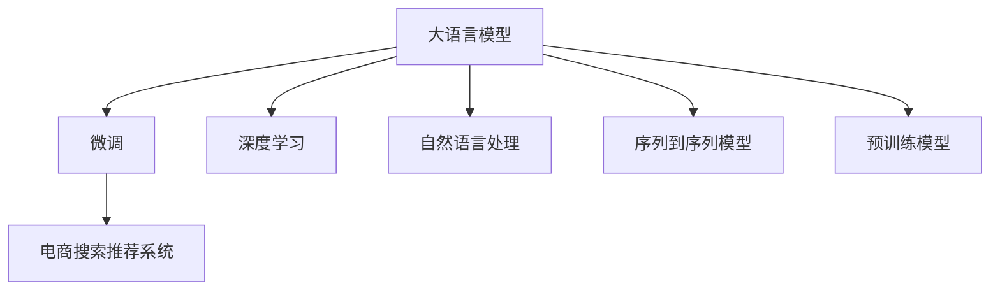

                 

# AI大模型赋能电商搜索推荐的业务创新思维训练方法

## 1. 背景介绍

### 1.1 问题由来
电子商务领域，搜索引擎推荐系统（Search Recommendation System, SRS）正逐渐成为用户获取商品信息的重要工具。优秀的搜索推荐系统不仅能够快速准确地匹配用户需求，还能提升用户体验和转化率，进而增强电商平台的竞争力。然而，传统基于规则或线性模型的搜索推荐系统，难以充分挖掘商品间的复杂关联关系，无法实现精准且个性化的推荐。

近年来，基于深度学习的推荐系统（Deep Learning Based Recommendation System, DLRS）在电商搜索推荐领域逐步取代了传统的推荐方式。特别是通过预训练的大模型（如BERT、GPT等）进行微调（Fine-tuning），已经取得了突破性的进展。这些大模型通过海量数据预训练获得丰富的特征表示能力，再通过微调针对特定电商场景进行优化，显著提升了推荐效果。

### 1.2 问题核心关键点
在大模型微调范式下，推荐系统设计者需要考虑以下核心问题：
- 如何选择合适的预训练模型和微调方法？
- 如何设计有效的业务任务适配层？
- 如何利用先验知识提升模型性能？
- 如何优化模型的训练和推理效率？
- 如何确保模型的泛化能力和鲁棒性？
- 如何保证模型的公平性和安全性？

这些核心问题相互交织，共同构成了一个完整的电商搜索推荐系统设计框架。只有针对性地解决这些问题，才能使大模型在电商搜索推荐领域发挥更大的作用。

### 1.3 问题研究意义
研究基于大模型的电商搜索推荐系统，对于推动电商行业智能化转型，提升用户体验和购物效率，具有重要意义：
1. 减少用户搜索成本：优化搜索结果排序，使用户能够快速找到满足自己需求的商品。
2. 提高转化率：通过个性化的推荐，激发用户购买欲望，增加电商平台的转化率和销售额。
3. 增强竞争力：利用AI技术提升推荐系统的精准性和多样性，打造独特用户购物体验，提高市场竞争力。
4. 促进数据驱动决策：利用推荐系统的数据反馈，深入分析用户行为，为电商平台的运营策略提供依据。
5. 推动行业标准：构建基于大模型的推荐系统，推动电商搜索推荐领域的技术进步和行业标准制定。

## 2. 核心概念与联系

### 2.1 核心概念概述

为更好地理解基于大模型的电商搜索推荐系统设计，本节将介绍几个密切相关的核心概念：

- 大语言模型（Large Language Model, LLM）：以自回归（如GPT）或自编码（如BERT）模型为代表的大规模预训练语言模型。通过在海量无标签文本数据上进行预训练，学习通用的语言知识和语义关系。
- 微调（Fine-tuning）：将预训练模型应用于特定任务，通过有监督学习对模型进行优化，以提升模型在该任务上的表现。
- 电商搜索推荐系统（Search Recommendation System, SRS）：通过用户搜索行为和商品属性，推荐符合用户兴趣的商品的电商平台系统。
- 深度学习（Deep Learning, DL）：利用神经网络结构，通过大量数据训练获得复杂特征表示和预测能力的机器学习技术。
- 自然语言处理（Natural Language Processing, NLP）：涉及文本信息的自动处理、理解、生成等任务，是电商搜索推荐系统的重要技术支撑。
- 序列到序列模型（Sequence-to-Sequence Model, Seq2Seq）：通过编码器-解码器结构，实现序列数据之间的转换，如机器翻译、对话生成等。
- 预训练模型（Pre-trained Model）：在无标签数据上预训练的通用模型，通过迁移学习，适应特定任务，提升性能。

这些核心概念之间的逻辑关系可以通过以下Mermaid流程图来展示：



这个流程图展示了大语言模型在电商搜索推荐系统中的关键角色：

1. 大语言模型通过预训练获得丰富的语言知识和语义关系。
2. 微调使模型针对电商场景进行优化，提升推荐效果。
3. 电商搜索推荐系统利用微调后的模型，为用户提供精准的个性化推荐。
4. 深度学习和大模型为电商搜索推荐系统提供技术支持。
5. 自然语言处理和大模型深度融合，提升文本处理的智能化水平。
6. 序列到序列模型用于处理用户搜索意图和商品属性之间的关系。
7. 预训练模型通过迁移学习，在电商推荐系统中发挥重要作用。

这些概念共同构成了电商搜索推荐系统的技术基础，使其能够实现智能化的用户推荐。

## 3. 核心算法原理 & 具体操作步骤
### 3.1 算法原理概述

基于大模型的电商搜索推荐系统，核心原理是将预训练语言模型应用于电商场景，通过微调提升模型的性能，从而实现精准的个性化推荐。具体流程如下：

1. 选择适合的预训练模型（如BERT、GPT等）作为初始化参数。
2. 收集电商场景的标注数据集，标注用户搜索行为和商品属性等数据。
3. 设计业务适配层，将模型输出映射到推荐结果。
4. 在标注数据集上使用微调算法（如Adam、SGD等）优化模型参数。
5. 在测试数据集上评估微调后的模型性能，确保模型的泛化能力。

### 3.2 算法步骤详解

基于大模型的电商搜索推荐系统设计主要包括以下几个关键步骤：

**Step 1: 准备预训练模型和数据集**

- 选择适合电商搜索推荐的预训练模型（如BERT、GPT等），导入到模型库。
- 收集电商场景的标注数据集，包含用户搜索行为、商品属性、搜索结果等。
- 将标注数据集划分为训练集、验证集和测试集，一般比例为8:1:1。

**Step 2: 设计任务适配层**

- 根据任务需求，设计合适的输出层和损失函数。
- 对于分类任务（如推荐商品类别），通常使用线性分类器和交叉熵损失函数。
- 对于排序任务（如推荐商品评分），通常使用均方误差损失函数。

**Step 3: 选择微调方法**

- 选择合适的微调算法（如AdamW、SGD等）及其参数，如学习率、批大小、迭代轮数等。
- 设置正则化技术及强度，包括L2正则、Dropout、Early Stopping等。
- 确定冻结预训练参数的策略，如仅微调顶层，或全部参数都参与微调。

**Step 4: 执行微调过程**

- 将训练集数据分批次输入模型，前向传播计算损失函数。
- 反向传播计算参数梯度，根据设定的优化算法和学习率更新模型参数。
- 周期性在验证集上评估模型性能，根据性能指标决定是否触发Early Stopping。
- 重复上述步骤直到满足预设的迭代轮数或Early Stopping条件。

**Step 5: 评估和部署**

- 在测试集上评估微调后模型性能，对比微调前后的精度提升。
- 使用微调后的模型对新样本进行推理预测，集成到实际的应用系统中。
- 持续收集新的数据，定期重新微调模型，以适应数据分布的变化。

### 3.3 算法优缺点

基于大模型的电商搜索推荐系统设计具有以下优点：
1. 提升推荐精度：通过微调提升模型对电商场景的适应性，使得推荐结果更加精准。
2. 泛化能力强：基于大模型的推荐系统具备较强的泛化能力，可以适应不同类型的电商场景。
3. 计算效率高：利用大模型的序列到序列结构和深度学习技术，可以显著提高计算效率。
4. 鲁棒性好：大模型预训练得到的通用语言表示，可以提供更强的抗干扰能力。

同时，该方法也存在以下缺点：
1. 依赖标注数据：微调效果很大程度上取决于标注数据的质量和数量，获取高质量标注数据的成本较高。
2. 模型复杂度高：预训练模型参数量大，计算资源需求高。
3. 可解释性不足：微调后的模型通常缺乏可解释性，难以对其决策过程进行分析和调试。
4. 冷启动问题：对于新加入的商品或用户，缺乏足够的标注数据，推荐效果可能不佳。

尽管存在这些局限性，但就目前而言，基于大模型的电商搜索推荐系统设计仍是推荐系统研究和应用的重要范式。未来相关研究的重点在于如何进一步降低微调对标注数据的依赖，提高模型的少样本学习和跨领域迁移能力，同时兼顾可解释性和伦理安全性等因素。

### 3.4 算法应用领域

基于大模型的电商搜索推荐系统，已经在多个领域得到了广泛的应用，例如：

- 商品推荐：通过用户历史浏览、购买行为，推荐相似或互补的商品。
- 搜索排序：根据用户搜索意图，排序可能相关商品。
- 个性化营销：结合用户兴趣和行为，提供定制化的广告和优惠活动。
- 内容推荐：向用户推荐有价值的文章、视频等。
- 电商广告：基于用户属性和搜索行为，精准投放广告。
- 智能客服：通过微调后的大模型，实现自然语言问答和智能客服。

除了上述这些经典应用外，大模型的推荐系统还被创新性地应用到更多场景中，如跨店铺推荐、上下文感知推荐、实时数据流推荐等，为电商搜索推荐系统带来了全新的突破。随着大模型和微调方法的不断进步，相信电商搜索推荐系统将能够更好地满足用户的个性化需求，提高电商平台的运营效率。

## 4. 数学模型和公式 & 详细讲解  
### 4.1 数学模型构建

假设电商搜索推荐系统的标注数据集为 $D=\{(x_i,y_i)\}_{i=1}^N$，其中 $x_i$ 为输入（用户搜索行为或商品属性），$y_i$ 为输出（推荐结果）。模型的预测函数为 $f_{\theta}(x)$，其中 $\theta$ 为模型参数。

定义模型的损失函数为：

$$
\mathcal{L}(\theta) = \frac{1}{N} \sum_{i=1}^N \ell(f_{\theta}(x_i), y_i)
$$

其中 $\ell$ 为任务适配层的损失函数，如交叉熵损失、均方误差损失等。微调的目标是最小化损失函数，即找到最优参数：

$$
\theta^* = \mathop{\arg\min}_{\theta} \mathcal{L}(\theta)
$$

在实践中，我们通常使用基于梯度的优化算法（如AdamW、SGD等）来近似求解上述最优化问题。设 $\eta$ 为学习率，$\lambda$ 为正则化系数，则参数的更新公式为：

$$
\theta \leftarrow \theta - \eta \nabla_{\theta}\mathcal{L}(\theta) - \eta\lambda\theta
$$

其中 $\nabla_{\theta}\mathcal{L}(\theta)$ 为损失函数对参数 $\theta$ 的梯度，可通过反向传播算法高效计算。

### 4.2 公式推导过程

以下我们以推荐评分预测为例，推导均方误差损失函数及其梯度的计算公式。

假设模型 $f_{\theta}(x)$ 的输出为 $f_{\theta}(x)$，真实标签 $y \in [0,1]$。则均方误差损失函数定义为：

$$
\ell(f_{\theta}(x), y) = \frac{1}{2}(f_{\theta}(x) - y)^2
$$

将其代入损失函数公式，得：

$$
\mathcal{L}(\theta) = \frac{1}{N} \sum_{i=1}^N \frac{1}{2}(f_{\theta}(x_i) - y_i)^2
$$

根据链式法则，损失函数对参数 $\theta_k$ 的梯度为：

$$
\frac{\partial \mathcal{L}(\theta)}{\partial \theta_k} = -\frac{1}{N}\sum_{i=1}^N \frac{1}{2}(f_{\theta}(x_i) - y_i) \frac{\partial f_{\theta}(x_i)}{\partial \theta_k}
$$

其中 $\frac{\partial f_{\theta}(x_i)}{\partial \theta_k}$ 可进一步递归展开，利用自动微分技术完成计算。

在得到损失函数的梯度后，即可带入参数更新公式，完成模型的迭代优化。重复上述过程直至收敛，最终得到适应电商场景的最优模型参数 $\theta^*$。

## 5. 项目实践：代码实例和详细解释说明
### 5.1 开发环境搭建

在进行电商搜索推荐系统微调实践前，我们需要准备好开发环境。以下是使用Python进行PyTorch开发的环境配置流程：

1. 安装Anaconda：从官网下载并安装Anaconda，用于创建独立的Python环境。

2. 创建并激活虚拟环境：
```bash
conda create -n pytorch-env python=3.8 
conda activate pytorch-env
```

3. 安装PyTorch：根据CUDA版本，从官网获取对应的安装命令。例如：
```bash
conda install pytorch torchvision torchaudio cudatoolkit=11.1 -c pytorch -c conda-forge
```

4. 安装Transformers库：
```bash
pip install transformers
```

5. 安装各类工具包：
```bash
pip install numpy pandas scikit-learn matplotlib tqdm jupyter notebook ipython
```

完成上述步骤后，即可在`pytorch-env`环境中开始微调实践。

### 5.2 源代码详细实现

这里我们以电商商品推荐系统为例，给出使用Transformers库对BERT模型进行微调的PyTorch代码实现。

首先，定义推荐任务的数据处理函数：

```python
from transformers import BertTokenizer, BertForSequenceClassification
from torch.utils.data import Dataset, DataLoader
import torch

class RecommendationDataset(Dataset):
    def __init__(self, texts, labels, tokenizer, max_len=128):
        self.texts = texts
        self.labels = labels
        self.tokenizer = tokenizer
        self.max_len = max_len
        
    def __len__(self):
        return len(self.texts)
    
    def __getitem__(self, item):
        text = self.texts[item]
        label = self.labels[item]
        
        encoding = self.tokenizer(text, return_tensors='pt', max_length=self.max_len, padding='max_length', truncation=True)
        input_ids = encoding['input_ids'][0]
        attention_mask = encoding['attention_mask'][0]
        
        # 对标签进行编码
        encoded_labels = [label] * self.max_len
        labels = torch.tensor(encoded_labels, dtype=torch.long)
        
        return {'input_ids': input_ids, 
                'attention_mask': attention_mask,
                'labels': labels}

# 标签与id的映射
label2id = {'B': 1, 'I': 2}
id2label = {v: k for k, v in label2id.items()}

# 创建dataset
tokenizer = BertTokenizer.from_pretrained('bert-base-cased')

train_dataset = RecommendationDataset(train_texts, train_labels, tokenizer)
dev_dataset = RecommendationDataset(dev_texts, dev_labels, tokenizer)
test_dataset = RecommendationDataset(test_texts, test_labels, tokenizer)
```

然后，定义模型和优化器：

```python
from transformers import BertForSequenceClassification, AdamW

model = BertForSequenceClassification.from_pretrained('bert-base-cased', num_labels=len(label2id))

optimizer = AdamW(model.parameters(), lr=2e-5)
```

接着，定义训练和评估函数：

```python
from tqdm import tqdm

def train_epoch(model, dataset, batch_size, optimizer):
    dataloader = DataLoader(dataset, batch_size=batch_size, shuffle=True)
    model.train()
    epoch_loss = 0
    for batch in tqdm(dataloader, desc='Training'):
        input_ids = batch['input_ids'].to(device)
        attention_mask = batch['attention_mask'].to(device)
        labels = batch['labels'].to(device)
        model.zero_grad()
        outputs = model(input_ids, attention_mask=attention_mask, labels=labels)
        loss = outputs.loss
        epoch_loss += loss.item()
        loss.backward()
        optimizer.step()
    return epoch_loss / len(dataloader)

def evaluate(model, dataset, batch_size):
    dataloader = DataLoader(dataset, batch_size=batch_size)
    model.eval()
    preds, labels = [], []
    with torch.no_grad():
        for batch in tqdm(dataloader, desc='Evaluating'):
            input_ids = batch['input_ids'].to(device)
            attention_mask = batch['attention_mask'].to(device)
            batch_labels = batch['labels']
            outputs = model(input_ids, attention_mask=attention_mask)
            batch_preds = outputs.logits.argmax(dim=2).to('cpu').tolist()
            batch_labels = batch_labels.to('cpu').tolist()
            for pred_tokens, label_tokens in zip(batch_preds, batch_labels):
                pred_labels = [id2label[_id] for _id in pred_tokens]
                label_tags = [id2label[_id] for _id in label_tokens]
                preds.append(pred_labels[:len(label_tags)])
                labels.append(label_tags)
                
    print(classification_report(labels, preds))
```

最后，启动训练流程并在测试集上评估：

```python
epochs = 5
batch_size = 16

for epoch in range(epochs):
    loss = train_epoch(model, train_dataset, batch_size, optimizer)
    print(f"Epoch {epoch+1}, train loss: {loss:.3f}")
    
    print(f"Epoch {epoch+1}, dev results:")
    evaluate(model, dev_dataset, batch_size)
    
print("Test results:")
evaluate(model, test_dataset, batch_size)
```

以上就是使用PyTorch对BERT进行电商推荐任务微调的完整代码实现。可以看到，得益于Transformers库的强大封装，我们可以用相对简洁的代码完成BERT模型的加载和微调。

### 5.3 代码解读与分析

让我们再详细解读一下关键代码的实现细节：

**RecommendationDataset类**：
- `__init__`方法：初始化文本、标签、分词器等关键组件。
- `__len__`方法：返回数据集的样本数量。
- `__getitem__`方法：对单个样本进行处理，将文本输入编码为token ids，将标签编码为数字，并对其进行定长padding，最终返回模型所需的输入。

**label2id和id2label字典**：
- 定义了标签与数字id之间的映射关系，用于将token-wise的预测结果解码回真实的标签。

**训练和评估函数**：
- 使用PyTorch的DataLoader对数据集进行批次化加载，供模型训练和推理使用。
- 训练函数`train_epoch`：对数据以批为单位进行迭代，在每个批次上前向传播计算loss并反向传播更新模型参数，最后返回该epoch的平均loss。
- 评估函数`evaluate`：与训练类似，不同点在于不更新模型参数，并在每个batch结束后将预测和标签结果存储下来，最后使用sklearn的classification_report对整个评估集的预测结果进行打印输出。

**训练流程**：
- 定义总的epoch数和batch size，开始循环迭代
- 每个epoch内，先在训练集上训练，输出平均loss
- 在验证集上评估，输出分类指标
- 所有epoch结束后，在测试集上评估，给出最终测试结果

可以看到，PyTorch配合Transformers库使得BERT微调的代码实现变得简洁高效。开发者可以将更多精力放在数据处理、模型改进等高层逻辑上，而不必过多关注底层的实现细节。

当然，工业级的系统实现还需考虑更多因素，如模型的保存和部署、超参数的自动搜索、更灵活的任务适配层等。但核心的微调范式基本与此类似。

## 6. 实际应用场景
### 6.1 智能推荐系统

基于大模型微调的推荐系统，可以广泛应用于电商平台的商品推荐、广告推荐等场景。通过微调，模型能够充分挖掘商品之间的关联关系，从而实现精准且个性化的推荐。

具体而言，可以收集电商平台的历史用户行为数据，将用户浏览、点击、购买等行为数据作为标注样本，在此基础上对预训练模型进行微调。微调后的模型能够自动理解用户兴趣，推荐用户可能感兴趣的相似或互补商品。对于新加入的商品，可以利用已有模型的预测能力，提供初步推荐，并逐步通过用户反馈进行优化。

### 6.2 个性化内容推荐

在内容推荐领域，基于大模型的推荐系统也能发挥重要作用。内容推荐系统通常用于推荐新闻、视频、音频等媒体内容，帮助用户发现更多有价值的信息。

具体而言，可以收集用户历史浏览、评分、点赞等行为数据，构建推荐训练集。将用户行为数据输入模型进行预测，输出媒体内容的推荐分数，排序后推荐给用户。对于热门内容，可以利用现有模型的预测能力，提供初步推荐，并逐步通过用户反馈进行优化。

### 6.3 跨店铺推荐

跨店铺推荐是电商平台的常用推荐策略，通过横向推荐，提高商品的曝光率，促进不同店铺之间的销售。

具体而言，可以收集不同店铺的商品数据，构建跨店铺推荐训练集。将用户浏览、点击、购买等行为数据作为标注样本，在此基础上对预训练模型进行微调。微调后的模型能够自动理解用户兴趣，推荐不同店铺中的商品，从而提高跨店铺的销售效果。

### 6.4 实时数据流推荐

随着电商平台交易量的大幅增加，实时推荐系统变得越来越重要，能够在用户下单时提供即时推荐，提高转化率和用户体验。

具体而言，可以收集用户实时浏览、点击等行为数据，实时计算推荐分数，生成推荐列表，动态更新商品页面。利用微调后的模型，能够快速响应用户需求，提供精准推荐。

### 6.5 上下文感知推荐

上下文感知推荐是指在推荐过程中，考虑用户的上下文信息，如时间、地点、设备等，提供更加个性化的推荐。

具体而言，可以收集用户的上下文数据，如设备类型、网络环境、用户位置等，构建上下文感知推荐训练集。将用户行为数据和上下文数据作为输入，训练模型预测推荐结果。微调后的模型能够根据用户的上下文信息，自动匹配最合适的推荐结果，提升推荐效果。

## 7. 工具和资源推荐
### 7.1 学习资源推荐

为了帮助开发者系统掌握大模型微调的理论基础和实践技巧，这里推荐一些优质的学习资源：

1. 《深度学习推荐系统》书籍：由斯坦福大学开设的推荐系统课程，涵盖推荐系统基础、算法、实践等全方面内容，是学习推荐系统的必读书籍。

2. 《自然语言处理基础》课程：北京大学开设的NLP入门课程，详细讲解了NLP的基本概念和技术，是了解NLP推荐的基石。

3. 《Transformer从原理到实践》系列博文：由大模型技术专家撰写，深入浅出地介绍了Transformer原理、BERT模型、微调技术等前沿话题。

4. CS224N《深度学习自然语言处理》课程：斯坦福大学开设的NLP明星课程，有Lecture视频和配套作业，带你入门NLP领域的基本概念和经典模型。

5. 《自然语言处理与深度学习》书籍：讲解了NLP和DL结合的技术，是了解NLP推荐的基础。

通过对这些资源的学习实践，相信你一定能够快速掌握大模型微调的精髓，并用于解决实际的电商搜索推荐问题。
### 7.2 开发工具推荐

高效的开发离不开优秀的工具支持。以下是几款用于大模型微调开发的常用工具：

1. PyTorch：基于Python的开源深度学习框架，灵活动态的计算图，适合快速迭代研究。大部分预训练语言模型都有PyTorch版本的实现。

2. TensorFlow：由Google主导开发的开源深度学习框架，生产部署方便，适合大规模工程应用。同样有丰富的预训练语言模型资源。

3. Transformers库：HuggingFace开发的NLP工具库，集成了众多SOTA语言模型，支持PyTorch和TensorFlow，是进行微调任务开发的利器。

4. Weights & Biases：模型训练的实验跟踪工具，可以记录和可视化模型训练过程中的各项指标，方便对比和调优。与主流深度学习框架无缝集成。

5. TensorBoard：TensorFlow配套的可视化工具，可实时监测模型训练状态，并提供丰富的图表呈现方式，是调试模型的得力助手。

6. Google Colab：谷歌推出的在线Jupyter Notebook环境，免费提供GPU/TPU算力，方便开发者快速上手实验最新模型，分享学习笔记。

合理利用这些工具，可以显著提升大模型微调任务的开发效率，加快创新迭代的步伐。

### 7.3 相关论文推荐

大模型微调技术的发展源于学界的持续研究。以下是几篇奠基性的相关论文，推荐阅读：

1. Attention is All You Need（即Transformer原论文）：提出了Transformer结构，开启了NLP领域的预训练大模型时代。

2. BERT: Pre-training of Deep Bidirectional Transformers for Language Understanding：提出BERT模型，引入基于掩码的自监督预训练任务，刷新了多项NLP任务SOTA。

3. Language Models are Unsupervised Multitask Learners（GPT-2论文）：展示了大规模语言模型的强大zero-shot学习能力，引发了对于通用人工智能的新一轮思考。

4. Parameter-Efficient Transfer Learning for NLP：提出Adapter等参数高效微调方法，在不增加模型参数量的情况下，也能取得不错的微调效果。

5. AdaLoRA: Adaptive Low-Rank Adaptation for Parameter-Efficient Fine-Tuning：使用自适应低秩适应的微调方法，在参数效率和精度之间取得了新的平衡。

6. XLNet: Generalized Autoregressive Pretraining for Language Understanding：提出XLNet模型，引入自回归训练，显著提升了语言理解能力。

这些论文代表了大模型微调技术的发展脉络。通过学习这些前沿成果，可以帮助研究者把握学科前进方向，激发更多的创新灵感。

## 8. 总结：未来发展趋势与挑战

### 8.1 总结

本文对基于大模型的电商搜索推荐系统设计进行了全面系统的介绍。首先阐述了电商搜索推荐系统的背景和重要性，明确了微调在提升推荐效果方面的独特价值。其次，从原理到实践，详细讲解了微调的数学原理和关键步骤，给出了微调任务开发的完整代码实例。同时，本文还广泛探讨了微调方法在电商搜索推荐系统中的多种应用，展示了微调范式的巨大潜力。此外，本文精选了微调技术的各类学习资源，力求为读者提供全方位的技术指引。

通过本文的系统梳理，可以看到，基于大模型的电商搜索推荐系统设计正在成为推荐系统研究和应用的重要范式，极大地拓展了推荐系统的应用边界，催生了更多的落地场景。得益于预训练语言模型的丰富特征表示能力，微调后的模型能够更好地适应电商搜索推荐任务，提升推荐效果。未来，伴随大模型和微调方法的持续演进，相信电商搜索推荐系统将能够更好地满足用户的个性化需求，提高电商平台的运营效率。

### 8.2 未来发展趋势

展望未来，基于大模型的电商搜索推荐系统将呈现以下几个发展趋势：

1. 模型规模持续增大。随着算力成本的下降和数据规模的扩张，预训练语言模型的参数量还将持续增长。超大规模语言模型蕴含的丰富语言知识，有望支撑更加复杂多变的推荐任务。

2. 推荐算法日趋多样化。除了传统的深度学习推荐算法外，未来会涌现更多基于大模型的推荐方法，如自回归模型、序列到序列模型等，在保持推荐精度的同时提升推荐的多样性。

3. 持续学习成为常态。随着数据分布的不断变化，微调模型也需要持续学习新知识以保持性能。如何在不遗忘原有知识的同时，高效吸收新样本信息，将成为重要的研究课题。

4. 少样本学习与跨领域迁移能力提升。未来的大模型微调方法将更好地利用少样本学习范式，在仅有少量标注数据的情况下，实现高性能推荐。同时，跨领域迁移能力的提升，将使得大模型能够适应更多类型的电商推荐任务。

5. 模型鲁棒性和公平性增强。未来的大模型微调方法将更加注重模型的鲁棒性和公平性，通过引入对抗训练、正则化等技术，提升模型的泛化能力和鲁棒性，避免有害信息的传播。

6. 实时推荐系统优化。未来的实时推荐系统将更加注重数据实时处理和模型高效推理，通过分布式计算和硬件加速，实现更快的推荐响应速度。

7. 多模态推荐系统崛起。未来的推荐系统将更加注重多模态数据的融合，如结合文本、图像、语音等多模态数据，提升推荐系统的准确性和个性化水平。

以上趋势凸显了大模型微调技术在电商搜索推荐系统中的广阔前景。这些方向的探索发展，必将进一步提升推荐系统的性能和应用范围，为电商平台的智能化转型提供坚实技术基础。

### 8.3 面临的挑战

尽管大模型微调技术已经取得了瞩目成就，但在迈向更加智能化、普适化应用的过程中，它仍面临着诸多挑战：

1. 标注成本瓶颈。尽管微调降低了对标注数据的依赖，但对于长尾应用场景，仍然难以获得充足的高质量标注数据，成为制约微调性能的瓶颈。如何进一步降低微调对标注数据的依赖，将是一大难题。

2. 模型鲁棒性不足。当前微调模型面对域外数据时，泛化性能往往大打折扣。对于测试样本的微小扰动，微调模型的预测也容易发生波动。如何提高微调模型的鲁棒性，避免灾难性遗忘，还需要更多理论和实践的积累。

3. 推荐效率有待提高。大规模语言模型虽然精度高，但在实际部署时往往面临推理速度慢、内存占用大等效率问题。如何在保证性能的同时，简化模型结构，提升推理速度，优化资源占用，将是重要的优化方向。

4. 可解释性亟需加强。当前微调模型通常缺乏可解释性，难以对其决策过程进行分析和调试。对于医疗、金融等高风险应用，算法的可解释性和可审计性尤为重要。如何赋予微调模型更强的可解释性，将是亟待攻克的难题。

5. 安全性有待保障。预训练语言模型难免会学习到有偏见、有害的信息，通过微调传递到下游任务，产生误导性、歧视性的输出，给实际应用带来安全隐患。如何从数据和算法层面消除模型偏见，避免恶意用途，确保输出的安全性，也将是重要的研究课题。

6. 知识整合能力不足。现有的微调模型往往局限于任务内数据，难以灵活吸收和运用更广泛的先验知识。如何让微调过程更好地与外部知识库、规则库等专家知识结合，形成更加全面、准确的信息整合能力，还有很大的想象空间。

正视微调面临的这些挑战，积极应对并寻求突破，将是大模型微调走向成熟的必由之路。相信随着学界和产业界的共同努力，这些挑战终将一一被克服，大模型微调必将在构建智能化的电商搜索推荐系统方面发挥更大的作用。

### 8.4 未来突破

面对大模型微调所面临的种种挑战，未来的研究需要在以下几个方面寻求新的突破：

1. 探索无监督和半监督微调方法。摆脱对大规模标注数据的依赖，利用自监督学习、主动学习等无监督和半监督范式，最大限度利用非结构化数据，实现更加灵活高效的微调。

2. 研究参数高效和计算高效的微调范式。开发更加参数高效的微调方法，在固定大部分预训练参数的同时，只更新极少量的任务相关参数。同时优化微调模型的计算图，减少前向传播和反向传播的资源消耗，实现更加轻量级、实时性的部署。

3. 融合因果和对比学习范式。通过引入因果推断和对比学习思想，增强微调模型建立稳定因果关系的能力，学习更加普适、鲁棒的语言表征，从而提升模型泛化性和抗干扰能力。

4. 引入更多先验知识。将符号化的先验知识，如知识图谱、逻辑规则等，与神经网络模型进行巧妙融合，引导微调过程学习更准确、合理的语言模型。同时加强不同模态数据的整合，实现视觉、语音等多模态信息与文本信息的协同建模。

5. 结合因果分析和博弈论工具。将因果分析方法引入微调模型，识别出模型决策的关键特征，增强输出解释的因果性和逻辑性。借助博弈论工具刻画人机交互过程，主动探索并规避模型的脆弱点，提高系统稳定性。

6. 纳入伦理道德约束。在模型训练目标中引入伦理导向的评估指标，过滤和惩罚有偏见、有害的输出倾向。同时加强人工干预和审核，建立模型行为的监管机制，确保输出符合人类价值观和伦理道德。

这些研究方向的探索，必将引领大模型微调技术迈向更高的台阶，为构建安全、可靠、可解释、可控的智能系统铺平道路。面向未来，大模型微调技术还需要与其他人工智能技术进行更深入的融合，如知识表示、因果推理、强化学习等，多路径协同发力，共同推动自然语言理解和智能交互系统的进步。只有勇于创新、敢于突破，才能不断拓展语言模型的边界，让智能技术更好地造福人类社会。

## 9. 附录：常见问题与解答

**Q1：电商搜索推荐系统如何利用大语言模型微调提升推荐效果？**

A: 电商搜索推荐系统通过大语言模型微调提升推荐效果，主要包括以下几个步骤：

1. 选择适合的预训练模型，如BERT、GPT等，导入模型库。
2. 收集电商场景的标注数据集，标注用户搜索行为和商品属性等数据。
3. 设计业务适配层，将模型输出映射到推荐结果。
4. 在标注数据集上使用微调算法（如AdamW、SGD等）优化模型参数。
5. 在测试数据集上评估微调后的模型性能，确保模型的泛化能力。

通过微调，大语言模型能够适应电商场景的特定需求，提升推荐系统的精准度和个性化水平，从而实现更好的用户体验和转化率。

**Q2：电商搜索推荐系统中如何设计任务适配层？**

A: 电商搜索推荐系统中的任务适配层设计，需要根据推荐任务的具体需求进行定制。以下是几个常见的适配层设计方案：

1. 分类任务：对于推荐商品类别等分类任务，可以使用线性分类器和交叉熵损失函数。输出层设计为多分类输出层，每个类别对应一种商品。
2. 排序任务：对于推荐商品评分等排序任务，可以使用均方误差损失函数。输出层设计为单分类输出层，输出推荐分数。
3. 序列推荐任务：对于推荐连续商品序列的任务，可以使用序列到序列模型（Seq2Seq）结构。输出层设计为递归神经网络（RNN）结构，输出推荐商品序列。
4. 联合推荐任务：对于同时涉及商品类别和评分的推荐任务，可以使用多任务学习模型。输出层设计为多个分类器和一个回归器，分别输出商品类别和评分。

适配层的设计需要根据具体任务进行优化，使得模型能够更好地适应推荐需求，提升推荐效果。

**Q3：电商搜索推荐系统如何处理冷启动问题？**

A: 电商搜索推荐系统中的冷启动问题，是指新加入的商品或用户，缺乏足够的标注数据，推荐效果可能不佳。为解决这个问题，可以采用以下几种方法：

1. 利用已有模型的预测能力：将新商品或用户输入到已有微调后的模型中，利用其预测能力提供初步推荐。
2. 数据增强：通过类似样本合成、近义替换等方式，扩充训练集，减少冷启动带来的影响。
3. 用户行为预估：通过用户行为预测模型，预估新用户的兴趣和需求，提供初步推荐。
4. 多模态数据融合：结合用户的文本行为数据和其他数据（如位置、时间等），提升推荐的准确性和个性化水平。

通过以上方法，电商搜索推荐系统能够在冷启动阶段提供初步推荐，逐步通过用户反馈进行优化，解决冷启动问题。

**Q4：电商搜索推荐系统中如何提升模型的泛化能力？**

A: 电商搜索推荐系统中的模型泛化能力，是指模型能够适应新的数据分布，避免过拟合现象。为提升模型的泛化能力，可以采用以下几种方法：

1. 数据增强：通过回译、近义替换等方式扩充训练集，丰富数据分布。
2. 正则化：使用L2正则、Dropout、Early Stopping等技术，防止模型过度适应训练数据。
3. 对抗训练：引入对抗样本，增强模型的鲁棒性和泛化能力。
4. 参数高效微调：只调整少量参数（如Adapter、Prefix等），减小过拟合风险。
5. 多模型集成：训练多个微调模型，取平均输出，抑制过拟合。

通过以上方法，电商搜索推荐系统能够提升模型的泛化能力，避免过拟合现象，提升推荐系统的鲁棒性和可靠性。

**Q5：电商搜索推荐系统中如何提高模型的计算效率？**

A: 电商搜索推荐系统中的模型计算效率，是指模型在实际部署时的推理速度和资源占用。为提高模型的计算效率，可以采用以下几种方法：

1. 模型裁剪：去除不必要的层和参数，减小模型尺寸，加快推理速度。
2. 量化加速：将浮点模型转为定点模型，压缩存储空间，提高计算效率。
3. 模型并行：利用分布式计算资源，提高模型的计算效率。
4. 数据压缩：采用数据压缩技术，减少模型的计算量。
5. 模型优化：优化模型的计算图，减少前向传播和反向传播的资源消耗。

通过以上方法，电商搜索推荐系统能够在保持推荐效果的前提下，提高模型的计算效率，适应大规模实际部署需求。

---

作者：禅与计算机程序设计艺术 / Zen and the Art of Computer Programming

