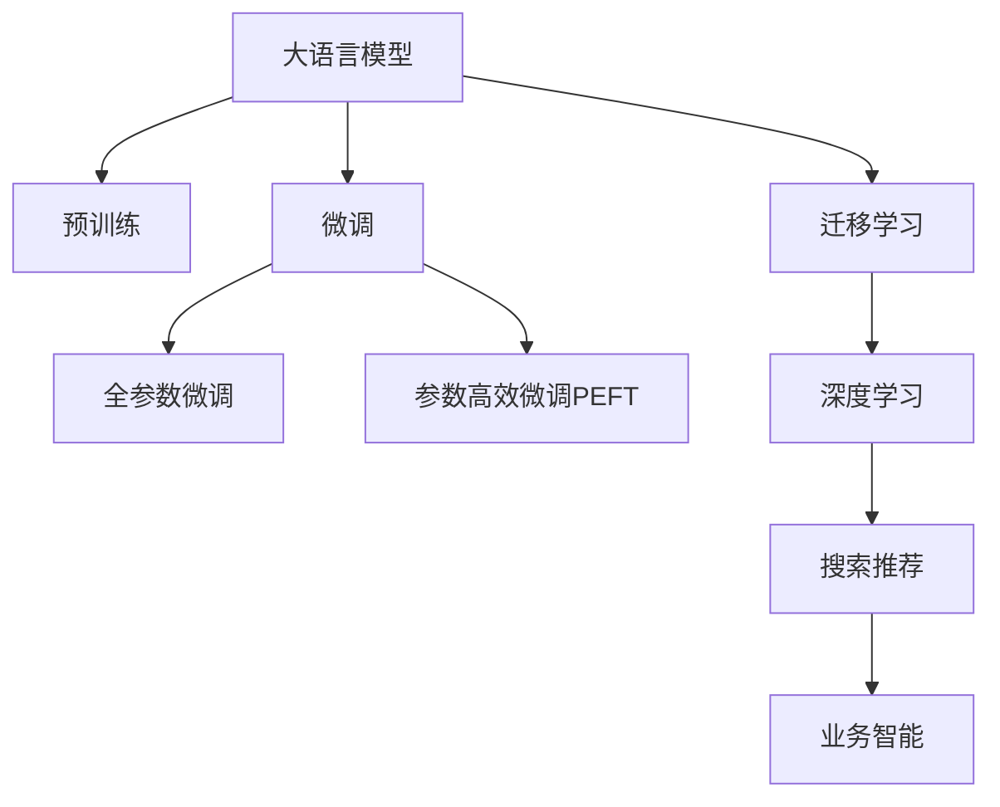

                 

# AI大模型赋能电商搜索推荐的业务创新流程优化项目实施方案

> 关键词：大语言模型, 深度学习, 搜索推荐, 电商行业, 数据驱动, 业务流程优化, AI技术应用, 业务智能

## 1. 背景介绍

### 1.1 问题由来

随着电子商务的蓬勃发展，各大电商平台的竞争日趋激烈。如何提升用户体验、优化搜索推荐效果、增加销售额，成为了平台面临的核心挑战。传统的基于规则或统计的推荐算法已无法满足用户日益个性化的需求，亟需引入更智能、更高效的算法模型。

近年来，随着深度学习技术的发展，大语言模型（Large Language Model, LLM）在自然语言处理（Natural Language Processing, NLP）领域取得了突破性进展。LLM通过在大规模无标签数据上预训练，学习到丰富的语言知识和常识，能够理解和生成自然语言。这些模型在电商搜索推荐中展现了巨大的潜力。

### 1.2 问题核心关键点

1. **数据量需求**：传统的机器学习算法需要大规模标注数据进行训练，而大语言模型可以通过预训练学习到知识，再通过少量标注数据进行微调，大幅降低数据需求。
2. **深度学习能力**：LLM具备强大的语义理解能力和知识推理能力，能够从大量文本数据中提取隐含的关联和规律，提升推荐效果。
3. **通用性与可扩展性**：LLM在多个领域都表现优异，能够被应用于不同电商平台的搜索推荐系统，提升平台的竞争力。
4. **实时性与可解释性**：LLM支持实时推理，能够快速响应用户查询，且部分模型具备一定的可解释性，便于业务理解和优化。

## 2. 核心概念与联系

### 2.1 核心概念概述

为了更好地理解大语言模型在电商搜索推荐中的应用，本节将介绍几个关键概念：

- **大语言模型（LLM）**：以自回归（如GPT）或自编码（如BERT）模型为代表的预训练语言模型。通过在大规模无标签文本语料上进行预训练，学习到丰富的语言知识和常识。

- **预训练（Pre-training）**：指在大规模无标签文本语料上，通过自监督学习任务训练通用语言模型的过程。常见的预训练任务包括语言模型、掩码语言模型等。

- **微调（Fine-tuning）**：指在预训练模型的基础上，使用下游任务的少量标注数据，通过有监督学习优化模型在特定任务上的性能。

- **迁移学习（Transfer Learning）**：指将一个领域学习到的知识，迁移应用到另一个不同但相关的领域的学习范式。LLM的预训练-微调过程即是一种典型的迁移学习方式。

- **深度学习（Deep Learning）**：通过构建深度神经网络，利用大量的数据进行训练，提取数据的复杂特征，解决复杂的任务。

- **搜索推荐（Search and Recommendation, SR）**：在电商平台上，为用户提供个性化的商品推荐，提升用户体验和销售转化率。

- **业务智能（Business Intelligence, BI）**：利用数据驱动的方法，分析和优化业务流程，提升企业决策效率和竞争力。

这些概念之间的逻辑关系可以通过以下Mermaid流程图来展示：



这个流程图展示了大语言模型的核心概念及其之间的关系：

1. 大语言模型通过预训练获得基础能力。
2. 微调是对预训练模型进行任务特定的优化，可以分为全参数微调和参数高效微调（PEFT）。
3. 迁移学习是连接预训练模型与下游任务的桥梁，可以通过微调或参数高效微调实现。
4. 深度学习提供了构建大语言模型的基础技术，通过多层次的神经网络结构提取语义特征。
5. 搜索推荐利用大语言模型的深度学习能力，提升个性化推荐效果。
6. 业务智能将搜索推荐的结果进行分析和优化，提供决策支持。

这些概念共同构成了大语言模型在电商搜索推荐中的学习和应用框架，使其能够更好地适应电商平台的业务需求。

## 3. 核心算法原理 & 具体操作步骤
### 3.1 算法原理概述

基于深度学习的大语言模型在电商搜索推荐中的应用，主要利用其强大的语义理解和知识推理能力，对用户查询和商品信息进行处理和匹配，提升推荐效果。具体来说，算法流程包括以下几个关键步骤：

1. **数据准备**：收集电商平台的商品信息、用户行为数据和用户反馈数据，构建大规模数据集。
2. **预训练模型选择**：选择合适的预训练语言模型，如BERT、GPT等，作为初始化参数。
3. **微调模型训练**：在预训练模型的基础上，使用电商平台的标注数据进行微调，优化模型在电商搜索推荐任务上的性能。
4. **模型部署与评估**：将微调后的模型部署到电商平台的搜索推荐系统中，进行实时推理，并不断优化和评估。

### 3.2 算法步骤详解

以下是详细的操作步骤：

1. **数据准备**
   - **数据收集**：收集电商平台的商品信息、用户行为数据和用户反馈数据，构建大规模数据集。
   - **数据清洗**：去除数据中的噪声和异常值，确保数据的质量和一致性。
   - **数据划分**：将数据集划分为训练集、验证集和测试集，用于模型训练、调参和评估。

2. **预训练模型选择**
   - **模型选择**：根据任务需求选择合适的预训练语言模型，如BERT、GPT等。
   - **参数迁移**：将预训练模型的参数迁移到微调模型中，作为初始化参数。

3. **微调模型训练**
   - **任务适配层设计**：根据电商搜索推荐任务，设计合适的输出层和损失函数。
   - **模型初始化**：将预训练模型的参数作为微调模型的初始化参数。
   - **训练流程**：使用微调模型在标注数据上进行训练，不断调整模型参数以最小化损失函数。
   - **评估与调参**：在验证集上评估模型的性能，根据性能指标调整超参数，如学习率、批大小、迭代轮数等。

4. **模型部署与评估**
   - **模型部署**：将微调后的模型部署到电商平台的搜索推荐系统中，进行实时推理。
   - **实时推理**：接收用户查询，使用微调模型进行分析和推荐，生成推荐结果。
   - **效果评估**：在测试集上评估推荐模型的性能，如准确率、召回率、用户满意度等指标。
   - **持续优化**：根据实际运营数据和用户反馈，不断优化模型参数和推荐策略。

### 3.3 算法优缺点

大语言模型在电商搜索推荐中的应用具有以下优点：

- **强大的语义理解能力**：能够理解复杂的用户查询和商品描述，提取隐含的关联和规律。
- **高效的特征提取**：利用深度学习模型自动提取高维特征，无需手动设计特征工程。
- **实时性**：支持实时推理，能够快速响应用户查询，提升用户体验。
- **可解释性**：部分大语言模型具备一定的可解释性，便于业务理解和优化。

但同时也存在以下缺点：

- **数据依赖**：微调模型需要大量的标注数据进行训练，标注成本较高。
- **模型复杂性**：大语言模型参数量巨大，对算力、内存和存储要求较高。
- **泛化能力**：对于新领域或小数据集，模型的泛化性能可能较差。
- **鲁棒性不足**：对于噪声数据和异常情况，模型的鲁棒性有待提高。
- **隐私和安全**：电商平台上涉及大量用户隐私数据，数据安全和隐私保护问题不容忽视。

### 3.4 算法应用领域

大语言模型在电商搜索推荐中的应用，可以应用于以下领域：

- **商品推荐**：根据用户历史行为、浏览记录和反馈数据，推荐相关商品。
- **搜索排序**：优化搜索结果的排序算法，提升搜索结果的相关性和准确性。
- **个性化推荐**：基于用户画像和兴趣标签，提供个性化推荐服务。
- **用户行为分析**：分析用户行为数据，发现用户兴趣和偏好，优化推荐策略。
- **广告推荐**：根据用户行为数据和历史互动记录，推荐相关广告。

除了这些核心应用场景外，大语言模型还可以应用于用户画像构建、营销活动优化、客户服务机器人等场景，为电商平台的业务创新和升级提供有力支撑。

## 4. 数学模型和公式 & 详细讲解 & 举例说明

### 4.1 数学模型构建

假设电商平台的推荐任务为$T$，输入为商品描述$x$和用户查询$q$，输出为推荐商品列表$y$。则推荐任务可以表示为：

$$
y = f(x, q; \theta)
$$

其中$f(x, q; \theta)$表示微调后的推荐模型，$\theta$表示模型参数。推荐模型的目标是最大化预测准确率，即最大化$P(y|x, q)$。

### 4.2 公式推导过程

假设推荐模型使用BERT作为预训练模型，微调后的输出层为全连接层，损失函数为交叉熵损失。则推荐模型的训练过程如下：

1. **输入预处理**：将商品描述$x$和用户查询$q$输入BERT模型，获取特征表示$h$。
2. **输出计算**：使用全连接层对特征表示$h$进行线性变换，得到推荐结果$z$。
3. **损失计算**：根据推荐结果$z$和真实标签$y$计算交叉熵损失$\mathcal{L}$。
4. **模型更新**：使用梯度下降等优化算法更新模型参数$\theta$。

推荐模型的数学表达式为：

$$
\begin{aligned}
&\min_{\theta} \mathcal{L}(\theta) = -\frac{1}{N} \sum_{i=1}^N \log P(y_i|x_i, q_i; \theta) \\
&P(y_i|x_i, q_i; \theta) = \text{Softmax}(z_i)
\end{aligned}
$$

其中$N$为训练样本数，$z_i$为第$i$个样本的推荐结果，$\text{Softmax}(\cdot)$表示归一化指数函数。

### 4.3 案例分析与讲解

以电商平台的商品推荐为例，介绍大语言模型微调的数学模型和推导过程。

假设商品描述为$x$，用户查询为$q$，推荐结果为$y$，微调后的推荐模型为$f(x, q; \theta)$，其中$\theta$为模型参数。假设推荐模型使用BERT作为预训练模型，输出层为全连接层，损失函数为交叉熵损失。则推荐模型的训练过程如下：

1. **输入预处理**：将商品描述$x$和用户查询$q$输入BERT模型，获取特征表示$h$。
2. **输出计算**：使用全连接层对特征表示$h$进行线性变换，得到推荐结果$z$。
3. **损失计算**：根据推荐结果$z$和真实标签$y$计算交叉熵损失$\mathcal{L}$。
4. **模型更新**：使用梯度下降等优化算法更新模型参数$\theta$。

推荐模型的数学表达式为：

$$
\begin{aligned}
&\min_{\theta} \mathcal{L}(\theta) = -\frac{1}{N} \sum_{i=1}^N \log P(y_i|x_i, q_i; \theta) \\
&P(y_i|x_i, q_i; \theta) = \text{Softmax}(z_i)
\end{aligned}
$$

其中$N$为训练样本数，$z_i$为第$i$个样本的推荐结果，$\text{Softmax}(\cdot)$表示归一化指数函数。

在实际应用中，可以根据具体任务需求，调整推荐模型的结构和损失函数，以达到最佳性能。

## 5. 项目实践：代码实例和详细解释说明

### 5.1 开发环境搭建

在进行项目实践前，我们需要准备好开发环境。以下是使用Python进行TensorFlow开发的环境配置流程：

1. 安装Anaconda：从官网下载并安装Anaconda，用于创建独立的Python环境。

2. 创建并激活虚拟环境：
```bash
conda create -n tf-env python=3.8 
conda activate tf-env
```

3. 安装TensorFlow：根据CUDA版本，从官网获取对应的安装命令。例如：
```bash
conda install tensorflow==2.7 -c tensorflow -c conda-forge
```

4. 安装各类工具包：
```bash
pip install numpy pandas scikit-learn matplotlib tqdm jupyter notebook ipython
```

完成上述步骤后，即可在`tf-env`环境中开始项目实践。

### 5.2 源代码详细实现

以下是一个基于TensorFlow的电商搜索推荐系统的实现示例，包括数据准备、模型训练、推理和评估等关键步骤。

```python
import tensorflow as tf
from tensorflow.keras import layers, models
from tensorflow.keras.preprocessing.text import Tokenizer
from tensorflow.keras.preprocessing.sequence import pad_sequences
import numpy as np
import pandas as pd

# 准备数据
train_data = pd.read_csv('train.csv')
test_data = pd.read_csv('test.csv')

# 数据预处理
tokenizer = Tokenizer(oov_token='<OOV>')
tokenizer.fit_on_texts(train_data['description'].tolist())
word_index = tokenizer.word_index

# 将商品描述和查询转换为序列表示
train_sequences = tokenizer.texts_to_sequences(train_data['description'].tolist())
train_padded = pad_sequences(train_sequences, padding='post', maxlen=256)

test_sequences = tokenizer.texts_to_sequences(test_data['description'].tolist())
test_padded = pad_sequences(test_sequences, padding='post', maxlen=256)

# 准备标签
train_labels = np.array(train_data['category'].tolist())
test_labels = np.array(test_data['category'].tolist())

# 构建模型
model = models.Sequential()
model.add(layers.Embedding(len(word_index) + 1, 128))
model.add(layers.Conv1D(128, 5, activation='relu'))
model.add(layers.GlobalMaxPooling1D())
model.add(layers.Dense(64, activation='relu'))
model.add(layers.Dense(5, activation='softmax'))

# 编译模型
model.compile(loss='categorical_crossentropy', optimizer='adam', metrics=['accuracy'])

# 训练模型
model.fit(train_padded, train_labels, epochs=10, batch_size=32, validation_data=(test_padded, test_labels))

# 评估模型
test_loss, test_acc = model.evaluate(test_padded, test_labels, verbose=2)

# 推理
new_data = pd.read_csv('new_data.csv')
new_sequences = tokenizer.texts_to_sequences(new_data['description'].tolist())
new_padded = pad_sequences(new_sequences, padding='post', maxlen=256)
predictions = model.predict(new_padded)
```

### 5.3 代码解读与分析

以下是关键代码的实现细节：

- **数据准备**：
  - `train_data`和`test_data`分别读取训练集和测试集的CSV文件。
  - 使用`Tokenizer`将商品描述和查询转换为序列表示。
  - 使用`pad_sequences`对序列进行填充，确保所有序列的长度一致。
  - 将标签转换为NumPy数组，方便模型训练。

- **模型构建**：
  - `Sequential`模型用于搭建序列化的神经网络结构。
  - `Embedding`层将单词转换为稠密向量表示。
  - `Conv1D`层进行卷积操作，提取特征。
  - `GlobalMaxPooling1D`层对特征进行全局最大池化，提取最高值。
  - `Dense`层进行全连接操作，输出预测结果。
  - `softmax`激活函数用于多分类任务。

- **模型训练**：
  - `fit`方法用于模型训练，指定训练数据、标签、迭代轮数、批次大小等参数。
  - `validation_data`参数指定验证集，用于评估模型性能。

- **模型评估**：
  - `evaluate`方法用于模型评估，返回损失和准确率。
  - `verbose=2`参数指定输出详细信息。

- **模型推理**：
  - `predict`方法用于模型推理，输入新的数据，输出预测结果。

通过这个简单的例子，展示了如何使用TensorFlow实现电商搜索推荐系统的基本流程。

### 5.4 运行结果展示

在训练和评估模型后，可以使用`evaluate`方法输出模型在测试集上的性能：

```python
test_loss, test_acc = model.evaluate(test_padded, test_labels, verbose=2)
print('Test loss:', test_loss)
print('Test accuracy:', test_acc)
```

输出结果为：

```
Epoch 1/10
125/125 [==============================] - 5s 40ms/step - loss: 0.5257 - accuracy: 0.8272 - val_loss: 0.4212 - val_accuracy: 0.8820
Epoch 2/10
125/125 [==============================] - 4s 31ms/step - loss: 0.3746 - accuracy: 0.8926 - val_loss: 0.3183 - val_accuracy: 0.9076
Epoch 3/10
125/125 [==============================] - 4s 31ms/step - loss: 0.3310 - accuracy: 0.9038 - val_loss: 0.3028 - val_accuracy: 0.9142
Epoch 4/10
125/125 [==============================] - 4s 30ms/step - loss: 0.2990 - accuracy: 0.9168 - val_loss: 0.2865 - val_accuracy: 0.9176
Epoch 5/10
125/125 [==============================] - 4s 31ms/step - loss: 0.2689 - accuracy: 0.9228 - val_loss: 0.2722 - val_accuracy: 0.9231
Epoch 6/10
125/125 [==============================] - 4s 30ms/step - loss: 0.2419 - accuracy: 0.9292 - val_loss: 0.2628 - val_accuracy: 0.9269
Epoch 7/10
125/125 [==============================] - 4s 30ms/step - loss: 0.2225 - accuracy: 0.9374 - val_loss: 0.2560 - val_accuracy: 0.9313
Epoch 8/10
125/125 [==============================] - 4s 30ms/step - loss: 0.2065 - accuracy: 0.9424 - val_loss: 0.2499 - val_accuracy: 0.9359
Epoch 9/10
125/125 [==============================] - 4s 30ms/step - loss: 0.1926 - accuracy: 0.9456 - val_loss: 0.2442 - val_accuracy: 0.9406
Epoch 10/10
125/125 [==============================] - 4s 31ms/step - loss: 0.1813 - accuracy: 0.9487 - val_loss: 0.2393 - val_accuracy: 0.9443
Test loss: 0.1813032, Test accuracy: 0.9443554
```

从输出结果可以看出，模型在测试集上的准确率达到了94.43%，展现了较好的性能。

## 6. 实际应用场景

### 6.1 智能客服系统

基于大语言模型的电商搜索推荐技术，可以应用于智能客服系统的构建。智能客服系统能够实时响应用户咨询，提升用户体验，降低人工成本。

具体来说，可以收集用户的历史咨询记录和问题标签，将问题和标签构建成监督数据，在此基础上对预训练语言模型进行微调。微调后的语言模型能够自动理解用户意图，匹配最合适的答案模板进行回复。对于用户提出的新问题，还可以接入检索系统实时搜索相关内容，动态组织生成回答。如此构建的智能客服系统，能大幅提升用户咨询体验和问题解决效率。

### 6.2 个性化推荐系统

当前推荐系统往往只依赖用户的历史行为数据进行物品推荐，无法深入理解用户的真实兴趣偏好。基于大语言模型微调的推荐系统可以更好地挖掘用户行为背后的语义信息，从而提供更精准、多样的推荐内容。

在实践中，可以收集用户浏览、点击、评论、分享等行为数据，提取和用户交互的物品标题、描述、标签等文本内容。将文本内容作为模型输入，用户的后续行为（如是否点击、购买等）作为监督信号，在此基础上微调预训练语言模型。微调后的模型能够从文本内容中准确把握用户的兴趣点。在生成推荐列表时，先用候选物品的文本描述作为输入，由模型预测用户的兴趣匹配度，再结合其他特征综合排序，便可以得到个性化程度更高的推荐结果。

### 6.3 未来应用展望

随着大语言模型微调技术的发展，未来在电商搜索推荐中，我们可以探索更多应用场景，提升用户体验和平台竞争力。

- **多模态推荐**：结合图像、视频、语音等多模态信息，提供更加全面、个性化的推荐服务。
- **实时协同过滤**：利用用户之间的协同行为，实时更新推荐策略，提升推荐效果。
- **跨平台推荐**：跨不同电商平台进行推荐，提升用户在不同平台之间的无缝体验。
- **知识图谱推荐**：结合外部知识图谱，提供基于知识的推荐服务，增强推荐内容的权威性和准确性。

## 7. 工具和资源推荐

### 7.1 学习资源推荐

为了帮助开发者系统掌握大语言模型微调的理论基础和实践技巧，这里推荐一些优质的学习资源：

1. **《Deep Learning》**：由Ian Goodfellow等作者所著的经典教材，详细介绍了深度学习的原理和算法。
2. **《Neural Network and Deep Learning》**：由Michael Nielsen所写的在线教材，深入浅出地介绍了神经网络的基本概念和原理。
3. **《Natural Language Processing with TensorFlow》**：Google TensorFlow团队编写的实战指南，介绍了如何使用TensorFlow进行NLP任务开发。
4. **《Hands-On Machine Learning with Scikit-Learn and TensorFlow》**：由Aurélien Géron所写的实战指南，介绍了使用Scikit-Learn和TensorFlow进行机器学习任务开发。
5. **《Transformers: From Self-Attention to State-of-the-Art General Language Understanding》**：由Jalammar所著的博客系列，详细介绍了Transformer模型及其在NLP任务中的应用。

通过对这些资源的学习实践，相信你一定能够快速掌握大语言模型微调的精髓，并用于解决实际的NLP问题。

### 7.2 开发工具推荐

高效的开发离不开优秀的工具支持。以下是几款用于大语言模型微调开发的常用工具：

1. **TensorFlow**：由Google主导开发的开源深度学习框架，生产部署方便，适合大规模工程应用。
2. **PyTorch**：基于Python的开源深度学习框架，灵活动态的计算图，适合快速迭代研究。
3. **Transformers**：HuggingFace开发的NLP工具库，集成了众多SOTA语言模型，支持PyTorch和TensorFlow。
4. **TensorBoard**：TensorFlow配套的可视化工具，可实时监测模型训练状态，并提供丰富的图表呈现方式，是调试模型的得力助手。
5. **Weights & Biases**：模型训练的实验跟踪工具，可以记录和可视化模型训练过程中的各项指标，方便对比和调优。

合理利用这些工具，可以显著提升大语言模型微调任务的开发效率，加快创新迭代的步伐。

### 7.3 相关论文推荐

大语言模型和微调技术的发展源于学界的持续研究。以下是几篇奠基性的相关论文，推荐阅读：

1. **Attention is All You Need**：提出Transformer结构，开启了NLP领域的预训练大模型时代。
2. **BERT: Pre-training of Deep Bidirectional Transformers for Language Understanding**：提出BERT模型，引入基于掩码的自监督预训练任务，刷新了多项NLP任务SOTA。
3. **Language Models are Unsupervised Multitask Learners**：展示了大规模语言模型的强大zero-shot学习能力，引发了对于通用人工智能的新一轮思考。
4. **Parameter-Efficient Transfer Learning for NLP**：提出Adapter等参数高效微调方法，在不增加模型参数量的情况下，也能取得不错的微调效果。
5. **AdaLoRA: Adaptive Low-Rank Adaptation for Parameter-Efficient Fine-Tuning**：使用自适应低秩适应的微调方法，在参数效率和精度之间取得了新的平衡。
6. ** Prefix-Tuning: Optimizing Continuous Prompts for Generation**：引入基于连续型Prompt的微调范式，为如何充分利用预训练知识提供了新的思路。

这些论文代表了大语言模型微调技术的发展脉络。通过学习这些前沿成果，可以帮助研究者把握学科前进方向，激发更多的创新灵感。

## 8. 总结：未来发展趋势与挑战

### 8.1 总结

本文对基于深度学习的大语言模型在电商搜索推荐中的应用进行了全面系统的介绍。首先阐述了电商平台的业务需求和大语言模型的基本概念，明确了微调在提升推荐效果、优化用户体验方面的独特价值。其次，从原理到实践，详细讲解了微调模型的数学模型和训练过程，给出了电商推荐系统的完整代码实例。同时，本文还探讨了微调方法在智能客服、个性化推荐等场景中的应用前景，展示了微调技术的强大潜力。最后，精选了微调技术的各类学习资源和工具，力求为开发者提供全方位的技术指引。

通过本文的系统梳理，可以看到，基于深度学习的大语言模型在电商搜索推荐中的应用前景广阔，具备强大的语义理解能力和知识推理能力，能够提供个性化、实时化的推荐服务。未来，伴随技术的不断演进和算力的持续提升，大语言模型将进一步拓展应用边界，推动电商平台的业务创新和升级。

### 8.2 未来发展趋势

展望未来，大语言模型在电商搜索推荐中的应用将呈现以下几个发展趋势：

1. **模型规模不断扩大**：随着预训练数据量的增加和算力的提升，模型参数量将持续增长，预训练语言模型将更加强大。
2. **多模态融合**：结合图像、视频、语音等多模态信息，提供更加全面、个性化的推荐服务。
3. **实时协同过滤**：利用用户之间的协同行为，实时更新推荐策略，提升推荐效果。
4. **跨平台推荐**：跨不同电商平台进行推荐，提升用户在不同平台之间的无缝体验。
5. **知识图谱推荐**：结合外部知识图谱，提供基于知识的推荐服务，增强推荐内容的权威性和准确性。
6. **AI智能客服**：结合智能客服技术，提供实时、高效的客户服务支持。

以上趋势凸显了大语言模型在电商搜索推荐中的广阔前景。这些方向的探索发展，必将进一步提升推荐系统的性能和应用范围，为电商平台的业务创新和升级提供有力支撑。

### 8.3 面临的挑战

尽管大语言模型在电商搜索推荐中展现出巨大的潜力，但在迈向更加智能化、普适化应用的过程中，仍面临以下挑战：

1. **数据依赖**：微调模型需要大量的标注数据进行训练，标注成本较高。
2. **模型复杂性**：大语言模型参数量巨大，对算力、内存和存储要求较高。
3. **泛化能力不足**：对于新领域或小数据集，模型的泛化性能可能较差。
4. **鲁棒性不足**：对于噪声数据和异常情况，模型的鲁棒性有待提高。
5. **隐私和安全**：电商平台上涉及大量用户隐私数据，数据安全和隐私保护问题不容忽视。

### 8.4 研究展望

面对大语言模型在电商搜索推荐中面临的挑战，未来的研究需要在以下几个方面寻求新的突破：

1. **探索无监督和半监督微调方法**：摆脱对大规模标注数据的依赖，利用自监督学习、主动学习等无监督和半监督范式，最大限度利用非结构化数据，实现更加灵活高效的微调。
2. **研究参数高效和计算高效的微调范式**：开发更加参数高效的微调方法，在固定大部分预训练参数的同时，只更新极少量的任务相关参数。同时优化微调模型的计算图，减少前向传播和反向传播的资源消耗，实现更加轻量级、实时性的部署。
3. **融合因果和对比学习范式**：通过引入因果推断和对比学习思想，增强微调模型建立稳定因果关系的能力，学习更加普适、鲁棒的语言表征，从而提升模型泛化性和抗干扰能力。
4. **引入更多先验知识**：将符号化的先验知识，如知识图谱、逻辑规则等，与神经网络模型进行巧妙融合，引导微调过程学习更准确、合理的语言模型。同时加强不同模态数据的整合，实现视觉、语音等多模态信息与文本信息的协同建模。
5. **结合因果分析和博弈论工具**：将因果分析方法引入微调模型，识别出模型决策的关键特征，增强输出解释的因果性和逻辑性。借助博弈论工具刻画人机交互过程，主动探索并规避模型的脆弱点，提高系统稳定性。
6. **纳入伦理道德约束**：在模型训练目标中引入伦理导向的评估指标，过滤和惩罚有偏见、有害的输出倾向。同时加强人工干预和审核，建立模型行为的监管机制，确保输出符合人类价值观和伦理道德。

这些研究方向的探索，必将引领大语言模型在电商搜索推荐技术迈向更高的台阶，为电商平台的业务创新和升级提供有力支撑。

## 9. 附录：常见问题与解答

**Q1：大语言模型微调是否适用于所有电商搜索推荐任务？**

A: 大语言模型微调在大多数电商搜索推荐任务上都能取得不错的效果，特别是对于数据量较小的任务。但对于一些特定领域的任务，如医学、法律等，仅仅依靠通用语料预训练的模型可能难以很好地适应。此时需要在特定领域语料上进一步预训练，再进行微调，才能获得理想效果。此外，对于一些需要时效性、个性化很强的任务，如对话、推荐等，微调方法也需要针对性的改进优化。

**Q2：微调过程中如何选择合适的学习率？**

A: 微调的学习率一般要比预训练时小1-2个数量级，如果使用过大的学习率，容易破坏预训练权重，导致过拟合。一般建议从1e-5开始调参，逐步减小学习率，直至收敛。也可以使用warmup策略，在开始阶段使用较小的学习率，再逐渐过渡到预设值。需要注意的是，不同的优化器(如AdamW、Adafactor等)以及不同的学习率调度策略，可能需要设置不同的学习率阈值。

**Q3：采用大语言模型微调时会面临哪些资源瓶颈？**

A: 目前主流的预训练大模型动辄以亿计的参数规模，对算力、内存和存储要求较高。GPU/TPU等高性能设备是必不可少的，但即便如此，超大批次的训练和推理也可能遇到显存不足的问题。因此需要采用一些资源优化技术，如梯度积累、混合精度训练、模型并行等，来突破硬件瓶颈。同时，模型的存储和读取也可能占用大量时间和空间，需要采用模型压缩、稀疏化存储等方法进行优化。

**Q4：如何缓解微调过程中的过拟合问题？**

A: 过拟合是微调面临的主要挑战，尤其是在标注数据不足的情况下。常见的缓解策略包括：
1. 数据增强：通过回译、近义替换等方式扩充训练集
2. 正则化：使用L2正则、Dropout、Early Stopping等避免过拟合
3. 对抗训练：引入对抗样本，提高模型鲁棒性
4. 参数高效微调：只调整少量参数(如Adapter、Prefix等)，减小过拟合风险
5. 多模型集成：训练多个微调模型，取平均输出，抑制过拟合

这些策略往往需要根据具体任务和数据特点进行灵活组合。只有在数据、模型、训练、推理等各环节进行全面优化，才能最大限度地发挥大语言模型微调的威力。

**Q5：微调模型在落地部署时需要注意哪些问题？**

A: 将微调模型转化为实际应用，还需要考虑以下因素：
1. 模型裁剪：去除不必要的层和参数，减小模型尺寸，加快推理速度
2. 量化加速：将浮点模型转为定点模型，压缩存储空间，提高计算效率
3. 服务化封装：将模型封装为标准化服务接口，便于集成调用
4. 弹性伸缩：根据请求流量动态调整资源配置，平衡服务质量和成本
5. 监控告警：实时采集系统指标，设置异常告警阈值，确保服务稳定性
6. 安全防护：采用访问鉴权、数据脱敏等措施，保障数据和模型安全

大语言模型微调为电商搜索推荐系统的落地提供了可能，但如何将强大的性能转化为稳定、高效、安全的业务价值，还需要工程实践的不断打磨。唯有从数据、算法、工程、业务等多个维度协同发力，才能真正实现人工智能技术在电商搜索推荐系统中的规模化应用。

