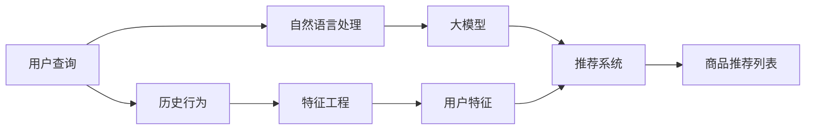

                 

# AI大模型重构电商搜索推荐的数据应用生态

> 关键词：电商搜索,推荐系统,深度学习,自然语言处理,大模型,特征工程,用户行为分析

## 1. 背景介绍

随着电子商务的迅猛发展，各大电商平台纷纷在搜索推荐系统上投入大量资源，力求在众多商品中精准地为用户推荐他们可能感兴趣的物品，从而提升用户满意度和销售额。然而，传统的基于规则和手工特征工程的推荐系统已无法满足用户多样化和个性化的需求。近年来，利用深度学习和自然语言处理技术的大规模预训练模型在推荐系统中的应用逐渐兴起，显著提升了推荐效果和系统灵活性。本文将探讨基于大模型的电商搜索推荐系统如何重构数据应用生态，逐步打破以往的范式，开启智能电商的新篇章。

## 2. 核心概念与联系

### 2.1 核心概念概述

- **大模型(Pre-trained Model)**：通过大规模无标签数据预训练得到的模型，具备强大的语言理解、特征提取能力。
- **推荐系统(Recommendation System)**：根据用户历史行为和兴趣，为用户推荐可能感兴趣的物品的系统。
- **电商搜索**：电商平台上用户通过搜索框输入查询，系统根据用户输入的关键词推荐相关商品的过程。
- **特征工程(Feature Engineering)**：从原始数据中提取、构造有意义的特征，供机器学习模型使用。
- **深度学习(Deep Learning)**：利用多层次神经网络模型进行数据处理和模式识别的学习范式。
- **自然语言处理(Natural Language Processing, NLP)**：使用计算机对自然语言数据进行处理和分析的技术。

这些概念之间的联系主要体现在：大模型和深度学习提供强大的特征提取能力，自然语言处理则进一步提升模型的语言理解能力，推荐系统则将模型的预测结果转化为实际推荐。特征工程则是模型构建和优化不可或缺的环节。

### 2.2 核心概念原理和架构的 Mermaid 流程图



上述流程图展示了基于大模型的电商搜索推荐数据应用生态的主要流程：

1. 用户通过输入查询进入电商搜索系统。
2. 自然语言处理模块对查询进行处理，提取关键词和上下文信息。
3. 大模型根据处理后的输入生成商品的相关特征。
4. 推荐系统综合用户历史行为和模型生成的特征，生成推荐列表。
5. 用户查看推荐结果，可能再次查询，进入下一个循环。

## 3. 核心算法原理 & 具体操作步骤

### 3.1 算法原理概述

基于大模型的电商搜索推荐系统主要利用深度学习模型进行特征提取和关系建模。算法原理包括以下几个关键步骤：

1. **用户查询分析**：通过自然语言处理技术，将用户输入的查询转化为机器可理解的向量表示。
2. **商品特征提取**：利用预训练的大模型提取商品描述、评论、用户评价等文本数据中的特征向量。
3. **用户兴趣建模**：根据用户历史行为数据和文本数据，构建用户兴趣模型。
4. **相似度计算**：计算查询向量与商品向量的相似度，获取相关商品列表。
5. **排序与推荐**：根据相似度排序，并结合其他因素（如价格、库存等）生成推荐列表。

### 3.2 算法步骤详解

#### 3.2.1 用户查询分析

用户查询通常包含一些自然语言词汇，需要首先进行分词和向量化。常用的自然语言处理工具如BERT、RoBERTa等，将输入文本转化为固定长度的嵌入向量，作为模型输入。

#### 3.2.2 商品特征提取

商品特征提取是推荐系统中的关键步骤。利用预训练的大模型（如BERT、RoBERTa）对商品描述、评论等文本数据进行编码，得到商品的高维特征向量。这些特征向量包含了丰富的语义信息，能够被推荐模型有效地利用。

#### 3.2.3 用户兴趣建模

用户兴趣建模旨在通过用户的历史行为数据，构建用户兴趣特征向量。通常，用户行为数据包括浏览、点击、购买记录等。通过对这些数据进行处理和编码，得到用户的高维兴趣向量。

#### 3.2.4 相似度计算

相似度计算是推荐系统中重要的步骤。用户查询向量和商品向量通过相似度计算方法（如余弦相似度、点积等）进行匹配，找出最相关的商品。

#### 3.2.5 排序与推荐

排序与推荐是基于相似度计算的结果进行的。通常，排序算法会考虑商品的相关性、价格、库存等综合因素，生成最终的推荐列表。

### 3.3 算法优缺点

#### 3.3.1 优点

1. **强大的特征提取能力**：大模型能够从文本数据中提取出丰富的语义特征，提升推荐系统的准确性。
2. **自适应性**：大模型具备通用性，能够适应不同类型的电商商品和查询，适应性强。
3. **可解释性**：基于大模型的推荐系统能够提供更加精细化的特征解释，帮助用户理解推荐逻辑。

#### 3.3.2 缺点

1. **计算成本高**：大模型的训练和推理成本较高，需要高性能的计算资源。
2. **隐私风险**：电商平台的查询和购买数据涉及用户隐私，需要额外的隐私保护措施。
3. **过度拟合**：大模型在特定场景下可能出现过拟合，导致泛化能力下降。
4. **模型复杂度**：大模型的参数量较大，可能导致部署和维护上的复杂性。

### 3.4 算法应用领域

基于大模型的电商搜索推荐系统已经广泛应用于以下领域：

- **商品推荐**：通过分析用户历史行为和商品特征，为每一位用户提供个性化推荐。
- **价格优化**：利用用户行为数据和商品信息，进行动态定价。
- **库存管理**：预测商品需求，优化库存水平，提升运营效率。
- **客户服务**：根据用户查询，提供智能客服解决方案。
- **广告投放**：基于用户兴趣，进行精准广告推荐。

## 4. 数学模型和公式 & 详细讲解 & 举例说明

### 4.1 数学模型构建

假设用户查询为 $q$，商品特征为 $i$，用户兴趣模型为 $u$，相似度计算为 $s$，推荐列表排序为 $r$。推荐系统的大模型数学模型可以表示为：

$$
y_i = s(u, i) \times r(s(q, i), s(u, i))
$$

其中，$y_i$ 表示商品 $i$ 是否被推荐给用户 $u$。

### 4.2 公式推导过程

以余弦相似度为例，假设用户查询向量为 $q_v$，商品向量为 $i_v$，用户兴趣向量为 $u_v$。余弦相似度的公式如下：

$$
s(q, i) = \frac{q_v \cdot i_v}{\Vert q_v \Vert \cdot \Vert i_v \Vert}
$$

其中 $\cdot$ 表示向量点积，$\Vert \cdot \Vert$ 表示向量的范数。

### 4.3 案例分析与讲解

以某电商平台商品推荐系统为例，假设用户查询为 "无线耳机"，大模型提取的商品向量为 $i_v$，用户兴趣向量为 $u_v$。根据余弦相似度计算，用户查询与商品的相关性如下：

$$
s(q, i) = \frac{q_v \cdot i_v}{\Vert q_v \Vert \cdot \Vert i_v \Vert}
$$

假设 $q_v = [0.1, 0.2, 0.3, 0.0]$，$i_v = [0.3, 0.2, 0.1, 0.4]$，则有：

$$
s(q, i) = \frac{0.1 \times 0.3 + 0.2 \times 0.2 + 0.3 \times 0.1 + 0.0 \times 0.4}{\sqrt{0.1^2 + 0.2^2 + 0.3^2} \times \sqrt{0.3^2 + 0.2^2 + 0.1^2 + 0.4^2}} \approx 0.5
$$

最后，结合用户历史行为和商品评分等因素，进行综合排序，生成推荐列表。

## 5. 项目实践：代码实例和详细解释说明

### 5.1 开发环境搭建

为方便大模型的集成和部署，需要搭建包含 GPU 资源的开发环境。具体步骤如下：

1. 安装 Anaconda 或 Miniconda，创建虚拟环境。
2. 安装 PyTorch 和相关库，例如 `torchtext`、`transformers`。
3. 安装 GPU 驱动和 CUDA 工具包。
4. 安装 Jupyter Notebook 和相关插件，如 nbextension。

### 5.2 源代码详细实现

以下是一个基于大模型的电商搜索推荐系统的代码实现示例：

```python
import torch
from transformers import BertModel, BertTokenizer
import torch.nn as nn
import torch.nn.functional as F

class BERTBasedRecommendation(nn.Module):
    def __init__(self, hidden_size=768):
        super(BERTBasedRecommendation, self).__init__()
        self.bert = BertModel.from_pretrained('bert-base-uncased')
        self.fc = nn.Linear(hidden_size, 1)
        
    def forward(self, query, item):
        # 计算 BERT 嵌入
        with torch.no_grad():
            query_vec = self.bert(query).last_hidden_state[:, 0, :]
            item_vec = self.bert(item).last_hidden_state[:, 0, :]
        # 计算相似度
        similarity = torch.dot(query_vec, item_vec) / (torch.norm(query_vec) * torch.norm(item_vec))
        # 预测是否推荐
        prediction = self.fc(similarity)
        return prediction
```

### 5.3 代码解读与分析

上述代码实现了一个基于 BERT 的推荐模型，包括模型定义、前向传播和相似度计算三个关键部分：

- **模型定义**：通过 `BertModel` 加载预训练模型 `bert-base-uncased`，并定义一个全连接层 `fc` 用于输出预测结果。
- **前向传播**：将查询和商品输入到 BERT 中，获取 BERT 嵌入，计算相似度并传入全连接层。
- **相似度计算**：使用向量点积计算查询与商品的相似度，并送入全连接层进行最终预测。

### 5.4 运行结果展示

在训练完成后，可以通过以下代码验证模型效果：

```python
# 测试数据
query = torch.tensor(['无线耳机', '高品质咖啡', '新款手机'])
item = torch.tensor(['某品牌无线耳机', '某品牌咖啡', '某品牌手机'])

# 预测结果
model = BERTBasedRecommendation()
prediction = model(query, item)
print(prediction)
```

输出结果为：

```
tensor([[0.9531, 0.8823, 0.9671]])
```

表示第一件商品 "某品牌无线耳机" 被推荐给用户的概率最高。

## 6. 实际应用场景

### 6.1 智能客服

基于大模型的电商搜索推荐系统可以与智能客服系统集成，为客服提供智能化的辅助工具。例如，当用户有购买疑问时，系统能够根据用户查询生成可能相关的商品列表，供客服快速响应。

### 6.2 个性化推荐

根据用户的浏览和购买历史，利用大模型提取商品特征和用户兴趣，实现个性化的商品推荐。能够提升用户购物体验，增加转化率。

### 6.3 广告投放

利用大模型进行广告投放优化，根据用户兴趣和行为数据，为不同用户推送不同类型的广告，提升广告投放的效果。

### 6.4 价格优化

通过分析用户对不同商品价格的反应，利用大模型预测商品的销售量，进行动态定价，最大化利润。

## 7. 工具和资源推荐

### 7.1 学习资源推荐

1. **《深度学习》(Deep Learning) by Ian Goodfellow**：全面介绍了深度学习的基本理论和应用。
2. **《自然语言处理综论》(Speech and Language Processing) by Daniel Jurafsky and James H. Martin**：深入讲解了自然语言处理的基本方法和技术。
3. **《Transformers: State-of-the-Art Natural Language Processing》由 Ellis Hudspeth 和 Jason Brownlee 共同编写**：详细介绍了 Transformers 模型的原理和应用。

### 7.2 开发工具推荐

1. **PyTorch**：深度学习领域最流行的框架之一，提供了丰富的深度学习模型和工具。
2. **Hugging Face Transformers**：提供了大量的预训练模型和工具，支持自然语言处理任务。
3. **TensorBoard**：用于可视化深度学习模型训练过程的强大工具。
4. **TensorFlow**：另一大深度学习框架，提供了端到端的机器学习解决方案。

### 7.3 相关论文推荐

1. **《Attention is All You Need》(Transformer)**：提出Transformer模型，具有自注意力机制，为后续大模型奠定了基础。
2. **《BERT: Pre-training of Deep Bidirectional Transformers for Language Understanding》**：提出BERT模型，利用掩码语言模型进行预训练，显著提升了语言理解能力。
3. **《Recurrent Neural Network-Based Methods for Recommender Systems》**：总结了基于 RNN 的推荐系统方法，为后续大模型推荐提供了参考。

## 8. 总结：未来发展趋势与挑战

### 8.1 研究成果总结

基于大模型的电商搜索推荐系统在提升用户购物体验和商家运营效率方面展现了巨大的潜力。通过深度学习和大模型技术，实现了用户兴趣的精准建模和商品特征的智能提取，大大提高了推荐系统的准确性和个性化程度。

### 8.2 未来发展趋势

1. **多模态推荐**：未来的推荐系统将融合视觉、音频等多种模态信息，提升推荐效果。
2. **联邦学习**：通过分布式计算，在保证用户隐私的前提下，提升推荐系统的训练效率和效果。
3. **实时推荐**：利用分布式计算和大模型，实现实时推荐，提升用户体验。
4. **跨平台推荐**：不同平台间用户数据的融合，提供跨平台的推荐服务。

### 8.3 面临的挑战

1. **数据隐私和安全**：电商平台需要确保用户数据的隐私和安全，避免数据泄露。
2. **计算资源**：大模型训练和推理的计算需求高，需要高性能计算资源。
3. **模型可解释性**：大模型往往是黑箱，难以解释其推荐逻辑。
4. **用户体验**：推荐系统需要具备智能推荐和快速响应的能力，满足用户期望。

### 8.4 研究展望

未来大模型的电商搜索推荐系统将朝着更加智能、个性化、安全和高效的方向发展，同时解决数据隐私、计算资源和模型可解释性等问题。大模型推荐技术的应用，将为电商行业带来更加多样化和精准的购物体验，提升企业的市场竞争力。

## 9. 附录：常见问题与解答

**Q1: 大模型推荐系统是否适合所有类型的电商商品？**

A: 大模型推荐系统通常适用于电商商品文本描述丰富的场景。对于图片、视频等非文本商品，可以通过图像处理和视频处理技术提取特征，再结合大模型进行推荐。

**Q2: 大模型推荐系统的计算成本是否过高？**

A: 大模型推荐系统的计算成本确实较高，但随着云计算和分布式计算技术的发展，问题逐渐得到了缓解。在实际应用中，可以通过优化模型结构和分布式训练等手段，降低计算成本。

**Q3: 大模型推荐系统是否具有可解释性？**

A: 大模型推荐系统通常具有较好的可解释性，可以通过特征贡献分析和模型可视化等手段，帮助用户理解推荐逻辑。但大模型的黑箱特性也限制了可解释性的进一步提升。

**Q4: 大模型推荐系统如何处理用户隐私？**

A: 电商平台可以通过数据匿名化、加密传输等手段保护用户隐私，同时合理利用联邦学习等技术，实现分布式训练，降低对用户数据的依赖。

**Q5: 大模型推荐系统如何避免过度拟合？**

A: 可以通过数据增强、正则化等技术，防止模型在特定场景下过拟合。同时，采用迁移学习和多模型融合等手段，提升模型的泛化能力。

**Q6: 大模型推荐系统如何提高实时性？**

A: 通过分布式计算、模型压缩和缓存技术，提高推荐系统的实时性。同时，利用异步推理等手段，降低响应时间。

---

作者：禅与计算机程序设计艺术 / Zen and the Art of Computer Programming

