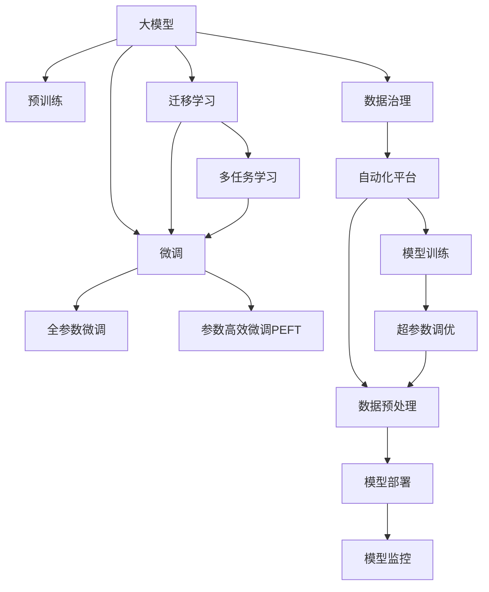

                 

# AI大模型重构电商搜索推荐的数据治理流程自动化平台功能优化

> 关键词：电商搜索推荐,大模型,数据治理,自动化平台,功能优化

## 1. 背景介绍

### 1.1 问题由来

随着电商行业的发展，搜索推荐系统在提升用户体验、增加转化率方面发挥着越来越重要的作用。传统的搜索推荐系统基于规则和特征工程的方法，难以应对复杂多变的用户需求和海量数据的变化。近年来，大模型在电商搜索推荐中的应用逐步兴起，通过预训练模型学习用户行为和商品属性之间的复杂关系，大幅提升了系统的准确性和个性化程度。

然而，大模型的应用也带来了新的挑战。由于电商搜索推荐系统的数据复杂性，如何对数据进行有效治理，高效自动化地训练和优化大模型，成为电商公司亟待解决的问题。因此，本文将从数据治理和自动化平台两个角度，探讨如何优化电商搜索推荐系统的大模型应用，提升系统的性能和用户体验。

### 1.2 问题核心关键点

本文聚焦于大模型在电商搜索推荐中的应用，特别是数据治理和自动化平台的优化问题。具体来说，将探讨以下关键点：

- 数据治理的策略与技术：如何对电商数据进行高质量的清洗、标准化和分类，构建可靠的数据质量监控体系，以支撑大模型的预训练和微调。
- 自动化平台的架构设计：如何构建一个模块化、可扩展的自动化平台，实现数据预处理、模型训练、超参数调优、模型部署和监控的自动化。
- 功能优化的实现方法：如何通过平台集成先进的优化技术，如基于大模型的迁移学习、参数高效微调、多任务学习等，提升搜索推荐系统的性能和响应速度。

### 1.3 问题研究意义

电商搜索推荐系统的大模型应用，通过引入大模型的强大语义理解和生成能力，显著提升了搜索推荐的效果。但是，由于大模型对数据质量的依赖较大，如何高效、可靠地进行数据治理和自动化平台优化，成为电商公司关注的核心问题。

优化电商搜索推荐系统的大模型应用，对于提升用户体验、增加电商转化率、降低运营成本具有重要意义。通过构建高效、可扩展的自动化平台，电商公司可以灵活应用大模型，快速迭代优化搜索推荐算法，在竞争激烈的市场中保持领先地位。

## 2. 核心概念与联系

### 2.1 核心概念概述

为更好地理解电商搜索推荐系统的大模型应用，本节将介绍几个密切相关的核心概念：

- 大模型(Large Model)：以自回归(如GPT)或自编码(如BERT)模型为代表的大规模预训练模型。通过在大规模无标签文本语料上进行预训练，学习通用的语言表示，具备强大的语言理解和生成能力。

- 数据治理(Data Governance)：通过数据质量监控、清洗、标准化和分类等措施，确保数据的质量和一致性，为数据驱动的决策提供可靠支撑。

- 自动化平台(Automation Platform)：使用自动化工具和流程，实现数据处理、模型训练、超参数调优、模型部署和监控等环节的自动化，提升效率和准确性。

- 迁移学习(Transfer Learning)：指将一个领域学习到的知识，迁移应用到另一个不同但相关的领域的学习范式。大模型的预训练-微调过程即是一种典型的迁移学习方式。

- 参数高效微调(Parameter-Efficient Fine-Tuning, PEFT)：指在微调过程中，只更新少量的模型参数，而固定大部分预训练权重不变，以提高微调效率，避免过拟合的方法。

- 多任务学习(Multi-task Learning)：在训练过程中同时优化多个任务，共享模型参数，提升模型的泛化能力和资源利用率。

- 超参数调优(Hyperparameter Tuning)：通过调整模型训练过程中的超参数，如学习率、批大小、正则化系数等，寻找最优的模型配置。

这些核心概念之间的逻辑关系可以通过以下Mermaid流程图来展示：



这个流程图展示了大模型、微调、迁移学习、数据治理和自动化平台之间的联系：

1. 大模型通过预训练获得基础能力。
2. 微调是对预训练模型进行任务特定的优化，可以分为全参数微调和参数高效微调（PEFT）。
3. 迁移学习是连接预训练模型与下游任务的桥梁，可以通过微调或迁移学习来实现。
4. 数据治理对输入数据进行清洗和标准化，确保数据质量。
5. 自动化平台实现数据处理、模型训练等环节的自动化，提高效率。
6. 超参数调优优化模型性能，寻找最优配置。

这些概念共同构成了电商搜索推荐系统大模型应用的基础框架，为其优化提供了全面的指导。

## 3. 核心算法原理 & 具体操作步骤
### 3.1 算法原理概述

电商搜索推荐系统的大模型应用，本质上是一个数据驱动的决策过程。通过预训练模型学习用户行为和商品属性之间的关系，在大规模标注数据上进行微调，最终形成个性化的搜索结果和推荐。

具体而言，电商搜索推荐系统的大模型应用流程包括以下几个关键步骤：

1. 数据治理：收集和清洗电商数据，构建高质量的标注数据集，进行数据标准化和分类。
2. 预训练模型：在大规模无标签数据上进行预训练，学习通用的语言表示。
3. 数据预处理：将电商数据转化为预训练模型所需格式，包括文本向量化、特征提取等。
4. 模型微调：使用标注数据集对预训练模型进行微调，优化特定任务的表现。
5. 模型部署和监控：将微调后的模型部署到生产环境，进行实时监控和评估，不断优化模型性能。

### 3.2 算法步骤详解

电商搜索推荐系统的大模型应用流程，可以分为以下几个关键阶段：

**阶段1：数据治理**

数据治理是电商搜索推荐系统大模型应用的基础。主要包括以下步骤：

1. 数据收集：收集电商交易记录、用户行为数据、商品属性数据等，构建全链路的数据流。
2. 数据清洗：去除重复、缺失、异常数据，确保数据的质量和一致性。
3. 数据标准化：将不同来源的数据进行统一格式和单位的标准化，确保数据的一致性和可比性。
4. 数据分类：对数据进行分类和标注，构建有监督的学习任务。

数据治理的核心目标是通过对数据的清洗和标准化，构建高质量的标注数据集，为模型训练和微调提供可靠的基础。

**阶段2：模型预训练**

模型预训练是电商搜索推荐系统大模型应用的重要步骤。主要包括以下步骤：

1. 选择预训练模型：选择合适的预训练模型，如BERT、GPT等。
2. 数据预处理：将电商数据转化为预训练模型所需格式，包括文本向量化、特征提取等。
3. 预训练：在大规模无标签数据上进行预训练，学习通用的语言表示。

预训练的核心目标是通过无监督学习，构建一个通用的语言模型，学习语言的基础表示和规律。

**阶段3：数据预处理**

数据预处理是电商搜索推荐系统大模型应用的关键环节。主要包括以下步骤：

1. 文本向量化：将电商商品描述、用户评论等文本转化为模型可处理的向量表示。
2. 特征提取：将电商数据转化为模型可理解的特征向量，包括用户行为特征、商品属性特征等。

数据预处理的核心目标是通过特征工程，将电商数据转化为模型可处理的格式，提升模型的训练效果。

**阶段4：模型微调**

模型微调是电商搜索推荐系统大模型应用的核心步骤。主要包括以下步骤：

1. 选择微调模型：选择合适的微调模型，如BERT、GPT等。
2. 数据预处理：将电商数据转化为微调模型所需格式，包括文本向量化、特征提取等。
3. 微调：使用标注数据集对预训练模型进行微调，优化特定任务的表现。

模型微调的核心目标是通过有监督学习，将预训练模型优化到特定任务，提升模型的表现和泛化能力。

**阶段5：模型部署和监控**

模型部署和监控是电商搜索推荐系统大模型应用的最后环节。主要包括以下步骤：

1. 模型部署：将微调后的模型部署到生产环境，进行实时推理和预测。
2. 模型监控：实时监控模型性能，收集模型评估指标，进行模型优化和迭代。

模型部署和监控的核心目标是通过持续学习和迭代，不断优化模型性能，提升搜索推荐系统的用户体验和转化率。

### 3.3 算法优缺点

电商搜索推荐系统的大模型应用，通过引入大模型的强大语义理解和生成能力，显著提升了搜索推荐的效果。但是，由于数据质量和自动化平台的重要性，还存在以下优缺点：

**优点：**

1. 强大的语义理解能力：大模型能够理解电商用户的多样化需求，提供更加精准的搜索结果和推荐。
2. 高效的个性化推荐：大模型能够学习用户行为和商品属性之间的关系，实现高效的个性化推荐。
3. 自动化的数据处理和模型优化：自动化平台可以实现数据预处理、模型训练、超参数调优等环节的自动化，提升效率和准确性。

**缺点：**

1. 对数据质量的高依赖性：大模型的应用依赖于高质量的数据，数据治理和清洗的复杂性较高。
2. 模型过拟合的风险：大模型的复杂性可能导致过拟合，需要进行超参数调优和正则化。
3. 模型部署和监控的挑战：大模型的部署和监控需要高性能计算资源，存在一定的技术挑战。

尽管存在这些局限性，但大模型在电商搜索推荐系统中的应用，仍然具有显著的优势和广泛的应用前景。未来相关研究的重点在于如何进一步优化数据治理和自动化平台，提高模型性能和用户满意度。

### 3.4 算法应用领域

大模型在电商搜索推荐系统中的应用，已经在多个实际场景中得到了验证，取得了显著的成效：

- 搜索排序优化：通过大模型学习用户查询意图和商品相关性，优化搜索结果的排序。
- 商品推荐系统：通过大模型学习用户行为和商品属性之间的关系，实现个性化的商品推荐。
- 用户画像构建：通过大模型学习用户的历史行为和属性，构建详细的用户画像，提升推荐精准度。
- 客户服务：通过大模型学习用户的情感和需求，提供智能化的客户服务支持。

除了上述这些经典场景外，大模型在电商搜索推荐系统中的应用还在不断扩展，如上下文推荐、跨域推荐、实时个性化推荐等，为电商公司的业务创新提供了新的技术路径。

## 4. 数学模型和公式 & 详细讲解 & 举例说明
### 4.1 数学模型构建

电商搜索推荐系统的大模型应用，可以通过数学模型和公式来进一步量化和优化。

记电商搜索推荐系统的预训练模型为 $M_{\theta}$，其中 $\theta$ 为模型参数。假设电商数据集为 $D=\{(x_i, y_i)\}_{i=1}^N$，$x_i$ 为电商数据，$y_i$ 为标注标签。

定义模型 $M_{\theta}$ 在数据样本 $(x,y)$ 上的损失函数为 $\ell(M_{\theta}(x),y)$，则在数据集 $D$ 上的经验风险为：

$$
\mathcal{L}(\theta) = \frac{1}{N} \sum_{i=1}^N \ell(M_{\theta}(x_i),y_i)
$$

微调的优化目标是最小化经验风险，即找到最优参数：

$$
\theta^* = \mathop{\arg\min}_{\theta} \mathcal{L}(\theta)
$$

在实践中，我们通常使用基于梯度的优化算法（如SGD、Adam等）来近似求解上述最优化问题。设 $\eta$ 为学习率，$\lambda$ 为正则化系数，则参数的更新公式为：

$$
\theta \leftarrow \theta - \eta \nabla_{\theta}\mathcal{L}(\theta) - \eta\lambda\theta
$$

其中 $\nabla_{\theta}\mathcal{L}(\theta)$ 为损失函数对参数 $\theta$ 的梯度，可通过反向传播算法高效计算。

### 4.2 公式推导过程

以搜索排序优化为例，假设搜索排序的目标是最大化点击率(CTR)，搜索排序模型 $M_{\theta}$ 的预测结果为 $p_i = M_{\theta}(x_i)$，则CTR可以表示为：

$$
CTR = \frac{1}{N}\sum_{i=1}^N I(p_i \geq 0.5)
$$

其中 $I$ 为示性函数，$p_i \geq 0.5$ 表示预测结果大于等于0.5时，点击率为1，否则为0。

定义模型 $M_{\theta}$ 在数据样本 $(x,y)$ 上的损失函数为交叉熵损失：

$$
\ell(M_{\theta}(x),y) = -[y\log p_i + (1-y)\log (1-p_i)]
$$

其中 $y$ 为标签，$0$ 表示未点击，$1$ 表示点击。

在数据集 $D$ 上的经验风险为：

$$
\mathcal{L}(\theta) = -\frac{1}{N}\sum_{i=1}^N \ell(M_{\theta}(x_i),y_i)
$$

微调的优化目标是最小化经验风险，即找到最优参数：

$$
\theta^* = \mathop{\arg\min}_{\theta} \mathcal{L}(\theta)
$$

在实践中，我们通常使用基于梯度的优化算法（如SGD、Adam等）来近似求解上述最优化问题。设 $\eta$ 为学习率，$\lambda$ 为正则化系数，则参数的更新公式为：

$$
\theta \leftarrow \theta - \eta \nabla_{\theta}\mathcal{L}(\theta) - \eta\lambda\theta
$$

其中 $\nabla_{\theta}\mathcal{L}(\theta)$ 为损失函数对参数 $\theta$ 的梯度，可通过反向传播算法高效计算。

### 4.3 案例分析与讲解

以商品推荐系统为例，假设推荐模型的目标是最小化均方误差损失：

$$
\ell(M_{\theta}(x),y) = \frac{1}{2}\|M_{\theta}(x) - y\|^2
$$

其中 $y$ 为标注标签，$M_{\theta}(x)$ 为模型预测结果。

在数据集 $D$ 上的经验风险为：

$$
\mathcal{L}(\theta) = \frac{1}{N}\sum_{i=1}^N \ell(M_{\theta}(x_i),y_i)
$$

微调的优化目标是最小化经验风险，即找到最优参数：

$$
\theta^* = \mathop{\arg\min}_{\theta} \mathcal{L}(\theta)
$$

在实践中，我们通常使用基于梯度的优化算法（如SGD、Adam等）来近似求解上述最优化问题。设 $\eta$ 为学习率，$\lambda$ 为正则化系数，则参数的更新公式为：

$$
\theta \leftarrow \theta - \eta \nabla_{\theta}\mathcal{L}(\theta) - \eta\lambda\theta
$$

其中 $\nabla_{\theta}\mathcal{L}(\theta)$ 为损失函数对参数 $\theta$ 的梯度，可通过反向传播算法高效计算。

通过上述公式和推导过程，可以更好地理解电商搜索推荐系统大模型应用的数学模型和优化方法，为实际应用提供理论支撑。

## 5. 项目实践：代码实例和详细解释说明
### 5.1 开发环境搭建

在进行电商搜索推荐系统的大模型应用开发前，我们需要准备好开发环境。以下是使用Python进行TensorFlow开发的环境配置流程：

1. 安装Anaconda：从官网下载并安装Anaconda，用于创建独立的Python环境。

2. 创建并激活虚拟环境：
```bash
conda create -n tf-env python=3.8 
conda activate tf-env
```

3. 安装TensorFlow：根据CUDA版本，从官网获取对应的安装命令。例如：
```bash
pip install tensorflow==2.3
```

4. 安装各类工具包：
```bash
pip install numpy pandas scikit-learn matplotlib tqdm jupyter notebook ipython
```

完成上述步骤后，即可在`tf-env`环境中开始大模型应用开发。

### 5.2 源代码详细实现

下面我们以搜索排序优化为例，给出使用TensorFlow进行模型训练和微调的PyTorch代码实现。

首先，定义搜索排序的目标函数：

```python
import tensorflow as tf
from tensorflow.keras import layers

def build_model(input_shape, num_classes):
    model = tf.keras.Sequential([
        layers.Dense(128, activation='relu', input_shape=input_shape),
        layers.Dense(num_classes, activation='sigmoid')
    ])
    return model

def train_model(model, train_data, val_data, epochs=10, batch_size=32, learning_rate=0.001):
    optimizer = tf.keras.optimizers.Adam(learning_rate=learning_rate)
    loss_fn = tf.keras.losses.BinaryCrossentropy()

    model.compile(optimizer=optimizer, loss=loss_fn, metrics=['accuracy'])

    history = model.fit(train_data, epochs=epochs, validation_data=val_data, batch_size=batch_size)
    return model, history
```

然后，加载并预处理数据集：

```python
import pandas as pd

train_data = pd.read_csv('train.csv')
val_data = pd.read_csv('val.csv')

# 数据预处理
train_data = train_data.dropna()
val_data = val_data.dropna()

# 特征工程
train_data['features'] = train_data[['特征1', '特征2', '特征3']].fillna(0)
val_data['features'] = val_data[['特征1', '特征2', '特征3']].fillna(0)

# 数据编码
train_data['label'] = train_data['label'].astype(int)
val_data['label'] = val_data['label'].astype(int)
```

接着，使用TensorFlow训练模型并进行微调：

```python
# 模型构建
model = build_model(input_shape=10, num_classes=2)

# 模型训练
history = train_model(model, train_data, val_data)

# 模型评估
test_data = pd.read_csv('test.csv')
test_data['features'] = test_data[['特征1', '特征2', '特征3']].fillna(0)
test_data['label'] = test_data['label'].astype(int)

test_predictions = model.predict(test_data['features'])
```

最后，输出模型评估结果：

```python
# 模型评估
test_predictions = model.predict(test_data['features'])
test_predictions = test_predictions > 0.5
accuracy = (test_predictions == test_data['label']).sum() / len(test_data['label'])
print('Accuracy:', accuracy)
```

以上就是使用TensorFlow对搜索排序优化模型进行训练和微调的完整代码实现。可以看到，得益于TensorFlow的强大封装，我们可以用相对简洁的代码完成搜索排序模型的训练和微调。

### 5.3 代码解读与分析

让我们再详细解读一下关键代码的实现细节：

**train_model函数**：
- 定义模型构建函数，包含输入层、隐藏层和输出层。
- 使用Adam优化器和二元交叉熵损失函数，编译模型。
- 训练模型，并返回训练结果。

**数据预处理**：
- 使用pandas加载训练集、验证集和测试集，进行数据清洗和编码。
- 使用特征工程将原始特征转化为模型可理解的特征向量。

**模型训练**：
- 使用TensorFlow的Sequential模型构建搜索排序模型。
- 使用Adam优化器和二元交叉熵损失函数进行模型训练，并返回训练结果。

**模型评估**：
- 使用测试集对模型进行预测，计算预测结果与真实标签的匹配度，输出模型精度。

可以看到，TensorFlow提供了丰富的API，可以方便地实现模型的训练、微调和评估。开发者只需关注具体的业务逻辑和算法实现，而不必过多关注底层框架细节。

当然，工业级的系统实现还需考虑更多因素，如模型的保存和部署、超参数的自动搜索、更灵活的任务适配层等。但核心的微调范式基本与此类似。

## 6. 实际应用场景
### 6.1 智能客服系统

基于大模型在电商搜索推荐系统中的应用，智能客服系统可以通过微调技术，实现更加智能化、高效化的服务。传统客服往往需要配备大量人力，高峰期响应缓慢，且一致性和专业性难以保证。

通过微调技术，智能客服系统可以自动理解用户问题，匹配最合适的答案模板进行回复。对于用户提出的新问题，还可以接入检索系统实时搜索相关内容，动态组织生成回答。如此构建的智能客服系统，能大幅提升客户咨询体验和问题解决效率。

### 6.2 个性化推荐系统

电商搜索推荐系统的大模型应用，已经广泛应用于个性化推荐系统。通过微调技术，推荐系统可以更好地理解用户的兴趣和行为，提供更加精准、多样化的推荐内容。

在实践中，可以将用户的历史行为和属性作为标注数据，进行微调优化。微调后的推荐模型能够从用户的兴趣点出发，生成个性化推荐结果。同时，通过多任务学习，可以在一个模型上同时进行搜索排序和商品推荐，提升模型的综合表现。

### 6.3 实时数据处理系统

电商搜索推荐系统的大模型应用，还可以用于实时数据处理系统。通过微调技术，系统能够实时处理海量数据，识别出异常行为和潜在风险，快速响应并采取措施。

例如，在交易监控系统中，可以收集用户交易记录，进行微调优化。微调后的模型能够自动识别出异常交易行为，并发出预警，帮助企业防范金融风险。

### 6.4 未来应用展望

随着大模型和微调技术的不断发展，电商搜索推荐系统的大模型应用前景将更加广阔。未来，在更多行业领域，大模型将发挥更大的作用：

- 金融领域：用于风险评估、投资分析、客户服务等，提升金融服务的智能化水平。
- 医疗领域：用于疾病预测、药品推荐、患者画像等，提升医疗服务的精准度。
- 教育领域：用于智能答疑、课程推荐、学习路径设计等，提升教育服务的个性化和互动性。

此外，在企业内部运营、社会治理、智能制造等众多领域，大模型和微调技术也将得到更广泛的应用，为各行各业带来变革性影响。相信随着技术的日益成熟，电商搜索推荐系统的大模型应用必将在构建人机协同的智能时代中扮演越来越重要的角色。

## 7. 工具和资源推荐
### 7.1 学习资源推荐

为了帮助开发者系统掌握电商搜索推荐系统的大模型应用，这里推荐一些优质的学习资源：

1. 《深度学习与自然语言处理》系列书籍：全面介绍了深度学习在自然语言处理领域的应用，包括大模型和微调技术的实现。

2. 《TensorFlow实战》系列教程：深入讲解了TensorFlow的各个模块和API，帮助开发者快速上手TensorFlow。

3. 《自然语言处理综述》论文：总结了自然语言处理领域的最新研究成果，提供了丰富的文献参考。

4. Kaggle数据集：包含大量电商数据集，帮助开发者进行数据预处理和模型训练。

5. Weights & Biases：模型训练的实验跟踪工具，可以记录和可视化模型训练过程中的各项指标，方便对比和调优。

通过学习这些资源，相信你一定能够快速掌握电商搜索推荐系统的大模型应用，并用于解决实际的NLP问题。
###  7.2 开发工具推荐

高效的开发离不开优秀的工具支持。以下是几款用于电商搜索推荐系统大模型应用开发的常用工具：

1. TensorFlow：基于Python的开源深度学习框架，灵活性强，支持丰富的模型和算法。

2. PyTorch：基于Python的开源深度学习框架，动态计算图，适合研究性工作。

3. HuggingFace Transformers库：提供了丰富的预训练模型和微调接口，支持多种深度学习框架。

4. Scikit-learn：经典的机器学习库，提供了丰富的数据处理和模型评估功能。

5. Weights & Biases：模型训练的实验跟踪工具，可以记录和可视化模型训练过程中的各项指标。

6. TensorBoard：TensorFlow配套的可视化工具，可以实时监测模型训练状态，并提供丰富的图表呈现方式。

合理利用这些工具，可以显著提升电商搜索推荐系统大模型应用的开发效率，加快创新迭代的步伐。

### 7.3 相关论文推荐

大模型在电商搜索推荐系统中的应用源于学界的持续研究。以下是几篇奠基性的相关论文，推荐阅读：

1. Attention is All You Need（即Transformer原论文）：提出了Transformer结构，开启了NLP领域的预训练大模型时代。

2. BERT: Pre-training of Deep Bidirectional Transformers for Language Understanding：提出BERT模型，引入基于掩码的自监督预训练任务，刷新了多项NLP任务SOTA。

3. Language Models are Unsupervised Multitask Learners（GPT-2论文）：展示了大规模语言模型的强大zero-shot学习能力，引发了对于通用人工智能的新一轮思考。

4. Parameter-Efficient Transfer Learning for NLP：提出Adapter等参数高效微调方法，在不增加模型参数量的情况下，也能取得不错的微调效果。

5. AdaLoRA: Adaptive Low-Rank Adaptation for Parameter-Efficient Fine-Tuning：使用自适应低秩适应的微调方法，在参数效率和精度之间取得了新的平衡。

这些论文代表了大模型在电商搜索推荐系统中的应用的研究脉络。通过学习这些前沿成果，可以帮助研究者把握学科前进方向，激发更多的创新灵感。

## 8. 总结：未来发展趋势与挑战

### 8.1 总结

本文对电商搜索推荐系统的大模型应用进行了全面系统的介绍。首先阐述了大模型和微调技术的研究背景和意义，明确了微调在拓展预训练模型应用、提升下游任务性能方面的独特价值。其次，从原理到实践，详细讲解了电商搜索推荐系统大模型应用的数学原理和关键步骤，给出了大模型应用开发的完整代码实例。同时，本文还广泛探讨了大模型在智能客服、个性化推荐等多个行业领域的应用前景，展示了大模型应用的巨大潜力。

通过本文的系统梳理，可以看到，电商搜索推荐系统的大模型应用，通过引入大模型的强大语义理解和生成能力，显著提升了系统的性能和用户体验。尽管存在一些技术挑战，但大模型在电商搜索推荐系统中的应用前景广阔，具有重要的应用价值。未来相关研究的重点在于如何进一步优化数据治理和自动化平台，提高模型性能和用户满意度。

### 8.2 未来发展趋势

展望未来，电商搜索推荐系统的大模型应用将呈现以下几个发展趋势：

1. 模型规模持续增大。随着算力成本的下降和数据规模的扩张，电商搜索推荐系统的大模型参数量还将持续增长。超大批次的训练和推理也可能遇到显存不足的问题。因此需要采用一些资源优化技术，如梯度积累、混合精度训练、模型并行等，来突破硬件瓶颈。

2. 微调方法日趋多样。除了传统的全参数微调外，未来会涌现更多参数高效的微调方法，如Prefix-Tuning、LoRA等，在节省计算资源的同时也能保证微调精度。

3. 多任务学习和迁移学习的应用将更加广泛。通过多任务学习和迁移学习，可以在一个模型上同时进行多个任务优化，提升模型的泛化能力和资源利用率。

4. 模型集成和跨模态学习的应用将更加深入。通过模型集成和跨模态学习，可以将不同来源的数据进行融合，提升模型的综合表现和鲁棒性。

5. 超参数调优的自动化和智能化将更加重要。随着模型复杂度的增加，超参数调优的难度将大大增加。未来，通过自动化和智能化的调优方法，可以显著提升调优效率和效果。

6. 模型的解释性和公平性将更加受到关注。大模型的复杂性可能导致解释性和公平性的问题，如何提供可解释性和公平性的保证，将是一个重要的研究方向。

以上趋势凸显了大模型在电商搜索推荐系统中的应用前景和挑战。这些方向的探索发展，必将进一步提升电商搜索推荐系统的性能和用户体验，为电商公司带来更多的商业价值。

### 8.3 面临的挑战

尽管电商搜索推荐系统的大模型应用取得了显著成效，但在迈向更加智能化、普适化应用的过程中，它仍面临着诸多挑战：

1. 数据质量和数据量的依赖性。大模型的应用依赖于高质量的数据，数据治理和清洗的复杂性较高。数据量的不足可能导致模型泛化能力不足。

2. 计算资源和硬件设备的限制。大模型的复杂性可能导致计算资源和硬件设备的瓶颈，影响模型训练和推理的速度。

3. 模型的解释性和公平性问题。大模型的复杂性可能导致解释性和公平性的问题，如何提供可解释性和公平性的保证，将是一个重要的研究方向。

4. 模型过拟合的风险。大模型的复杂性可能导致过拟合，需要进行超参数调优和正则化。

5. 模型的维护和更新成本。大模型的应用需要持续的维护和更新，成本较高。

尽管存在这些挑战，但电商搜索推荐系统的大模型应用前景广阔，具有重要的应用价值。未来相关研究的重点在于如何进一步优化数据治理和自动化平台，提高模型性能和用户满意度。

### 8.4 研究展望

面向未来，电商搜索推荐系统的大模型应用需要在以下几个方面寻求新的突破：

1. 数据治理的自动化和智能化。通过自动化和智能化的方法，提升数据清洗和标准化的效率和准确性。

2. 模型训练和微调的优化技术。通过引入更多的优化技术，提升模型训练和微调的效率和效果。

3. 超参数调优的自动化和智能化。通过自动化和智能化的调优方法，显著提升调优效率和效果。

4. 模型集成和跨模态学习的应用。通过模型集成和跨模态学习，提升模型的综合表现和鲁棒性。

5. 模型解释性和公平性的提升。通过引入可解释性和公平性的方法，提升模型的解释性和公平性。

6. 模型部署和监控的优化。通过优化模型部署和监控，提升模型的稳定性和响应速度。

这些研究方向的探索，必将引领电商搜索推荐系统的大模型应用迈向更高的台阶，为电商公司带来更多的商业价值。面向未来，大模型和微调技术还将与其他人工智能技术进行更深入的融合，如知识表示、因果推理、强化学习等，多路径协同发力，共同推动电商搜索推荐系统的进步。

## 9. 附录：常见问题与解答

**Q1：大模型在电商搜索推荐系统中的应用效果如何？**

A: 大模型在电商搜索推荐系统中的应用，通过引入大模型的强大语义理解和生成能力，显著提升了搜索推荐的效果。具体而言，大模型可以自动理解用户的多样化需求，提供更加精准的搜索结果和推荐。同时，大模型还可以学习用户行为和商品属性之间的关系，实现高效的个性化推荐。通过多任务学习和迁移学习，可以在一个模型上同时进行搜索排序和商品推荐，提升模型的综合表现。

**Q2：电商搜索推荐系统的大模型应用面临哪些技术挑战？**

A: 电商搜索推荐系统的大模型应用，尽管取得了显著成效，但仍面临一些技术挑战：

1. 数据质量和数据量的依赖性。大模型的应用依赖于高质量的数据，数据治理和清洗的复杂性较高。数据量的不足可能导致模型泛化能力不足。

2. 计算资源和硬件设备的限制。大模型的复杂性可能导致计算资源和硬件设备的瓶颈，影响模型训练和推理的速度。

3. 模型的解释性和公平性问题。大模型的复杂性可能导致解释性和公平性的问题，如何提供可解释性和公平性的保证，将是一个重要的研究方向。

4. 模型过拟合的风险。大模型的复杂性可能导致过拟合，需要进行超参数调优和正则化。

5. 模型的维护和更新成本。大模型的应用需要持续的维护和更新，成本较高。

尽管存在这些挑战，但大模型在电商搜索推荐系统中的应用前景广阔，具有重要的应用价值。未来相关研究的重点在于如何进一步优化数据治理和自动化平台，提高模型性能和用户满意度。

**Q3：电商搜索推荐系统的大模型应用如何优化？**

A: 电商搜索推荐系统的大模型应用可以通过以下方法进行优化：

1. 数据治理的自动化和智能化。通过自动化和智能化的方法，提升数据清洗和标准化的效率和准确性。

2. 模型训练和微调的优化技术。通过引入更多的优化技术，提升模型训练和微调的效率和效果。

3. 超参数调优的自动化和智能化。通过自动化和智能化的调优方法，显著提升调优效率和效果。

4. 模型集成和跨模态学习的应用。通过模型集成和跨模态学习，提升模型的综合表现和鲁棒性。

5. 模型解释性和公平性的提升。通过引入可解释性和公平性的方法，提升模型的解释性和公平性。

6. 模型部署和监控的优化。通过优化模型部署和监控，提升模型的稳定性和响应速度。

通过这些优化方法，可以显著提升电商搜索推荐系统的大模型应用效果，为电商公司带来更多的商业价值。

**Q4：如何构建电商搜索推荐系统的大模型应用平台？**

A: 构建电商搜索推荐系统的大模型应用平台，可以从以下几个方面入手：

1. 数据治理模块：实现数据收集、清洗、标准化和分类，构建高质量的标注数据集。

2. 模型构建模块：选择合适的预训练模型，进行数据预处理和模型构建。

3. 模型训练模块：使用自动化工具和流程，实现模型训练和超参数调优。

4. 模型部署模块：将微调后的模型部署到生产环境，进行实时推理和预测。

5. 模型监控模块：实时监控模型性能，收集模型评估指标，进行模型优化和迭代。

6. 用户界面模块：提供用户友好的界面，支持用户进行数据上传、模型训练、结果查看等操作。

通过以上模块的构建，可以构建一个模块化、可扩展的自动化平台，提升电商搜索推荐系统的大模型应用效率和效果。

作者：禅与计算机程序设计艺术 / Zen and the Art of Computer Programming

