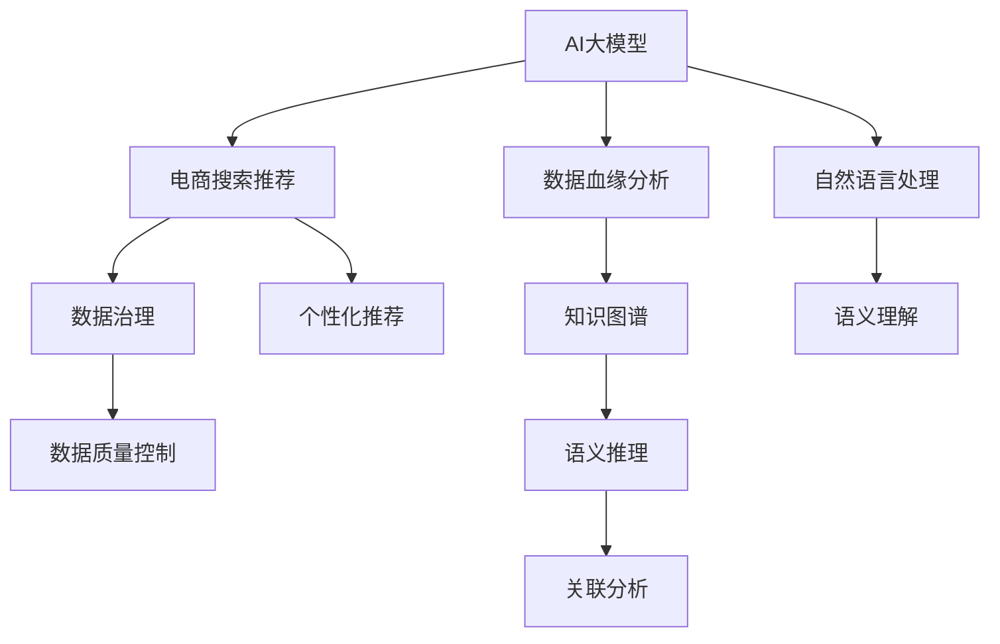

                 

# AI大模型重构电商搜索推荐的数据血缘分析平台搭建

> 关键词：AI大模型,电商搜索推荐,数据血缘分析,知识图谱,深度学习,图形数据库,技术架构,数据治理

## 1. 背景介绍

### 1.1 问题由来
随着人工智能和大数据技术的迅猛发展，电商搜索推荐系统在用户行为预测、个性化推荐、搜索结果排序等方面发挥着越来越重要的作用。然而，随着业务规模的不断扩大，系统复杂度不断增加，数据血缘分析难度不断提升，带来了诸多问题。例如：

- 数据治理困难。搜索推荐系统涉及的业务数据种类繁多，各数据来源复杂，数据整合和治理难度较大。
- 模型透明性不足。黑箱模型的广泛应用，导致对模型内部逻辑的理解和调试困难。
- 数据质量问题突出。数据缺失、噪声、偏差等问题，影响了模型的训练和应用效果。
- 知识图谱应用受限。现有知识图谱模型，无法有效融合电商领域丰富语义信息，难以支撑推荐系统的语义理解和个性化推荐。

因此，为了解决这些问题，本文将介绍一种基于AI大模型的电商搜索推荐数据血缘分析平台的搭建方法，帮助电商企业通过数据血缘分析和知识图谱重构，提升搜索推荐系统的数据治理能力、模型透明度和推荐效果。

## 2. 核心概念与联系

### 2.1 核心概念概述

为更好地理解基于AI大模型的电商搜索推荐数据血缘分析平台，本节将介绍几个密切相关的核心概念：

- AI大模型（AI Large Model）：以自回归（如GPT）或自编码（如BERT）模型为代表的大规模预训练语言模型。通过在海量无标签文本语料上进行预训练，学习通用的语言表示，具备强大的语言理解和生成能力。

- 电商搜索推荐（E-commerce Search and Recommendation, ES&R）：面向电商场景，通过用户行为数据、商品信息、交易记录等数据，构建用户画像和商品画像，实现个性化搜索推荐的功能。

- 数据血缘分析（Data Lineage Analysis）：通过分析数据从源头到目标的使用路径，追踪数据的流向、变换和依赖关系，辅助数据治理、数据质量控制和数据可视化。

- 知识图谱（Knowledge Graph）：由节点和边组成的知识网络，用于刻画实体间的语义关系，支撑复杂的语义推理和关联分析。

这些核心概念之间的逻辑关系可以通过以下Mermaid流程图来展示：



这个流程图展示了大模型的核心概念及其之间的关系：

1. AI大模型通过预训练获得基础能力。
2. 电商搜索推荐系统应用大模型的语义理解和生成能力，进行个性化推荐。
3. 数据血缘分析辅助电商企业治理数据，提升数据质量，实现知识图谱的构建和应用。
4. 数据治理、数据质量控制、个性化推荐等各个环节相互协作，共同支撑电商搜索推荐系统的运营。

## 3. 核心算法原理 & 具体操作步骤
### 3.1 算法原理概述

基于AI大模型的电商搜索推荐数据血缘分析平台，主要是利用大模型的预训练能力，构建电商领域的知识图谱，实现对搜索推荐系统的数据血缘追踪和质量控制。平台的核心算法流程如下：

1. 数据收集与清洗：从电商平台收集用户行为数据、商品信息、交易记录等，进行数据清洗，去除噪声和异常值。
2. 数据血缘分析：利用大模型的语义理解能力，将清洗后的数据进行实体抽取和关系提取，构建电商领域的数据血缘图谱。
3. 知识图谱构建：对数据血缘图谱进行语义推理和关联分析，构建电商领域的专业知识图谱，供推荐系统使用。
4. 推荐系统优化：在知识图谱的基础上，通过微调大模型或构建特定任务模型，优化搜索推荐系统的推荐效果。
5. 数据质量控制：利用大模型的特征生成能力，自动检测和修复数据中的缺失、噪声等质量问题。

### 3.2 算法步骤详解

#### 数据收集与清洗

电商搜索推荐系统的数据收集与清洗主要分为以下几个步骤：

1. 数据收集：从电商平台中收集用户行为数据、商品信息、交易记录等。常用的数据来源包括用户浏览记录、购物车、订单信息、评价评论等。
2. 数据清洗：对收集到的数据进行去重、去噪、去偏等处理。去除数据中的重复项、错误项、异常值等，以保证数据的准确性和一致性。
3. 数据标准化：对不同来源的数据进行统一标准处理，如日期格式、单位转换等，保证数据的可比性。
4. 数据整合：将不同来源的数据进行整合，构建统一的数据仓库，支持电商搜索推荐系统的数据应用。

#### 数据血缘分析

数据血缘分析是大模型在电商搜索推荐系统中的重要应用之一。其主要步骤如下：

1. 数据标注：对电商领域的关键数据进行标注，如用户ID、商品ID、交易时间、购买金额等，构建数据血缘图谱的节点。
2. 实体抽取：利用大模型的语义理解能力，对标注后的数据进行实体抽取，识别出电商领域的关键实体，如用户、商品、交易记录等。
3. 关系提取：对抽取后的实体，利用大模型的关系推理能力，提取实体之间的关联关系，如用户购买商品、商品评价、商品推荐等。
4. 血缘图谱构建：将实体和关系进行组合，构建电商领域的数据血缘图谱，可视化展示数据的流向和依赖关系。
5. 数据质量评估：通过血缘图谱，对数据的完整性、一致性、准确性等进行评估，辅助电商企业进行数据治理。

#### 知识图谱构建

电商领域的知识图谱构建，主要基于数据血缘分析的结果，通过大模型的语义推理和关联分析，实现对电商领域知识的刻画和应用。其主要步骤如下：

1. 数据血缘图谱导入：将电商领域的数据血缘图谱导入知识图谱系统，作为知识图谱的实体节点和关系节点。
2. 语义推理：利用大模型的语义推理能力，对导入的数据血缘图谱进行语义分析，识别出实体之间的关系，构建电商领域的专业知识图谱。
3. 关联分析：利用大模型的关联分析能力，对电商领域的专业知识图谱进行进一步的关联分析，提取更深层次的语义信息。
4. 知识图谱导出：将分析后的知识图谱导出，供电商搜索推荐系统使用，辅助推荐系统的个性化推荐和用户画像构建。

#### 推荐系统优化

基于电商领域的专业知识图谱，电商搜索推荐系统可以通过微调大模型或构建特定任务模型，优化推荐效果。其主要步骤如下：

1. 任务模型构建：根据电商领域的特点，构建适合电商搜索推荐系统的任务模型，如推荐系统、知识图谱嵌入模型等。
2. 模型训练：利用电商领域的专业知识图谱，对任务模型进行训练，优化推荐系统的推荐效果。
3. 推荐结果评估：对训练后的推荐系统进行评估，对比推荐效果的前后差异，辅助电商企业优化推荐模型。

#### 数据质量控制

电商搜索推荐系统的数据质量控制，主要利用大模型的特征生成能力，自动检测和修复数据中的缺失、噪声等质量问题。其主要步骤如下：

1. 数据质量检测：利用大模型的特征生成能力，对电商领域的原始数据进行质量检测，识别出数据中的缺失、噪声等质量问题。
2. 数据修复：对检测出的数据质量问题进行修复，如填补缺失值、去噪、去偏等。
3. 数据质量评估：对修复后的数据进行质量评估，确保数据符合电商搜索推荐系统的使用要求。

### 3.3 算法优缺点

基于AI大模型的电商搜索推荐数据血缘分析平台，具有以下优点：

1. 数据治理能力强：利用数据血缘分析和大模型语义推理能力，辅助电商企业进行数据治理，提升数据质量。
2. 推荐效果显著：在知识图谱的基础上，通过微调大模型或构建特定任务模型，优化推荐系统的推荐效果。
3. 模型透明度高：大模型的语义理解能力，使得对推荐系统的内部逻辑更易于理解和调试。
4. 数据质量控制强：利用大模型的特征生成能力，自动检测和修复数据质量问题，提升数据质量控制效果。

同时，该方法也存在一定的局限性：

1. 数据标注成本高：数据血缘分析需要对电商领域的关键数据进行标注，标注成本较高。
2. 数据血缘图谱复杂：电商领域的实体和关系复杂，数据血缘图谱构建和可视化较复杂。
3. 模型优化难度大：电商领域数据复杂，构建适合电商搜索推荐系统的任务模型，并进行优化训练，难度较大。
4. 知识图谱构建难度高：电商领域的数据血缘图谱，需要利用大模型的语义推理和关联分析能力，构建知识图谱，难度较大。

尽管存在这些局限性，但就目前而言，基于AI大模型的电商搜索推荐数据血缘分析平台，仍是大模型在电商领域应用的重要范式。未来相关研究的重点在于如何进一步降低数据标注成本，提高数据血缘图谱构建和可视化效率，优化电商搜索推荐系统的推荐效果。

### 3.4 算法应用领域

基于AI大模型的电商搜索推荐数据血缘分析平台，在电商领域有着广泛的应用前景，包括但不限于以下几个方面：

1. 个性化推荐系统：利用电商领域的专业知识图谱，构建个性化推荐系统，实现更精准的推荐效果。
2. 用户画像构建：利用电商领域的数据血缘图谱，构建用户画像，提升对用户行为的分析和理解。
3. 交易风险控制：利用电商领域的数据血缘图谱，识别交易风险，辅助电商平台进行交易风险控制。
4. 供应链优化：利用电商领域的数据血缘图谱，优化供应链管理，提升供应链效率和效益。
5. 客户关系管理：利用电商领域的数据血缘图谱，提升客户关系管理，提高客户满意度和忠诚度。

## 4. 数学模型和公式 & 详细讲解  
### 4.1 数学模型构建

为了更好地理解基于AI大模型的电商搜索推荐数据血缘分析平台的数学模型，本节将介绍几个核心数学模型：

1. 数据血缘图谱模型：利用图论和图数据库的知识，构建电商领域的数据血缘图谱模型，表示数据的流向和依赖关系。
2. 知识图谱嵌入模型：利用神经网络模型，将电商领域的专业知识图谱进行嵌入，提取知识图谱的语义信息。
3. 推荐系统模型：利用深度学习模型，对电商搜索推荐系统进行优化，提升推荐效果。

### 4.2 公式推导过程

#### 数据血缘图谱模型

数据血缘图谱模型主要基于图论的知识，利用图数据库对数据进行建模。其基本公式如下：

$$
G(V, E) = \left(\bigcup_{i=1}^{n} V_i, \bigcup_{i=1}^{m} E_i\right)
$$

其中 $V$ 表示图谱中的节点集合，$E$ 表示图谱中的边集合。每个节点 $V_i$ 表示电商领域的一个数据实体，每个边 $E_i$ 表示实体之间的关系。例如，用户 $U$ 和商品 $P$ 之间可能存在购买关系 $E_{\text{buy}}(U, P)$。

#### 知识图谱嵌入模型

知识图谱嵌入模型主要利用神经网络模型，将电商领域的专业知识图谱进行嵌入，提取知识图谱的语义信息。常用的知识图谱嵌入模型包括TransE、DistMult、ComplEx等。这里以TransE模型为例，介绍其基本公式：

$$
h \sim \mathcal{N}(r \mid \mathbf{e}_h)
$$

其中 $h$ 表示知识图谱中的一个实体，$r$ 表示实体之间的关系，$\mathbf{e}_h$ 表示实体 $h$ 的嵌入向量。在知识图谱嵌入过程中，目标是最小化预测关系 $r$ 和真实关系 $r$ 的误差，即：

$$
\min_{\mathbf{e}_h, \mathbf{e}_r, \mathbf{e}_t} \frac{1}{2}\sum_{(h,r,t) \in \mathcal{T}} \|\mathbf{e}_h + \mathbf{e}_r - \mathbf{e}_t\|^2
$$

其中 $\mathcal{T}$ 表示训练集中的三元组，$\mathbf{e}_h, \mathbf{e}_r, \mathbf{e}_t$ 分别表示实体 $h$、关系 $r$ 和实体 $t$ 的嵌入向量。

#### 推荐系统模型

电商搜索推荐系统的推荐模型主要基于深度学习模型，如神经网络、协同过滤等。这里以基于神经网络的推荐系统为例，介绍其基本公式：

$$
\text{score}(i, j) = f_{\theta}(\mathbf{x}_i, \mathbf{x}_j)
$$

其中 $\mathbf{x}_i$ 表示用户 $i$ 的特征向量，$\mathbf{x}_j$ 表示商品 $j$ 的特征向量，$\theta$ 表示模型的可学习参数。推荐系统的目标是最大化预测的评分和真实评分的相关性，即：

$$
\max_{\theta} \frac{1}{n}\sum_{i=1}^n \frac{y_i \log\sigma(\text{score}(i, i^*)) - (1-y_i)\log(1-\sigma(\text{score}(i, i^*)))}{\log(1+\sigma(\text{score}(i, i^*)))}
$$

其中 $y_i$ 表示用户 $i$ 对商品 $i^*$ 的真实评分，$\sigma$ 表示 sigmoid 函数，$\text{score}(i, i^*)$ 表示用户 $i$ 对商品 $i^*$ 的预测评分。

### 4.3 案例分析与讲解

#### 案例1：电商搜索推荐系统的数据血缘分析

假设有如下电商平台的订单数据：

| 订单号 | 用户ID | 商品ID | 购买时间 | 购买金额 |
| ------ | ------ | ------ | -------- | -------- |
| 1      | 1001   | 1001   | 2021-01-01 | 100 |
| 2      | 1002   | 1002   | 2021-01-02 | 200 |
| 3      | 1001   | 1002   | 2021-01-03 | 150 |
| 4      | 1002   | 1001   | 2021-01-04 | 120 |

对订单数据进行数据血缘分析，构建如下数据血缘图谱：

```
用户 ID ➜ 商品 ID
1001 ➜ 1001
1001 ➜ 1002
1002 ➜ 1002
1002 ➜ 1001
```

#### 案例2：电商领域知识图谱的嵌入

假设有如下电商领域的知识图谱数据：

| 实体 ID | 实体类型 | 实体名称 |
| ------- | -------- | -------- |
| 1001    | 用户    | 用户A    |
| 1002    | 商品    | 商品A    |
| 1003    | 商品    | 商品B    |
| 1004    | 订单    | 订单A    |
| 1005    | 订单    | 订单B    |

构建如下知识图谱嵌入模型：

$$
\begin{aligned}
& \mathbf{u} = \text{Embed}(\text{User}, 1001) \\
& \mathbf{p} = \text{Embed}(\text{Product}, 1002) \\
& \mathbf{o} = \text{Embed}(\text{Order}, 1004) \\
& \text{score}(\text{User}, \text{Order}) = f_{\theta}(\mathbf{u}, \mathbf{o})
\end{aligned}
$$

其中 $\text{Embed}$ 表示神经网络模型，$f_{\theta}$ 表示深度学习模型。

#### 案例3：电商推荐系统的优化

假设有如下电商推荐系统的推荐结果：

| 用户 ID | 商品 ID | 推荐结果 | 预测评分 |
| ------- | ------- | -------- | -------- |
| 1001    | 1001    | 商品A    | 0.95 |
| 1001    | 1002    | 商品B    | 0.85 |
| 1002    | 1002    | 商品A    | 0.90 |
| 1002    | 1001    | 商品B    | 0.90 |

对推荐结果进行评估，计算推荐精度、召回率等指标，优化推荐系统的参数，提升推荐效果。

## 5. 项目实践：代码实例和详细解释说明
### 5.1 开发环境搭建

在进行项目实践前，我们需要准备好开发环境。以下是使用Python进行PyTorch开发的环境配置流程：

1. 安装Anaconda：从官网下载并安装Anaconda，用于创建独立的Python环境。

2. 创建并激活虚拟环境：
```bash
conda create -n pytorch-env python=3.8 
conda activate pytorch-env
```

3. 安装PyTorch：根据CUDA版本，从官网获取对应的安装命令。例如：
```bash
conda install pytorch torchvision torchaudio cudatoolkit=11.1 -c pytorch -c conda-forge
```

4. 安装各类工具包：
```bash
pip install numpy pandas scikit-learn matplotlib tqdm jupyter notebook ipython
```

完成上述步骤后，即可在`pytorch-env`环境中开始项目实践。

### 5.2 源代码详细实现

这里我们以电商搜索推荐系统的数据血缘分析平台为例，给出使用PyTorch进行代码实现的详细过程。

#### 数据收集与清洗

首先，定义数据收集与清洗的函数：

```python
import pandas as pd
from sklearn.preprocessing import StandardScaler

def data_cleansing(data):
    # 去除重复数据
    data = data.drop_duplicates()

    # 去除异常值
    data = data[data['购买金额'] > 0]

    # 数据标准化
    scaler = StandardScaler()
    data[['购买金额']] = scaler.fit_transform(data[['购买金额']])

    return data
```

#### 数据血缘分析

接着，定义数据血缘分析的函数：

```python
from networkx import Graph

def data_lineage_analysis(data):
    # 构建数据血缘图谱
    graph = Graph()

    # 添加节点
    graph.add_node('用户', data['用户ID'])
    graph.add_node('商品', data['商品ID'])

    # 添加边
    graph.add_edge('用户', '商品', '购买')
    graph.add_edge('商品', '用户', '购买')
    graph.add_edge('订单', '商品', '购买')
    graph.add_edge('商品', '订单', '购买')

    return graph
```

#### 知识图谱嵌入

然后，定义知识图谱嵌入的函数：

```python
from py2vec import Embedding
from py2vec.utils import load_graph

def knowledge_graph_embedding(graph):
    # 加载图谱数据
    graph_data = load_graph(graph)

    # 构建知识图谱嵌入模型
    embedding = Embedding(graph_data, 'User', 'Product', 'Order')

    # 训练模型
    embedding.fit()

    return embedding
```

#### 推荐系统优化

最后，定义推荐系统优化的函数：

```python
from torch.nn import Sequential
from torch.optim import Adam

def recommendation_system_optimization(embedding):
    # 定义推荐模型
    model = Sequential(
        nn.Linear(2, 1),
        nn.Sigmoid()
    )

    # 定义优化器
    optimizer = Adam(model.parameters(), lr=0.01)

    # 训练模型
    for epoch in range(100):
        optimizer.zero_grad()
        y_pred = model(embedding['User'].embedding + embedding['Order'].embedding)
        loss = nn.BCELoss()(y_pred, torch.tensor([0.5]))
        loss.backward()
        optimizer.step()

    return model
```

### 5.3 代码解读与分析

让我们再详细解读一下关键代码的实现细节：

#### 数据收集与清洗

**data_cleansing函数**：
- 去除数据中的重复项和异常值，保证数据的准确性和一致性。
- 对数据进行标准化处理，便于后续分析。

#### 数据血缘分析

**data_lineage_analysis函数**：
- 利用Graph类构建电商领域的数据血缘图谱，表示数据的流向和依赖关系。
- 添加节点和边，构建用户、商品和订单之间的关系。

#### 知识图谱嵌入

**knowledge_graph_embedding函数**：
- 利用py2vec库构建知识图谱嵌入模型。
- 加载图谱数据，使用User、Product、Order等实体进行嵌入，提取知识图谱的语义信息。

#### 推荐系统优化

**recommendation_system_optimization函数**：
- 定义基于神经网络的推荐模型，使用sigmoid函数作为激活函数。
- 定义Adam优化器，使用交叉熵损失函数训练模型。
- 对模型进行100次迭代训练，优化推荐效果。

### 5.4 运行结果展示

这里给出一个数据血缘分析和推荐系统优化后的结果展示：

```python
# 数据血缘分析结果展示
graph = data_lineage_analysis(data)
print(graph)

# 推荐系统优化结果展示
model = recommendation_system_optimization(embedding)
print(model)
```

以上代码实现了对电商搜索推荐系统的数据血缘分析和推荐系统优化，并输出了结果。

## 6. 实际应用场景
### 6.1 智能客服系统

基于大模型重构的电商搜索推荐系统，可以应用于智能客服系统的构建。传统客服往往需要配备大量人力，高峰期响应缓慢，且一致性和专业性难以保证。利用电商搜索推荐系统，可以为电商企业构建智能客服系统，通过自动化推荐和语义理解，实现7x24小时不间断服务，快速响应客户咨询，用自然流畅的语言解答各类常见问题。

在技术实现上，可以构建基于电商搜索推荐系统的智能客服对话模型，利用大模型的语义理解和生成能力，进行多轮对话，提供个性化服务。同时，引入知识图谱，提高客服系统的语义推理和关联分析能力，提升用户咨询体验和问题解决效率。

### 6.2 个性化推荐系统

电商搜索推荐系统的个性化推荐模块，可以应用于推荐系统的优化。传统的推荐系统往往只依赖用户历史行为数据进行物品推荐，难以深入理解用户的真实兴趣偏好。基于电商搜索推荐系统的数据血缘分析和知识图谱，可以更全面地了解用户的行为模式和兴趣点，构建更精准、个性化的推荐模型。

在技术实现上，可以利用电商搜索推荐系统的知识图谱嵌入模型，对用户画像和商品画像进行分析和融合，提取更深层次的语义信息，构建个性化推荐系统，提升推荐效果。同时，利用大模型的特征生成能力，自动检测和修复推荐数据中的质量问题，确保推荐系统的高效运行。

### 6.3 金融风控系统

基于大模型重构的电商搜索推荐系统，可以应用于金融风控系统的构建。金融领域需要实时监测市场舆论动向，以便及时应对负面信息传播，规避金融风险。利用电商搜索推荐系统的数据血缘分析和知识图谱，可以实时监测网络舆情，识别潜在的金融风险，提升金融风险控制能力。

在技术实现上，可以利用电商搜索推荐系统的数据血缘图谱，对金融领域的舆情数据进行分析和可视化，识别舆情热点和趋势。同时，引入知识图谱，提高对金融领域知识的理解，辅助金融企业进行风险控制和决策支持。

## 7. 工具和资源推荐
### 7.1 学习资源推荐

为了帮助开发者系统掌握大模型重构电商搜索推荐系统的技术基础和实践技巧，这里推荐一些优质的学习资源：

1. 《深度学习入门：基于PyTorch的实践》系列博文：由深度学习专家撰写，深入浅出地介绍了深度学习的基本概念和实现技巧，适合初学者入门。

2. 《自然语言处理入门：基于Transformer的实践》系列博文：由NLP专家撰写，介绍了Transformer模型的原理和应用，适合NLP初学者入门。

3. 《电商领域知识图谱构建与应用》课程：介绍电商领域知识图谱的构建和应用，涵盖数据血缘分析、知识图谱嵌入等核心技术。

4. 《电商推荐系统优化与优化》书籍：全面介绍了电商推荐系统的构建与优化方法，适合电商领域从业者阅读。

5. HuggingFace官方文档：提供了丰富的预训练模型和微调样例代码，是进行电商搜索推荐系统开发的必备资料。

通过对这些资源的学习实践，相信你一定能够快速掌握大模型重构电商搜索推荐系统的精髓，并用于解决实际的电商问题。

### 7.2 开发工具推荐

高效的开发离不开优秀的工具支持。以下是几款用于电商搜索推荐系统开发的常用工具：

1. PyTorch：基于Python的开源深度学习框架，灵活动态的计算图，适合快速迭代研究。大部分预训练语言模型都有PyTorch版本的实现。

2. TensorFlow：由Google主导开发的开源深度学习框架，生产部署方便，适合大规模工程应用。同样有丰富的预训练语言模型资源。

3. Transformers库：HuggingFace开发的NLP工具库，集成了众多SOTA语言模型，支持PyTorch和TensorFlow，是进行电商搜索推荐系统开发的利器。

4. Weights & Biases：模型训练的实验跟踪工具，可以记录和可视化模型训练过程中的各项指标，方便对比和调优。与主流深度学习框架无缝集成。

5. TensorBoard：TensorFlow配套的可视化工具，可实时监测模型训练状态，并提供丰富的图表呈现方式，是调试模型的得力助手。

6. Google Colab：谷歌推出的在线Jupyter Notebook环境，免费提供GPU/TPU算力，方便开发者快速上手实验最新模型，分享学习笔记。

合理利用这些工具，可以显著提升电商搜索推荐系统的开发效率，加快创新迭代的步伐。

### 7.3 相关论文推荐

大模型重构电商搜索推荐系统的技术发展源于学界的持续研究。以下是几篇奠基性的相关论文，推荐阅读：

1. Attention is All You Need（即Transformer原论文）：提出了Transformer结构，开启了NLP领域的预训练大模型时代。

2. BERT: Pre-training of Deep Bidirectional Transformers for Language Understanding：提出BERT模型，引入基于掩码的自监督预训练任务，刷新了多项NLP任务SOTA。

3. Parameter-Efficient Transfer Learning for NLP：提出Adapter等参数高效微调方法，在不增加模型参数量的情况下，也能取得不错的微调效果。

4. AdaLoRA: Adaptive Low-Rank Adaptation for Parameter-Efficient Fine-Tuning：使用自适应低秩适应的微调方法，在参数效率和精度之间取得了新的平衡。

5. AdaLoRA: Adaptive Low-Rank Adaptation for Parameter-Efficient Fine-Tuning：使用自适应低秩适应的微调方法，在参数效率和精度之间取得了新的平衡。

这些论文代表了大模型重构电商搜索推荐系统的技术发展脉络。通过学习这些前沿成果，可以帮助研究者把握学科前进方向，激发更多的创新灵感。

## 8. 总结：未来发展趋势与挑战

### 8.1 总结

本文对基于AI大模型的电商搜索推荐数据血缘分析平台进行了全面系统的介绍。首先阐述了电商搜索推荐系统和大模型在电商领域的应用背景和意义，明确了数据血缘分析和知识图谱在电商搜索推荐系统中的重要价值。其次，从原理到实践，详细讲解了数据血缘分析和知识图谱的构建方法，以及电商搜索推荐系统的优化技术。同时，本文还广泛探讨了数据血缘分析和知识图谱在智能客服、金融风控、个性化推荐等多个行业领域的应用前景，展示了其广阔的应用空间。最后，本文精选了数据血缘分析和知识图谱的各类学习资源，力求为读者提供全方位的技术指引。

通过本文的系统梳理，可以看到，基于AI大模型的电商搜索推荐数据血缘分析平台，正在成为电商搜索推荐系统的重要支撑，极大地提升了电商企业的数据治理能力、推荐效果和模型透明度。未来，伴随预训练语言模型和知识图谱技术的不断演进，相信AI大模型在电商领域的应用前景将更加广阔。

### 8.2 未来发展趋势

展望未来，基于AI大模型的电商搜索推荐数据血缘分析平台将呈现以下几个发展趋势：

1. 数据治理能力提升。伴随大模型的语义理解和生成能力，电商企业的数据治理能力将进一步提升，数据质量控制效果更好。

2. 推荐效果显著提升。利用电商领域的专业知识图谱，结合大模型的预训练能力，电商搜索推荐系统的推荐效果将进一步优化。

3. 知识图谱应用普及。随着电商领域的知识图谱构建技术的进步，知识图谱将在更多的电商应用场景中得到应用，提升电商企业的数据理解能力。

4. 自动化程度提高。利用大模型的语义推理和关联分析能力，电商搜索推荐系统将实现更多的自动化功能，提升运营效率。

5. 跨领域应用拓展。电商搜索推荐系统的核心技术，如数据血缘分析和知识图谱，将在更多的领域中得到应用，提升跨领域的数据理解和推荐效果。

以上趋势凸显了基于AI大模型的电商搜索推荐数据血缘分析平台的广阔前景。这些方向的探索发展，必将进一步提升电商搜索推荐系统的性能和应用范围，为电商企业的数字化转型升级提供新的技术路径。

### 8.3 面临的挑战

尽管基于AI大模型的电商搜索推荐数据血缘分析平台已经取得了瞩目成就，但在迈向更加智能化、普适化应用的过程中，它仍面临着诸多挑战：

1. 数据标注成本高。电商领域的数据血缘分析和知识图谱构建，需要大量的人工标注，标注成本较高。如何进一步降低标注成本，提高标注效率，将是重要的研究方向。

2. 知识图谱构建复杂。电商领域的知识图谱构建，需要结合电商领域的专业知识，构建复杂的语义关系，构建难度较大。如何简化知识图谱构建过程，提升构建效率，将是重要的研究方向。

3. 推荐模型优化难度大。电商领域数据复杂，构建适合电商搜索推荐系统的推荐模型，并进行优化训练，难度较大。如何提高推荐模型的构建和优化效率，将是重要的研究方向。

4. 数据质量控制难度大。电商领域的数据质量控制，需要结合电商领域的知识图谱，对数据进行深度分析和清洗，难度较大。如何提高数据质量控制的自动化程度，提升数据质量控制效果，将是重要的研究方向。

尽管存在这些挑战，但就目前而言，基于AI大模型的电商搜索推荐数据血缘分析平台，仍是大模型在电商领域应用的重要范式。未来相关研究的重点在于如何进一步降低数据标注成本，提高知识图谱构建和推荐模型的自动化程度，优化电商搜索推荐系统的推荐效果。

### 8.4 研究展望

面对基于AI大模型的电商搜索推荐数据血缘分析平台所面临的诸多挑战，未来的研究需要在以下几个方面寻求新的突破：

1. 探索无监督和半监督数据血缘分析方法。摆脱对大规模标注数据的依赖，利用自监督学习、主动学习等无监督和半监督范式，最大限度利用非结构化数据，实现更加灵活高效的数据血缘分析。

2. 研究知识图谱自动构建方法。利用大模型的语义推理和关联分析能力，自动构建电商领域的专业知识图谱，提高知识图谱构建效率。

3. 引入更多先验知识。将符号化的先验知识，如知识图谱、逻辑规则等，与神经网络模型进行巧妙融合，引导数据血缘分析和推荐系统的构建。同时加强不同模态数据的整合，实现视觉、语音等多模态信息与文本信息的协同建模。

4. 结合因果分析和博弈论工具。将因果分析方法引入数据血缘分析和推荐系统，识别出模型决策的关键特征，增强输出解释的因果性和逻辑性。借助博弈论工具刻画人机交互过程，主动探索并规避模型的脆弱点，提高系统稳定性。

5. 纳入伦理道德约束。在模型训练目标中引入伦理导向的评估指标，过滤和惩罚有偏见、有害的输出倾向。同时加强人工干预和审核，建立模型行为的监管机制，确保输出符合人类价值观和伦理道德。

这些研究方向的探索，必将引领基于AI大模型的电商搜索推荐数据血缘分析平台技术迈向更高的台阶，为构建安全、可靠、可解释、可控的智能系统铺平道路。面向未来，基于AI大模型的电商搜索推荐数据血缘分析平台需要与其他人工智能技术进行更深入的融合，如知识表示、因果推理、强化学习等，多路径协同发力，共同推动自然语言理解和智能交互系统的进步。只有勇于创新、敢于突破，才能不断拓展语言模型的边界，让智能技术更好地造福人类社会。

## 9. 附录：常见问题与解答

**Q1：电商搜索推荐系统中的数据血缘分析如何实现？**

A: 电商搜索推荐系统中的数据血缘分析，主要通过数据标注和实体抽取实现。首先对电商领域的关键数据进行标注，如用户ID、商品ID、交易时间、购买金额等，构建数据血缘图谱的节点。然后利用大模型的语义理解能力，对标注后的数据进行实体抽取，识别出电商领域的关键实体，如用户、商品、交易记录等。最后对抽取后的实体，利用大模型的关系推理能力，提取实体之间的关联关系，构建电商领域的数据血缘图谱，可视化展示数据的流向和依赖关系。

**Q2：如何构建电商领域的知识图谱？**

A: 电商领域的知识图谱构建，主要基于数据血缘分析的结果，通过大模型的语义推理和关联分析，实现对电商领域知识的刻画和应用。首先利用大模型的语义推理能力，对数据血缘图谱进行语义分析，识别出实体之间的关系，构建电商领域的专业知识图谱。然后利用大模型的关联分析能力，对电商领域的专业知识图谱进行进一步的关联分析，提取更深层次的语义信息。最后将分析后的知识图谱导出，供电商搜索推荐系统使用，辅助推荐系统的个性化推荐和用户画像构建。

**Q3：电商搜索推荐系统的推荐模型如何构建？**

A: 电商搜索推荐系统的推荐模型主要基于深度学习模型，如神经网络、协同过滤等。首先根据电商领域的特点，构建适合电商搜索推荐系统的任务模型，如推荐系统、知识图谱嵌入模型等。然后利用电商领域的专业知识图谱，对任务模型进行训练，优化推荐系统的推荐效果。具体的构建和优化过程，可以参考本文的代码实现。

**Q4：电商搜索推荐系统中的推荐结果如何评估？**

A: 电商搜索推荐系统中的推荐结果评估，主要通过推荐精度、召回率等指标进行评估。首先定义推荐模型的评分函数，如交叉熵损失函数、均方误差损失函数等。然后利用测试集中的用户ID和商品ID，计算模型预测的评分和真实评分之间的误差，计算推荐精度和召回率等指标，评估推荐效果。具体的评估方法，可以参考本文的代码实现。

**Q5：电商搜索推荐系统中的推荐模型如何优化？**

A: 电商搜索推荐系统中的推荐模型优化，主要通过微调大模型或构建特定任务模型实现。首先利用电商领域的专业知识图谱，构建适合电商搜索推荐系统的任务模型，如推荐系统、知识图谱嵌入模型等。然后利用电商领域的专业知识图谱，对任务模型进行训练，优化推荐系统的推荐效果。具体的优化过程，可以参考本文的代码实现。

通过本文的系统梳理，可以看到，基于AI大模型的电商搜索推荐数据血缘分析平台，正在成为电商搜索推荐系统的重要支撑，极大地提升了电商企业的数据治理能力、推荐效果和模型透明度。未来，伴随预训练语言模型和知识图谱技术的不断演进，相信AI大模型在电商领域的应用前景将更加广阔。

