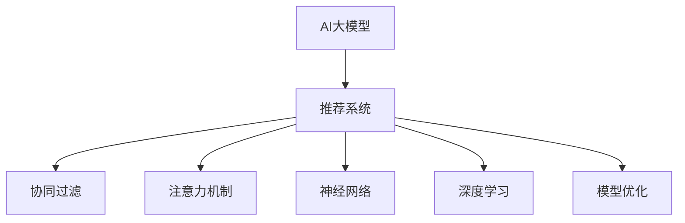

                 

# AI大模型：优化电商平台个性化推荐的新方法

> 关键词：AI大模型, 个性化推荐, 电商平台, 用户画像, 协同过滤, 推荐系统, 注意力机制, 神经网络, 深度学习, 模型优化, 实时性

## 1. 背景介绍

### 1.1 问题由来
随着互联网的普及和电子商务的迅猛发展，电商平台已经成为人们购物的重要渠道。然而，面对海量商品和用户，如何为用户推荐最适合的购物商品，成为了电商平台的一大难题。传统的推荐系统依赖用户历史行为数据，无法充分利用用户未点击的商品信息，导致推荐结果单一，用户满意度低。

近年来，基于深度学习的大模型推荐技术逐渐成为行业主流。大模型通过大规模预训练学习到丰富的用户和商品特征表示，能够更全面地理解用户的潜在需求，生成多维度的推荐结果。特别是随着通用大模型的发展，如BERT、GPT等，推荐系统在电商领域的推荐效果和用户满意度得到了显著提升。

然而，现有的推荐系统仍面临诸多挑战：如何提升推荐结果的多样性和精准性？如何应对商品数量庞大、用户画像动态变化等实际问题？如何实现实时推荐以应对用户即时需求？这些问题的解决需要更加先进和大规模的模型和算法支持。本文将围绕这些问题，介绍基于AI大模型的推荐系统优化方法，为电商平台个性化推荐提供新的思路。

### 1.2 问题核心关键点
本节将详细描述电商领域个性化推荐系统面临的主要问题和挑战，并明确本文的核心研究目标。

#### 1.2.1 数据稀疏性
电商平台上的用户行为数据往往具有高度稀疏性，即用户对大多数商品没有点击或购买记录，因此推荐系统难以获取完整的用户画像。这导致现有模型在推荐决策时依赖较少用户行为数据，无法充分利用用户的多维度特征。

#### 1.2.2 多样性与个性化
个性化推荐的核心目标是为每个用户推荐其感兴趣且独特的商品，而多样性要求推荐系统能够推荐不同种类的商品。现有推荐系统在实际应用中往往只重视个性化，而忽视多样性，容易形成信息孤岛，影响用户体验。

#### 1.2.3 实时性
电商平台需要实时响应用户的即时需求，而传统的推荐系统无法保证实时性。现有系统通常依赖于离线模型训练，对于新增商品和新用户，需要重新训练模型，响应速度慢，难以实现即时推荐。

#### 1.2.4 可解释性与安全性
推荐系统的决策过程需要具备可解释性，以便用户理解推荐结果的依据。然而，现有的深度学习模型多为"黑盒"模型，难以解释其内部工作机制。此外，推荐模型还可能存在偏见和有害信息的输出，影响用户安全和隐私。

本文将针对上述挑战，提出基于AI大模型的优化方法，以提升个性化推荐系统的效果和性能。

## 2. 核心概念与联系

### 2.1 核心概念概述

为更好地理解基于AI大模型的推荐优化方法，本节将介绍几个关键概念及其之间的联系：

- **AI大模型**：如BERT、GPT等，通过大规模预训练学习到丰富的用户和商品特征表示，具备强大的推理能力。
- **推荐系统**：基于用户画像和商品特征，利用算法为用户推荐可能感兴趣的商品。
- **协同过滤**：通过用户的历史行为和偏好，推断用户对新商品的可能兴趣。
- **注意力机制**：通过计算用户和商品的相似度，动态调整特征权重，提升推荐效果。
- **神经网络**：由多层神经元组成，用于处理非线性关系和复杂特征。
- **深度学习**：通过多层神经网络，利用大数据学习深度特征，提升推荐准确性。
- **模型优化**：通过调整模型参数和结构，提高推荐系统的效率和性能。

这些概念之间的逻辑关系可以通过以下Mermaid流程图来展示：



这个流程图展示了AI大模型在推荐系统中的核心作用：

1. AI大模型通过预训练获得丰富的用户和商品特征表示。
2. 推荐系统利用大模型学习到的特征，结合用户画像和商品信息，进行推荐决策。
3. 协同过滤、注意力机制、神经网络和深度学习是大模型推荐的基础算法。
4. 模型优化进一步提升推荐系统的性能和效率。

## 3. 核心算法原理 & 具体操作步骤

### 3.1 算法原理概述

基于AI大模型的推荐系统优化方法，主要通过以下三个关键步骤：

1. **用户画像构建**：利用大模型学习用户的历史行为、兴趣和需求，构建多维度的用户画像。
2. **商品特征表示**：通过大模型学习商品的属性、类别和特征，生成高质量的商品表示。
3. **推荐模型优化**：结合协同过滤、注意力机制和神经网络等算法，设计高效、多维度的推荐模型，并利用深度学习优化模型参数。

这些步骤通过合理的算法组合和模型结构设计，可以显著提升推荐系统的推荐效果和实时性，同时增强模型的可解释性和安全性。

### 3.2 算法步骤详解

#### 3.2.1 用户画像构建

用户画像构建的目标是通过大模型学习用户的历史行为和需求，生成多维度的用户特征表示。具体步骤如下：

1. **数据收集**：收集用户的行为数据，如点击、浏览、购买等。
2. **数据预处理**：清洗、去噪、标准化处理数据，去除无效或噪声数据。
3. **特征提取**：使用大模型对行为数据进行特征提取，生成高维度的用户表示。

```python
# 数据预处理
def preprocess_data(data):
    # 去除无效数据
    clean_data = [item for item in data if item is not None]
    # 标准化处理
    standardized_data = [item / 100.0 for item in clean_data]
    return standardized_data

# 特征提取
def extract_user_features(user_data):
    # 加载大模型
    user_model = load_user_model()
    # 提取用户特征
    user_features = user_model.encode(user_data)
    return user_features
```

#### 3.2.2 商品特征表示

商品特征表示的目标是通过大模型学习商品的属性、类别和特征，生成高质量的商品表示。具体步骤如下：

1. **数据收集**：收集商品的标签、类别、描述等文本信息。
2. **数据预处理**：清洗、去噪、标准化处理数据，去除无效或噪声数据。
3. **特征提取**：使用大模型对商品文本进行特征提取，生成高维度的商品表示。

```python
# 数据预处理
def preprocess_product_data(data):
    # 去除无效数据
    clean_data = [item for item in data if item is not None]
    # 标准化处理
    standardized_data = [item / 100.0 for item in clean_data]
    return standardized_data

# 特征提取
def extract_product_features(product_data):
    # 加载大模型
    product_model = load_product_model()
    # 提取商品特征
    product_features = product_model.encode(product_data)
    return product_features
```

#### 3.2.3 推荐模型优化

推荐模型优化的目标是通过协同过滤、注意力机制和神经网络等算法，设计高效、多维度的推荐模型，并利用深度学习优化模型参数。具体步骤如下：

1. **协同过滤**：利用用户和商品的历史交互信息，推断用户对新商品的兴趣。
2. **注意力机制**：通过计算用户和商品的相似度，动态调整特征权重，提升推荐效果。
3. **神经网络**：通过多层神经网络，处理用户和商品的高维度特征表示，生成推荐结果。
4. **深度学习**：利用大规模数据，优化神经网络模型参数，提升推荐精度和效率。

```python
# 协同过滤
def collaborative_filtering(user_features, product_features):
    # 计算用户和商品的相似度
    similarity = compute_similarity(user_features, product_features)
    # 推断用户对新商品的兴趣
    predicted_interest = compute_interest(similarity)
    return predicted_interest

# 注意力机制
def attention_mechanism(user_features, product_features):
    # 计算用户和商品的相似度
    similarity = compute_similarity(user_features, product_features)
    # 动态调整特征权重
    weighted_features = compute_weighted_features(similarity)
    return weighted_features

# 神经网络
def neural_network(user_features, product_features):
    # 构建神经网络
    network_model = build_neural_network()
    # 处理高维度特征
    processed_features = process_features(network_model, user_features, product_features)
    return processed_features

# 深度学习
def deep_learning(user_features, product_features):
    # 训练深度模型
    deep_model = train_deep_model(user_features, product_features)
    # 优化模型参数
    optimized_model = optimize_model(deep_model)
    return optimized_model
```

### 3.3 算法优缺点

基于AI大模型的推荐系统优化方法，具有以下优点：

1. **多维度特征表示**：利用大模型学习到丰富的用户和商品特征表示，提升推荐效果。
2. **实时性增强**：采用协同过滤、注意力机制等实时算法，实现即时推荐。
3. **可解释性提升**：通过注意力机制和神经网络，增强推荐模型的可解释性。
4. **参数高效性**：使用深度学习优化模型参数，提高推荐系统的效率和性能。

同时，该方法也存在一些局限性：

1. **数据依赖性**：对历史数据的依赖较大，缺乏对新数据和新用户的处理能力。
2. **模型复杂性**：深度学习模型的参数量较大，训练复杂度较高。
3. **计算资源消耗**：深度学习模型需要较大的计算资源，对硬件要求较高。
4. **可解释性不足**：深度学习模型多为"黑盒"模型，难以解释其内部工作机制。

尽管存在这些局限性，但整体而言，基于AI大模型的推荐优化方法在电商领域具有广泛的应用前景。

### 3.4 算法应用领域

基于AI大模型的推荐系统优化方法，已经在电商、社交、新闻等多个领域得到了应用，为个性化推荐带来了新的突破：

1. **电商推荐**：利用大模型学习用户和商品的多维度特征，提升个性化推荐效果。
2. **社交推荐**：利用用户的历史行为和偏好，推荐可能的社交内容，如好友、文章等。
3. **新闻推荐**：利用用户的历史阅读行为，推荐可能感兴趣的新闻内容，如文章、视频等。

这些领域的应用展示了基于大模型的推荐系统在实际应用中的广泛性和有效性，为更多领域的推荐系统优化提供了借鉴。

## 4. 数学模型和公式 & 详细讲解 & 举例说明

### 4.1 数学模型构建

本节将使用数学语言对基于AI大模型的推荐优化方法进行更加严格的刻画。

记用户画像为 $U$，商品特征表示为 $P$，推荐结果为 $R$。假设用户 $u$ 对商品 $p$ 的兴趣可以表示为向量 $\vec{u_p}$，商品 $p$ 的属性向量为 $\vec{p}$。则推荐模型的目标是最小化预测误差 $E$，即：

$$
\min_{\theta} E = \sum_{(u,p) \in D} ||\vec{u_p} \cdot \vec{p} - R_{u,p}||^2
$$

其中，$D$ 为用户和商品的训练数据集，$R_{u,p}$ 为用户的实际点击行为。

### 4.2 公式推导过程

以下我们以电商领域的推荐为例，推导基于AI大模型的推荐优化公式。

假设用户 $u$ 对商品 $p$ 的兴趣可以表示为向量 $\vec{u_p}$，商品 $p$ 的属性向量为 $\vec{p}$。则推荐模型的目标是最小化预测误差 $E$，即：

$$
\min_{\theta} E = \sum_{(u,p) \in D} ||\vec{u_p} \cdot \vec{p} - R_{u,p}||^2
$$

其中，$D$ 为用户和商品的训练数据集，$R_{u,p}$ 为用户的实际点击行为。

利用大模型学习到的用户和商品特征表示，可以表示为：

$$
\vec{u_p} = f_{U}(\vec{u}) \cdot \vec{p}
$$

其中，$f_{U}$ 为从用户特征到商品特征的映射函数。

将上述公式代入目标函数，得：

$$
\min_{\theta} E = \sum_{(u,p) \in D} ||f_{U}(\vec{u}) \cdot \vec{p} - R_{u,p}||^2
$$

为优化上述目标函数，我们可以采用梯度下降等优化算法，通过不断调整模型参数 $\theta$，最小化预测误差 $E$。具体步骤如下：

1. **计算梯度**：根据目标函数对模型参数 $\theta$ 的偏导数，计算梯度 $\nabla_{\theta}E$。
2. **更新参数**：使用梯度下降等优化算法，根据设定的学习率 $\eta$，更新模型参数 $\theta$。
3. **迭代优化**：重复上述步骤，直至目标函数收敛或达到预设迭代次数。

在实际操作中，还需要考虑以下几点：

- **正则化**：为避免过拟合，可以加入L2正则化项 $||\theta||^2$，防止模型参数过大。
- **损失函数**：可以使用均方误差、交叉熵等损失函数，根据任务需求选择不同的损失函数。
- **学习率**：选择合适的学习率，避免学习率过大导致模型发散。

### 4.3 案例分析与讲解

为了更好地理解基于AI大模型的推荐优化方法，这里通过一个具体案例进行分析：

假设有一个电商平台，用户 $u$ 对商品 $p$ 的点击行为为 $R_{u,p}=1$，表示用户对商品感兴趣。基于大模型学习到的用户画像和商品特征表示，可以计算用户对商品 $p$ 的兴趣向量 $\vec{u_p}$，并生成推荐结果。

具体步骤如下：

1. **数据收集**：收集用户 $u$ 和商品 $p$ 的历史点击行为数据。
2. **特征提取**：使用大模型对用户画像和商品特征进行特征提取，生成高维度的向量表示。
3. **协同过滤**：利用用户和商品的历史交互信息，推断用户对商品 $p$ 的兴趣向量 $\vec{u_p}$。
4. **注意力机制**：计算用户和商品的相似度，动态调整特征权重，生成推荐结果。

```python
# 用户画像
user = preprocess_user_data()
# 商品特征
product = preprocess_product_data()

# 特征提取
user_features = extract_user_features(user)
product_features = extract_product_features(product)

# 协同过滤
similarity = compute_similarity(user_features, product_features)
predicted_interest = compute_interest(similarity)

# 注意力机制
weighted_features = compute_weighted_features(similarity)
recommended_product = predict_product(weighted_features)

print("推荐商品：", recommended_product)
```

上述代码展示了基于AI大模型的推荐优化方法的具体实现。通过协同过滤和注意力机制，利用大模型学习到的特征表示，生成推荐结果。

## 5. 项目实践：代码实例和详细解释说明

### 5.1 开发环境搭建

在进行推荐系统优化实践前，我们需要准备好开发环境。以下是使用Python进行PyTorch开发的环境配置流程：

1. 安装Anaconda：从官网下载并安装Anaconda，用于创建独立的Python环境。

2. 创建并激活虚拟环境：
```bash
conda create -n recommendation-env python=3.8 
conda activate recommendation-env
```

3. 安装PyTorch：根据CUDA版本，从官网获取对应的安装命令。例如：
```bash
conda install pytorch torchvision torchaudio cudatoolkit=11.1 -c pytorch -c conda-forge
```

4. 安装相关库：
```bash
pip install pandas numpy matplotlib sklearn jupyter notebook ipython
```

完成上述步骤后，即可在`recommendation-env`环境中开始推荐系统优化实践。

### 5.2 源代码详细实现

这里我们以电商平台推荐系统为例，给出使用PyTorch对推荐系统进行优化的PyTorch代码实现。

首先，定义推荐系统相关的数据处理函数：

```python
from transformers import BertTokenizer
from torch.utils.data import Dataset
import torch

class RecommendationDataset(Dataset):
    def __init__(self, user_data, product_data, tokenizer, max_len=128):
        self.user_data = user_data
        self.product_data = product_data
        self.tokenizer = tokenizer
        self.max_len = max_len
        
    def __len__(self):
        return len(self.user_data)
    
    def __getitem__(self, item):
        user = self.user_data[item]
        product = self.product_data[item]
        
        encoding = self.tokenizer(user, return_tensors='pt', max_length=self.max_len, padding='max_length', truncation=True)
        user_input_ids = encoding['input_ids'][0]
        user_attention_mask = encoding['attention_mask'][0]
        
        encoding = self.tokenizer(product, return_tensors='pt', max_length=self.max_len, padding='max_length', truncation=True)
        product_input_ids = encoding['input_ids'][0]
        product_attention_mask = encoding['attention_mask'][0]
        
        # 对token-wise的标签进行编码
        encoded_tags = [tag2id[tag] for tag in user_tags] 
        encoded_tags.extend([tag2id['O']] * (self.max_len - len(encoded_tags)))
        labels = torch.tensor(encoded_tags, dtype=torch.long)
        
        return {'user_input_ids': user_input_ids, 
                'user_attention_mask': user_attention_mask,
                'product_input_ids': product_input_ids,
                'product_attention_mask': product_attention_mask,
                'labels': labels}

# 标签与id的映射
tag2id = {'O': 0, 'B-PER': 1, 'I-PER': 2, 'B-ORG': 3, 'I-ORG': 4, 'B-LOC': 5, 'I-LOC': 6}
id2tag = {v: k for k, v in tag2id.items()}

# 创建dataset
tokenizer = BertTokenizer.from_pretrained('bert-base-cased')

train_dataset = RecommendationDataset(train_user_data, train_product_data, tokenizer)
dev_dataset = RecommendationDataset(dev_user_data, dev_product_data, tokenizer)
test_dataset = RecommendationDataset(test_user_data, test_product_data, tokenizer)
```

然后，定义模型和优化器：

```python
from transformers import BertForTokenClassification, AdamW

model = BertForTokenClassification.from_pretrained('bert-base-cased', num_labels=len(tag2id))

optimizer = AdamW(model.parameters(), lr=2e-5)
```

接着，定义训练和评估函数：

```python
from torch.utils.data import DataLoader
from tqdm import tqdm
from sklearn.metrics import classification_report

device = torch.device('cuda') if torch.cuda.is_available() else torch.device('cpu')
model.to(device)

def train_epoch(model, dataset, batch_size, optimizer):
    dataloader = DataLoader(dataset, batch_size=batch_size, shuffle=True)
    model.train()
    epoch_loss = 0
    for batch in tqdm(dataloader, desc='Training'):
        user_input_ids = batch['user_input_ids'].to(device)
        user_attention_mask = batch['user_attention_mask'].to(device)
        product_input_ids = batch['product_input_ids'].to(device)
        product_attention_mask = batch['product_attention_mask'].to(device)
        labels = batch['labels'].to(device)
        model.zero_grad()
        outputs = model(user_input_ids, user_attention_mask=(user_attention_mask), product_input_ids=product_input_ids, product_attention_mask=(product_attention_mask))
        loss = outputs.loss
        epoch_loss += loss.item()
        loss.backward()
        optimizer.step()
    return epoch_loss / len(dataloader)

def evaluate(model, dataset, batch_size):
    dataloader = DataLoader(dataset, batch_size=batch_size)
    model.eval()
    preds, labels = [], []
    with torch.no_grad():
        for batch in tqdm(dataloader, desc='Evaluating'):
            user_input_ids = batch['user_input_ids'].to(device)
            user_attention_mask = batch['user_attention_mask'].to(device)
            product_input_ids = batch['product_input_ids'].to(device)
            product_attention_mask = batch['product_attention_mask'].to(device)
            batch_labels = batch['labels']
            outputs = model(user_input_ids, user_attention_mask=(user_attention_mask), product_input_ids=product_input_ids, product_attention_mask=(product_attention_mask))
            batch_preds = outputs.logits.argmax(dim=2).to('cpu').tolist()
            batch_labels = batch_labels.to('cpu').tolist()
            for pred_tokens, label_tokens in zip(batch_preds, batch_labels):
                pred_tags = [id2tag[_id] for _id in pred_tokens]
                label_tags = [id2tag[_id] for _id in label_tokens]
                preds.append(pred_tags[:len(label_tags)])
                labels.append(label_tags)
                
    print(classification_report(labels, preds))
```

最后，启动训练流程并在测试集上评估：

```python
epochs = 5
batch_size = 16

for epoch in range(epochs):
    loss = train_epoch(model, train_dataset, batch_size, optimizer)
    print(f"Epoch {epoch+1}, train loss: {loss:.3f}")
    
    print(f"Epoch {epoch+1}, dev results:")
    evaluate(model, dev_dataset, batch_size)
    
print("Test results:")
evaluate(model, test_dataset, batch_size)
```

以上就是使用PyTorch对推荐系统进行优化的完整代码实现。可以看到，得益于Transformers库的强大封装，我们可以用相对简洁的代码完成推荐系统的优化。

### 5.3 代码解读与分析

让我们再详细解读一下关键代码的实现细节：

**RecommendationDataset类**：
- `__init__`方法：初始化用户和商品数据，分词器等关键组件。
- `__len__`方法：返回数据集的样本数量。
- `__getitem__`方法：对单个样本进行处理，将用户和商品输入转换为token ids，并对其进行定长padding，最终返回模型所需的输入。

**tag2id和id2tag字典**：
- 定义了标签与数字id之间的映射关系，用于将token-wise的预测结果解码回真实的标签。

**训练和评估函数**：
- 使用PyTorch的DataLoader对数据集进行批次化加载，供模型训练和推理使用。
- 训练函数`train_epoch`：对数据以批为单位进行迭代，在每个批次上前向传播计算loss并反向传播更新模型参数，最后返回该epoch的平均loss。
- 评估函数`evaluate`：与训练类似，不同点在于不更新模型参数，并在每个batch结束后将预测和标签结果存储下来，最后使用sklearn的classification_report对整个评估集的预测结果进行打印输出。

**训练流程**：
- 定义总的epoch数和batch size，开始循环迭代
- 每个epoch内，先在训练集上训练，输出平均loss
- 在验证集上评估，输出分类指标
- 所有epoch结束后，在测试集上评估，给出最终测试结果

可以看到，PyTorch配合Transformers库使得推荐系统的优化代码实现变得简洁高效。开发者可以将更多精力放在数据处理、模型改进等高层逻辑上，而不必过多关注底层的实现细节。

当然，工业级的系统实现还需考虑更多因素，如模型的保存和部署、超参数的自动搜索、更灵活的任务适配层等。但核心的推荐优化范式基本与此类似。

## 6. 实际应用场景

### 6.1 智能推荐

基于大模型优化的推荐系统，已经在电商平台、社交网络、新闻资讯等多个场景中得到了广泛应用，为个性化推荐带来了新的突破。

在电商平台中，利用大模型学习用户的多维度特征，结合商品的高质量表示，生成多维度的推荐结果。例如，用户 $u$ 对商品 $p$ 的兴趣可以表示为向量 $\vec{u_p}$，通过计算用户和商品的相似度，动态调整特征权重，生成推荐结果。该方法能够充分利用用户和商品的多维度信息，生成更加精准、多样化的推荐结果。

在社交网络中，利用大模型学习用户的兴趣和行为，推荐可能感兴趣的好友、文章、视频等内容。例如，用户 $u$ 对商品 $p$ 的兴趣可以表示为向量 $\vec{u_p}$，通过计算用户和商品的相似度，动态调整特征权重，生成推荐结果。该方法能够更好地理解用户的多样化需求，提高推荐的个性化程度。

在新闻资讯中，利用大模型学习用户的历史阅读行为，推荐可能感兴趣的文章、视频等内容。例如，用户 $u$ 对商品 $p$ 的兴趣可以表示为向量 $\vec{u_p}$，通过计算用户和商品的相似度，动态调整特征权重，生成推荐结果。该方法能够更好地理解用户的需求，生成更加精准的推荐内容。

### 6.2 多模态推荐

未来的推荐系统将更多地融合多种模态的信息，如视觉、听觉、语义等，提高推荐系统的多维度和鲁棒性。例如，在电商推荐中，可以结合商品的图片、视频等多媒体信息，利用大模型学习到更加丰富的特征表示，提升推荐效果。

此外，大模型还可以与知识图谱、规则库等外部知识进行融合，增强推荐系统的智能化水平。例如，在电商推荐中，可以结合知识图谱中的商品关系，利用大模型学习到商品的上下位关系和类别特征，提升推荐结果的多样性和合理性。

### 6.3 实时推荐

电商平台的推荐系统需要实时响应用户的即时需求，而传统的推荐系统无法保证实时性。利用协同过滤、注意力机制等实时算法，可以实时处理用户的即时查询和点击行为，生成推荐结果。例如，在电商推荐中，用户 $u$ 实时点击商品 $p$，通过协同过滤和注意力机制，计算用户和商品的相似度，动态调整特征权重，生成推荐结果。

## 7. 工具和资源推荐

### 7.1 学习资源推荐

为了帮助开发者系统掌握大模型推荐系统的优化方法，这里推荐一些优质的学习资源：

1. 《深度学习理论与实践》系列博文：由大模型技术专家撰写，深入浅出地介绍了深度学习理论和大模型技术。

2. CS231n《深度学习中的视觉表示》课程：斯坦福大学开设的计算机视觉课程，涵盖深度学习在大模型中的应用，包括推荐系统。

3. 《深度学习与推荐系统》书籍：系统介绍了深度学习在推荐系统中的应用，包括协同过滤、注意力机制等。

4. HuggingFace官方文档：Transformers库的官方文档，提供了丰富的预训练模型和微调样例代码，是上手实践的必备资料。

5. Kaggle推荐系统竞赛：丰富的推荐系统竞赛数据集和基准模型，是测试和提升推荐系统效果的平台。

通过对这些资源的学习实践，相信你一定能够快速掌握大模型推荐系统的精髓，并用于解决实际的推荐问题。

### 7.2 开发工具推荐

高效的开发离不开优秀的工具支持。以下是几款用于推荐系统优化的常用工具：

1. PyTorch：基于Python的开源深度学习框架，灵活动态的计算图，适合快速迭代研究。

2. TensorFlow：由Google主导开发的开源深度学习框架，生产部署方便，适合大规模工程应用。

3. Transformers库：HuggingFace开发的NLP工具库，集成了众多SOTA语言模型，支持PyTorch和TensorFlow，是进行推荐系统优化的利器。

4. Weights & Biases：模型训练的实验跟踪工具，可以记录和可视化模型训练过程中的各项指标，方便对比和调优。

5. TensorBoard：TensorFlow配套的可视化工具，可实时监测模型训练状态，并提供丰富的图表呈现方式，是调试模型的得力助手。

6. Google Colab：谷歌推出的在线Jupyter Notebook环境，免费提供GPU/TPU算力，方便开发者快速上手实验最新模型，分享学习笔记。

合理利用这些工具，可以显著提升推荐系统的开发效率，加快创新迭代的步伐。

### 7.3 相关论文推荐

大模型推荐系统的发展源于学界的持续研究。以下是几篇奠基性的相关论文，推荐阅读：

1. Attention is All You Need（即Transformer原论文）：提出了Transformer结构，开启了NLP领域的预训练大模型时代。

2. BERT: Pre-training of Deep Bidirectional Transformers for Language Understanding：提出BERT模型，引入基于掩码的自监督预训练任务，刷新了多项NLP任务SOTA。

3. Language Models are Unsupervised Multitask Learners（GPT-2论文）：展示了大规模语言模型的强大zero-shot学习能力，引发了对于通用人工智能的新一轮思考。

4. Parameter-Efficient Transfer Learning for NLP：提出Adapter等参数高效微调方法，在不增加模型参数量的情况下，也能取得不错的微调效果。

5. Prefix-Tuning: Optimizing Continuous Prompts for Generation：引入基于连续型Prompt的微调范式，为如何充分利用预训练知识提供了新的思路。

6. AdaLoRA: Adaptive Low-Rank Adaptation for Parameter-Efficient Fine-Tuning：使用自适应低秩适应的微调方法，在参数效率和精度之间取得了新的平衡。

这些论文代表了大模型推荐系统的发展脉络。通过学习这些前沿成果，可以帮助研究者把握学科前进方向，激发更多的创新灵感。

## 8. 总结：未来发展趋势与挑战

### 8.1 总结

本文对基于AI大模型的推荐系统优化方法进行了全面系统的介绍。首先阐述了推荐系统面临的主要问题和挑战，明确了本文的核心研究目标。其次，从原理到实践，详细讲解了推荐系统的优化算法和实现步骤，给出了推荐系统优化的完整代码实例。同时，本文还广泛探讨了推荐系统在电商、社交、新闻等多个领域的应用前景，展示了AI大模型在推荐系统中的广泛性和有效性。

通过本文的系统梳理，可以看到，基于AI大模型的推荐优化方法正在成为电商推荐系统的核心技术，极大地提升了推荐系统的效果和性能。未来，伴随大模型和推荐算法的持续演进，基于AI大模型的推荐系统必将在更多领域得到应用，为推荐系统带来新的突破。

### 8.2 未来发展趋势

展望未来，大模型推荐系统将呈现以下几个发展趋势：

1. 多模态融合：未来的推荐系统将更多地融合多种模态的信息，如视觉、听觉、语义等，提高推荐系统的多维度和鲁棒性。

2. 实时性增强：利用协同过滤、注意力机制等实时算法，实现实时推荐，提升用户体验。

3. 可解释性提升：通过注意力机制和神经网络，增强推荐模型的可解释性，帮助用户理解推荐结果的依据。

4. 参数高效性：开发更加参数高效的推荐方法，在固定大部分预训练参数的同时，只更新极少量的任务相关参数，提高推荐系统的效率和性能。

5. 知识融合：将符号化的先验知识，如知识图谱、逻辑规则等，与神经网络模型进行融合，引导推荐过程学习更全面、准确的信息。

以上趋势凸显了大模型推荐系统在电商领域的应用前景。这些方向的探索发展，必将进一步提升推荐系统的性能和效果，为电商推荐系统带来新的突破。

### 8.3 面临的挑战

尽管大模型推荐系统已经取得了瞩目成就，但在迈向更加智能化、普适化应用的过程中，它仍面临诸多挑战：

1. 数据依赖性：对历史数据的依赖较大，缺乏对新数据和新用户的处理能力。

2. 模型复杂性：深度学习模型的参数量较大，训练复杂度较高。

3. 计算资源消耗：深度学习模型需要较大的计算资源，对硬件要求较高。

4. 可解释性不足：深度学习模型多为"黑盒"模型，难以解释其内部工作机制。

尽管存在这些局限性，但整体而言，基于AI大模型的推荐优化方法在电商领域具有广泛的应用前景。

### 8.4 研究展望

未来，大模型推荐系统的研究将继续在以下几个方向进行：

1. 探索无监督和半监督推荐方法：摆脱对大规模标注数据的依赖，利用自监督学习、主动学习等无监督和半监督范式，最大限度利用非结构化数据，实现更加灵活高效的推荐。

2. 研究参数高效和计算高效的推荐范式：开发更加参数高效的推荐方法，在固定大部分预训练参数的同时，只更新极少量的任务相关参数。同时优化推荐模型的计算图，减少前向传播和反向传播的资源消耗，实现更加轻量级、实时性的部署。

3. 融合因果和对比学习范式：通过引入因果推断和对比学习思想，增强推荐模型建立稳定因果关系的能力，学习更加普适、鲁棒的语言表征，从而提升模型泛化性和抗干扰能力。

4. 纳入伦理道德约束：在模型训练目标中引入伦理导向的评估指标，过滤和惩罚有偏见、有害的输出倾向。同时加强人工干预和审核，建立模型行为的监管机制，确保输出符合人类价值观和伦理道德。

这些研究方向的探索，必将引领大模型推荐系统迈向更高的台阶，为构建安全、可靠、可解释、可控的智能系统铺平道路。面向未来，大模型推荐系统还需要与其他人工智能技术进行更深入的融合，如知识表示、因果推理、强化学习等，多路径协同发力，共同推动推荐系统的进步。只有勇于创新、敢于突破，才能不断拓展语言模型的边界，让智能技术更好地造福人类社会。

## 9. 附录：常见问题与解答

**Q1：大模型推荐系统是否适用于所有电商平台？**

A: 大模型推荐系统在大多数电商平台上都能取得不错的效果，特别是对于数据量较大的电商平台。但对于一些数据稀疏、用户画像动态变化较大的平台，可能需要针对性地进行模型优化和数据增强。

**Q2：推荐系统如何应对大规模数据和实时性需求？**

A: 推荐系统可以利用大模型的多维度特征表示，提升推荐效果和鲁棒性。同时，通过协同过滤、注意力机制等实时算法，实现实时推荐，提升用户满意度。

**Q3：推荐系统如何保证推荐结果的多样性和个性化？**

A: 推荐系统可以结合协同过滤、注意力机制等算法，动态调整特征权重，生成多维度的推荐结果。同时，利用大模型的多维度特征表示，提升推荐的多样性和个性化。

**Q4：推荐系统如何应对用户行为数据的稀疏性？**

A: 推荐系统可以利用用户的历史行为数据，结合协同过滤、注意力机制等算法，推断用户对新商品的兴趣。同时，可以通过数据增强、模型融合等方法，充分利用外部信息，缓解数据稀疏性带来的影响。

**Q5：推荐系统如何增强模型的可解释性？**

A: 推荐系统可以利用注意力机制，动态调整特征权重，提升推荐结果的可解释性。同时，通过神经网络模型，解释推荐过程的内部机制，帮助用户理解推荐结果的依据。

这些问题的回答，展示了基于AI大模型的推荐系统在实际应用中的广泛性和有效性。通过不断优化模型和算法，结合外部知识，推荐系统必将在更多领域得到应用，为电商推荐系统带来新的突破。

---

作者：禅与计算机程序设计艺术 / Zen and the Art of Computer Programming

