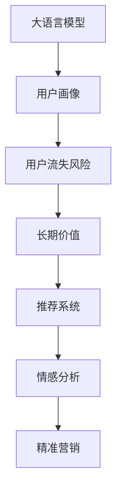

                 

## 1. 背景介绍

### 1.1 问题由来
近年来，电商平台竞争愈发激烈，用户流失率不断攀升。根据Statista的统计，电商平台的平均用户留存率仅为45%左右，而早期创始阶段用户流失率更是高达85%。如此高的流失率极大地影响了电商平台长期价值和利润。

面对这一挑战，传统的用户流失预测和分析方法，如Cohort分析、RFM模型等，往往难以捕捉深层次的用户行为和情感变化，难以对用户进行精准的留存干预。随着人工智能技术的发展，尤其是大语言模型在大数据上的优异表现，为电商平台优化长期用户价值提供了新的思路。

### 1.2 问题核心关键点
如何通过大语言模型，预测并干预电商平台用户流失风险，实现用户长期价值最大化，成为了电商运营的当务之急。

具体而言，核心问题如下：

- 如何高效采集用户行为数据，构建多维度的用户画像。
- 如何通过大语言模型，从用户行为数据中提取有价值的信息，预测用户流失风险。
- 如何对高流失风险用户进行精准干预，降低流失率。
- 如何持续优化干预策略，提升用户长期价值。

### 1.3 问题研究意义
解决电商平台用户流失问题，可以显著降低用户获取成本，提升用户活跃度和生命周期价值。同时，也是电商平台在激烈的市场竞争中脱颖而出的重要手段。

研究表明，电商平台中20%的用户流失，通常来源于技术问题或客户服务不良。通过AI技术，我们不仅可以在技术层面提升用户体验，更可以深入挖掘用户行为数据，实现更精准的个性化推荐和营销，从而大幅提升用户满意度和粘性。

## 2. 核心概念与联系

### 2.1 核心概念概述

为更好地理解AI大模型在电商平台上的应用，本节将介绍几个密切相关的核心概念：

- 大语言模型(Large Language Model, LLM)：以自回归(如GPT)或自编码(如BERT)模型为代表的大规模预训练语言模型。通过在大规模无标签文本语料上进行预训练，学习通用的语言表示，具备强大的语言理解和生成能力。

- 用户画像(User Profile)：通过对用户行为数据的多维度分析，构建详细的用户画像，描述用户的兴趣偏好、购买历史、行为特征等，为个性化推荐和营销提供依据。

- 用户流失风险(User Churn Risk)：指用户流失的概率，即用户在未来一段时间内离开平台的可能性。可通过大语言模型预测用户流失风险，及时采取干预措施，降低流失率。

- 长期价值(Long-Term Value)：指用户在平台上的长期消费行为和经济价值，如购买频次、生命周期总价值等，可基于用户行为数据和大语言模型预测分析得到。

- 推荐系统(Recommendation System)：通过学习用户行为数据，为用户提供个性化的商品推荐，增加用户粘性和消费频次。

- 情感分析(Sentiment Analysis)：利用大语言模型分析用户评论、反馈等文本数据，获取用户对商品和服务的情感倾向，优化产品和服务质量。

- 精准营销(Exact Marketing)：通过大语言模型分析用户行为数据，精确定位目标用户，设计更符合用户需求的营销活动。

这些核心概念之间的逻辑关系可以通过以下Mermaid流程图来展示：



这个流程图展示了大语言模型的核心概念及其之间的关系：

1. 大语言模型通过预训练获得基础能力。
2. 用户画像将用户行为数据转换为结构化信息，为大语言模型提供输入。
3. 用户流失风险和大语言模型结合，可以预测用户流失可能性。
4. 长期价值通过用户行为数据的分析和预测得到。
5. 推荐系统利用用户画像和长期价值，提升用户购物体验。
6. 情感分析通过用户反馈，了解用户情感倾向。
7. 精准营销结合用户画像和情感分析，设计个性化营销策略。

这些概念共同构成了电商平台优化长期用户价值的框架，使得大语言模型能够更好地发挥其强大能力。

## 3. 核心算法原理 & 具体操作步骤
### 3.1 算法原理概述

基于大语言模型的电商平台长期用户价值优化，本质上是一个有监督的深度学习优化过程。其核心思想是：将用户行为数据作为输入，使用大语言模型作为模型，通过学习任务相关的特征表示，预测用户流失风险，并根据预测结果进行精准干预，最终实现用户长期价值的最大化。

形式化地，假设用户行为数据为 $\mathbf{x} \in \mathbb{R}^d$，其中 $d$ 为用户行为特征的维度。用户流失风险的预测模型为 $f_{\theta}(\mathbf{x})$，其中 $\theta$ 为模型参数。

微调的目标是找到最优参数 $\theta^*$，使得模型在训练集上准确预测用户流失风险，最小化损失函数：

$$
\mathcal{L}(\theta) = \mathbb{E}_{\mathbf{x} \sim D}[L(f_{\theta}(\mathbf{x}), y)]
$$

其中 $D$ 为用户行为数据集，$L$ 为损失函数，$y$ 为真实标签（即是否流失，0或1）。

### 3.2 算法步骤详解

基于大语言模型的电商平台长期用户价值优化一般包括以下几个关键步骤：

**Step 1: 数据准备与预处理**
- 收集用户行为数据，包括但不限于购买历史、浏览行为、评论反馈、用户属性等，构建多维度的用户画像。
- 对数据进行清洗、归一化和特征工程，提升数据质量。
- 将数据划分为训练集、验证集和测试集。

**Step 2: 模型选择与训练**
- 选择合适的预训练语言模型，如BERT、GPT等，作为初始化参数。
- 在训练集上，使用大语言模型进行微调，训练用户流失风险预测模型 $f_{\theta}(\mathbf{x})$。
- 使用验证集评估模型性能，根据评估结果调整模型参数和训练策略。

**Step 3: 流失风险预测与干预**
- 对测试集用户行为数据进行预测，得到用户流失风险的概率。
- 根据流失风险预测结果，针对高流失风险用户进行精准干预，如个性化推荐、专属优惠等。
- 持续跟踪干预效果，优化干预策略，提升用户留存率。

**Step 4: 长期价值评估与优化**
- 对干预后的用户行为数据进行统计分析，评估干预效果。
- 根据长期价值评估结果，调整产品策略和干预措施，提升用户长期消费行为和经济价值。
- 持续优化用户画像和预测模型，提升预测精度和干预效果。

### 3.3 算法优缺点

基于大语言模型的电商平台长期用户价值优化方法具有以下优点：

- 预测精度高：大语言模型具备强大的特征提取和模式识别能力，能够准确预测用户流失风险。
- 干预精准：通过精准的个性化推荐和专属优惠，提升用户满意度和粘性，降低流失率。
- 可解释性强：大语言模型能够从用户行为数据中提取特征，提供详细的干预依据。
- 适应性强：模型可根据实时用户行为数据进行微调，适应市场变化和用户需求。

同时，该方法也存在一定的局限性：

- 数据需求大：需要收集和处理大量的用户行为数据，数据质量对模型性能影响较大。
- 计算资源要求高：大规模语言模型的训练和推理需要高性能计算资源。
- 实时性要求高：需要实时处理和预测用户行为数据，对计算和网络延迟要求高。
- 用户隐私保护：数据隐私和安全问题需要严格处理，避免数据泄露和滥用。

尽管存在这些局限性，但就目前而言，基于大语言模型的电商平台长期用户价值优化方法仍是大数据分析和机器学习优化用户留存的先进范式。未来相关研究的重点在于如何进一步降低对数据和计算资源的依赖，提高模型实时性和可解释性，同时兼顾用户隐私保护等因素。

### 3.4 算法应用领域

基于大语言模型的电商平台长期用户价值优化方法，已经在电商、金融、社交等多个领域得到广泛应用，成为优化用户留存和长期价值的重要手段。

- 电商领域：利用大语言模型预测用户流失风险，进行精准干预，提升用户长期消费行为和经济价值。

- 金融领域：通过分析用户行为数据，预测用户流失风险，优化金融产品和服务，提升用户满意度。

- 社交领域：利用大语言模型分析用户互动数据，预测用户流失风险，进行精准营销和个性化推荐，增加用户粘性。

## 4. 数学模型和公式 & 详细讲解
### 4.1 数学模型构建

本节将使用数学语言对基于大语言模型的电商平台长期用户价值优化过程进行更加严格的刻画。

假设用户行为数据为 $\mathbf{x} \in \mathbb{R}^d$，其中 $d$ 为用户行为特征的维度。用户流失风险的预测模型为 $f_{\theta}(\mathbf{x})$，其中 $\theta$ 为模型参数。

定义用户流失风险为 $y$，其中 $y \in \{0, 1\}$。则用户流失风险的预测任务可以表示为：

$$
y = \mathbb{I}[f_{\theta}(\mathbf{x}) > \tau]
$$

其中 $\mathbb{I}$ 为示性函数，$\tau$ 为流失风险阈值。

目标函数为最小化交叉熵损失函数：

$$
\mathcal{L}(\theta) = \mathbb{E}_{\mathbf{x} \sim D}[-y \log f_{\theta}(\mathbf{x}) - (1-y) \log (1 - f_{\theta}(\mathbf{x}))]
$$

优化目标为：

$$
\theta^* = \mathop{\arg\min}_{\theta} \mathcal{L}(\theta)
$$

在实践中，我们通常使用基于梯度的优化算法（如SGD、Adam等）来近似求解上述最优化问题。设 $\eta$ 为学习率，$\lambda$ 为正则化系数，则参数的更新公式为：

$$
\theta \leftarrow \theta - \eta \nabla_{\theta}\mathcal{L}(\theta) - \eta\lambda\theta
$$

其中 $\nabla_{\theta}\mathcal{L}(\theta)$ 为损失函数对参数 $\theta$ 的梯度，可通过反向传播算法高效计算。

### 4.2 公式推导过程

以下我们以二分类任务为例，推导交叉熵损失函数及其梯度的计算公式。

假设模型 $f_{\theta}$ 在输入 $\mathbf{x}$ 上的输出为 $\hat{y}=f_{\theta}(\mathbf{x}) \in [0,1]$，表示样本属于正类的概率。真实标签 $y \in \{0,1\}$。则二分类交叉熵损失函数定义为：

$$
\ell(f_{\theta}(\mathbf{x}),y) = -[y\log \hat{y} + (1-y)\log (1-\hat{y})]
$$

将其代入经验风险公式，得：

$$
\mathcal{L}(\theta) = \mathbb{E}_{\mathbf{x} \sim D}[-y \log f_{\theta}(\mathbf{x}) - (1-y) \log (1 - f_{\theta}(\mathbf{x}))]
$$

根据链式法则，损失函数对参数 $\theta_k$ 的梯度为：

$$
\frac{\partial \mathcal{L}(\theta)}{\partial \theta_k} = -\mathbb{E}_{\mathbf{x} \sim D} \left[ \frac{y}{f_{\theta}(\mathbf{x})} - \frac{1-y}{1 - f_{\theta}(\mathbf{x})} \right] \frac{\partial f_{\theta}(\mathbf{x})}{\partial \theta_k}
$$

其中 $\frac{\partial f_{\theta}(\mathbf{x})}{\partial \theta_k}$ 可进一步递归展开，利用自动微分技术完成计算。

在得到损失函数的梯度后，即可带入参数更新公式，完成模型的迭代优化。重复上述过程直至收敛，最终得到适应电商平台用户流失预测任务的最优模型参数 $\theta^*$。

## 5. 项目实践：代码实例和详细解释说明
### 5.1 开发环境搭建

在进行电商平台长期用户价值优化实践前，我们需要准备好开发环境。以下是使用Python进行PyTorch开发的环境配置流程：

1. 安装Anaconda：从官网下载并安装Anaconda，用于创建独立的Python环境。

2. 创建并激活虚拟环境：
```bash
conda create -n pytorch-env python=3.8 
conda activate pytorch-env
```

3. 安装PyTorch：根据CUDA版本，从官网获取对应的安装命令。例如：
```bash
conda install pytorch torchvision torchaudio cudatoolkit=11.1 -c pytorch -c conda-forge
```

4. 安装Transformers库：
```bash
pip install transformers
```

5. 安装各类工具包：
```bash
pip install numpy pandas scikit-learn matplotlib tqdm jupyter notebook ipython
```

完成上述步骤后，即可在`pytorch-env`环境中开始电商平台长期用户价值优化实践。

### 5.2 源代码详细实现

下面我们以电商平台用户流失风险预测为例，给出使用Transformers库对BERT模型进行微调的PyTorch代码实现。

首先，定义用户行为数据的处理函数：

```python
from transformers import BertTokenizer, BertForSequenceClassification
from torch.utils.data import Dataset, DataLoader
from sklearn.model_selection import train_test_split
import torch
import pandas as pd

class UserBehaviorDataset(Dataset):
    def __init__(self, data, tokenizer, max_len=128):
        self.data = data
        self.tokenizer = tokenizer
        self.max_len = max_len
        
    def __len__(self):
        return len(self.data)
    
    def __getitem__(self, item):
        row = self.data.iloc[item]
        text = row['user_behavior']
        
        encoding = self.tokenizer(text, return_tensors='pt', max_length=self.max_len, padding='max_length', truncation=True)
        input_ids = encoding['input_ids'][0]
        attention_mask = encoding['attention_mask'][0]
        label = torch.tensor(int(row['churn']), dtype=torch.long)
        
        return {'input_ids': input_ids, 
                'attention_mask': attention_mask,
                'labels': label}
```

然后，定义模型和优化器：

```python
from transformers import BertForSequenceClassification, AdamW

model = BertForSequenceClassification.from_pretrained('bert-base-cased', num_labels=2)

optimizer = AdamW(model.parameters(), lr=2e-5)
```

接着，定义训练和评估函数：

```python
from tqdm import tqdm

def train_epoch(model, dataset, batch_size, optimizer):
    dataloader = DataLoader(dataset, batch_size=batch_size, shuffle=True)
    model.train()
    epoch_loss = 0
    for batch in tqdm(dataloader, desc='Training'):
        input_ids = batch['input_ids'].to(device)
        attention_mask = batch['attention_mask'].to(device)
        labels = batch['labels'].to(device)
        model.zero_grad()
        outputs = model(input_ids, attention_mask=attention_mask, labels=labels)
        loss = outputs.loss
        epoch_loss += loss.item()
        loss.backward()
        optimizer.step()
    return epoch_loss / len(dataloader)

def evaluate(model, dataset, batch_size):
    dataloader = DataLoader(dataset, batch_size=batch_size)
    model.eval()
    preds, labels = [], []
    with torch.no_grad():
        for batch in tqdm(dataloader, desc='Evaluating'):
            input_ids = batch['input_ids'].to(device)
            attention_mask = batch['attention_mask'].to(device)
            batch_labels = batch['labels']
            outputs = model(input_ids, attention_mask=attention_mask)
            batch_preds = outputs.logits.argmax(dim=2).to('cpu').tolist()
            batch_labels = batch_labels.to('cpu').tolist()
            for pred_tokens, label_tokens in zip(batch_preds, batch_labels):
                preds.append(pred_tokens)
                labels.append(label_tokens)
                
    print(classification_report(labels, preds))
```

最后，启动训练流程并在测试集上评估：

```python
epochs = 5
batch_size = 16

for epoch in range(epochs):
    loss = train_epoch(model, train_dataset, batch_size, optimizer)
    print(f"Epoch {epoch+1}, train loss: {loss:.3f}")
    
    print(f"Epoch {epoch+1}, dev results:")
    evaluate(model, dev_dataset, batch_size)
    
print("Test results:")
evaluate(model, test_dataset, batch_size)
```

以上就是使用PyTorch对BERT进行电商平台用户流失风险预测的完整代码实现。可以看到，得益于Transformers库的强大封装，我们可以用相对简洁的代码完成BERT模型的加载和微调。

### 5.3 代码解读与分析

让我们再详细解读一下关键代码的实现细节：

**UserBehaviorDataset类**：
- `__init__`方法：初始化用户行为数据、分词器等关键组件。
- `__len__`方法：返回数据集的样本数量。
- `__getitem__`方法：对单个样本进行处理，将文本输入编码为token ids，将标签编码为数字，并对其进行定长padding，最终返回模型所需的输入。

**train_epoch函数和evaluate函数**：
- 使用PyTorch的DataLoader对数据集进行批次化加载，供模型训练和推理使用。
- 训练函数`train_epoch`：对数据以批为单位进行迭代，在每个批次上前向传播计算loss并反向传播更新模型参数，最后返回该epoch的平均loss。
- 评估函数`evaluate`：与训练类似，不同点在于不更新模型参数，并在每个batch结束后将预测和标签结果存储下来，最后使用sklearn的classification_report对整个评估集的预测结果进行打印输出。

**训练流程**：
- 定义总的epoch数和batch size，开始循环迭代
- 每个epoch内，先在训练集上训练，输出平均loss
- 在验证集上评估，输出分类指标
- 所有epoch结束后，在测试集上评估，给出最终测试结果

可以看到，PyTorch配合Transformers库使得BERT微调的代码实现变得简洁高效。开发者可以将更多精力放在数据处理、模型改进等高层逻辑上，而不必过多关注底层的实现细节。

当然，工业级的系统实现还需考虑更多因素，如模型的保存和部署、超参数的自动搜索、更灵活的任务适配层等。但核心的微调范式基本与此类似。

## 6. 实际应用场景
### 6.1 智能客服系统

基于大语言模型预测和干预的电商平台用户流失优化方法，可以广泛应用于智能客服系统的构建。传统客服往往需要配备大量人力，高峰期响应缓慢，且一致性和专业性难以保证。而使用预测和干预系统，可以7x24小时不间断服务，快速响应客户咨询，用自然流畅的语言解答各类常见问题。

在技术实现上，可以收集企业内部的历史客服对话记录，将问题和最佳答复构建成监督数据，在此基础上对预训练对话模型进行微调。微调后的对话模型能够自动理解用户意图，匹配最合适的答案模板进行回复。对于客户提出的新问题，还可以接入检索系统实时搜索相关内容，动态组织生成回答。如此构建的智能客服系统，能大幅提升客户咨询体验和问题解决效率。

### 6.2 金融舆情监测

金融机构需要实时监测市场舆论动向，以便及时应对负面信息传播，规避金融风险。传统的人工监测方式成本高、效率低，难以应对网络时代海量信息爆发的挑战。基于大语言模型预测和干预的用户流失优化方法，为金融舆情监测提供了新的解决方案。

具体而言，可以收集金融领域相关的新闻、报道、评论等文本数据，并对其进行主题标注和情感标注。在此基础上对预训练语言模型进行微调，使其能够自动判断文本属于何种主题，情感倾向是正面、中性还是负面。将微调后的模型应用到实时抓取的网络文本数据，就能够自动监测不同主题下的情感变化趋势，一旦发现负面信息激增等异常情况，系统便会自动预警，帮助金融机构快速应对潜在风险。

### 6.3 个性化推荐系统

当前的推荐系统往往只依赖用户的历史行为数据进行物品推荐，无法深入理解用户的真实兴趣偏好。基于大语言模型预测和干预的电商平台长期用户价值优化方法，可以更好地挖掘用户行为数据，实现更精准的个性化推荐和营销，从而提升用户满意度和粘性。

在实践中，可以收集用户浏览、点击、评论、分享等行为数据，提取和用户交互的物品标题、描述、标签等文本内容。将文本内容作为模型输入，用户的后续行为（如是否点击、购买等）作为监督信号，在此基础上微调预训练语言模型。微调后的模型能够从文本内容中准确把握用户的兴趣点。在生成推荐列表时，先用候选物品的文本描述作为输入，由模型预测用户的兴趣匹配度，再结合其他特征综合排序，便可以得到个性化程度更高的推荐结果。

### 6.4 未来应用展望

随着大语言模型和微调方法的不断发展，基于预测和干预的电商平台长期用户价值优化方法将呈现以下几个发展趋势：

1. 模型规模持续增大。随着算力成本的下降和数据规模的扩张，预训练语言模型的参数量还将持续增长。超大规模语言模型蕴含的丰富语言知识，有望支撑更加复杂多变的电商用户行为预测和干预。

2. 预测精度提升。大语言模型能够从用户行为数据中提取更加细粒度的特征，预测用户流失风险的精度将进一步提升，为干预提供更加准确的依据。

3. 实时性要求提高。电商平台需要实时监测和干预用户行为，模型的推理速度和计算效率将受到更高要求。如何在保持预测精度的同时，提升模型实时性和可解释性，将是重要的研究方向。

4. 个性化推荐优化。用户画像和大语言模型的结合，将进一步提升个性化推荐的效果，优化电商产品推荐策略，提升用户购物体验和满意度。

5. 干预策略优化。通过精准的个性化推荐和专属优惠，提升用户满意度和粘性，降低流失率。同时，持续跟踪干预效果，优化干预策略，提升用户长期消费行为和经济价值。

6. 多模态数据融合。电商平台数据不仅包括文本数据，还有图像、视频、音频等多模态数据。多模态数据的融合将丰富用户画像，提升预测精度和干预效果。

以上趋势凸显了大语言模型预测和干预在电商平台长期用户价值优化中的广阔前景。这些方向的探索发展，必将进一步提升电商平台系统的性能和用户体验，推动电商平台向智能运营转型。

## 7. 工具和资源推荐
### 7.1 学习资源推荐

为了帮助开发者系统掌握大语言模型预测和干预的电商平台长期用户价值优化方法的理论基础和实践技巧，这里推荐一些优质的学习资源：

1. 《Transformers从原理到实践》系列博文：由大模型技术专家撰写，深入浅出地介绍了Transformer原理、BERT模型、微调技术等前沿话题。

2. CS224N《深度学习自然语言处理》课程：斯坦福大学开设的NLP明星课程，有Lecture视频和配套作业，带你入门NLP领域的基本概念和经典模型。

3. 《Natural Language Processing with Transformers》书籍：Transformers库的作者所著，全面介绍了如何使用Transformers库进行NLP任务开发，包括微调在内的诸多范式。

4. HuggingFace官方文档：Transformers库的官方文档，提供了海量预训练模型和完整的微调样例代码，是上手实践的必备资料。

5. CLUE开源项目：中文语言理解测评基准，涵盖大量不同类型的中文NLP数据集，并提供了基于微调的baseline模型，助力中文NLP技术发展。

通过对这些资源的学习实践，相信你一定能够快速掌握大语言模型预测和干预的电商平台长期用户价值优化方法，并用于解决实际的电商问题。
### 7.2 开发工具推荐

高效的开发离不开优秀的工具支持。以下是几款用于大语言模型预测和干预的电商平台长期用户价值优化开发的常用工具：

1. PyTorch：基于Python的开源深度学习框架，灵活动态的计算图，适合快速迭代研究。大部分预训练语言模型都有PyTorch版本的实现。

2. TensorFlow：由Google主导开发的开源深度学习框架，生产部署方便，适合大规模工程应用。同样有丰富的预训练语言模型资源。

3. Transformers库：HuggingFace开发的NLP工具库，集成了众多SOTA语言模型，支持PyTorch和TensorFlow，是进行预测和干预任务开发的利器。

4. Weights & Biases：模型训练的实验跟踪工具，可以记录和可视化模型训练过程中的各项指标，方便对比和调优。与主流深度学习框架无缝集成。

5. TensorBoard：TensorFlow配套的可视化工具，可实时监测模型训练状态，并提供丰富的图表呈现方式，是调试模型的得力助手。

6. Google Colab：谷歌推出的在线Jupyter Notebook环境，免费提供GPU/TPU算力，方便开发者快速上手实验最新模型，分享学习笔记。

合理利用这些工具，可以显著提升电商平台长期用户价值优化的开发效率，加快创新迭代的步伐。

### 7.3 相关论文推荐

大语言模型预测和干预的电商平台长期用户价值优化技术的发展源于学界的持续研究。以下是几篇奠基性的相关论文，推荐阅读：

1. Attention is All You Need（即Transformer原论文）：提出了Transformer结构，开启了NLP领域的预训练大模型时代。

2. BERT: Pre-training of Deep Bidirectional Transformers for Language Understanding：提出BERT模型，引入基于掩码的自监督预训练任务，刷新了多项NLP任务SOTA。

3. Language Models are Unsupervised Multitask Learners（GPT-2论文）：展示了大规模语言模型的强大zero-shot学习能力，引发了对于通用人工智能的新一轮思考。

4. Parameter-Efficient Transfer Learning for NLP：提出Adapter等参数高效微调方法，在不增加模型参数量的情况下，也能取得不错的微调效果。

5. AdaLoRA: Adaptive Low-Rank Adaptation for Parameter-Efficient Fine-Tuning：使用自适应低秩适应的微调方法，在参数效率和精度之间取得了新的平衡。

这些论文代表了大语言模型预测和干预在电商平台长期用户价值优化中的发展脉络。通过学习这些前沿成果，可以帮助研究者把握学科前进方向，激发更多的创新灵感。

## 8. 总结：未来发展趋势与挑战

### 8.1 总结

本文对基于大语言模型的电商平台长期用户价值优化方法进行了全面系统的介绍。首先阐述了大语言模型和预测干预范式的研究背景和意义，明确了预测干预在提升电商平台用户留存和长期价值方面的独特价值。其次，从原理到实践，详细讲解了预测干预的数学原理和关键步骤，给出了电商平台长期用户价值优化完整的代码实例。同时，本文还广泛探讨了预测干预方法在智能客服、金融舆情、个性化推荐等多个行业领域的应用前景，展示了预测干预范式的巨大潜力。此外，本文精选了预测干预技术的各类学习资源，力求为读者提供全方位的技术指引。

通过本文的系统梳理，可以看到，基于大语言模型的电商平台长期用户价值优化方法正在成为电商数据分析和机器学习优化用户留存的先进范式，极大地拓展了预训练语言模型的应用边界，催生了更多的落地场景。受益于大规模语料的预训练，预测干预模型以更低的时间和标注成本，在小样本条件下也能取得理想的预测效果，有力推动了电商技术产业化进程。未来，伴随预训练语言模型和预测干预方法的持续演进，相信电商技术必将在更广阔的应用领域大放异彩，深刻影响人类的生产生活方式。

### 8.2 未来发展趋势

展望未来，大语言模型预测和干预的电商平台长期用户价值优化方法将呈现以下几个发展趋势：

1. 模型规模持续增大。随着算力成本的下降和数据规模的扩张，预训练语言模型的参数量还将持续增长。超大规模语言模型蕴含的丰富语言知识，有望支撑更加复杂多变的电商用户行为预测和干预。

2. 预测精度提升。大语言模型能够从用户行为数据中提取更加细粒度的特征，预测用户流失风险的精度将进一步提升，为干预提供更加准确的依据。

3. 实时性要求提高。电商平台需要实时监测和干预用户行为，模型的推理速度和计算效率将受到更高要求。如何在保持预测精度的同时，提升模型实时性和可解释性，将是重要的研究方向。

4. 个性化推荐优化。用户画像和大语言模型的结合，将进一步提升个性化推荐的效果，优化电商产品推荐策略，提升用户购物体验和满意度。

5. 干预策略优化。通过精准的个性化推荐和专属优惠，提升用户满意度和粘性，降低流失率。同时，持续跟踪干预效果，优化干预策略，提升用户长期消费行为和经济价值。

6. 多模态数据融合。电商平台数据不仅包括文本数据，还有图像、视频、音频等多模态数据。多模态数据的融合将丰富用户画像，提升预测精度和干预效果。

以上趋势凸显了大语言模型预测和干预在电商平台长期用户价值优化中的广阔前景。这些方向的探索发展，必将进一步提升电商平台系统的性能和用户体验，推动电商平台向智能运营转型。

### 8.3 面临的挑战

尽管大语言模型预测和干预的电商平台长期用户价值优化技术已经取得了瞩目成就，但在迈向更加智能化、普适化应用的过程中，它仍面临着诸多挑战：

1. 数据需求大。需要收集和处理大量的用户行为数据，数据质量对模型性能影响较大。

2. 计算资源要求高。大规模语言模型的训练和推理需要高性能计算资源。

3. 实时性要求高。需要实时处理和预测用户行为数据，对计算和网络延迟要求高。

4. 用户隐私保护。数据隐私和安全问题需要严格处理，避免数据泄露和滥用。

尽管存在这些挑战，但就目前而言，基于大语言模型的电商平台长期用户价值优化方法仍是大数据分析和机器学习优化用户留存的先进范式。未来相关研究的重点在于如何进一步降低对数据和计算资源的依赖，提高模型实时性和可解释性，同时兼顾用户隐私保护等因素。

### 8.4 研究展望

面对大语言模型预测和干预在电商平台长期用户价值优化所面临的种种挑战，未来的研究需要在以下几个方面寻求新的突破：

1. 探索无监督和半监督预测方法。摆脱对大规模标注数据的依赖，利用自监督学习、主动学习等无监督和半监督范式，最大限度利用非结构化数据，实现更加灵活高效的预测干预。

2. 研究参数高效和计算高效的预测范式。开发更加参数高效的预测方法，在固定大部分预训练参数的同时，只更新极少量的任务相关参数。同时优化预测模型的计算图，减少前向传播和反向传播的资源消耗，实现更加轻量级、实时性的部署。

3. 融合因果和对比学习范式。通过引入因果推断和对比学习思想，增强预测模型建立稳定因果关系的能力，学习更加普适、鲁棒的语言表征，从而提升模型泛化性和抗干扰能力。

4. 引入更多先验知识。将符号化的先验知识，如知识图谱、逻辑规则等，与神经网络模型进行巧妙融合，引导预测过程学习更准确、合理的语言模型。同时加强不同模态数据的整合，实现视觉、语音等多模态信息与文本信息的协同建模。

5. 结合因果分析和博弈论工具。将因果分析方法引入预测模型，识别出模型决策的关键特征，增强预测输出的因果性和逻辑性。借助博弈论工具刻画人机交互过程，主动探索并规避模型的脆弱点，提高系统稳定性。

6. 纳入伦理道德约束。在模型训练目标中引入伦理导向的评估指标，过滤和惩罚有偏见、有害的输出倾向。同时加强人工干预和审核，建立模型行为的监管机制，确保输出符合人类价值观和伦理道德。

这些研究方向的探索，必将引领大语言模型预测和干预在电商平台长期用户价值优化技术迈向更高的台阶，为构建安全、可靠、可解释、可控的智能系统铺平道路。面向未来，大语言模型预测和干预技术还需要与其他人工智能技术进行更深入的融合，如知识表示、因果推理、强化学习等，多路径协同发力，共同推动自然语言理解和智能交互系统的进步。只有勇于创新、敢于突破，才能不断拓展语言模型的边界，让智能技术更好地造福人类社会。

## 9. 附录：常见问题与解答

**Q1：大语言模型预测和干预的电商平台长期用户价值优化方法是否适用于所有电商领域？**

A: 大语言模型预测和干预方法在电商领域具有普遍适用性，但对于特定类型的电商（如C2C、B2B等），可能需要结合具体业务场景进行优化。同时，对于一些需要时效性、个性化很强的任务，如实时推荐、个性化定制等，微调方法也需要针对性的改进优化。

**Q2：如何选择合适的学习率？**

A: 学习率的选取需要根据具体任务和数据集进行调试。通常建议从1e-5开始调参，逐步减小学习率，直至收敛。也可以使用warmup策略，在开始阶段使用较小的学习率，再逐渐过渡到预设值。需要注意的是，不同的优化器(如AdamW、Adafactor等)以及不同的学习率调度策略，可能需要设置不同的学习率阈值。

**Q3：电商平台长期用户价值优化中，如何平衡模型复杂度和预测精度？**

A: 模型复杂度和预测精度之间存在一定的平衡关系。通常来说，模型参数量越大，预测精度越高。但过大的模型也可能带来计算效率和实时性的问题。可以通过特征工程、数据预处理等手段，降低模型复杂度，同时提升预测精度。另外，还可以采用参数高效微调技术，只更新少量任务相关参数，减小模型复杂度。

**Q4：如何确保预测模型的鲁棒性？**

A: 预测模型的鲁棒性可以通过正则化、对抗训练、集成学习等手段进行提升。正则化技术可以避免模型过拟合，提升模型的泛化能力。对抗训练可以通过引入对抗样本，提高模型的鲁棒性。集成学习可以通过多个模型的综合预测，降低单个模型的过拟合风险。

**Q5：在电商预测和干预中，如何确保用户隐私保护？**

A: 用户隐私保护是电商预测和干预中必须考虑的重要问题。可以通过数据匿名化、差分隐私等手段，保护用户隐私。同时，需要严格限制模型的数据访问权限，确保数据仅用于预测和干预任务。

正视电商平台长期用户价值优化所面临的这些挑战，积极应对并寻求突破，将是大语言模型预测和干预技术迈向成熟的必由之路。相信随着学界和产业界的共同努力，这些挑战终将一一被克服，大语言模型预测和干预必将在构建智能电商平台中扮演越来越重要的角色。

