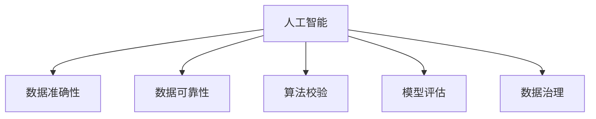

                 

# AI如何保证信息的准确性和可靠性

> 关键词：人工智能, 数据准确性, 数据可靠性, 算法校验, 模型评估, 数据治理

## 1. 背景介绍

在数字化时代，信息的准确性和可靠性已经成为企业和个人决策的基础。人工智能（AI）技术的迅猛发展，带来了前所未有的数据处理和分析能力，但也对信息的准确性和可靠性提出了更高的要求。AI如何在这方面提供保障，成为一个重要议题。

### 1.1 问题由来

AI在处理海量数据、自动化分析等方面展现出巨大优势，但也面临着数据质量参差不齐、模型偏差、算法漏洞等问题。这些问题不仅影响AI系统的性能，还可能导致严重的决策失误和信任危机。因此，如何在AI系统中确保信息的准确性和可靠性，成为了学术界和工业界关注的焦点。

### 1.2 问题核心关键点

AI系统保证信息准确性和可靠性的核心关键点包括：
- 数据质量控制：保证输入数据的准确性和完整性。
- 模型校验与评估：检测模型是否存在偏差和漏洞，评估其性能。
- 算法鲁棒性设计：增强算法对异常数据的鲁棒性和泛化能力。
- 数据治理与合规：确保数据使用符合法律法规和伦理要求。

这些问题之间相互关联，共同构建了AI系统可靠性的基石。以下将详细介绍这些关键点的技术和方法。

## 2. 核心概念与联系

### 2.1 核心概念概述

为更好地理解AI如何保证信息的准确性和可靠性，本节将介绍几个密切相关的核心概念：

- 人工智能(AI)：以机器学习和深度学习为代表的技术，模拟人类智能进行自动化分析和决策。
- 数据准确性：指数据集中存储和表达的信息与真实情况的符合程度。
- 数据可靠性：指数据的一致性、完整性和时效性，反映数据的稳定性和可信度。
- 算法校验(Algorithm Verification)：通过分析和验证算法逻辑和实现，确保算法的正确性和有效性。
- 模型评估(Model Evaluation)：通过实验和统计方法，评估AI模型在特定任务上的性能和稳定性。
- 数据治理(Data Governance)：通过数据质量控制、隐私保护、数据合规等措施，确保数据的使用安全、合规。

这些核心概念之间的逻辑关系可以通过以下Mermaid流程图来展示：



这个流程图展示了大语言模型的核心概念及其之间的关系：

1. 人工智能通过数据和算法进行学习和推理。
2. 数据准确性和可靠性是大模型学习的基础。
3. 算法校验和模型评估确保模型的正确性和有效性。
4. 数据治理保障数据使用的合规和安全。

这些概念共同构成了AI系统中信息准确性和可靠性的保障体系，使其能够稳定可靠地运行。

## 3. 核心算法原理 & 具体操作步骤

### 3.1 算法原理概述

AI系统保证信息准确性和可靠性的核心算法原理主要涉及数据校验、模型评估、鲁棒性设计和合规控制等几个方面。

#### 3.1.1 数据校验

数据校验是确保输入数据质量的重要步骤，主要包括以下几个环节：

- **数据清洗**：去除数据集中的噪声、异常值和重复记录，保证数据集的一致性和完整性。
- **数据标注**：对数据集进行有标签的标注，以便模型能够理解和利用这些信息。
- **数据规范化**：对数据进行标准化处理，如归一化、标准化、编码等，以保证数据格式的一致性。

#### 3.1.2 模型评估

模型评估旨在检测和评估AI模型在特定任务上的性能和可靠性，主要包括以下几个步骤：

- **训练集验证**：在训练集上评估模型的性能，通过交叉验证等方法确保模型的泛化能力。
- **测试集验证**：在独立于训练集的测试集上评估模型的性能，检测模型是否存在过拟合问题。
- **外部验证**：利用外部数据集或专家评审，验证模型的可靠性。

#### 3.1.3 鲁棒性设计

鲁棒性设计旨在增强模型对异常数据和噪声的抵抗能力，主要包括以下几个方面：

- **数据增强**：通过对数据进行扩充和变换，增强模型的泛化能力。
- **正则化**：通过L1、L2正则化、Dropout等技术，防止模型过拟合。
- **对抗训练**：在训练过程中加入对抗样本，增强模型的鲁棒性和泛化能力。

#### 3.1.4 合规控制

数据治理和合规控制是确保数据使用的安全性和合规性的关键步骤，主要包括以下几个环节：

- **数据隐私保护**：确保数据使用符合隐私保护法律法规，如GDPR、CCPA等。
- **数据使用合规**：确保数据使用符合行业标准和法律法规，如金融行业的KYC、AML等。
- **伦理审查**：建立伦理审查机制，确保AI系统符合伦理要求，如避免偏见和歧视。

### 3.2 算法步骤详解

以下是AI系统保证信息准确性和可靠性的详细步骤：

**Step 1: 数据预处理**

- 收集和清洗数据集，去除噪声和异常值，确保数据集的一致性和完整性。
- 对数据集进行标注和标准化处理，保证数据格式的一致性。

**Step 2: 模型训练**

- 选择合适的模型架构和算法，如CNN、RNN、Transformer等。
- 使用训练集进行模型训练，通过交叉验证等方法确保模型的泛化能力。
- 在训练过程中进行正则化和对抗训练，防止模型过拟合。

**Step 3: 模型评估**

- 在独立于训练集的测试集上评估模型的性能，检测模型是否存在过拟合问题。
- 利用外部数据集或专家评审，验证模型的可靠性和泛化能力。
- 根据模型性能和应用场景，选择最合适的评估指标，如准确率、召回率、F1分数等。

**Step 4: 数据治理**

- 建立数据治理机制，确保数据使用符合法律法规和伦理要求。
- 定期审查和更新数据使用规则，确保数据使用的合规性。
- 实施数据隐私保护措施，如匿名化、加密等，确保数据使用的安全性。

**Step 5: 系统部署**

- 将训练好的模型部署到生产环境中，进行实际应用。
- 监控系统性能，及时发现和修复潜在问题。
- 根据系统反馈和应用场景，持续优化模型和数据使用策略。

### 3.3 算法优缺点

AI系统保证信息准确性和可靠性的方法具有以下优点：

- **高泛化能力**：通过正则化和对抗训练等技术，模型对异常数据和噪声具有较强的抵抗能力。
- **自动化评估**：通过自动化的评估和校验流程，提高模型的可靠性和性能。
- **合规保障**：通过建立数据治理和合规控制机制，确保数据使用的安全性和合法性。

同时，这些方法也存在一些局限性：

- **高成本**：数据清洗、标注和标准化处理需要大量人力和资源，成本较高。
- **模型复杂性**：正则化、对抗训练等技术虽然提升了模型鲁棒性，但增加了模型复杂度，可能导致性能下降。
- **隐私风险**：数据隐私保护和合规控制需要严格的数据管理和审查机制，可能带来额外的隐私和安全风险。

尽管存在这些局限性，但通过合理设计和优化，这些方法依然是大规模AI系统保证信息准确性和可靠性的重要手段。

### 3.4 算法应用领域

AI系统保证信息准确性和可靠性的方法在多个领域得到了广泛应用，例如：

- 金融风控：通过数据校验和模型评估，确保金融交易的准确性和可靠性。
- 医疗诊断：通过数据清洗和鲁棒性设计，提高医疗诊断的准确性和可靠性。
- 智能客服：通过数据治理和合规控制，确保智能客服系统的安全性和合规性。
- 自动驾驶：通过数据校验和鲁棒性设计，提高自动驾驶系统的准确性和可靠性。

这些应用场景展示了AI系统保证信息准确性和可靠性的重要价值，推动了各行业智能化进程。

## 4. 数学模型和公式 & 详细讲解 & 举例说明

### 4.1 数学模型构建

为了更好地理解AI系统保证信息准确性和可靠性的数学原理，本节将介绍几个关键数学模型。

假设数据集为 $D=\{(x_i,y_i)\}_{i=1}^N$，其中 $x_i$ 为输入，$y_i$ 为标签。模型的输出为 $\hat{y}$，目标是最小化损失函数 $\mathcal{L}(\hat{y},y_i)$。

### 4.2 公式推导过程

以下是几个关键公式的推导过程：

**公式 1: 数据清洗**

数据清洗的目标是去除数据集中的噪声和异常值。假设原始数据集为 $D_{raw}$，经过清洗后的数据集为 $D_{clean}$，清洗规则为 $\mathcal{C}$，则清洗过程可以表示为：

$$
D_{clean} = \mathcal{C}(D_{raw})
$$

**公式 2: 数据标注**

数据标注的目标是为数据集添加标签。假设标注规则为 $\mathcal{A}$，则标注过程可以表示为：

$$
\hat{y} = \mathcal{A}(x_i)
$$

**公式 3: 数据标准化**

数据标准化的目标是对数据进行归一化、标准化等处理，以保证数据格式的一致性。假设标准化规则为 $\mathcal{N}$，则标准化过程可以表示为：

$$
x' = \mathcal{N}(x)
$$

### 4.3 案例分析与讲解

以金融风控为例，介绍AI系统保证信息准确性和可靠性的具体实现。

**Step 1: 数据预处理**

- 收集和清洗金融交易数据，去除噪声和异常值，确保数据集的一致性和完整性。
- 对数据集进行标注和标准化处理，保证数据格式的一致性。

**Step 2: 模型训练**

- 选择合适的模型架构和算法，如决策树、随机森林、深度学习等。
- 使用训练集进行模型训练，通过交叉验证等方法确保模型的泛化能力。
- 在训练过程中进行正则化和对抗训练，防止模型过拟合。

**Step 3: 模型评估**

- 在独立于训练集的测试集上评估模型的性能，检测模型是否存在过拟合问题。
- 利用外部数据集或专家评审，验证模型的可靠性和泛化能力。
- 根据模型性能和应用场景，选择最合适的评估指标，如准确率、召回率、F1分数等。

**Step 4: 数据治理**

- 建立数据治理机制，确保数据使用符合法律法规和伦理要求。
- 定期审查和更新数据使用规则，确保数据使用的合规性。
- 实施数据隐私保护措施，如匿名化、加密等，确保数据使用的安全性。

## 5. 项目实践：代码实例和详细解释说明

### 5.1 开发环境搭建

在进行AI系统保证信息准确性和可靠性的实践前，我们需要准备好开发环境。以下是使用Python进行TensorFlow开发的环境配置流程：

1. 安装Anaconda：从官网下载并安装Anaconda，用于创建独立的Python环境。

2. 创建并激活虚拟环境：
```bash
conda create -n tf-env python=3.8 
conda activate tf-env
```

3. 安装TensorFlow：根据CUDA版本，从官网获取对应的安装命令。例如：
```bash
conda install tensorflow -c pytorch -c conda-forge
```

4. 安装各类工具包：
```bash
pip install numpy pandas scikit-learn matplotlib tqdm jupyter notebook ipython
```

完成上述步骤后，即可在`tf-env`环境中开始项目实践。

### 5.2 源代码详细实现

下面我们以金融风控系统为例，给出使用TensorFlow进行模型训练和评估的PyTorch代码实现。

首先，定义模型和数据预处理函数：

```python
import tensorflow as tf
from tensorflow.keras import layers, models

class CreditRiskModel(models.Model):
    def __init__(self):
        super(CreditRiskModel, self).__init__()
        self.dnn = layers.Dense(64, activation='relu')
        self.dropout = layers.Dropout(0.5)
        self.out = layers.Dense(1, activation='sigmoid')

    def call(self, inputs):
        x = self.dnn(inputs)
        x = self.dropout(x)
        output = self.out(x)
        return output

def preprocess_data(data):
    # 数据清洗和标准化处理
    data = data.dropna()
    data['Age'] = (data['Age'] - data['Age'].mean()) / data['Age'].std()
    data['Income'] = (data['Income'] - data['Income'].mean()) / data['Income'].std()
    # 数据标注
    data['Default'] = data['Credit'].apply(lambda x: 1 if x == 'Bad' else 0)
    return data

# 加载数据
train_data = pd.read_csv('train.csv')
test_data = pd.read_csv('test.csv')

# 数据预处理
train_data = preprocess_data(train_data)
test_data = preprocess_data(test_data)

# 模型训练和评估
model = CreditRiskModel()
optimizer = tf.keras.optimizers.Adam(learning_rate=0.001)
model.compile(optimizer=optimizer, loss='binary_crossentropy', metrics=['accuracy'])
model.fit(train_data, epochs=10, validation_data=test_data)
```

然后，定义模型评估和预测函数：

```python
def evaluate_model(model, test_data):
    test_data = preprocess_data(test_data)
    loss, accuracy = model.evaluate(test_data)
    print(f"Test loss: {loss:.4f}")
    print(f"Test accuracy: {accuracy:.4f}")

def predict(model, test_data):
    test_data = preprocess_data(test_data)
    predictions = model.predict(test_data)
    return predictions
```

最后，启动模型训练和评估流程：

```python
train_data = train_data.dropna()
test_data = test_data.dropna()

# 模型训练
model = CreditRiskModel()
optimizer = tf.keras.optimizers.Adam(learning_rate=0.001)
model.compile(optimizer=optimizer, loss='binary_crossentropy', metrics=['accuracy'])
model.fit(train_data, epochs=10, validation_data=test_data)

# 模型评估
evaluate_model(model, test_data)

# 模型预测
predictions = predict(model, test_data)
```

以上就是使用TensorFlow进行金融风控系统建模和评估的完整代码实现。可以看到，TensorFlow提供了方便的API和工具，使得模型构建和评估过程变得简洁高效。

### 5.3 代码解读与分析

让我们再详细解读一下关键代码的实现细节：

**CreditRiskModel类**：
- `__init__`方法：定义模型结构，包括一个DNN层、一个Dropout层和一个输出层。
- `call`方法：定义模型前向传播过程，先经过DNN层和Dropout层，再进行线性输出。

**preprocess_data函数**：
- 数据清洗：去除缺失值，并对年龄和收入进行标准化处理。
- 数据标注：将信用等级标签转换为0/1。

**model.compile方法**：
- 定义模型优化器和损失函数，设置评估指标。
- 使用`compile`方法将模型进行编译，准备进行训练。

**model.fit方法**：
- 使用训练集进行模型训练，设置训练轮数和验证集。
- 在每个epoch结束后，评估模型在测试集上的性能。

**evaluate_model函数**：
- 在测试集上评估模型性能，输出损失和准确率。

**predict函数**：
- 对测试集进行标准化处理，使用模型进行预测。
- 返回预测结果。

**训练流程**：
- 定义训练集和测试集，进行预处理。
- 定义模型、优化器和损失函数，并进行编译。
- 使用`fit`方法进行模型训练，每epoch在测试集上评估一次性能。
- 使用`evaluate_model`函数进行模型评估，输出最终结果。
- 使用`predict`函数对测试集进行预测，得到结果。

可以看到，TensorFlow提供了完整的API和工具，使得模型构建和评估过程变得简洁高效。开发者可以将更多精力放在模型改进和优化上，而不必过多关注底层实现细节。

当然，工业级的系统实现还需考虑更多因素，如模型的保存和部署、超参数的自动搜索、更灵活的任务适配层等。但核心的训练和评估流程基本与此类似。

## 6. 实际应用场景

### 6.1 智能客服系统

基于AI系统保证信息准确性和可靠性的对话技术，可以广泛应用于智能客服系统的构建。传统客服往往需要配备大量人力，高峰期响应缓慢，且一致性和专业性难以保证。而使用AI系统保证信息准确性和可靠性的对话模型，可以7x24小时不间断服务，快速响应客户咨询，用自然流畅的语言解答各类常见问题。

在技术实现上，可以收集企业内部的历史客服对话记录，将问题和最佳答复构建成监督数据，在此基础上对预训练对话模型进行微调。微调后的对话模型能够自动理解用户意图，匹配最合适的答案模板进行回复。对于客户提出的新问题，还可以接入检索系统实时搜索相关内容，动态组织生成回答。如此构建的智能客服系统，能大幅提升客户咨询体验和问题解决效率。

### 6.2 金融舆情监测

金融机构需要实时监测市场舆论动向，以便及时应对负面信息传播，规避金融风险。传统的人工监测方式成本高、效率低，难以应对网络时代海量信息爆发的挑战。基于AI系统保证信息准确性和可靠性的文本分类和情感分析技术，为金融舆情监测提供了新的解决方案。

具体而言，可以收集金融领域相关的新闻、报道、评论等文本数据，并对其进行主题标注和情感标注。在此基础上对预训练语言模型进行微调，使其能够自动判断文本属于何种主题，情感倾向是正面、中性还是负面。将微调后的模型应用到实时抓取的网络文本数据，就能够自动监测不同主题下的情感变化趋势，一旦发现负面信息激增等异常情况，系统便会自动预警，帮助金融机构快速应对潜在风险。

### 6.3 个性化推荐系统

当前的推荐系统往往只依赖用户的历史行为数据进行物品推荐，无法深入理解用户的真实兴趣偏好。基于AI系统保证信息准确性和可靠性的个性化推荐系统，可以更好地挖掘用户行为背后的语义信息，从而提供更精准、多样的推荐内容。

在实践中，可以收集用户浏览、点击、评论、分享等行为数据，提取和用户交互的物品标题、描述、标签等文本内容。将文本内容作为模型输入，用户的后续行为（如是否点击、购买等）作为监督信号，在此基础上微调预训练语言模型。微调后的模型能够从文本内容中准确把握用户的兴趣点。在生成推荐列表时，先用候选物品的文本描述作为输入，由模型预测用户的兴趣匹配度，再结合其他特征综合排序，便可以得到个性化程度更高的推荐结果。

### 6.4 未来应用展望

随着AI系统保证信息准确性和可靠性的不断发展，基于这些技术的应用场景将不断扩展，为各行各业带来变革性影响。

在智慧医疗领域，基于AI系统保证信息准确性和可靠性的医疗问答、病历分析、药物研发等应用将提升医疗服务的智能化水平，辅助医生诊疗，加速新药开发进程。

在智能教育领域，基于AI系统保证信息准确性和可靠性的作业批改、学情分析、知识推荐等方面，因材施教，促进教育公平，提高教学质量。

在智慧城市治理中，基于AI系统保证信息准确性和可靠性的城市事件监测、舆情分析、应急指挥等环节，提高城市管理的自动化和智能化水平，构建更安全、高效的未来城市。

此外，在企业生产、社会治理、文娱传媒等众多领域，基于AI系统保证信息准确性和可靠性的应用也将不断涌现，为经济社会发展注入新的动力。相信随着技术的日益成熟，这些技术将成为人工智能落地应用的重要范式，推动人工智能技术在更广阔的应用领域大放异彩。

## 7. 工具和资源推荐

### 7.1 学习资源推荐

为了帮助开发者系统掌握AI系统保证信息准确性和可靠性的理论基础和实践技巧，这里推荐一些优质的学习资源：

1. 《深度学习》系列书籍：Ian Goodfellow、Yoshua Bengio、Aaron Courville合著，详细介绍了深度学习的原理、算法和应用。

2. CS231n《计算机视觉基础》课程：斯坦福大学开设的计算机视觉经典课程，涵盖了计算机视觉的各个领域，从基础到前沿。

3. Coursera《机器学习》课程：由Andrew Ng教授主讲，全面介绍了机器学习的基本概念和算法，适合初学者入门。

4. 《Python数据科学手册》书籍：Jake VanderPlas著，详细介绍了Python在数据科学和机器学习中的应用，包括TensorFlow、Pandas、NumPy等工具的使用。

5. Kaggle平台：数据科学和机器学习竞赛平台，提供大量公开数据集和挑战，适合实践和交流。

通过对这些资源的学习实践，相信你一定能够快速掌握AI系统保证信息准确性和可靠性的精髓，并用于解决实际的NLP问题。

### 7.2 开发工具推荐

高效的开发离不开优秀的工具支持。以下是几款用于AI系统保证信息准确性和可靠性的开发工具：

1. TensorFlow：由Google主导开发的开源深度学习框架，生产部署方便，适合大规模工程应用。

2. PyTorch：基于Python的开源深度学习框架，灵活高效，适合快速迭代研究。

3. Scikit-learn：Python机器学习库，提供丰富的模型和算法实现，适合简单机器学习任务的开发。

4. Weights & Biases：模型训练的实验跟踪工具，可以记录和可视化模型训练过程中的各项指标，方便对比和调优。

5. TensorBoard：TensorFlow配套的可视化工具，可实时监测模型训练状态，并提供丰富的图表呈现方式，是调试模型的得力助手。

6. Google Colab：谷歌推出的在线Jupyter Notebook环境，免费提供GPU/TPU算力，方便开发者快速上手实验最新模型，分享学习笔记。

合理利用这些工具，可以显著提升AI系统保证信息准确性和可靠性的开发效率，加快创新迭代的步伐。

### 7.3 相关论文推荐

AI系统保证信息准确性和可靠性的发展源于学界的持续研究。以下是几篇奠基性的相关论文，推荐阅读：

1. Dropout: A Simple Way to Prevent Neural Networks from Overfitting: Hinton等人于2012年提出的Dropout方法，能有效防止神经网络过拟合。

2. Regularization and Optimization of Stochastic Gradient Descent: Bottou在1998年提出的正则化技术，能有效提升神经网络的泛化能力。

3. Adversarial Training Methods for Semi-supervised Text Classification: Mikolov等人于2014年提出的对抗训练方法，能有效提升模型对异常数据的鲁棒性。

4. Deep Learning for Credit Scoring: Bennis等人于2018年提出的信用评分模型，利用深度学习技术提升信用评分准确性。

5. A Survey on Data Governance in Smart City: Zeng等人于2021年综述了智能城市中的数据治理问题，探讨了数据治理的重要性。

这些论文代表了大语言模型微调技术的发展脉络。通过学习这些前沿成果，可以帮助研究者把握学科前进方向，激发更多的创新灵感。

## 8. 总结：未来发展趋势与挑战

### 8.1 总结

本文对AI系统保证信息准确性和可靠性的方法进行了全面系统的介绍。首先阐述了AI系统保证信息准确性和可靠性的研究背景和意义，明确了信息准确性和可靠性的重要性。其次，从原理到实践，详细讲解了数据校验、模型评估、鲁棒性设计和合规控制等核心技术和步骤，给出了AI系统保证信息准确性和可靠性的完整代码实例。同时，本文还广泛探讨了AI系统保证信息准确性和可靠性的应用场景，展示了其在金融风控、智能客服、医疗诊断等多个领域的重要价值。此外，本文精选了保证信息准确性和可靠性的各类学习资源、开发工具和相关论文，力求为读者提供全方位的技术指引。

通过本文的系统梳理，可以看到，AI系统保证信息准确性和可靠性的方法在各领域得到了广泛应用，显著提升了AI系统的性能和应用范围。未来，伴随AI技术的不断进步，保证信息准确性和可靠性的方法也将不断演进，推动AI系统向更高层次发展。

### 8.2 未来发展趋势

展望未来，AI系统保证信息准确性和可靠性的技术将呈现以下几个发展趋势：

1. **AI与大数据的融合**：利用大数据技术提升AI系统的训练效果，如联邦学习、联邦数据利用等，减少数据隐私和安全风险。
2. **多模态信息的整合**：结合视觉、语音、文本等多种数据，增强AI系统的感知能力和决策精度。
3. **自监督学习的应用**：利用无监督学习技术，提升AI系统对异常数据的鲁棒性和泛化能力。
4. **模型解释性的增强**：通过模型可解释性技术，提升AI系统的透明度和可信度。
5. **跨领域知识的应用**：结合领域知识，提升AI系统在不同场景下的适应性和可靠性。

这些趋势展示了AI系统保证信息准确性和可靠性的广阔前景，推动了AI技术在更多领域的应用和创新。

### 8.3 面临的挑战

尽管AI系统保证信息准确性和可靠性的技术已经取得了显著进展，但在实际应用中，仍面临诸多挑战：

1. **数据隐私与安全**：在数据收集和处理过程中，如何保护用户隐私和安全，避免数据泄露和滥用。
2. **模型偏见与公平性**：AI系统可能存在偏见和歧视，如何确保模型在各个群体间的公平性和公正性。
3. **算法复杂性与效率**：大规模模型的训练和推理过程复杂，如何提高算法的效率和可解释性。
4. **跨领域知识融合**：不同领域知识的融合和应用，如医学、法律等，如何构建通用的知识表示方法。
5. **伦理与社会影响**：AI系统可能对社会产生深远影响，如何确保其符合伦理和道德要求。

这些挑战需要在未来的研究和实践中逐步克服，推动AI系统保证信息准确性和可靠性的发展。

### 8.4 研究展望

面对AI系统保证信息准确性和可靠性的挑战，未来的研究需要在以下几个方面寻求新的突破：

1. **隐私保护与数据治理**：开发更加安全和透明的隐私保护技术，建立规范的数据治理机制。
2. **模型偏见与公平性**：研究和应用消除偏见和歧视的方法，确保模型在各个群体间的公平性和公正性。
3. **算法效率与可解释性**：提升算法的效率和可解释性，降低模型复杂度，提高模型的透明度和可信度。
4. **跨领域知识融合**：结合领域知识，构建通用的知识表示方法，提升AI系统的跨领域适应性和可靠性。
5. **伦理与社会影响**：研究AI系统的伦理和社会影响，建立AI系统的监管机制和伦理规范。

这些研究方向将引领AI系统保证信息准确性和可靠性的技术进步，推动AI技术在更广泛的应用领域发挥作用，带来更深远的社会影响。

## 9. 附录：常见问题与解答

**Q1：如何确保数据隐私和安全？**

A: 数据隐私和安全是AI系统保证信息准确性和可靠性的重要前提。以下是一些常见的方法：

- 数据加密：对数据进行加密处理，防止数据泄露和非法访问。
- 数据匿名化：对数据进行匿名化处理，保护用户隐私。
- 访问控制：建立严格的访问控制机制，确保只有授权人员才能访问数据。
- 审计与监控：定期审计和监控数据使用情况，发现并处理潜在风险。

这些方法可以结合使用，构建多层次的数据隐私和安全保护体系。

**Q2：如何消除模型的偏见和歧视？**

A: 模型的偏见和歧视是AI系统保证信息准确性和可靠性的重要挑战。以下是一些常见的方法：

- 数据多样性：确保数据集包含多样化的样本，避免数据偏见。
- 特征选择：选择有代表性的特征进行建模，避免特征偏见。
- 算法公平性：使用公平性算法，检测和消除模型偏见。
- 数据治理：建立数据治理机制，确保数据使用符合法律法规和伦理要求。

这些方法可以结合使用，构建公平和公正的AI系统。

**Q3：如何提高算法的效率和可解释性？**

A: 算法的效率和可解释性是AI系统保证信息准确性和可靠性的重要目标。以下是一些常见的方法：

- 模型压缩：通过剪枝、量化等技术，减小模型规模，提高推理速度。
- 模型优化：使用模型优化技术，提升算法的效率和精度。
- 模型解释性：利用可解释性技术，提升算法的透明度和可信度。
- 模型融合：结合多种模型，构建更优的AI系统。

这些方法可以结合使用，构建高效和可解释的AI系统。

**Q4：如何结合跨领域知识，提升AI系统的适应性和可靠性？**

A: 跨领域知识的结合是AI系统保证信息准确性和可靠性的重要途径。以下是一些常见的方法：

- 领域知识图谱：建立领域知识图谱，将知识结构化，便于模型应用。
- 知识表示方法：研究和应用知识表示方法，提升AI系统的跨领域适应性。
- 领域专家合作：与领域专家合作，将专业知识融入AI系统。
- 多模态信息融合：结合视觉、语音、文本等多种数据，增强AI系统的感知能力和决策精度。

这些方法可以结合使用，构建跨领域的AI系统。

**Q5：如何确保AI系统的伦理和社会影响？**

A: 确保AI系统的伦理和社会影响是AI系统保证信息准确性和可靠性的重要目标。以下是一些常见的方法：

- 伦理审查：建立伦理审查机制，确保AI系统符合伦理要求。
- 社会影响评估：研究AI系统的社会影响，评估其对社会的影响。
- 公众参与：与公众和利益相关者合作，确保AI系统的透明度和可信度。
- 法规合规：确保AI系统符合法律法规，避免法律风险。

这些方法可以结合使用，构建符合伦理和社会要求的AI系统。

---

作者：禅与计算机程序设计艺术 / Zen and the Art of Computer Programming

