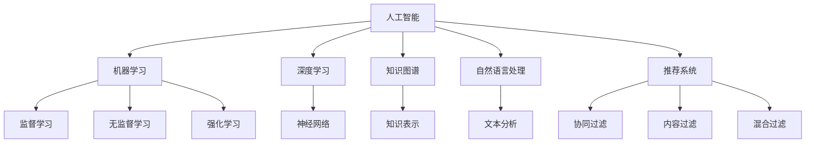

                 

# AI如何助力人类知识增长

## 1. 背景介绍

### 1.1 问题由来
随着科技的进步和人类知识的积累，信息爆炸的时代已经到来。传统知识获取方式，如书籍、文档、视频等，已无法满足人们对知识的日益增长的需求。尤其在新兴的领域如人工智能、量子物理、深海探险等，传统方式获取相关知识变得尤为困难。

在信息爆炸的当下，如何高效、精准、全面地获取、组织和利用知识，成为了一个亟待解决的问题。AI技术的兴起，为人类知识的获取、处理和应用带来了全新的方式和思路，显著提升人类知识的增长速度和广度。

### 1.2 问题核心关键点
AI通过模拟和扩展人类智能，可以实现自动化的数据收集、处理和分析，以及高度个性化的知识推荐，大幅提升人类获取和应用知识的能力。AI助力人类知识增长的关键点包括：

1. **自动数据收集与处理**：AI可以通过网络爬虫、自然语言处理等技术，自动收集海量数据，并通过算法分析数据，提取出有用信息。

2. **高效知识组织**：AI可以运用机器学习和深度学习技术，对知识进行高效组织和结构化，建立知识图谱，方便检索和利用。

3. **个性化知识推荐**：AI可以根据用户的行为和偏好，推荐个性化的知识内容，促进深度学习和知识积累。

4. **知识交互与协同**：AI可以通过聊天机器人、智能助手等方式，进行人机交互，解答用户疑问，促进知识的传播和分享。

5. **持续学习和进化**：AI可以不断学习新知识，并结合先验知识进行自我优化和进化，适应不断变化的知识需求。

## 2. 核心概念与联系

### 2.1 核心概念概述

为更好地理解AI助力人类知识增长的方法，本节将介绍几个密切相关的核心概念：

- **人工智能（Artificial Intelligence, AI）**：指通过机器模拟和扩展人类智能的技术，涵盖了感知、学习、推理、决策等众多方面。
- **机器学习（Machine Learning, ML）**：指通过算法让机器从数据中学习和总结规律，包括监督学习、无监督学习、强化学习等。
- **深度学习（Deep Learning, DL）**：指一种特殊的机器学习，使用神经网络对大规模数据进行学习和预测，具有较强的特征提取和泛化能力。
- **知识图谱（Knowledge Graph,KG）**：一种结构化的知识表示方法，通过实体和关系描述知识网络，方便知识检索和应用。
- **自然语言处理（Natural Language Processing, NLP）**：指让计算机理解和处理自然语言的技术，包括语言理解、文本生成、情感分析等。
- **推荐系统（Recommendation System）**：指通过算法为用户推荐个性化的信息或商品的技术，包括基于协同过滤、内容过滤、混合过滤等。

这些核心概念之间的逻辑关系可以通过以下Mermaid流程图来展示：



这个流程图展示了几大核心概念及其之间的联系：

1. 人工智能通过机器学习和深度学习技术进行学习和推理。
2. 深度学习使用神经网络进行特征提取和预测。
3. 知识图谱用于结构化表示知识。
4. 自然语言处理让机器理解文本。
5. 推荐系统为用户推荐个性化信息。

这些核心概念共同构成了AI助力知识增长的基础框架，使得AI能够在各个领域发挥强大的作用。

## 3. 核心算法原理 & 具体操作步骤
### 3.1 算法原理概述

AI助力人类知识增长的主要原理是利用先进的数据处理、知识组织和推荐算法，通过自动化和智能化的方式，高效地获取、处理和应用知识。

形式化地，假设我们有大量未标注的数据 $\mathcal{D}$，以及一个知识图谱 $\mathcal{K}$。目标是利用这些数据和图谱，建立知识模型 $M$，用于预测新的知识实例 $x$ 对应的知识标签 $y$。知识模型 $M$ 可以通过监督学习、无监督学习或强化学习等方法训练得到。

具体而言，监督学习方法要求准备一定量的标注数据 $D$，通过最小化损失函数 $\mathcal{L}(M,\mathcal{D})$，学习知识模型 $M$。

数学上，可以定义知识图谱 $\mathcal{K}$ 和数据 $\mathcal{D}$ 之间的映射关系 $M: \mathcal{K} \times \mathcal{D} \rightarrow \mathbb{R}^n$，其中 $n$ 为模型输出的维度。模型 $M$ 通过最小化损失函数 $\mathcal{L}(M,\mathcal{D})$ 来学习最优参数 $\theta$。

$$
\theta^* = \mathop{\arg\min}_{\theta} \mathcal{L}(M_\theta, \mathcal{D})
$$

优化算法（如梯度下降、Adam等）用来更新参数 $\theta$，使得模型输出逼近真实标签 $y$。通过迭代优化，知识模型 $M$ 不断提升其预测准确度，实现对知识的自动获取和应用。

### 3.2 算法步骤详解

AI助力人类知识增长的算法步骤主要包括以下几个关键环节：

**Step 1: 数据收集与预处理**
- 收集海量的数据源，包括文本、图像、视频等。
- 对数据进行清洗、去重、分词、分句等预处理操作，保证数据质量。
- 根据领域需求，提取关键特征，如关键词、实体、关系等。

**Step 2: 知识图谱构建**
- 将预处理后的数据构建成知识图谱 $\mathcal{K}$，描述实体和实体之间的关系。
- 应用基于规则或机器学习的方法，自动填充图谱中的缺失信息。
- 对图谱进行优化，去除冗余和噪声，保证其完备性和准确性。

**Step 3: 模型训练与优化**
- 选择合适的机器学习或深度学习模型，如神经网络、CNN、RNN、Transformer等。
- 定义损失函数 $\mathcal{L}$，用于度量模型输出与真实标签的差异。
- 使用优化算法（如Adam、SGD等）最小化损失函数，训练知识模型 $M$。
- 应用正则化技术，如L2正则、Dropout等，防止过拟合。
- 定期评估模型性能，应用Early Stopping等策略，避免过拟合。

**Step 4: 知识推理与交互**
- 应用推理算法（如逻辑推理、图推理等），从知识图谱中挖掘新知识。
- 通过自然语言处理技术，实现人机交互，解答用户疑问。
- 集成推荐算法，为用户推荐个性化的知识内容。

**Step 5: 持续学习与进化**
- 利用新数据和新任务，不断训练和更新知识模型 $M$。
- 应用迁移学习技术，将已有知识迁移到新任务中，提升模型泛化能力。
- 应用对抗学习技术，提高模型的鲁棒性和泛化性。

### 3.3 算法优缺点

AI助力人类知识增长的算法具有以下优点：
1. 高效自动化。自动化的数据处理、知识推理和推荐，大幅度提升知识获取和应用的速度。
2. 精准结构化。知识图谱的构建，使得知识更加结构化和可查询。
3. 高度个性化。推荐系统可以根据用户行为，提供高度个性化的知识推荐。
4. 持续进化。模型可以不断学习和优化，适应新的知识和需求。

同时，该算法也存在以下局限性：
1. 数据质量依赖。算法效果很大程度上取决于数据的质量和数量，获取高质量数据的成本较高。
2. 泛化能力有限。当知识图谱与现实世界的分布差异较大时，模型的泛化能力有限。
3. 可解释性不足。复杂模型难以解释其内部工作机制，缺乏可解释性。
4. 安全性风险。知识模型可能学习到有害信息，存在安全隐患。

尽管存在这些局限性，但就目前而言，基于AI的知识增长方法仍是最主流范式。未来相关研究的重点在于如何进一步降低对高质量数据的依赖，提高模型的泛化能力，同时兼顾可解释性和安全性等因素。

### 3.4 算法应用领域

AI助力人类知识增长的算法已经在众多领域得到了广泛应用，例如：

- 智能搜索：如谷歌搜索引擎，通过自然语言处理技术，实现高效搜索和答案推荐。
- 知识图谱构建：如Wikipedia和DBpedia，通过实体和关系抽取，构建大规模知识图谱。
- 个性化推荐：如Netflix和Amazon，通过协同过滤和内容过滤算法，实现高度个性化的推荐服务。
- 智能问答系统：如IBM Watson，通过知识图谱和推理技术，解答用户疑问。
- 医学知识库：如PubMed，通过知识图谱和深度学习，实现医学信息的自动摘要和推荐。
- 金融知识服务：如金融数据平台，通过数据挖掘和机器学习，实现金融知识的自动化获取和应用。

除了上述这些经典应用外，AI助力知识增长的方法还在更多场景中得到创新性应用，如智慧城市、工业生产、教育培训等，为各个领域带来新的变革和机遇。

## 4. 数学模型和公式 & 详细讲解 & 举例说明
### 4.1 数学模型构建

本节将使用数学语言对AI助力知识增长的核心算法进行更加严格的刻画。

记知识模型为 $M_{\theta}$，其中 $\theta$ 为模型参数。假设知识图谱为 $\mathcal{K}=(E,R)$，其中 $E$ 为实体集合，$R$ 为关系集合。数据集为 $D=\{(x_i,y_i)\}_{i=1}^N, x_i \in \mathcal{D}, y_i \in \{0,1\}$。

定义知识模型 $M_{\theta}$ 在数据样本 $(x,y)$ 上的损失函数为 $\ell(M_{\theta}(x),y)$，则在数据集 $D$ 上的经验风险为：

$$
\mathcal{L}(\theta) = \frac{1}{N} \sum_{i=1}^N \ell(M_{\theta}(x_i),y_i)
$$

其中 $\ell$ 为模型输出与真实标签之间的差异度量。

知识模型 $M_{\theta}$ 通过最小化经验风险 $\mathcal{L}(\theta)$，学习最优参数 $\theta^*$。

### 4.2 公式推导过程

以下我们以知识图谱的实体关系预测任务为例，推导监督学习中常用的交叉熵损失函数及其梯度的计算公式。

假设模型 $M_{\theta}$ 在输入 $x$ 上的输出为 $\hat{y}=M_{\theta}(x) \in [0,1]$，表示样本属于正类的概率。真实标签 $y \in \{0,1\}$。则二分类交叉熵损失函数定义为：

$$
\ell(M_{\theta}(x),y) = -[y\log \hat{y} + (1-y)\log (1-\hat{y})]
$$

将其代入经验风险公式，得：

$$
\mathcal{L}(\theta) = -\frac{1}{N}\sum_{i=1}^N [y_i\log M_{\theta}(x_i)+(1-y_i)\log(1-M_{\theta}(x_i))]
$$

根据链式法则，损失函数对参数 $\theta_k$ 的梯度为：

$$
\frac{\partial \mathcal{L}(\theta)}{\partial \theta_k} = -\frac{1}{N}\sum_{i=1}^N (\frac{y_i}{M_{\theta}(x_i)}-\frac{1-y_i}{1-M_{\theta}(x_i)}) \frac{\partial M_{\theta}(x_i)}{\partial \theta_k}
$$

其中 $\frac{\partial M_{\theta}(x_i)}{\partial \theta_k}$ 可进一步递归展开，利用自动微分技术完成计算。

在得到损失函数的梯度后，即可带入参数更新公式，完成模型的迭代优化。重复上述过程直至收敛，最终得到适应知识图谱任务的最优模型参数 $\theta^*$。

### 4.3 案例分析与讲解

**案例：智能问答系统**
智能问答系统通过知识图谱和推理技术，实现对用户自然语言问题的自动理解和解答。具体实现流程如下：

1. **用户提问**：用户输入自然语言问题。
2. **实体识别**：通过自然语言处理技术，识别出问题中的实体，如人名、地名等。
3. **图谱查询**：在知识图谱中查找与实体相关的信息，如实体之间的关系、属性等。
4. **推理生成**：根据推理算法，从图谱中挖掘出与问题相关的信息，生成最终答案。
5. **自然语言生成**：将推理结果转化为自然语言，输出给用户。

以IBM Watson为例，Watson使用深度学习模型和知识图谱，自动解析用户问题，通过逻辑推理和计算，生成最终答案。Watson的底层框架NLU和NLG分别用于自然语言理解和自然语言生成，从而实现高效的知识获取和应用。

## 5. 项目实践：代码实例和详细解释说明
### 5.1 开发环境搭建

在进行知识增长系统的开发前，我们需要准备好开发环境。以下是使用Python进行PyTorch开发的环境配置流程：

1. 安装Anaconda：从官网下载并安装Anaconda，用于创建独立的Python环境。

2. 创建并激活虚拟环境：
```bash
conda create -n pytorch-env python=3.8 
conda activate pytorch-env
```

3. 安装PyTorch：根据CUDA版本，从官网获取对应的安装命令。例如：
```bash
conda install pytorch torchvision torchaudio cudatoolkit=11.1 -c pytorch -c conda-forge
```

4. 安装各类工具包：
```bash
pip install numpy pandas scikit-learn matplotlib tqdm jupyter notebook ipython
```

完成上述步骤后，即可在`pytorch-env`环境中开始开发实践。

### 5.2 源代码详细实现

下面我以知识图谱构建为例，给出使用Transformers库对BERT模型进行知识图谱构建的PyTorch代码实现。

首先，定义知识图谱的数据处理函数：

```python
from transformers import BertTokenizer
from torch.utils.data import Dataset
import torch

class KnowledgeGraphDataset(Dataset):
    def __init__(self, texts, relations, entities, tokenizer, max_len=128):
        self.texts = texts
        self.relations = relations
        self.entities = entities
        self.tokenizer = tokenizer
        self.max_len = max_len
        
    def __len__(self):
        return len(self.texts)
    
    def __getitem__(self, item):
        text = self.texts[item]
        relation = self.relations[item]
        entity = self.entities[item]
        
        encoding = self.tokenizer(text, return_tensors='pt', max_length=self.max_len, padding='max_length', truncation=True)
        input_ids = encoding['input_ids'][0]
        attention_mask = encoding['attention_mask'][0]
        
        # 对token-wise的标签进行编码
        encoded_tags = [tag2id[tag] for tag in entity] 
        encoded_tags.extend([tag2id['O']] * (self.max_len - len(encoded_tags)))
        labels = torch.tensor(encoded_tags, dtype=torch.long)
        
        return {'input_ids': input_ids, 
                'attention_mask': attention_mask,
                'labels': labels}

# 标签与id的映射
tag2id = {'O': 0, 'B': 1, 'I': 2}
id2tag = {v: k for k, v in tag2id.items()}

# 创建dataset
tokenizer = BertTokenizer.from_pretrained('bert-base-cased')

train_dataset = KnowledgeGraphDataset(train_texts, train_relations, train_entities, tokenizer)
dev_dataset = KnowledgeGraphDataset(dev_texts, dev_relations, dev_entities, tokenizer)
test_dataset = KnowledgeGraphDataset(test_texts, test_relations, test_entities, tokenizer)
```

然后，定义模型和优化器：

```python
from transformers import BertForTokenClassification, AdamW

model = BertForTokenClassification.from_pretrained('bert-base-cased', num_labels=len(tag2id))

optimizer = AdamW(model.parameters(), lr=2e-5)
```

接着，定义训练和评估函数：

```python
from torch.utils.data import DataLoader
from tqdm import tqdm
from sklearn.metrics import classification_report

device = torch.device('cuda') if torch.cuda.is_available() else torch.device('cpu')
model.to(device)

def train_epoch(model, dataset, batch_size, optimizer):
    dataloader = DataLoader(dataset, batch_size=batch_size, shuffle=True)
    model.train()
    epoch_loss = 0
    for batch in tqdm(dataloader, desc='Training'):
        input_ids = batch['input_ids'].to(device)
        attention_mask = batch['attention_mask'].to(device)
        labels = batch['labels'].to(device)
        model.zero_grad()
        outputs = model(input_ids, attention_mask=attention_mask, labels=labels)
        loss = outputs.loss
        epoch_loss += loss.item()
        loss.backward()
        optimizer.step()
    return epoch_loss / len(dataloader)

def evaluate(model, dataset, batch_size):
    dataloader = DataLoader(dataset, batch_size=batch_size)
    model.eval()
    preds, labels = [], []
    with torch.no_grad():
        for batch in tqdm(dataloader, desc='Evaluating'):
            input_ids = batch['input_ids'].to(device)
            attention_mask = batch['attention_mask'].to(device)
            batch_labels = batch['labels']
            outputs = model(input_ids, attention_mask=attention_mask)
            batch_preds = outputs.logits.argmax(dim=2).to('cpu').tolist()
            batch_labels = batch_labels.to('cpu').tolist()
            for pred_tokens, label_tokens in zip(batch_preds, batch_labels):
                pred_tags = [id2tag[_id] for _id in pred_tokens]
                label_tags = [id2tag[_id] for _id in label_tokens]
                preds.append(pred_tags[:len(label_tags)])
                labels.append(label_tags)
                
    print(classification_report(labels, preds))
```

最后，启动训练流程并在测试集上评估：

```python
epochs = 5
batch_size = 16

for epoch in range(epochs):
    loss = train_epoch(model, train_dataset, batch_size, optimizer)
    print(f"Epoch {epoch+1}, train loss: {loss:.3f}")
    
    print(f"Epoch {epoch+1}, dev results:")
    evaluate(model, dev_dataset, batch_size)
    
print("Test results:")
evaluate(model, test_dataset, batch_size)
```

以上就是使用PyTorch对BERT进行知识图谱构建的完整代码实现。可以看到，得益于Transformers库的强大封装，我们可以用相对简洁的代码完成BERT模型的加载和构建。

### 5.3 代码解读与分析

让我们再详细解读一下关键代码的实现细节：

**KnowledgeGraphDataset类**：
- `__init__`方法：初始化文本、关系、实体等关键组件。
- `__len__`方法：返回数据集的样本数量。
- `__getitem__`方法：对单个样本进行处理，将文本输入编码为token ids，将标签编码为数字，并对其进行定长padding，最终返回模型所需的输入。

**tag2id和id2tag字典**：
- 定义了标签与数字id之间的映射关系，用于将token-wise的预测结果解码回真实的标签。

**训练和评估函数**：
- 使用PyTorch的DataLoader对数据集进行批次化加载，供模型训练和推理使用。
- 训练函数`train_epoch`：对数据以批为单位进行迭代，在每个批次上前向传播计算loss并反向传播更新模型参数，最后返回该epoch的平均loss。
- 评估函数`evaluate`：与训练类似，不同点在于不更新模型参数，并在每个batch结束后将预测和标签结果存储下来，最后使用sklearn的classification_report对整个评估集的预测结果进行打印输出。

**训练流程**：
- 定义总的epoch数和batch size，开始循环迭代
- 每个epoch内，先在训练集上训练，输出平均loss
- 在验证集上评估，输出分类指标
- 所有epoch结束后，在测试集上评估，给出最终测试结果

可以看到，PyTorch配合Transformers库使得BERT构建知识图谱的代码实现变得简洁高效。开发者可以将更多精力放在数据处理、模型改进等高层逻辑上，而不必过多关注底层的实现细节。

当然，工业级的系统实现还需考虑更多因素，如模型的保存和部署、超参数的自动搜索、更灵活的任务适配层等。但核心的微调范式基本与此类似。

## 6. 实际应用场景
### 6.1 智能搜索

智能搜索通过自然语言处理和知识图谱技术，实现对用户查询的自动理解，提供高质量的搜索结果。具体应用场景包括：

- 搜索引擎：如谷歌、百度，通过搜索引擎技术，自动解析用户查询，提供相关的网页和答案。
- 语音助手：如Siri、Alexa，通过语音识别和自然语言处理，自动理解用户语音指令，并提供语音反馈。
- 图像搜索：如Google Lens，通过图像识别和知识图谱，自动解析图像内容，提供相关的搜索结果。

这些应用场景极大地提升了信息获取的效率和便捷性，为人们生活和工作提供了极大的便利。

### 6.2 知识图谱构建

知识图谱通过结构化的方式描述实体和实体之间的关系，提供了高度结构化的知识表示，方便知识检索和应用。具体应用场景包括：

- Wikipedia：维基百科，通过知识图谱构建，提供全人类共享的知识库，方便知识共享和传播。
- DBpedia：DBpedia，通过知识图谱构建，提供百科全书式的知识库，涵盖各种领域的信息。
- GeoNames：GeoNames，通过知识图谱构建，提供全球地理信息，方便地理信息的检索和应用。

这些知识图谱的构建，极大地提升了知识的组织和应用效率，为各行各业提供了高度结构化的知识资源。

### 6.3 个性化推荐

个性化推荐通过协同过滤、内容过滤等技术，实现对用户行为的分析和预测，提供高度个性化的推荐服务。具体应用场景包括：

- Netflix：Netflix，通过推荐系统，为用户提供高度个性化的影视推荐，提高用户满意度。
- Amazon：Amazon，通过推荐系统，为用户提供高度个性化的商品推荐，提高销售额。
- YouTube：YouTube，通过推荐系统，为用户提供高度个性化的视频推荐，提升用户体验。

这些推荐系统通过高度个性化的推荐，极大地提升了用户体验和满意度，为电商、娱乐等领域带来了巨大的商业价值。

### 6.4 未来应用展望

随着AI技术的不断发展，基于知识图谱和深度学习的知识增长方法将发挥更大的作用。未来，知识图谱和深度学习技术的结合，将使得知识获取和应用更加高效、精准和智能。

在智慧城市治理中，知识图谱将用于城市事件的智能监测和应急处理，提高城市管理的智能化水平。

在智慧医疗中，知识图谱将用于医疗知识的自动获取和应用，提高医疗服务的智能化水平，辅助医生诊疗，加速新药开发进程。

在智能教育中，知识图谱将用于个性化推荐和智能辅导，因材施教，促进教育公平，提高教学质量。

此外，在工业生产、金融服务、环境监测等众多领域，基于知识图谱和深度学习的知识增长方法也将不断涌现，为各行各业带来新的变革和机遇。

## 7. 工具和资源推荐
### 7.1 学习资源推荐

为了帮助开发者系统掌握AI助力人类知识增长的方法，这里推荐一些优质的学习资源：

1. 《Deep Learning》系列书籍：Ian Goodfellow等著，全面介绍了深度学习的基本原理和应用。

2. 《Knowledge Graphs》系列书籍：Jens Lehmann等著，系统介绍了知识图谱的构建和应用。

3. 《Recommender Systems》系列书籍：Jian Ma等著，详细介绍了推荐系统算法及其优化。

4. 《Natural Language Processing》系列书籍：Christopher Manning等著，介绍了自然语言处理的基本概念和应用。

5. 《AI for Everyone》系列课程：Andrew Ng等开设的AI入门课程，通俗易懂，适合初学者。

6. Kaggle平台：提供海量数据集和机器学习竞赛，方便学习者实践和验证算法效果。

通过对这些资源的学习实践，相信你一定能够快速掌握AI助力人类知识增长的核心技术，并用于解决实际的AI应用问题。

### 7.2 开发工具推荐

高效的开发离不开优秀的工具支持。以下是几款用于知识增长开发的常用工具：

1. PyTorch：基于Python的开源深度学习框架，灵活动态的计算图，适合快速迭代研究。大部分预训练语言模型都有PyTorch版本的实现。

2. TensorFlow：由Google主导开发的开源深度学习框架，生产部署方便，适合大规模工程应用。同样有丰富的预训练语言模型资源。

3. Transformers库：HuggingFace开发的NLP工具库，集成了众多SOTA语言模型，支持PyTorch和TensorFlow，是进行知识增长开发的利器。

4. Weights & Biases：模型训练的实验跟踪工具，可以记录和可视化模型训练过程中的各项指标，方便对比和调优。与主流深度学习框架无缝集成。

5. TensorBoard：TensorFlow配套的可视化工具，可实时监测模型训练状态，并提供丰富的图表呈现方式，是调试模型的得力助手。

6. Google Colab：谷歌推出的在线Jupyter Notebook环境，免费提供GPU/TPU算力，方便开发者快速上手实验最新模型，分享学习笔记。

合理利用这些工具，可以显著提升知识增长任务的开发效率，加快创新迭代的步伐。

### 7.3 相关论文推荐

知识增长方法的兴起源于学界的持续研究。以下是几篇奠基性的相关论文，推荐阅读：

1. Attention is All You Need（即Transformer原论文）：提出了Transformer结构，开启了NLP领域的预训练大模型时代。

2. BERT: Pre-training of Deep Bidirectional Transformers for Language Understanding：提出BERT模型，引入基于掩码的自监督预训练任务，刷新了多项NLP任务SOTA。

3. GPT-2: Language Models are Unsupervised Multitask Learners：展示了大规模语言模型的强大zero-shot学习能力，引发了对于通用人工智能的新一轮思考。

4. GNN: Graph Neural Networks：提出图神经网络，用于图结构数据的深度学习，为知识图谱的构建和应用提供了新的方向。

5. AutoRec：一种基于协同过滤的推荐系统，广泛应用于电商、娱乐等领域的推荐服务。

6. GraphSAGE：一种基于图卷积神经网络的图结构数据处理方法，用于知识图谱的构建和应用。

这些论文代表了大语言模型微调技术的发展脉络。通过学习这些前沿成果，可以帮助研究者把握学科前进方向，激发更多的创新灵感。

## 8. 总结：未来发展趋势与挑战

### 8.1 总结

本文对AI助力人类知识增长的核心方法进行了全面系统的介绍。首先阐述了知识增长的研究背景和意义，明确了AI在知识获取、处理和应用方面的独特价值。其次，从原理到实践，详细讲解了知识增长的数学原理和关键步骤，给出了知识增长任务开发的完整代码实例。同时，本文还广泛探讨了知识增长方法在智能搜索、知识图谱构建、个性化推荐等多个领域的应用前景，展示了AI技术的广泛影响。此外，本文精选了知识增长技术的各类学习资源，力求为读者提供全方位的技术指引。

通过本文的系统梳理，可以看到，基于知识图谱和深度学习的知识增长方法正在成为AI应用的重要范式，极大地拓展了人类获取和应用知识的能力。AI技术的日益成熟，使得知识增长方法在各行各业的应用前景更加广阔，为知识的获取和传播带来了革命性的变化。未来，伴随知识增长方法的不断演进，相信人类获取知识的能力将更加高效、精准和智能，知识经济的增长速度也将显著提升。

### 8.2 未来发展趋势

展望未来，AI助力人类知识增长的技术将呈现以下几个发展趋势：

1. 知识图谱的自动化构建。随着AI技术的不断发展，知识图谱的构建将更加自动化，能够自动从文本、图像等数据中提取实体和关系，减少人工干预。

2. 深度学习模型的智能化。知识图谱将与深度学习模型更加紧密结合，通过图推理、图卷积神经网络等技术，提升模型的智能化水平，增强模型的泛化能力。

3. 个性化推荐技术的优化。推荐系统将更加智能化，能够根据用户的多维度数据进行更加精准的推荐，提升用户体验。

4. 跨领域知识融合。知识图谱将能够更好地融合多领域知识，提供跨领域知识应用的能力，增强模型的适应性和泛化能力。

5. 实时性知识获取。知识图谱和深度学习模型将能够实时更新，及时获取最新的知识和信息，适应不断变化的知识需求。

6. 可解释性和透明度。知识图谱和深度学习模型的可解释性将进一步提升，通过可视化技术和逻辑推理，增强模型的透明度和可信度。

以上趋势凸显了AI助力人类知识增长技术的广阔前景。这些方向的探索发展，必将进一步提升AI系统的性能和应用范围，为人类知识经济的增长带来新的动力。

### 8.3 面临的挑战

尽管AI助力人类知识增长的技术已经取得了瞩目成就，但在迈向更加智能化、普适化应用的过程中，它仍面临着诸多挑战：

1. 数据质量瓶颈。知识图谱和深度学习模型的效果很大程度上取决于数据的质量和数量，获取高质量数据的成本较高。如何进一步降低数据依赖，提升数据质量，将是未来的重要研究方向。

2. 泛化能力不足。知识图谱和深度学习模型面对新领域、新任务时，泛化能力有限。如何提高模型的泛化能力，增强模型的适应性，还需要更多的研究探索。

3. 计算资源限制。知识图谱和深度学习模型的训练和推理需要大量计算资源，如何高效利用计算资源，提高模型的训练和推理效率，也是未来的研究方向。

4. 可解释性不足。复杂模型难以解释其内部工作机制，缺乏可解释性。如何提升模型的可解释性，增强模型的透明度，将是未来的重要课题。

5. 安全性风险。知识图谱和深度学习模型可能学习到有害信息，存在安全隐患。如何从数据和算法层面消除模型偏见，保障模型的安全性，也是未来的研究方向。

尽管存在这些挑战，但随着学界和产业界的共同努力，这些挑战终将一一被克服，知识增长方法必将在构建知识社会中扮演越来越重要的角色。

### 8.4 研究展望

面对知识增长技术所面临的挑战，未来的研究需要在以下几个方面寻求新的突破：

1. 探索基于无监督学习的方法。摆脱对大规模标注数据的依赖，利用自监督学习、主动学习等无监督方法，最大化利用非结构化数据，实现更加灵活高效的知识增长。

2. 研究更高效的计算模型。开发更加高效的计算模型，如图神经网络、知识推理网络等，提高知识增长的计算效率和推理精度。

3. 引入因果分析和逻辑推理。通过引入因果推断和逻辑推理思想，增强知识图谱和深度学习模型的泛化能力和可解释性，提高模型的逻辑性和鲁棒性。

4. 结合更多领域知识。将符号化的领域知识，如知识图谱、逻辑规则等，与神经网络模型进行巧妙融合，引导知识增长过程学习更准确、合理的知识。

5. 融合多模态信息。知识图谱将能够更好地融合多模态信息，实现视觉、语音等多模态信息的协同建模，提升模型的全面性和适应性。

6. 纳入伦理道德约束。在知识增长过程中，引入伦理导向的评估指标，过滤和惩罚有害信息，确保知识传播的正能量。

这些研究方向的研究突破，必将引领AI助力人类知识增长技术的不断进步，为知识社会的构建提供新的动力。

## 9. 附录：常见问题与解答

**Q1：AI助力人类知识增长是否适用于所有领域？**

A: AI助力人类知识增长的方法在大多数领域都能取得不错的效果，特别是对于数据量较大的领域，如电商、社交网络等。但对于一些数据量较少的领域，如艺术、手工艺等，AI技术的辅助效果有限。

**Q2：知识图谱的构建需要大量标注数据吗？**

A: 知识图谱的构建可以通过自动化的方式进行，不需要大量标注数据。不过在实体关系的识别和标注上，仍需人工参与，以保证数据的质量和准确性。

**Q3：深度学习模型是否能够自适应知识图谱的变化？**

A: 深度学习模型能够通过迁移学习的方式，适应知识图谱的变化。不过在图谱发生较大变化时，模型的泛化能力可能受限，需要重新训练模型。

**Q4：知识增长的计算资源需求高吗？**

A: 知识增长的计算资源需求较高，特别是对于大规模知识图谱的构建和深度学习模型的训练。不过可以通过分布式计算、知识推理网络等技术，优化计算资源的使用。

**Q5：AI助力知识增长的可解释性不足，如何改进？**

A: 提升AI助力知识增长的可解释性，可以通过引入可视化技术、逻辑推理等手段，增强模型的透明度和可信度。未来可能需要更多的研究和实践，才能实现更加全面的可解释性。

通过本文的系统梳理，可以看到，AI助力人类知识增长的核心方法正在逐步走向成熟，成为构建知识社会的重要手段。通过不断优化和改进，相信未来的知识增长技术将更加高效、精准和智能，为知识经济的增长带来更多的创新和活力。

