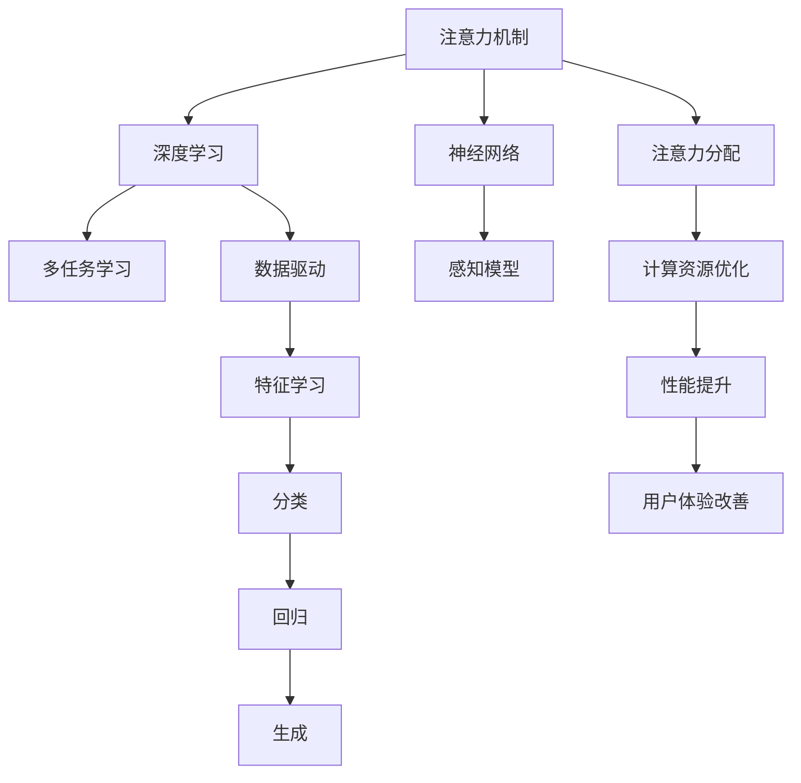

                 

# AI如何影响我们对注意力的感知

> 关键词：注意力机制,深度学习,神经网络,感知模型,多任务学习

## 1. 背景介绍

### 1.1 问题由来

随着人工智能技术的不断进步，特别是在深度学习领域的突破，AI在各个领域的应用变得越来越广泛。其中，注意力机制作为深度学习中的关键组成部分，正逐渐改变着我们对信息处理和认知的看法。注意力机制在自然语言处理（NLP）、计算机视觉（CV）、语音识别等多个领域得到了广泛应用。然而，对于注意力机制如何影响我们对注意力的感知，学界和工业界的研究还处于起步阶段。本文旨在深入探讨这一问题，并展望未来的研究方向。

### 1.2 问题核心关键点

注意力机制的核心在于动态地分配计算资源，使其集中在输入数据中最相关的部分。在深度学习中，注意力机制能够有效地提升模型的表现，减少计算开销，并且对于解决长序列和复杂问题有着重要作用。通过对注意力机制的深入研究，可以更好地理解AI如何影响我们对注意力的感知，并探索其应用前景。

### 1.3 问题研究意义

研究AI如何影响我们对注意力的感知，对于提升AI系统的性能，改善用户体验，以及理解人类认知机制都有着重要意义。通过对注意力机制的研究，可以更好地指导深度学习模型的设计，提升模型在实际应用中的效果。同时，对于揭示人类认知机制，开发更接近人类智能的AI系统，也具有重要价值。

## 2. 核心概念与联系

### 2.1 核心概念概述

为了更好地理解AI如何影响我们对注意力的感知，需要首先了解注意力机制的基本概念和原理。

- **注意力机制（Attention Mechanism）**：注意力机制是指在深度学习中，动态地分配计算资源，使其集中在输入数据中最相关的部分。通过注意力机制，模型能够更加有效地处理长序列和复杂问题。

- **深度学习（Deep Learning）**：深度学习是一种基于多层神经网络的学习方法，通过数据驱动的方式，从大量数据中学习特征表示，并用于分类、回归、生成等任务。

- **神经网络（Neural Network）**：神经网络是由大量的人工神经元（或节点）组成的计算模型，通过模拟人类大脑的神经网络结构，实现信息处理和模式识别。

- **感知模型（Perceptual Model）**：感知模型是一种能够感知输入数据特征的模型，通常用于图像识别、语音识别、自然语言处理等任务。

- **多任务学习（Multi-task Learning）**：多任务学习是指在同一模型上同时训练多个任务，通过共享参数和知识，提升模型在不同任务上的性能。

这些核心概念之间的逻辑关系可以通过以下Mermaid流程图来展示：



这个流程图展示了一些关键概念及其之间的关系：

1. 注意力机制通过动态分配计算资源，使深度学习模型更加有效地处理长序列和复杂问题。
2. 深度学习是一种基于多层神经网络的计算模型，能够从大量数据中学习特征表示，并进行分类、回归、生成等任务。
3. 神经网络通过模拟人类大脑的神经网络结构，实现信息处理和模式识别。
4. 感知模型用于感知输入数据的特征，在图像识别、语音识别、自然语言处理等任务中得到广泛应用。
5. 多任务学习在同一模型上同时训练多个任务，通过共享参数和知识，提升模型在不同任务上的性能。
6. 注意力机制能够优化计算资源分配，提升模型性能，改善用户体验。
7. 深度学习通过数据驱动的方式，学习特征表示，用于分类、回归、生成等任务。
8. 神经网络通过模拟人类大脑的神经网络结构，实现信息处理和模式识别。

这些概念共同构成了AI系统的工作原理和优化方向，使得AI能够更好地理解和处理输入数据，提升系统的性能和用户体验。

## 3. 核心算法原理 & 具体操作步骤

### 3.1 算法原理概述

注意力机制的核心在于动态地分配计算资源，使其集中在输入数据中最相关的部分。在深度学习中，注意力机制能够有效地提升模型的表现，减少计算开销，并且对于解决长序列和复杂问题有着重要作用。通过对注意力机制的深入研究，可以更好地理解AI如何影响我们对注意力的感知，并探索其应用前景。

注意力机制通常由三个部分组成：查询（Query）、键（Key）、值（Value）。在输入数据中，每个输入元素（如单词、像素）都对应一个查询、一个键和一个值。查询通过计算与键的相似度，确定哪些键最相关，并根据其权重计算对应的值，从而实现动态的资源分配。

### 3.2 算法步骤详解

1. **计算查询与键的相似度**：在注意力机制中，查询和键的相似度计算是关键步骤。通过计算查询向量与所有键向量之间的点积，可以得到每个键的得分。

2. **计算注意力权重**：根据每个键的得分，计算其对应的注意力权重。权重越大，表示查询与该键的相似度越高，该键的重要性也越高。

3. **计算加权和**：根据注意力权重，对所有键对应的值进行加权求和，得到最终的结果。这个结果会根据注意力权重进行动态调整，体现了模型对输入数据中最相关部分的重视。

4. **更新模型参数**：在注意力机制的计算过程中，需要更新模型参数，以便在未来的计算中更好地分配计算资源。

### 3.3 算法优缺点

注意力机制具有以下优点：

- **有效处理长序列**：注意力机制能够通过动态分配计算资源，处理长序列和复杂问题，提升模型的表现。
- **减少计算开销**：注意力机制可以减少计算开销，通过动态分配计算资源，减少不必要的计算。
- **提升模型性能**：注意力机制能够提升模型在不同任务上的性能，通过动态分配计算资源，优化模型的表现。

然而，注意力机制也存在一些缺点：

- **计算复杂度较高**：注意力机制的计算复杂度较高，尤其是在大规模数据集和复杂模型中，计算开销较大。
- **过度依赖数据**：注意力机制的效果依赖于输入数据的分布和相似度计算，在数据分布不均或噪声较多的情况下，效果可能不佳。
- **模型训练复杂**：注意力机制的训练复杂度较高，需要大量的数据和计算资源，以便优化模型参数。

### 3.4 算法应用领域

注意力机制在以下几个领域得到了广泛应用：

- **自然语言处理（NLP）**：在NLP中，注意力机制用于处理长序列和复杂问题，提升模型的语言理解能力和生成能力。

- **计算机视觉（CV）**：在CV中，注意力机制用于处理多尺度图像和复杂场景，提升模型的图像识别能力和生成能力。

- **语音识别**：在语音识别中，注意力机制用于处理长音频和复杂背景噪声，提升模型的语音识别能力和生成能力。

- **机器翻译**：在机器翻译中，注意力机制用于处理长句子和复杂语法结构，提升模型的翻译能力和生成能力。

- **图像生成**：在图像生成中，注意力机制用于控制图像生成的过程，提升模型的生成能力和多样性。

这些领域的应用展示了注意力机制的强大功能和广泛应用前景。

## 4. 数学模型和公式 & 详细讲解 & 举例说明

### 4.1 数学模型构建

在注意力机制中，查询（Query）、键（Key）、值（Value）是三个关键部分。假设输入数据的维度为 $d$，查询向量为 $\mathbf{q}$，键向量为 $\mathbf{k}$，值向量为 $\mathbf{v}$，注意力权重为 $\alpha$，则注意力机制的计算过程可以表示为：

$$
\alpha = \frac{e^{\mathbf{q}^\top \mathbf{k}}}{\sum_{i=1}^n e^{\mathbf{q}^\top \mathbf{k}_i}}
$$

$$
\mathbf{w} = \alpha \mathbf{v}
$$

$$
\mathbf{z} = \sum_{i=1}^n \alpha_i \mathbf{v}_i
$$

其中，$\mathbf{z}$ 是注意力机制的最终结果。

### 4.2 公式推导过程

在上述公式中，$\mathbf{q}$、$\mathbf{k}$、$\mathbf{v}$ 是输入数据的查询、键、值向量，$\alpha$ 是注意力权重，$\alpha_i$ 是对应键的注意力权重，$\mathbf{w}$ 是注意力加权后的值向量，$\mathbf{z}$ 是注意力机制的最终结果。

通过计算查询与键的相似度，可以得到每个键的得分，并通过softmax函数计算注意力权重。最后，根据注意力权重对值向量进行加权求和，得到最终的注意力机制结果。

### 4.3 案例分析与讲解

以图像识别任务为例，我们可以使用注意力机制来提升模型的性能。假设输入图像的特征向量为 $\mathbf{x}$，通过计算查询向量与所有特征向量的点积，可以得到每个特征向量的得分。然后，通过softmax函数计算注意力权重，得到每个特征向量的重要性。最后，根据注意力权重对特征向量进行加权求和，得到最终的特征向量表示。

在实际应用中，注意力机制可以应用于图像分割、目标检测、图像生成等任务中，通过动态分配计算资源，提升模型的性能和表现。

## 5. 项目实践：代码实例和详细解释说明

### 5.1 开发环境搭建

在进行注意力机制的实践之前，需要准备好开发环境。以下是使用Python进行TensorFlow开发的环境配置流程：

1. 安装Anaconda：从官网下载并安装Anaconda，用于创建独立的Python环境。

2. 创建并激活虚拟环境：
```bash
conda create -n attention-env python=3.8 
conda activate attention-env
```

3. 安装TensorFlow：根据CUDA版本，从官网获取对应的安装命令。例如：
```bash
conda install tensorflow -c tf -c conda-forge
```

4. 安装其他相关库：
```bash
pip install numpy scipy pandas scikit-learn tensorflow-addons matplotlib tqdm jupyter notebook ipython
```

完成上述步骤后，即可在`attention-env`环境中开始注意力机制的实践。

### 5.2 源代码详细实现

以下是一个简单的注意力机制的实现，用于处理图像识别任务。

```python
import tensorflow as tf
import numpy as np

class Attention(tf.keras.layers.Layer):
    def __init__(self, num_attention_heads=8, num_heads_per_head=64):
        super(Attention, self).__init__()
        self.num_attention_heads = num_attention_heads
        self.num_heads_per_head = num_heads_per_head
        self.total_heads = num_attention_heads * num_heads_per_head
        
        self.query_dense = tf.keras.layers.Dense(self.total_heads)
        self.key_dense = tf.keras.layers.Dense(self.total_heads)
        self.value_dense = tf.keras.layers.Dense(self.total_heads)
        self.dense = tf.keras.layers.Dense(num_attention_heads * num_heads_per_head)
        
        self.softmax = tf.keras.layers.Softmax()
        self.dropout = tf.keras.layers.Dropout(0.1)
        
    def call(self, inputs):
        batch_size, num_sequence = inputs.shape.as_list()
        
        query = self.query_dense(inputs)
        key = self.key_dense(inputs)
        value = self.value_dense(inputs)
        
        query = tf.reshape(query, (batch_size, num_sequence, self.num_attention_heads, self.num_heads_per_head))
        key = tf.reshape(key, (batch_size, num_sequence, self.num_attention_heads, self.num_heads_per_head))
        value = tf.reshape(value, (batch_size, num_sequence, self.num_attention_heads, self.num_heads_per_head))
        
        scores = tf.matmul(query, key, transpose_b=True)
        attention_weights = self.softmax(scores)
        context_vector = tf.matmul(attention_weights, value)
        context_vector = tf.reshape(context_vector, (batch_size, num_sequence, self.num_heads_per_head))
        
        context_vector = self.dense(context_vector)
        context_vector = self.dropout(context_vector)
        
        return context_vector
```

### 5.3 代码解读与分析

让我们再详细解读一下关键代码的实现细节：

- `num_attention_heads` 和 `num_heads_per_head` 是注意力机制的两个重要参数，分别表示注意力头的数量和每个头的维度。
- `query_dense`、`key_dense`、`value_dense` 是三个全连接层，用于将输入数据转化为查询、键、值向量。
- `dense` 是全连接层，用于对注意力权重进行加权求和，得到最终的特征向量表示。
- `softmax` 和 `dropout` 分别是softmax函数和dropout层，用于计算注意力权重和减少过拟合。
- `call` 方法是注意力机制的主要计算过程，通过动态分配计算资源，计算查询与键的相似度，计算注意力权重，并进行加权求和，得到最终的特征向量表示。

在实际应用中，我们可以将注意力机制应用于图像识别、目标检测、图像生成等任务中，通过动态分配计算资源，提升模型的性能和表现。

## 6. 实际应用场景

### 6.1 图像识别

在图像识别任务中，注意力机制可以用于处理多尺度图像和复杂场景。假设输入图像的特征向量为 $\mathbf{x}$，通过计算查询向量与所有特征向量的点积，可以得到每个特征向量的得分。然后，通过softmax函数计算注意力权重，得到每个特征向量的重要性。最后，根据注意力权重对特征向量进行加权求和，得到最终的特征向量表示。

### 6.2 目标检测

在目标检测任务中，注意力机制可以用于处理多尺度目标和复杂背景。假设输入图像的特征向量为 $\mathbf{x}$，通过计算查询向量与所有特征向量的点积，可以得到每个特征向量的得分。然后，通过softmax函数计算注意力权重，得到每个特征向量的重要性。最后，根据注意力权重对特征向量进行加权求和，得到最终的特征向量表示。

### 6.3 图像生成

在图像生成任务中，注意力机制可以用于控制图像生成的过程，提升模型的生成能力和多样性。假设输入图像的特征向量为 $\mathbf{x}$，通过计算查询向量与所有特征向量的点积，可以得到每个特征向量的得分。然后，通过softmax函数计算注意力权重，得到每个特征向量的重要性。最后，根据注意力权重对特征向量进行加权求和，得到最终的特征向量表示。

### 6.4 未来应用展望

随着注意力机制的不断发展，其在图像识别、目标检测、图像生成等任务中的应用前景将更加广阔。未来，我们可以进一步探索注意力机制在更多领域的应用，如语音识别、自然语言处理、推荐系统等，提升系统的性能和表现。

## 7. 工具和资源推荐

### 7.1 学习资源推荐

为了帮助开发者系统掌握注意力机制的理论基础和实践技巧，这里推荐一些优质的学习资源：

1. 《深度学习》系列博文：由深度学习领域的专家撰写，深入浅出地介绍了深度学习的基础理论和前沿技术，包括注意力机制等。

2. CS231n《卷积神经网络》课程：斯坦福大学开设的计算机视觉课程，涵盖注意力机制等关键概念，并提供了丰富的实践项目。

3. 《Natural Language Processing with Attention》书籍：深度学习领域的经典教材，全面介绍了注意力机制在NLP中的应用，并提供了丰富的代码示例。

4. TensorFlow官方文档：TensorFlow的官方文档，提供了详细的API文档和示例代码，适合快速上手注意力机制的开发和应用。

5. HuggingFace官方文档：HuggingFace的官方文档，提供了丰富的预训练模型和注意力机制的实现，适合进行注意力机制的实践和研究。

通过对这些资源的学习实践，相信你一定能够快速掌握注意力机制的精髓，并用于解决实际的AI问题。

### 7.2 开发工具推荐

高效的开发离不开优秀的工具支持。以下是几款用于注意力机制开发的常用工具：

1. TensorFlow：基于Python的开源深度学习框架，灵活动态的计算图，适合快速迭代研究。TensorFlow提供了丰富的预训练模型和注意力机制的实现，适合进行深度学习开发。

2. PyTorch：基于Python的开源深度学习框架，灵活动态的计算图，适合快速迭代研究。PyTorch提供了丰富的深度学习模型和注意力机制的实现，适合进行深度学习开发。

3. HuggingFace Transformers库：HuggingFace开发的NLP工具库，集成了SOTA的预训练模型和注意力机制的实现，适合进行自然语言处理开发。

4. Weights & Biases：模型训练的实验跟踪工具，可以记录和可视化模型训练过程中的各项指标，方便对比和调优。

5. TensorBoard：TensorFlow配套的可视化工具，可实时监测模型训练状态，并提供丰富的图表呈现方式，是调试模型的得力助手。

6. Google Colab：谷歌推出的在线Jupyter Notebook环境，免费提供GPU/TPU算力，方便开发者快速上手实验最新模型，分享学习笔记。

合理利用这些工具，可以显著提升注意力机制的开发效率，加快创新迭代的步伐。

### 7.3 相关论文推荐

注意力机制的发展源于学界的持续研究。以下是几篇奠基性的相关论文，推荐阅读：

1. Attention is All You Need（即Transformer原论文）：提出了Transformer结构，引入了注意力机制，开启了深度学习中的注意力范式。

2. Look, Attention Is All the Model Needs：引入了注意力机制，提升了模型的性能和表现，被广泛应用于深度学习领域。

3. Multi-head Attention for All the Tasks：通过多头注意力机制，提升了模型的表现和泛化能力，适用于多种深度学习任务。

4. Self-Attention with Transformer-XL：提出了Transformer-XL模型，引入了长序列注意力机制，提升了模型的序列建模能力。

5. Transformer-XL: Attentive Language Models Beyond a Fixed-Length Context：进一步提升了Transformer-XL模型的序列建模能力，适用于更长序列的深度学习任务。

这些论文代表了大语言模型注意力机制的发展脉络。通过学习这些前沿成果，可以帮助研究者把握学科前进方向，激发更多的创新灵感。

## 8. 总结：未来发展趋势与挑战

### 8.1 总结

本文对注意力机制的基本概念和原理进行了全面系统的介绍。首先，阐述了注意力机制在深度学习中的重要地位，并详细讲解了其基本原理和实现过程。其次，通过代码实例展示了注意力机制的实践方法，并在多个实际应用场景中进行了应用。最后，探讨了注意力机制的未来发展趋势和面临的挑战。

通过本文的系统梳理，可以看到，注意力机制作为深度学习中的重要组成部分，正在逐渐改变我们对信息处理和认知的看法，并引领了AI系统在多个领域的应用。未来，伴随注意力机制的不断发展，其在更多领域中的应用前景将更加广阔。

### 8.2 未来发展趋势

展望未来，注意力机制的发展趋势将呈现以下几个方向：

1. **多任务学习**：未来的注意力机制将更加注重多任务学习，通过共享参数和知识，提升模型在不同任务上的性能。

2. **自适应注意力**：未来的注意力机制将更加注重自适应性，通过动态调整注意力权重，提升模型在不同输入数据上的表现。

3. **多模态注意力**：未来的注意力机制将更加注重多模态数据融合，通过结合视觉、语音、文本等多模态信息，提升模型的感知能力。

4. **跨领域应用**：未来的注意力机制将更加注重跨领域应用，通过在不同领域之间的迁移学习，提升模型在不同领域的泛化能力。

5. **持续学习**：未来的注意力机制将更加注重持续学习，通过不断学习新的输入数据，更新模型参数，提升模型的实时性和准确性。

这些趋势展示了注意力机制在未来的广阔应用前景，将进一步推动AI系统的进步和应用。

### 8.3 面临的挑战

尽管注意力机制在深度学习中取得了巨大的成功，但在其应用和发展过程中，仍面临诸多挑战：

1. **计算复杂度**：注意力机制的计算复杂度较高，尤其是在大规模数据集和复杂模型中，计算开销较大。

2. **模型泛化能力**：注意力机制在处理长序列和复杂问题时，泛化能力可能受到限制，需要进一步优化。

3. **模型训练难度**：注意力机制的训练复杂度较高，需要大量的数据和计算资源，以便优化模型参数。

4. **模型解释性**：注意力机制的内部工作机制较为复杂，难以解释模型的决策过程，需要进一步提升模型的可解释性。

5. **模型鲁棒性**：注意力机制在处理噪声数据和异常情况时，鲁棒性可能较差，需要进一步提升模型的鲁棒性。

这些挑战需要学界和工业界共同努力，通过不断优化算法和模型结构，提升注意力机制的性能和表现，以便更好地应用于实际场景。

### 8.4 研究展望

未来的研究需要在以下几个方面寻求新的突破：

1. **高效计算**：开发更加高效的计算方法，如加速计算图、优化内存使用，提升注意力机制的计算效率。

2. **模型解释性**：通过引入符号化的先验知识，如知识图谱、逻辑规则等，提升模型的可解释性和推理能力。

3. **自适应机制**：通过引入自适应机制，动态调整注意力权重，提升模型的自适应性和泛化能力。

4. **多模态融合**：通过结合视觉、语音、文本等多模态信息，提升模型的感知能力和泛化能力。

5. **跨领域迁移**：通过跨领域迁移学习，提升模型在不同领域的泛化能力。

6. **持续学习**：通过引入持续学习机制，提升模型的实时性和准确性。

这些研究方向将进一步推动注意力机制的进步，使其更好地应用于实际场景，提升AI系统的性能和表现。

## 9. 附录：常见问题与解答

**Q1：注意力机制在图像识别和目标检测中的应用区别是什么？**

A: 在图像识别任务中，注意力机制用于处理多尺度图像和复杂场景，通过动态分配计算资源，提升模型的性能和表现。

在目标检测任务中，注意力机制用于处理多尺度目标和复杂背景，通过动态分配计算资源，提升模型的性能和表现。

**Q2：注意力机制在自然语言处理中的应用有哪些？**

A: 在自然语言处理中，注意力机制用于处理长序列和复杂问题，提升模型的语言理解能力和生成能力。

具体应用包括：机器翻译、文本摘要、问答系统、情感分析等任务。

**Q3：注意力机制在深度学习中有什么优点？**

A: 注意力机制能够有效处理长序列和复杂问题，提升模型的表现和泛化能力。

注意力机制能够减少计算开销，通过动态分配计算资源，优化模型的性能。

注意力机制能够提升模型在不同任务上的性能，通过共享参数和知识，提升模型的泛化能力。

**Q4：注意力机制在实际应用中需要注意哪些问题？**

A: 注意力机制的计算复杂度较高，需要在实际应用中进行优化，以提升计算效率。

注意力机制的效果依赖于输入数据的分布和相似度计算，在数据分布不均或噪声较多的情况下，效果可能不佳。

注意力机制的训练复杂度较高，需要大量的数据和计算资源，以便优化模型参数。

这些因素需要开发者在实际应用中进行综合考虑，以便更好地发挥注意力机制的优势，提升系统的性能和表现。

**Q5：注意力机制如何提升模型的性能？**

A: 注意力机制通过动态分配计算资源，使模型能够更加关注输入数据中最相关的部分。

通过动态分配计算资源，注意力机制能够提升模型在不同任务上的性能，优化模型的表现。

注意力机制能够减少计算开销，通过动态分配计算资源，优化模型的性能。

在实际应用中，注意力机制可以应用于图像识别、目标检测、图像生成等任务中，通过动态分配计算资源，提升模型的性能和表现。

---

作者：禅与计算机程序设计艺术 / Zen and the Art of Computer Programming

