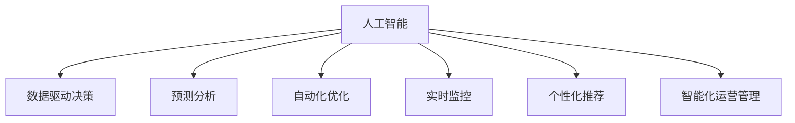

                 

## 1. 背景介绍

### 1.1 问题由来

人工智能（AI）的迅猛发展，正在改变各个行业的运行模式，并深刻影响着企业的决策过程。随着大数据、机器学习、深度学习等技术的成熟，企业开始利用AI对海量数据进行分析，挖掘其中的规律，为决策提供依据。AI在企业决策中的广泛应用，使得企业能够更好地理解市场变化，制定更加精准的策略，实现业务目标。

近年来，AI在决策支持系统（DSS）、预测分析、情感分析、推荐系统等领域得到了广泛应用。例如，IBM的Watson商业智能平台利用深度学习和自然语言处理技术，帮助企业进行市场分析、客户关系管理、运营优化等；亚马逊通过机器学习算法优化其供应链管理，提高物流效率；阿里巴巴利用大数据分析指导电商运营，提升用户体验。

### 1.2 问题核心关键点

AI改变企业决策过程的关键点在于：

1. **数据驱动决策**：利用AI技术处理和分析海量数据，提供准确的数据驱动决策支持。
2. **自动化预测和优化**：通过AI模型对市场趋势、客户需求等进行预测，自动调整策略和优化运营。
3. **实时监控和调整**：AI系统可以实现对业务过程的实时监控和调整，增强决策的灵活性和及时性。
4. **个性化推荐和优化**：AI可以分析用户行为和偏好，提供个性化的产品和服务。
5. **智能化运营管理**：AI能够实现自动化流程管理，提升企业运营效率。

### 1.3 问题研究意义

AI在企业决策中的应用，对于提高企业决策的科学性、准确性和效率具有重要意义：

1. **提高决策质量**：通过数据分析和模型预测，辅助管理层做出更加科学合理的决策。
2. **增强竞争力**：利用AI技术优化运营管理，提高生产效率和服务质量，增强企业竞争力。
3. **降低风险**：AI可以实时监测风险点，预测潜在问题，帮助企业提前规避风险。
4. **创新商业模式**：AI技术催生了新的商业模式和服务形态，如共享经济、精准营销等。
5. **推动智能化转型**：AI技术的应用，推动企业向智能化、数字化方向转型，提升整体管理水平。

## 2. 核心概念与联系

### 2.1 核心概念概述

为更好地理解AI在企业决策中的应用，本节将介绍几个密切相关的核心概念：

- **人工智能（AI）**：一种模拟人类智能的技术，包括机器学习、深度学习、自然语言处理、计算机视觉等。
- **数据驱动决策（DDD）**：利用数据作为决策的主要依据，而非直觉或经验。
- **预测分析（Predictive Analytics）**：通过分析历史数据和趋势，预测未来可能发生的事件。
- **自动化优化（Automated Optimization）**：使用算法自动调整系统参数，以实现最优效果。
- **实时监控（Real-Time Monitoring）**：对业务过程进行实时监测，快速响应异常情况。
- **个性化推荐（Personalized Recommendation）**：根据用户行为和偏好，提供定制化的产品或服务。
- **智能化运营管理（Intelligent Operational Management）**：利用AI技术自动化企业运营流程，提升效率。

这些核心概念之间的逻辑关系可以通过以下Mermaid流程图来展示：



这个流程图展示了大语言模型的核心概念及其之间的关系：

1. 人工智能通过数据分析和模型预测，为数据驱动决策提供支撑。
2. 预测分析利用AI技术对历史数据进行深入分析，预测未来趋势。
3. 自动化优化通过AI模型自动调整系统参数，优化业务流程。
4. 实时监控利用AI系统实时监测业务过程，快速响应异常。
5. 个性化推荐通过AI分析用户行为，提供定制化服务。
6. 智能化运营管理利用AI技术自动化运营流程，提升企业效率。

## 3. 核心算法原理 & 具体操作步骤
### 3.1 算法原理概述

AI在企业决策中的应用，本质上是将数据转化为决策的过程。这一过程包括数据收集、数据清洗、特征工程、模型训练、结果输出等环节。其中，模型训练是AI决策过程中的核心部分。

数据驱动决策的过程通常分为以下几个步骤：

1. **数据收集**：从企业内外获取各种类型的原始数据。
2. **数据清洗**：对数据进行清洗和预处理，去除噪音和异常值。
3. **特征工程**：从原始数据中提取有意义的特征，为模型提供输入。
4. **模型训练**：利用机器学习或深度学习算法对数据进行训练，得到模型。
5. **结果输出**：使用训练好的模型对新数据进行预测，辅助决策。

### 3.2 算法步骤详解

基于AI的数据驱动决策，一般包括以下几个关键步骤：

**Step 1: 数据收集**

数据收集是决策支持系统的第一步，需要从企业内外获取各种类型的原始数据。这些数据可能来自企业内部的ERP、CRM、POS等系统，也可能来自外部市场数据、社交媒体数据、天气数据等。

**Step 2: 数据清洗**

数据清洗是确保数据质量的关键步骤。数据清洗包括去除重复数据、处理缺失值、纠正错误数据等。常用的数据清洗技术包括：

- 去重：删除重复记录。
- 处理缺失值：填补缺失值或删除缺失记录。
- 数据格式转换：统一数据格式和单位。
- 异常值处理：去除明显异常的数据点。

**Step 3: 特征工程**

特征工程是将原始数据转化为模型输入的过程。通过特征选择、特征提取和特征转换，可以从原始数据中提取出最有用的信息。常见的特征工程技术包括：

- 特征选择：选择与目标变量相关性较高的特征。
- 特征提取：从原始数据中提取新的特征，如文本的TF-IDF特征、时序数据的周期性特征等。
- 特征转换：对原始特征进行变换，如归一化、标准化、PCA降维等。

**Step 4: 模型训练**

模型训练是决策支持系统的核心部分。常用的模型包括回归模型、分类模型、聚类模型、时序模型等。模型训练通常使用监督学习算法（如线性回归、决策树、随机森林、支持向量机等）或无监督学习算法（如K-means、PCA等）。模型训练的过程包括：

- 选择合适的算法和模型结构。
- 划分训练集和测试集。
- 设置训练参数，如学习率、正则化系数等。
- 使用训练集进行模型训练，并计算损失函数。
- 根据损失函数更新模型参数，进行多轮迭代。
- 在测试集上评估模型性能。

**Step 5: 结果输出**

模型训练完成后，将模型应用于新数据进行预测。结果输出通常包含以下几种形式：

- 预测值：模型对新数据的预测结果。
- 置信度：模型对预测结果的置信度。
- 风险评估：模型对预测结果的风险评估。
- 可视化图表：直观展示预测结果。

### 3.3 算法优缺点

基于AI的数据驱动决策具有以下优点：

1. **高效性**：自动化处理大量数据，提高决策效率。
2. **准确性**：利用算法处理数据，降低人为误差。
3. **灵活性**：能够根据数据变化自动调整模型，保持决策的及时性和适应性。
4. **可解释性**：通过特征工程和模型解释技术，提供决策的依据。

但同时，也存在以下缺点：

1. **数据质量要求高**：数据清洗和特征提取需要大量的时间和人力资源。
2. **模型依赖数据**：数据质量和特征工程对模型效果影响较大。
3. **黑箱问题**：复杂模型难以解释其内部机制，难以进行透明的决策。
4. **计算资源要求高**：训练复杂模型需要高性能计算资源。
5. **数据隐私和安全问题**：数据采集和处理可能涉及隐私和安全问题。

### 3.4 算法应用领域

基于AI的数据驱动决策，在各个领域都有广泛的应用，例如：

- 金融风控：利用AI进行信用评估、欺诈检测、风险管理等。
- 供应链管理：利用AI进行需求预测、库存优化、物流调度等。
- 市场营销：利用AI进行客户分析、市场细分、精准营销等。
- 客户服务：利用AI进行客服自动化、情感分析、客户行为预测等。
- 产品推荐：利用AI进行个性化推荐、广告投放、用户画像等。
- 智能制造：利用AI进行生产调度、质量控制、设备维护等。

## 4. 数学模型和公式 & 详细讲解  
### 4.1 数学模型构建

本节将使用数学语言对AI在企业决策中的应用进行更加严格的刻画。

假设企业决策问题为回归问题，即利用历史数据$(x_1, y_1), (x_2, y_2), ..., (x_n, y_n)$，预测新数据$x$的目标变量$y$。设模型为线性回归模型：

$$
y = \theta_0 + \theta_1x_1 + \theta_2x_2 + ... + \theta_px_p + \epsilon
$$

其中，$\theta_0, \theta_1, \theta_2, ..., \theta_p$为模型参数，$\epsilon$为误差项。模型的目标是最小化预测值与真实值之间的平方误差，即：

$$
\min_{\theta} \frac{1}{N} \sum_{i=1}^N (y_i - \theta_0 - \theta_1x_{i1} - \theta_2x_{i2} - ... - \theta_px_{ip})^2
$$

使用梯度下降法求解上述优化问题，模型的梯度更新公式为：

$$
\theta_j = \theta_j - \alpha \frac{1}{N} \sum_{i=1}^N (y_i - \theta_0 - \theta_1x_{i1} - \theta_2x_{i2} - ... - \theta_px_{ip})
$$

其中，$\alpha$为学习率，$j$为参数下标，$N$为样本数量。

### 4.2 公式推导过程

以下我们以线性回归为例，推导梯度下降法的数学原理。

线性回归模型的目标是最小化损失函数，即：

$$
J(\theta) = \frac{1}{N} \sum_{i=1}^N (y_i - \theta_0 - \theta_1x_{i1} - \theta_2x_{i2} - ... - \theta_px_{ip})^2
$$

对损失函数求导，得到：

$$
\frac{\partial J(\theta)}{\partial \theta_j} = -\frac{2}{N} \sum_{i=1}^N (y_i - \theta_0 - \theta_1x_{i1} - \theta_2x_{i2} - ... - \theta_px_{ip})
$$

根据梯度下降法的迭代公式：

$$
\theta_j = \theta_j - \alpha \frac{\partial J(\theta)}{\partial \theta_j}
$$

将上述导数代入，得到：

$$
\theta_j = \theta_j - \alpha (-\frac{2}{N} \sum_{i=1}^N (y_i - \theta_0 - \theta_1x_{i1} - \theta_2x_{i2} - ... - \theta_px_{ip}))
$$

即为梯度下降法的更新公式。通过迭代计算，模型参数$\theta$不断调整，最终收敛到最优解。

## 5. 项目实践：代码实例和详细解释说明
### 5.1 开发环境搭建

在进行AI在企业决策中的应用开发前，我们需要准备好开发环境。以下是使用Python进行Scikit-Learn开发的环境配置流程：

1. 安装Anaconda：从官网下载并安装Anaconda，用于创建独立的Python环境。

2. 创建并激活虚拟环境：
```bash
conda create -n pythontest python=3.7 
conda activate pythontest
```

3. 安装Scikit-Learn：
```bash
pip install scikit-learn
```

4. 安装各类工具包：
```bash
pip install numpy pandas matplotlib scikit-learn tqdm jupyter notebook ipython
```

完成上述步骤后，即可在`pythontest`环境中开始项目实践。

### 5.2 源代码详细实现

下面我们以线性回归为例，给出使用Scikit-Learn进行数据驱动决策的PyTorch代码实现。

```python
import numpy as np
from sklearn.linear_model import LinearRegression
from sklearn.metrics import mean_squared_error

# 创建数据集
np.random.seed(0)
X = np.random.randn(100, 3)
y = 0.5 * X[:, 0] + 0.5 * X[:, 1] + 0.5 * X[:, 2] + np.random.randn(100)

# 划分训练集和测试集
X_train, X_test = X[:80], X[80:]
y_train, y_test = y[:80], y[80:]

# 训练模型
model = LinearRegression()
model.fit(X_train, y_train)

# 预测并评估
y_pred = model.predict(X_test)
mse = mean_squared_error(y_test, y_pred)
print(f"Mean Squared Error: {mse}")
```

以上代码展示了使用Scikit-Learn库进行线性回归模型的训练和预测。可以看到，代码简洁高效，能够快速实现数据驱动决策的核心逻辑。

### 5.3 代码解读与分析

让我们再详细解读一下关键代码的实现细节：

**数据集创建**：
- `np.random.seed(0)`：设置随机数种子，确保结果可复现。
- `X = np.random.randn(100, 3)`：生成100行3列的随机数矩阵作为特征数据。
- `y = 0.5 * X[:, 0] + 0.5 * X[:, 1] + 0.5 * X[:, 2] + np.random.randn(100)`：根据特征数据计算目标变量，引入噪声。

**模型训练**：
- `model = LinearRegression()`：创建线性回归模型。
- `model.fit(X_train, y_train)`：使用训练集进行模型训练。

**预测与评估**：
- `y_pred = model.predict(X_test)`：对测试集进行预测。
- `mse = mean_squared_error(y_test, y_pred)`：计算预测值与真实值之间的均方误差。
- `print(f"Mean Squared Error: {mse}")`：输出均方误差。

可以看到，代码实现简单明了，只需几行代码即可完成模型训练和预测，并评估模型的性能。

## 6. 实际应用场景
### 6.1 智能金融风控

在金融领域，AI可以应用于风险评估、信用评分、欺诈检测等。传统上，金融风险管理依赖人工进行信用审核、欺诈识别等，耗时费力且容易出错。利用AI技术，可以大幅提高金融风控的效率和准确性。

具体而言，可以收集用户的历史交易数据、信用记录、社交媒体数据等，构建数据驱动的金融风控模型。通过训练，模型可以识别出高风险用户，提前预警并采取措施。例如，利用机器学习算法构建用户行为分析模型，对用户的历史交易行为进行分析，预测其是否可能发生违约。通过实时监控，可以及时发现异常交易，防止欺诈行为。

### 6.2 智能供应链管理

在供应链管理中，AI可以应用于需求预测、库存优化、物流调度等。传统上，供应链管理依赖人工进行需求分析、库存管理等，效率低下且容易出错。利用AI技术，可以大幅提高供应链管理的效率和精确度。

具体而言，可以收集历史销售数据、市场需求数据、天气数据等，构建数据驱动的供应链管理模型。通过训练，模型可以预测未来的市场需求，优化库存管理。例如，利用深度学习算法构建时间序列预测模型，对未来的销售需求进行预测。通过实时监控，可以动态调整库存和物流策略，降低成本，提升效率。

### 6.3 智能市场营销

在市场营销中，AI可以应用于客户分析、市场细分、精准营销等。传统上，市场营销依赖人工进行市场分析、客户分析等，耗时费力且容易出错。利用AI技术，可以大幅提高市场营销的效率和精准性。

具体而言，可以收集用户的历史行为数据、购买记录、社交媒体数据等，构建数据驱动的市场营销模型。通过训练，模型可以识别出不同客户群体的特征，提供个性化的营销策略。例如，利用机器学习算法构建客户聚类模型，对用户进行分群。通过实时监控，可以及时调整营销策略，提高用户转化率。

### 6.4 未来应用展望

随着AI技术的不断发展，基于AI的数据驱动决策将在更多领域得到应用，为各行各业带来变革性影响。

在智慧城市治理中，AI可以应用于城市事件监测、舆情分析、应急指挥等环节，提高城市管理的自动化和智能化水平，构建更安全、高效的未来城市。

在医疗健康领域，AI可以应用于疾病预测、患者诊断、个性化治疗等环节，提高医疗服务的智能化水平，辅助医生诊疗，提升医疗质量。

在教育领域，AI可以应用于智能辅导、学习分析、个性化推荐等环节，提高教育服务的智能化水平，辅助教师教学，提升教育质量。

此外，在智能制造、智能交通、智能安防等众多领域，基于AI的数据驱动决策也将不断涌现，为经济社会发展注入新的动力。相信随着AI技术的不断成熟，数据驱动决策必将在更广阔的应用领域大放异彩。

## 7. 工具和资源推荐
### 7.1 学习资源推荐

为了帮助开发者系统掌握AI在企业决策中的应用，这里推荐一些优质的学习资源：

1. 《机器学习》（周志华著）：全面介绍机器学习的基本概念、算法和应用，适合初学者入门。
2. 《深度学习》（Ian Goodfellow等著）：深入讲解深度学习的原理和实践，适合进阶学习。
3. 《Python机器学习》（Sebastian Raschka著）：介绍Python在机器学习中的应用，适合Python开发人员。
4. 《Applied Machine Learning with Scikit-Learn》（Raschka等著）：介绍Scikit-Learn在机器学习中的应用，适合Scikit-Learn用户。
5. Coursera上的机器学习课程：斯坦福大学开设的机器学习课程，有Lecture视频和配套作业，适合在线学习。

通过对这些资源的学习实践，相信你一定能够快速掌握AI在企业决策中的应用，并用于解决实际的业务问题。
###  7.2 开发工具推荐

高效的开发离不开优秀的工具支持。以下是几款用于AI在企业决策中应用的常用工具：

1. Scikit-Learn：基于Python的机器学习库，提供了丰富的算法和模型。
2. TensorFlow：由Google主导开发的开源深度学习框架，适合大规模工程应用。
3. PyTorch：基于Python的深度学习框架，灵活易用，适合快速迭代研究。
4. Jupyter Notebook：交互式编程环境，适合开发和分享代码。
5. Weights & Biases：模型训练的实验跟踪工具，可以记录和可视化模型训练过程中的各项指标。
6. TensorBoard：TensorFlow配套的可视化工具，可实时监测模型训练状态，并提供丰富的图表呈现方式。

合理利用这些工具，可以显著提升AI在企业决策中的应用开发效率，加快创新迭代的步伐。

### 7.3 相关论文推荐

AI在企业决策中的应用源于学界的持续研究。以下是几篇奠基性的相关论文，推荐阅读：

1. Gradient Boosting Machines（Hastie等著）：提出梯度提升机算法，广泛应用于机器学习领域。
2. Random Forests（Breiman著）：提出随机森林算法，广泛应用于分类和回归问题。
3. The Elements of Statistical Learning（Hastie等著）：全面介绍统计学习的基本概念和算法。
4. Deep Learning（Ian Goodfellow等著）：深入讲解深度学习的原理和实践，适合进阶学习。
5. Predictive Analytics（Datar等著）：介绍预测分析的基本概念和应用，适合数据驱动决策。

这些论文代表了大语言模型微调技术的发展脉络。通过学习这些前沿成果，可以帮助研究者把握学科前进方向，激发更多的创新灵感。

## 8. 总结：未来发展趋势与挑战
### 8.1 总结

本文对基于AI的数据驱动决策方法进行了全面系统的介绍。首先阐述了AI在企业决策中的应用背景和意义，明确了数据驱动决策在提高企业决策效率和精准性方面的独特价值。其次，从原理到实践，详细讲解了数据驱动决策的数学原理和关键步骤，给出了数据驱动决策任务开发的完整代码实例。同时，本文还广泛探讨了数据驱动决策方法在智能金融风控、智能供应链管理、智能市场营销等多个行业领域的应用前景，展示了数据驱动决策范式的巨大潜力。此外，本文精选了数据驱动决策技术的各类学习资源，力求为读者提供全方位的技术指引。

通过本文的系统梳理，可以看到，基于AI的数据驱动决策方法正在成为各行各业的重要范式，极大地提升了企业的决策效率和科学性。AI技术的应用，使得企业能够更好地理解市场变化，制定更加精准的策略，实现业务目标。未来，伴随AI技术的不断演进，数据驱动决策必将推动各行各业向智能化、数字化方向加速转型。

### 8.2 未来发展趋势

展望未来，基于AI的数据驱动决策技术将呈现以下几个发展趋势：

1. **模型自动化**：未来AI模型将更加自动化，能够自动进行数据预处理、特征工程、模型训练等，降低人工干预。
2. **跨领域融合**：AI技术将与其他领域的技术进行深度融合，如自然语言处理、计算机视觉、智能推荐等，提升数据驱动决策的全面性。
3. **实时化**：AI系统将具备实时处理和反馈的能力，能够实时监控业务过程，快速响应异常。
4. **个性化**：AI技术将根据用户行为和偏好，提供个性化的决策支持。
5. **可信度**：AI系统将具备更高的可信度和可解释性，增强决策的透明度和公正性。
6. **多模态融合**：AI系统将利用多模态数据进行决策，提升决策的全面性和准确性。

这些趋势凸显了基于AI的数据驱动决策技术的广阔前景。这些方向的探索发展，必将进一步提升企业决策的科学性和效率，推动AI技术在各行各业的应用深化。

### 8.3 面临的挑战

尽管基于AI的数据驱动决策技术已经取得了显著进展，但在迈向更加智能化、普适化应用的过程中，仍面临诸多挑战：

1. **数据质量**：高质量的数据是AI决策的基础，但数据收集、清洗和标注需要大量时间和资源。
2. **模型复杂度**：复杂模型虽然效果更好，但训练和推理成本较高，需要高性能计算资源。
3. **系统集成**：AI系统需要与其他系统进行集成，如ERP、CRM等，复杂的系统集成可能带来额外成本和风险。
4. **用户接受度**：用户对AI系统的信任和接受度不足，可能影响其应用效果。
5. **隐私和安全**：AI系统处理大量敏感数据，可能带来隐私和安全风险。

这些挑战需要企业在技术、管理和法律等多个层面进行综合应对，才能确保AI在企业决策中的应用效果和可持续发展。

### 8.4 研究展望

面对AI在企业决策中面临的挑战，未来的研究需要在以下几个方面寻求新的突破：

1. **数据治理**：建立健全数据治理体系，提升数据质量和可用性，降低数据采集和处理的成本。
2. **模型优化**：优化AI模型的训练和推理效率，降低计算资源需求，提升模型性能。
3. **系统集成**：开发标准的API接口和数据交换协议，简化系统集成，降低集成成本和风险。
4. **用户教育和培训**：提升用户对AI技术的理解和信任，增强用户接受度。
5. **隐私保护**：加强数据隐私和安全保护，确保数据处理和使用符合法律法规。
6. **模型解释**：开发可解释的AI模型，提高决策的透明度和公正性。

这些研究方向将引领基于AI的数据驱动决策技术迈向更高的台阶，为构建智能化、数字化、透明化的决策系统提供支持。面向未来，基于AI的数据驱动决策技术将在各个领域发挥更大作用，推动经济社会的全面数字化转型。

## 9. 附录：常见问题与解答

**Q1：数据驱动决策对企业有哪些具体帮助？**

A: 数据驱动决策对企业的具体帮助包括：

1. **提高决策质量**：通过数据分析和模型预测，辅助管理层做出更加科学合理的决策。
2. **降低风险**：利用AI技术实时监测风险点，预测潜在问题，提前规避风险。
3. **提升效率**：通过自动化处理数据，大幅提升决策效率，减少人工干预。
4. **增强竞争力**：利用AI技术优化运营管理，提高生产效率和服务质量，增强企业竞争力。
5. **个性化服务**：利用AI技术提供个性化的产品和服务，提升用户满意度和市场份额。

**Q2：数据驱动决策的常见数据来源有哪些？**

A: 数据驱动决策的常见数据来源包括：

1. **企业内部数据**：如ERP、CRM、POS等系统生成的数据，包括销售数据、库存数据、用户行为数据等。
2. **外部数据**：如市场数据、社交媒体数据、天气数据等。
3. **客户数据**：如客户交易记录、评论、反馈等。
4. **合作伙伴数据**：如供应链合作伙伴的数据，如物流数据、订单数据等。
5. **公开数据**：如政府公开数据、行业统计数据等。

**Q3：如何选择合适的特征工程方法？**

A: 选择合适的特征工程方法需要考虑以下几个因素：

1. **任务类型**：根据任务类型选择合适的特征提取方法，如文本特征提取、时序特征提取等。
2. **数据类型**：根据数据类型选择合适的特征处理方式，如数值数据归一化、文本数据TF-IDF处理等。
3. **领域知识**：利用领域知识选择有意义的特征，提高模型的解释性和预测准确性。
4. **数据规模**：对于大数据集，可以选择降维方法（如PCA）减少特征数量，提高模型训练和推理效率。
5. **特征交互**：利用特征组合和交叉，提取更有意义的特征，提高模型的泛化能力。

**Q4：数据驱动决策过程中需要注意哪些问题？**

A: 数据驱动决策过程中需要注意以下几个问题：

1. **数据质量**：确保数据准确、完整、一致，避免噪音和异常值影响决策。
2. **特征选择**：选择与目标变量相关性较高的特征，避免过拟合和欠拟合。
3. **模型选择**：根据任务类型选择合适的模型，避免模型选择不当。
4. **超参数调优**：调整模型的超参数，如学习率、正则化系数等，优化模型性能。
5. **模型解释**：提高模型的可解释性，增强决策的透明度和公正性。
6. **用户接受度**：提高用户对AI系统的理解和信任，增强系统应用效果。

**Q5：数据驱动决策在实际应用中需要注意哪些问题？**

A: 数据驱动决策在实际应用中需要注意以下几个问题：

1. **数据隐私和安全**：保护数据隐私和安全，避免数据泄露和滥用。
2. **系统集成**：确保AI系统与其他系统进行无缝集成，避免系统间的数据交互问题。
3. **模型训练和更新**：定期训练和更新模型，保持模型性能和适应性。
4. **监控和反馈**：实时监控模型性能，及时反馈和调整模型参数，避免模型失效。
5. **结果解释**：对模型的预测结果进行解释，提高决策的透明度和公正性。
6. **风险管理**：建立风险管理体系，评估和控制模型的风险，避免模型误导决策。

---

作者：禅与计算机程序设计艺术 / Zen and the Art of Computer Programming

