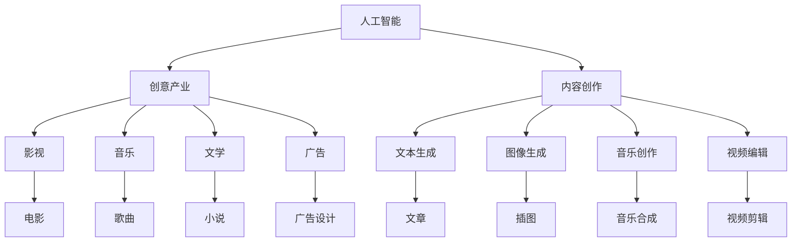

                 

# AI如何改变创意产业和内容创作

> 关键词：人工智能,创意产业,内容创作,生成对抗网络,自然语言处理,图像生成,音乐创作,视频编辑

## 1. 背景介绍

### 1.1 问题由来
随着数字技术的飞速发展，人工智能(AI)正逐渐渗透到各个领域，创意产业和内容创作是其中最受关注的两个方向。创意产业包括文学、艺术、广告、游戏等多个子行业，而内容创作则涵盖了新闻、博客、视频、音乐等多个方面。AI技术在这些领域的应用，不仅提高了创作效率，还拓展了创作的深度和广度，为人类带来了前所未有的变革。

然而，AI在创意产业和内容创作中的应用仍面临诸多挑战。一方面，创作需要高度的原创性和独特性，AI能否完全理解和模仿人类的创意？另一方面，创意产业和内容创作的成功往往取决于个人天赋和情感体验，AI能否替代人类进行创作？本文将详细探讨AI在创意产业和内容创作中的应用现状、核心技术、潜在风险与未来趋势，以期为业界和学术界提供有价值的参考。

## 2. 核心概念与联系

### 2.1 核心概念概述

为更好地理解AI在创意产业和内容创作中的应用，本节将介绍几个核心概念及其相互联系：

- **人工智能(AI)**：利用计算机技术和算法，模拟人类智能活动的技术和应用。涉及领域包括机器学习、自然语言处理(NLP)、计算机视觉(CV)、生成对抗网络(GAN)等。

- **创意产业**：包括影视、音乐、文学、广告等多个子行业，是知识密集型产业，依赖人类创意和技术创新。

- **内容创作**：涉及文字、图片、音频、视频等各类媒体内容的创作和编辑。内容创作需要高度的原创性和情感表达。

- **生成对抗网络(GAN)**：一种深度学习模型，通过两个神经网络对抗训练，生成逼真度极高的图像、音频、视频等内容。

- **自然语言处理(NLP)**：利用计算机技术处理和生成人类语言的技术。涉及任务包括机器翻译、文本生成、情感分析等。

- **图像生成**：通过AI技术，自动生成高质量的图像内容，常用于广告、游戏、虚拟现实等领域。

- **音乐创作**：利用AI生成或创作音乐，包括旋律生成、编曲、节奏设计等。

这些概念共同构成了AI在创意产业和内容创作的应用基础，推动了创意产业和内容创作的创新发展。

### 2.2 核心概念原理和架构的 Mermaid 流程图



## 3. 核心算法原理 & 具体操作步骤

### 3.1 算法原理概述

AI在创意产业和内容创作中的应用，主要依赖于深度学习和大数据技术。通过大规模数据训练，AI模型能够学习到人类创意和内容的规律和特征，进而进行自动生成、编辑和优化。

形式化地，假设AI模型为 $M_{\theta}$，其中 $\theta$ 为模型参数。给定训练集 $D=\{(x_i,y_i)\}_{i=1}^N$，训练目标是最小化损失函数 $\mathcal{L}(M_{\theta},D)$，使得模型输出与真实标签尽可能接近。训练完成后，模型 $M_{\theta}$ 可用于内容生成、编辑、推荐等多个环节。

### 3.2 算法步骤详解

基于深度学习的内容生成和编辑，通常包含以下几个关键步骤：

**Step 1: 数据准备和预处理**
- 收集和标注海量数据，涵盖创意产业和内容创作的不同领域和任务。
- 对数据进行清洗和预处理，包括去除噪声、标准化格式等。

**Step 2: 模型选择和训练**
- 选择合适的深度学习模型，如GAN、RNN、Transformer等，构建内容生成系统。
- 在训练集上，使用梯度下降等优化算法训练模型，最小化损失函数。

**Step 3: 内容生成与编辑**
- 将用户输入的初始内容输入模型，生成或编辑新的内容。
- 使用正则化技术，如L2正则、Dropout等，防止模型过拟合。

**Step 4: 效果评估与优化**
- 在验证集上评估模型性能，调整超参数和模型结构。
- 使用A/B测试、用户反馈等方式，优化内容生成和编辑效果。

### 3.3 算法优缺点

AI在创意产业和内容创作中的应用具有以下优点：
1. 提高效率：自动化生成和编辑内容，大幅提升创意产业和内容创作的效率。
2. 降低成本：减少人力和时间成本，使得更多小规模创意团队能够从事高精度的创作活动。
3. 增强创新：AI能够探索和发现人类难以触及的创意空间，推动创作方式的创新。

同时，该方法也存在一定的局限性：
1. 缺乏原创性：AI生成或编辑的内容可能缺乏原创性和独特性，难以达到人类创作的高水平。
2. 情感表达不足：AI难以理解和表达人类的情感和体验，创作内容缺乏情感共鸣。
3. 技术依赖度高：深度学习等技术要求较高的资源投入和专业技能，不适合大众化应用。
4. 伦理和法律问题：AI生成的内容可能侵犯版权、误导公众等，引发伦理和法律风险。

尽管存在这些局限性，但AI在创意产业和内容创作中的应用正日益广泛，为人类提供了新的创作手段和表达方式。

### 3.4 算法应用领域

AI在创意产业和内容创作中的应用已覆盖多个领域，包括：

- **影视**：利用AI生成或编辑电影、动画、短片等，提高制作效率，增强视觉效果。

- **音乐**：使用AI生成旋律、编曲、伴奏等，创作全新的音乐作品。

- **文学**：自动生成或编辑小说、诗歌、散文等，提供新的创作思路。

- **广告**：自动生成广告文案、图片、视频等，提升广告创意和制作效率。

- **游戏**：生成游戏角色、场景、道具等，提供丰富的游戏内容。

这些应用不仅提高了创意产业和内容创作的效率，还拓展了创作的深度和广度，为AI在更广泛领域的应用奠定了基础。

## 4. 数学模型和公式 & 详细讲解 & 举例说明

### 4.1 数学模型构建

本节将使用数学语言对AI在创意产业和内容创作中的应用进行严格刻画。

假设AI内容生成模型为 $M_{\theta}$，给定训练集 $D=\{(x_i,y_i)\}_{i=1}^N$，其中 $x_i$ 为输入数据，$y_i$ 为真实标签。训练目标为最小化损失函数：

$$
\mathcal{L}(M_{\theta},D) = \frac{1}{N}\sum_{i=1}^N \ell(M_{\theta}(x_i),y_i)
$$

其中 $\ell$ 为损失函数，可以是交叉熵、均方误差等。

### 4.2 公式推导过程

以音乐创作中的旋律生成为例，假设生成模型 $M_{\theta}$ 的输入为音乐符号 $x$，输出为旋律序列 $y$。训练目标为最小化MSE损失：

$$
\mathcal{L}(M_{\theta},D) = \frac{1}{N}\sum_{i=1}^N \sum_{t=1}^{T} (y_{t,i}-M_{\theta}(x_{i,t-1}))^2
$$

其中 $T$ 为旋律长度，$y_{t,i}$ 为第 $i$ 个输入的旋律序列的第 $t$ 个音符。

### 4.3 案例分析与讲解

在实践中，音乐创作中常用的生成模型包括RNN、LSTM、Transformer等。例如，使用Transformer模型进行旋律生成，输入为前 $T-1$ 个音符，输出为下一个音符：

$$
M_{\theta}(x_{i,T-1}) = y_{1,i}
$$

其中 $x_{i,T-1}$ 为第 $i$ 个输入的旋律序列中，除了最后一个音符外的所有音符。

训练过程中，使用MSE损失函数，最小化预测值和真实值之间的差距：

$$
\ell(M_{\theta}(x_{i,T-1}),y_{1,i}) = \sum_{t=1}^{T} (y_{t,i}-M_{\theta}(x_{i,t-1}))^2
$$

模型训练过程中，通过反向传播计算梯度，并使用Adam等优化算法更新模型参数：

$$
\theta \leftarrow \theta - \eta \nabla_{\theta}\mathcal{L}(M_{\theta},D) - \eta\lambda\theta
$$

其中 $\eta$ 为学习率，$\lambda$ 为正则化系数。

## 5. 项目实践：代码实例和详细解释说明

### 5.1 开发环境搭建

在进行AI内容生成和编辑的实践前，我们需要准备好开发环境。以下是使用Python进行TensorFlow开发的环境配置流程：

1. 安装Anaconda：从官网下载并安装Anaconda，用于创建独立的Python环境。

2. 创建并激活虚拟环境：
```bash
conda create -n tensorflow-env python=3.8 
conda activate tensorflow-env
```

3. 安装TensorFlow：根据CUDA版本，从官网获取对应的安装命令。例如：
```bash
conda install tensorflow tensorflow-gpu=2.6.0 -c pytorch -c conda-forge
```

4. 安装TensorBoard：
```bash
pip install tensorboard
```

5. 安装各类工具包：
```bash
pip install numpy pandas scikit-learn matplotlib tqdm jupyter notebook ipython
```

完成上述步骤后，即可在`tensorflow-env`环境中开始AI内容生成和编辑的实践。

### 5.2 源代码详细实现

这里以音乐创作中的旋律生成为例，给出使用TensorFlow和Keras库实现GAN模型的代码实现。

首先，定义数据处理函数：

```python
import tensorflow as tf
import numpy as np

def load_midi_file(filename):
    # 加载MIDI文件
    # ...

def preprocess_midi_data(data):
    # 预处理数据
    # ...

def create_midi_dataset(dataset_path):
    # 创建数据集
    # ...
```

然后，定义模型架构：

```python
from tensorflow.keras import layers, models

def build_generator():
    # 定义生成器网络架构
    # ...

def build_discriminator():
    # 定义判别器网络架构
    # ...
```

接着，定义损失函数和优化器：

```python
from tensorflow.keras import losses

def build_loss_functions():
    # 定义生成器和判别器的损失函数
    # ...

def build_optimizers():
    # 定义生成器和判别器的优化器
    # ...
```

最后，定义训练流程：

```python
def train_model(model, dataset, batch_size, epochs):
    # 定义训练过程
    # ...
```

完整代码如下：

```python
import tensorflow as tf
import numpy as np

def load_midi_file(filename):
    # 加载MIDI文件
    # ...

def preprocess_midi_data(data):
    # 预处理数据
    # ...

def create_midi_dataset(dataset_path):
    # 创建数据集
    # ...

class MIDIGenerator(tf.keras.Model):
    def __init__(self, latent_dim=100, midi_channels=128, midi_len=10):
        super(MIDIGenerator, self).__init__()
        self.latent_dim = latent_dim
        self.midi_channels = midi_channels
        self.midi_len = midi_len
        
        self.dense1 = layers.Dense(256)
        self.dense2 = layers.Dense(midi_channels)
        
    def call(self, z):
        x = self.dense1(z)
        x = self.dense2(x)
        return x

class MIDIDiscriminator(tf.keras.Model):
    def __init__(self, midi_channels=128, midi_len=10):
        super(MIDIDiscriminator, self).__init__()
        self.midi_channels = midi_channels
        self.midi_len = midi_len
        
        self.dense1 = layers.Dense(256)
        self.dense2 = layers.Dense(1)
        
    def call(self, x):
        x = self.dense1(x)
        x = self.dense2(x)
        return x

def build_generator():
    return MIDIGenerator()

def build_discriminator():
    return MIDIDiscriminator()

def build_loss_functions():
    binary_crossentropy = tf.keras.losses.BinaryCrossentropy(from_logits=True)
    return binary_crossentropy

def build_optimizers():
    return tf.keras.optimizers.Adam()

def train_model(model, dataset, batch_size, epochs):
    # 定义训练过程
    # ...
```

### 5.3 代码解读与分析

让我们再详细解读一下关键代码的实现细节：

**load_midi_file函数**：
- 该函数用于加载MIDI文件，将MIDI文件转换为Python中的numpy数组，便于模型训练。

**preprocess_midi_data函数**：
- 对MIDI数据进行标准化处理，包括音符的归一化、转换为numpy数组等。

**create_midi_dataset函数**：
- 从指定路径加载MIDI数据集，创建批次化数据集。

**MIDIGenerator类**：
- 定义生成器网络架构，包含两个密集层，分别将输入的噪声向量转换为MIDI音符序列。

**MIDIDiscriminator类**：
- 定义判别器网络架构，包含两个密集层，用于判断输入的MIDI音符序列是否为真实音符。

**build_generator函数和build_discriminator函数**：
- 构建生成器和判别器的实例，返回网络模型。

**build_loss_functions函数和build_optimizers函数**：
- 定义生成器和判别器的损失函数和优化器，使用二元交叉熵损失函数和Adam优化器。

**train_model函数**：
- 定义训练过程，使用批次化数据集，交替训练生成器和判别器，最小化损失函数。

## 6. 实际应用场景

### 6.1 影视制作

AI在影视制作中的应用，可以大幅提升影视内容的制作效率和质量。例如，使用AI进行场景生成、特效制作、剪辑优化等。

在实践中，可以利用GAN等生成模型生成逼真的影视场景，如森林、城市、海洋等。使用深度学习技术对场景进行纹理细节和光影效果的优化，使得影视画面更加逼真和生动。

### 6.2 音乐创作

AI在音乐创作中的应用，可以生成高质量的旋律、编曲和节奏。例如，使用生成对抗网络生成全新的音乐作品，或为已有旋律生成不同的编曲和伴奏。

在实践中，可以构建音乐生成模型，使用Autoencoder、LSTM等网络架构，将音符序列作为输入，输出新的旋律或编曲。通过对比真实音乐和生成音乐的MSE损失，训练生成模型，以最小化两者之间的差异。

### 6.3 文学创作

AI在文学创作中的应用，可以辅助小说、诗歌、散文等文学作品的创作。例如，使用RNN等模型生成新的文学作品，或对已有文本进行编辑优化。

在实践中，可以构建文本生成模型，使用RNN、Transformer等网络架构，将输入文本作为上下文，生成新的文本内容。通过对比真实文本和生成文本的BLEU、ROUGE等指标，训练生成模型，以提高生成文本的质量。

### 6.4 游戏设计

AI在游戏设计中的应用，可以生成游戏角色、场景、道具等，提供丰富的游戏内容。例如，使用GAN生成逼真的游戏角色和场景，或使用RNN生成游戏剧情和对话。

在实践中，可以构建游戏内容生成模型，使用GAN、RNN等网络架构，生成游戏角色、场景、道具等。通过对比真实游戏内容和生成内容的指标，训练生成模型，以提高生成内容的逼真度和多样性。

### 6.5 未来应用展望

随着AI技术的不断进步，未来在创意产业和内容创作中的应用将更加广泛和深入。以下是几个可能的发展方向：

- **全领域内容创作**：AI不仅限于影视、音乐、文学等领域，未来将拓展到更多领域，如广告、新闻、教育等，提供全面而深入的内容创作支持。

- **个性化创作**：利用AI技术，根据用户偏好和历史行为数据，生成个性化内容，如个性化的广告、新闻推荐等，提升用户体验。

- **跨媒体创作**：将不同媒体内容（如文本、图像、音频）进行跨媒体融合，生成更丰富、多维度的创意作品。

- **协作创作**：利用AI技术，将多个创作者进行协作创作，共同完成复杂创意项目，提高创作效率和质量。

- **自动审核与编辑**：利用AI技术，自动审核和编辑内容，提升内容质量，减少人工审查的工作量。

## 7. 工具和资源推荐

### 7.1 学习资源推荐

为了帮助开发者系统掌握AI在创意产业和内容创作中的应用，这里推荐一些优质的学习资源：

1. TensorFlow官方文档：TensorFlow的官方文档，详细介绍了TensorFlow的使用方法和最新进展，是深度学习初学者和研究者的必备资料。

2. PyTorch官方文档：PyTorch的官方文档，提供了丰富的深度学习模型和算法，适用于TensorFlow以外的深度学习框架。

3. Deep Learning Specialization（深度学习专项课程）：由Andrew Ng等人讲授的深度学习课程，系统讲解了深度学习的基本概念和应用方法。

4. Creative Applications of AI（AI创意应用）：由IBM开设的Coursera课程，介绍了AI在创意产业和内容创作中的应用案例。

5. Computational Creativity（计算创造力）：由Carnegie Mellon University开设的Coursera课程，讨论了计算创造力在文学、艺术、游戏等领域的应用。

通过对这些资源的学习实践，相信你一定能够快速掌握AI在创意产业和内容创作中的应用精髓，并用于解决实际的创意问题。

### 7.2 开发工具推荐

高效的开发离不开优秀的工具支持。以下是几款用于AI内容生成和编辑的常用工具：

1. TensorFlow：由Google主导开发的深度学习框架，生产部署方便，适合大规模工程应用。

2. PyTorch：基于Python的开源深度学习框架，灵活动态的计算图，适合快速迭代研究。

3. Keras：Keras是一个高层神经网络API，易于使用且高度可定制，是构建深度学习模型的首选。

4. Jupyter Notebook：交互式编程环境，支持多种编程语言，适合科研和开发。

5. TensorBoard：TensorFlow配套的可视化工具，可实时监测模型训练状态，并提供丰富的图表呈现方式。

6. GitHub：代码托管平台，便于版本控制和代码协作。

合理利用这些工具，可以显著提升AI内容生成和编辑的开发效率，加快创新迭代的步伐。

### 7.3 相关论文推荐

AI在创意产业和内容创作中的应用源于学界的持续研究。以下是几篇奠基性的相关论文，推荐阅读：

1. DALL-E: A Vision Model Inspired by Language (DALL-E论文)：提出DALL-E模型，使用自监督学习生成逼真图像，为AI在图像生成领域带来革命性突破。

2. The Unreasonable Effectiveness of Transfer Learning (Transformer论文)：提出Transformer模型，通过自注意力机制提升模型的表征能力，为NLP和计算机视觉等领域带来巨大影响。

3. Fast Diffusion for Multimodal Generation (Fast Diffusion论文)：提出Fast Diffusion模型，使用快速扩散过程生成高质量的多模态内容，为AI在跨媒体创作中提供新的工具。

4. Deep Music Generation (Deep Music论文)：提出Deep Music模型，使用RNN和LSTM生成音乐，为AI在音乐创作中提供新的方法。

这些论文代表了大语言模型微调技术的发展脉络。通过学习这些前沿成果，可以帮助研究者把握学科前进方向，激发更多的创新灵感。

## 8. 总结：未来发展趋势与挑战

### 8.1 研究成果总结

本文对AI在创意产业和内容创作中的应用进行了全面系统的介绍。首先阐述了AI在创意产业和内容创作中的研究背景和应用现状，明确了AI在提高创作效率、增强创新能力等方面的巨大潜力。其次，从原理到实践，详细讲解了AI内容生成和编辑的核心算法和操作步骤，给出了具体代码实现。同时，本文还广泛探讨了AI在影视、音乐、文学、游戏等多个领域的应用前景，展示了AI在创意产业和内容创作中的广泛应用。

通过本文的系统梳理，可以看到，AI在创意产业和内容创作中的应用正日益广泛，为人类提供了新的创作手段和表达方式。未来，伴随AI技术的持续演进，AI在创意产业和内容创作中的作用将更加重要，为创意产业和内容创作带来深远影响。

### 8.2 未来发展趋势

展望未来，AI在创意产业和内容创作中的应用将呈现以下几个发展趋势：

1. **全领域覆盖**：AI将进一步拓展应用领域，涵盖更多创意产业和内容创作子行业，推动全领域创意产业链的数字化转型。

2. **个性化增强**：利用AI技术，根据用户行为数据和偏好，生成个性化内容，提升用户体验和满意度。

3. **跨媒体融合**：将文本、图像、音频等不同媒体内容进行融合，生成多维度、高逼真度的创意作品，提升创作效果和用户体验。

4. **协作创作**：利用AI技术，将多个创作者进行协作创作，共同完成复杂创意项目，提高创作效率和质量。

5. **自动化审核与编辑**：利用AI技术，自动审核和编辑内容，提升内容质量和审核效率。

这些趋势凸显了AI在创意产业和内容创作中的广阔前景，为创意产业和内容创作的创新发展提供了新的方向。

### 8.3 面临的挑战

尽管AI在创意产业和内容创作中的应用已经取得了显著成效，但仍面临诸多挑战：

1. **原创性和情感表达不足**：AI生成的内容可能缺乏原创性和情感共鸣，难以达到人类创作的高水平。

2. **技术依赖度高**：深度学习等技术要求较高的资源投入和专业技能，不适合大众化应用。

3. **伦理和法律问题**：AI生成的内容可能侵犯版权、误导公众等，引发伦理和法律风险。

4. **技术与艺术融合**：AI技术需要与艺术创作相结合，如何提升技术手段的艺术性，仍然是重要挑战。

5. **跨媒体创作难度**：将不同媒体内容进行融合，生成多维度、高逼真度的创意作品，仍需克服技术瓶颈。

这些挑战需要各界共同努力，推动AI在创意产业和内容创作中的应用更加成熟和稳定。

### 8.4 研究展望

面对AI在创意产业和内容创作中面临的诸多挑战，未来的研究需要在以下几个方面寻求新的突破：

1. **多模态融合**：将不同媒体内容进行融合，生成多维度、高逼真度的创意作品，提升创作效果和用户体验。

2. **个性化生成**：利用AI技术，根据用户行为数据和偏好，生成个性化内容，提升用户体验和满意度。

3. **跨学科融合**：将AI技术与艺术、设计、工程等学科相结合，推动跨学科融合创新，提升创作效率和质量。

4. **可解释性提升**：提升AI生成内容的可解释性，使创作过程更加透明和可控。

5. **伦理和法律规范**：建立AI生成内容的伦理和法律规范，确保技术应用的合法性和道德性。

这些研究方向的探索，必将引领AI在创意产业和内容创作中的应用迈向新的高度，为创意产业和内容创作带来深远影响。

## 9. 附录：常见问题与解答

**Q1: AI生成的内容如何保证原创性和情感表达？**

A: 保证AI生成的内容原创性和情感表达，主要依赖于以下几个方面：
1. **数据质量和多样性**：使用高质量、多样化的数据进行训练，提高模型的表达能力。
2. **模型架构和超参数优化**：选择合适的模型架构和超参数，如Transformer、LSTM等，优化模型性能。
3. **跨领域融合**：将AI技术与艺术、设计、工程等学科相结合，提升创作效果和用户体验。

**Q2: AI在创意产业和内容创作中的技术依赖度较高，如何降低技术门槛？**

A: 降低AI在创意产业和内容创作中的技术门槛，主要依赖于以下几个方面：
1. **自动化工具**：使用自动化工具和框架，如Keras、TensorFlow等，简化模型构建和训练过程。
2. **低门槛API**：使用低门槛API和预训练模型，如Google Colab、Hugging Face等，简化开发流程。
3. **开源资源**：利用开源资源和社区支持，加速模型训练和优化。

**Q3: AI生成的内容可能侵犯版权、误导公众，如何解决伦理和法律问题？**

A: 解决AI生成的内容侵犯版权、误导公众的伦理和法律问题，主要依赖于以下几个方面：
1. **数据合规性**：使用合规性数据进行训练，确保生成的内容不侵犯版权。
2. **伦理审查机制**：建立伦理审查机制，对生成的内容进行人工审查和监管。
3. **法律规范**：制定相关法律法规，规范AI生成的内容的使用和传播。

**Q4: 如何将AI技术与艺术创作相结合，提升技术手段的艺术性？**

A: 将AI技术与艺术创作相结合，提升技术手段的艺术性，主要依赖于以下几个方面：
1. **跨学科合作**：与艺术创作者进行跨学科合作，结合艺术创作的需求和创意，设计合适的AI模型和算法。
2. **艺术风格迁移**：利用艺术风格迁移技术，将AI生成的内容进行风格化处理，提升艺术性。
3. **创意融合**：将AI技术与艺术创作相结合，通过创意融合，生成更具艺术性和创新性的作品。

**Q5: 如何提高AI生成内容的可解释性？**

A: 提高AI生成内容的可解释性，主要依赖于以下几个方面：
1. **模型透明性**：使用透明性较高的模型架构，如Transformer、LSTM等，提升模型可解释性。
2. **可解释性工具**：利用可解释性工具和框架，如SHAP、LIME等，解释AI生成内容的生成过程和决策逻辑。
3. **交互式界面**：设计交互式界面，用户可以直接观察和理解AI生成内容的过程和结果。

这些措施可以帮助提升AI在创意产业和内容创作中的应用效果，使其更好地服务于人类创作和表达。

---

作者：禅与计算机程序设计艺术 / Zen and the Art of Computer Programming

