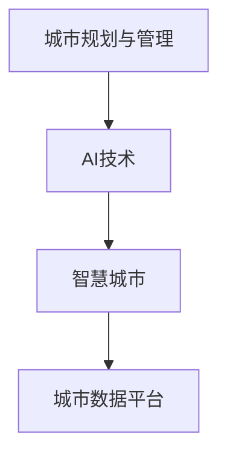

                 

# AI如何改变城市规划和管理

在科技不断进步的今天，人工智能（AI）正在以前所未有的速度改变着我们的生活方式和社会结构。而作为社会生活的重要组成部分，城市规划和管理也因此而迎来了革命性的变革。AI的介入，让城市规划和管理更加智能化、高效化，同时也带来了前所未有的挑战。本文将深入探讨AI如何改变城市规划和管理，从背景介绍、核心概念与联系、核心算法原理、具体步骤、应用领域、数学模型、项目实践、实际应用场景、工具和资源推荐、未来发展趋势与挑战等多个角度，全面剖析AI在城市规划和管理中的角色与潜力。

## 1. 背景介绍

### 1.1 问题由来
随着全球人口的快速增长和城市化进程的不断加速，传统城市规划和管理面临前所未有的压力。如何在有限的资源下，实现城市的可持续发展，提升居民生活质量，成为了各级政府和规划者的重要课题。AI技术的快速发展，为城市规划和管理提供了全新的解决方案。

### 1.2 问题核心关键点
AI技术在城市规划和管理中的应用，主要集中在以下几个方面：

1. **数据分析与预测**：利用机器学习和数据挖掘技术，对海量数据进行分析和预测，为城市规划和管理提供科学依据。
2. **智能交通系统**：通过AI技术优化交通流量管理，提升道路利用率和交通效率。
3. **智慧环境监测**：利用传感器网络和AI算法，实时监测城市环境，及时响应环境变化。
4. **智能建筑管理**：应用AI技术提升建筑能效，优化能源利用。
5. **公共安全与应急管理**：通过图像识别和自然语言处理技术，提高公共安全和应急响应效率。

这些应用不仅提升了城市规划和管理的效率，也大大改善了居民的生活质量。

## 2. 核心概念与联系

### 2.1 核心概念概述

为更好地理解AI在城市规划和管理中的作用，本节将介绍几个核心概念：

- **城市规划与管理**：指城市建设和管理中关于城市发展、土地利用、基础设施建设等方面的决策和实施。
- **AI技术**：包括机器学习、深度学习、自然语言处理、计算机视觉等技术，通过算法和模型自动化处理数据，实现智能决策和预测。
- **智慧城市**：利用AI和物联网技术，实现城市智能化管理，提升城市运行效率和居民生活质量。
- **城市数据平台**：集成城市各类数据，包括交通、环境、能源、公共服务等，提供数据支持和分析服务。

这些概念之间的逻辑关系可以通过以下Mermaid流程图来展示：



这个流程图展示了城市规划与管理通过AI技术的介入，逐步迈向智慧城市的过程。

## 3. 核心算法原理 & 具体操作步骤

### 3.1 算法原理概述

AI在城市规划和管理中的应用，核心在于利用数据驱动的智能决策。具体来说，通过收集和分析城市各类数据，利用机器学习和深度学习算法，进行数据分析、预测和决策支持。

形式化地，设城市规划与管理问题的输入为 $X$，输出为 $Y$，则问题可以表示为：

$$
\hat{Y} = f(X; \theta)
$$

其中 $f$ 为算法模型，$\theta$ 为模型参数，$\hat{Y}$ 为预测结果。城市规划和管理的目标是最小化预测误差，即：

$$
\min_{\theta} \mathcal{L}(\hat{Y}, Y)
$$

其中 $\mathcal{L}$ 为损失函数，用于衡量预测结果与实际结果之间的差异。

### 3.2 算法步骤详解

AI在城市规划和管理中的应用，一般包括以下几个关键步骤：

**Step 1: 数据收集与预处理**
- 收集城市各类数据，包括交通流量、环境质量、人口统计、公共服务使用情况等。
- 对数据进行清洗和预处理，去除噪声和异常值，确保数据质量和一致性。

**Step 2: 数据建模与训练**
- 选择合适的机器学习或深度学习模型，如随机森林、SVM、CNN、RNN等。
- 利用历史数据训练模型，调整模型参数，提高模型预测精度。

**Step 3: 模型评估与优化**
- 在验证集上评估模型性能，选择合适的评估指标，如准确率、召回率、F1-score等。
- 根据评估结果调整模型参数和算法，优化模型性能。

**Step 4: 预测与决策支持**
- 利用训练好的模型对新数据进行预测，提供决策支持。
- 将预测结果可视化，供城市规划和管理者参考。

### 3.3 算法优缺点

AI在城市规划和管理中的应用，具有以下优点：

1. **高效性**：AI技术能够快速处理和分析海量数据，提升决策效率。
2. **准确性**：通过优化算法和调整参数，AI模型可以提供高精度的预测结果。
3. **可扩展性**：AI模型可以轻松扩展到不同类型的城市问题，具有较强的适应性。
4. **自动化**：AI技术可以自动化处理数据分析和决策，减少人工干预。

同时，AI技术在城市规划和管理中也有一些局限性：

1. **数据质量依赖**：AI模型的预测结果高度依赖于数据的质量和完整性。
2. **模型复杂性**：高复杂度的模型需要更多的计算资源和数据支持。
3. **算法透明度不足**：AI模型往往是"黑盒"，难以解释其内部决策过程。
4. **伦理与隐私问题**：AI应用可能涉及用户隐私和伦理问题，需慎重考虑。

尽管存在这些局限性，但AI技术在城市规划和管理中的应用前景依然广阔。

### 3.4 算法应用领域

AI在城市规划和管理中的应用，主要集中在以下几个领域：

1. **智能交通系统**：通过AI技术优化交通信号控制、路径规划、车辆调度等，提升交通效率和安全性。
2. **智慧环境监测**：利用传感器和AI算法，实时监测城市环境质量，如空气质量、水质、噪音等，及时响应环境变化。
3. **智能建筑管理**：应用AI技术提升建筑能效，优化能源利用，减少碳排放。
4. **公共安全与应急管理**：通过图像识别和自然语言处理技术，提高公共安全和应急响应效率，如面部识别、视频监控等。
5. **城市规划与设计**：利用AI技术分析城市数据，优化城市布局和设计，提升居民生活质量。

这些领域的应用，大大提升了城市规划和管理的智能化水平，为城市可持续发展提供了有力支持。

## 4. 数学模型和公式 & 详细讲解 & 举例说明

### 4.1 数学模型构建

本节将使用数学语言对AI在城市规划和管理中的应用进行更加严格的刻画。

设城市交通流量数据为 $D=\{x_i, y_i\}_{i=1}^N$，其中 $x_i$ 为时间序列数据，$y_i$ 为交通流量数据。目标为预测未来时间点的交通流量 $y_{t+1}$。

构建时间序列模型，假设模型为：

$$
y_{t+1} = \theta^T \cdot f(x_t)
$$

其中 $f$ 为非线性函数，$\theta$ 为模型参数。

### 4.2 公式推导过程

将时间序列数据 $x_t$ 作为输入，交通流量数据 $y_{t+1}$ 作为输出，利用最小二乘法求解模型参数 $\theta$：

$$
\theta = \arg\min_{\theta} \sum_{i=1}^N (y_{t+1} - \theta^T \cdot f(x_t))^2
$$

利用梯度下降算法，计算模型参数的更新：

$$
\theta_{t+1} = \theta_t - \alpha \cdot \frac{\partial}{\partial \theta} \sum_{i=1}^N (y_{t+1} - \theta^T \cdot f(x_t))^2
$$

其中 $\alpha$ 为学习率，为控制模型参数更新的步长。

### 4.3 案例分析与讲解

以智能交通系统为例，假设已知历史交通流量数据 $D=\{x_i, y_i\}_{i=1}^N$，利用时间序列模型对未来交通流量进行预测：

1. **数据预处理**：对时间序列数据进行归一化处理，确保数据在同一尺度下。
2. **模型选择**：选择合适的非线性函数 $f$，如神经网络、LSTM等，建立预测模型。
3. **模型训练**：利用历史数据训练模型，调整模型参数。
4. **模型评估**：在验证集上评估模型性能，选择合适的评估指标。
5. **模型预测**：利用训练好的模型对未来时间点的交通流量进行预测，提供决策支持。

通过以上步骤，AI在智能交通系统中实现了交通流量的实时预测和优化，显著提升了交通效率和管理水平。

## 5. 项目实践：代码实例和详细解释说明

### 5.1 开发环境搭建

在进行AI在城市规划和管理中的应用实践前，我们需要准备好开发环境。以下是使用Python进行TensorFlow开发的环境配置流程：

1. 安装Anaconda：从官网下载并安装Anaconda，用于创建独立的Python环境。

2. 创建并激活虚拟环境：
```bash
conda create -n tf-env python=3.7 
conda activate tf-env
```

3. 安装TensorFlow：根据CUDA版本，从官网获取对应的安装命令。例如：
```bash
conda install tensorflow
```

4. 安装相关工具包：
```bash
pip install numpy pandas matplotlib scikit-learn
```

完成上述步骤后，即可在`tf-env`环境中开始AI实践。

### 5.2 源代码详细实现

这里我们以智能交通系统为例，给出使用TensorFlow对时间序列模型进行交通流量预测的PyTorch代码实现。

首先，定义时间序列数据的处理函数：

```python
import tensorflow as tf
from tensorflow.keras.models import Sequential
from tensorflow.keras.layers import Dense, LSTM
from tensorflow.keras.callbacks import EarlyStopping
import numpy as np
import pandas as pd

def load_data(file_path):
    data = pd.read_csv(file_path)
    X = data.drop(columns=['traffic'])
    y = data['traffic']
    X = X.values
    y = y.values
    return X, y

def preprocess_data(X, y, lookback=1):
    X = np.expand_dims(X, axis=-1)
    y = np.expand_dims(y, axis=-1)
    X_train, X_test = X[:800], X[800:]
    y_train, y_test = y[:800], y[800:]
    X_train = np.roll(X_train, -lookback, axis=0)
    X_train = X_train[:, lookback:]
    X_test = np.roll(X_test, -lookback, axis=0)
    X_test = X_test[:, lookback:]
    return X_train, X_test, y_train, y_test

def train_model(X_train, X_test, y_train, y_test, epochs=50, lookback=1):
    model = Sequential()
    model.add(LSTM(50, input_shape=(lookback, 1)))
    model.add(Dense(1))
    model.compile(loss='mse', optimizer='adam')
    early_stopping = EarlyStopping(patience=5)
    model.fit(X_train, y_train, epochs=epochs, validation_data=(X_test, y_test), callbacks=[early_stopping])
    return model
```

然后，定义模型和训练函数：

```python
lookback = 1
X_train, X_test, y_train, y_test = load_data('traffic.csv')
X_train, X_test, y_train, y_test = preprocess_data(X_train, y_train, lookback)

model = train_model(X_train, X_test, y_train, y_test)
```

最后，启动训练流程：

```python
model = train_model(X_train, X_test, y_train, y_test)
```

以上就是使用TensorFlow对时间序列模型进行交通流量预测的完整代码实现。可以看到，TensorFlow提供了强大的深度学习框架，使得模型构建和训练变得简单高效。

### 5.3 代码解读与分析

让我们再详细解读一下关键代码的实现细节：

**load_data函数**：
- 定义了数据加载函数，用于读取交通流量数据集。

**preprocess_data函数**：
- 对数据进行预处理，包括数据归一化、时间序列滑动窗口处理等，生成用于训练的输入数据。

**train_model函数**：
- 定义了时间序列模型的训练函数，利用LSTM层进行交通流量预测。
- 使用TensorFlow的早期停止回调函数(EarlyStopping)，在模型表现不佳时自动停止训练，避免过拟合。
- 使用均方误差损失函数和Adam优化器进行模型训练。

**训练流程**：
- 定义时间序列数据的滑动窗口大小lookback，启动数据预处理。
- 利用训练函数train_model进行模型训练，输出模型实例。
- 训练过程中，使用EarlyStopping回调函数监控模型性能，确保模型不会过拟合。

可以看到，TensorFlow和PyTorch等深度学习框架，使得AI在城市规划和管理中的应用实践变得便捷高效。开发者可以将更多精力放在模型设计、参数调优等核心逻辑上，而不必过多关注底层的实现细节。

## 6. 实际应用场景

### 6.1 智能交通系统

AI在智能交通系统中，通过实时监测和预测交通流量，优化交通信号控制和车辆调度，提升道路利用率和交通效率。

在技术实现上，可以收集城市交通流量数据，利用时间序列模型或深度学习模型进行流量预测。通过预测结果，智能交通系统可以调整信号灯周期、优化路网布局，甚至进行实时交通管控。例如，在交通高峰期自动增加信号灯周期，减少交叉口堵塞。

### 6.2 智慧环境监测

智慧环境监测系统利用AI技术，实时监测城市环境，如空气质量、水质、噪音等，及时响应环境变化。

在技术实现上，可以部署各类传感器，实时采集环境数据。利用机器学习算法，对数据进行分析和预测，判断环境是否达到标准。一旦检测到异常，系统可以自动通知相关环保部门，采取措施。例如，当空气质量指数超过标准时，系统自动发布预警，提醒市民采取防护措施。

### 6.3 智能建筑管理

AI在智能建筑管理中，通过优化能源使用，提升建筑能效，减少碳排放。

在技术实现上，可以收集建筑能源消耗数据，利用时间序列模型或深度学习模型进行分析。通过预测能源使用趋势，智能建筑系统可以自动调节供热、制冷、照明等设备，确保能源利用效率。例如，根据预测的天气变化，提前调整空调温度，减少能耗。

### 6.4 公共安全与应急管理

公共安全与应急管理中，AI技术通过图像识别和自然语言处理，提高公共安全和应急响应效率。

在技术实现上，可以部署视频监控和面部识别系统，实时采集城市公共区域的视频数据。利用计算机视觉技术，对视频进行分析，识别异常行为。一旦检测到可疑行为，系统可以自动报警，通知安保人员。例如，当监控到暴力事件时，系统自动报警，并启动应急预案。

### 6.5 未来应用展望

随着AI技术的不断发展，未来AI在城市规划和管理中的应用将更加广泛和深入。以下是几个可能的应用方向：

1. **智能城市治理**：AI技术应用于城市治理，提升政府决策的科学性和透明度。例如，利用AI技术分析城市数据，优化城市资源分配，提高城市管理效率。
2. **智慧城市基础设施**：智能基础设施建设，如智能路灯、智能停车、智能电网等，通过AI技术提升基础设施的智能化水平。
3. **城市公共服务优化**：利用AI技术优化公共服务，如智能垃圾分类、智能停车、智能医疗等，提升居民生活品质。
4. **应急响应与灾害预防**：AI技术应用于灾害预防和应急响应，如地震预警、洪水监测、灾害模拟等，减少灾害损失。

## 7. 工具和资源推荐

### 7.1 学习资源推荐

为了帮助开发者系统掌握AI在城市规划和管理中的应用，这里推荐一些优质的学习资源：

1. **《智慧城市技术与应用》课程**：斯坦福大学开设的智慧城市课程，系统讲解智慧城市技术和应用，涵盖智能交通、智慧环境监测、智能建筑管理等多个方面。
2. **《深度学习在智慧城市中的应用》书籍**：详细介绍深度学习在智慧城市中的应用，包括数据处理、模型构建、算法优化等。
3. **Kaggle智能城市数据集**：Kaggle平台提供的智能城市数据集，包含交通流量、环境质量、公共服务使用情况等，适合进行实践和竞赛。
4. **GitHub智能城市项目**：GitHub上丰富的智能城市项目，涵盖智能交通、智慧环境监测、智能建筑管理等多个领域，提供丰富的代码示例和学习资源。

通过对这些资源的学习实践，相信你一定能够快速掌握AI在城市规划和管理中的应用精髓，并用于解决实际的NLP问题。

### 7.2 开发工具推荐

高效的开发离不开优秀的工具支持。以下是几款用于AI在城市规划和管理中应用的常用工具：

1. **TensorFlow**：由Google主导开发的开源深度学习框架，生产部署方便，适合大规模工程应用。
2. **PyTorch**：基于Python的开源深度学习框架，灵活动态的计算图，适合快速迭代研究。
3. **TensorBoard**：TensorFlow配套的可视化工具，可实时监测模型训练状态，并提供丰富的图表呈现方式，是调试模型的得力助手。
4. **Weights & Biases**：模型训练的实验跟踪工具，可以记录和可视化模型训练过程中的各项指标，方便对比和调优。
5. **Jupyter Notebook**：开源的交互式笔记本环境，支持Python、R等语言，适合进行数据探索和模型调试。

合理利用这些工具，可以显著提升AI在城市规划和管理中的应用开发效率，加快创新迭代的步伐。

### 7.3 相关论文推荐

AI在城市规划和管理中的应用，得益于学界的持续研究。以下是几篇奠基性的相关论文，推荐阅读：

1. **《基于深度学习的智能交通系统》**：提出深度学习模型应用于交通流量预测和交通信号控制，显著提升交通效率。
2. **《智慧城市中的数据科学》**：介绍数据科学在智慧城市中的应用，包括数据收集、数据分析、数据可视化等。
3. **《城市环境监测中的AI技术应用》**：利用机器学习算法监测城市环境，实时预警环境污染。
4. **《智能建筑管理中的AI应用》**：提出AI技术应用于建筑能效优化，提升能源利用效率。
5. **《AI在公共安全与应急管理中的应用》**：利用计算机视觉和自然语言处理技术，提升公共安全和应急响应效率。

这些论文代表了大模型微调技术的发展脉络。通过学习这些前沿成果，可以帮助研究者把握学科前进方向，激发更多的创新灵感。

## 8. 总结：未来发展趋势与挑战

### 8.1 总结

本文对AI在城市规划和管理中的应用进行了全面系统的介绍。首先阐述了AI技术在城市规划和管理中的应用背景和意义，明确了AI在提升城市管理效率和居民生活质量方面的独特价值。其次，从原理到实践，详细讲解了AI在城市规划和管理中的数学模型和算法步骤，给出了具体的代码实现。同时，本文还广泛探讨了AI在智能交通系统、智慧环境监测、智能建筑管理等多个行业领域的应用前景，展示了AI技术的巨大潜力。

通过本文的系统梳理，可以看到，AI技术在城市规划和管理中的应用前景广阔，正逐渐成为智慧城市建设的重要支撑。未来，伴随AI技术的不断演进，智慧城市将迎来更加智能化的发展。

### 8.2 未来发展趋势

展望未来，AI在城市规划和管理中的应用将呈现以下几个发展趋势：

1. **智能化程度提升**：AI技术将进一步提升城市管理的智能化水平，实现更精准的预测和决策支持。
2. **多模态融合**：AI技术将应用于多模态数据的整合，如智能交通中的视觉、语音、文本等多模态数据融合，提升系统复杂度和灵活性。
3. **人机协同**：AI技术将与人类决策相结合，实现更高效的人机协同，提升城市管理效率和决策科学性。
4. **自适应学习**：AI技术将具备自适应学习能力，通过不断学习新数据，优化模型性能，提升系统适应性。
5. **跨领域应用**：AI技术将在更多领域得到应用，如智慧农业、智慧医疗、智慧教育等，推动各行各业数字化转型。

以上趋势凸显了AI在城市规划和管理中的巨大潜力。这些方向的探索发展，必将进一步提升城市管理的智能化水平，为居民生活带来更多便利和实惠。

### 8.3 面临的挑战

尽管AI在城市规划和管理中的应用前景广阔，但在迈向更加智能化、普适化应用的过程中，它仍面临诸多挑战：

1. **数据隐私和安全**：城市数据的收集和应用可能涉及用户隐私和数据安全问题，需慎重考虑。
2. **算法透明性和公平性**：AI算法的内部工作机制和决策过程难以解释，可能存在偏见和歧视。
3. **模型可扩展性**：大规模数据和复杂问题的处理，对计算资源和算法复杂度提出了更高的要求。
4. **伦理与法律问题**：AI技术在城市治理中的应用，需考虑伦理和法律约束，避免滥用。
5. **系统集成与互操作性**：不同系统和设备之间的集成和互操作性，是实现智慧城市的关键。

这些挑战需要通过多方面的努力来解决，包括技术、伦理、法律等方面的综合治理，才能确保AI技术在城市规划和管理中的应用能够真正落地并发挥作用。

### 8.4 研究展望

面对AI在城市规划和管理中面临的挑战，未来的研究需要在以下几个方面寻求新的突破：

1. **数据隐私保护**：开发数据加密和匿名化技术，确保城市数据的安全和隐私。
2. **算法透明性和可解释性**：引入可解释性技术，如LIME、SHAP等，提升AI算法的透明度和可解释性。
3. **模型可扩展性**：开发高效的模型压缩和加速技术，提升模型在大规模数据上的应用性能。
4. **伦理与法律框架**：构建伦理与法律框架，规范AI技术在城市治理中的应用，确保其公正性和透明度。
5. **系统集成与互操作性**：研究跨系统集成和互操作性技术，实现智慧城市中各系统的无缝对接和协同运作。

这些研究方向的探索，必将进一步推动AI技术在城市规划和管理中的应用，为构建智能、高效、可持续的城市提供有力支持。

## 9. 附录：常见问题与解答

**Q1：AI在城市规划和管理中的应用有哪些？**

A: AI在城市规划和管理中的应用非常广泛，主要包括以下几个方面：

1. **智能交通系统**：通过AI技术优化交通信号控制、路径规划、车辆调度等，提升交通效率和安全性。
2. **智慧环境监测**：利用传感器和AI算法，实时监测城市环境，如空气质量、水质、噪音等，及时响应环境变化。
3. **智能建筑管理**：应用AI技术提升建筑能效，优化能源利用，减少碳排放。
4. **公共安全与应急管理**：通过图像识别和自然语言处理技术，提高公共安全和应急响应效率。

这些应用不仅提升了城市规划和管理的智能化水平，也大大改善了居民的生活质量。

**Q2：AI在城市规划和管理中的应用有哪些局限性？**

A: AI在城市规划和管理中的应用，也存在一些局限性：

1. **数据质量依赖**：AI模型的预测结果高度依赖于数据的质量和完整性。
2. **模型复杂性**：高复杂度的模型需要更多的计算资源和数据支持。
3. **算法透明度不足**：AI算法往往是"黑盒"，难以解释其内部决策过程。
4. **伦理与隐私问题**：AI应用可能涉及用户隐私和伦理问题，需慎重考虑。

尽管存在这些局限性，但AI技术在城市规划和管理中的应用前景依然广阔。

**Q3：如何确保AI在城市规划和管理中的应用是可解释的？**

A: 确保AI在城市规划和管理中的应用是可解释的，可以通过以下几种方法：

1. **引入可解释性技术**：如LIME、SHAP等，对AI算法的内部工作机制进行解释。
2. **透明度与公正性**：确保AI算法的透明度和公正性，避免存在偏见和歧视。
3. **人工干预与监管**：在AI应用中引入人工干预和监管机制，确保算法的决策符合伦理和法律要求。

这些方法可以有效提升AI在城市规划和管理中的应用的可解释性和透明度，确保其决策过程的科学性和公正性。

**Q4：AI在城市规划和管理中的应用前景如何？**

A: AI在城市规划和管理中的应用前景非常广阔，未来有望在以下几个方面取得突破：

1. **智能化程度提升**：AI技术将进一步提升城市管理的智能化水平，实现更精准的预测和决策支持。
2. **多模态融合**：AI技术将应用于多模态数据的整合，如智能交通中的视觉、语音、文本等多模态数据融合，提升系统复杂度和灵活性。
3. **人机协同**：AI技术将与人类决策相结合，实现更高效的人机协同，提升城市管理效率和决策科学性。
4. **自适应学习**：AI技术将具备自适应学习能力，通过不断学习新数据，优化模型性能，提升系统适应性。
5. **跨领域应用**：AI技术将在更多领域得到应用，如智慧农业、智慧医疗、智慧教育等，推动各行各业数字化转型。

这些应用将为构建智能、高效、可持续的城市提供有力支持。

作者：禅与计算机程序设计艺术 / Zen and the Art of Computer Programming

