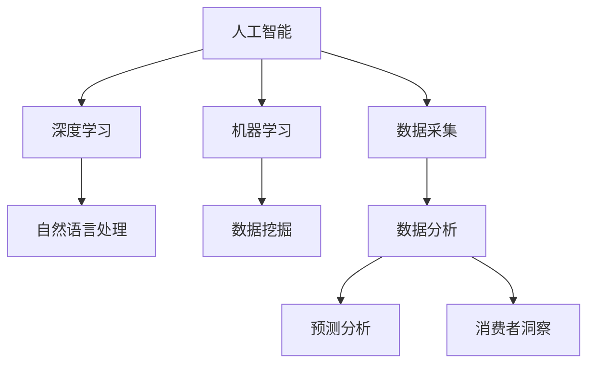

                 

# AI如何改变市场调研方法

在数字化转型的浪潮中，市场调研作为企业决策的重要依据，面临着前所未有的挑战和机遇。人工智能技术的引入，尤其是机器学习和深度学习的进步，正在逐步改变传统市场调研的格局。本文将从背景介绍、核心概念、算法原理、应用实例等多个维度，探讨AI如何革新市场调研方法，为决策者提供更精准、更高效的洞见。

## 1. 背景介绍

### 1.1 问题由来
随着全球市场环境的快速变化，企业需要更加精细化、个性化的市场调研来应对竞争压力和消费者需求的多样化。传统的市场调研方法，如问卷调查、深度访谈等，耗时耗力，成本高昂，且受制于人为因素，结果可靠性难以保证。人工智能技术的进步，尤其是机器学习和大数据技术的发展，为市场调研提供了新的思路和方法，使得调研过程更加高效、准确。

### 1.2 问题核心关键点
AI在市场调研中的应用主要包括以下几个方面：
- **数据采集自动化**：通过爬虫和自动化工具，实时抓取和分析网络上的用户行为数据，如社交媒体评论、电商平台销售数据等。
- **数据分析智能化**：运用机器学习和深度学习算法，从海量数据中自动提取有价值的信息，挖掘潜在规律。
- **预测分析精准化**：基于历史数据和用户行为预测未来市场趋势，为企业决策提供有力支持。
- **消费者洞察深化**：通过文本分析和情感识别等技术，深入理解消费者需求和偏好，提升产品和服务的设计质量。

这些关键点反映了AI技术在市场调研中的潜力和应用前景，同时也指明了未来研究的重点方向。

## 2. 核心概念与联系

### 2.1 核心概念概述

为更好地理解AI在市场调研中的应用，本节将介绍几个密切相关的核心概念：

- **人工智能(AI)**：指利用计算机模拟人类的智能行为，包括学习、推理、感知、自然语言处理等。AI技术通过算法和模型，从数据中提取知识，辅助人类决策。
- **机器学习(Machine Learning, ML)**：一种数据驱动的模型训练方法，通过给定输入数据和输出标签，让机器从数据中学习规律，并用于预测和决策。
- **深度学习(Deep Learning, DL)**：机器学习的一个分支，通过多层神经网络模型，自动学习和提取数据中的高层次特征，适用于复杂、大规模数据的处理。
- **自然语言处理(Natural Language Processing, NLP)**：研究如何让计算机理解和生成自然语言，如文本分类、情感分析、文本生成等。
- **数据挖掘(Data Mining)**：从大规模数据集中自动发现有用模式和知识的过程，包括关联规则、聚类、分类等。

这些核心概念之间的逻辑关系可以通过以下Mermaid流程图来展示：



这个流程图展示了大语言模型核心概念及其之间的关系：

1. 人工智能通过机器学习、深度学习等方法，从数据中学习知识，辅助人类决策。
2. 数据采集、数据分析、预测分析和消费者洞察等过程，都离不开自然语言处理和数据挖掘技术的支持。
3. 数据采集是人工智能的基础，数据分析和消费者洞察是人工智能应用的核心。
4. 预测分析将知识应用于未来趋势预测，为决策提供依据。

## 3. 核心算法原理 & 具体操作步骤

### 3.1 算法原理概述

AI在市场调研中的应用，主要是通过数据驱动的机器学习和深度学习算法，从海量数据中提取有用信息，预测市场趋势，深化消费者洞察。

以情感分析为例，算法原理可以概括为以下几步：
1. **数据准备**：收集社交媒体、评论、用户反馈等文本数据。
2. **特征提取**：使用NLP技术将文本转化为模型可以处理的特征向量。
3. **模型训练**：使用监督学习算法，如支持向量机、神经网络等，训练情感分类模型。
4. **模型评估**：在验证集上评估模型性能，调整参数，提升准确率。
5. **应用部署**：将训练好的模型应用于实时数据流，分析用户情感变化趋势。

### 3.2 算法步骤详解

以下我们以情感分析为例，详细讲解情感分析算法的具体步骤：

**Step 1: 数据收集**
- 使用网络爬虫和API接口，获取社交媒体、电商平台等数据源的评论、反馈文本。
- 清理和标注数据，去除无关信息，标准化格式。

**Step 2: 数据预处理**
- 使用分词工具将文本分解为词汇，去除停用词和标点符号。
- 进行词性标注和命名实体识别，提取关键词。
- 将文本转化为向量表示，如TF-IDF、词嵌入等。

**Step 3: 特征工程**
- 对文本特征进行归一化和标准化，防止过拟合。
- 使用词袋模型、TF-IDF等方法将文本转化为数值特征向量。
- 加入上下文信息，如时间戳、评论类型等。

**Step 4: 模型训练**
- 使用监督学习算法，如支持向量机、随机森林等，构建情感分类模型。
- 使用交叉验证等方法，调整模型参数，提升模型性能。
- 使用梯度下降等优化算法，最小化损失函数，训练模型。

**Step 5: 模型评估**
- 在验证集上测试模型性能，使用准确率、召回率、F1-score等指标评估模型效果。
- 进行超参数调优，如调整学习率、正则化强度等。
- 使用混淆矩阵等工具分析模型误差，识别改进方向。

**Step 6: 应用部署**
- 将训练好的模型部署到实时数据流中，使用API接口接收新评论数据。
- 模型对新评论进行情感分析，输出情感类别和置信度。
- 结合其他数据源信息，进行综合分析，生成情感趋势报告。

### 3.3 算法优缺点

AI在市场调研中的应用，具有以下优点：
1. **高效性**：AI算法可以自动化数据处理和分析过程，大幅缩短调研周期，提高效率。
2. **全面性**：AI可以从海量数据中提取有用信息，涵盖社交媒体、电商平台等多种数据源。
3. **精准性**：深度学习等高级算法能够挖掘数据中的深层次特征，提供更精准的分析结果。
4. **可扩展性**：AI算法具有高度可扩展性，可以轻松集成到现有市场调研流程中，提升整体决策水平。

同时，该方法也存在一些局限性：
1. **数据质量依赖**：AI算法的效果高度依赖数据的质量和数量，低质量数据会影响模型性能。
2. **解释性不足**：AI模型通常是"黑盒"系统，难以解释其内部工作机制和决策逻辑。
3. **技术门槛高**：AI算法需要一定的技术储备和数据处理能力，普通企业可能难以快速部署。
4. **隐私问题**：在处理敏感数据时，需要考虑隐私保护和数据安全，避免泄露用户隐私。

尽管存在这些局限性，但AI技术在市场调研中的应用前景广阔，正逐步成为企业决策的重要工具。

### 3.4 算法应用领域

AI在市场调研中的应用广泛，涵盖多个领域：

1. **消费者洞察**：通过情感分析、文本挖掘等技术，深入理解消费者需求和偏好，优化产品设计和服务。
2. **市场趋势预测**：使用时间序列分析和机器学习算法，预测未来市场趋势，制定战略规划。
3. **竞争对手分析**：收集竞争对手的社交媒体数据，分析其市场表现和用户反馈，制定竞争策略。
4. **品牌监测**：实时监控社交媒体和新闻媒体，评估品牌声誉和市场表现，提升品牌形象。
5. **营销效果评估**：分析广告投放和营销活动的效果，优化投放策略和预算分配。
6. **用户细分**：使用聚类算法和分类算法，细分目标用户群体，提升营销活动的精准性。

以上应用场景展示了AI技术在市场调研中的广泛适用性，能够从多个维度提升企业的市场决策能力。

## 4. 数学模型和公式 & 详细讲解 & 举例说明

### 4.1 数学模型构建

情感分析的数学模型主要包括以下几个部分：

- **输入数据**：包含文本 $X$，情感标签 $Y$。
- **特征提取**：将文本 $X$ 转化为向量 $x$。
- **模型**：使用线性回归、支持向量机、神经网络等算法 $f$。
- **损失函数**：最小化模型预测误差 $L$。
- **优化算法**：使用梯度下降等优化算法更新模型参数。

以线性回归模型为例，情感分析的数学模型可以表示为：

$$
y = f(x; \theta) = \theta^T x + b
$$

其中 $\theta$ 为模型参数，$b$ 为偏置项。

### 4.2 公式推导过程

以下是线性回归模型的公式推导过程：

1. **假设模型**：假设模型为线性回归模型，形式为 $y = \theta^T x + b$，其中 $\theta$ 为模型参数，$b$ 为偏置项。
2. **损失函数**：定义均方误差损失函数 $L$：
$$
L(\theta) = \frac{1}{N} \sum_{i=1}^N (y_i - f(x_i; \theta))^2
$$
3. **优化目标**：最小化损失函数 $L(\theta)$，求解最优参数 $\hat{\theta}$：
$$
\hat{\theta} = \mathop{\arg\min}_{\theta} L(\theta)
$$
4. **求解过程**：使用梯度下降算法更新模型参数，最小化损失函数：
$$
\theta_{t+1} = \theta_t - \eta \nabla_{\theta}L(\theta)
$$

### 4.3 案例分析与讲解

以情感分析为例，下面以一个具体案例进行分析：

假设有一个电商平台，需要评估用户对某款产品的情感倾向。收集到1000条评论数据，每条评论包含一段文本描述和情感标签（正向或负向）。

**Step 1: 数据准备**
- 使用NLP工具对每条评论进行分词和去除停用词，得到词汇列表。
- 计算每个词汇的TF-IDF值，得到文本向量表示。

**Step 2: 特征工程**
- 使用朴素贝叶斯算法对文本向量进行分类，得到初步的情感分类结果。
- 结合其他特征，如评论时间、评分等，进一步优化模型。

**Step 3: 模型训练**
- 使用梯度下降算法训练线性回归模型，最小化损失函数。
- 在验证集上评估模型性能，调整模型参数，提升准确率。

**Step 4: 模型评估**
- 使用混淆矩阵等工具分析模型误差，识别改进方向。
- 使用ROC曲线等工具评估模型性能。

## 5. 项目实践：代码实例和详细解释说明

### 5.1 开发环境搭建

在进行情感分析实践前，我们需要准备好开发环境。以下是使用Python进行PyTorch开发的环境配置流程：

1. 安装Anaconda：从官网下载并安装Anaconda，用于创建独立的Python环境。

2. 创建并激活虚拟环境：
```bash
conda create -n pytorch-env python=3.8 
conda activate pytorch-env
```

3. 安装PyTorch：根据CUDA版本，从官网获取对应的安装命令。例如：
```bash
conda install pytorch torchvision torchaudio cudatoolkit=11.1 -c pytorch -c conda-forge
```

4. 安装Natural Language Toolkit(NLP)：
```bash
pip install nltk
```

5. 安装TensorFlow：由Google主导开发的开源深度学习框架，生产部署方便，适合大规模工程应用。同样有丰富的预训练语言模型资源。
```bash
pip install tensorflow
```

6. 安装Pandas：用于数据处理和分析的Python库。
```bash
pip install pandas
```

7. 安装Matplotlib：用于绘制图表的Python库。
```bash
pip install matplotlib
```

完成上述步骤后，即可在`pytorch-env`环境中开始情感分析实践。

### 5.2 源代码详细实现

下面以一个简单的情感分析模型为例，给出使用PyTorch和NLP库进行情感分析的代码实现。

```python
import torch
from sklearn.feature_extraction.text import TfidfVectorizer
from sklearn.linear_model import LogisticRegression
from sklearn.metrics import classification_report
from nltk.corpus import stopwords
from nltk.tokenize import word_tokenize

# 加载数据
data = {
    'x': [
        'I love this product, it works great',
        'I hate this product, it's a waste of money',
        'This product is just okay, not bad but not great'
    ],
    'y': [1, 0, 1]  # 1为正向情感，0为负向情感
}

# 分词和停用词过滤
stop_words = set(stopwords.words('english'))
def tokenize(text):
    tokens = word_tokenize(text)
    tokens = [token.lower() for token in tokens if token not in stop_words]
    return tokens

# 构建TF-IDF特征向量
vectorizer = TfidfVectorizer(tokenizer=tokenize)
X = vectorizer.fit_transform(data['x'])

# 训练逻辑回归模型
model = LogisticRegression()
model.fit(X, data['y'])

# 预测新数据
new_data = ['This product is amazing', 'I don\'t recommend this product at all']
new_X = vectorizer.transform(new_data)
predictions = model.predict_proba(new_X)
```

### 5.3 代码解读与分析

让我们再详细解读一下关键代码的实现细节：

**tokenize函数**：
- 定义了分词和停用词过滤的函数，将文本转化为小写，去除停用词，保留有用信息。

**TF-IDF特征向量**：
- 使用NLP库的TfidfVectorizer对文本进行特征提取，生成TF-IDF特征向量。

**逻辑回归模型训练**：
- 使用scikit-learn库的LogisticRegression模型进行情感分类，最小化损失函数，得到最优模型参数。

**模型预测**：
- 使用训练好的模型对新数据进行情感预测，输出概率分布。

## 6. 实际应用场景

### 6.1 电商品牌监测

电商品牌的声誉和市场表现，直接影响到消费者的购买决策。使用情感分析算法，对社交媒体和评论数据进行实时监控，评估品牌声誉和市场表现，能够及时发现和应对负面信息，提升品牌形象。

在技术实现上，可以部署自动爬虫，实时抓取各大社交媒体平台上的用户评论和反馈，结合情感分析算法，自动生成情感报告。对于负面的评论和反馈，及时进行公关处理和品牌危机管理，提升品牌美誉度。

### 6.2 社交媒体情感分析

社交媒体是用户表达情感的重要平台。通过情感分析算法，对社交媒体上的用户评论和帖子进行情感分类，能够深入了解用户情绪和需求，为市场营销和产品设计提供有力支撑。

具体而言，可以部署爬虫，自动抓取各大社交媒体平台上的用户评论和帖子，使用情感分析算法，自动分类情感类别。对于正面的评论和帖子，及时进行点赞、转发等互动；对于负面的评论和帖子，及时进行回应和处理，提升用户满意度。

### 6.3 市场趋势预测

市场趋势预测是企业制定战略规划的重要依据。使用时间序列分析和情感分析算法，对历史数据进行建模，预测未来市场趋势，能够为企业提供有力的决策支持。

具体而言，可以使用情感分析算法，对用户评论和反馈进行情感分类，提取市场情感变化趋势。结合时间序列分析，预测未来市场走势，指导企业的生产和营销策略。

### 6.4 竞争对手分析

在竞争激烈的市场中，了解竞争对手的表现和用户反馈，对于制定竞争策略至关重要。使用情感分析算法，对竞争对手的社交媒体和评论数据进行情感分析，能够深入了解竞争对手的市场表现和用户反馈，制定更有效的竞争策略。

具体而言，可以部署自动爬虫，实时抓取竞争对手的社交媒体数据和评论数据，使用情感分析算法，自动分类情感类别。分析竞争对手的市场表现和用户反馈，制定更有效的竞争策略，提升市场竞争力。

## 7. 工具和资源推荐

### 7.1 学习资源推荐

为了帮助开发者系统掌握情感分析的理论基础和实践技巧，这里推荐一些优质的学习资源：

1. 《深度学习入门：基于Python的理论与实现》系列博文：由大模型技术专家撰写，深入浅出地介绍了深度学习在NLP领域的应用，包括情感分析等。

2. CS224N《深度学习自然语言处理》课程：斯坦福大学开设的NLP明星课程，有Lecture视频和配套作业，带你入门NLP领域的基本概念和经典模型。

3. 《Natural Language Processing with Python》书籍：Python的NLP开发指南，介绍了NLP库的使用和情感分析等任务。

4. HuggingFace官方文档：NLP工具库的官方文档，提供了海量预训练模型和完整的情感分析样例代码，是上手实践的必备资料。

5. Kaggle数据集：提供了丰富的NLP数据集，如情感分析、文本分类等，适合进行情感分析模型的竞赛和训练。

通过对这些资源的学习实践，相信你一定能够快速掌握情感分析的精髓，并用于解决实际的NLP问题。

### 7.2 开发工具推荐

高效的开发离不开优秀的工具支持。以下是几款用于情感分析开发的常用工具：

1. PyTorch：基于Python的开源深度学习框架，灵活动态的计算图，适合快速迭代研究。大部分预训练语言模型都有PyTorch版本的实现。

2. TensorFlow：由Google主导开发的开源深度学习框架，生产部署方便，适合大规模工程应用。同样有丰富的预训练语言模型资源。

3. NLTK库：Python的NLP库，提供了丰富的NLP工具和算法，适合进行情感分析等NLP任务的开发。

4. spaCy库：Python的NLP库，提供了高效的文本处理和情感分析功能，适合进行实时情感分析的开发。

5. Word2Vec：Google开发的词向量模型，能够将文本转化为数值向量，适合进行文本分类和情感分析等任务。

合理利用这些工具，可以显著提升情感分析任务的开发效率，加快创新迭代的步伐。

### 7.3 相关论文推荐

情感分析领域的研究已经相当丰富，以下是几篇奠基性的相关论文，推荐阅读：

1. "Sentiment Analysis with Deep Learning: A Survey"（深度学习情感分析综述）：介绍了深度学习在情感分析领域的应用和最新进展。

2. "A Survey on Sentiment Analysis"（情感分析综述）：系统介绍了情感分析的各类方法和应用，提供了丰富的文献资源。

3. "Emotion Recognition via Deep Learning"（基于深度学习的情感识别）：展示了深度学习在情感识别中的出色表现，提供了模型和算法优化方法。

4. "Opinion Mining and Sentiment Analysis"（意见挖掘和情感分析）：介绍了意见挖掘和情感分析的技术方法和应用场景，提供了丰富的案例和实践经验。

这些论文代表了大语言模型情感分析技术的发展脉络。通过学习这些前沿成果，可以帮助研究者把握学科前进方向，激发更多的创新灵感。

## 8. 总结：未来发展趋势与挑战

### 8.1 总结

本文对基于AI的情感分析方法进行了全面系统的介绍。首先阐述了情感分析在市场调研中的重要性，明确了AI技术在提升调研效率和效果方面的独特价值。其次，从原理到实践，详细讲解了情感分析的数学模型和算法步骤，给出了情感分析任务开发的完整代码实例。同时，本文还广泛探讨了情感分析方法在电商品牌监测、社交媒体情感分析、市场趋势预测等多个行业领域的应用前景，展示了情感分析范式的巨大潜力。此外，本文精选了情感分析技术的各类学习资源，力求为读者提供全方位的技术指引。

通过本文的系统梳理，可以看到，基于AI的情感分析方法正在成为市场调研的重要范式，极大地提升了调研效率和效果。未来，伴随情感分析技术的持续演进，基于AI的市场调研必将迎来更广阔的应用前景，为企业的决策提供更精准、更高效的洞见。

### 8.2 未来发展趋势

展望未来，情感分析技术将呈现以下几个发展趋势：

1. **多模态融合**：结合图像、语音等多模态数据，提升情感分析的准确性和鲁棒性。

2. **实时性增强**：使用流式数据处理和模型推理优化，提升情感分析的实时性。

3. **跨领域迁移**：将情感分析模型迁移到其他领域，如医疗、金融等，提升模型的普适性。

4. **情感计算融合**：结合生理信号、面部表情等生物特征，进行综合情感分析，提升分析结果的可靠性。

5. **隐私保护加强**：在情感分析过程中，注重用户隐私保护，避免数据泄露和滥用。

6. **模型可解释性提升**：提升情感分析模型的可解释性，使其输出更加透明，增强用户信任。

以上趋势凸显了情感分析技术的广阔前景。这些方向的探索发展，必将进一步提升情感分析模型的性能和应用范围，为市场调研提供更强大的技术支持。

### 8.3 面临的挑战

尽管情感分析技术已经取得了显著进展，但在迈向更加智能化、普适化应用的过程中，仍面临诸多挑战：

1. **数据质量瓶颈**：情感分析的效果高度依赖数据质量，低质量数据会导致模型性能下降。如何获取高质量的标注数据，仍然是一个难题。

2. **模型泛化能力不足**：情感分析模型往往对训练数据中的风格和语言差异敏感，泛化能力有限。如何在不同领域和语言环境中，提升模型的泛化能力，还需要进一步研究。

3. **技术复杂度高**：情感分析需要处理大规模文本数据，涉及NLP、机器学习等多个领域，技术门槛较高。如何简化技术复杂度，提升模型的易用性，还需要更多探索。

4. **隐私保护问题**：在情感分析过程中，需要保护用户隐私，避免敏感信息泄露。如何设计隐私保护机制，确保数据安全，还需要进一步研究。

5. **可解释性不足**：情感分析模型通常是"黑盒"系统，难以解释其内部工作机制和决策逻辑。如何提升模型的可解释性，增强用户信任，还需要更多技术支持。

尽管存在这些挑战，但情感分析技术在市场调研中的应用前景广阔，正逐步成为企业决策的重要工具。未来，随着技术的不断进步和应用场景的不断拓展，情感分析技术必将在更广泛的领域发挥其独特优势，为市场调研和决策提供更精准、更高效的洞见。

### 8.4 研究展望

面对情感分析技术所面临的种种挑战，未来的研究需要在以下几个方面寻求新的突破：

1. **无监督和半监督学习方法**：摆脱对大量标注数据的依赖，利用无监督和半监督学习方法，提升情感分析的效率和精度。

2. **多模态融合技术**：结合图像、语音等多模态数据，提升情感分析的准确性和鲁棒性，为市场调研提供更全面的洞见。

3. **跨领域迁移模型**：将情感分析模型迁移到其他领域，如医疗、金融等，提升模型的普适性和应用范围。

4. **实时情感分析技术**：使用流式数据处理和模型推理优化，提升情感分析的实时性，为市场调研提供即时洞见。

5. **隐私保护机制**：设计隐私保护机制，确保数据安全和用户隐私，提升用户信任和数据可靠性。

6. **模型可解释性研究**：提升情感分析模型的可解释性，使其输出更加透明，增强用户信任。

这些研究方向的探索，必将引领情感分析技术迈向更高的台阶，为市场调研提供更强大、更可靠的技术支持。面向未来，情感分析技术需要与其他AI技术进行更深入的融合，如知识表示、因果推理、强化学习等，多路径协同发力，共同推动市场调研的进步。只有勇于创新、敢于突破，才能不断拓展情感分析的边界，让AI技术更好地服务市场调研和决策。

## 9. 附录：常见问题与解答

**Q1：情感分析算法是否适用于所有行业和场景？**

A: 情感分析算法在大部分行业和场景中都有广泛的应用，如电商、金融、医疗等。但对于一些特定领域的任务，如法律、医学等，仅仅依靠通用语料预训练的模型可能难以很好地适应。此时需要在特定领域语料上进一步预训练，再进行微调，才能获得理想效果。此外，对于一些需要时效性、个性化很强的任务，如对话、推荐等，情感分析方法也需要针对性的改进优化。

**Q2：情感分析算法如何处理情感极性分类中的中性情感？**

A: 情感分析算法在处理情感极性分类时，通常将情感分为正向、负向和中性。中性情感是指文本表达的情感倾向不明显，难以准确分类。处理中性情感的方法包括：
1. 增加中性情感的训练样本：通过增加中性情感的标注数据，提升模型的识别能力。
2. 引入情感强度分类：将情感分为强正、弱正、中性、弱负、强负等类别，细粒度地刻画情感强度。
3. 使用情感混合模型：结合文本分类和情感强度分类，提升模型对中性情感的识别能力。

这些方法可以通过改进模型结构和训练数据，提高情感分析算法的性能。

**Q3：情感分析算法在多语言环境下的效果如何？**

A: 情感分析算法在多语言环境下的效果受到多种因素的影响，如语言本身的复杂度、语料的多样性、模型的通用性等。当前，情感分析算法在英文环境下的效果较好，但在其他语言环境下的表现仍有提升空间。以下是一些提升多语言情感分析效果的方法：
1. 多语言语料收集：收集多语言的情感标注数据，提升模型的多语言适应能力。
2. 多语言模型训练：使用多语言预训练模型，提升模型的跨语言泛化能力。
3. 语言无关特征提取：提取语言无关的情感特征，提升模型的通用性。

这些方法可以通过改进语料、模型和算法，提高情感分析算法在多语言环境下的效果。

**Q4：情感分析算法是否能够处理非结构化数据？**

A: 情感分析算法能够处理非结构化数据，如文本、图片、视频等。对于文本数据，情感分析算法已经比较成熟，可以处理大量的文本数据。对于图片和视频数据，情感分析算法可以通过图像识别和情感识别技术，从视觉内容中提取情感信息。例如，使用卷积神经网络(CNN)和循环神经网络(RNN)等模型，对图片进行情感分类。

这些方法可以通过改进模型结构和特征提取方法，提升情感分析算法对非结构化数据的处理能力。

---

作者：禅与计算机程序设计艺术 / Zen and the Art of Computer Programming

