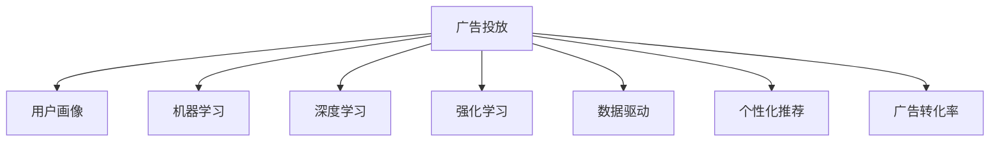

                 

# AI如何改变广告投放策略

## 1. 背景介绍

### 1.1 问题由来

随着互联网技术的不断进步和用户行为的日益个性化，传统的广告投放方式已经难以满足现代营销的需求。传统广告投放往往依赖于粗粒度的定向和定量的投放策略，难以精确触达目标受众。在这样一个复杂多变的互联网环境中，如何精准投放广告，实现有效的用户互动和转化，成为了广告行业的一大挑战。

人工智能（AI）技术的发展，特别是机器学习和大数据分析技术的进步，为广告投放策略的优化提供了新的契机。AI技术能够基于用户行为数据进行深度学习，从而实现更加精准、个性化的广告投放，提升广告投放的ROI（投资回报率）。

### 1.2 问题核心关键点

AI广告投放的核心关键点在于：
- 数据驱动：利用大数据分析用户行为和兴趣，精准定位目标用户。
- 智能算法：采用机器学习算法进行用户行为预测，优化投放策略。
- 实时调整：通过实时的数据分析和优化，动态调整广告投放策略，提升投放效果。
- 用户体验：以用户为中心，提供个性化的广告内容，提升用户体验。

## 2. 核心概念与联系

### 2.1 核心概念概述

为更好地理解AI如何改变广告投放策略，本节将介绍几个密切相关的核心概念：

- **广告投放**：将广告内容展示给目标用户的过程。广告投放的目的是通过各种渠道触达目标受众，从而实现品牌曝光和用户转化。

- **用户画像**：基于用户行为数据构建的用户特征模型。用户画像包括用户的兴趣、行为、偏好等信息，是精准投放的基础。

- **机器学习**：通过数据驱动的学习算法，实现模型训练和优化。在广告投放中，机器学习可以用于用户行为预测、广告效果评估、投放策略优化等。

- **深度学习**：机器学习的一种高级形式，通过多层神经网络模型，学习数据的高级特征表示。深度学习在广告投放中常用于图像识别、自然语言处理等领域。

- **强化学习**：通过试错过程优化模型，实现最佳决策策略。在广告投放中，强化学习可以用于动态调整投放策略，提升广告效果。

- **数据驱动**：基于用户行为数据，进行模型训练和投放优化，实现精准广告投放。

- **个性化推荐**：利用用户画像和行为数据，提供个性化的广告内容和推荐，提升用户体验和转化率。

- **广告转化率**：广告投放的效果评估指标，表示用户看到广告后进行点击、转化等操作的比率。

这些核心概念之间的逻辑关系可以通过以下Mermaid流程图来展示：



这个流程图展示了大语言模型的核心概念及其之间的关系：

1. 广告投放是整个过程的核心目标。
2. 用户画像是实现精准投放的基础，机器学习、深度学习和强化学习等技术都是基于用户画像进行模型训练和优化的。
3. 数据驱动是贯穿整个过程的核心理念，即通过数据驱动实现精准投放。
4. 个性化推荐和广告转化率是广告投放效果评估的关键指标，直接影响投放策略的优化方向。

## 3. 核心算法原理 & 具体操作步骤
### 3.1 算法原理概述

AI广告投放的核心算法原理包括：

- **用户画像构建**：通过数据分析和建模，构建用户画像，了解用户的兴趣、行为和偏好。
- **广告效果预测**：基于用户画像和历史行为数据，预测用户对广告的响应。
- **投放策略优化**：通过机器学习算法，优化广告投放策略，提高广告转化率。
- **实时调整**：通过实时数据分析和优化，动态调整广告投放策略，适应用户行为的变化。

### 3.2 算法步骤详解

AI广告投放的算法步骤包括：

1. **数据采集与预处理**：
   - 采集用户行为数据，包括点击率、转化率、浏览行为等。
   - 对数据进行清洗和处理，去除噪音和异常值。

2. **用户画像构建**：
   - 使用机器学习算法，如聚类、分类等，构建用户画像。
   - 分析用户的兴趣、行为和偏好，生成用户画像。

3. **广告效果预测**：
   - 使用深度学习模型，如卷积神经网络（CNN）、循环神经网络（RNN）、长短期记忆网络（LSTM）等，对用户对广告的响应进行预测。
   - 使用强化学习算法，如Q-learning、SARSA等，优化广告投放策略。

4. **投放策略优化**：
   - 使用机器学习算法，如随机森林、梯度提升机等，对广告投放策略进行优化。
   - 使用A/B测试等方法，评估投放效果，不断优化广告投放策略。

5. **实时调整**：
   - 通过实时数据分析和优化，动态调整广告投放策略。
   - 使用流数据处理技术，如Apache Flink、Apache Kafka等，实现实时数据处理。

### 3.3 算法优缺点

AI广告投放的算法具有以下优点：

- 精准定位：基于用户画像和行为数据，实现精准的广告投放。
- 个性化推荐：提供个性化的广告内容，提升用户体验和转化率。
- 实时优化：通过实时数据分析和优化，动态调整广告投放策略，提高投放效果。

同时，这些算法也存在一定的局限性：

- 数据质量要求高：需要高质量、大规模的用户行为数据，否则会影响投放效果。
- 算法复杂度高：机器学习和深度学习算法需要大量的计算资源和时间，难以快速迭代。
- 模型泛化能力不足：模型可能在新的用户群体或场景下表现不佳。

## 4. 数学模型和公式 & 详细讲解 & 举例说明

### 4.1 数学模型构建

AI广告投放的数学模型包括：

- **用户画像构建模型**：使用聚类算法、分类算法等构建用户画像。
- **广告效果预测模型**：使用深度学习模型预测用户对广告的响应。
- **投放策略优化模型**：使用机器学习算法优化广告投放策略。
- **实时调整模型**：使用流数据处理技术，实现实时数据处理。

### 4.2 公式推导过程

以广告效果预测为例，假设用户i对广告j的响应概率为$P(i,j)$，基于深度学习模型进行预测，则公式如下：

$$ P(i,j) = \sigma(W^T \cdot \text{concat}(\mathbf{x}_i, \mathbf{a}_j)) $$

其中，$\sigma$为激活函数，$W$为权重矩阵，$\mathbf{x}_i$为用户i的特征向量，$\mathbf{a}_j$为广告j的特征向量，$\text{concat}$表示特征向量的拼接。

### 4.3 案例分析与讲解

以一个简单的电商广告投放为例，假设用户i对商品j的点击概率为$P(i,j)$，模型可以通过以下步骤进行预测：

1. **数据采集**：采集用户i的浏览历史、购买记录等行为数据。
2. **特征提取**：使用自然语言处理技术，提取用户i和商品j的特征向量。
3. **模型训练**：使用深度学习模型，如CNN、LSTM等，对用户i和商品j的点击概率进行训练。
4. **实时预测**：在用户i访问商品j时，实时预测其点击概率，动态调整广告投放策略。

## 5. 项目实践：代码实例和详细解释说明

### 5.1 开发环境搭建

在进行AI广告投放的实践前，我们需要准备好开发环境。以下是使用Python进行TensorFlow开发的环境配置流程：

1. 安装Anaconda：从官网下载并安装Anaconda，用于创建独立的Python环境。

2. 创建并激活虚拟环境：
```bash
conda create -n tensorflow-env python=3.7
conda activate tensorflow-env
```

3. 安装TensorFlow：根据CUDA版本，从官网获取对应的安装命令。例如：
```bash
conda install tensorflow -c tf -c conda-forge
```

4. 安装各类工具包：
```bash
pip install numpy pandas scikit-learn matplotlib tqdm jupyter notebook ipython
```

完成上述步骤后，即可在`tensorflow-env`环境中开始AI广告投放的实践。

### 5.2 源代码详细实现

下面是使用TensorFlow对电商广告进行投放优化的Python代码实现。

```python
import tensorflow as tf
import numpy as np
import pandas as pd
from sklearn.model_selection import train_test_split
from sklearn.preprocessing import StandardScaler
from tensorflow.keras.layers import Dense, Input, Embedding, Dropout, Flatten, Concatenate
from tensorflow.keras.models import Model
from tensorflow.keras.optimizers import Adam

# 读取数据
data = pd.read_csv('ad_data.csv')

# 特征工程
features = ['click_count', 'brand_id', 'product_id', 'category_id']
target = 'click'
X = data[features]
y = data[target]

# 数据标准化
scaler = StandardScaler()
X = scaler.fit_transform(X)

# 划分训练集和测试集
X_train, X_test, y_train, y_test = train_test_split(X, y, test_size=0.2, random_state=42)

# 构建模型
input_1 = Input(shape=(X_train.shape[1],))
input_2 = Input(shape=(X_train.shape[1],))
embedding = Embedding(X_train.shape[1], 32, input_length=X_train.shape[1])([input_1, input_2])
flatten = Flatten()(embedding)
dropout = Dropout(0.5)(flatten)
output = Dense(1, activation='sigmoid')(dropout)
model = Model(inputs=[input_1, input_2], outputs=output)

# 编译模型
model.compile(optimizer=Adam(), loss='binary_crossentropy', metrics=['accuracy'])

# 训练模型
model.fit([X_train[:, :X_train.shape[1]], X_train[:, X_train.shape[1]:]], y_train, epochs=10, batch_size=32, validation_data=([X_test[:, :X_test.shape[1]], X_test[:, X_test.shape[1]:]], y_test))

# 评估模型
model.evaluate([X_test[:, :X_test.shape[1]], X_test[:, X_test.shape[1]:]], y_test)
```

### 5.3 代码解读与分析

让我们再详细解读一下关键代码的实现细节：

**特征工程**：
- 使用pandas读取数据，通过特征工程构造模型输入特征。
- 使用sklearn的StandardScaler对特征进行标准化处理。

**模型构建**：
- 使用Keras构建双输入的深度学习模型，分别对用户和商品的特征进行嵌入。
- 使用Flatten层将嵌入后的特征展开，使用Dropout层进行正则化，避免过拟合。
- 使用Dense层进行二分类预测，输出概率值。

**模型编译与训练**：
- 使用Adam优化器进行模型训练，使用binary_crossentropy作为损失函数。
- 在训练过程中，使用validation_data参数指定验证集，及时评估模型性能。

**模型评估**：
- 使用evaluate方法评估模型在测试集上的表现，输出准确率和损失值。

## 6. 实际应用场景

### 6.1 电商广告投放

基于AI广告投放技术，电商企业可以实时优化广告投放策略，提高广告点击率和转化率。例如，某电商企业可以根据用户的历史浏览和购买行为，动态调整广告投放的渠道、时间和形式，从而提升广告效果。

在技术实现上，可以收集用户的点击、浏览、购买等行为数据，使用机器学习算法进行用户画像和广告效果预测。在广告投放过程中，根据用户画像实时调整广告投放策略，最大化广告的转化率。

### 6.2 数字营销

AI广告投放技术在数字营销中也有广泛应用。广告主可以根据用户的兴趣和行为，进行个性化广告投放，提升广告效果。例如，某广告主可以根据用户的浏览历史和搜索行为，向其展示相关产品的广告，提升广告点击率和转化率。

在技术实现上，可以使用Google Analytics等工具，收集用户的浏览和搜索行为数据。使用机器学习算法进行用户画像和广告效果预测，实时调整广告投放策略，实现精准投放。

### 6.3 移动广告

AI广告投放技术也可以应用于移动广告领域。例如，某移动应用可以根据用户的下载、使用和付费行为，动态调整广告投放策略，提升广告效果。

在技术实现上，可以收集用户的下载、使用和付费行为数据，使用机器学习算法进行用户画像和广告效果预测。在广告投放过程中，根据用户画像实时调整广告投放策略，提升广告的点击率和转化率。

## 7. 工具和资源推荐

### 7.1 学习资源推荐

为了帮助开发者系统掌握AI广告投放的理论基础和实践技巧，这里推荐一些优质的学习资源：

1. **《深度学习实战》书籍**：介绍深度学习的基本概念和实现方法，适合初学者入门。
2. **《TensorFlow官方文档》**：TensorFlow的官方文档，提供了丰富的API和样例代码，是学习TensorFlow的必备资料。
3. **Kaggle平台**：提供大量真实数据集和竞赛任务，帮助开发者实践机器学习算法。
4. **Coursera平台**：提供多门深度学习课程，涵盖从入门到高级的多个阶段。

通过这些资源的学习实践，相信你一定能够快速掌握AI广告投放的核心技术，并用于解决实际的广告投放问题。

### 7.2 开发工具推荐

高效的开发离不开优秀的工具支持。以下是几款用于AI广告投放开发的常用工具：

1. **TensorFlow**：由Google主导开发的深度学习框架，生产部署方便，适合大规模工程应用。
2. **PyTorch**：基于Python的开源深度学习框架，灵活动态的计算图，适合快速迭代研究。
3. **Jupyter Notebook**：交互式开发环境，支持多种编程语言，适合进行数据分析和模型实验。
4. **Keras**：Keras是一个高级的深度学习框架，可以运行在TensorFlow、Theano和CNTK之上，方便开发者进行模型构建和优化。
5. **Hadoop**：Apache的分布式计算框架，适合处理大规模数据集。

合理利用这些工具，可以显著提升AI广告投放的开发效率，加快创新迭代的步伐。

### 7.3 相关论文推荐

AI广告投放技术的发展源于学界的持续研究。以下是几篇奠基性的相关论文，推荐阅读：

1. **《广告点击率预测的深度学习方法》**：介绍基于深度学习的方法进行广告点击率预测的技术。
2. **《基于强化学习的广告投放策略优化》**：介绍使用强化学习进行广告投放策略优化的技术。
3. **《实时流数据处理》**：介绍流数据处理技术的原理和应用，适合进行实时广告投放优化。

这些论文代表了大语言模型微调技术的发展脉络。通过学习这些前沿成果，可以帮助研究者把握学科前进方向，激发更多的创新灵感。

## 8. 总结：未来发展趋势与挑战

### 8.1 总结

本文对AI广告投放的原理和实践进行了全面系统的介绍。首先阐述了AI广告投放的背景和意义，明确了AI广告投放在提升广告投放效果、降低成本方面的独特价值。其次，从原理到实践，详细讲解了AI广告投放的数学原理和关键步骤，给出了广告投放任务开发的完整代码实例。同时，本文还广泛探讨了AI广告投放在电商、数字营销、移动广告等众多领域的应用前景，展示了AI广告投放技术的广阔应用场景。

通过本文的系统梳理，可以看到，AI广告投放技术正在成为广告投放的重要范式，极大地拓展了广告投放的精度和效率，为广告主带来了新的竞争优势。未来，伴随AI技术的发展和优化，AI广告投放必将在更多领域得到应用，为广告行业带来变革性影响。

### 8.2 未来发展趋势

展望未来，AI广告投放技术将呈现以下几个发展趋势：

1. **多模态数据融合**：未来广告投放将更多地融合多模态数据，如文字、图像、视频等，提升广告的多媒体效果。
2. **实时广告投放**：通过流数据处理技术，实现实时广告投放和优化，提升广告投放的动态性。
3. **个性化推荐**：基于用户画像和行为数据，实现更加精准的个性化广告投放。
4. **自动化投放**：通过机器学习算法和自动化工具，实现广告投放的自动化决策。
5. **用户隐私保护**：在使用用户数据时，需要严格遵守用户隐私保护法规，保护用户隐私。

这些趋势凸显了AI广告投放技术的广阔前景。这些方向的探索发展，必将进一步提升广告投放的精度和效果，为广告主带来更多的市场机会。

### 8.3 面临的挑战

尽管AI广告投放技术已经取得了瞩目成就，但在迈向更加智能化、普适化应用的过程中，它仍面临着诸多挑战：

1. **数据隐私问题**：在使用用户数据时，需要严格遵守用户隐私保护法规，保护用户隐私。
2. **算法复杂性**：深度学习算法需要大量的计算资源和时间，难以快速迭代。
3. **模型泛化能力**：模型可能在新的用户群体或场景下表现不佳。
4. **用户接受度**：过度个性化的广告投放可能会让用户感到不适，影响用户体验。

尽管存在这些挑战，但AI广告投放技术仍具有广阔的应用前景。只有积极应对并寻求突破，才能不断拓展AI广告投放技术的边界，实现精准广告投放。

### 8.4 未来突破

面对AI广告投放所面临的种种挑战，未来的研究需要在以下几个方面寻求新的突破：

1. **隐私保护技术**：研究如何在使用用户数据时，严格遵守用户隐私保护法规，保护用户隐私。
2. **高效算法**：开发更高效的算法，降低深度学习算法的计算复杂度，提高模型训练和优化的效率。
3. **多模态数据融合**：研究如何有效融合多模态数据，提升广告的多媒体效果。
4. **自动化投放**：研究如何通过机器学习算法和自动化工具，实现广告投放的自动化决策。
5. **用户体验优化**：研究如何平衡个性化广告和用户接受度，提升广告投放的用户体验。

这些研究方向的探索，必将引领AI广告投放技术迈向更高的台阶，为广告行业带来更多的市场机会。面向未来，AI广告投放技术还需要与其他AI技术进行更深入的融合，如自然语言处理、图像识别、推荐系统等，共同推动广告行业的技术进步。只有勇于创新、敢于突破，才能不断拓展AI广告投放技术的边界，实现精准广告投放。

## 9. 附录：常见问题与解答

**Q1：AI广告投放是否适用于所有广告形式？**

A: AI广告投放技术主要适用于数字广告形式，如在线广告、移动广告等。但对于传统广告形式，如电视广告、户外广告等，由于数据采集难度大，AI广告投放的效果可能受到限制。

**Q2：AI广告投放是否需要高质量的数据？**

A: 是的，AI广告投放的效果很大程度上依赖于数据的质量和数量。高质量、大规模的用户行为数据是AI广告投放的基础，低质量或少量数据可能影响投放效果。

**Q3：AI广告投放的计算成本是否高？**

A: 是的，AI广告投放需要大量的计算资源和时间进行模型训练和优化。深度学习模型通常需要GPU或TPU等高性能设备进行训练，计算成本较高。

**Q4：AI广告投放是否能够处理大规模数据？**

A: 是的，AI广告投放技术能够处理大规模数据，通过流数据处理技术实现实时广告投放和优化。

**Q5：AI广告投放是否能够提升广告转化率？**

A: 是的，AI广告投放技术通过精准定位和个性化推荐，能够显著提升广告的转化率。

---

作者：禅与计算机程序设计艺术 / Zen and the Art of Computer Programming

