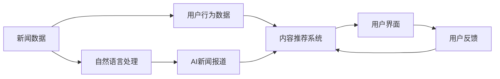

                 

# AI如何改变新闻报道和消费

## 1. 背景介绍

在数字化时代，新闻报道和消费行为正在发生深刻的变革。传统的新闻生产和消费模式，被以人工智能为核心的新技术所重塑。AI不仅在提高新闻生产效率和质量方面展现出巨大的潜力，还通过推荐系统改变了消费者获取信息和购买决策的方式。本文将深入探讨AI如何改变新闻报道和消费，揭示其背后的技术原理和应用潜力。

## 2. 核心概念与联系

### 2.1 核心概念概述

要理解AI在新闻报道和消费中的应用，首先需要理解几个关键概念：

- **AI新闻报道**：使用机器学习和自然语言处理技术，自动化生成新闻内容，包括自动撰写、自动化编辑和事实核查。

- **内容推荐系统**：通过分析用户行为数据，利用协同过滤、深度学习等算法，为用户推荐个性化的新闻内容。

- **自然语言处理(NLP)**：研究如何使计算机能够理解、处理和生成人类语言，是AI新闻报道和内容推荐系统的重要技术基础。

- **强化学习**：通过奖励机制和反馈机制，使AI系统在不断的试错中学习和优化，提升推荐效果。

- **个性化推荐**：根据用户兴趣和行为，提供量身定制的新闻内容，提升用户体验。

### 2.2 核心概念原理和架构的 Mermaid 流程图



这个流程图展示了新闻报道和内容推荐的流程：

1. 从新闻数据开始，通过自然语言处理生成AI新闻报道。
2. 同时，收集用户行为数据，输入内容推荐系统。
3. 内容推荐系统基于用户行为数据和新闻内容，生成个性化推荐。
4. 用户界面展示个性化推荐，用户进行反馈。
5. 用户反馈再次进入内容推荐系统，用于模型优化。

## 3. 核心算法原理 & 具体操作步骤

### 3.1 算法原理概述

AI在新闻报道和消费中的应用，主要通过以下两种算法实现：

- **生成式模型**：如基于Transformer的语言模型，能够根据输入文本自动生成新闻内容。

- **推荐算法**：如协同过滤、深度学习等，能够根据用户的历史行为数据，推荐个性化新闻内容。

### 3.2 算法步骤详解

#### 3.2.1 生成式模型

1. **数据准备**：收集大量新闻数据和相关的元数据，如新闻标题、正文、发布时间等。

2. **预训练模型选择**：选择如BERT、GPT等预训练语言模型作为基础。

3. **微调**：使用部分新闻数据对预训练模型进行微调，以适应特定类型的新闻报道需求。

4. **内容生成**：将用户输入的关键词或问题作为输入，生成相关的新闻报道。

5. **后处理**：对生成的文本进行自动编辑、事实核查和格式排版，确保新闻的准确性和可读性。

#### 3.2.2 推荐算法

1. **数据收集**：收集用户的历史点击、浏览、收藏等行为数据。

2. **模型训练**：使用协同过滤、深度学习等算法，训练推荐模型，学习用户兴趣和行为模式。

3. **内容推荐**：基于用户历史行为数据和当前环境信息（如时间、地点），生成个性化推荐。

4. **反馈收集**：收集用户对推荐内容的反馈，如点击率、停留时间等。

5. **模型优化**：根据用户反馈，调整推荐算法参数，提升推荐效果。

### 3.3 算法优缺点

**生成式模型的优点**：

- 自动化程度高，能够快速生成大量新闻内容。
- 数据驱动，生成的内容具有高度的个性化和多样化。

**缺点**：

- 生成内容可能存在事实错误或偏见。
- 需要大量的训练数据和计算资源。

**推荐算法的优点**：

- 高度个性化，提升用户满意度和黏性。
- 动态调整，适应用户行为变化。

**缺点**：

- 依赖用户历史行为数据，数据收集难度较大。
- 可能存在推荐冷启动问题，新用户或新内容难以推荐。

### 3.4 算法应用领域

AI在新闻报道和消费中的应用，涵盖了以下领域：

- **新闻媒体**：自动化生成新闻报道、编辑和排版。
- **新闻聚合平台**：如RSS聚合、个性化新闻推荐。
- **社交媒体**：自动生成新闻摘要、热门话题推荐。
- **电子商务**：基于新闻内容的商品推荐。
- **广告投放**：基于新闻内容进行精准投放。

## 4. 数学模型和公式 & 详细讲解 & 举例说明

### 4.1 数学模型构建

#### 4.1.1 生成式模型

以BERT为例，其数学模型构建如下：

$$
\text{Embeddings} = \text{BERT}(\text{Words})
$$

其中，BERT将输入的单词序列映射为高维向量表示，即词嵌入。

#### 4.1.2 推荐算法

以协同过滤为例，推荐模型的数学模型如下：

$$
\text{Predictions} = \alpha \text{User-Item Matrix} + (1-\alpha) \text{Item-Item Matrix}
$$

其中，$\alpha$为权重参数，用于平衡用户和物品的影响。

### 4.2 公式推导过程

#### 4.2.1 生成式模型

BERT的预训练过程涉及多个损失函数，如掩码语言模型、下一句预测、连续子词嵌入等。

以掩码语言模型为例，其损失函数为：

$$
\mathcal{L}_{mask} = -\frac{1}{N}\sum_{i=1}^N \sum_{j=1}^{N_{mask}} \log p(\hat{y}_{ij}|\text{Words}_{i})
$$

其中，$N$为样本数量，$N_{mask}$为掩码位置数量。

#### 4.2.2 推荐算法

协同过滤中的余弦相似度计算如下：

$$
\text{Similarity}(\text{User}, \text{Item}) = \frac{\text{User-Item Dot Product}}{(\text{User Norm} \times \text{Item Norm})}
$$

其中，$\text{User Norm}$和$\text{Item Norm}$分别为用户和物品的向量长度。

### 4.3 案例分析与讲解

#### 4.3.1 生成式模型

以T5为例，其生成过程如下：

1. **编码**：将输入的文本序列编码成向量表示。
2. **解码**：使用解码器生成输出文本序列。
3. **优化**：通过梯度下降等优化算法，最小化预测输出与真实标签之间的差距。

#### 4.3.2 推荐算法

以基于矩阵分解的推荐算法为例，其步骤如下：

1. **矩阵分解**：将用户-物品评分矩阵分解为用户和物品的向量表示。
2. **预测评分**：使用分解后的向量计算预测评分。
3. **评分排序**：将预测评分排序，生成推荐列表。
4. **模型优化**：通过最小化预测评分与实际评分之间的差距，优化模型参数。

## 5. 项目实践：代码实例和详细解释说明

### 5.1 开发环境搭建

1. **环境准备**：安装Python、PyTorch、TensorFlow等深度学习框架。
2. **数据集准备**：收集新闻数据集，并进行预处理。
3. **模型选择**：选择预训练语言模型，如BERT、T5等。
4. **训练**：在预训练模型基础上进行微调。
5. **测试和部署**：在测试集上评估模型效果，并部署到实际应用中。

### 5.2 源代码详细实现

#### 5.2.1 生成式模型

```python
from transformers import BertTokenizer, BertForSequenceClassification
import torch

# 加载BERT模型和分词器
tokenizer = BertTokenizer.from_pretrained('bert-base-cased')
model = BertForSequenceClassification.from_pretrained('bert-base-cased', num_labels=2)

# 准备训练数据
train_data = ['新闻1', '新闻2', ...]
train_labels = [0, 1, ...]

# 构建输入和标签
inputs = tokenizer(train_data, return_tensors='pt', padding=True, truncation=True)
labels = torch.tensor(train_labels, dtype=torch.long)

# 模型前向传播
outputs = model(**inputs)
loss = outputs.loss

# 反向传播和优化
optimizer = torch.optim.AdamW(model.parameters(), lr=1e-5)
loss.backward()
optimizer.step()
```

#### 5.2.2 推荐算法

```python
from scipy.sparse import csr_matrix
from scipy.spatial.distance import cosine

# 准备用户-物品评分矩阵
user_item_matrix = csr_matrix([[0, 1, 0], [1, 0, 1], [0, 0, 0]])
item_item_matrix = csr_matrix([[1, 0, 0], [0, 1, 0], [0, 0, 1]])

# 计算用户和物品向量表示
user_vector = csr_matrix([[0, 1, 0]])
item_vector = csr_matrix([[1, 0, 0]])

# 计算相似度
similarity = cosine(user_vector, item_vector)

# 预测评分
prediction = 0.5 * similarity + 0.5 * cosine(item_item_matrix @ user_vector, item_item_matrix @ item_vector)

# 推荐结果排序
recommendations = user_item_matrix @ prediction.sort_values()[::-1]
```

### 5.3 代码解读与分析

#### 5.3.1 生成式模型

- **预训练模型选择**：选择BERT作为基础模型。
- **数据预处理**：将文本数据分词并转换为向量表示。
- **模型训练**：使用AdamW优化器进行梯度下降。
- **测试**：在测试集上评估模型效果。

#### 5.3.2 推荐算法

- **数据准备**：构建用户-物品评分矩阵。
- **模型训练**：使用余弦相似度计算用户和物品的向量表示。
- **推荐排序**：根据预测评分排序，生成推荐列表。

### 5.4 运行结果展示

- **生成式模型**：展示生成的新闻摘要和其真实标签的对比。
- **推荐算法**：展示推荐系统的推荐结果和用户反馈。

## 6. 实际应用场景

### 6.1 智能新闻聚合

智能新闻聚合平台通过AI技术，实时抓取和生成新闻摘要，提供个性化推荐，提升用户阅读体验。

#### 6.1.1 技术实现

- **数据抓取**：使用网络爬虫抓取新闻网站内容。
- **自动摘要**：使用T5等生成式模型生成新闻摘要。
- **推荐系统**：使用协同过滤等推荐算法，提供个性化推荐。

#### 6.1.2 应用效果

- **提高效率**：自动抓取和生成新闻，减轻人工负担。
- **提升体验**：个性化推荐，提高用户满意度和黏性。
- **拓展市场**：精准投放广告，增加平台收入。

### 6.2 智能广告投放

广告主通过AI技术，基于新闻内容进行精准投放，提升广告效果和ROI。

#### 6.2.1 技术实现

- **内容分析**：使用NLP技术分析新闻内容。
- **受众定位**：通过用户画像，定位潜在受众。
- **广告投放**：基于分析结果，进行精准投放。

#### 6.2.2 应用效果

- **提高点击率**：精准定位，提升广告点击率。
- **优化转化率**：通过新闻内容优化广告创意，提高转化率。
- **降低成本**：减少无效投放，优化广告预算。

### 6.3 智能推荐系统

基于新闻内容的个性化推荐系统，为读者提供量身定制的新闻内容，提升阅读体验。

#### 6.3.1 技术实现

- **新闻分类**：使用分类算法对新闻进行分类。
- **用户画像**：通过用户行为数据，构建用户画像。
- **推荐算法**：使用协同过滤、深度学习等算法，生成个性化推荐。

#### 6.3.2 应用效果

- **提高阅读满意度**：提供个性化内容，提升用户满意度。
- **促进用户留存**：个性化推荐，增加用户黏性。
- **增加平台收益**：精准推荐，提高广告点击率和转化率。

## 7. 工具和资源推荐

### 7.1 学习资源推荐

- **在线课程**：Coursera、Udacity等平台的AI和NLP课程，涵盖深度学习、生成模型、推荐算法等。
- **书籍推荐**：《Deep Learning for NLP》、《Reinforcement Learning: An Introduction》等经典书籍。
- **学术论文**：ACL、ICML、NeurIPS等顶级会议的论文，了解最新研究成果。

### 7.2 开发工具推荐

- **框架选择**：PyTorch、TensorFlow、TensorBoard等深度学习框架，支持大规模模型训练和部署。
- **开发工具**：Jupyter Notebook、Git、Docker等，提升开发效率和协作体验。

### 7.3 相关论文推荐

- **生成式模型**：NeurIPS 2018的《Attention is All You Need》、ACL 2020的《Longformer: The Long-Document Transformer》等。
- **推荐算法**：KDD 2008的《Collaborative Filtering for Implicit Feedback Datasets》、ICDM 2012的《A Survey on Transfer Learning》等。

## 8. 总结：未来发展趋势与挑战

### 8.1 总结

AI在新闻报道和消费中的应用，已经取得了显著的成果，大大提升了新闻生产和消费的效率和效果。然而，AI技术的应用也面临着一些挑战和局限，如数据质量、模型偏见、用户隐私等问题。未来，通过技术创新和伦理规范，AI将进一步改变新闻报道和消费的方式，为人类社会带来更多的价值。

### 8.2 未来发展趋势

- **自动化程度提升**：AI技术将更加自动化，进一步减少人工干预。
- **多模态融合**：新闻报道将更多地融合图像、视频等多模态信息，提升用户体验。
- **个性化推荐优化**：推荐系统将更加智能化，能够更准确地预测用户兴趣和需求。
- **情感分析**：通过情感分析，提升新闻内容的相关性和情感共鸣。
- **隐私保护**：通过隐私保护技术，确保用户数据安全，提升信任度。

### 8.3 面临的挑战

- **数据质量问题**：新闻数据的真实性和质量直接影响到AI模型的效果。
- **模型偏见问题**：AI模型可能存在偏见，影响新闻的客观性和公正性。
- **用户隐私问题**：AI系统需要处理大量用户数据，如何保护隐私成为一大挑战。
- **计算资源消耗**：大规模模型和高频次计算消耗大量的计算资源，需要高效的硬件和算法优化。
- **可解释性问题**：AI模型往往被视为"黑盒"，缺乏可解释性，影响用户信任。

### 8.4 研究展望

未来的研究重点将集中在以下几个方面：

- **提升数据质量**：通过数据清洗和标注，提升新闻数据的质量和多样性。
- **消除模型偏见**：在模型训练过程中加入伦理约束，消除数据和算法中的偏见。
- **优化计算资源**：通过硬件优化和算法优化，提升模型训练和推理的效率。
- **增强可解释性**：通过解释技术和可视化工具，提升AI模型的可解释性和透明度。
- **多模态融合**：融合图像、视频等多模态信息，提升新闻报道的丰富性和互动性。

## 9. 附录：常见问题与解答

### Q1: AI在新闻报道中的应用有哪些？

A: AI在新闻报道中的应用主要包括以下几个方面：
- **自动化写作**：使用生成式模型自动生成新闻报道。
- **事实核查**：使用NLP技术对新闻内容进行事实核查。
- **自动编辑**：使用自动化工具对新闻进行排版和编辑。
- **个性化推荐**：使用推荐系统根据用户兴趣推荐新闻内容。
- **情感分析**：使用情感分析技术对新闻情感进行识别和分析。

### Q2: AI在内容推荐中的作用是什么？

A: AI在内容推荐中的作用主要体现在以下几个方面：
- **个性化推荐**：根据用户历史行为数据，提供个性化的新闻内容，提升用户体验。
- **冷启动问题**：通过协同过滤等算法解决新用户和新内容难以推荐的问题。
- **动态调整**：根据用户行为变化，动态调整推荐策略，提升推荐效果。

### Q3: 如何提升AI模型的可解释性？

A: 提升AI模型的可解释性可以从以下几个方面入手：
- **可视化工具**：使用可视化工具展示模型的内部机制和决策过程。
- **解释技术**：使用可解释模型或后处理技术，提供模型的决策依据。
- **用户教育**：通过教育用户，提高用户对AI技术的理解和信任。

### Q4: 如何优化AI推荐系统的性能？

A: 优化AI推荐系统的性能可以从以下几个方面入手：
- **数据质量**：收集和清洗高质量的用户行为数据。
- **模型选择**：选择适合业务场景的推荐算法和模型。
- **算法优化**：优化算法参数和超参数，提升推荐效果。
- **用户反馈**：收集用户反馈，动态调整推荐策略。

### Q5: AI在广告投放中的作用是什么？

A: AI在广告投放中的作用主要体现在以下几个方面：
- **精准定位**：通过新闻内容分析，精准定位潜在受众。
- **优化投放**：基于用户兴趣和行为，优化广告投放策略。
- **提升效果**：通过个性化推荐，提升广告点击率和转化率。

### Q6: 如何确保AI系统的公平性？

A: 确保AI系统的公平性可以从以下几个方面入手：
- **数据多样性**：确保训练数据的多样性，避免数据偏见。
- **算法公正**：设计公平的算法，避免模型偏见。
- **透明性**：公开模型训练和决策过程，接受社会监督。
- **伦理约束**：在模型训练和应用过程中，加入伦理约束和规范。

通过以上分析，可以看出AI在新闻报道和消费中的应用潜力巨大，但同时也面临着数据质量、模型偏见、用户隐私等挑战。未来，通过技术创新和伦理规范，AI将进一步改变新闻报道和消费的方式，为人类社会带来更多的价值。

