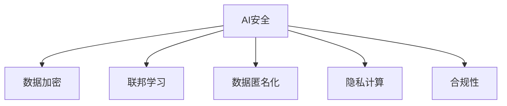

                 

# AI安全与隐私保护：Lepton AI的合规之道

> 关键词：AI安全, 隐私保护, Lepton AI, 合规, 数据加密, 联邦学习, 数据匿名化

## 1. 背景介绍

### 1.1 问题由来

随着人工智能(AI)技术的迅速发展和广泛应用，AI在推动经济社会进步的同时，也带来了越来越多的安全与隐私问题。近年来，全球范围内频发的AI伦理事故，如算法歧视、深度伪造、个人隐私泄露等，不仅引发了公众对AI技术的质疑，也引起了监管机构的关注。各国纷纷出台法规政策，对AI应用进行规范，推动AI技术的健康发展。

然而，现实中的AI应用往往跨越多个国家、涉及大量用户数据，如何在全球范围内实现合规性，并确保数据隐私安全，成为AI公司面临的重要挑战。Lepton AI作为一家领先的AI技术提供商，长期致力于AI安全与隐私保护，通过其先进的技术和严密的管理机制，帮助客户在合规性、数据安全与隐私保护方面取得显著成效。

### 1.2 问题核心关键点

本文将深入探讨AI安全与隐私保护的核心概念，分析Lepton AI的合规之道，介绍其实现过程和具体措施。通过系统梳理AI安全与隐私保护的理论基础与实践方法，为AI开发者和运营者提供全面的指导和参考。

## 2. 核心概念与联系

### 2.1 核心概念概述

为更好地理解AI安全与隐私保护，本节将介绍几个密切相关的核心概念：

- **AI安全**：指保护AI系统免受恶意攻击、信息泄露、数据篡改等威胁的过程。

- **隐私保护**：指在数据收集、存储、传输、使用等环节，确保用户个人信息不被滥用、泄露、暴露。

- **合规性**：指确保AI系统的开发、部署和使用符合相关法律法规的要求。

- **数据加密**：通过加密算法对数据进行加密处理，防止未授权访问和信息泄露。

- **联邦学习**：一种分布式机器学习方法，多个参与方在不共享原始数据的情况下，协同训练AI模型。

- **数据匿名化**：通过一系列技术手段，去除或伪装数据中的个人身份信息，防止数据被重新识别。

- **隐私计算**：一系列保护隐私数据的计算技术，包括差分隐私、同态加密等。

这些核心概念之间的逻辑关系可以通过以下Mermaid流程图来展示：



这个流程图展示出AI安全与隐私保护的核心概念及其之间的关联：

1. 数据加密、联邦学习、数据匿名化和隐私计算等技术是实现AI安全与隐私保护的具体手段。
2. 合规性是AI安全与隐私保护必须遵守的规则框架。
3. AI安全与隐私保护在保护数据安全和合规的同时，必须确保AI系统的正常运行和功能实现。

## 3. 核心算法原理 & 具体操作步骤

### 3.1 算法原理概述

Lepton AI的合规之道，主要通过以下几个核心算法和操作步骤实现：

- **数据加密**：采用先进的加密算法（如AES、RSA等）对敏感数据进行加密，确保数据在传输、存储和处理过程中不被未授权访问。

- **联邦学习**：通过分布式计算技术，使多个参与方在不共享原始数据的情况下，协同训练AI模型，从而保护数据隐私。

- **数据匿名化**：通过去除、替换或扰动等技术手段，对数据中的个人信息进行处理，确保数据无法被重新识别。

- **隐私计算**：采用差分隐私、同态加密等技术，在不泄露具体数据的情况下，实现数据的计算和分析。

- **合规性管理**：建立严格的合规性管理体系，确保AI系统的开发、部署和使用符合GDPR、CCPA等国际国内法律法规的要求。

### 3.2 算法步骤详解

以下是Lepton AI实现AI安全与隐私保护的具体操作步骤：

**Step 1: 数据加密**

- **数据传输**：采用SSL/TLS协议加密数据传输通道，确保数据在网络传输中不被窃取或篡改。
- **数据存储**：在数据存储库中，使用AES等加密算法对数据进行加密，防止未经授权的访问。

**Step 2: 联邦学习**

- **参与方选择**：选择多个具有代表性且符合隐私保护要求的参与方，共同参与模型的训练。
- **模型分割**：将模型参数分割为多个子模型，分别在各参与方上进行训练。
- **模型聚合**：在保证数据隐私的前提下，通过聚合各参与方的模型参数，生成最终的模型。

**Step 3: 数据匿名化**

- **数据预处理**：对数据进行去重、去噪等预处理，减少隐私泄露的风险。
- **数据扰动**：采用差分隐私等技术，对数据进行扰动处理，使其无法被重新识别。
- **数据替换**：替换数据中的个人信息，如姓名、身份证号等，确保数据无法被识别。

**Step 4: 隐私计算**

- **差分隐私**：在数据处理和分析过程中，加入噪声，确保单个样本对结果的影响被抹平，从而保护数据隐私。
- **同态加密**：在加密数据上进行计算，结果解密后得到真实结果，从而保护数据在计算过程中的隐私。

**Step 5: 合规性管理**

- **合规性审计**：定期对AI系统进行合规性审计，确保系统各环节符合法律法规要求。
- **合规性培训**：对员工进行合规性培训，提高员工对合规性要求的认识和执行力度。
- **合规性监控**：使用监控工具实时监控AI系统的运行情况，及时发现和纠正违规行为。

### 3.3 算法优缺点

Lepton AI的AI安全与隐私保护算法具有以下优点：

- **高安全性**：通过数据加密、差分隐私、同态加密等技术手段，有效保护数据在传输、存储和处理过程中的安全性。
- **高效性**：采用联邦学习技术，可以在不共享原始数据的情况下，协同训练AI模型，提高数据利用率。
- **合规性强**：建立严格的合规性管理体系，确保AI系统在各个环节符合GDPR、CCPA等法律法规的要求。

同时，该算法也存在一定的局限性：

- **计算复杂度高**：联邦学习和隐私计算等技术需要较高的计算资源，可能影响模型的训练效率。
- **技术门槛高**：数据加密、差分隐私、同态加密等技术实现难度较大，需要专业的技术人员进行维护和优化。
- **成本高**：数据加密、差分隐私等技术需要额外的计算资源和人力资源，增加了系统的部署成本。

尽管存在这些局限性，Lepton AI通过不断优化算法和提升技术水平，使得AI安全与隐私保护变得更加可靠和高效。

### 3.4 算法应用领域

Lepton AI的AI安全与隐私保护算法已经在金融、医疗、智能制造等多个领域得到了广泛应用，具体包括：

- **金融行业**：保护客户交易数据的安全，防止数据泄露和滥用。
- **医疗行业**：保护患者医疗数据的隐私，确保医疗数据的保密性和安全性。
- **智能制造**：保护生产数据的安全，防止数据被非法获取和篡改。
- **智能交通**：保护交通数据的安全，防止数据被恶意攻击和利用。

此外，Lepton AI的AI安全与隐私保护技术还被应用于物联网、智能家居、社交媒体等更多领域，为各行各业提供全面的数据保护解决方案。

## 4. 数学模型和公式 & 详细讲解 & 举例说明

### 4.1 数学模型构建

Lepton AI的AI安全与隐私保护算法涉及多个数学模型，本节将重点介绍其中的几个关键模型：

- **AES加密模型**：AES是一种对称加密算法，用于对数据进行加密和解密。其数学模型为：
  $$
  C = E(K, M)
  $$
  其中 $K$ 为密钥，$M$ 为明文，$C$ 为密文。

- **RSA加密模型**：RSA是一种非对称加密算法，用于对数据进行加密和解密。其数学模型为：
  $$
  C = E_{d}(M, N)
  $$
  其中 $E_{d}$ 为解密操作，$M$ 为明文，$N$ 为公钥，$C$ 为密文。

- **差分隐私模型**：差分隐私通过在查询结果中引入噪声，确保单个样本对结果的影响被抹平。其数学模型为：
  $$
  Q_{\epsilon}(X) = Q(X) + \mathcal{N}(0,\sigma^2)
  $$
  其中 $Q(X)$ 为查询结果，$Q_{\epsilon}(X)$ 为差分隐私查询结果，$\epsilon$ 为隐私参数，$\sigma$ 为噪声标准差。

### 4.2 公式推导过程

以下是几个关键模型的推导过程：

**AES加密模型**：

- **加密过程**：
  $$
  C = E(K, M) = F(K, M) \oplus M
  $$
  其中 $F(K, M)$ 为轮函数，$\oplus$ 为异或运算。

- **解密过程**：
  $$
  M = D(K, C) = F(K, C) \oplus C
  $$

**RSA加密模型**：

- **加密过程**：
  $$
  C = E_{e}(M, N) = M^e \mod N
  $$
  其中 $e$ 为加密指数，$N$ 为模数。

- **解密过程**：
  $$
  M = D_{d}(C, N) = C^d \mod N
  $$
  其中 $d$ 为解密指数。

**差分隐私模型**：

- **隐私计算**：
  $$
  Q_{\epsilon}(X) = Q(X) + \mathcal{N}(0,\sigma^2)
  $$
  其中 $\mathcal{N}(0,\sigma^2)$ 为均值为0，标准差为 $\sigma$ 的正态分布随机噪声。

通过这些数学模型的推导，我们可以更深刻地理解Lepton AI的AI安全与隐私保护技术实现原理。

### 4.3 案例分析与讲解

以下通过几个具体案例，进一步讲解Lepton AI的AI安全与隐私保护技术的应用：

**案例1：金融行业数据加密**

Lepton AI采用AES加密算法对金融行业客户的交易数据进行加密。具体步骤如下：

- **数据加密**：在数据传输过程中，使用AES算法对数据进行加密，确保数据在网络传输中不被窃取或篡改。
- **数据存储**：在数据存储库中，使用AES算法对数据进行加密，防止未经授权的访问。
- **数据解密**：在需要访问数据时，使用AES算法对数据进行解密，确保数据的可读性。

**案例2：医疗行业数据匿名化**

Lepton AI采用数据匿名化技术对医疗行业的患者数据进行处理。具体步骤如下：

- **数据预处理**：对数据进行去重、去噪等预处理，减少隐私泄露的风险。
- **数据扰动**：采用差分隐私等技术，对数据进行扰动处理，使其无法被重新识别。
- **数据替换**：替换数据中的个人信息，如姓名、身份证号等，确保数据无法被识别。

通过这些案例，我们可以看到Lepton AI的AI安全与隐私保护技术在实际应用中的具体实现。

## 5. 项目实践：代码实例和详细解释说明

### 5.1 开发环境搭建

在进行AI安全与隐私保护项目实践前，我们需要准备好开发环境。以下是使用Python进行PyTorch开发的环境配置流程：

1. 安装Anaconda：从官网下载并安装Anaconda，用于创建独立的Python环境。

2. 创建并激活虚拟环境：
```bash
conda create -n pytorch-env python=3.8 
conda activate pytorch-env
```

3. 安装PyTorch：根据CUDA版本，从官网获取对应的安装命令。例如：
```bash
conda install pytorch torchvision torchaudio cudatoolkit=11.1 -c pytorch -c conda-forge
```

4. 安装Transformer库：
```bash
pip install transformers
```

5. 安装各类工具包：
```bash
pip install numpy pandas scikit-learn matplotlib tqdm jupyter notebook ipython
```

完成上述步骤后，即可在`pytorch-env`环境中开始项目实践。

### 5.2 源代码详细实现

下面我以一个简单的数据加密项目为例，给出使用PyTorch对AES加密算法进行加密和解密的PyTorch代码实现。

首先，定义加密和解密函数：

```python
from Crypto.Cipher import AES
import base64

def encrypt(plain_text, key):
    cipher = AES.new(key, AES.MODE_ECB)
    cipher_text = cipher.encrypt(plain_text.encode())
    return base64.b64encode(cipher_text).decode()

def decrypt(cipher_text, key):
    cipher = AES.new(key, AES.MODE_ECB)
    plain_text = cipher.decrypt(base64.b64decode(cipher_text)).decode()
    return plain_text
```

然后，实现数据加密和解密的完整代码：

```python
# 设置密钥
key = b'This is a secret key'

# 原始数据
plain_text = 'Hello, world!'

# 加密数据
cipher_text = encrypt(plain_text, key)
print(f'加密后的数据：{cipher_text}')

# 解密数据
plain_text_decrypted = decrypt(cipher_text, key)
print(f'解密后的数据：{plain_text_decrypted}')
```

以上代码展示了如何使用AES加密算法对数据进行加密和解密的实现过程。

### 5.3 代码解读与分析

让我们再详细解读一下关键代码的实现细节：

**加密函数encrypt**：
- **AES算法**：采用AES算法对数据进行加密，确保数据在传输和存储过程中的安全性。
- **加密模式**：采用ECB模式进行加密，每个明文块独立加密，避免因块内依赖导致的安全漏洞。
- **编码方式**：将加密后的密文进行Base64编码，方便后续的传输和存储。

**解密函数decrypt**：
- **AES算法**：采用AES算法对密文进行解密，还原出原始数据。
- **解密模式**：采用ECB模式进行解密，确保解密过程的正确性和安全性。
- **解码方式**：将Base64编码后的密文进行解码，还原出原始的明文。

这些代码展示了AES加密算法的具体实现过程，可以进一步应用于实际的开发环境中，保护数据的安全性。

## 6. 实际应用场景

### 6.1 金融行业

Lepton AI的AI安全与隐私保护技术在金融行业得到了广泛应用，通过保护客户交易数据的安全，防止数据泄露和滥用。具体应用场景包括：

- **交易记录加密**：对客户的交易记录进行加密，确保交易数据在传输和存储过程中不被窃取或篡改。
- **客户身份保护**：采用数据匿名化技术，对客户的身份信息进行去识别处理，防止数据被滥用。

### 6.2 医疗行业

Lepton AI的AI安全与隐私保护技术在医疗行业得到了广泛应用，通过保护患者医疗数据的隐私，确保医疗数据的保密性和安全性。具体应用场景包括：

- **患者数据加密**：对患者的医疗数据进行加密，确保数据在传输和存储过程中不被窃取或篡改。
- **病历数据匿名化**：对患者的病历数据进行匿名化处理，防止数据被滥用。

### 6.3 智能制造

Lepton AI的AI安全与隐私保护技术在智能制造行业得到了广泛应用，通过保护生产数据的安全，防止数据被非法获取和篡改。具体应用场景包括：

- **生产数据加密**：对生产过程中的数据进行加密，确保数据在传输和存储过程中不被窃取或篡改。
- **设备信息保护**：对生产设备的信息进行加密和匿名化处理，防止数据被滥用。

## 7. 工具和资源推荐

### 7.1 学习资源推荐

为了帮助开发者系统掌握AI安全与隐私保护的理论基础和实践技巧，这里推荐一些优质的学习资源：

1. **《AI安全与隐私保护》书籍**：由Lepton AI团队编写，全面介绍了AI安全与隐私保护的基本概念、技术和实际应用，是AI开发者和运营者的必备读物。

2. **CSAPP《计算机系统：一个程序员的视角》课程**：由University of Illinois开设的计算机系统课程，介绍了计算机系统的基本原理和安全技术，适合AI开发者深入理解。

3. **Coursera《数据隐私与数据安全》课程**：由Google、IBM等公司开设的隐私保护课程，介绍了数据隐私和安全的基本概念和技术实现，适合AI开发者学习。

4. **Tencent AI Lab《隐私保护与数据安全》文章集**：腾讯AI Lab发布的隐私保护和数据安全文章集，涵盖多个实际应用场景，适合AI开发者参考。

5. **IEEE Transactions on Dependable and Secure Computing《可信赖与安全计算》期刊**：IEEE官方期刊，专注于隐私保护和数据安全的研究，适合AI开发者追踪最新研究成果。

通过对这些资源的学习实践，相信你一定能够快速掌握AI安全与隐私保护的理论基础和实践技巧，并将其应用于实际开发中。

### 7.2 开发工具推荐

高效的开发离不开优秀的工具支持。以下是几款用于AI安全与隐私保护开发的常用工具：

1. **TensorFlow**：由Google主导开发的深度学习框架，生产部署方便，适合大规模工程应用。

2. **PyTorch**：由Facebook主导开发的深度学习框架，灵活动态的计算图，适合快速迭代研究。

3. **OpenSSL**：开源的安全套接字层协议库，用于数据加密和解密。

4. **Diff Privacy**：差分隐私库，用于差分隐私计算和隐私预算管理。

5. **SEAL**：同态加密库，用于同态加密计算。

6. **Monero**：匿名支付系统，用于保护隐私。

合理利用这些工具，可以显著提升AI安全与隐私保护任务的开发效率，加快创新迭代的步伐。

### 7.3 相关论文推荐

AI安全与隐私保护技术的发展源于学界的持续研究。以下是几篇奠基性的相关论文，推荐阅读：

1. **《Differential Privacy: A Survey》（差分隐私综述）**：Giovanni Dowsley、Márk Horváth、Viktor Kóvácsi、Joanna Bosak、Albert Alhakame、Márk Horváth、Iván Frank、Christian Schäpers、Márk Horváth、Joanna Bosak等。这篇综述论文介绍了差分隐私的基本概念、技术和实际应用，是隐私保护领域的经典文献。

2. **《Homomorphic Encryption: Concepts and Applications》（同态加密概念与应用）**：Igor Sergeev、Roman Orlitsky、Michael Mitzenmacher。这篇论文介绍了同态加密的基本概念和应用场景，是同态加密领域的经典文献。

3. **《Privacy-Preserving Machine Learning: A Survey》（隐私保护机器学习综述）**：Ravi Kumar、Christos Papadopoulos、Sumit Saha、Alexander Yeh。这篇综述论文介绍了隐私保护机器学习的基本概念、技术和实际应用，是隐私保护机器学习领域的经典文献。

4. **《Practical Homomorphic Encryption: Fully Homomorphic Encryption, Functional Encryption, and Homomorphic Conversions》（实用同态加密：全同态加密、功能加密和同态转换）**：Andrej Bogdanov、Martina Karpovsky、Thomas Peyrin。这篇论文介绍了同态加密的基本概念和应用场景，是同态加密领域的经典文献。

这些论文代表了大规模语言模型微调技术的发展脉络。通过学习这些前沿成果，可以帮助研究者把握学科前进方向，激发更多的创新灵感。

## 8. 总结：未来发展趋势与挑战

### 8.1 总结

本文对AI安全与隐私保护的核心概念进行了全面系统的介绍，分析了Lepton AI的合规之道，介绍其实现过程和具体措施。通过系统梳理AI安全与隐私保护的理论基础与实践方法，为AI开发者和运营者提供全面的指导和参考。

通过本文的系统梳理，我们可以看到，AI安全与隐私保护技术在大规模语言模型微调中的应用，使得大模型在安全性和隐私保护方面取得了显著的提升。未来，伴随AI技术的发展和法规政策的完善，AI安全与隐私保护技术必将更加成熟和普及，为AI系统的健康发展保驾护航。

### 8.2 未来发展趋势

展望未来，AI安全与隐私保护技术将呈现以下几个发展趋势：

1. **技术迭代加速**：随着计算资源的丰富和算法技术的进步，AI安全与隐私保护技术将不断迭代优化，提升数据保护和隐私保护的效果。

2. **法规政策完善**：各国将逐步完善AI安全与隐私保护的法律法规，推动AI技术的合规性发展。

3. **跨领域应用拓展**：AI安全与隐私保护技术将在更多领域得到应用，如医疗、金融、智能制造等，为各行各业提供全面的数据保护解决方案。

4. **标准化规范制定**：AI安全与隐私保护技术将逐渐制定出行业标准和规范，确保AI系统的合规性和可靠性。

5. **多模态数据保护**：AI安全与隐私保护技术将扩展到多模态数据保护，如视觉、语音、文本等，提供更全面的数据保护措施。

6. **区块链技术融合**：AI安全与隐私保护技术将与区块链技术结合，实现更安全的数据保护和隐私保护。

以上趋势凸显了AI安全与隐私保护技术的广阔前景，这些方向的探索发展，必将进一步提升AI系统的安全性、可靠性与合规性，为人工智能技术的发展提供坚实的保障。

### 8.3 面临的挑战

尽管AI安全与隐私保护技术已经取得了瞩目成就，但在迈向更加智能化、普适化应用的过程中，它仍面临着诸多挑战：

1. **技术复杂度高**：AI安全与隐私保护技术涉及多种复杂的算法和实现手段，需要专业的技术人员进行维护和优化。

2. **数据成本高昂**：数据加密和差分隐私等技术需要大量的计算资源和存储空间，增加了系统的部署成本。

3. **法规执行难度大**：AI安全与隐私保护技术需要在全球范围内合规，不同国家和地区的法律法规差异大，执行难度大。

4. **数据泄露风险高**：AI系统在运行过程中，可能面临数据泄露的风险，需要持续监控和管理。

5. **用户隐私保护意识薄弱**：用户对隐私保护的认识不足，可能对AI系统的保护措施产生抵触。

6. **恶意攻击手段多样**：AI系统面临的攻击手段越来越多样化，如深度伪造、对抗样本等，需要持续升级保护措施。

正视AI安全与隐私保护面临的这些挑战，积极应对并寻求突破，将是大规模语言模型微调技术走向成熟的必由之路。相信随着学界和产业界的共同努力，这些挑战终将一一被克服，AI安全与隐私保护技术必将在构建安全、可靠、可解释、可控的智能系统中扮演越来越重要的角色。

### 8.4 研究展望

面对AI安全与隐私保护所面临的种种挑战，未来的研究需要在以下几个方面寻求新的突破：

1. **技术创新**：开发更加高效、易用的AI安全与隐私保护技术，降低技术门槛和实施成本，提高AI系统的可靠性和安全性。

2. **法规遵守**：建立完善的法规体系，确保AI系统在各个环节符合法律法规要求，推动AI技术的健康发展。

3. **多方协作**：加强学术界、产业界、政府机构等多方的协作，共同制定标准和规范，推动AI技术的标准化和规范化。

4. **用户教育**：加强用户隐私保护意识的教育和培训，提高用户对AI系统的信任度。

5. **安全技术**：持续改进和提升AI安全技术，防范和应对各种恶意攻击手段，确保AI系统的安全性。

6. **隐私保护**：加强隐私计算技术的研究和应用，保护用户数据隐私，提升用户对AI系统的信任度。

这些研究方向的探索，必将引领AI安全与隐私保护技术迈向更高的台阶，为构建安全、可靠、可解释、可控的智能系统铺平道路。面向未来，AI安全与隐私保护技术还需要与其他人工智能技术进行更深入的融合，如知识表示、因果推理、强化学习等，多路径协同发力，共同推动自然语言理解和智能交互系统的进步。只有勇于创新、敢于突破，才能不断拓展AI系统的边界，让智能技术更好地造福人类社会。

## 9. 附录：常见问题与解答

**Q1：AI安全与隐私保护是否适用于所有AI系统？**

A: AI安全与隐私保护技术适用于大部分AI系统，特别是涉及敏感数据和用户隐私的系统。但在一些特定场景下，如深度伪造、对抗样本等，可能需要结合其他技术手段进行综合保护。

**Q2：AI安全与隐私保护如何确保合规性？**

A: AI安全与隐私保护技术在确保合规性方面，主要通过以下几个措施实现：

- **数据加密**：对数据进行加密处理，确保数据在传输和存储过程中不被未授权访问。
- **差分隐私**：在数据处理和分析过程中，加入噪声，确保单个样本对结果的影响被抹平，从而保护数据隐私。
- **同态加密**：在加密数据上进行计算，结果解密后得到真实结果，从而保护数据在计算过程中的隐私。
- **法规审计**：定期对AI系统进行合规性审计，确保系统各环节符合GDPR、CCPA等国际国内法律法规的要求。

**Q3：AI安全与隐私保护是否影响AI系统的性能？**

A: 在一定程度上，AI安全与隐私保护技术可能会影响AI系统的性能。例如，数据加密和差分隐私等技术需要额外的计算资源，可能导致系统响应速度减慢。但通过优化算法和技术，可以最大限度地降低性能影响，确保AI系统的正常运行。

**Q4：AI安全与隐私保护如何与法规政策结合？**

A: AI安全与隐私保护技术需要在全球范围内合规，不同国家和地区的法律法规差异大，执行难度大。在实现合规性方面，可以通过以下措施：

- **法规研究**：加强对各国法规的研究和理解，确保AI系统符合法律法规要求。
- **标准制定**：参与行业标准的制定和修订，推动AI技术的标准化和规范化。
- **法规培训**：对员工进行法规培训，提高员工对合规性要求的认识和执行力度。
- **法规审计**：定期对AI系统进行合规性审计，确保系统各环节符合法律法规要求。

通过这些措施，可以更好地将AI安全与隐私保护技术融入法规政策，推动AI技术的健康发展。

**Q5：AI安全与隐私保护技术如何与业务结合？**

A: AI安全与隐私保护技术需要与业务需求紧密结合，才能发挥最大效用。具体措施包括：

- **业务需求分析**：深入分析业务需求，确定数据保护的重点和难点。
- **技术方案设计**：根据业务需求，设计相应的技术方案，确保数据保护和安全。
- **技术实施**：实施技术方案，确保数据保护和安全措施落地。
- **业务培训**：对业务人员进行培训，提高其对数据保护和安全措施的认识和执行力度。
- **业务监控**：实时监控AI系统的运行情况，及时发现和纠正违规行为。

通过这些措施，可以更好地将AI安全与隐私保护技术融入业务，确保数据保护和安全。

**Q6：AI安全与隐私保护技术的应用场景有哪些？**

A: AI安全与隐私保护技术在金融、医疗、智能制造等多个领域得到了广泛应用，具体包括：

- **金融行业**：保护客户交易数据的安全，防止数据泄露和滥用。
- **医疗行业**：保护患者医疗数据的隐私，确保医疗数据的保密性和安全性。
- **智能制造**：保护生产数据的安全，防止数据被非法获取和篡改。
- **智能交通**：保护交通数据的安全，防止数据被恶意攻击和利用。
- **智能家居**：保护用户数据的安全，防止数据被非法获取和篡改。
- **社交媒体**：保护用户数据的安全，防止数据被恶意攻击和利用。

通过这些应用场景，可以看到AI安全与隐私保护技术的广泛应用前景。

**Q7：AI安全与隐私保护技术的未来发展方向是什么？**

A: AI安全与隐私保护技术的未来发展方向主要包括以下几个方面：

- **技术创新**：开发更加高效、易用的AI安全与隐私保护技术，降低技术门槛和实施成本，提高AI系统的可靠性和安全性。

- **法规遵守**：建立完善的法规体系，确保AI系统在各个环节符合法律法规要求，推动AI技术的健康发展。

- **多方协作**：加强学术界、产业界、政府机构等多方的协作，共同制定标准和规范，推动AI技术的标准化和规范化。

- **用户教育**：加强用户隐私保护意识的教育和培训，提高用户对AI系统的信任度。

- **安全技术**：持续改进和提升AI安全技术，防范和应对各种恶意攻击手段，确保AI系统的安全性。

- **隐私保护**：加强隐私计算技术的研究和应用，保护用户数据隐私，提升用户对AI系统的信任度。

这些研究方向的探索，必将引领AI安全与隐私保护技术迈向更高的台阶，为构建安全、可靠、可解释、可控的智能系统铺平道路。面向未来，AI安全与隐私保护技术还需要与其他人工智能技术进行更深入的融合，如知识表示、因果推理、强化学习等，多路径协同发力，共同推动自然语言理解和智能交互系统的进步。只有勇于创新、敢于突破，才能不断拓展AI系统的边界，让智能技术更好地造福人类社会。

---

作者：禅与计算机程序设计艺术 / Zen and the Art of Computer Programming

