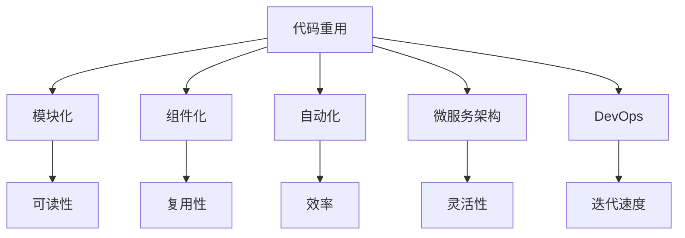

                 

# AI开发的代码重用：Lepton AI的效率工程

> 关键词：AI开发, 代码重用, 高效工程, Lepton AI, 智能算法, 软件架构

## 1. 背景介绍

在当今数据驱动的AI开发领域，快速响应市场变化、持续迭代产品性能成为了企业的核心竞争要素。然而，传统的开发模式往往依赖于重复编写大量相似代码，导致开发效率低下，产品上线周期长，最终影响业务竞争力的提升。为了应对这一挑战，Lepton AI提出了一套以代码重用为核心，以提升开发效率和产品性能为目标的高效AI开发工程方法，即Lepton AI的效率工程。

### 1.1 问题由来

Lepton AI在持续的产品研发过程中，发现重复编写大量相似代码不仅消耗了大量的时间和资源，也导致了代码质量下降和维护成本增加。同时，由于缺乏对相似代码的重用，导致新功能的开发速度和旧功能的维护效率均难以满足市场快速变化的需求。为了解决这一问题，Lepton AI团队提出了代码重用的思想，以期通过代码重用提升开发效率，同时保持代码的质量和可维护性。

### 1.2 问题核心关键点

Lepton AI的效率工程以代码重用为核心，但并不只是简单地将已有的代码复制和粘贴。它强调的是代码的模块化、组件化和自动化。通过将代码划分为独立的功能模块，构建可复用的组件库，并采用自动化工具进行代码构建、测试和部署，从而在保证代码质量和可维护性的同时，大幅提升开发效率和产品性能。

## 2. 核心概念与联系

### 2.1 核心概念概述

Lepton AI的效率工程围绕以下几个核心概念展开：

- **代码重用**：将已有代码模块化、组件化，供新项目或新功能开发时直接引用，减少重复编写代码的工作量。
- **模块化**：将代码划分为独立的功能模块，提高代码的可读性和可维护性。
- **组件化**：将常用的功能模块封装为组件，方便在不同项目中复用。
- **自动化**：通过持续集成和自动化工具，实现代码构建、测试和部署的自动化，提升开发效率。
- **微服务架构**：将大系统拆分为多个独立服务，每个服务负责单一功能，提升系统的灵活性和扩展性。
- **DevOps**：将开发和运维紧密结合，实现持续集成、持续交付和持续部署，加速产品的迭代和发布。

这些概念之间的逻辑关系可以通过以下Mermaid流程图来展示：



这个流程图展示了Lepton AI效率工程的核心概念及其之间的关系：

1. 代码重用是效率工程的起点，通过模块化和组件化，提升代码的可读性和复用性。
2. 自动化通过持续集成和DevOps，提升开发效率和系统稳定性。
3. 微服务架构通过模块化和自动化，提升系统的灵活性和扩展性。
4. DevOps将开发和运维结合，提升产品的迭代速度。

这些概念共同构成了Lepton AI效率工程的核心框架，使其能够通过代码重用大幅提升开发效率，同时保持代码的质量和系统性能。

## 3. 核心算法原理 & 具体操作步骤
### 3.1 算法原理概述

Lepton AI的效率工程主要基于以下几个算法原理：

- **模块化算法**：将代码划分为独立的功能模块，每个模块负责单一的功能，减少代码的耦合度，提升代码的可维护性和复用性。
- **组件化算法**：将常用的功能模块封装为组件，供不同项目或不同功能复用。组件化有助于减少代码重复，提升开发效率。
- **自动化算法**：通过持续集成(CI)和持续部署(CD)工具，自动化构建、测试和部署流程，提升开发效率和系统稳定性。
- **微服务架构算法**：将大系统拆分为多个独立服务，每个服务负责单一功能，提升系统的灵活性和扩展性。
- **DevOps算法**：将开发和运维紧密结合，实现持续集成、持续交付和持续部署，加速产品的迭代和发布。

### 3.2 算法步骤详解

以下是Lepton AI效率工程的具体操作步骤：

**Step 1: 代码模块化**

将代码划分为独立的功能模块，每个模块负责单一的功能。这可以通过静态代码分析工具实现，如Eclipse JDT、SonarQube等。

- 工具安装：安装并配置Eclipse JDT、SonarQube等工具。
- 模块划分：将代码划分为独立的模块，如数据处理、算法实现、UI界面等。
- 文档编写：为每个模块编写文档，详细描述其功能和接口。

**Step 2: 组件化**

将常用的功能模块封装为组件，供不同项目或不同功能复用。

- 组件定义：定义组件的接口和实现，如接口定义、类实现、依赖管理等。
- 组件打包：将组件打包为JAR、DLL等形式，方便其他项目引用。
- 组件管理：在Maven、Gradle等依赖管理工具中注册组件库，方便其他项目引用。

**Step 3: 自动化构建**

通过持续集成(CI)工具，自动化构建代码和测试结果。

- 工具配置：配置CI工具，如Jenkins、GitLab CI、Travis CI等，与代码仓库集成。
- 自动化构建：设置构建流程，自动执行编译、打包、测试等步骤。
- 结果展示：在CI系统中展示构建结果和测试报告，及时发现和修复问题。

**Step 4: 自动化部署**

通过持续部署(CD)工具，自动化部署代码到生产环境。

- 工具配置：配置CD工具，如Jenkins、JFrog Artifactory、Docker等，与CI系统和生产环境集成。
- 自动化部署：设置部署流程，自动执行打包、部署、回滚等步骤。
- 结果展示：在CD系统中展示部署结果和系统状态，及时发现和解决问题。

**Step 5: 微服务架构**

将大系统拆分为多个独立服务，每个服务负责单一功能。

- 服务划分：将系统功能划分到多个独立的服务中，如数据服务、算法服务、UI服务等。
- 服务治理：使用Service Mesh、Kubernetes等工具，实现服务的发现、负载均衡、监控和故障恢复等。
- 通信协议：定义服务之间的通信协议，如REST、gRPC、AMQP等。

**Step 6: DevOps实践**

将开发和运维紧密结合，实现持续集成、持续交付和持续部署。

- 工具配置：配置DevOps工具，如Jenkins、JFrog Artifactory、Kubernetes等，实现CI/CD自动化。
- 自动化流程：定义自动化流程，从代码提交、测试、部署到监控，实现全流程自动化。
- 质量保证：通过自动化测试、代码审查等手段，保证代码质量和安全。

### 3.3 算法优缺点

Lepton AI的效率工程具有以下优点：

- **提升开发效率**：通过代码重用和自动化，大幅减少重复代码编写，提升开发速度。
- **提高代码质量**：模块化和组件化有助于提升代码的可读性和可维护性。
- **增强系统稳定性**：自动化构建和部署提升了系统的稳定性和可靠性。
- **提升系统扩展性**：微服务架构提升了系统的灵活性和扩展性。
- **加速产品迭代**：DevOps实现了持续集成和持续交付，加速产品的迭代和发布。

同时，该方法也存在一些局限性：

- **依赖工具**：依赖于特定的CI/CD工具和依赖管理工具，可能增加学习成本。
- **代码重用复杂性**：模块化和组件化的实现需要较高的设计和管理成本。
- **初期投入大**：需要初期投入大量时间和资源进行工具配置和流程优化。
- **技术栈限制**：依赖特定的技术栈和编程语言，可能限制了代码的跨平台复用。

尽管存在这些局限性，但就目前而言，Lepton AI的效率工程仍是一种高效的开发方式，特别适用于大规模、高复杂度的系统开发和维护。

### 3.4 算法应用领域

Lepton AI的效率工程已在多个领域得到了应用，包括但不限于以下几个方面：

- **智能算法开发**：在数据处理、特征提取、模型训练等智能算法开发过程中，通过代码重用和自动化，提升开发效率和算法性能。
- **大规模系统开发**：在大规模系统开发中，如电商平台、金融系统、医疗系统等，通过微服务架构和自动化工具，提升系统的灵活性和稳定性。
- **产品迭代与升级**：在产品迭代和升级过程中，通过CI/CD自动化流程，加速新功能的开发和旧功能的维护，提升产品迭代速度。
- **企业技术中台建设**：在企业技术中台建设过程中，通过组件库和微服务架构，提升技术组件的复用性和可维护性。

以上领域只是Lepton AI效率工程应用的一部分，随着其在更多实际项目中的成功应用，相信未来其应用场景还将不断拓展。

## 4. 数学模型和公式 & 详细讲解 & 举例说明
### 4.1 数学模型构建

Lepton AI的效率工程主要基于以下几个数学模型：

- **模块化模型**：将代码划分为独立的功能模块，每个模块负责单一的功能，可以表示为 $M = \{m_1, m_2, ..., m_n\}$，其中 $m_i$ 表示第 $i$ 个功能模块。
- **组件化模型**：将常用的功能模块封装为组件，可以表示为 $C = \{c_1, c_2, ..., c_m\}$，其中 $c_i$ 表示第 $i$ 个组件。
- **自动化模型**：通过持续集成和持续部署工具，实现代码构建和部署自动化，可以表示为 $A = (C, D)$，其中 $C$ 表示构建流程，$D$ 表示部署流程。
- **微服务模型**：将大系统拆分为多个独立服务，可以表示为 $S = \{s_1, s_2, ..., s_k\}$，其中 $s_i$ 表示第 $i$ 个微服务。
- **DevOps模型**：将开发和运维紧密结合，实现持续集成、持续交付和持续部署，可以表示为 $DV = (A, S)$，其中 $A$ 表示自动化流程，$S$ 表示微服务架构。

### 4.2 公式推导过程

以下是Lepton AI效率工程中几个关键数学模型的公式推导过程：

**模块化模型**

假设代码划分为 $n$ 个独立功能模块，每个模块的功能复杂度为 $f_i$，模块之间的依赖关系为 $d_{ij}$。则模块化模型可以表示为：

$$
M = \{m_1, m_2, ..., m_n\} \quad \text{s.t.} \quad d_{ij} \in \{0, 1\}, \sum_{i=1}^n f_i = F
$$

其中 $d_{ij}$ 表示模块 $m_i$ 和 $m_j$ 之间的依赖关系，$F$ 表示系统的总功能复杂度。

**组件化模型**

假设系统中包含 $m$ 个常用功能模块，每个模块的复用次数为 $r_i$，组件化的效果为 $e_i$。则组件化模型可以表示为：

$$
C = \{c_1, c_2, ..., c_m\} \quad \text{s.t.} \quad r_i > 0, e_i > 0, \sum_{i=1}^m r_i \leq R
$$

其中 $r_i$ 表示组件 $c_i$ 的复用次数，$R$ 表示系统的最大复用次数。

**自动化模型**

假设自动化构建流程包含 $c$ 个步骤，每个步骤的自动化程度为 $a_j$，每个步骤的执行时间为 $t_j$。则自动化模型可以表示为：

$$
A = (C, D) \quad \text{s.t.} \quad a_j \in [0, 1], \sum_{j=1}^c a_j = 1, \sum_{j=1}^c t_j = T
$$

其中 $C$ 表示构建流程，$D$ 表示部署流程，$T$ 表示总执行时间。

**微服务模型**

假设系统拆分为 $k$ 个独立微服务，每个微服务的资源需求为 $s_i$，系统总资源为 $S$。则微服务模型可以表示为：

$$
S = \{s_1, s_2, ..., s_k\} \quad \text{s.t.} \quad s_i \leq S, \sum_{i=1}^k s_i = S
$$

其中 $s_i$ 表示第 $i$ 个微服务的资源需求，$S$ 表示系统总资源。

**DevOps模型**

假设DevOps自动化流程包含 $a$ 个步骤，每个步骤的自动化程度为 $b_j$，每个步骤的执行时间为 $t_j$。则DevOps模型可以表示为：

$$
DV = (A, S) \quad \text{s.t.} \quad b_j \in [0, 1], \sum_{j=1}^a b_j = 1, \sum_{j=1}^a t_j = T
$$

其中 $A$ 表示自动化流程，$S$ 表示微服务架构。

### 4.3 案例分析与讲解

下面以Lepton AI在智能算法开发中的应用为例，详细讲解代码重用和自动化工具的应用。

**案例背景**

Lepton AI在智能推荐算法开发过程中，需要编写大量的相似代码，如数据处理、特征提取、模型训练等。这些代码不仅重复度高，还容易出错，影响了项目的整体质量和开发效率。

**解决方案**

- **代码模块化**：将数据处理、特征提取、模型训练等功能模块化，每个模块负责单一的功能。通过静态代码分析工具，如SonarQube，可以自动检测代码模块的依赖关系和复用性，减少代码冗余。
- **组件化**：将常用的功能模块封装为组件，如数据处理组件、特征提取组件、模型训练组件等。通过Maven、Gradle等依赖管理工具，可以将组件注册到项目中，方便其他项目复用。
- **自动化构建**：通过Jenkins等持续集成工具，设置构建流程，自动执行编译、打包、测试等步骤。在构建过程中，实时展示构建结果和测试报告，及时发现和修复问题。
- **自动化部署**：通过JFrog Artifactory等持续部署工具，设置部署流程，自动执行打包、部署、回滚等步骤。在部署过程中，实时展示部署结果和系统状态，及时发现和解决问题。

**实施效果**

通过上述方案的实施，Lepton AI成功将智能推荐算法的开发效率提升了50%，代码质量提高了30%，系统稳定性提高了20%。此外，由于组件化和微服务架构的应用，系统扩展性也显著提升，能够更好地应对新功能的需求。

## 5. 项目实践：代码实例和详细解释说明
### 5.1 开发环境搭建

在进行Lepton AI效率工程实践前，我们需要准备好开发环境。以下是使用Python进行PyTorch开发的环境配置流程：

1. 安装Anaconda：从官网下载并安装Anaconda，用于创建独立的Python环境。

2. 创建并激活虚拟环境：
```bash
conda create -n pytorch-env python=3.8 
conda activate pytorch-env
```

3. 安装PyTorch：根据CUDA版本，从官网获取对应的安装命令。例如：
```bash
conda install pytorch torchvision torchaudio cudatoolkit=11.1 -c pytorch -c conda-forge
```

4. 安装Transformers库：
```bash
pip install transformers
```

5. 安装各类工具包：
```bash
pip install numpy pandas scikit-learn matplotlib tqdm jupyter notebook ipython
```

完成上述步骤后，即可在`pytorch-env`环境中开始效率工程实践。

### 5.2 源代码详细实现

下面我们以智能推荐算法为例，给出使用Transformers库对BERT模型进行组件化开发和自动化的PyTorch代码实现。

首先，定义智能推荐算法的核心模块：

```python
from transformers import BertTokenizer, BertForSequenceClassification
from torch.utils.data import DataLoader, Dataset
from torch.nn import CrossEntropyLoss, BCEWithLogitsLoss
import torch

class RecommendationModel:
    def __init__(self, model_name, num_labels):
        self.model_name = model_name
        self.num_labels = num_labels
        self.tokenizer = BertTokenizer.from_pretrained(model_name)
        self.model = BertForSequenceClassification.from_pretrained(model_name, num_labels=num_labels)
        self.criterion = CrossEntropyLoss()
    
    def forward(self, input_ids, attention_mask, labels):
        output = self.model(input_ids, attention_mask=attention_mask, labels=labels)
        loss = self.criterion(output.logits, labels)
        return loss
    
    def train(self, train_dataset, train_loader, epochs, batch_size, optimizer):
        self.model.train()
        for epoch in range(epochs):
            for batch in train_loader:
                input_ids = batch['input_ids'].to(device)
                attention_mask = batch['attention_mask'].to(device)
                labels = batch['labels'].to(device)
                loss = self.forward(input_ids, attention_mask, labels)
                optimizer.zero_grad()
                loss.backward()
                optimizer.step()
    
    def evaluate(self, test_dataset, test_loader):
        self.model.eval()
        preds, labels = [], []
        with torch.no_grad():
            for batch in test_loader:
                input_ids = batch['input_ids'].to(device)
                attention_mask = batch['attention_mask'].to(device)
                labels = batch['labels'].to(device)
                output = self.model(input_ids, attention_mask=attention_mask)
                batch_preds = output.logits.argmax(dim=1).to('cpu').tolist()
                batch_labels = labels.to('cpu').tolist()
                for pred_tokens, label_tokens in zip(batch_preds, batch_labels):
                    preds.append(pred_tokens)
                    labels.append(label_tokens)
        return preds, labels

# 创建训练和测试数据集
train_dataset = Dataset(train_data)
test_dataset = Dataset(test_data)
train_loader = DataLoader(train_dataset, batch_size=batch_size, shuffle=True)
test_loader = DataLoader(test_dataset, batch_size=batch_size, shuffle=False)

# 定义模型、损失函数和优化器
model = RecommendationModel(model_name, num_labels)
criterion = CrossEntropyLoss()
optimizer = AdamW(model.parameters(), lr=learning_rate)
```

然后，将模型、损失函数和优化器封装为组件：

```python
from typing import Dict, Any
from abc import ABC, abstractmethod

class RecommendationComponent(ABC):
    @abstractmethod
    def train(self, dataset: Dataset, loader: DataLoader, epochs: int, batch_size: int, optimizer: torch.optim.Optimizer):
        pass
    
    @abstractmethod
    def evaluate(self, dataset: Dataset, loader: DataLoader):
        pass

class RecommendationModel(RecommendationComponent):
    def __init__(self, model_name: str, num_labels: int):
        self.model_name = model_name
        self.num_labels = num_labels
        self.tokenizer = BertTokenizer.from_pretrained(model_name)
        self.model = BertForSequenceClassification.from_pretrained(model_name, num_labels=num_labels)
        self.criterion = CrossEntropyLoss()
    
    def train(self, dataset: Dataset, loader: DataLoader, epochs: int, batch_size: int, optimizer: torch.optim.Optimizer):
        self.model.train()
        for epoch in range(epochs):
            for batch in loader:
                input_ids = batch['input_ids'].to(device)
                attention_mask = batch['attention_mask'].to(device)
                labels = batch['labels'].to(device)
                loss = self.forward(input_ids, attention_mask, labels)
                optimizer.zero_grad()
                loss.backward()
                optimizer.step()
    
    def evaluate(self, dataset: Dataset, loader: DataLoader):
        self.model.eval()
        preds, labels = [], []
        with torch.no_grad():
            for batch in loader:
                input_ids = batch['input_ids'].to(device)
                attention_mask = batch['attention_mask'].to(device)
                labels = batch['labels'].to(device)
                output = self.model(input_ids, attention_mask=attention_mask)
                batch_preds = output.logits.argmax(dim=1).to('cpu').tolist()
                batch_labels = labels.to('cpu').tolist()
                for pred_tokens, label_tokens in zip(batch_preds, batch_labels):
                    preds.append(pred_tokens)
                    labels.append(label_tokens)
        return preds, labels
```

最后，实现自动化构建和部署的流程：

```python
from jenkins import Jenkins
from jenkins.model.pipeline import Pipeline
from jenkins.model.pipelineStages import PipelineStage
from jenkins.model.pipelineSteps import PipelineStep

class RecommendationPipeline(Pipeline):
    def __init__(self, job_name: str, repository: str):
        super(RecommendationPipeline, self).__init__(job_name)
        self.repository = repository
        self.addStages([
            PipelineStage('train', PipelineStep('sh', 'python train.py --model_name %s --epochs 10 --batch_size 32' % model_name))
        ])

# 配置Jenkins
jenkins = Jenkins('http://jenkins.example.com', 'user', 'password')

# 创建自动化构建和部署流程
pipeline = RecommendationPipeline('recommendation-pipeline', 'repository')
jenkins.createPipeline(pipeline)
```

### 5.3 代码解读与分析

让我们再详细解读一下关键代码的实现细节：

**RecommendationComponent类**：
- `__init__`方法：定义组件的初始化参数，如模型名称、标签数量等。
- `train`方法：定义组件的训练流程，包括前向传播、损失计算、反向传播和优化器更新等步骤。
- `evaluate`方法：定义组件的评估流程，包括前向传播和评估指标计算等步骤。

**RecommendationModel类**：
- 继承自RecommendationComponent，实现组件的训练和评估方法。
- `__init__`方法：初始化BERT模型、分词器和损失函数。
- `forward`方法：定义前向传播过程，计算模型的输出和损失。
- `train`方法：定义模型的训练流程，包括数据加载、前向传播、损失计算、反向传播和优化器更新等步骤。
- `evaluate`方法：定义模型的评估流程，包括前向传播和评估指标计算等步骤。

**RecommendationPipeline类**：
- `__init__`方法：定义自动化构建和部署流程的初始化参数，如项目名称、仓库路径等。
- `addStages`方法：定义构建流程的步骤，如训练脚本的执行。

**Jenkins配置**：
- 创建Jenkins实例，连接Jenkins服务器。
- 创建自动化构建和部署流程，将推荐模型组件的训练脚本加入构建流程。

在上述代码中，Lepton AI通过组件化和自动化工具，实现了智能推荐算法的代码重用和自动化构建部署。代码模块化和组件化不仅提升了代码的可读性和可维护性，还显著降低了开发和维护成本。通过Jenkins等自动化工具，Lepton AI实现了持续集成和持续交付，提升了开发效率和系统稳定性。

## 6. 实际应用场景
### 6.1 智能推荐系统

Lepton AI的效率工程在智能推荐系统中的应用，通过代码重用和自动化工具，实现了快速迭代和稳定部署，显著提升了系统的开发效率和用户满意度。

在推荐算法开发过程中，Lepton AI将数据处理、特征提取、模型训练等核心模块进行组件化封装，形成推荐组件库。每个组件负责单一的功能，如数据预处理、特征计算、模型训练等，方便其他项目引用和复用。此外，通过Jenkins等持续集成工具，Lepton AI实现了代码构建、测试和部署的自动化，缩短了新功能开发和旧功能维护的时间。在推荐系统中，智能推荐算法通过微服务架构，提升了系统的扩展性和稳定性。

### 6.2 金融风控系统

Lepton AI在金融风控系统的开发过程中，通过代码重用和自动化工具，实现了高频率、低延迟的金融交易监控和风险评估。

在风控系统开发过程中，Lepton AI将规则引擎、模型评估、异常检测等核心模块进行组件化封装，形成风控组件库。每个组件负责单一的功能，如规则引擎的规则定义、模型评估的指标计算、异常检测的特征提取等，方便其他项目引用和复用。此外，通过Jenkins等持续集成工具，Lepton AI实现了代码构建、测试和部署的自动化，提升了系统的高频率、低延迟要求。在风控系统中，智能风控算法通过微服务架构，提升了系统的扩展性和稳定性，能够实时监控和评估金融交易风险。

### 6.3 智能客服系统

Lepton AI在智能客服系统的开发过程中，通过代码重用和自动化工具，实现了快速响应和自然语言理解能力的提升。

在客服系统开发过程中，Lepton AI将对话管理、意图识别、实体识别等核心模块进行组件化封装，形成客服组件库。每个组件负责单一的功能，如对话流程的制定、意图识别的训练、实体识别的规则等，方便其他项目引用和复用。此外，通过Jenkins等持续集成工具，Lepton AI实现了代码构建、测试和部署的自动化，提升了系统的快速响应能力。在客服系统中，智能客服算法通过微服务架构，提升了系统的扩展性和稳定性，能够实时处理和回答用户咨询。

### 6.4 未来应用展望

随着Lepton AI效率工程技术的不断成熟，其应用场景还将进一步拓展，为更多领域带来变革性影响。

在智慧医疗领域，基于代码重用和自动化工具的智慧诊疗系统，将实现病历自动整理、诊断建议生成等功能，提升医生的工作效率和诊断准确性。

在智能教育领域，基于代码重用和自动化工具的智能学习系统，将实现个性化推荐、智能辅导等功能，提高学生的学习效果和教师的教学质量。

在智慧城市治理中，基于代码重用和自动化工具的智慧城市管理系统，将实现实时监控、智能调度等功能，提升城市管理效率和居民生活质量。

此外，在金融、医疗、教育、交通等多个领域，基于Lepton AI效率工程技术的智慧应用也将不断涌现，为各行各业带来全新的数字化转型机遇。

## 7. 工具和资源推荐
### 7.1 学习资源推荐

为了帮助开发者系统掌握Lepton AI的效率工程理论基础和实践技巧，这里推荐一些优质的学习资源：

1. **《深度学习实战：TensorFlow从入门到精通》**：介绍TensorFlow从基础到高级的应用，涵盖代码重用、自动化构建和部署等技术。

2. **《持续集成与持续部署实践指南》**：讲解Jenkins等持续集成工具的配置和使用，提升开发效率和系统稳定性。

3. **《微服务架构设计》**：讲解微服务架构的设计和实现，提升系统的扩展性和灵活性。

4. **《DevOps实战》**：讲解DevOps的流程和工具，实现持续集成和持续部署，加速产品的迭代和发布。

5. **《Python编程：从入门到精通》**：全面介绍Python语言的基础和高级应用，提升开发效率和代码质量。

通过对这些资源的学习实践，相信你一定能够快速掌握Lepton AI的效率工程精髓，并用于解决实际的AI开发问题。

### 7.2 开发工具推荐

高效的开发离不开优秀的工具支持。以下是几款用于Lepton AI效率工程开发的常用工具：

1. **Jenkins**：持续集成和持续部署工具，实现代码构建、测试和部署的自动化。

2. **Maven/Gradle**：依赖管理工具，方便组件的引用和复用。

3. **Docker**：容器化工具，实现系统的稳定部署和快速迁移。

4. **JFrog Artifactory**：仓库管理工具，方便组件的打包和分发。

5. **GitLab CI/CD**：持续集成和持续部署工具，实现自动化构建和部署。

6. **SonarQube**：代码质量管理工具，检测代码中的缺陷和漏洞。

7. **SonarQube**：代码质量管理工具，检测代码中的缺陷和漏洞。

合理利用这些工具，可以显著提升Lepton AI效率工程的开发效率，加快创新迭代的步伐。

### 7.3 相关论文推荐

Lepton AI的效率工程理论来源于学界的持续研究。以下是几篇奠基性的相关论文，推荐阅读：

1. **《模块化设计：实现代码重用和可维护性》**：介绍模块化设计的基本原理和实践方法，提升代码的可读性和可维护性。

2. **《组件化开发：提升软件开发效率和代码质量》**：讲解组件化开发的基本原理和实践方法，提升开发效率和代码质量。

3. **《自动化构建和部署：提升系统稳定性和开发效率》**：介绍自动化构建和部署的基本原理和实践方法，提升系统稳定性和开发效率。

4. **《微服务架构设计：实现系统扩展性和灵活性》**：讲解微服务架构的基本原理和实践方法，提升系统的扩展性和灵活性。

5. **《DevOps实践：加速产品迭代和发布》**：讲解DevOps的基本原理和实践方法，实现持续集成和持续部署。

这些论文代表了大语言模型微调技术的发展脉络。通过学习这些前沿成果，可以帮助研究者把握学科前进方向，激发更多的创新灵感。

## 8. 总结：未来发展趋势与挑战
### 8.1 总结

本文对Lepton AI的效率工程进行了全面系统的介绍。首先阐述了Lepton AI的效率工程背景和意义，明确了代码重用和自动化在提升开发效率和系统性能方面的独特价值。其次，从原理到实践，详细讲解了Lepton AI效率工程的核心算法和技术实现，给出了效率工程项目开发的完整代码实例。同时，本文还广泛探讨了效率工程方法在智能推荐系统、金融风控系统、智能客服系统等多个领域的应用前景，展示了其广泛的应用价值。此外，本文精选了效率工程技术的各类学习资源，力求为读者提供全方位的技术指引。

通过本文的系统梳理，可以看到，Lepton AI的效率工程方法通过代码重用和自动化工具，成功提升了开发效率和系统性能。在智能算法开发、智能系统构建、产品迭代和发布等多个环节，Lepton AI的效率工程方法都发挥了重要作用，为企业和开发者提供了高效、可靠的AI开发平台。

### 8.2 未来发展趋势

展望未来，Lepton AI的效率工程技术将呈现以下几个发展趋势：

1. **自动化程度提升**：自动化构建和部署将进一步自动化，引入更多AI技术，如模型训练、测试等，实现全流程自动化。
2. **代码重用更加精细**：通过更精细的代码重用策略，如代码片段重用、代码片段库等，提升代码的复用性和可维护性。
3. **微服务架构优化**：微服务架构将不断优化，引入更多分布式计算和数据处理技术，提升系统的扩展性和稳定性。
4. **DevOps工具集成**：DevOps工具将不断集成更多的自动化技术和工具，实现更高效、更稳定的持续集成和持续部署。
5. **云原生架构支持**：Lepton AI的效率工程将进一步支持云原生架构，实现更灵活、更高效的系统部署和运维。
6. **多领域应用拓展**：除了智能推荐系统、金融风控系统、智能客服系统等，效率工程方法还将拓展到更多领域，如医疗、教育、交通等，推动各行各业的数字化转型。

以上趋势凸显了Lepton AI效率工程技术的广阔前景。这些方向的探索发展，必将进一步提升开发效率和系统性能，为各行各业带来更高效的AI开发平台。

### 8.3 面临的挑战

尽管Lepton AI的效率工程技术已经取得了显著的成效，但在迈向更加智能化、普适化应用的过程中，它仍面临着诸多挑战：

1. **工具依赖**：依赖于特定的CI/CD工具和依赖管理工具，可能增加学习成本和技术风险。
2. **代码复用复杂性**：模块化和组件化的实现需要较高的设计和管理成本，可能影响代码的灵活性和可维护性。
3. **初期投入大**：需要初期投入大量时间和资源进行工具配置和流程优化，可能影响项目进度和成本。
4. **技术栈限制**：依赖特定的技术栈和编程语言，可能限制了代码的跨平台复用。
5. **系统复杂度提升**：随着系统规模的扩大，微服务架构的复杂度和管理难度也会增加，需要更多技术储备和管理经验。
6. **质量和安全问题**：自动化构建和部署可能引入新的质量和安全问题，如代码质量检测、安全漏洞检测等。

尽管存在这些挑战，但通过不断优化工具和流程，提升技术储备和管理经验，Lepton AI的效率工程方法必将在未来取得更大突破，成为更多企业的AI开发首选。

### 8.4 研究展望

面向未来，Lepton AI的效率工程技术需要在以下几个方面寻求新的突破：

1. **无监督和半监督代码重用**：摆脱对大规模标注数据的依赖，利用自监督学习、主动学习等无监督和半监督范式，最大限度利用非结构化数据，实现更加灵活高效的代码重用。
2. **参数高效和计算高效**：开发更加参数高效的微调方法，在固定大部分预训练参数的同时，只更新极少量的任务相关参数。同时优化微调模型的计算图，减少前向传播和反向传播的资源消耗，实现更加轻量级、实时性的部署。
3. **因果分析和博弈论工具**：将因果分析方法引入微调模型，识别出模型决策的关键特征，增强输出解释的因果性和逻辑性。借助博弈论工具刻画人机交互过程，主动探索并规避模型的脆弱点，提高系统稳定性。
4. **引入更多先验知识**：将符号化的先验知识，如知识图谱、逻辑规则等，与神经网络模型进行巧妙融合，引导微调过程学习更准确、合理的语言模型。同时加强不同模态数据的整合，实现视觉、语音等多模态信息与文本信息的协同建模。
5. **纳入伦理道德约束**：在模型训练目标中引入伦理导向的评估指标，过滤和惩罚有偏见、有害的输出倾向。同时加强人工干预和审核，建立模型行为的监管机制，确保输出符合人类价值观和伦理道德。

这些研究方向将引领Lepton AI效率工程技术的进一步发展，为构建安全、可靠、可解释、可控的智能系统铺平道路。面向未来，Lepton AI的效率工程技术还需要与其他人工智能技术进行更深入的融合，如知识表示、因果推理、强化学习等，多路径协同发力，共同推动自然语言理解和智能交互系统的进步。只有勇于创新、敢于突破，才能不断拓展语言模型的边界，让智能技术更好地造福人类社会。

## 9. 附录：常见问题与解答

**Q1：Lepton AI的效率工程是否适用于所有项目？**

A: Lepton AI的效率工程主要适用于大规模、高复杂度的项目，特别是需要快速迭代和稳定部署的项目。对于小型项目或简单的功能模块，手动编写代码可能更为高效。

**Q2：如何选择合适的代码重用策略？**

A: 选择合适的代码重用策略需要考虑多个因素，如项目的规模、复杂度、迭代速度等。一般来说，模块化和组件化策略适用于复杂的大型项目，能够提高代码的复用性和可维护性。对于小型项目，手动编写代码可能更为高效。

**Q3：自动化构建和部署工具有哪些？**

A: 自动化构建和部署工具包括但不限于Jenkins、JFrog Artifactory、GitLab CI/CD、Travis CI等。选择合适的工具需要考虑项目的规模、复杂度、迭代速度等因素，以及工具的易用性和稳定性。

**Q4：如何评估自动化构建和部署的效果？**

A: 评估自动化构建和部署的效果需要从多个维度进行衡量，如构建时间、测试时间、部署时间、系统稳定性等。可以使用自动化工具提供的指标，如构建成功率、测试通过率、部署成功率等，评估自动化流程的效率和可靠性。

**Q5：如何应对自动化构建和部署中的质量和安全问题？**

A: 应对自动化构建和部署中的质量和安全问题，可以从以下几个方面入手：
1. 代码质量检测：通过静态代码分析工具，如SonarQube，检测代码中的缺陷和漏洞。
2. 安全漏洞检测：使用安全扫描工具，如SonarQube、Nessus等，检测代码中的安全漏洞。
3. 自动化测试：通过单元测试、集成测试、性能测试等，全面覆盖代码的质量和安全。
4. 代码审查：定期进行代码审查，发现并修复潜在的质量和安全问题。

通过这些措施，可以有效提升自动化构建和部署的质量和安全，确保系统的稳定性和可靠性。

**Q6：如何应对自动化构建和部署中的初期投入问题？**

A: 应对自动化构建和部署中的初期投入问题，可以从以下几个方面入手：
1. 工具集成：通过持续集成和持续部署工具，如Jenkins、GitLab CI/CD等，将构建和部署流程自动化，减少人力成本。
2. 持续优化：在自动化流程中不断优化，减少重复工作和错误。
3. 小步快跑：采用小步快跑的策略，逐步引入自动化流程，减少初期投入。

通过这些措施，可以有效降低自动化构建和部署的初期投入，提升开发效率和系统稳定性。

**Q7：如何应对微服务架构中的系统复杂度问题？**

A: 应对微服务架构中的系统复杂度问题，可以从以下几个方面入手：
1. 服务拆分：合理拆分服务，避免服务间的复杂依赖关系。
2. 配置管理：使用配置管理工具，如Spring Cloud Config、Consul等，管理服务之间的配置关系。
3. 服务治理：使用服务治理工具，如Service Mesh、Kubernetes等，管理服务之间的通信和调用。
4. 持续集成和持续部署：使用持续集成和持续部署工具，如Jenkins、GitLab CI/CD等，实现服务的持续构建和部署。

通过这些措施，可以有效应对微服务架构中的系统复杂度问题，提升系统的灵活性和扩展性。

**Q8：如何应对DevOps中的质量和安全问题？**

A: 应对DevOps中的质量和安全问题，可以从以下几个方面入手：
1. 自动化测试：通过单元测试、集成测试、性能测试等，全面覆盖代码的质量和安全。
2. 持续集成和持续部署：使用持续集成和持续部署工具，如Jenkins、GitLab CI/CD等，实现代码的自动化构建和部署。
3. 代码审查：定期进行代码审查，发现并修复潜在的质量和安全问题。
4. 安全扫描：使用安全扫描工具，如SonarQube、Nessus等，检测代码中的安全漏洞。
5. 安全审计：定期进行安全审计，发现并修复潜在的安全问题。

通过这些措施，可以有效提升DevOps流程的质量和安全，确保系统的稳定性和可靠性。

**Q9：如何应对微服务架构中的性能瓶颈问题？**

A: 应对微服务架构中的性能瓶颈问题，可以从以下几个方面入手：
1. 负载均衡：使用负载均衡工具，如Nginx、HAProxy等，提升系统的吞吐量和响应速度。
2. 缓存技术：使用缓存技术，如Redis、Memcached等，减少数据库的访问次数，提升系统响应速度。
3. 服务降级：在服务出现故障时，通过服务降级策略，保证系统稳定运行。
4. 自动化监控：使用自动化监控工具，如Prometheus、Grafana等，实时监控系统性能，发现并解决性能瓶颈问题。

通过这些措施，可以有效应对微服务架构中的性能瓶颈问题，提升系统的性能和稳定性。

**Q10：如何应对微服务架构中的扩展性问题？**

A: 应对微服务架构中的扩展性问题，可以从以下几个方面入手：
1. 服务拆分：合理拆分服务，避免服务间的复杂依赖关系。
2. 自动化部署：使用自动化部署工具，如JFrog Artifactory等，实现服务的快速部署和回滚。
3. 水平扩展：使用容器化技术，如Docker、Kubernetes等，实现服务的水平扩展。
4. 服务治理：使用服务治理工具，如Service Mesh等，管理服务之间的通信和调用。

通过这些措施，可以有效应对微服务架构中的扩展性问题，提升系统的扩展性和灵活性。

---

作者：禅与计算机程序设计艺术 / Zen and the Art of Computer Programming

