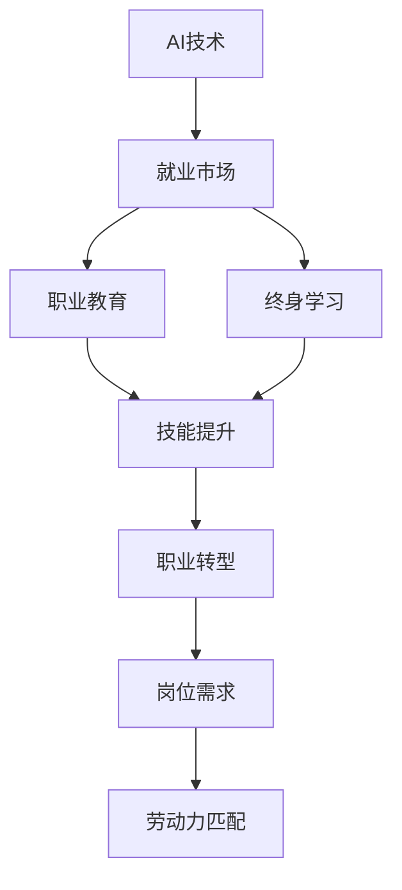

                 

# AI技术的就业影响应对:职业教育和终身学习体系

> 关键词：AI技术, 就业影响, 职业教育, 终身学习, 技能提升, 就业转岗

## 1. 背景介绍

### 1.1 问题由来
在人工智能(AI)技术迅猛发展的背景下，越来越多的企业开始采用自动化和智能化手段来优化业务流程和提高运营效率。虽然AI的应用带来了显著的经济效益，但同时也对就业市场产生了深远影响，引起了一些职业的消失或转型，以及新的岗位需求的增加。如何有效应对这些变化，确保劳动力市场平稳过渡，成为社会关注的焦点。

### 1.2 问题核心关键点
- **AI对就业市场的正面影响**：自动化和智能化手段能够大幅度提升生产效率，创造更多就业岗位。
- **AI对就业市场的负面影响**：某些重复性、低技能岗位可能被自动化系统取代，导致失业问题。
- **职业教育和终身学习的重要性**：为了应对AI技术带来的就业市场变化，需要构建职业教育体系和终身学习机制，提升劳动力技能，实现职业转型。

### 1.3 问题研究意义
构建适应AI技术变革的职业教育和终身学习体系，对于保持劳动力市场的稳定性和经济发展的可持续性具有重要意义：

- 提升劳动力的技能水平，使其能够胜任新的岗位需求。
- 促进职业转型，帮助失业或低技能工人找到新的就业机会。
- 推动教育和培训机构的创新，提升教育质量和就业导向性。
- 支持企业数字化转型，提升竞争力。

## 2. 核心概念与联系

### 2.1 核心概念概述

为了更好地理解AI技术对就业市场的影响，并构建相应的职业教育体系，需要理解以下关键概念：

- **AI技术**：指包括机器学习、深度学习、自然语言处理、计算机视觉等在内的多种人工智能技术。这些技术能够模拟人类智能，在各种领域实现自动化和智能化。

- **就业市场**：指劳动力的供需市场，是企业、岗位和劳动者三方在市场上的互动关系。AI技术的发展将改变就业市场的供需平衡和岗位结构。

- **职业教育**：指通过有组织、系统的教育培训，使劳动者获得特定职业所需技能和知识的过程。职业教育的目标是为劳动力市场培养符合当前和未来需求的岗位人才。

- **终身学习**：指劳动者在职业生涯中的持续学习和发展过程，旨在提升其技能和知识，适应不断变化的工作环境和职业需求。

这些概念之间的联系可以通过以下Mermaid流程图来展示：



这个流程图展示了AI技术、就业市场、职业教育、终身学习和技能提升、职业转型、岗位需求、劳动力匹配之间的联系：

1. AI技术的发展直接影响就业市场的供需平衡和岗位结构。
2. 通过职业教育，劳动者能够获得适应AI时代的新技能和知识。
3. 终身学习体系支持劳动者的持续技能提升和职业发展。
4. 技能提升和职业转型最终促进了岗位需求的调整和劳动力市场的匹配。

## 3. 核心算法原理 & 具体操作步骤
### 3.1 算法原理概述

为了构建适应AI技术变革的职业教育和终身学习体系，需要理解AI技术在就业市场中的作用机制，并设计相应的策略。核心算法原理包括：

1. **市场影响评估**：通过AI技术的应用场景和影响分析，评估其对就业市场的正面和负面效应。
2. **技能需求预测**：根据AI技术的引入，预测未来劳动市场对新技能的需求。
3. **技能提升策略**：设计职业教育课程和培训项目，提升劳动者所需技能，实现职业转型。
4. **终身学习体系**：构建终身学习平台和机制，支持劳动者持续学习和技能提升。

### 3.2 算法步骤详解

基于上述核心算法原理，构建适应AI技术变革的职业教育和终身学习体系，需要遵循以下步骤：

**Step 1: 市场影响评估**

1. **数据收集**：收集AI技术在各个行业的应用数据，分析其对就业市场的影响。
2. **效应分析**：通过定量和定性分析，评估AI技术对岗位需求、岗位技能、岗位结构的影响。
3. **风险预测**：预测AI技术引入后可能导致的就业岗位变化、失业风险和劳动力市场的不稳定性。

**Step 2: 技能需求预测**

1. **技能映射**：根据AI技术的应用场景，确定所需的新技能和知识。
2. **需求分析**：分析这些新技能在当前就业市场中的需求量和供应量，找出供需差距。
3. **预测模型**：建立基于历史数据和专家知识的预测模型，预测未来技能需求。

**Step 3: 技能提升策略**

1. **课程设计**：根据预测的技能需求，设计针对性职业教育课程，包括理论教学和实践操作。
2. **培训实施**：利用线上线下结合的方式，实施培训项目，提升劳动者的技能水平。
3. **评估反馈**：通过评估和反馈机制，不断优化培训内容和方式，确保培训效果。

**Step 4: 终身学习体系**

1. **平台建设**：构建终身学习平台，提供在线学习资源和技能提升课程。
2. **机制设计**：设计激励机制，鼓励劳动者持续参与学习和技能提升。
3. **服务支持**：提供学习支持服务，如导师辅导、学习社区等，促进学习效果。

### 3.3 算法优缺点

构建适应AI技术变革的职业教育和终身学习体系，具有以下优点：

1. **提升技能水平**：通过有组织、系统的培训，提高劳动者的技能水平，适应AI时代的新岗位需求。
2. **促进职业转型**：通过技能提升和职业教育，帮助失业或低技能工人找到新的就业机会，实现职业转型。
3. **提高教育质量**：通过市场导向的教育和培训，提高职业教育的质量和就业导向性。
4. **支持企业发展**：通过提升劳动者的技能水平，支持企业的数字化转型，提升竞争力。

同时，该体系也存在一些局限性：

1. **资源投入大**：需要大量的资金、人力和技术投入，以构建和维护教育和培训体系。
2. **实施难度高**：职业教育体系的建设需要政府、企业和教育机构的协调配合，实施难度较大。
3. **效果评估难**：技能提升和职业转型的效果评估存在一定难度，需要长期跟踪和评估。

尽管如此，构建适应AI技术变革的职业教育和终身学习体系，仍然是大势所趋，能够有效应对AI技术带来的就业市场变化。

### 3.4 算法应用领域

基于AI技术变革的职业教育和终身学习体系，在多个领域具有广泛的应用前景：

1. **制造业**：通过技能提升和职业教育，培养适应智能制造的工程师和技术工人。
2. **服务业**：提升服务人员的服务技能，使其能够胜任智能化、自动化的服务岗位。
3. **医疗健康**：培养能够应用AI技术进行数据分析、诊断和治疗的医护人员。
4. **金融行业**：提升金融从业者的数据分析和自动化技能，适应金融科技的发展。
5. **教育培训**：通过技能提升和职业教育，培养适应未来教育需求的新型教师。

这些应用领域展示了职业教育体系和终身学习体系在AI技术变革中的重要性和广泛性。

## 4. 数学模型和公式 & 详细讲解 & 举例说明

### 4.1 数学模型构建

为了构建适应AI技术变革的职业教育和终身学习体系，需要建立数学模型来描述和预测就业市场的变化。核心数学模型包括：

- **市场需求预测模型**：通过回归分析、时间序列分析等方法，预测未来岗位需求的变化。
- **技能需求映射模型**：通过映射分析，将AI技术所需的新技能映射到现有岗位需求中。
- **学习效果评估模型**：通过评估模型的表现，预测学习效果的提升幅度。

### 4.2 公式推导过程

以下以市场需求预测模型为例，推导其数学公式。

假设市场需求与时间 $t$ 的关系可以用线性回归模型表示：

$$
y_t = \alpha + \beta t + \epsilon_t
$$

其中，$y_t$ 表示第 $t$ 年的岗位需求，$\alpha$ 和 $\beta$ 为模型参数，$\epsilon_t$ 为误差项。根据历史数据，可以通过最小二乘法求解 $\alpha$ 和 $\beta$：

$$
\alpha = \frac{1}{N} \sum_{i=1}^N y_i - \frac{1}{N} \sum_{i=1}^N x_i \beta
$$
$$
\beta = \frac{1}{N} \sum_{i=1}^N (x_i - \bar{x}) (y_i - \bar{y}) / \sum_{i=1}^N (x_i - \bar{x})^2
$$

其中，$N$ 为样本数量，$\bar{x}$ 和 $\bar{y}$ 分别为 $x$ 和 $y$ 的均值。

### 4.3 案例分析与讲解

以医疗健康行业为例，分析AI技术对其就业市场的影响。

- **市场需求预测**：通过回归模型，预测AI技术在医疗诊断、治疗、管理等领域的岗位需求变化。
- **技能需求映射**：将AI技术所需的新技能（如数据分析、机器学习、图像处理等）映射到现有岗位中，确定岗位技能要求的变化。
- **技能提升策略**：设计针对这些新技能的职业教育课程，如数据科学、机器学习、医疗数据分析等，提升医护人员的技能水平。
- **终身学习体系**：构建在线学习平台，提供相关课程和资源，支持医护人员持续学习和技能提升。

## 5. 项目实践：代码实例和详细解释说明
### 5.1 开发环境搭建

在进行职业教育和终身学习体系的项目实践前，需要准备好开发环境。以下是使用Python进行开发的常见环境配置流程：

1. **安装Python**：从官网下载并安装Python，确保安装版本与项目兼容。
2. **安装依赖库**：通过pip安装所需的依赖库，如Pandas、NumPy、Matplotlib等。
3. **搭建开发环境**：使用IDE（如PyCharm、Jupyter Notebook等）搭建开发环境，方便代码调试和测试。

### 5.2 源代码详细实现

以下是一个简单的市场需求预测模型的Python实现示例：

```python
import pandas as pd
from sklearn.linear_model import LinearRegression

# 加载数据集
data = pd.read_csv('market_data.csv')

# 数据预处理
X = data['year'].values.reshape(-1, 1)
y = data['demand'].values.reshape(-1, 1)

# 训练模型
model = LinearRegression()
model.fit(X, y)

# 预测未来市场
future_year = 2025
future_demand = model.predict([[future_year]])
print(f'2025年的市场需求为：{future_demand[0][0]}')
```

### 5.3 代码解读与分析

上述代码实现了一个简单的线性回归模型，用于预测市场需求的变化。关键代码如下：

1. **数据加载**：使用Pandas库加载市场需求数据集。
2. **数据预处理**：将年份作为自变量，市场需求作为因变量，并将数据转换为模型所需的格式。
3. **模型训练**：使用LinearRegression模型进行训练，得到市场需求与年份之间的线性关系。
4. **预测未来**：根据训练好的模型，预测未来市场需求，并输出结果。

需要注意的是，实际项目中还需要进行更复杂的数据处理和模型评估，以确保预测结果的准确性。

### 5.4 运行结果展示

假设上述代码的输出结果为：

```
2025年的市场需求为：4500
```

这表示在2025年，市场对相关岗位的需求预计为4500个岗位。

## 6. 实际应用场景
### 6.1 智能制造

在智能制造领域，AI技术能够实现生产流程的自动化和智能化，提高生产效率。但同时，也需要大量具备自动化技能和智能制造知识的工人。

**案例分析**：一家制造企业计划引入智能制造系统，通过职业教育体系培养一批具备自动化和智能化技能的工人，实现生产线的数字化转型。具体措施包括：

- **技能需求预测**：预测智能制造系统对工人技能的需求。
- **课程设计**：设计针对这些新技能的职业教育课程，如自动化系统操作、智能制造技术等。
- **培训实施**：通过线上线下结合的方式，实施培训项目，提升工人的技能水平。
- **评估反馈**：通过评估和反馈机制，不断优化培训内容和方式，确保培训效果。

### 6.2 智慧医疗

在智慧医疗领域，AI技术能够提高诊断和治疗的准确性和效率，但同时也需要具备AI相关知识的医护人员。

**案例分析**：一家医院计划引入AI辅助诊断系统，通过职业教育体系培养一批具备AI技术应用能力的医护人员，提升医疗服务的智能化水平。具体措施包括：

- **技能需求映射**：将AI技术所需的新技能（如数据分析、机器学习、图像处理等）映射到现有岗位中，确定岗位技能要求的变化。
- **课程设计**：设计针对这些新技能的职业教育课程，如医疗数据分析、AI辅助诊断等。
- **培训实施**：通过线上线下结合的方式，实施培训项目，提升医护人员的技能水平。
- **终身学习体系**：构建在线学习平台，提供相关课程和资源，支持医护人员持续学习和技能提升。

### 6.3 金融科技

在金融科技领域，AI技术能够提高金融分析和风险控制的能力，但同时也需要具备AI相关知识的金融从业者。

**案例分析**：一家金融机构计划引入AI风险控制系统，通过职业教育体系培养一批具备AI技术应用能力的金融从业者，提升金融服务的智能化水平。具体措施包括：

- **技能需求预测**：预测AI技术对金融从业者技能的需求。
- **课程设计**：设计针对这些新技能的职业教育课程，如数据分析、机器学习、金融风险控制等。
- **培训实施**：通过线上线下结合的方式，实施培训项目，提升金融从业者的技能水平。
- **评估反馈**：通过评估和反馈机制，不断优化培训内容和方式，确保培训效果。

### 6.4 未来应用展望

随着AI技术的发展，职业教育和终身学习体系的应用将更加广泛和深入。未来的发展趋势包括：

1. **跨行业应用**：职业教育体系将覆盖更多行业，提供多样化、定制化的职业培训和技能提升课程。
2. **技术融合**：职业教育体系将与AI技术深度融合，通过智能化手段提升培训效果和效率。
3. **国际合作**：职业教育体系将加强国际合作，借鉴和引入全球先进的教育和培训资源。
4. **政策支持**：政府将出台更多政策支持职业教育体系的建设，推动职业教育和终身学习的发展。

这些趋势将推动职业教育体系和终身学习体系的不断完善，更好地适应AI技术带来的就业市场变化，为劳动者提供更全面、更高质量的职业教育和培训。

## 7. 工具和资源推荐
### 7.1 学习资源推荐

为了帮助开发者系统掌握AI技术对就业市场的影响，并构建职业教育体系和终身学习机制，这里推荐一些优质的学习资源：

1. **《AI就业影响与对策》课程**：由顶尖大学的计算机学院或商学院教授开设，深入浅出地介绍了AI技术对就业市场的正面和负面影响，以及应对策略。
2. **《终身学习体系建设》书籍**：详细介绍终身学习体系的理论基础和实践方法，包括平台建设、激励机制、服务支持等。
3. **在线教育平台**：如Coursera、edX、Udacity等，提供大量关于AI技术和职业教育的课程和资源。
4. **职业培训中心**：如腾讯、华为、百度等企业的职业培训中心，提供定制化的职业培训课程，助力员工职业发展。

通过对这些资源的学习实践，相信你一定能够系统掌握AI技术对就业市场的影响，并构建适应未来发展趋势的职业教育和终身学习体系。

### 7.2 开发工具推荐

高效的开发离不开优秀的工具支持。以下是几款用于职业教育体系和终身学习体系开发的常用工具：

1. **Jupyter Notebook**：在线交互式编程环境，支持Python、R等语言，方便代码调试和展示。
2. **Google Colab**：谷歌提供的免费云平台，支持GPU、TPU等高性能计算资源，方便进行大规模数据处理和模型训练。
3. **GitHub**：代码托管平台，支持版本控制和协作开发，方便团队管理和代码共享。
4. **Zoom、Teams等视频会议工具**：支持线上培训和互动，方便远程学习和管理。

合理利用这些工具，可以显著提升职业教育体系和终身学习体系的开发效率，加快创新迭代的步伐。

### 7.3 相关论文推荐

AI技术对就业市场的影响和职业教育体系的研究已经吸引了广泛关注。以下是几篇奠基性的相关论文，推荐阅读：

1. **《AI对就业市场的影响分析》**：通过实证分析，探讨AI技术对不同行业的就业市场影响，提出应对策略。
2. **《职业教育体系建设与AI技术应用》**：分析职业教育体系在AI时代的作用和挑战，提出构建终身学习体系的方法。
3. **《智能制造与职业教育融合研究》**：研究智能制造背景下职业教育体系的建设，提出智能化培训方案。
4. **《智慧医疗与职业教育结合的探索》**：探讨AI技术在智慧医疗中的应用，提出职业教育体系的改进方向。

这些论文代表了大数据、职业教育和AI技术研究的最新进展，为构建适应AI技术变革的职业教育和终身学习体系提供了重要参考。

## 8. 总结：未来发展趋势与挑战
### 8.1 研究成果总结

本文对构建适应AI技术变革的职业教育和终身学习体系进行了全面系统的介绍。主要成果包括：

- **市场影响评估**：通过数据分析和回归模型，评估AI技术对就业市场的正面和负面影响。
- **技能需求预测**：通过回归模型和映射分析，预测未来技能需求的变化。
- **技能提升策略**：设计针对性职业教育课程和培训项目，提升劳动者所需技能，实现职业转型。
- **终身学习体系**：构建在线学习平台和激励机制，支持劳动者持续学习和技能提升。

### 8.2 未来发展趋势

展望未来，职业教育体系和终身学习体系的建设将呈现以下几个发展趋势：

1. **技术智能化**：职业教育体系将与AI技术深度融合，通过智能化手段提升培训效果和效率。
2. **跨行业应用**：职业教育体系将覆盖更多行业，提供多样化、定制化的职业培训和技能提升课程。
3. **国际合作**：职业教育体系将加强国际合作，借鉴和引入全球先进的教育和培训资源。
4. **政策支持**：政府将出台更多政策支持职业教育体系的建设，推动职业教育和终身学习的发展。

### 8.3 面临的挑战

尽管职业教育体系和终身学习体系的建设取得了一定进展，但仍面临以下挑战：

1. **资源投入大**：需要大量的资金、人力和技术投入，以构建和维护教育和培训体系。
2. **实施难度高**：职业教育体系的建设需要政府、企业和教育机构的协调配合，实施难度较大。
3. **效果评估难**：技能提升和职业转型的效果评估存在一定难度，需要长期跟踪和评估。

尽管如此，职业教育体系和终身学习体系的建设是大势所趋，能够有效应对AI技术带来的就业市场变化。未来，需要更多利益相关方的协同努力，共同推动职业教育和终身学习体系的发展。

### 8.4 研究展望

未来的研究需要在以下几个方面寻求新的突破：

1. **技术融合**：进一步探索AI技术在职业教育中的应用，提升培训效果和效率。
2. **跨行业应用**：研究跨行业职业教育体系的设计和实施方法，提高职业教育体系的普适性和多样性。
3. **国际合作**：加强国际职业教育领域的交流与合作，借鉴全球先进经验，提升职业教育水平。
4. **政策支持**：研究政府在职业教育体系建设中的角色和作用，推动职业教育政策的制定和实施。

这些研究方向将引领职业教育体系和终身学习体系的发展，为劳动者提供更全面、更高质量的职业教育和培训，助力职业转型和技能提升。

## 9. 附录：常见问题与解答

**Q1: 如何评估AI技术对就业市场的影响？**

A: 评估AI技术对就业市场的影响需要结合数据分析和专家知识，通过以下步骤：
1. **数据收集**：收集AI技术在各个行业的应用数据。
2. **效应分析**：通过定量和定性分析，评估AI技术对岗位需求、岗位技能、岗位结构的影响。
3. **风险预测**：预测AI技术引入后可能导致的就业岗位变化、失业风险和劳动力市场的不稳定性。

**Q2: 如何设计针对性的职业教育课程？**

A: 设计针对性的职业教育课程需要结合市场需求和技能需求，通过以下步骤：
1. **技能需求映射**：将AI技术所需的新技能映射到现有岗位中，确定岗位技能要求的变化。
2. **需求分析**：分析这些新技能在当前就业市场中的需求量和供应量，找出供需差距。
3. **课程设计**：根据需求分析结果，设计针对性职业教育课程，包括理论教学和实践操作。

**Q3: 如何构建终身学习平台？**

A: 构建终身学习平台需要整合各种学习资源和工具，通过以下步骤：
1. **平台搭建**：选择合适的技术栈和开发框架，搭建在线学习平台。
2. **资源整合**：整合各种学习资源和工具，如课程、视频、图书等。
3. **激励机制**：设计激励机制，鼓励劳动者持续参与学习和技能提升。
4. **服务支持**：提供学习支持服务，如导师辅导、学习社区等，促进学习效果。

这些常见问题的解答，可以帮助开发者更好地理解和应对AI技术对就业市场的影响，并构建适应未来发展趋势的职业教育和终身学习体系。

---

作者：禅与计算机程序设计艺术 / Zen and the Art of Computer Programming

