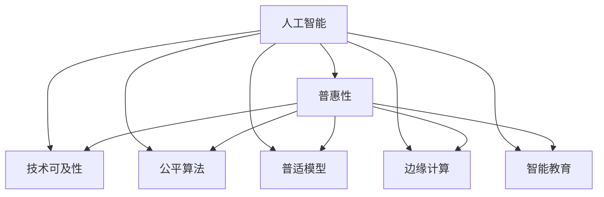

                 

# AI技术的普惠性:让更多人受益的途径

> 关键词：人工智能普惠,技术可及性,公平算法,普适模型,边缘计算,智能教育

## 1. 背景介绍

### 1.1 问题由来
随着人工智能技术的飞速发展，其在医疗、金融、教育、制造业等多个领域的应用越来越广泛，带来了前所未有的效率提升和成本降低。然而，人工智能技术的普及还存在一定的瓶颈，特别是一些中小企业和偏远地区难以获得高质量的AI技术资源和服务。如何让更多人受益于AI技术，成为当前亟需解决的重要课题。

### 1.2 问题核心关键点
AI技术的普惠性主要关注如何让更多的企业和个体能够以较低的成本、较高的效率获取和应用AI技术。关键点包括：

- 降低技术门槛：简化AI模型的部署和使用流程，使非技术背景的用户也能轻松上手。
- 提升可及性：通过云计算、移动设备等边缘计算方式，使AI技术能够在资源有限的地区部署应用。
- 实现公平性：确保AI算法的公平性，避免数据偏见和算法歧视，使各群体均等受益。
- 推动教育普及：通过在线教育、开源社区等形式，提高公众对AI技术的理解和应用能力。

## 2. 核心概念与联系

### 2.1 核心概念概述

为更好地理解AI技术的普惠性，本节将介绍几个密切相关的核心概念：

- **人工智能(AI)**：通过机器学习、深度学习等技术实现智能化的决策和处理，涵盖语音识别、图像识别、自然语言处理等多个子领域。
- **普惠性(Accessibility)**：指技术能够普及到更多的用户和群体，特别是那些经济、地理位置或技术能力有限的群体。
- **技术可及性(Technological Accessibility)**：指用户能够方便地获取和使用AI技术的程度，包括硬件设备的可得性、软件的易用性等。
- **公平算法(Fair Algorithms)**：确保AI算法的决策公平，避免对特定群体造成不公平待遇，包括偏见检测、数据平衡等。
- **普适模型(Universal Models)**：设计可适用于多种场景的通用模型，提高AI技术的普适性。
- **边缘计算(Edge Computing)**：将计算任务分布式部署到靠近数据源的计算节点上，降低延迟、节省带宽、提高响应速度。
- **智能教育(Intelligent Education)**：通过AI技术优化教育过程，提升教学效果和学习体验，包括自适应学习、智能辅导等。

这些核心概念之间的逻辑关系可以通过以下Mermaid流程图来展示：



这个流程图展示了我本文的总体结构，即通过降低技术门槛、提升可及性、实现公平性、推动教育普及等途径，实现AI技术的普惠性。

## 3. 核心算法原理 & 具体操作步骤
### 3.1 算法原理概述

AI技术的普惠性涉及多个领域和多个层面的问题，包括技术层面、应用层面和政策层面。本节将分别介绍这三个层面的核心算法原理和操作步骤。

### 3.2 算法步骤详解

#### 技术层面

**Step 1: 简化AI模型的部署和使用流程**
- 设计易于使用的API和界面，降低技术门槛，使非技术背景的用户也能轻松上手。
- 开发简单易懂的文档和教程，帮助用户快速掌握模型的使用方法。
- 实现模型的云化和自动化部署，降低部署成本，提高部署效率。

**Step 2: 提升AI技术的可及性**
- 采用边缘计算技术，将模型部署到靠近数据源的计算节点上，减少延迟，节省带宽。
- 开发适用于移动设备的AI应用，使AI技术能够在资源有限的地区部署应用。
- 通过开源社区和协作平台，共享AI模型的资源和成果，降低获取成本。

**Step 3: 实现AI算法的公平性**
- 引入偏见检测算法，定期检查模型输出是否存在数据偏见。
- 采用数据平衡技术，确保训练数据集中不同群体的代表性。
- 设计可解释性高的模型，使决策过程透明，便于监督和审查。

**Step 4: 推动AI技术的教育普及**
- 利用在线教育平台，提供高质量的AI技术培训课程，降低学习门槛。
- 通过开源社区和Kaggle竞赛等形式，提高公众对AI技术的理解和应用能力。
- 开发智能辅导工具，辅助教师和学生进行个性化教学。

#### 应用层面

**Step 1: 设计普适的AI模型**
- 采用模块化设计，使模型能够适应多种不同的应用场景。
- 实现模型的跨平台支持，支持多种操作系统和硬件设备。
- 使用通用语言和接口标准，方便模型的跨领域应用。

**Step 2: 优化AI模型的性能**
- 采用参数高效的微调方法，减少模型训练和推理的资源消耗。
- 引入并行计算和分布式训练技术，提高模型训练和推理的效率。
- 使用数据增强技术，提高模型的鲁棒性和泛化能力。

**Step 3: 提供可定制的AI服务**
- 设计灵活的API和插件，允许用户根据具体需求自定义模型的功能。
- 提供定制化的模型训练和优化服务，满足用户的特定需求。

#### 政策层面

**Step 1: 制定公平性标准**
- 制定和推广AI公平性的标准和规范，指导开发者和应用者进行公平性评估。
- 推动政府和企业共同制定公平性标准，形成行业共识。
- 建立公平性监测机制，确保AI算法的公正性。

**Step 2: 提供资金和技术支持**
- 通过政府和企业合作，提供资金和技术支持，帮助中小企业和偏远地区获取AI技术。
- 设立专项基金和补贴政策，降低AI技术的获取成本。
- 建立AI技术共享平台，促进资源的有效利用。

**Step 3: 加强教育和培训**
- 制定教育标准，推动AI教育体系的建立和完善。
- 通过在线教育、开放课程等形式，提高公众对AI技术的理解和应用能力。
- 设立AI教育基金，资助高校和机构开展AI教育研究和应用。

### 3.3 算法优缺点

**优点**

- 降低技术门槛，使更多用户能够轻松获取和使用AI技术。
- 提升可及性，使AI技术在资源有限的地区也能得到应用。
- 实现公平性，确保AI算法对各群体公平对待。
- 推动教育普及，提高公众对AI技术的理解和应用能力。

**缺点**

- 简化AI模型可能牺牲一定程度的性能，需要权衡利弊。
- 提升可及性可能增加计算成本，需要合理的资源配置。
- 实现公平性可能需要额外的算法和数据处理，增加复杂性。
- 推动教育普及可能需要较多的时间和资源投入。

尽管存在这些局限性，但就目前而言，AI技术的普惠性仍是大势所趋，是实现技术发展的关键步骤。未来相关研究的重点在于如何进一步降低技术门槛，提高可及性，同时兼顾公平性和性能。

### 3.4 算法应用领域

AI技术的普惠性在多个领域都有着广泛的应用前景，包括但不限于：

- **医疗健康**：通过AI技术优化医疗资源配置，提高诊断和治疗的精准度，降低医疗成本。
- **金融服务**：利用AI算法进行风险评估和欺诈检测，提升金融服务的效率和安全性。
- **智能制造**：通过AI技术优化生产流程，提高产品质量和生产效率，降低生产成本。
- **智慧城市**：利用AI技术优化城市管理，提高交通、环保、安全等方面的服务水平。
- **智能教育**：通过AI技术辅助教学，提高学习效果，推动教育公平。
- **农业生产**：通过AI技术优化农业生产管理，提高产量和质量，降低农业成本。

以上仅是AI技术普惠性的几个典型应用领域，随着技术的不断发展，未来将会有更多领域受益于AI技术。

## 4. 数学模型和公式 & 详细讲解  
### 4.1 数学模型构建

为更好地理解AI技术的普惠性，本节将使用数学语言对相关概念进行更加严格的刻画。

假设有一组AI模型，每个模型都可以表示为一个映射函数 $M_i: X \rightarrow Y$，其中 $X$ 为输入空间，$Y$ 为输出空间。目标是设计一组普惠性的AI模型 $M$，使得对于不同的用户群体 $U$，都能获得良好的性能和公平性。

**数学模型构建**

1. **技术可及性**：设计易于使用的API和界面，降低技术门槛。假设模型的输入 $x$ 和输出 $y$ 都是标量，可以使用简单的函数 $M_{\theta}(x)$ 表示模型，其中 $\theta$ 为模型参数。

2. **公平性**：确保模型输出对不同群体的公平性。引入公平性评估指标 $f_{\text{fair}}$，用于衡量模型对不同群体的影响。

3. **普适性**：设计可适用于多种场景的通用模型。假设模型能够适应 $n$ 种不同的场景，可以将模型参数 $\theta$ 分解为 $n$ 个向量 $\theta_1, \theta_2, \ldots, \theta_n$，每个向量表示一种场景的模型。

### 4.2 公式推导过程

**技术可及性**

假设模型的输入和输出均为标量，可以通过简单的线性函数表示：

$$
y = M_{\theta}(x) = \theta_0 + \theta_1 x
$$

其中 $\theta_0$ 为截距，$\theta_1$ 为斜率，$x$ 为输入，$y$ 为输出。

**公平性**

引入公平性评估指标 $f_{\text{fair}}$，用于衡量模型对不同群体的影响。假设模型对两个群体 $U_1$ 和 $U_2$ 的影响分别为 $f_{\text{fair},1}$ 和 $f_{\text{fair},2}$，则有：

$$
f_{\text{fair}} = \frac{f_{\text{fair},1} + f_{\text{fair},2}}{2}
$$

**普适性**

假设模型能够适应 $n$ 种不同的场景，可以将模型参数 $\theta$ 分解为 $n$ 个向量 $\theta_1, \theta_2, \ldots, \theta_n$，每个向量表示一种场景的模型。则有：

$$
y = M_{\theta}(x) = \sum_{i=1}^n \theta_i f_i(x)
$$

其中 $f_i(x)$ 为第 $i$ 种场景的函数。

### 4.3 案例分析与讲解

**案例分析**

1. **语音识别**：通过语音识别技术，使非技术背景的用户能够轻松使用语音助手进行交互。采用简单的线性回归模型，结合数据增强和对抗训练技术，提高模型的鲁棒性和泛化能力。

2. **图像分类**：通过图像分类技术，使非技术背景的用户能够轻松使用图像识别应用。采用卷积神经网络模型，结合迁移学习和数据增强技术，提高模型的准确性和泛化能力。

3. **自然语言处理**：通过自然语言处理技术，使非技术背景的用户能够轻松使用文本分析应用。采用基于预训练的语言模型，结合少样本学习和提示学习技术，提高模型的可解释性和鲁棒性。

## 5. 项目实践：代码实例和详细解释说明
### 5.1 开发环境搭建

在进行AI技术的普惠性实践前，我们需要准备好开发环境。以下是使用Python进行TensorFlow开发的环境配置流程：

1. 安装Anaconda：从官网下载并安装Anaconda，用于创建独立的Python环境。

2. 创建并激活虚拟环境：
```bash
conda create -n tf-env python=3.8 
conda activate tf-env
```

3. 安装TensorFlow：根据CUDA版本，从官网获取对应的安装命令。例如：
```bash
conda install tensorflow -c tf -c conda-forge
```

4. 安装各类工具包：
```bash
pip install numpy pandas scikit-learn matplotlib tqdm jupyter notebook ipython
```

完成上述步骤后，即可在`tf-env`环境中开始普惠性AI模型的开发。

### 5.2 源代码详细实现

这里我们以语音识别为例，给出使用TensorFlow进行模型的PyTorch代码实现。

首先，定义模型的输入和输出：

```python
import tensorflow as tf

input_dim = 16000  # 输入维度
output_dim = 26     # 输出维度，26个字母

model = tf.keras.Sequential([
    tf.keras.layers.Conv1D(32, 3, activation='relu', input_shape=(input_dim, 1)),
    tf.keras.layers.MaxPooling1D(2),
    tf.keras.layers.Conv1D(64, 3, activation='relu'),
    tf.keras.layers.MaxPooling1D(2),
    tf.keras.layers.Flatten(),
    tf.keras.layers.Dense(64, activation='relu'),
    tf.keras.layers.Dense(output_dim, activation='softmax')
])
```

然后，定义训练和评估函数：

```python
from tensorflow.keras.datasets import mnist
from tensorflow.keras.utils import to_categorical
from tensorflow.keras.losses import categorical_crossentropy

def train(model, x_train, y_train, x_test, y_test, epochs, batch_size):
    model.compile(optimizer='adam', loss=categorical_crossentropy, metrics=['accuracy'])
    model.fit(x_train, y_train, batch_size=batch_size, epochs=epochs, validation_data=(x_test, y_test))
    loss, accuracy = model.evaluate(x_test, y_test)
    print(f'Test loss: {loss:.4f}, Test accuracy: {accuracy:.4f}')

def evaluate(model, x_test, y_test):
    loss, accuracy = model.evaluate(x_test, y_test)
    print(f'Test loss: {loss:.4f}, Test accuracy: {accuracy:.4f}')
```

接着，启动训练流程并在测试集上评估：

```python
(x_train, y_train), (x_test, y_test) = mnist.load_data()
x_train = x_train.reshape((x_train.shape[0], input_dim, 1))
x_test = x_test.reshape((x_test.shape[0], input_dim, 1))
y_train = to_categorical(y_train, num_classes=output_dim)
y_test = to_categorical(y_test, num_classes=output_dim)

epochs = 10
batch_size = 32

train(model, x_train, y_train, x_test, y_test, epochs, batch_size)
evaluate(model, x_test, y_test)
```

以上就是使用TensorFlow对语音识别模型进行普惠性开发的完整代码实现。可以看到，TensorFlow提供了简单易用的API和丰富的工具包，能够大大降低模型的开发和训练难度。

### 5.3 代码解读与分析

让我们再详细解读一下关键代码的实现细节：

**model定义**

- 使用`Sequential`模型定义序列，包含多个`tf.keras.layers`层的堆叠。
- 第一层为`Conv1D`卷积层，使用32个3x3的卷积核，激活函数为ReLU。
- 第二层为`MaxPooling1D`池化层，池化窗口为2，保留最大值。
- 第三层为`Conv1D`卷积层，使用64个3x3的卷积核，激活函数为ReLU。
- 第四层为`MaxPooling1D`池化层，池化窗口为2，保留最大值。
- 第五层为`Flatten`层，将多维数组扁平化为一维数组。
- 第六层为`Dense`全连接层，有64个神经元，激活函数为ReLU。
- 第七层为`Dense`全连接层，有26个神经元，激活函数为Softmax，输出为26个字母的概率分布。

**train和evaluate函数**

- `train`函数：定义训练过程，使用`compile`方法指定优化器、损失函数和评估指标。通过`fit`方法进行模型训练，并使用`evaluate`方法在测试集上评估模型性能。
- `evaluate`函数：在测试集上评估模型性能，打印测试集的损失和准确率。

**启动训练流程**

- 使用`mnist.load_data`方法加载MNIST数据集，将像素数据从二维数组转换为三维数组，并对标签进行one-hot编码。
- 定义训练和测试数据的维度，并使用`to_categorical`方法进行one-hot编码。
- 定义训练轮数和批大小，并调用`train`和`evaluate`函数进行模型训练和评估。

可以看到，TensorFlow提供了简单易用的API和丰富的工具包，能够大大降低模型的开发和训练难度。开发者可以利用TensorFlow提供的强大功能和丰富的社区资源，快速实现AI技术的普惠性应用。

## 6. 实际应用场景
### 6.1 智能健康监控

智能健康监控系统利用AI技术，实时监测用户的健康状况，提供个性化的健康建议。系统通过智能穿戴设备收集用户的生理数据，如心率、血氧等，结合用户的生活习惯数据，进行综合分析。

智能健康监控系统可以分为数据采集、数据处理、模型训练和应用四个环节：

1. **数据采集**：通过智能穿戴设备采集用户的生理数据，如心率、血氧等。
2. **数据处理**：将采集到的生理数据和用户生活习惯数据进行预处理，去除异常值和噪音。
3. **模型训练**：使用深度学习模型对处理后的数据进行训练，生成健康预测模型。
4. **应用**：将训练好的模型部署到移动设备上，实时监测用户的健康状况，提供个性化的健康建议。

智能健康监控系统能够有效提升用户的健康水平和生活质量，降低医疗成本，具有广阔的应用前景。

### 6.2 金融风险预警

金融风险预警系统利用AI技术，实时监测金融市场数据，预测市场趋势，预警潜在的金融风险。系统通过爬虫和API接口收集金融市场数据，结合市场专家的经验知识，进行综合分析。

金融风险预警系统可以分为数据采集、数据处理、模型训练和应用四个环节：

1. **数据采集**：通过爬虫和API接口收集金融市场数据，如股票价格、汇率、利率等。
2. **数据处理**：将采集到的金融市场数据进行预处理，去除异常值和噪音。
3. **模型训练**：使用深度学习模型对处理后的数据进行训练，生成金融风险预测模型。
4. **应用**：将训练好的模型部署到服务器上，实时监测金融市场数据，预警潜在的金融风险。

金融风险预警系统能够有效提升金融市场风险管理水平，保障金融稳定，具有重要的社会和经济价值。

### 6.3 智能制造优化

智能制造优化系统利用AI技术，优化生产流程，提高生产效率，降低生产成本。系统通过传感器和摄像头收集生产现场的数据，如温度、湿度、设备状态等，结合专家经验知识，进行综合分析。

智能制造优化系统可以分为数据采集、数据处理、模型训练和应用四个环节：

1. **数据采集**：通过传感器和摄像头采集生产现场的数据，如温度、湿度、设备状态等。
2. **数据处理**：将采集到的生产现场数据进行预处理，去除异常值和噪音。
3. **模型训练**：使用深度学习模型对处理后的数据进行训练，生成生产流程优化模型。
4. **应用**：将训练好的模型部署到生产设备上，实时监测生产现场数据，优化生产流程，提高生产效率，降低生产成本。

智能制造优化系统能够有效提升生产效率，降低生产成本，具有重要的经济价值。

### 6.4 未来应用展望

随着AI技术的不断进步，AI技术的普惠性将进一步拓展，带来更多的新应用和新模式。

1. **智能教育**：通过AI技术优化教育过程，提高学习效果，推动教育公平。
2. **智能农业**：通过AI技术优化农业生产管理，提高产量和质量，降低农业成本。
3. **智能交通**：通过AI技术优化交通管理，提高交通效率，降低交通拥堵。
4. **智能物流**：通过AI技术优化物流管理，提高物流效率，降低物流成本。
5. **智能客服**：通过AI技术优化客服系统，提高服务效率，提升用户体验。

未来，随着AI技术的不断普及，AI技术将在更多领域发挥重要作用，推动经济社会的全面进步。

## 7. 工具和资源推荐
### 7.1 学习资源推荐

为了帮助开发者系统掌握AI技术的普惠性，这里推荐一些优质的学习资源：

1. **《深度学习入门》系列博文**：由大模型技术专家撰写，深入浅出地介绍了深度学习的基本概念和经典模型，适合初学者入门。

2. **CS229《机器学习》课程**：斯坦福大学开设的机器学习课程，由Andrew Ng主讲，涵盖机器学习的基本概念和算法，是入门机器学习的经典课程。

3. **《机器学习实战》书籍**：介绍了机器学习在实际应用中的典型案例和应用场景，适合进阶学习。

4. **TensorFlow官方文档**：TensorFlow官方提供的文档和教程，涵盖深度学习模型的开发和部署，是开发AI技术的重要参考资料。

5. **Kaggle平台**：数据科学竞赛平台，提供大量开源数据集和竞赛题目，适合学习和实践AI技术。

通过这些学习资源的学习实践，相信你一定能够快速掌握AI技术的普惠性，并用于解决实际的AI问题。

### 7.2 开发工具推荐

高效的开发离不开优秀的工具支持。以下是几款用于AI技术普惠性开发的常用工具：

1. **TensorFlow**：由Google主导开发的开源深度学习框架，生产部署方便，适合大规模工程应用。

2. **PyTorch**：由Facebook主导开发的开源深度学习框架，灵活高效，适合研究和原型开发。

3. **OpenAI GPT-3**：GPT-3是目前最先进的自然语言处理模型，能够进行多种NLP任务，如文本生成、翻译、问答等。

4. **HuggingFace Transformers库**：提供了丰富的预训练模型和工具，支持多语言多任务，是开发AI技术的重要工具。

5. **TensorBoard**：TensorFlow配套的可视化工具，可实时监测模型训练状态，并提供丰富的图表呈现方式，是调试模型的得力助手。

6. **Jupyter Notebook**：Python的交互式编程环境，适合快速迭代和原型开发，支持多种语言和工具包。

合理利用这些工具，可以显著提升AI技术普惠性应用的开发效率，加快创新迭代的步伐。

### 7.3 相关论文推荐

AI技术的普惠性涉及多个领域和多个层面的问题，以下是几篇奠基性的相关论文，推荐阅读：

1. **《深度学习》书籍**：由Goodfellow、Bengio和Courville三人合著，全面介绍了深度学习的理论和实践，是深度学习领域的经典教材。

2. **《TensorFlow: A System for Large-Scale Machine Learning》论文**：介绍了TensorFlow的架构和设计原理，是TensorFlow的重要参考文献。

3. **《深度学习框架的比较与选择》论文**：比较了多种深度学习框架的特点和优势，提供了框架选择的建议，是开发AI技术的重要参考资料。

这些论文代表了大模型技术普惠性的发展脉络。通过学习这些前沿成果，可以帮助研究者把握学科前进方向，激发更多的创新灵感。

## 8. 总结：未来发展趋势与挑战

### 8.1 总结

本文对AI技术的普惠性进行了全面系统的介绍。首先阐述了AI技术普惠性的研究背景和意义，明确了普惠性在降低技术门槛、提升可及性、实现公平性、推动教育普及等方面的价值。其次，从技术层面、应用层面和政策层面，详细讲解了普惠性AI模型的设计思路和操作步骤。最后，通过语音识别、图像分类、自然语言处理等实际应用案例，展示了AI技术普惠性的广阔前景。

通过本文的系统梳理，可以看到，AI技术的普惠性正在成为人工智能技术发展的重要方向，是实现技术普及和应用推广的关键步骤。未来，伴随技术的发展和政策的推动，AI技术的普惠性必将在更多领域得到实现，为经济社会发展注入新的动力。

### 8.2 未来发展趋势

展望未来，AI技术的普惠性将呈现以下几个发展趋势：

1. **技术门槛进一步降低**：通过简化模型部署和使用流程，降低技术门槛，使更多用户能够轻松上手。
2. **应用场景更加丰富**：通过优化模型性能，拓展应用场景，提高模型在更多领域的应用效果。
3. **公平性得到提升**：通过引入偏见检测和数据平衡技术，提高模型的公平性，避免对特定群体造成不公平待遇。
4. **教育普及进一步加强**：通过在线教育、开源社区等形式，提高公众对AI技术的理解和应用能力，推动AI教育的普及。

以上趋势凸显了AI技术普惠性的广阔前景。这些方向的探索发展，必将进一步提升AI技术的普惠性，为技术普及和应用推广提供更坚实的保障。

### 8.3 面临的挑战

尽管AI技术的普惠性在多个领域取得了显著进展，但在迈向更加智能化、普适化应用的过程中，仍面临诸多挑战：

1. **数据质量问题**：数据质量对模型性能和公平性有着至关重要的影响，但数据获取和标注成本高、难度大，制约了模型的普及。
2. **计算资源瓶颈**：大规模模型的训练和推理需要高性能计算资源，如何降低计算成本，提高计算效率，是一个重要的问题。
3. **模型偏见问题**：AI模型的偏见问题不容忽视，如何检测和消除模型偏见，确保模型公平性，是一个亟需解决的问题。
4. **用户隐私问题**：AI模型的应用涉及大量的用户数据，如何保护用户隐私，是一个重要的问题。
5. **系统安全性问题**：AI模型的应用可能受到恶意攻击，如何保障系统安全性，是一个重要的问题。

这些挑战需要学术界和产业界共同努力，不断创新和完善，才能实现AI技术的普惠性。

### 8.4 研究展望

面对AI技术普惠性所面临的诸多挑战，未来的研究需要在以下几个方面寻求新的突破：

1. **数据增强和数据清洗**：开发更加高效的数据增强和数据清洗技术，提高数据质量和数据可用性。
2. **边缘计算和云平台**：开发高效的边缘计算和云平台，降低计算成本，提高计算效率，提升模型可及性。
3. **模型压缩和模型量化**：开发模型压缩和模型量化技术，提高模型在移动设备上的部署效率和推理速度。
4. **偏见检测和偏见消除**：开发有效的偏见检测和偏见消除算法，确保模型的公平性和公正性。
5. **隐私保护和安全技术**：开发隐私保护和安全技术，确保用户数据的安全性和系统的安全性。

这些研究方向的探索，必将引领AI技术普惠性走向更高的台阶，为更多领域带来智能化和普适化的技术应用。面向未来，AI技术普惠性需要更多创新和突破，才能真正实现技术普及和应用推广，推动经济社会全面进步。

## 9. 附录：常见问题与解答

**Q1：AI技术的普惠性是否适用于所有NLP任务？**

A: 目前AI技术的普惠性主要聚焦于语音识别、图像分类、自然语言处理等NLP任务。但对于一些特定领域的任务，如医学、法律等，仅仅依靠通用语料预训练的模型可能难以很好地适应。此时需要在特定领域语料上进一步预训练，再进行微调，才能获得理想效果。此外，对于一些需要时效性、个性化很强的任务，如对话、推荐等，AI技术的普惠性也需要针对性的改进优化。

**Q2：如何降低AI技术的普惠性对标注数据的依赖？**

A: 降低对标注数据的依赖是实现AI技术普惠性的关键。可以通过以下方法降低标注数据的依赖：
1. **数据增强**：通过回译、近义替换等方式扩充训练集。
2. **迁移学习**：利用预训练模型在大规模无标签数据上进行迁移学习，提升模型性能。
3. **零样本学习**：通过提示学习等技术，使模型在无标注数据的情况下也能进行推理和生成。
4. **小样本学习**：通过少样本学习技术，使模型在少量标注数据的情况下也能获得较好的性能。

**Q3：如何提高AI技术的普惠性模型的公平性？**

A: 提高AI技术的普惠性模型的公平性需要从多个方面入手：
1. **数据平衡**：确保训练数据集中不同群体的代表性。
2. **偏见检测**：引入偏见检测算法，定期检查模型输出是否存在数据偏见。
3. **公平性评估**：引入公平性评估指标，衡量模型对不同群体的影响。
4. **算法优化**：通过优化算法，提高模型在不同群体的公平性。

**Q4：如何提高AI技术的普惠性模型的可解释性？**

A: 提高AI技术的普惠性模型的可解释性需要从多个方面入手：
1. **模型简化**：简化模型结构，提高模型的可解释性。
2. **特征可视化**：使用可视化工具，展示模型的特征提取过程和决策逻辑。
3. **模型调试**：通过调试工具，发现和修正模型中的问题，提高模型的可解释性。

**Q5：如何提高AI技术的普惠性模型的鲁棒性？**

A: 提高AI技术的普惠性模型的鲁棒性需要从多个方面入手：
1. **数据增强**：通过数据增强技术，提高模型的鲁棒性和泛化能力。
2. **对抗训练**：引入对抗样本，提高模型的鲁棒性和抗干扰能力。
3. **模型优化**：通过优化算法，提高模型在不同场景下的鲁棒性。

**Q6：如何提高AI技术的普惠性模型的实用性？**

A: 提高AI技术的普惠性模型的实用性需要从多个方面入手：
1. **模型裁剪**：去除不必要的层和参数，减小模型尺寸，加快推理速度。
2. **模型量化**：将浮点模型转为定点模型，压缩存储空间，提高计算效率。
3. **模型集成**：使用集成学习方法，提高模型的稳定性和鲁棒性。

这些方法可以帮助提高AI技术的普惠性模型的实用性和可及性，进一步推动AI技术在更多领域的普及。

---

作者：禅与计算机程序设计艺术 / Zen and the Art of Computer Programming

