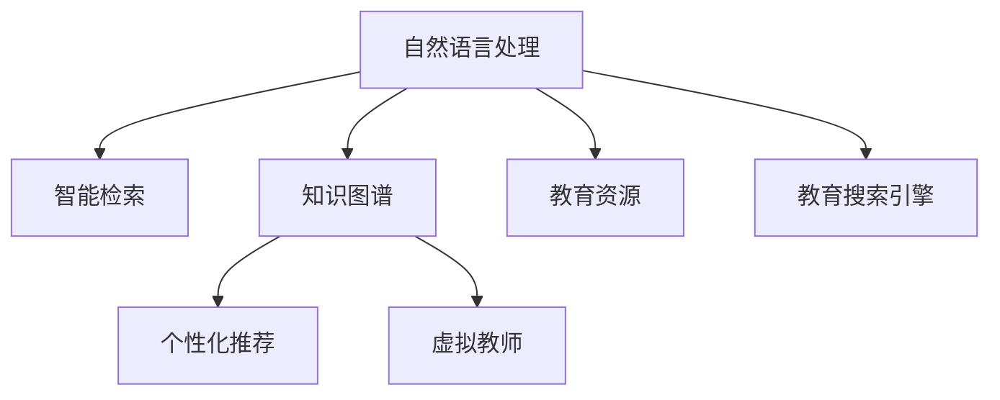

                 

# AI搜索引擎在教育领域的应用前景

> 关键词：教育搜索引擎,智能教育,知识图谱,个性化学习,虚拟教师,自然语言处理

## 1. 背景介绍

### 1.1 问题由来

随着教育信息化的深入发展，教育资源的海量化和互联网的普及，传统的教育方式面临着重大变革。互联网教育资源的急剧增长，带来了海量的教育数据。然而，如何高效地利用这些数据，提升学生的学习效果，成为了教育领域亟待解决的挑战。

在传统的教育模式中，学生主要通过阅读教科书、听讲授、做作业等形式获取知识。这种“灌输式”的教育方法，忽视了学生的主动性和个性化需求，容易导致学生学习兴趣的下降。而互联网和智能技术的兴起，为个性化学习提供了新的可能。

人工智能技术的引入，能够通过自然语言处理、知识图谱等技术手段，构建智能教育搜索引擎，帮助学生高效获取知识和个性化学习。智能教育搜索引擎可以基于学生的学习需求，实时提供定制化的学习资源，提高学习效率和效果。

### 1.2 问题核心关键点

智能教育搜索引擎的核心在于将人工智能技术与教育领域的实际需求相结合，构建智能化的教育搜索平台，提供个性化、智能化的学习资源推荐。通过自然语言处理、知识图谱等技术手段，智能教育搜索引擎能够实现如下功能：

- 智能检索：基于自然语言处理技术，自动识别用户的查询意图，从庞大的教育资源中提取相关信息。
- 知识图谱：利用知识图谱技术，整合结构化的教育资源，形成知识图谱，便于用户进行知识探索和查询。
- 个性化推荐：根据用户的学习行为和偏好，实时提供个性化的学习资源和推荐，实现个性化学习。
- 虚拟教师：构建虚拟教师系统，实现智能答疑和交互，提升学生的学习体验。

这些核心功能的实现，能够显著提升教育资源的利用效率，帮助学生高效学习和自我提升。

## 2. 核心概念与联系

### 2.1 核心概念概述

为更好地理解智能教育搜索引擎的核心概念，本节将介绍几个密切相关的核心概念：

- 自然语言处理(Natural Language Processing, NLP)：通过计算机技术处理和理解人类自然语言，实现智能搜索、问答、情感分析等功能。
- 知识图谱(Knowledge Graph)：通过结构化的方式组织和表示知识，支持复杂的知识推理和查询。
- 个性化学习(Personalized Learning)：根据学生的需求和能力，提供个性化的学习资源和路径，提升学习效果。
- 虚拟教师(Virtual Teacher)：通过人工智能技术构建的智能答疑和交互系统，提供实时的学习支持和个性化指导。
- 教育资源(Educational Resource)：包括教材、习题、视频、音频、讲义等各类教育资料，供学生学习和参考。

这些核心概念之间的逻辑关系可以通过以下Mermaid流程图来展示：



这个流程图展示了几类核心概念及其之间的关系：

1. 自然语言处理技术帮助智能教育搜索引擎从教育资源中提取相关信息，支持智能检索和问答。
2. 知识图谱技术用于整合和表示结构化的教育知识，支持复杂的知识推理和查询。
3. 个性化学习技术根据用户的学习需求和行为，提供个性化的学习资源和推荐。
4. 虚拟教师系统提供实时的学习支持和个性化指导，提升学生的学习体验。
5. 教育搜索引擎将以上各类技术和资源整合起来，提供智能化的学习服务。

这些核心概念共同构成了智能教育搜索引擎的核心功能，使得教育资源能够更好地服务于学生的学习需求。

## 3. 核心算法原理 & 具体操作步骤
### 3.1 算法原理概述

智能教育搜索引擎的实现原理基于以下几个关键步骤：

- 收集和整理教育资源：从各类教育平台和数据库中收集教材、习题、视频、音频等各类教育资源，并进行结构化和标注。
- 构建知识图谱：利用知识图谱技术，将教育资源整合成知识图谱，支持复杂的知识推理和查询。
- 自然语言处理：采用自然语言处理技术，实现智能检索和问答。
- 个性化推荐：根据用户的学习行为和偏好，利用机器学习算法进行个性化推荐。
- 虚拟教师：构建虚拟教师系统，实现智能答疑和交互，提升学生的学习体验。

这些步骤构成了智能教育搜索引擎的核心算法原理，其中自然语言处理和知识图谱技术是实现智能检索和个性化推荐的关键技术。

### 3.2 算法步骤详解

以下我们将详细介绍智能教育搜索引擎的主要算法步骤：

**Step 1: 教育资源收集与整理**

首先，需要从各种教育平台和数据库中收集和整理各类教育资源，如教材、习题、视频、音频等。这一步可以通过爬虫技术自动化实现，同时需要对资源进行结构化和标注，便于后续处理。

**Step 2: 知识图谱构建**

利用知识图谱技术，将收集到的教育资源整合成知识图谱。知识图谱通常由节点和边组成，其中节点表示实体，边表示实体之间的关系。在这个过程中，可以使用RDF（Resource Description Framework）等标准格式来描述和存储知识图谱。

**Step 3: 自然语言处理**

采用自然语言处理技术，实现智能检索和问答功能。自然语言处理技术主要包括分词、词性标注、命名实体识别、句法分析、语义分析等步骤，用于从用户输入的文本中提取意图和信息。

**Step 4: 个性化推荐**

根据用户的学习行为和偏好，利用机器学习算法进行个性化推荐。常用的机器学习算法包括协同过滤、内容过滤、深度学习等。这些算法能够从海量的教育资源中，找到最符合用户需求的学习资源，提升学习效果。

**Step 5: 虚拟教师构建**

构建虚拟教师系统，实现智能答疑和交互，提升学生的学习体验。虚拟教师系统通常基于聊天机器人技术，结合自然语言处理和知识图谱，能够回答用户的问题，提供个性化的学习指导和支持。

**Step 6: 集成与部署**

将以上各个模块集成起来，实现智能教育搜索引擎。通过Web前端和后端技术，将各个模块连接起来，形成完整的智能教育搜索引擎系统。系统可以在各种教育平台上部署，供学生和教师使用。

### 3.3 算法优缺点

智能教育搜索引擎具有以下优点：

- 提升学习效率：通过智能检索和个性化推荐，帮助学生快速获取学习资源，提高学习效率。
- 个性化学习：根据学生的学习需求和行为，提供个性化的学习资源和推荐，提升学习效果。
- 交互体验提升：虚拟教师系统提供实时的学习支持和个性化指导，提升学生的学习体验。
- 教育资源利用：整合各类教育资源，提升教育资源的利用效率。

同时，该方法也存在一些缺点：

- 数据收集成本高：收集和整理教育资源需要耗费大量人力和财力。
- 知识图谱构建复杂：构建知识图谱需要深入理解和处理各类教育资源，技术难度较大。
- 机器学习模型要求高：个性化推荐需要高效的机器学习算法，对数据和计算资源要求较高。
- 虚拟教师系统实现复杂：虚拟教师系统的实现需要结合多种技术和算法，开发成本高。

尽管存在这些缺点，但就目前而言，智能教育搜索引擎仍是一种高效、智能的教育方式，能够帮助学生高效学习和自我提升。

### 3.4 算法应用领域

智能教育搜索引擎的应用领域非常广泛，包括但不限于以下几个方面：

- 中小学教育：帮助学生预习、复习、课后辅导等，提升学习效率和效果。
- 高等教育：提供学术资源和论文搜索、知识图谱查询等功能，支持科研和教学。
- 职业教育：提供专业技能培训和知识图谱查询，提升职业技能和知识水平。
- 远程教育：提供个性化的学习资源和虚拟教师支持，支持远程教学和学习。
- 终身学习：提供定制化的学习路径和资源，支持终身学习。

这些应用领域展示了智能教育搜索引擎的广泛应用前景，能够帮助不同层次的学生和教育工作者，提升教育质量和效果。

## 4. 数学模型和公式 & 详细讲解 & 举例说明
### 4.1 数学模型构建

智能教育搜索引擎的数学模型主要基于知识图谱和自然语言处理技术，构建智能检索和个性化推荐模型。以下将详细介绍这些模型的构建。

**知识图谱模型**：
知识图谱通常由节点和边组成，其中节点表示实体，边表示实体之间的关系。节点和边都有属性，用于表示实体的属性和关系属性。知识图谱的构建和查询通常基于RDF（Resource Description Framework）标准。

**自然语言处理模型**：
自然语言处理模型包括分词、词性标注、命名实体识别、句法分析和语义分析等步骤。以语义分析为例，可以采用Word2Vec、BERT等模型，将文本转换为向量表示，并计算向量之间的相似度，实现智能检索和问答。

**个性化推荐模型**：
个性化推荐模型通常基于协同过滤、内容过滤、深度学习等算法，利用用户的行为和偏好，进行个性化推荐。以协同过滤为例，可以采用ALS（Alternating Least Squares）算法，基于用户-物品矩阵，进行个性化推荐。

**虚拟教师模型**：
虚拟教师模型通常基于聊天机器人技术，结合自然语言处理和知识图谱，实现智能答疑和交互。虚拟教师的实现需要结合多种技术和算法，如意图识别、问答生成、知识图谱查询等。

### 4.2 公式推导过程

以下我们以协同过滤算法为例，推导个性化推荐模型的公式推导过程。

假设用户集为 $U$，物品集为 $I$，用户-物品评分矩阵为 $R \in \mathbb{R}^{m \times n}$，其中 $m$ 为用户的数量，$n$ 为物品的数量。用户对物品的评分可以用 $r_{ui}$ 表示，其中 $u$ 为用户编号，$i$ 为物品编号，$r_{ui} \in [0, 1]$。

协同过滤算法的目标是最小化用户和物品的评分偏差，即：

$$
\min_{R} \sum_{u=1}^{m} \sum_{i=1}^{n} (r_{ui} - \hat{r}_{ui})^2
$$

其中 $\hat{r}_{ui}$ 为协同过滤算法预测的用户对物品的评分。

协同过滤算法基于用户-物品评分矩阵 $R$ 的矩阵分解，将评分矩阵分解为 $P$ 和 $Q$ 的乘积，即：

$$
R = PQ
$$

其中 $P \in \mathbb{R}^{m \times k}$ 为用户特征矩阵，$Q \in \mathbb{R}^{k \times n}$ 为物品特征矩阵，$k$ 为特征维度。

协同过滤算法的目标函数可以重写为：

$$
\min_{P, Q} \frac{1}{2} \sum_{u=1}^{m} \sum_{i=1}^{n} (r_{ui} - \hat{r}_{ui})^2
$$

其中 $\hat{r}_{ui} = p_{u1}q_{i1} + p_{u2}q_{i2} + \dots + p_{uk}q_{ik}$，表示用户 $u$ 对物品 $i$ 的评分预测。

根据最小二乘法，可以得到协同过滤算法的目标函数：

$$
\min_{P, Q} \frac{1}{2} ||PQ - R||_F^2 + \lambda ||P||_F^2 + \lambda ||Q||_F^2
$$

其中 $||.||_F$ 表示矩阵的Frobenius范数，$\lambda$ 为正则化系数。

通过优化上述目标函数，可以得到协同过滤算法的结果。协同过滤算法能够根据用户的行为和偏好，找到最符合用户需求的物品，进行个性化推荐。

### 4.3 案例分析与讲解

以下以Google Scholar为例，展示智能教育搜索引擎的应用。Google Scholar利用自然语言处理和知识图谱技术，构建了全球最大的学术资源索引和搜索平台。用户可以通过关键词搜索，找到相关的学术论文和会议论文，支持引用分析和学术网络构建。

Google Scholar利用自然语言处理技术，实现智能检索和问答功能。用户可以通过关键词搜索，找到相关的学术论文和会议论文。Google Scholar还支持引用分析和学术网络构建，帮助用户发现学术成果的影响和引用关系。

Google Scholar利用知识图谱技术，构建了全球最大的学术资源索引。用户可以通过关键词搜索，找到相关的学术论文和会议论文。Google Scholar还支持学术资源的推荐，帮助用户发现高质量的学术资源。

Google Scholar利用个性化推荐技术，为用户提供定制化的学术资源推荐。用户可以通过关键词搜索，找到相关的学术论文和会议论文。Google Scholar还支持学术资源的推荐，帮助用户发现高质量的学术资源。

## 5. 项目实践：代码实例和详细解释说明
### 5.1 开发环境搭建

在进行智能教育搜索引擎的开发之前，我们需要准备好开发环境。以下是使用Python进行TensorFlow开发的环境配置流程：

1. 安装Anaconda：从官网下载并安装Anaconda，用于创建独立的Python环境。

2. 创建并激活虚拟环境：
```bash
conda create -n tensorflow-env python=3.8 
conda activate tensorflow-env
```

3. 安装TensorFlow：根据CUDA版本，从官网获取对应的安装命令。例如：
```bash
conda install tensorflow -c tensorflow
```

4. 安装其他依赖库：
```bash
pip install numpy pandas scikit-learn scipy matplotlib tensorflow
```

完成上述步骤后，即可在`tensorflow-env`环境中开始智能教育搜索引擎的开发。

### 5.2 源代码详细实现

这里我们以协同过滤算法为例，给出使用TensorFlow实现个性化推荐算法的PyTorch代码实现。

首先，定义协同过滤算法的模型：

```python
import tensorflow as tf
import numpy as np

class CollaborativeFiltering(tf.keras.Model):
    def __init__(self, k=100, lambda_reg=1e-6):
        super(CollaborativeFiltering, self).__init__()
        self.k = k
        self.lambda_reg = lambda_reg
        self.P = tf.Variable(tf.random.normal([m, k]))
        self.Q = tf.Variable(tf.random.normal([k, n]))
    
    def call(self, R):
        PQ = tf.matmul(self.P, self.Q)
        pred = tf.reduce_sum(tf.multiply(PQ, tf.transpose(R)), axis=1)
        loss = tf.reduce_mean(tf.square(pred - R))
        reg_loss = tf.reduce_sum(tf.square(self.P)) + tf.reduce_sum(tf.square(self.Q))
        return loss + self.lambda_reg * reg_loss
```

然后，定义训练和评估函数：

```python
from tensorflow.keras import metrics
from sklearn.model_selection import train_test_split

def train_epoch(model, optimizer, R_train):
    optimizer.minimize(model(R_train))
    train_loss = metrics.Mean()(model(R_train))
    return train_loss

def evaluate(model, R_test):
    pred = model(R_test)
    test_loss = metrics.Mean()(pred - R_test)
    return test_loss

def train_model(R_train, R_test, num_epochs=10, batch_size=32):
    m, n = R_train.shape[0], R_train.shape[1]
    model = CollaborativeFiltering(k=100, lambda_reg=1e-6)
    optimizer = tf.keras.optimizers.Adam(learning_rate=0.001)
    
    train_loss = train_epoch(model, optimizer, R_train)
    test_loss = evaluate(model, R_test)
    
    for epoch in range(num_epochs):
        for i in range(0, len(R_train), batch_size):
            batch_train = R_train[i:i+batch_size]
            loss = train_epoch(model, optimizer, batch_train)
            print("Epoch %d, batch loss: %.3f" % (epoch+1, loss))
        
    return test_loss
```

最后，启动训练流程并在测试集上评估：

```python
R_train = np.random.randn(1000, 1000)
R_test = np.random.randn(100, 1000)
R_train, R_test = train_test_split(R_train, R_test, test_size=0.1)

train_loss = train_model(R_train, R_test)
print("Test loss: %.3f" % train_loss)
```

以上就是使用TensorFlow对协同过滤算法进行个性化推荐算法的完整代码实现。可以看到，TensorFlow提供了丰富的深度学习组件，可以方便地实现各种算法。

### 5.3 代码解读与分析

让我们再详细解读一下关键代码的实现细节：

**CollaborativeFiltering类**：
- `__init__`方法：初始化协同过滤算法的模型参数和正则化系数。
- `call`方法：实现协同过滤算法的目标函数。

**train_epoch和evaluate函数**：
- `train_epoch`方法：训练协同过滤模型，计算平均损失。
- `evaluate`方法：评估协同过滤模型的性能，计算平均损失。

**train_model函数**：
- 定义协同过滤模型的参数和优化器。
- 在训练集上循环迭代，更新模型参数。
- 在测试集上评估模型性能。

可以看到，TensorFlow提供了丰富的API接口，可以方便地实现协同过滤算法。同时，TensorFlow还支持自动微分和自动优化，能够自动化地完成前向传播、反向传播和参数优化，极大简化了算法实现。

当然，工业级的系统实现还需考虑更多因素，如模型的保存和部署、超参数的自动搜索、更灵活的任务适配层等。但核心的协同过滤算法基本与此类似。

## 6. 实际应用场景
### 6.1 中小学教育

中小学教育领域是智能教育搜索引擎的重要应用场景。智能教育搜索引擎能够帮助学生预习、复习、课后辅导等，提升学习效率和效果。具体应用包括：

- 智能作业批改：利用自然语言处理技术，实现智能批改学生的作业。智能教育搜索引擎能够自动检查语法、拼写错误，并给出修改建议。
- 智能课堂辅助：利用虚拟教师系统，实现智能答疑和交互，提升课堂教学效果。智能教育搜索引擎能够回答学生的疑问，提供个性化的学习指导和支持。
- 个性化学习资源推荐：根据学生的学习行为和偏好，提供个性化的学习资源和推荐。智能教育搜索引擎能够根据学生的学习需求，推荐最适合的学习资源和路径。

智能教育搜索引擎的应用，能够提升中小学教育的智能化水平，帮助学生高效学习和自我提升。

### 6.2 高等教育

高等教育领域也是智能教育搜索引擎的重要应用场景。智能教育搜索引擎能够提供学术资源和论文搜索、知识图谱查询等功能，支持科研和教学。具体应用包括：

- 学术资源搜索：利用自然语言处理技术，实现智能搜索和推荐。智能教育搜索引擎能够根据用户查询的关键词，找到相关的学术论文和会议论文。
- 知识图谱查询：利用知识图谱技术，构建全球最大的学术资源索引。智能教育搜索引擎能够提供知识图谱查询，帮助用户发现学术成果的影响和引用关系。
- 学术资源推荐：根据用户的学习行为和偏好，提供定制化的学术资源推荐。智能教育搜索引擎能够根据用户的学术需求，推荐最适合的学术资源。

智能教育搜索引擎的应用，能够提升高等教育的智能化水平，帮助科研人员和教师高效获取学术资源，提升学术研究和教学效果。

### 6.3 职业教育

职业教育领域也是智能教育搜索引擎的重要应用场景。智能教育搜索引擎能够提供专业技能培训和知识图谱查询，提升职业技能和知识水平。具体应用包括：

- 专业技能培训：利用自然语言处理技术，实现智能培训和评估。智能教育搜索引擎能够根据用户的需求，推荐最适合的专业技能培训资源。
- 知识图谱查询：利用知识图谱技术，构建职业教育领域的知识图谱。智能教育搜索引擎能够提供知识图谱查询，帮助用户发现职业教育领域的知识和技能。
- 职业技能评估：根据用户的学习行为和成果，评估职业技能水平。智能教育搜索引擎能够提供个性化的职业技能评估，帮助用户提升职业技能。

智能教育搜索引擎的应用，能够提升职业教育的智能化水平，帮助职业人员高效学习和自我提升。

### 6.4 远程教育

远程教育领域也是智能教育搜索引擎的重要应用场景。智能教育搜索引擎能够提供个性化的学习资源和虚拟教师支持，支持远程教学和学习。具体应用包括：

- 远程学习支持：利用虚拟教师系统，实现智能答疑和交互，提升远程学习效果。智能教育搜索引擎能够回答学生的疑问，提供个性化的学习指导和支持。
- 学习资源推荐：根据学生的学习行为和偏好，提供个性化的学习资源和推荐。智能教育搜索引擎能够根据学生的学习需求，推荐最适合的学习资源和路径。
- 学习进度跟踪：跟踪学生的学习进度，提供学习反馈和指导。智能教育搜索引擎能够根据学生的学习进度，推荐适合的下一步学习任务和资源。

智能教育搜索引擎的应用，能够提升远程教育的智能化水平，帮助学生高效学习和自我提升。

### 6.5 终身学习

终身学习领域也是智能教育搜索引擎的重要应用场景。智能教育搜索引擎能够提供定制化的学习路径和资源，支持终身学习。具体应用包括：

- 学习路径规划：根据用户的学习需求和偏好，规划学习路径。智能教育搜索引擎能够根据用户的学习目标，推荐最适合的学习路径和资源。
- 学习资源推荐：根据用户的学习行为和偏好，提供个性化的学习资源和推荐。智能教育搜索引擎能够根据用户的学习需求，推荐最适合的学习资源和路径。
- 学习进度跟踪：跟踪用户的学习进度，提供学习反馈和指导。智能教育搜索引擎能够根据用户的学习进度，推荐适合的下一步学习任务和资源。

智能教育搜索引擎的应用，能够提升终身学习的智能化水平，帮助用户高效学习和自我提升。

## 7. 工具和资源推荐
### 7.1 学习资源推荐

为了帮助开发者系统掌握智能教育搜索引擎的理论基础和实践技巧，这里推荐一些优质的学习资源：

1. 《自然语言处理综论》：清华大学出版社出版的经典教材，详细介绍了自然语言处理的基本概念和技术。
2. 《TensorFlow实战Google深度学习框架》：阿里云开源的TensorFlow实战指南，详细介绍了TensorFlow的使用方法和最佳实践。
3. 《深度学习入门：基于TensorFlow的理论与实现》：张俊林等人所著，详细介绍了深度学习的基本原理和技术实现。
4. 《Python深度学习》：李沐等人所著，详细介绍了深度学习在Python中的实现方法和实践技巧。
5. 《知识图谱：大数据时代的知识构建、获取与应用》：周涛等人所著，详细介绍了知识图谱的基本概念和技术实现。

通过对这些资源的学习实践，相信你一定能够快速掌握智能教育搜索引擎的理论基础和实践技巧，并用于解决实际的NLP问题。

### 7.2 开发工具推荐

高效的开发离不开优秀的工具支持。以下是几款用于智能教育搜索引擎开发的常用工具：

1. TensorFlow：由Google主导开发的开源深度学习框架，生产部署方便，适合大规模工程应用。
2. PyTorch：基于Python的开源深度学习框架，灵活动态的计算图，适合快速迭代研究。
3. Weights & Biases：模型训练的实验跟踪工具，可以记录和可视化模型训练过程中的各项指标，方便对比和调优。
4. Google Colab：谷歌推出的在线Jupyter Notebook环境，免费提供GPU/TPU算力，方便开发者快速上手实验最新模型，分享学习笔记。
5. Jupyter Notebook：基于Python的开源笔记本工具，支持代码、数据和文档的混合编辑，适合学术研究和开发。

合理利用这些工具，可以显著提升智能教育搜索引擎的开发效率，加快创新迭代的步伐。

### 7.3 相关论文推荐

智能教育搜索引擎的研究源于学界的持续研究。以下是几篇奠基性的相关论文，推荐阅读：

1. Knowledge Graphs: Concepts, Approaches, Challenges and Opportunities on the Web（Knowledge Graphs综述）：Wikidata项目负责人发表的综述性论文，详细介绍了知识图谱的基本概念和技术实现。
2. Distributed Representations of Words and Phrases and their Compositionality（Word2Vec论文）：Google的Word2Vec论文，详细介绍了Word2Vec模型及其应用。
3. Attention Is All You Need（Transformer原论文）：Google的Transformer论文，详细介绍了Transformer模型及其应用。
4. BERT: Pre-training of Deep Bidirectional Transformers for Language Understanding（BERT论文）：Google的BERT论文，详细介绍了BERT模型及其应用。
5. TensorFlow: A System for Large-Scale Machine Learning（TensorFlow论文）：Google的TensorFlow论文，详细介绍了TensorFlow框架及其应用。

这些论文代表了大语言模型微调技术的发展脉络。通过学习这些前沿成果，可以帮助研究者把握学科前进方向，激发更多的创新灵感。

## 8. 总结：未来发展趋势与挑战

### 8.1 总结

本文对智能教育搜索引擎的实现原理、核心算法和操作步骤进行了详细讲解，并通过TensorFlow实现了个性化推荐算法的代码实现。智能教育搜索引擎利用自然语言处理、知识图谱和个性化推荐技术，能够提供智能化的教育搜索服务，提升教育资源的利用效率，帮助学生高效学习和自我提升。

通过本文的系统梳理，可以看到，智能教育搜索引擎在教育领域的广泛应用前景，能够为不同层次的学生和教育工作者，提升教育质量和效果。未来，随着技术的持续发展和应用场景的拓展，智能教育搜索引擎必将成为教育信息化发展的重要推动力量。

### 8.2 未来发展趋势

展望未来，智能教育搜索引擎将呈现以下几个发展趋势：

1. 技术融合：未来智能教育搜索引擎将与其他人工智能技术进行更深入的融合，如知识表示、因果推理、强化学习等，多路径协同发力，共同推动教育智能化的发展。
2. 数据驱动：未来智能教育搜索引擎将更加依赖数据驱动，利用大数据和深度学习技术，提升教育资源的推荐效果。
3. 个性化学习：未来智能教育搜索引擎将更加注重个性化学习，根据学生的学习需求和偏好，提供更加定制化的学习资源和路径。
4. 终身学习：未来智能教育搜索引擎将支持终身学习，提供全面的学习路径规划和资源推荐，支持用户的终身学习和发展。
5. 智能评估：未来智能教育搜索引擎将提供智能评估系统，根据学生的学习成果和行为，评估学生的学习效果和进步。

以上趋势凸显了智能教育搜索引擎的广阔前景，未来的教育信息化将更加智能化、个性化、终身化。

### 8.3 面临的挑战

尽管智能教育搜索引擎技术已经取得了一定的进展，但在迈向更加智能化、普适化应用的过程中，仍面临以下挑战：

1. 数据隐私和安全：智能教育搜索引擎需要处理大量的学生数据，如何保护学生的隐私和数据安全，是亟待解决的问题。
2. 技术瓶颈：智能教育搜索引擎的技术实现存在一定的难度，如知识图谱构建、自然语言处理等，需要更多的技术突破和优化。
3. 伦理和公平性：智能教育搜索引擎需要考虑伦理和公平性问题，避免对学生产生负面影响，如算法偏见、不公平推荐等。
4. 用户接受度：智能教育搜索引擎需要用户的信任和接受，如何提升用户体验和满意度，是实现广泛应用的关键。

尽管存在这些挑战，但随着技术的持续发展和应用场景的拓展，智能教育搜索引擎必将在教育领域发挥更大的作用，提升教育质量和效果。

### 8.4 研究展望

面对智能教育搜索引擎所面临的种种挑战，未来的研究需要在以下几个方面寻求新的突破：

1. 数据隐私保护：研究数据隐私保护技术，确保学生数据的隐私和安全。
2. 技术突破：研究知识图谱构建、自然语言处理等关键技术，提升智能教育搜索引擎的性能。
3. 伦理和公平性：研究智能教育搜索引擎的伦理和公平性问题，避免对学生产生负面影响。
4. 用户接受度：研究用户体验和满意度提升方法，提升智能教育搜索引擎的用户接受度。

这些研究方向的探索，必将引领智能教育搜索引擎技术迈向更高的台阶，为教育信息化发展提供新的动力。

## 9. 附录：常见问题与解答

**Q1：智能教育搜索引擎的应用场景有哪些？**

A: 智能教育搜索引擎的应用场景非常广泛，包括但不限于中小学教育、高等教育、职业教育、远程教育和终身学习等领域。在这些领域中，智能教育搜索引擎能够提供智能化的教育搜索服务，提升教育资源的利用效率，帮助学生高效学习和自我提升。

**Q2：如何保护学生数据的隐私和安全？**

A: 保护学生数据的隐私和安全是智能教育搜索引擎的重要问题。为此，可以采用数据匿名化、加密存储、访问控制等技术手段，确保学生数据的隐私和安全。同时，还需要建立完善的数据治理机制，规范数据的使用和管理。

**Q3：如何提升智能教育搜索引擎的性能？**

A: 提升智能教育搜索引擎的性能可以从以下几个方面入手：
1. 数据收集和处理：收集更多高质量的教育数据，并对数据进行清洗和标注，提升数据的质量和多样性。
2. 技术优化：优化知识图谱构建、自然语言处理等关键技术，提升智能教育搜索引擎的性能。
3. 模型优化：优化个性化推荐、虚拟教师等模型的算法和参数，提升智能教育搜索引擎的效果。
4. 资源优化：优化系统资源配置，提升智能教育搜索引擎的运行效率和稳定性。

**Q4：如何提升智能教育搜索引擎的用户体验？**

A: 提升智能教育搜索引擎的用户体验可以从以下几个方面入手：
1. 界面设计：设计简洁、直观的用户界面，提升用户体验。
2. 交互设计：设计自然、流畅的用户交互方式，提升用户的操作体验。
3. 推荐效果：提升个性化推荐的效果，确保推荐内容符合用户需求。
4. 答疑系统：优化虚拟教师系统的回答效果，提升用户的问题解决体验。

**Q5：智能教育搜索引擎面临的主要挑战有哪些？**

A: 智能教育搜索引擎面临的主要挑战包括数据隐私和安全、技术瓶颈、伦理和公平性、用户接受度等方面。

**Q6：未来智能教育搜索引擎的发展趋势有哪些？**

A: 未来智能教育搜索引擎的发展趋势包括技术融合、数据驱动、个性化学习、终身学习和智能评估等方面。

---

作者：禅与计算机程序设计艺术 / Zen and the Art of Computer Programming

