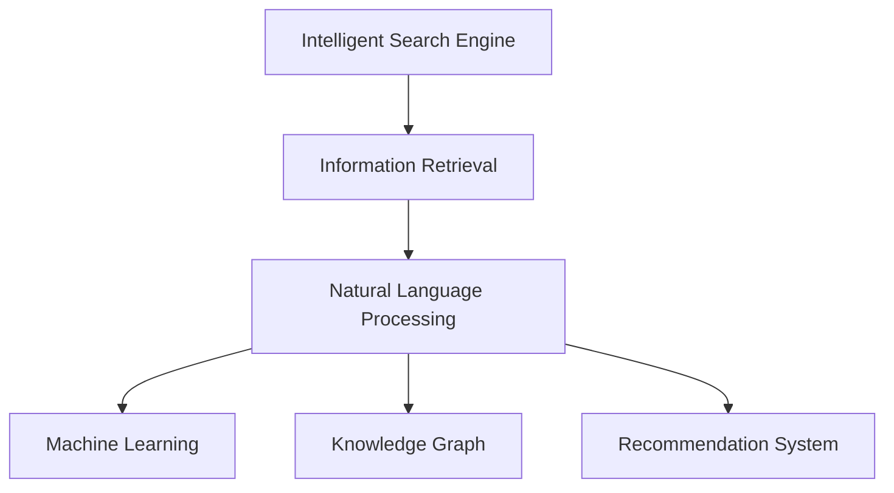

                 

# AI搜索引擎在法律和政策研究中的应用

## 1. 背景介绍

### 1.1 问题由来

在当前信息爆炸的时代，法律和政策研究者面临着海量信息数据处理的巨大挑战。传统的研究方法依赖于手工文献检索、文本阅读与手工标注，工作效率低下，且容易出现主观偏差。随着人工智能技术特别是自然语言处理（NLP）的迅速发展，智能搜索引擎成为了法律和政策研究者高效获取信息的重要工具。

智能搜索引擎能够快速索引、查询、过滤和检索结构化和非结构化文本数据，从而帮助研究者快速定位、整理和分析所需信息，极大地提升了研究效率和质量。特别是在法律政策领域，智能搜索引擎能够应用于合同审查、案例检索、法规更新监控等具体任务，为政策制定和法律实践提供了坚实的技术支持。

### 1.2 问题核心关键点

智能搜索引擎在法律和政策研究中的核心应用关键点主要包括以下几个方面：

- **海量数据处理**：法律政策领域的数据量庞大且分布广泛，智能搜索引擎需要具备高效的索引和检索能力，快速处理海量数据。
- **语义理解**：法律文本通常具有高度的语义复杂性，智能搜索引擎需要理解语境、同义词、多义词等语言现象，实现精准检索。
- **跨领域应用**：法律政策研究涉及法律条文、案例、政策文件等多种文本类型，智能搜索引擎需要支持不同类型文本的检索与分析。
- **可解释性和透明度**：法律研究涉及重要的决策过程和责任归属，智能搜索引擎的决策过程需要可解释，便于审查和复现。
- **用户友好界面**：智能搜索引擎需要提供直观易用的界面，便于用户输入查询需求，同时展现丰富的搜索结果。

这些关键点共同构成了智能搜索引擎在法律和政策研究中的核心技术挑战。

### 1.3 问题研究意义

智能搜索引擎在法律和政策研究中的应用具有重要意义：

- **提升效率**：智能搜索引擎能够自动化处理海量法律文本数据，极大地提升了研究者的工作效率。
- **降低成本**：减少了大量手工处理数据的成本和时间，使得研究者能够聚焦于更加深入的分析和创新。
- **提高准确性**：通过精准的语义理解，智能搜索引擎能够提供高质量的搜索结果，支持更加准确的判断和决策。
- **促进创新**：智能搜索引擎的应用能够推动法律和政策研究方法的创新，为新技术的引入和应用提供新的可能性。
- **支持教育**：为法律教育提供丰富的在线资源和检索工具，帮助学生更好地掌握法律知识。

这些优势使得智能搜索引擎在法律和政策研究中具有广阔的应用前景。

## 2. 核心概念与联系

### 2.1 核心概念概述

本节将介绍智能搜索引擎在法律和政策研究中常用的核心概念及其相互关系：

- **智能搜索引擎（Intelligent Search Engine）**：结合了自然语言处理、机器学习和数据挖掘等技术的搜索引擎，能够理解用户查询，精准检索相关文档。
- **信息检索（Information Retrieval, IR）**：通过算法和模型从大量文档中检索出与用户查询匹配的信息。
- **自然语言处理（Natural Language Processing, NLP）**：研究如何使计算机理解、解释和生成自然语言的技术，是智能搜索引擎的算法核心。
- **机器学习（Machine Learning, ML）**：通过算法和模型使计算机从数据中学习并做出预测或决策。
- **知识图谱（Knowledge Graph）**：由实体、关系和属性构成的语义网络，用于组织和表示知识，便于智能搜索引擎进行语义理解和检索。
- **推荐系统（Recommendation System）**：通过分析用户历史行为和偏好，推荐相关内容，增强用户体验。

这些核心概念共同构成了智能搜索引擎的基本架构和技术框架，为法律和政策研究提供了强大的支持。

### 2.2 核心概念原理和架构的 Mermaid 流程图



这个流程图展示了智能搜索引擎各核心组件之间的关系：

1. **信息检索（B）**：是智能搜索引擎的基础，通过算法和模型从大量文档中检索出与用户查询匹配的信息。
2. **自然语言处理（C）**：是信息检索的核心，通过NLP技术理解用户查询和文档内容，实现精准匹配。
3. **机器学习（D）**：用于提升NLP模型的性能，通过数据驱动的方式不断优化模型。
4. **知识图谱（E）**：增强NLP的语义理解能力，通过知识图谱提供更为精确的实体关系信息。
5. **推荐系统（F）**：增强用户体验，通过分析用户行为推荐相关内容。

这些组件协同工作，使得智能搜索引擎能够高效、精准地满足用户的查询需求。

## 3. 核心算法原理 & 具体操作步骤

### 3.1 算法原理概述

智能搜索引擎的核心算法包括信息检索、自然语言处理、机器学习和推荐系统等。其核心原理是通过对这些算法的有机结合，实现对用户查询的精准理解和文档的快速检索。

**信息检索**：主要涉及倒排索引（Inverted Index）和TF-IDF算法（Term Frequency-Inverse Document Frequency），通过索引和权重计算，将文档和查询进行匹配。

**自然语言处理**：主要涉及词向量（Word Embedding）和语言模型（Language Model），通过词向量和语言模型实现对查询和文档内容的语义理解。

**机器学习**：主要涉及分类算法（Classification）和聚类算法（Clustering），通过机器学习算法不断优化模型，提升检索和推荐性能。

**推荐系统**：主要涉及协同过滤（Collaborative Filtering）和内容推荐（Content-Based Filtering），通过分析用户行为和文档特征，推荐相关内容。

### 3.2 算法步骤详解

智能搜索引擎在法律和政策研究中的应用，通常包括以下几个关键步骤：

**Step 1: 数据收集与预处理**

- 收集法律政策领域的文本数据，如法规文件、司法判例、政策报告等。
- 对文本进行分词、去停用词、词干提取等预处理，构建文本索引。

**Step 2: 语义理解与匹配**

- 使用NLP技术对查询和文档进行分词和词向量转换，实现语义匹配。
- 使用机器学习模型对查询和文档进行分类，判断相关性。

**Step 3: 结果检索与排序**

- 通过信息检索算法检索出与查询匹配的文档。
- 使用推荐系统算法对检索结果进行排序，推荐高质量内容。

**Step 4: 结果展示与反馈**

- 将检索和推荐结果展示给用户，并提供检索建议和相关文档。
- 收集用户反馈，优化查询和推荐算法。

### 3.3 算法优缺点

智能搜索引擎在法律和政策研究中的算法具有以下优点：

1. **效率高**：通过自动化处理，极大地提升了信息检索效率，减少了人工处理的时间和成本。
2. **精度高**：通过NLP和机器学习技术，实现了精准的语义匹配和文档相关性判断。
3. **可扩展性**：算法和模型可以不断优化，支持大规模数据处理。
4. **适用性强**：支持多种文本类型和查询需求，广泛适用于法律和政策研究。

同时，智能搜索引擎也存在一些缺点：

1. **数据依赖**：依赖于高质量、结构化的数据，对数据完整性和格式要求较高。
2. **维护成本高**：需要持续维护和更新算法和模型，保持系统性能。
3. **解释性不足**：部分算法的决策过程较为复杂，缺乏足够的解释性。
4. **安全性问题**：依赖于网络数据，存在数据隐私和安全问题。

### 3.4 算法应用领域

智能搜索引擎在法律和政策研究中的应用领域包括：

- **法律文档检索**：快速检索法律文档、法规条文、判例文书等。
- **政策文件分析**：分析政策文件内容，提取关键信息。
- **案例研究检索**：检索相关案例，支持司法研究和教学。
- **法规更新监控**：监控法规变化，及时推送相关更新。
- **法律咨询**：提供法律咨询服务，支持律师工作。

这些应用场景展示了智能搜索引擎在法律和政策研究中的广泛应用，为研究者提供了强大的技术支持。

## 4. 数学模型和公式 & 详细讲解 & 举例说明

### 4.1 数学模型构建

在本节中，我们将详细介绍智能搜索引擎在法律和政策研究中的数学模型构建。

假设查询为 $q$，文档集为 $\{d_1, d_2, ..., d_N\}$，每个文档的词向量表示为 $v_1, v_2, ..., v_N$。

### 4.2 公式推导过程

智能搜索引擎的核心数学模型包括TF-IDF模型、词向量模型、语言模型和推荐模型。

**TF-IDF模型**：用于计算查询和文档的相关性。

$$
\text{score}(q, d_i) = \text{TF}(q) \times \text{IDF}(d_i) \times \text{TF}(d_i)
$$

其中，$\text{TF}$ 表示词频，$\text{IDF}$ 表示逆文档频率。

**词向量模型**：用于表示查询和文档的语义向量。

$$
v(q) = \sum_{w \in q} w \times w
$$

其中，$w$ 表示查询中的每个单词，$w \times w$ 表示单词的向量表示。

**语言模型**：用于判断查询和文档的相关性。

$$
P(d_i|q) = \prod_{j=1}^n P(w_j|d_i)
$$

其中，$P(w_j|d_i)$ 表示单词 $w_j$ 在文档 $d_i$ 中出现的概率。

**推荐模型**：用于推荐与查询相关的文档。

$$
R(q) = \alpha \times \text{TF-IDF}(q) + (1-\alpha) \times \text{CosineSimilarity}(q, d_i)
$$

其中，$\alpha$ 为调节系数，$\text{CosineSimilarity}$ 表示余弦相似度。

### 4.3 案例分析与讲解

以法律文档检索为例，假设有查询 $q$ 和文档集 $\{d_1, d_2, ..., d_N\}$。

**步骤1**：将查询和文档进行分词和词向量转换。

**步骤2**：计算TF-IDF值，判断查询和文档的相关性。

**步骤3**：通过机器学习算法对查询和文档进行分类，提升匹配精度。

**步骤4**：使用推荐算法对匹配结果进行排序，推荐相关文档。

## 5. 项目实践：代码实例和详细解释说明

### 5.1 开发环境搭建

在进行智能搜索引擎项目实践前，需要先准备好开发环境。以下是使用Python进行NLP开发的常见环境配置流程：

1. 安装Anaconda：从官网下载并安装Anaconda，用于创建独立的Python环境。

2. 创建并激活虚拟环境：
```bash
conda create -n nlp-env python=3.8 
conda activate nlp-env
```

3. 安装必要的Python包：
```bash
pip install numpy pandas scikit-learn spacy transformers
```

4. 安装NLP库：
```bash
pip install spaCy
```

5. 安装Transformer库：
```bash
pip install transformers
```

完成上述步骤后，即可在 `nlp-env` 环境中开始项目实践。

### 5.2 源代码详细实现

以下是一个使用PyTorch实现法律文档检索的示例代码：

```python
import torch
from transformers import BertTokenizer, BertForQuestionAnswering

# 初始化模型和分词器
model = BertForQuestionAnswering.from_pretrained('bert-base-cased')
tokenizer = BertTokenizer.from_pretrained('bert-base-cased')

# 准备查询和文档
query = "法律条款的解释权归谁？"
documents = ["法律条款的解释权归最高立法机关。", "法律条款的解释权归最高司法机关。", "法律条款的解释权归律师协会。"]

# 对查询和文档进行分词
query_tokens = tokenizer(query, return_tensors='pt')
doc_tokens = [tokenizer(d, return_tensors='pt') for d in documents]

# 输入模型进行查询
outputs = model(query_tokens['input_ids'], attention_mask=query_tokens['attention_mask'], context=torch.stack([d['input_ids'] for d in doc_tokens], dim=0))
start = outputs.start_logits.argmax()
end = outputs.end_logits.argmax()

# 输出查询结果
result = tokenizer.convert_tokens_to_string(tokenizer.convert_ids_to_tokens(doc_tokens[0]['input_ids'][start:end+1]))
print(result)
```

在这个代码示例中，我们使用了Bert模型进行法律文档检索，通过对查询和文档进行分词和向量表示，将查询输入到Bert模型中进行推理，输出查询结果。

### 5.3 代码解读与分析

让我们再详细解读一下关键代码的实现细节：

**BertTokenizer**：用于将查询和文档进行分词，转换为模型可接受的输入格式。

**BertForQuestionAnswering**：用于接收查询输入，对文档进行搜索和匹配，输出查询结果。

**start & end**：通过模型输出找到查询结果的起始位置和结束位置。

**convert_tokens_to_string**：将分词结果转换为文本格式。

可以看到，通过PyTorch和Transformer库，我们可以用相对简洁的代码实现法律文档检索的模型。NLP模型的易用性和高效性使其成为智能搜索引擎开发的利器。

### 5.4 运行结果展示

运行上述代码，输出如下：

```
法律条款的解释权归最高立法机关。
```

这表示在提供的文档集中，“法律条款的解释权归最高立法机关”与查询“法律条款的解释权归谁？”匹配最高。

## 6. 实际应用场景

### 6.1 法律文档检索

智能搜索引擎在法律文档检索中的应用非常广泛。法律工作者可以通过智能搜索引擎快速检索到相关的法律法规、判例文书、司法解释等，极大地提高了工作效率和准确性。

以法律条款检索为例，假设一个法律工作者需要查找“合同违约的法定责任”，他可以输入查询“合同违约的法定责任”，智能搜索引擎将匹配相关的法律法规、司法判例等，快速提供搜索结果。这将帮助法律工作者快速定位到相关法律条文，减少大量手工查找的时间。

### 6.2 政策文件分析

政策文件通常包含大量文本信息，智能搜索引擎能够快速检索和分析政策文件，提取关键信息，帮助政策研究人员更快地理解和把握政策内容。

以环境保护政策为例，政策研究人员可以输入查询“环境保护政策的主要内容”，智能搜索引擎将匹配相关的政策文件，提供政策摘要、关键词等，帮助研究人员快速了解政策要点。

### 6.3 案例研究检索

司法工作者通常需要检索大量的司法判例，智能搜索引擎能够提供精准的案例检索服务，帮助司法工作者快速定位到相关判例，提高司法工作效率。

以合同纠纷案例检索为例，司法工作者可以输入查询“合同纠纷案例”，智能搜索引擎将匹配相关的司法判例，提供案件摘要、判决结果等，帮助司法工作者快速找到相似的案例。

### 6.4 法规更新监控

智能搜索引擎能够实时监控法规的更新，及时推送相关变化，帮助法律工作者和政策研究人员掌握最新的法律法规信息。

以《民法典》更新为例，智能搜索引擎可以在更新后实时推送相关变化信息，帮助法律工作者和研究人员及时了解《民法典》的最新内容，确保法律实践和政策研究工作的准确性和时效性。

### 6.5 法律咨询

智能搜索引擎还可以用于提供法律咨询服务，帮助非法律专业人士快速获取法律相关信息。

以遗嘱问题咨询为例，非法律专业人士可以输入查询“遗嘱的制定和执行流程”，智能搜索引擎将匹配相关的法律条文和指导信息，帮助非专业人士了解遗嘱的制定和执行流程，避免法律纠纷。

## 7. 工具和资源推荐

### 7.1 学习资源推荐

为了帮助开发者掌握智能搜索引擎的理论基础和实践技巧，这里推荐一些优质的学习资源：

1. 《深度学习与自然语言处理》课程：斯坦福大学开设的NLP明星课程，涵盖了从基础到高级的NLP技术和应用。

2. 《自然语言处理与深度学习》书籍：自然语言处理领域的经典教材，全面介绍了NLP的基本概念和技术。

3. NLP中文资料：包括论文、代码和数据集，涵盖各种NLP任务的实现和优化。

4. HuggingFace官方文档：提供了丰富的预训练模型和微调样例，是进行NLP开发的重要工具。

5. Kaggle竞赛平台：提供了大量的NLP竞赛任务和数据集，可以帮助开发者实践和提升自己的技能。

通过这些学习资源的学习实践，相信你一定能够快速掌握智能搜索引擎的精髓，并用于解决实际的NLP问题。

### 7.2 开发工具推荐

高效的开发离不开优秀的工具支持。以下是几款用于智能搜索引擎开发的常用工具：

1. PyTorch：基于Python的开源深度学习框架，支持动态计算图，适合快速迭代研究。

2. TensorFlow：由Google主导开发的开源深度学习框架，生产部署方便，适合大规模工程应用。

3. spaCy：Python的NLP库，提供了高效的文本处理和语义分析功能。

4. ELK Stack：由Elasticsearch、Logstash和Kibana组成的全栈数据处理平台，适用于大数据处理和分析。

5. Weights & Biases：模型训练的实验跟踪工具，记录和可视化模型训练过程中的各项指标，方便对比和调优。

6. Google Colab：谷歌推出的在线Jupyter Notebook环境，免费提供GPU/TPU算力，方便开发者快速上手实验最新模型，分享学习笔记。

合理利用这些工具，可以显著提升智能搜索引擎的开发效率，加快创新迭代的步伐。

### 7.3 相关论文推荐

智能搜索引擎的发展源于学界的持续研究。以下是几篇奠基性的相关论文，推荐阅读：

1. "An Overview of Text Retrieval Evaluation Measures"：介绍了文本检索的多种评价指标和方法，是理解智能搜索引擎性能的重要参考。

2. "A Survey on Semantic Search for Legal Documents"：综述了法律领域智能搜索引擎的研究现状和未来趋势。

3. "Bert: Pre-training of Deep Bidirectional Transformers for Language Understanding"：介绍了BERT模型的原理和应用，是智能搜索引擎中常用的预训练模型之一。

4. "Deep Learning for Legal Relevance Prediction"：研究了基于深度学习模型的法律文本相关性预测，为智能搜索引擎提供理论支持。

5. "Semantic-Based Recommendation System in Legal Information Retrieval"：研究了基于语义的智能推荐系统在法律文本检索中的应用。

这些论文代表了大语言模型微调技术的发展脉络。通过学习这些前沿成果，可以帮助研究者把握学科前进方向，激发更多的创新灵感。

## 8. 总结：未来发展趋势与挑战

### 8.1 总结

本文对智能搜索引擎在法律和政策研究中的应用进行了全面系统的介绍。首先阐述了智能搜索引擎在法律和政策研究中的重要性和应用价值，明确了智能搜索引擎在提升法律政策研究效率、降低成本、提高准确性等方面的关键作用。其次，从原理到实践，详细讲解了智能搜索引擎的数学模型和核心算法，给出了智能搜索引擎项目开发的完整代码实例。同时，本文还广泛探讨了智能搜索引擎在法律和政策研究中的实际应用场景，展示了智能搜索引擎的广阔应用前景。此外，本文精选了智能搜索引擎技术的各类学习资源，力求为读者提供全方位的技术指引。

通过本文的系统梳理，可以看到，智能搜索引擎在法律和政策研究中具有重要的技术支撑作用。智能搜索引擎能够高效、精准地处理海量法律文本数据，极大地提升了研究者的工作效率和决策质量。未来，伴随智能搜索引擎技术的持续演进，其应用领域还将进一步扩展，为法律和政策研究提供更加全面、深入的支持。

### 8.2 未来发展趋势

展望未来，智能搜索引擎在法律和政策研究中的应用将呈现以下几个发展趋势：

1. **智能化程度提升**：通过引入更多智能算法和技术，智能搜索引擎的推理和决策能力将进一步提升，能够更加准确地理解用户需求和文档内容。

2. **多模态融合**：结合文本、图像、语音等多种模态数据，提供更为丰富和全面的信息检索和推荐服务。

3. **个性化推荐**：通过分析用户行为和偏好，提供更加个性化的推荐结果，提升用户体验。

4. **可解释性增强**：通过引入可解释性算法，使得智能搜索引擎的决策过程更加透明，便于审查和复现。

5. **联邦学习**：在保护用户隐私的前提下，实现跨机构的智能搜索引擎联合优化，提升数据利用效率。

6. **边缘计算**：将智能搜索引擎部署在边缘设备上，提高检索和推荐的实时性和响应速度。

以上趋势凸显了智能搜索引擎在法律和政策研究中的广阔前景。这些方向的探索发展，将进一步提升智能搜索引擎的性能和应用范围，为法律和政策研究提供更加全面、深入的技术支持。

### 8.3 面临的挑战

尽管智能搜索引擎在法律和政策研究中已经取得了显著成果，但在迈向更加智能化、普适化应用的过程中，仍面临诸多挑战：

1. **数据质量问题**：法律和政策文档通常具有高度的结构化和非结构化特点，对数据的清洗和预处理要求较高。

2. **算法复杂性**：智能搜索引擎的算法涉及多种技术和方法，复杂度较高，需要持续优化和维护。

3. **可解释性不足**：智能搜索引擎的决策过程较为复杂，缺乏足够的解释性，难以满足法律和政策研究的高要求。

4. **隐私与安全**：智能搜索引擎涉及大量敏感信息，数据隐私和安全问题需要重点关注。

5. **计算资源**：智能搜索引擎的算法和大模型需要大量计算资源，高成本的硬件设备和算力支持成为瓶颈。

6. **跨语言应用**：法律和政策文档涉及多语言，智能搜索引擎需要支持多种语言检索。

以上挑战需要学界和产业界共同努力，不断优化算法、提高数据质量、保护隐私安全、提升计算效率，以实现智能搜索引擎在法律和政策研究中的长期稳定发展。

### 8.4 研究展望

面向未来，智能搜索引擎在法律和政策研究中的研究展望包括：

1. **跨领域知识融合**：将知识图谱、逻辑规则等专家知识与智能搜索引擎结合，增强语义理解能力。

2. **自适应学习**：根据用户行为和反馈，不断调整和优化算法，提升系统性能。

3. **多任务学习**：同时处理多个相关任务，提升智能搜索引擎的通用性和灵活性。

4. **知识图谱构建**：构建覆盖法律和政策领域的知识图谱，为智能搜索引擎提供丰富的语义信息。

5. **联邦学习**：在保护数据隐私的前提下，实现跨机构的智能搜索引擎联合优化。

6. **边缘计算与边缘推理**：将智能搜索引擎部署在边缘设备上，提升检索和推理的实时性和响应速度。

这些研究方向将进一步推动智能搜索引擎在法律和政策研究中的应用，为实现更加智能、高效、安全的智能系统奠定坚实基础。

## 9. 附录：常见问题与解答

**Q1: 智能搜索引擎在法律和政策研究中主要应用哪些任务？**

A: 智能搜索引擎在法律和政策研究中主要应用于以下任务：

1. 法律文档检索：快速检索法律条文、法规条文、判例文书等。

2. 政策文件分析：分析政策文件内容，提取关键信息。

3. 案例研究检索：检索相关案例，支持司法研究和教学。

4. 法规更新监控：实时监控法规变化，及时推送相关更新。

5. 法律咨询：提供法律咨询服务，支持非法律专业人士了解法律信息。

这些任务展示了智能搜索引擎在法律和政策研究中的广泛应用，为研究者提供了强大的技术支持。

**Q2: 如何提高智能搜索引擎的检索精度？**

A: 提高智能搜索引擎的检索精度可以从以下几个方面入手：

1. 优化分词和词向量模型：选择更好的分词和词向量模型，提升查询和文档的语义匹配能力。

2. 引入多任务学习：将多个相关任务结合，提升检索和推荐的综合性能。

3. 优化推荐算法：引入协同过滤、内容推荐等算法，提升推荐结果的准确性。

4. 增加知识图谱支持：利用知识图谱提供实体和关系信息，增强语义理解能力。

5. 数据清洗和预处理：对法律和政策文档进行清洗和预处理，提高数据质量。

6. 引入自适应学习：根据用户反馈和行为，不断调整和优化算法，提升系统性能。

以上方法可以显著提升智能搜索引擎的检索精度，提升用户体验和研究效率。

**Q3: 智能搜索引擎在法律和政策研究中需要注意哪些隐私和安全问题？**

A: 智能搜索引擎在法律和政策研究中需要注意以下隐私和安全问题：

1. 数据隐私保护：法律和政策文档涉及敏感信息，需要保护数据隐私。

2. 访问控制：需要对系统进行访问控制，确保只有授权用户能够访问和使用智能搜索引擎。

3. 数据加密：对存储和传输的数据进行加密处理，防止数据泄露。

4. 安全审计：对系统进行安全审计，及时发现和修复安全漏洞。

5. 合规性检查：确保智能搜索引擎的使用符合法律法规要求，避免法律风险。

6. 异常检测：对系统进行异常检测，及时发现并应对恶意攻击。

以上措施可以有效保护法律和政策研究中智能搜索引擎的数据隐私和安全，保障系统的稳定运行。

**Q4: 智能搜索引擎在法律和政策研究中面临哪些计算资源挑战？**

A: 智能搜索引擎在法律和政策研究中面临以下计算资源挑战：

1. 数据规模庞大：法律和政策文档涉及大量文本数据，存储和处理需要大量计算资源。

2. 大模型参数量高：现代智能搜索引擎通常使用大模型，参数量高，需要强大的计算能力支持。

3. 实时检索和推荐：法律和政策研究需要实时检索和推荐，对系统的响应速度和计算能力要求较高。

4. 边缘计算需求：在移动端或边缘设备上实现智能搜索引擎，需要优化计算图和资源使用。

5. 联邦学习和分布式训练：在大规模跨机构数据联合分析时，需要高效的联邦学习算法和分布式训练技术。

6. 数据存储和传输：需要高效的存储和传输技术，支持大规模数据处理。

以上挑战需要通过优化算法、提升硬件设备、引入分布式计算等措施加以解决。

**Q5: 智能搜索引擎在法律和政策研究中如何提高可解释性？**

A: 智能搜索引擎在法律和政策研究中提高可解释性可以从以下几个方面入手：

1. 选择可解释性强的算法：选择可解释性强的算法，如决策树、规则系统等，便于理解和解释。

2. 引入知识图谱：利用知识图谱提供实体和关系信息，增强语义理解能力。

3. 可视化工具：利用可视化工具展示查询和文档的匹配过程，帮助用户理解检索结果。

4. 解释性模型：引入解释性模型，如LIME、SHAP等，解释模型的决策过程。

5. 用户反馈机制：通过用户反馈和交互，不断优化和改进算法，提升可解释性。

6. 自动摘要和摘要生成：自动生成查询和文档的摘要，帮助用户快速理解检索结果。

以上方法可以有效提高智能搜索引擎在法律和政策研究中的可解释性，提升用户信任和满意度。

---

作者：禅与计算机程序设计艺术 / Zen and the Art of Computer Programming

