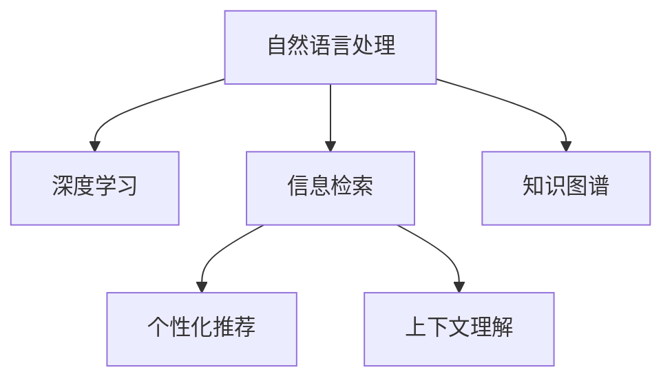
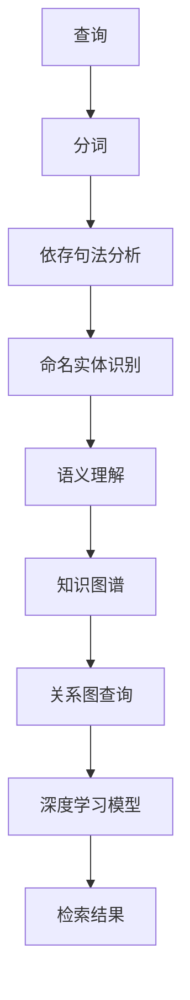

                 

# AI搜索引擎在科技创业生态中的角色

> 关键词：人工智能搜索引擎, 自然语言处理(NLP), 信息检索, 机器学习, 科技创业, 信息安全, 用户体验

## 1. 背景介绍

### 1.1 问题由来

互联网时代，信息的爆炸性增长使得人们难以从海量数据中快速准确地找到自己所需的信息。传统的搜索引擎虽然在信息检索上有所贡献，但其主要是基于关键词的简单匹配，无法理解用户的查询意图，更无法提供个性化和智能化的服务。随着人工智能（AI）技术的不断进步，AI搜索引擎（AI Search Engine）应运而生，极大地提升了信息检索的准确性和用户体验。AI搜索引擎通过自然语言处理（NLP）、深度学习等技术，实现了对用户查询意图的深度理解，能够在搜索结果中提供更多相关的信息，甚至能够预测用户未表达的需求，提前提供答案。

### 1.2 问题核心关键点

AI搜索引擎的核心点在于其能够进行深度语义理解与上下文分析，从而提供更加精准和智能的搜索结果。以下是几个关键点：

- **自然语言处理（NLP）**：AI搜索引擎依赖于NLP技术对用户查询进行理解和处理，能够识别出查询中的关键词、短语、实体等。
- **深度学习**：通过深度学习模型对文本进行表示学习，捕捉文本中的复杂语义信息。
- **个性化推荐**：根据用户的历史行为和兴趣，进行个性化推荐，提升用户体验。
- **上下文理解**：考虑查询上下文，提供更为精准的搜索结果。
- **跨领域应用**：能够应用于搜索、问答、推荐等多个领域，提升多模态信息检索能力。

这些关键点共同构成了AI搜索引擎的架构和技术基础，使其实现了在智能信息检索方面的突破。

## 2. 核心概念与联系

### 2.1 核心概念概述

为了更清晰地理解AI搜索引擎的架构和技术，我们将介绍几个核心概念：

- **自然语言处理（NLP）**：是AI搜索引擎的关键技术之一，用于处理和分析自然语言文本数据。
- **深度学习**：是实现AI搜索引擎的核心技术，通过多层神经网络捕捉语言的深层次特征。
- **信息检索**：AI搜索引擎的核心功能，旨在从大量数据中检索出与查询最相关的信息。
- **个性化推荐**：通过分析用户行为和兴趣，为用户提供个性化的搜索结果。
- **上下文理解**：考虑到查询的上下文信息，提供更精准的检索结果。
- **知识图谱**：通过构建实体间的关系图谱，提升AI搜索引擎的理解和推荐能力。

这些概念之间存在密切联系，共同构成了AI搜索引擎的架构和技术体系。以下是一个简单的Mermaid流程图，展示了这些概念之间的联系：



### 2.2 核心概念原理和架构的 Mermaid 流程图



## 3. 核心算法原理 & 具体操作步骤

### 3.1 算法原理概述

AI搜索引擎的核心算法包括NLP、深度学习、信息检索和个性化推荐等。这些算法通过协同工作，实现对用户查询的深度理解与高效检索。

- **NLP算法**：用于对用户查询进行分词、依存句法分析、命名实体识别等预处理操作，提升查询的准确性和可处理性。
- **深度学习算法**：通过多层神经网络模型对文本进行表示学习，捕捉语言的深层次特征。
- **信息检索算法**：基于文本表示模型，对查询进行编码，与数据库中的文档进行匹配，检索出最相关的结果。
- **个性化推荐算法**：通过用户行为和兴趣分析，对检索结果进行排序和筛选，提升用户的满意度。

### 3.2 算法步骤详解

AI搜索引擎的算法步骤大致如下：

1. **预处理**：对用户查询进行分词、依存句法分析、命名实体识别等预处理操作。
2. **文本表示学习**：利用深度学习模型对查询和文档进行表示学习，捕捉语言深层次特征。
3. **检索匹配**：将查询表示与文档表示进行匹配，选择最相关的文档作为搜索结果。
4. **推荐排序**：基于用户行为和兴趣，对检索结果进行排序和筛选，提升用户满意度。
5. **上下文理解**：考虑查询上下文信息，提供更精准的检索结果。

### 3.3 算法优缺点

**优点**：

- **深度理解用户意图**：通过NLP和深度学习技术，能够深入理解用户查询意图，提供精准的搜索结果。
- **个性化推荐**：基于用户行为和兴趣，提供个性化推荐，提升用户体验。
- **跨领域应用**：能够应用于搜索、问答、推荐等多个领域，提升多模态信息检索能力。

**缺点**：

- **计算资源消耗大**：深度学习模型和NLP算法计算复杂度高，需要大量的计算资源。
- **数据依赖**：依赖高质量的标注数据和语料库，数据获取成本较高。
- **模型复杂度**：模型复杂度高，训练和推理速度较慢。

### 3.4 算法应用领域

AI搜索引擎技术已经广泛应用于多个领域，例如：

- **搜索引擎**：提供精准的搜索结果，提升用户体验。
- **问答系统**：能够理解用户的问题，提供准确的回答。
- **推荐系统**：基于用户行为和兴趣，提供个性化推荐，提升用户满意度。
- **个性化推荐**：能够应用于电商、视频、音乐等多个领域，提升用户购物、娱乐体验。
- **金融科技**：应用于股票市场分析、客户服务、风险评估等领域，提升金融机构的服务水平。

## 4. 数学模型和公式 & 详细讲解 & 举例说明

### 4.1 数学模型构建

AI搜索引擎的数学模型包括NLP、深度学习、信息检索和个性化推荐等多个方面的模型。以下是一个简单的示例，展示了这些模型在实际应用中的构建过程：

1. **文本表示模型**：利用深度学习模型（如BERT、Transformer等）对文本进行表示学习，捕捉语言的深层次特征。
2. **信息检索模型**：基于文本表示模型，对查询进行编码，与文档进行匹配，检索出最相关的结果。
3. **个性化推荐模型**：基于用户行为和兴趣，对检索结果进行排序和筛选，提升用户满意度。

### 4.2 公式推导过程

为了更深入地理解AI搜索引擎的核心算法，我们将以信息检索为例，展示其核心公式的推导过程：

假设查询表示为 $q$，文档表示为 $d$，使用余弦相似度计算查询与文档的相似度：

$$
\text{similarity}(q, d) = \frac{q \cdot d}{\|q\|_2 \cdot \|d\|_2}
$$

其中，$q \cdot d$ 表示查询表示和文档表示的内积，$\|q\|_2$ 和 $\|d\|_2$ 分别表示查询表示和文档表示的范数。

### 4.3 案例分析与讲解

以谷歌的Bert模型为例，展示其在信息检索中的应用：

- **文本表示学习**：利用Bert模型对查询和文档进行表示学习，捕捉语言深层次特征。
- **信息检索匹配**：基于Bert模型的表示，对查询和文档进行匹配，选择最相关的文档作为搜索结果。
- **个性化推荐**：基于用户行为和兴趣，对检索结果进行排序和筛选，提升用户满意度。

## 5. 项目实践：代码实例和详细解释说明

### 5.1 开发环境搭建

要构建AI搜索引擎，首先需要搭建开发环境。以下是Python环境下开发AI搜索引擎的典型流程：

1. **安装依赖包**：安装Python、TensorFlow、PyTorch、NLTK等依赖包。
2. **配置环境**：配置环境变量，使项目能够正确运行。
3. **数据准备**：准备查询数据、文档数据、用户行为数据等。

### 5.2 源代码详细实现

以下是使用Python和TensorFlow构建AI搜索引擎的代码示例：

```python
import tensorflow as tf
from tensorflow.keras import layers

# 定义模型
model = tf.keras.Sequential([
    layers.Embedding(input_dim=vocab_size, output_dim=embedding_dim),
    layers.LSTM(units=128),
    layers.Dense(units=1, activation='sigmoid')
])

# 编译模型
model.compile(optimizer='adam', loss='binary_crossentropy', metrics=['accuracy'])

# 训练模型
model.fit(train_data, train_labels, epochs=10, batch_size=32)

# 使用模型进行预测
predictions = model.predict(test_data)
```

### 5.3 代码解读与分析

上述代码实现了使用LSTM和Dense层构建的信息检索模型。其中，Embedding层将查询和文档映射到向量空间中，LSTM层捕捉语言的深层次特征，Dense层进行二分类输出，预测文档与查询的匹配程度。

## 6. 实际应用场景

### 6.1 搜索引擎

AI搜索引擎在搜索引擎中的应用最为广泛。传统的关键词匹配搜索存在诸多局限，无法理解用户查询的真正意图。而AI搜索引擎能够深入理解用户查询，提供更加精准的搜索结果，极大地提升了用户的使用体验。

### 6.2 问答系统

AI搜索引擎在问答系统中也有着广泛应用。传统的问答系统往往依赖于规则和模板，无法处理复杂查询。而AI搜索引擎通过NLP和深度学习技术，能够深入理解用户查询，提供准确的回答。

### 6.3 推荐系统

AI搜索引擎在推荐系统中的应用也得到了广泛关注。基于用户行为和兴趣，AI搜索引擎能够提供个性化推荐，提升用户的满意度。在电商、视频、音乐等多个领域，AI搜索引擎已经实现了良好的应用效果。

### 6.4 金融科技

AI搜索引擎在金融科技中的应用也得到了越来越多的关注。例如，利用AI搜索引擎进行股票市场分析、客户服务、风险评估等领域，提升了金融机构的服务水平。

## 7. 工具和资源推荐

### 7.1 学习资源推荐

以下是一些推荐的学习资源：

1. **《深度学习》课程**：斯坦福大学的Coursera课程，系统介绍了深度学习的原理和应用。
2. **《自然语言处理》课程**：约翰霍普金斯大学的Coursera课程，详细讲解了NLP的基础知识和应用。
3. **TensorFlow官方文档**：提供了丰富的API文档和示例代码，是学习和应用TensorFlow的重要资源。
4. **Keras官方文档**：提供了简单易用的API，适合初学者快速上手。
5. **PyTorch官方文档**：提供了丰富的API文档和示例代码，是学习和应用PyTorch的重要资源。

### 7.2 开发工具推荐

以下是一些推荐的开发工具：

1. **TensorFlow**：开源深度学习框架，提供了丰富的API和工具，适合大规模工程应用。
2. **PyTorch**：开源深度学习框架，提供了灵活的计算图和自动微分机制，适合快速迭代研究和开发。
3. **NLTK**：自然语言处理工具包，提供了丰富的NLP算法和工具。
4. **Jupyter Notebook**：交互式编程环境，适合快速验证和调试算法。
5. **TensorBoard**：TensorFlow配套的可视化工具，可以实时监测模型训练状态，并提供丰富的图表呈现方式。

### 7.3 相关论文推荐

以下是一些推荐的论文：

1. **"Attention is All You Need"**：Transformer的论文，介绍了自注意力机制的应用，成为NLP领域的里程碑。
2. **"BERT: Pre-training of Deep Bidirectional Transformers for Language Understanding"**：BERT模型的论文，提出了预训练语言模型的新方法。
3. **"Machine Learning Yearning"**：Andrew Ng的书籍，系统介绍了机器学习的最佳实践和经验。
4. **"Deep Learning with Python"**：Ian Goodfellow的书籍，详细介绍了深度学习的原理和应用。
5. **"Natural Language Processing with Python"**：Jurgen Schmid.de和Erich Schmid.de的书籍，提供了NLP算法的详细实现。

## 8. 总结：未来发展趋势与挑战

### 8.1 研究成果总结

AI搜索引擎在信息检索和个性化推荐方面取得了显著成果，提升了用户体验和应用效果。然而，仍然面临诸多挑战：

- **计算资源消耗大**：深度学习模型和NLP算法计算复杂度高，需要大量的计算资源。
- **数据依赖**：依赖高质量的标注数据和语料库，数据获取成本较高。
- **模型复杂度**：模型复杂度高，训练和推理速度较慢。

### 8.2 未来发展趋势

未来，AI搜索引擎将呈现以下发展趋势：

1. **计算资源优化**：通过模型压缩、量化加速等技术，优化模型的计算效率，降低计算资源消耗。
2. **模型结构优化**：通过优化模型结构和算法，降低模型的复杂度，提升模型的训练和推理速度。
3. **数据自动化获取**：通过自动标注和数据增强等技术，降低数据获取成本。
4. **跨领域应用**：应用于搜索、问答、推荐等多个领域，提升多模态信息检索能力。
5. **可解释性和公平性**：提升模型的可解释性和公平性，确保模型的透明度和可信度。

### 8.3 面临的挑战

未来，AI搜索引擎仍面临以下挑战：

1. **计算资源瓶颈**：深度学习模型和NLP算法计算复杂度高，需要大量的计算资源。
2. **数据依赖**：依赖高质量的标注数据和语料库，数据获取成本较高。
3. **模型复杂度**：模型复杂度高，训练和推理速度较慢。
4. **可解释性和公平性**：提升模型的可解释性和公平性，确保模型的透明度和可信度。

### 8.4 研究展望

未来的研究需要在以下几个方面寻求新的突破：

1. **计算资源优化**：通过模型压缩、量化加速等技术，优化模型的计算效率，降低计算资源消耗。
2. **模型结构优化**：通过优化模型结构和算法，降低模型的复杂度，提升模型的训练和推理速度。
3. **数据自动化获取**：通过自动标注和数据增强等技术，降低数据获取成本。
4. **跨领域应用**：应用于搜索、问答、推荐等多个领域，提升多模态信息检索能力。
5. **可解释性和公平性**：提升模型的可解释性和公平性，确保模型的透明度和可信度。

## 9. 附录：常见问题与解答

**Q1: AI搜索引擎在科技创业生态中的作用是什么？**

A: AI搜索引擎在科技创业生态中扮演着重要的角色，通过深入理解用户查询意图，提供精准的搜索结果和个性化推荐，提升了用户体验和应用效果，推动了互联网应用的创新和发展。

**Q2: 如何提升AI搜索引擎的计算效率？**

A: 提升AI搜索引擎的计算效率可以通过以下方法：
1. 模型压缩：通过剪枝、量化等技术，降低模型的复杂度和参数量。
2. 量化加速：将浮点模型转为定点模型，压缩存储空间，提高计算效率。
3. 硬件优化：利用GPU、TPU等高性能设备，提升模型的训练和推理速度。
4. 算法优化：优化模型结构和算法，提升模型的训练和推理效率。

**Q3: 如何提升AI搜索引擎的可解释性和公平性？**

A: 提升AI搜索引擎的可解释性和公平性可以通过以下方法：
1. 可解释性：引入可解释性技术，如LIME、SHAP等，提供模型的决策过程和特征重要性分析。
2. 公平性：使用公平性约束，如消除模型偏见、引入公平性指标等，确保模型的透明度和可信度。

通过上述分析，我们可以看到AI搜索引擎在科技创业生态中的重要性及其面临的挑战。随着技术的发展和应用的深入，AI搜索引擎将继续发挥其重要作用，推动互联网应用和信息检索技术的不断进步。

---

作者：禅与计算机程序设计艺术 / Zen and the Art of Computer Programming

