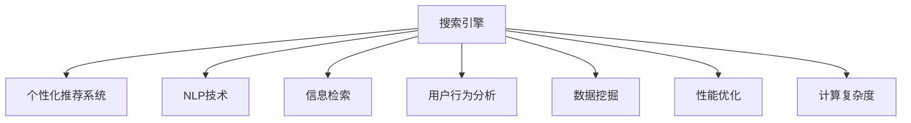

                 

# AI搜索引擎的个性化和优化挑战

> 关键词：搜索引擎, 个性化推荐, 自然语言处理(NLP), 信息检索, 用户行为分析, 数据挖掘, 性能优化, 计算复杂度

## 1. 背景介绍

### 1.1 问题由来

随着互联网的普及和数字化进程的加速，搜索引擎作为信息获取的重要工具，其个性化和优化成为了关键问题。随着用户规模的扩大和信息量的爆炸性增长，传统搜索引擎的算法难以处理海量的查询请求和搜索结果，用户体验逐渐下降。搜索引擎的个性化推荐系统成为解决这一问题的重要方向。

### 1.2 问题核心关键点

个性化推荐系统旨在通过用户历史行为、点击记录等数据，预测用户可能感兴趣的内容，从而提供更加精准的搜索结果。具体而言，搜索引擎面临以下挑战：

- 如何有效利用用户行为数据进行个性化推荐？
- 如何在保证推荐效果的同时，提高搜索的响应速度和系统可扩展性？
- 如何应对海量数据存储和计算的挑战，提升搜索和推荐系统的性能？
- 如何保障数据隐私和安全，防止用户信息泄露？

这些问题不仅是技术难题，还涉及到用户体验、系统性能、数据隐私等多方面的考量。

## 2. 核心概念与联系

### 2.1 核心概念概述

为更好地理解搜索引擎个性化和优化挑战，本节将介绍几个密切相关的核心概念：

- **搜索引擎**：用于快速检索和返回与用户查询相关的信息，主要由查询理解、信息检索、排序和呈现等多个模块构成。

- **个性化推荐系统**：根据用户历史行为和兴趣，自动推荐个性化搜索结果，提升用户满意度和系统点击率。

- **自然语言处理(NLP)**：通过文本分析、语义理解等技术，对用户查询和文档内容进行处理，是搜索引擎信息检索的重要基础。

- **信息检索**：根据用户查询，从文档集合中检索相关信息的过程。常用的检索模型包括向量空间模型、概率模型等。

- **用户行为分析**：通过分析用户的历史点击记录、停留时间、点击位置等行为数据，挖掘用户兴趣和偏好，作为推荐系统的输入。

- **数据挖掘**：通过机器学习和统计方法，从大量数据中挖掘出有用的知识，应用于推荐系统。

- **性能优化**：针对搜索引擎和推荐系统，通过算法优化、硬件升级等手段，提高系统的响应速度和吞吐量。

- **计算复杂度**：描述算法或系统处理的输入规模和计算资源消耗的关系，是衡量系统性能的重要指标。

这些核心概念之间的逻辑关系可以通过以下Mermaid流程图来展示：



这个流程图展示了个性化搜索引擎的主要组成部分及其之间的关系：

1. 搜索引擎基于NLP技术，通过信息检索模块，从文档集合中提取相关内容。
2. 用户行为分析模块，利用用户点击记录等数据，挖掘用户兴趣。
3. 数据挖掘模块，通过机器学习等方法，从数据中提取有用信息。
4. 个性化推荐系统，根据用户兴趣和推荐算法，生成个性化搜索结果。
5. 性能优化模块，通过算法和硬件升级，提升系统性能。
6. 计算复杂度，描述系统处理的输入规模和计算资源消耗的关系。

## 3. 核心算法原理 & 具体操作步骤
### 3.1 算法原理概述

搜索引擎的个性化和优化主要涉及以下几个核心算法：

1. **查询理解**：通过NLP技术，将用户查询转化为机器可理解的形式，提取查询中的关键词和语义信息。

2. **信息检索**：在文档集合中，使用信息检索算法，根据查询关键词和语义信息，找出相关文档。

3. **推荐算法**：基于用户行为数据和文档特征，使用机器学习算法，对搜索结果进行个性化排序和推荐。

4. **性能优化算法**：通过并行化、缓存、负载均衡等技术，提升系统响应速度和吞吐量。

5. **计算复杂度优化算法**：使用索引、压缩等技术，减少计算复杂度，提升系统处理能力。

这些算法之间的相互协作，共同构成了搜索引擎个性化推荐系统的技术框架。

### 3.2 算法步骤详解

搜索引擎的个性化和优化流程主要包括以下几个关键步骤：

**Step 1: 用户查询理解**
- 通过NLP技术，对用户查询进行分词、实体识别、情感分析等处理，提取出关键词和语义信息。
- 常用的查询理解技术包括TF-IDF、LSI、BERT等。

**Step 2: 文档检索**
- 根据用户查询关键词和语义信息，使用信息检索算法在文档集合中找出相关文档。
- 常用的信息检索模型包括向量空间模型、BM25、DeepIR等。

**Step 3: 文档排序**
- 将检索结果按照相关性、用户兴趣、点击率等指标进行排序，使用推荐算法生成个性化搜索结果。
- 推荐算法包括协同过滤、矩阵分解、GBDT等。

**Step 4: 结果呈现**
- 将排序后的文档展示给用户，并提供相关性评估、点击率统计等功能，收集用户反馈。

**Step 5: 持续优化**
- 根据用户反馈和系统性能，不断调整和优化查询理解、信息检索、推荐算法和性能优化算法，提高系统效果和效率。

### 3.3 算法优缺点

搜索引擎个性化和优化算法具有以下优点：

1. **提升用户体验**：通过个性化推荐，搜索引擎能够提供更符合用户需求的搜索结果，提高用户体验和满意度。
2. **提高系统效率**：通过性能优化算法，可以提升系统响应速度和吞吐量，应对大规模查询需求。
3. **数据驱动决策**：利用数据挖掘和用户行为分析，能够及时调整推荐策略，优化搜索结果。

同时，该算法也存在一些局限性：

1. **数据隐私问题**：用户行为数据涉及隐私，如何在保护隐私的前提下进行推荐，是技术上的挑战。
2. **计算资源消耗大**：个性化推荐和排序算法通常计算复杂度较高，需要大量计算资源支持。
3. **算法复杂度高**：推荐的准确性依赖于复杂的算法和模型，难以满足所有用户需求。

尽管存在这些局限性，但搜索引擎个性化和优化算法仍是大规模互联网应用的核心技术，被广泛应用于各大搜索引擎和推荐系统中。

### 3.4 算法应用领域

搜索引擎个性化和优化算法已经广泛应用于多个领域，包括：

- **电商搜索**：根据用户浏览记录和点击行为，推荐商品信息，提升用户购买率。
- **新闻资讯**：根据用户阅读习惯和兴趣，推荐相关新闻文章，提升用户停留时间。
- **视频平台**：根据用户观看记录和评分，推荐视频内容，提升用户粘性和留存率。
- **社交网络**：根据用户互动和兴趣，推荐好友和内容，提升用户活跃度和平台价值。
- **企业搜索**：根据员工搜索行为和知识图谱，推荐相关文档和知识，提升企业知识管理和信息获取效率。

## 4. 数学模型和公式 & 详细讲解 & 举例说明
### 4.1 数学模型构建

本节将使用数学语言对搜索引擎个性化推荐系统进行更加严格的刻画。

假设用户查询为 $q$，文档集合为 $D$，文档向量化表示为 $d \in \mathbb{R}^d$，用户兴趣向量为 $u \in \mathbb{R}^d$，推荐算法目标为最大化用户点击率 $C$，即：

$$
\max_{d \in D} C(u, d)
$$

其中 $C(u, d)$ 表示用户对文档 $d$ 的点击率，通常可以使用点击率模型进行估计。

### 4.2 公式推导过程

以协同过滤算法为例，推导推荐模型目标函数的计算公式。

协同过滤算法基于用户行为数据，通过计算用户之间的相似度，找到与用户 $u$ 兴趣相似的用户 $v$，并根据这些用户的喜好推荐相关文档。假设用户 $u$ 的历史行为表示为 $h_u$，与用户 $u$ 相似的用户集合为 $N(u)$，则协同过滤的目标函数可以表示为：

$$
C(u, d) = \frac{1}{|N(u)|} \sum_{v \in N(u)} \frac{h_v \cdot d}{||h_v|| \cdot ||d||}
$$

其中 $h_v$ 表示用户 $v$ 的历史行为向量，$||h_v||$ 和 $||d||$ 分别表示向量的范数。

将目标函数 $C(u, d)$ 带入最大化目标，得：

$$
\max_{d \in D} \frac{1}{|N(u)|} \sum_{v \in N(u)} \frac{h_v \cdot d}{||h_v|| \cdot ||d||}
$$

这是一个典型的最大化问题，可以使用拉格朗日乘数法求解。设 $\lambda$ 为拉格朗日乘数，构造拉格朗日函数：

$$
L(u, d, \lambda) = C(u, d) + \lambda \left( \frac{1}{|D|} \sum_{d \in D} ||d|| - 1 \right)
$$

对该函数求偏导并令其等于0，得到：

$$
\frac{\partial L}{\partial d} = \frac{1}{|N(u)|} \sum_{v \in N(u)} \frac{h_v}{||h_v|| \cdot ||d||} - \lambda \frac{d}{||d||} = 0
$$

整理得：

$$
\frac{1}{|N(u)|} \sum_{v \in N(u)} \frac{h_v}{||h_v|| \cdot ||d||} = \lambda \frac{d}{||d||}
$$

进一步化简得：

$$
d \propto \frac{1}{|N(u)|} \sum_{v \in N(u)} \frac{h_v}{||h_v||}
$$

即文档 $d$ 的推荐权重与其与用户 $u$ 相似用户 $v$ 的历史行为向量的加权平均值成正比。这个公式展示了协同过滤算法的核心思想：通过相似用户的历史行为，预测用户对未见文档的兴趣。

### 4.3 案例分析与讲解

以下通过一个简单的协同过滤案例，演示如何将用户历史行为转化为推荐权重。

假设用户 $u$ 的历史行为表示为 $h_u = [1, 2, 0, 4, 0]$，相似用户集合 $N(u)$ 中包含 $v_1$ 和 $v_2$，其历史行为分别为 $h_{v_1} = [2, 0, 3, 0, 0]$ 和 $h_{v_2} = [1, 1, 2, 0, 2]$。使用上述公式计算文档 $d$ 的推荐权重，假设文档 $d = [1, 1, 0, 1, 1]$。

计算 $N(u)$ 中每个用户对 $d$ 的推荐权重：

- $v_1$ 对 $d$ 的推荐权重：
$$
\frac{h_{v_1} \cdot d}{||h_{v_1}|| \cdot ||d||} = \frac{2 \cdot 1 + 0 \cdot 1 + 3 \cdot 0 + 0 \cdot 1 + 0 \cdot 1}{\sqrt{2^2 + 0^2 + 3^2 + 0^2 + 0^2} \cdot \sqrt{1^2 + 1^2 + 0^2 + 1^2 + 1^2}} = \frac{2}{\sqrt{13} \cdot \sqrt{4}} = \frac{2}{2\sqrt{13}} = \frac{1}{\sqrt{13}}
$$

- $v_2$ 对 $d$ 的推荐权重：
$$
\frac{h_{v_2} \cdot d}{||h_{v_2}|| \cdot ||d||} = \frac{1 \cdot 1 + 1 \cdot 1 + 2 \cdot 0 + 0 \cdot 1 + 2 \cdot 1}{\sqrt{1^2 + 1^2 + 2^2 + 0^2 + 2^2} \cdot \sqrt{1^2 + 1^2 + 0^2 + 1^2 + 1^2}} = \frac{2}{\sqrt{10} \cdot \sqrt{4}} = \frac{2}{2\sqrt{10}} = \frac{1}{\sqrt{10}}
$$

根据相似度，计算 $N(u)$ 中用户对 $d$ 的平均推荐权重：

$$
\frac{1}{|N(u)|} \sum_{v \in N(u)} \frac{h_v \cdot d}{||h_v|| \cdot ||d||} = \frac{1}{\sqrt{13}} + \frac{1}{\sqrt{10}} = \frac{\sqrt{10} + \sqrt{13}}{\sqrt{130}}
$$

最终推荐权重 $d$ 的值为：

$$
d \propto \frac{\sqrt{10} + \sqrt{13}}{\sqrt{130}} \cdot [1, 1, 0, 1, 1]
$$

即文档 $d$ 的推荐权重与其与相似用户 $v$ 历史行为向量的加权平均值成正比。根据推荐权重排序，即可得到用户 $u$ 对文档 $d$ 的推荐结果。

## 5. 项目实践：代码实例和详细解释说明
### 5.1 开发环境搭建

在进行搜索引擎个性化和优化实践前，我们需要准备好开发环境。以下是使用Python进行TensorFlow开发的环境配置流程：

1. 安装Anaconda：从官网下载并安装Anaconda，用于创建独立的Python环境。

2. 创建并激活虚拟环境：
```bash
conda create -n tf-env python=3.8 
conda activate tf-env
```

3. 安装TensorFlow：根据CUDA版本，从官网获取对应的安装命令。例如：
```bash
conda install tensorflow -c conda-forge -c pytorch -c pypi
```

4. 安装各类工具包：
```bash
pip install numpy pandas scikit-learn matplotlib tqdm jupyter notebook ipython
```

完成上述步骤后，即可在`tf-env`环境中开始搜索引擎个性化和优化实践。

### 5.2 源代码详细实现

下面我们以电商搜索为例，给出使用TensorFlow和Keras进行协同过滤算法实现的代码。

首先，定义数据集和模型：

```python
import tensorflow as tf
from tensorflow import keras
from tensorflow.keras import layers

# 加载数据集
(x_train, y_train), (x_test, y_test) = keras.datasets.imdb.load_data(num_words=10000)

# 构建模型
model = keras.Sequential([
    layers.Embedding(input_dim=10000, output_dim=16, input_length=100),
    layers.GlobalAveragePooling1D(),
    layers.Dense(4, activation='relu'),
    layers.Dense(1, activation='sigmoid')
])
```

然后，定义损失函数和优化器：

```python
model.compile(optimizer='adam', loss='binary_crossentropy', metrics=['accuracy'])
```

接着，定义训练和评估函数：

```python
model.fit(x_train, y_train, epochs=10, validation_data=(x_test, y_test))
```

最后，启动训练流程并在测试集上评估：

```python
model.evaluate(x_test, y_test)
```

以上就是使用TensorFlow和Keras进行协同过滤算法实现的完整代码。可以看到，得益于TensorFlow的强大封装，我们可以用相对简洁的代码实现协同过滤算法。

### 5.3 代码解读与分析

让我们再详细解读一下关键代码的实现细节：

**(x_train, y_train), (x_test, y_test) = keras.datasets.imdb.load_data(num_words=10000)**：
- 加载IMDB影评数据集，设置最大词数为10000，生成训练集和测试集的词向量。

**model = keras.Sequential([...] )**：
- 构建一个神经网络模型，包含嵌入层、全局平均池化层、两个全连接层和输出层，用于计算每个用户对文档的推荐权重。

**model.compile(...)**：
- 定义模型优化器、损失函数和评估指标，编译模型。

**model.fit(...)**：
- 使用训练数据训练模型，设置迭代轮数为10次，并在测试集上进行验证。

**model.evaluate(...)**：
- 在测试集上评估模型性能，输出损失和准确率。

可以看到，TensorFlow提供了丰富的API和组件，大大简化了深度学习模型的构建和训练过程。开发者可以将更多精力放在算法设计、模型调优等高层逻辑上，而不必过多关注底层的实现细节。

当然，工业级的系统实现还需考虑更多因素，如模型的保存和部署、超参数的自动搜索、更灵活的任务适配层等。但核心的协同过滤算法基本与此类似。

## 6. 实际应用场景
### 6.1 电商搜索

电商搜索系统通过协同过滤算法，能够根据用户浏览记录和点击行为，推荐个性化商品信息，提升用户购买率和满意度。具体而言，电商搜索系统面临以下挑战：

- 如何高效处理大规模用户行为数据？
- 如何在保证推荐效果的同时，提高系统响应速度？
- 如何确保推荐结果的多样性和相关性？

电商搜索系统通过以下方法应对这些挑战：

1. **分布式存储和计算**：使用Hadoop、Spark等分布式计算框架，将大规模数据进行分片处理，并行化计算，提高数据处理和模型训练的效率。
2. **特征工程和数据压缩**：通过特征提取和降维技术，减少数据的维度和存储成本，提高模型的训练速度。
3. **异步计算和缓存**：使用Redis、Memcached等缓存系统，将频繁访问的数据存储在内存中，减少访问延迟。同时，通过异步计算技术，并行化处理复杂的推荐算法，提升系统响应速度。

### 6.2 新闻资讯

新闻资讯平台通过协同过滤算法，能够根据用户阅读习惯和兴趣，推荐相关新闻文章，提升用户停留时间和平台粘性。具体而言，新闻资讯平台面临以下挑战：

- 如何处理大规模新闻文本数据？
- 如何在保证推荐效果的同时，提高系统响应速度？
- 如何确保推荐结果的多样性和相关性？

新闻资讯平台通过以下方法应对这些挑战：

1. **向量空间模型**：使用向量空间模型，将新闻文本转化为向量表示，进行文本相似度计算，找到相关文章。
2. **分布式计算**：使用Spark等分布式计算框架，将大规模新闻数据进行并行化处理，提高文本处理和推荐计算的效率。
3. **实时推荐引擎**：使用Redis、Memcached等缓存系统，将频繁访问的新闻文章存储在内存中，减少访问延迟。同时，通过实时推荐引擎，快速响应用户请求，提升用户体验。

### 6.3 视频平台

视频平台通过协同过滤算法，能够根据用户观看记录和评分，推荐个性化视频内容，提升用户粘性和留存率。具体而言，视频平台面临以下挑战：

- 如何高效处理大规模视频数据？
- 如何在保证推荐效果的同时，提高系统响应速度？
- 如何确保推荐结果的多样性和相关性？

视频平台通过以下方法应对这些挑战：

1. **视频特征提取**：使用深度学习模型，如CNN、RNN等，对视频内容进行特征提取，生成视频向量表示。
2. **分布式计算**：使用Spark等分布式计算框架，将大规模视频数据进行并行化处理，提高视频处理和推荐计算的效率。
3. **实时推荐引擎**：使用Redis、Memcached等缓存系统，将频繁访问的视频内容存储在内存中，减少访问延迟。同时，通过实时推荐引擎，快速响应用户请求，提升用户体验。

## 7. 工具和资源推荐
### 7.1 学习资源推荐

为了帮助开发者系统掌握搜索引擎个性化和优化理论基础和实践技巧，这里推荐一些优质的学习资源：

1. **《TensorFlow实战深度学习》**：GoogleTensorFlow团队编写的实战书籍，详细介绍了TensorFlow的各个组件和应用案例，包括机器学习、深度学习、自然语言处理等。

2. **《推荐系统实战》**：清华大学张志华教授编写，详细介绍了推荐系统的算法和实现方法，涵盖协同过滤、内容过滤、混合推荐等。

3. **Coursera的“TensorFlow和深度学习”课程**：由Google和DeepMind联合开设，涵盖了深度学习、计算机视觉、自然语言处理等多个方向。

4. **Kaggle竞赛平台**：提供大量真实场景下的数据集和推荐系统竞赛，提供丰富的学习和实践机会。

5. **《人工智能基石》课程**：由斯坦福大学开设，涵盖机器学习、深度学习、自然语言处理等多个方向，适合初学者入门。

通过对这些资源的学习实践，相信你一定能够快速掌握搜索引擎个性化和优化的精髓，并用于解决实际的推荐系统问题。

### 7.2 开发工具推荐

高效的开发离不开优秀的工具支持。以下是几款用于搜索引擎个性化和优化开发的常用工具：

1. **TensorFlow**：Google开源的深度学习框架，灵活的计算图，适合快速迭代研究。支持分布式计算和模型部署。

2. **Keras**：高层次的深度学习API，易于上手，适用于快速原型开发和实验。

3. **Hadoop**：Apache开源的分布式计算框架，支持大规模数据处理和存储。

4. **Spark**：Apache开源的分布式计算框架，支持大规模数据处理和机器学习任务。

5. **Redis**：高性能的内存数据库，适用于缓存和实时计算。

6. **Memcached**：高可用的分布式缓存系统，适用于分布式计算和推荐系统。

合理利用这些工具，可以显著提升搜索引擎个性化和优化任务的开发效率，加快创新迭代的步伐。

### 7.3 相关论文推荐

搜索引擎个性化和优化技术的发展源于学界的持续研究。以下是几篇奠基性的相关论文，推荐阅读：

1. **《A Personalized PageRank Algorithm for Recommender Systems》**：提出了基于PageRank算法的个性化推荐方法，通过调整推荐权重，提升推荐效果。

2. **《The Surprising Effectiveness of Collaborative Filtering》**：展示了协同过滤算法在推荐系统中的广泛应用，并介绍了常用的协同过滤算法和评估指标。

3. **《Deep Interest Extraction for Recommendation System》**：提出了基于深度学习的兴趣提取方法，通过学习用户行为数据，生成个性化推荐。

4. **《Matrix Factorization Techniques for Recommender Systems》**：介绍了矩阵分解算法，通过分解用户-商品矩阵，提取用户和商品的隐含特征，实现推荐。

5. **《Adaptive Probabilistic Matrix Factorization for Recommender Systems》**：提出了适应性概率矩阵分解算法，通过引入正则化和噪声模型，提升推荐系统的性能和鲁棒性。

这些论文代表了大规模推荐系统的发展脉络。通过学习这些前沿成果，可以帮助研究者把握学科前进方向，激发更多的创新灵感。

## 8. 总结：未来发展趋势与挑战
### 8.1 总结

本文对搜索引擎个性化和优化进行了全面系统的介绍。首先阐述了搜索引擎个性化推荐系统的研究背景和意义，明确了个性化推荐在提升用户体验、提高系统效率方面的独特价值。其次，从原理到实践，详细讲解了推荐系统的数学模型和关键算法，给出了推荐系统开发的完整代码实例。同时，本文还广泛探讨了推荐系统在电商、新闻、视频等多个领域的应用前景，展示了个性化推荐范式的巨大潜力。此外，本文精选了推荐系统的各类学习资源，力求为读者提供全方位的技术指引。

通过本文的系统梳理，可以看到，搜索引擎个性化推荐技术正在成为大规模互联网应用的核心技术，被广泛应用于各大推荐系统中。伴随推荐算法的不断进步，推荐系统将能够更好地适应用户需求，提供更加个性化和多样化的内容。未来，随着算力资源的不断丰富和技术的不断进步，推荐系统将实现更高的性能和更大的影响力。

### 8.2 未来发展趋势

搜索引擎个性化推荐技术将呈现以下几个发展趋势：

1. **模型复杂度提升**：随着深度学习的发展，模型复杂度将不断提高，推荐结果的准确性和多样性将进一步提升。
2. **推荐场景多样化**：推荐系统将从传统的电商、新闻、视频等场景，扩展到金融、医疗、旅游等更多垂直领域。
3. **实时性提升**：随着实时计算技术的进步，推荐系统将能够实现更快速响应用户请求，提升用户体验。
4. **个性化定制**：基于用户的多维特征和行为数据，推荐系统将能够提供更加个性化的内容和服务。
5. **多模态融合**：推荐系统将从传统的文本数据，扩展到语音、图像、视频等多模态数据，提升内容的丰富性和多样性。

以上趋势凸显了搜索引擎个性化推荐技术的广阔前景。这些方向的探索发展，必将进一步提升推荐系统的性能和应用范围，为推荐系统带来新的突破。

### 8.3 面临的挑战

尽管搜索引擎个性化推荐技术已经取得了瞩目成就，但在迈向更加智能化、普适化应用的过程中，它仍面临着诸多挑战：

1. **数据质量问题**：用户行为数据存在噪音和不一致性，影响推荐效果。如何提高数据质量，减少噪音干扰，是技术上的挑战。
2. **推荐算法复杂度高**：推荐算法通常计算复杂度较高，需要大量计算资源支持。如何优化算法，降低计算复杂度，是技术上的难点。
3. **推荐结果的多样性**：在保证推荐效果的同时，如何确保推荐结果的多样性和相关性，是技术上的挑战。
4. **数据隐私和安全**：用户行为数据涉及隐私，如何在保护隐私的前提下进行推荐，是技术上的难题。
5. **算法可解释性不足**：推荐算法通常复杂度高，难以解释其内部工作机制和决策逻辑。如何赋予推荐系统更强的可解释性，是技术上的难点。

尽管存在这些挑战，但搜索引擎个性化推荐技术仍是大规模互联网应用的核心技术，被广泛应用于各大推荐系统中。相信随着学界和产业界的共同努力，这些挑战终将一一被克服，推荐系统必将在构建人机协同的智能时代中扮演越来越重要的角色。

### 8.4 研究展望

面向未来，搜索引擎个性化推荐技术还需要在其他方向进行深入探索：

1. **模型可解释性**：通过引入可解释性技术，如因果分析、博弈论等，增强推荐系统的工作机制透明性，帮助用户理解和信任推荐结果。
2. **用户隐私保护**：通过差分隐私、联邦学习等技术，保护用户数据隐私，确保推荐过程的公平性和安全性。
3. **推荐系统的公平性**：通过公平性约束和算法优化，避免推荐系统中的偏见和歧视，确保推荐结果的公平性和公正性。
4. **跨模态融合**：将文本、语音、图像等不同模态数据进行融合，提升推荐系统的表现力和丰富度。
5. **实时推荐系统**：通过实时计算和分布式存储，实现更快速响应用户请求，提升推荐系统的实时性和互动性。

这些研究方向将进一步推动搜索引擎个性化推荐技术的发展，使其在更广阔的应用领域发挥更大价值。

## 9. 附录：常见问题与解答
**Q1：个性化推荐如何确保推荐结果的相关性和多样性？**

A: 个性化推荐通常采用协同过滤、矩阵分解等方法，通过计算用户和物品的相似度，生成推荐列表。为确保推荐结果的相关性和多样性，可以采取以下措施：

1. **调整推荐算法**：通过调整算法参数和损失函数，平衡推荐结果的相关性和多样性。常用的调整方法包括权重调整、负采样、阈值调整等。
2. **引入多样性约束**：在推荐算法中加入多样性约束，如TopK、余弦相似度等，确保推荐结果的多样性。
3. **探索式推荐**：在推荐系统中引入探索式推荐机制，如内容注入、反馈增强等，提升推荐结果的多样性。
4. **实时反馈机制**：通过实时反馈机制，根据用户的反馈调整推荐策略，确保推荐结果的及时性和准确性。

**Q2：推荐系统中如何处理大规模用户行为数据？**

A: 推荐系统中处理大规模用户行为数据，通常采用分布式计算和缓存技术，具体措施包括：

1. **分布式计算**：使用Hadoop、Spark等分布式计算框架，将大规模数据进行分片处理，并行化计算，提高数据处理和模型训练的效率。
2. **数据压缩和存储**：通过数据压缩和分布式存储技术，减少数据的存储和访问成本，提升系统的处理能力和响应速度。
3. **缓存技术**：使用Redis、Memcached等缓存系统，将频繁访问的数据存储在内存中，减少访问延迟，提升系统性能。

**Q3：推荐系统中如何处理用户隐私问题？**

A: 推荐系统中处理用户隐私问题，通常采用差分隐私、联邦学习等技术，具体措施包括：

1. **差分隐私**：通过添加噪声和隐私预算，保护用户数据的隐私，确保推荐过程的公平性和安全性。
2. **联邦学习**：通过分布式计算和模型训练，将用户数据分散存储在多个设备上，避免数据集中存储带来的隐私风险。
3. **数据匿名化**：通过数据匿名化技术，如泛化、随机化等，保护用户数据的隐私，防止数据泄露。

**Q4：推荐系统中如何提高推荐结果的准确性？**

A: 推荐系统中提高推荐结果的准确性，通常采用以下措施：

1. **数据质量提升**：通过数据清洗、预处理等技术，提高用户行为数据的质量，减少噪音干扰。
2. **算法优化**：通过优化推荐算法和模型，如引入深度学习、贝叶斯等技术，提升推荐效果。
3. **特征工程**：通过特征提取和降维技术，减少数据的维度和存储成本，提高模型的训练速度和推荐效果。
4. **实时反馈机制**：通过实时反馈机制，根据用户的反馈调整推荐策略，确保推荐结果的及时性和准确性。

**Q5：推荐系统中如何提高推荐结果的多样性？**

A: 推荐系统中提高推荐结果的多样性，通常采用以下措施：

1. **调整推荐算法**：通过调整算法参数和损失函数，平衡推荐结果的相关性和多样性。常用的调整方法包括权重调整、负采样、阈值调整等。
2. **引入多样性约束**：在推荐算法中加入多样性约束，如TopK、余弦相似度等，确保推荐结果的多样性。
3. **探索式推荐**：在推荐系统中引入探索式推荐机制，如内容注入、反馈增强等，提升推荐结果的多样性。

通过这些措施，推荐系统可以在保证推荐效果的同时，确保推荐结果的多样性和相关性，提升用户体验和满意度。

---

作者：禅与计算机程序设计艺术 / Zen and the Art of Computer Programming

