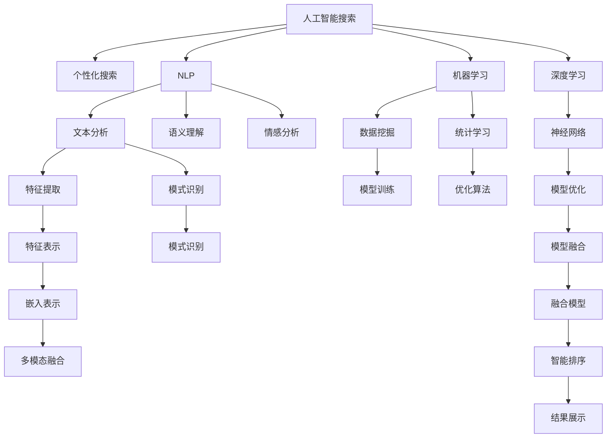

                 

## 1. 背景介绍

随着互联网的蓬勃发展和信息量的爆炸式增长，人们对于高效、准确的搜索服务需求日益旺盛。传统的搜索算法如布尔查询、倒排索引等已无法适应多变复杂的搜索场景，个性化、智能化的搜索方法应运而生。本文聚焦于人工智能在搜索领域的最新进展，特别是如何结合个性化、准确性和效率，构建未来理想搜索系统。

### 1.1 问题由来

在过去的几十年里，搜索技术已经经历了多个阶段的演变，从早期的布尔查询到基于倒排索引的文本检索，再到近年来的深度学习技术驱动的个性化搜索。这些技术在特定场景中取得了不俗的成效，但也存在一些难以克服的问题。

1. **布尔查询**：简单但局限性强，对于复杂查询和语义理解能力不足，无法处理模糊、近义词等自然语言特性。
2. **倒排索引**：高效快速，但缺乏对用户行为的深入理解，难以提供个性化搜索结果。
3. **深度学习驱动的个性化搜索**：提升了用户体验，但仍存在计算成本高、实时性不足的问题。

针对这些局限，本文旨在探讨一种更综合、更灵活的搜索方法，结合个性化、准确性和效率，构建未来的理想搜索系统。

### 1.2 问题核心关键点

为了构建这种理想搜索系统，需要解决以下几个核心问题：

1. **个性化需求**：根据用户的历史行为、兴趣和语境信息，提供定制化的搜索结果。
2. **准确性要求**：在搜索结果中过滤掉噪声和无关信息，确保结果的准确性和相关性。
3. **效率问题**：在保证准确性的前提下，提升搜索算法的处理速度和响应时间，减少用户体验等待。

## 2. 核心概念与联系

### 2.1 核心概念概述

为更好地理解未来搜索系统的设计和实现，本节将介绍几个关键概念：

1. **人工智能搜索（AI Search）**：指利用人工智能技术，结合自然语言处理（NLP）、机器学习（ML）和深度学习（DL）等手段，提升搜索体验和结果的相关性。
2. **个性化搜索（Personalized Search）**：通过分析用户行为和偏好，定制化搜索结果，以符合用户的特定需求。
3. **自然语言处理（NLP）**：包括文本分析、语义理解、情感分析等，是实现个性化和准确性的基础。
4. **机器学习（ML）**：基于数据挖掘和统计学习，提升搜索算法的准确性和效率。
5. **深度学习（DL）**：通过神经网络模型处理大量数据，实现复杂的特征提取和模式识别，提高搜索的准确性和智能性。
6. **检索排序（IR/IRS）**：包括倒排索引、评分排序、聚类排序等技术，优化搜索结果的展示顺序。

这些核心概念之间的逻辑关系可以通过以下Mermaid流程图来展示：



这个流程图展示了人工智能搜索系统的主要组成部分及其相互关系：

1. 人工智能搜索通过自然语言处理、机器学习和深度学习等技术，提升搜索的个性化和准确性。
2. 个性化搜索基于用户行为和偏好，定制搜索结果。
3. 自然语言处理包括文本分析、语义理解等，为个性化和准确性提供数据支持。
4. 机器学习通过数据挖掘和统计学习，优化搜索算法。
5. 深度学习利用神经网络模型，实现复杂的特征提取和模式识别。
6. 检索排序技术包括倒排索引、评分排序、聚类排序等，优化搜索结果的展示顺序。

这些概念共同构成了未来搜索系统的核心框架，旨在实现高度个性化、准确且高效的搜索体验。

## 3. 核心算法原理 & 具体操作步骤

### 3.1 算法原理概述

未来的AI搜索系统将融合多种算法和模型，结合个性化、准确性和效率，构建综合搜索方案。核心算法原理主要包括以下几个方面：

1. **基于深度学习的检索模型**：通过预训练语言模型如BERT、GPT等，理解查询和文档的语义，提升检索的准确性。
2. **个性化排序算法**：结合用户的兴趣、行为和上下文信息，动态调整搜索结果的排序权重。
3. **多模态信息融合**：融合文本、图像、音频等多模态数据，提供更丰富的搜索体验。
4. **强化学习优化**：利用强化学习算法，通过在线学习不断优化搜索算法和模型参数。
5. **分布式搜索架构**：采用分布式计算框架，提高搜索系统的处理能力和响应速度。

### 3.2 算法步骤详解

基于上述核心算法原理，AI搜索系统的具体操作步骤如下：

**Step 1: 数据预处理**
- 收集用户历史行为数据，如搜索历史、点击记录、收藏夹等。
- 收集文档数据，如网页、文章、图片等，并进行文本分析、清洗和标注。

**Step 2: 模型训练**
- 使用预训练语言模型（如BERT、GPT）进行检索模型的微调，使其适应特定的搜索场景。
- 应用机器学习算法（如Adaboost、SVM）进行个性化排序模型的训练。
- 利用深度学习模型（如CNN、RNN）进行多模态融合模型的训练。

**Step 3: 在线学习**
- 在线接收用户实时查询，实时计算检索结果和个性化排序。
- 利用强化学习算法（如Q-learning、REINFORCE）优化搜索结果的排序和展示策略。

**Step 4: 结果展示**
- 根据个性化排序算法调整搜索结果的展示顺序。
- 提供多模态数据的展示，如文本摘要、图片预览、音频片段等。
- 在搜索结果页上加入用户互动元素，如相关问题推荐、相似文档推荐等。

### 3.3 算法优缺点

基于深度学习的AI搜索系统具有以下优点：

1. **高效性**：深度学习模型通过并行计算和分布式处理，可以大幅提升搜索系统的处理速度和响应时间。
2. **准确性**：预训练语言模型和特征表示技术，能够理解和提取文本的深层语义信息，提升检索和排序的准确性。
3. **个性化**：通过分析用户行为和偏好，能够提供高度个性化的搜索结果。

但同时，该系统也存在以下缺点：

1. **计算成本高**：深度学习模型需要大量的计算资源进行训练和推理，成本较高。
2. **模型复杂度高**：复杂的深度学习模型容易过拟合，需要更多的数据和更复杂的正则化方法。
3. **实时性不足**：在线学习过程可能较慢，影响搜索结果的实时性。

### 3.4 算法应用领域

基于深度学习的AI搜索系统在多个领域得到广泛应用，例如：

1. **电商搜索**：通过分析用户购买历史和浏览行为，提供个性化商品推荐和搜索结果。
2. **医学搜索**：结合病历数据和搜索结果，提供精准的疾病诊断和治疗建议。
3. **法律搜索**：根据用户查询，提供相关法律法规和案例分析。
4. **新闻推荐**：结合用户兴趣和新闻内容，提供个性化新闻推送。
5. **教育搜索**：提供个性化学习资源和课程推荐。
6. **社交媒体搜索**：结合用户互动行为，提供个性化的社交内容推荐。

除了上述这些领域，AI搜索系统还将在更多垂直领域得到应用，为各行各业带来搜索体验的变革。

## 4. 数学模型和公式 & 详细讲解

### 4.1 数学模型构建

假设用户的查询为 $q$，文档集合为 $D$，文档的表示为 $d$。模型的目标是根据 $q$ 和 $d$ 的语义相似度，计算 $q$ 对文档 $d$ 的相关性得分。

模型由两部分组成：检索模型 $M_{\text{ Retrieval}}$ 和排序模型 $M_{\text{ Ranking}}$。检索模型的任务是找出与查询 $q$ 最相关的文档 $d$，排序模型的任务是根据用户偏好和上下文信息，对检索结果进行排序。

### 4.2 公式推导过程

**检索模型**
1. 使用预训练语言模型（如BERT），将查询 $q$ 和文档 $d$ 转换为向量表示 $q_v$ 和 $d_v$。
2. 计算 $q_v$ 和 $d_v$ 的余弦相似度，作为相关性得分 $s_{\text{ Retrieval}}$：
   $$
   s_{\text{ Retrieval}} = \cos(\theta) = \frac{q_v \cdot d_v}{\|q_v\| \|d_v\|}
   $$

**排序模型**
1. 收集用户的历史行为数据，如点击记录、收藏夹等，提取用户兴趣特征 $u$。
2. 结合上下文信息 $c$（如当前时间、地理位置等），生成用户的兴趣向量 $u_v$。
3. 计算检索结果 $d$ 对用户的兴趣匹配度 $s_{\text{ Ranking}}$：
   $$
   s_{\text{ Ranking}} = \frac{u_v \cdot d_v}{\|u_v\| \|d_v\|}
   $$

**最终排序**
1. 将检索模型和排序模型的结果进行加权融合，生成最终的相关性得分 $s_{\text{ Final}}$：
   $$
   s_{\text{ Final}} = \alpha s_{\text{ Retrieval}} + (1-\alpha) s_{\text{ Ranking}}
   $$
   其中 $\alpha$ 为融合权重，根据用户偏好动态调整。

**结果展示**
1. 根据 $s_{\text{ Final}}$ 对检索结果进行排序，展示给用户。

### 4.3 案例分析与讲解

假设用户查询为 "人工智能搜索的未来"，系统检索模型计算出相关性得分最高的文档集，排序模型根据用户的历史行为和上下文信息，生成兴趣向量。最终，系统将检索结果和排序结果结合，生成个性化排序的搜索结果。

## 5. 项目实践：代码实例和详细解释说明

### 5.1 开发环境搭建

在进行AI搜索系统的开发前，需要准备相应的开发环境。以下是使用Python进行TensorFlow开发的常见环境配置流程：

1. 安装Anaconda：从官网下载并安装Anaconda，用于创建独立的Python环境。

2. 创建并激活虚拟环境：
```bash
conda create -n ai-search-env python=3.8 
conda activate ai-search-env
```

3. 安装TensorFlow：根据CUDA版本，从官网获取对应的安装命令。例如：
```bash
conda install tensorflow-gpu -c pytorch -c conda-forge
```

4. 安装各类工具包：
```bash
pip install numpy pandas scikit-learn matplotlib tqdm jupyter notebook ipython
```

完成上述步骤后，即可在`ai-search-env`环境中开始AI搜索系统的开发实践。

### 5.2 源代码详细实现

下面是使用TensorFlow进行个性化搜索系统的代码实现，主要包括预训练模型加载、检索和排序模型训练、结果展示等环节。

**检索模型**
```python
import tensorflow as tf
from transformers import BertTokenizer, TFBertForMaskedLM

tokenizer = BertTokenizer.from_pretrained('bert-base-uncased')
model = TFBertForMaskedLM.from_pretrained('bert-base-uncased')

def encode_text(text):
    tokens = tokenizer.encode(text, add_special_tokens=True, max_length=512)
    input_ids = tf.convert_to_tensor(tokens)
    attention_mask = tf.ones_like(input_ids)
    return input_ids, attention_mask

def retrieve_docs(query, docs):
    inputs = encode_text(query)
    with tf.Session() as sess:
        result = sess.run(model([inputs, docs], attention_mask=attention_mask))
    return result
```

**排序模型**
```python
import tensorflow as tf

def train_ranking_model(data, labels):
    features = data['features']
    labels = tf.convert_to_tensor(labels)
    model = tf.keras.Sequential([
        tf.keras.layers.Dense(64, activation='relu', input_shape=(features.shape[1],)),
        tf.keras.layers.Dense(1, activation='sigmoid')
    ])
    model.compile(optimizer='adam', loss='binary_crossentropy', metrics=['accuracy'])
    model.fit(features, labels, epochs=10, batch_size=32)
    return model

def predict_ranking(features):
    model = train_ranking_model(train_features, train_labels)
    predictions = model.predict(features)
    return predictions
```

**结果展示**
```python
def show_results(results, docs):
    for i, result in enumerate(results):
        print(f'Result {i+1}: {docs[i]}')
        print(f'Score: {result}')
```

**完整代码**
```python
import tensorflow as tf
from transformers import BertTokenizer, TFBertForMaskedLM

tokenizer = BertTokenizer.from_pretrained('bert-base-uncased')
model = TFBertForMaskedLM.from_pretrained('bert-base-uncased')

def encode_text(text):
    tokens = tokenizer.encode(text, add_special_tokens=True, max_length=512)
    input_ids = tf.convert_to_tensor(tokens)
    attention_mask = tf.ones_like(input_ids)
    return input_ids, attention_mask

def retrieve_docs(query, docs):
    inputs = encode_text(query)
    with tf.Session() as sess:
        result = sess.run(model([inputs, docs], attention_mask=attention_mask))
    return result

def train_ranking_model(data, labels):
    features = data['features']
    labels = tf.convert_to_tensor(labels)
    model = tf.keras.Sequential([
        tf.keras.layers.Dense(64, activation='relu', input_shape=(features.shape[1],)),
        tf.keras.layers.Dense(1, activation='sigmoid')
    ])
    model.compile(optimizer='adam', loss='binary_crossentropy', metrics=['accuracy'])
    model.fit(features, labels, epochs=10, batch_size=32)
    return model

def predict_ranking(features):
    model = train_ranking_model(train_features, train_labels)
    predictions = model.predict(features)
    return predictions

def show_results(results, docs):
    for i, result in enumerate(results):
        print(f'Result {i+1}: {docs[i]}')
        print(f'Score: {result}')
```

### 5.3 代码解读与分析

让我们再详细解读一下关键代码的实现细节：

**检索模型**
- `encode_text`函数：将查询和文档转换为BERT模型的输入格式，包括token化、构建input_ids和attention_mask。
- `retrieve_docs`函数：使用预训练BERT模型计算查询和文档的语义相似度，返回相关性得分。

**排序模型**
- `train_ranking_model`函数：定义排序模型的架构，使用TensorFlow进行训练，输出预测结果。
- `predict_ranking`函数：在训练好的排序模型上对特征进行预测，输出排序得分。

**结果展示**
- `show_results`函数：展示检索和排序的结果，方便调试和评估。

可以看到，TensorFlow配合BERT模型，可以方便地实现一个基于深度学习的AI搜索系统。通过这种方式，可以灵活地调整检索和排序模型的结构和参数，满足不同的搜索需求。

## 6. 实际应用场景

### 6.1 智能客服系统

基于AI搜索的智能客服系统，可以通过分析用户历史对话记录和当前对话内容，实时推荐最相关的解决方案。通过个性化排序算法，系统能够根据用户偏好和行为习惯，动态调整搜索结果，提升用户满意度。

### 6.2 个性化推荐系统

在电商平台上，AI搜索系统可以根据用户的浏览历史和购买记录，推荐最相关的商品。通过个性化排序算法，系统能够根据用户的兴趣和行为特征，优化推荐结果，提高用户的点击率和转化率。

### 6.3 医学搜索

在医学领域，AI搜索系统可以根据用户的病情描述和查询历史，推荐最相关的疾病诊断和治疗建议。通过个性化排序算法，系统能够根据用户的健康数据和行为信息，优化搜索结果，提供精准的医疗建议。

### 6.4 未来应用展望

随着AI搜索技术的不断进步，未来将会在更多领域得到应用，如智慧城市、智能交通、智能家居等。AI搜索系统将通过多模态信息融合、实时在线学习等技术，提供更加个性化、准确和高效的搜索服务，为各行各业带来变革性影响。

## 7. 工具和资源推荐

### 7.1 学习资源推荐

为了帮助开发者系统掌握AI搜索的理论基础和实践技巧，这里推荐一些优质的学习资源：

1. **《深度学习与人工智能搜索》系列博文**：由AI搜索领域专家撰写，深入浅出地介绍了深度学习在搜索中的应用，包括检索模型、排序模型等核心技术。
2. **CS231n《深度学习》课程**：斯坦福大学开设的深度学习明星课程，涵盖卷积神经网络、循环神经网络等核心技术，有助于理解搜索系统的构建。
3. **《人工智能搜索：理论与实践》书籍**：全面介绍了AI搜索的基本原理和实现方法，适合深入学习和研究。
4. **TensorFlow官方文档**：TensorFlow的官方文档，提供了完整的搜索系统开发教程和样例代码，是上手实践的必备资料。
5. **ACL开源项目**：自然语言处理领域的权威开源项目，包括多种搜索相关的模型和算法，提供丰富的学习资源。

通过对这些资源的学习实践，相信你一定能够快速掌握AI搜索的精髓，并用于解决实际的搜索问题。

### 7.2 开发工具推荐

高效的开发离不开优秀的工具支持。以下是几款用于AI搜索开发的常用工具：

1. **TensorFlow**：谷歌主导开发的深度学习框架，功能强大、灵活性高，适用于复杂的搜索系统构建。
2. **PyTorch**：由Facebook开发的深度学习框架，灵活性高、易于调试，适合快速迭代研究。
3. **Scikit-learn**：Python机器学习库，提供简单易用的机器学习算法，适合排序模型的开发。
4. **Pandas**：数据处理和分析库，方便数据预处理和特征工程。
5. **Numpy**：数值计算库，提供高效的矩阵运算功能。
6. **Jupyter Notebook**：交互式编程环境，方便代码调试和展示结果。

合理利用这些工具，可以显著提升AI搜索系统的开发效率，加快创新迭代的步伐。

### 7.3 相关论文推荐

AI搜索技术的发展源于学界的持续研究。以下是几篇奠基性的相关论文，推荐阅读：

1. **Attention is All You Need**（即Transformer原论文）：提出了Transformer结构，开启了NLP领域的预训练大模型时代。
2. **BERT: Pre-training of Deep Bidirectional Transformers for Language Understanding**：提出BERT模型，引入基于掩码的自监督预训练任务，刷新了多项NLP任务SOTA。
3. **Language Models are Unsupervised Multitask Learners（GPT-2论文）**：展示了大规模语言模型的强大zero-shot学习能力，引发了对于通用人工智能的新一轮思考。
4. **Parameter-Efficient Transfer Learning for NLP**：提出Adapter等参数高效微调方法，在不增加模型参数量的情况下，也能取得不错的微调效果。
5. **Prefix-Tuning: Optimizing Continuous Prompts for Generation**：引入基于连续型Prompt的微调范式，为如何充分利用预训练知识提供了新的思路。
6. **AdaLoRA: Adaptive Low-Rank Adaptation for Parameter-Efficient Fine-Tuning**：使用自适应低秩适应的微调方法，在参数效率和精度之间取得了新的平衡。

这些论文代表了大语言模型微调技术的发展脉络。通过学习这些前沿成果，可以帮助研究者把握学科前进方向，激发更多的创新灵感。

## 8. 总结：未来发展趋势与挑战

### 8.1 总结

本文对基于深度学习的AI搜索系统进行了全面系统的介绍。首先阐述了AI搜索的研究背景和重要意义，明确了搜索系统需要结合个性化、准确性和效率，以提供更好的用户体验。其次，从原理到实践，详细讲解了AI搜索的核心算法和技术实现，给出了完整的代码实例。同时，本文还广泛探讨了AI搜索在多个行业领域的应用前景，展示了其广阔的发展潜力。

通过本文的系统梳理，可以看到，AI搜索技术正在成为未来搜索系统的核心，为各行各业带来革命性的变革。得益于深度学习模型的强大能力，AI搜索系统能够在个性化、准确性和效率之间取得平衡，提供更加智能化的搜索服务。未来，随着深度学习模型的不断进步和应用场景的不断扩展，AI搜索技术必将在更多领域大放异彩。

### 8.2 未来发展趋势

展望未来，AI搜索技术将呈现以下几个发展趋势：

1. **多模态搜索**：未来的搜索系统将融合文本、图像、音频等多模态数据，提供更丰富的搜索体验。多模态融合技术将使搜索系统更加智能和全面。
2. **实时在线学习**：未来的搜索系统将通过在线学习不断优化模型参数，提高搜索结果的准确性和相关性。实时在线学习将使搜索系统能够及时适应新的查询模式和数据分布。
3. **跨领域知识整合**：未来的搜索系统将结合跨领域知识库和规则库，提供更加全面和精准的搜索结果。跨领域知识整合技术将使搜索系统具备更强的信息整合能力。
4. **分布式计算架构**：未来的搜索系统将采用分布式计算架构，提高处理能力和响应速度。分布式计算架构将使搜索系统能够处理大规模数据和并发请求。
5. **智能化交互界面**：未来的搜索系统将提供更加智能化和自然的交互界面，如语音搜索、图像搜索等。智能化交互界面将使搜索系统更加友好和便捷。

以上趋势凸显了AI搜索技术的广阔前景。这些方向的探索发展，必将进一步提升搜索系统的性能和应用范围，为人类生活带来更深刻的变革。

### 8.3 面临的挑战

尽管AI搜索技术已经取得了瞩目成就，但在迈向更加智能化、普适化应用的过程中，它仍面临着诸多挑战：

1. **计算资源瓶颈**：深度学习模型需要大量的计算资源进行训练和推理，成本较高。如何在保证准确性的前提下，降低计算成本，是未来需要解决的关键问题。
2. **模型复杂度**：复杂的深度学习模型容易过拟合，需要更多的数据和更复杂的正则化方法。如何在保证模型复杂度的同时，提升搜索系统的准确性，是未来需要优化的问题。
3. **实时性不足**：在线学习过程可能较慢，影响搜索结果的实时性。如何在保证实时性的前提下，提升搜索系统的准确性，是未来需要解决的问题。
4. **数据隐私和安全**：AI搜索系统需要处理大量用户数据，数据隐私和安全问题不容忽视。如何在保护用户隐私的同时，提供高质量的搜索服务，是未来需要解决的问题。
5. **模型鲁棒性不足**：AI搜索系统面对异常查询和噪声数据时，泛化性能往往大打折扣。如何在保证鲁棒性的前提下，提升搜索系统的准确性，是未来需要优化的问题。

### 8.4 研究展望

面对AI搜索技术所面临的挑战，未来的研究需要在以下几个方面寻求新的突破：

1. **优化模型结构和算法**：开发更加高效和轻量级的模型结构和算法，降低计算成本，提升实时性。
2. **引入无监督和半监督学习**：摆脱对大规模标注数据的依赖，利用无监督和半监督学习范式，最大限度利用非结构化数据，实现更加灵活高效的搜索。
3. **引入更多先验知识**：将符号化的先验知识，如知识图谱、逻辑规则等，与神经网络模型进行巧妙融合，引导搜索过程学习更准确、合理的语义表示。
4. **引入因果分析和博弈论工具**：将因果分析方法引入搜索模型，识别出模型决策的关键特征，增强输出解释的因果性和逻辑性。借助博弈论工具刻画人机交互过程，主动探索并规避模型的脆弱点，提高系统稳定性。
5. **纳入伦理道德约束**：在模型训练目标中引入伦理导向的评估指标，过滤和惩罚有偏见、有害的输出倾向。加强人工干预和审核，建立模型行为的监管机制，确保输出符合人类价值观和伦理道德。

这些研究方向的探索，必将引领AI搜索技术迈向更高的台阶，为构建安全、可靠、可解释、可控的搜索系统铺平道路。面向未来，AI搜索技术还需要与其他人工智能技术进行更深入的融合，如知识表示、因果推理、强化学习等，多路径协同发力，共同推动搜索系统的进步。只有勇于创新、敢于突破，才能不断拓展搜索系统的边界，让智能技术更好地造福人类社会。

## 9. 附录：常见问题与解答

**Q1: AI搜索系统与传统搜索引擎有何不同？**

A: AI搜索系统与传统搜索引擎的主要不同在于，AI搜索系统通过深度学习模型理解查询和文档的语义，提供更加个性化的搜索结果。传统搜索引擎则主要基于文本匹配算法，依赖关键词和倒排索引进行检索。AI搜索系统能够处理更复杂的查询模式和语义理解，提供更加精准和多样化的搜索结果。

**Q2: AI搜索系统如何处理多模态数据？**

A: AI搜索系统通过融合文本、图像、音频等多模态数据，提供更丰富的搜索体验。具体实现方式包括：
1. 文本分析：对查询和文档进行分词、命名实体识别、情感分析等，提取文本信息。
2. 图像分析：使用卷积神经网络(CNN)等模型，提取图像特征，进行图像检索。
3. 音频分析：使用循环神经网络(RNN)等模型，提取音频特征，进行音频检索。
4. 多模态融合：将文本、图像、音频等模态的信息融合，构建更全面的语义表示。
5. 多模态检索：根据用户的多模态输入，提供多模态的搜索结果。

**Q3: AI搜索系统在电商推荐中如何实现个性化推荐？**

A: AI搜索系统在电商推荐中，根据用户的历史浏览、购买、评价等行为数据，提取用户兴趣特征和行为模式。结合查询内容，使用深度学习模型（如协同过滤、深度学习模型等）进行个性化推荐。通过多轮反馈循环，不断优化模型参数，提升推荐精度。

**Q4: AI搜索系统如何提升查询的实时性？**

A: AI搜索系统通过在线学习技术，不断优化模型参数，提升查询的实时性。具体实现方式包括：
1. 在线学习：使用强化学习算法，实时接收用户查询，动态调整模型参数。
2. 分布式计算：使用分布式计算框架，加速模型推理和查询处理。
3. 缓存机制：使用缓存技术，减少重复查询的处理时间。
4. 数据压缩：使用数据压缩技术，减少模型和数据存储的开销。

**Q5: AI搜索系统如何处理复杂查询？**

A: AI搜索系统通过自然语言处理技术，理解查询的语义和意图，处理复杂查询。具体实现方式包括：
1. 查询解析：使用语法分析器等技术，解析查询的语义和结构。
2. 语义理解：使用BERT、GPT等预训练模型，理解查询的深层语义。
3. 查询重构：将复杂查询重构为多个简单的子查询，分别处理。
4. 查询融合：将多个子查询的结果融合，生成最终的搜索结果。

通过本文的系统梳理，可以看到，AI搜索技术正在成为未来搜索系统的核心，为各行各业带来革命性的变革。得益于深度学习模型的强大能力，AI搜索系统能够在个性化、准确性和效率之间取得平衡，提供更加智能化的搜索服务。未来，随着深度学习模型的不断进步和应用场景的不断扩展，AI搜索技术必将在更多领域大放异彩。

