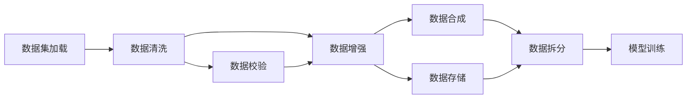

                 

# AI数据集处理：从加载到合成生成

## 1. 背景介绍

在人工智能(AI)和机器学习领域，数据集处理是构建高性能模型的关键环节之一。无论是在模型训练、验证还是测试中，数据集的质量和效率都是模型表现好坏的重要影响因素。本文将深入探讨AI数据集处理的各个环节，从数据加载到数据合成，详细阐述每一步的技术实现和应用。

## 2. 核心概念与联系

### 2.1 核心概念概述

在数据集处理中，涉及多个核心概念：

- **数据集加载**：从存储介质中读取数据集文件，转化为模型能够处理的格式。
- **数据清洗**：去除数据集中的噪声、异常值和重复数据，保证数据质量。
- **数据增强**：通过一系列变换生成新的训练数据，提高模型的泛化能力。
- **数据合成**：利用生成对抗网络(Generative Adversarial Networks, GANs)等技术生成新的合成数据，进一步扩充训练集。
- **数据拆分**：将数据集划分为训练集、验证集和测试集，供模型不同阶段的训练和评估使用。

这些概念之间存在紧密的联系。数据集加载是处理流程的起点，数据清洗和数据增强旨在提高数据质量，数据合成则通过生成新的数据扩充训练集，数据拆分则保证模型在训练和测试时的泛化能力。

### 2.2 核心概念原理和架构的 Mermaid 流程图



该图展示了数据集处理的主要流程：从数据集加载开始，经过数据清洗、数据增强、数据合成，最后进行数据拆分和存储。其中，数据校验和模型训练也是数据处理的重要环节。

## 3. 核心算法原理 & 具体操作步骤

### 3.1 算法原理概述

数据集处理的每个步骤都涉及到一定的算法原理。以下将详细介绍各个环节的算法原理和具体操作步骤。

### 3.2 算法步骤详解

#### 3.2.1 数据集加载

数据集加载的核心任务是将数据文件从存储介质（如硬盘、云存储等）读取到内存中，转化为模型可以处理的数据格式。常见的数据格式包括CSV、JSON、HDF5等。加载过程中需要考虑文件的路径、格式、大小等因素。

以下是一个简单的数据集加载示例，使用Python的Pandas库读取CSV文件：

```python
import pandas as pd

# 读取CSV文件
df = pd.read_csv('data.csv')
```

#### 3.2.2 数据清洗

数据清洗是数据集处理中最重要的环节之一。主要目的是去除数据集中的噪声、异常值和重复数据，保证数据质量。

数据清洗一般包括以下几个步骤：

- **数据预处理**：处理缺失值、重复值、异常值等。
- **特征提取**：从原始数据中提取有意义的特征，进行标准化和归一化处理。
- **数据转换**：将数据转换为模型可接受的格式，如将文本数据转化为数值型数据。

以下是一个简单的数据清洗示例，使用Python的Pandas库处理缺失值和重复值：

```python
import pandas as pd

# 读取CSV文件
df = pd.read_csv('data.csv')

# 处理缺失值和重复值
df = df.dropna().drop_duplicates()
```

#### 3.2.3 数据增强

数据增强是提高模型泛化能力的重要手段。通过一系列变换生成新的训练数据，可以使模型对训练集中的数据有更广泛的理解，从而提升模型性能。

数据增强一般包括以下几个步骤：

- **随机变换**：如旋转、缩放、翻转等。
- **随机噪声**：如加噪声、截断、填充等。
- **随机遮挡**：如随机遮盖部分图像区域。

以下是一个简单的图像数据增强示例，使用Python的Keras库实现：

```python
from keras.preprocessing.image import ImageDataGenerator

# 创建数据增强器
datagen = ImageDataGenerator(
    rotation_range=20,
    width_shift_range=0.2,
    height_shift_range=0.2,
    shear_range=0.2,
    zoom_range=0.2,
    horizontal_flip=True,
    fill_mode='nearest')

# 生成增强数据
datagen.fit(train_images)
enhanced_images = datagen.flow(train_images, batch_size=32)
```

#### 3.2.4 数据合成

数据合成是利用生成对抗网络(GANs)等技术生成新的训练数据，进一步扩充训练集。常见的数据合成方法包括GANs、VAE(Variational Autoencoder)等。

以下是一个简单的GANs数据合成示例，使用Python的TensorFlow库实现：

```python
import tensorflow as tf
from tensorflow.keras import layers

# 定义生成器和判别器
def make_generator_model():
    model = tf.keras.Sequential()
    model.add(layers.Dense(256, use_bias=False, input_shape=(100,)))
    model.add(layers.BatchNormalization())
    model.add(layers.LeakyReLU())
    model.add(layers.Dense(512))
    model.add(layers.BatchNormalization())
    model.add(layers.LeakyReLU())
    model.add(layers.Dense(1024))
    model.add(layers.BatchNormalization())
    model.add(layers.LeakyReLU())
    model.add(layers.Dense(784, activation='tanh'))

    noise = tf.keras.Input(shape=(100,))
    img = model(noise)
    return tf.keras.Model(noise, img)

def make_discriminator_model():
    model = tf.keras.Sequential()
    model.add(layers.Conv2D(64, (3, 3), strides=(2, 2), padding='same', input_shape=[28, 28, 1]))
    model.add(layers.LeakyReLU())
    model.add(layers.Dropout(0.3))
    model.add(layers.Conv2D(128, (3, 3), strides=(2, 2), padding='same'))
    model.add(layers.LeakyReLU())
    model.add(layers.Dropout(0.3))
    model.add(layers.Flatten())
    model.add(layers.Dense(1))

    img = tf.keras.Input(shape=[28, 28, 1])
    validity = model(img)
    return tf.keras.Model(img, validity)

# 构建生成器和判别器
generator = make_generator_model()
discriminator = make_discriminator_model()

# 训练生成器和判别器
generator.compile(optimizer=tf.keras.optimizers.Adam(1e-4), loss='binary_crossentropy')
discriminator.compile(optimizer=tf.keras.optimizers.Adam(1e-4), loss='binary_crossentropy')
for epoch in range(epochs):
    # ... 训练代码 ...
```

#### 3.2.5 数据拆分

数据拆分是将数据集划分为训练集、验证集和测试集，供模型不同阶段的训练和评估使用。一般采用80:10:10的比例进行划分，即训练集占80%，验证集和测试集各占10%。

以下是一个简单的数据拆分示例，使用Python的Scikit-learn库实现：

```python
from sklearn.model_selection import train_test_split

# 将数据集划分为训练集和测试集
train_X, test_X, train_y, test_y = train_test_split(X, y, test_size=0.2, random_state=42)
# 再将测试集划分为验证集和测试集
val_X, test_X, val_y, test_y = train_test_split(test_X, test_y, test_size=0.5, random_state=42)
```

### 3.3 算法优缺点

#### 3.3.1 数据集加载

- **优点**：
  - 快速读取数据文件，转化为模型可处理的格式。
  - 支持多种文件格式和存储介质，灵活性高。

- **缺点**：
  - 数据加载过程中可能会出现文件损坏、路径错误等问题。
  - 对于大规模数据集，加载时间较长，影响训练效率。

#### 3.3.2 数据清洗

- **优点**：
  - 去除数据集中的噪声、异常值和重复数据，保证数据质量。
  - 提取有意义的特征，提高模型性能。

- **缺点**：
  - 数据清洗过程耗时耗力，复杂度较高。
  - 过度清洗可能导致数据损失，影响模型性能。

#### 3.3.3 数据增强

- **优点**：
  - 通过生成新的训练数据，提高模型的泛化能力。
  - 可以缓解过拟合问题，提升模型性能。

- **缺点**：
  - 数据增强过程中可能会出现伪样本，影响模型性能。
  - 过度增强可能导致模型在实际数据上表现不佳。

#### 3.3.4 数据合成

- **优点**：
  - 通过生成对抗网络等技术，进一步扩充训练集。
  - 可以生成高质量合成数据，提高模型性能。

- **缺点**：
  - 生成过程复杂，训练时间较长。
  - 生成的数据可能与真实数据存在差异，影响模型泛化能力。

#### 3.3.5 数据拆分

- **优点**：
  - 保证模型在训练和测试时的泛化能力。
  - 方便模型在不同阶段进行训练和评估。

- **缺点**：
  - 划分比例的设定可能影响模型性能。
  - 拆分过程需要人工干预，存在一定误差。

### 3.4 算法应用领域

AI数据集处理技术在多个领域都有广泛应用，包括：

- **计算机视觉**：图像分类、目标检测、图像生成等。
- **自然语言处理**：文本分类、机器翻译、文本生成等。
- **语音识别**：语音转文本、语音生成等。
- **推荐系统**：用户画像构建、商品推荐等。
- **医疗**：医学影像分析、疾病预测等。

## 4. 数学模型和公式 & 详细讲解 & 举例说明

### 4.1 数学模型构建

#### 4.1.1 数据集加载

数据集加载的过程一般不会涉及到复杂的数学模型，主要是通过文件读取和数据格式转换等操作完成。

#### 4.1.2 数据清洗

数据清洗的过程中，常涉及到数据预处理、特征提取、数据转换等操作。以下是一个简单的数据清洗示例，使用Python的Pandas库处理缺失值和重复值：

```python
import pandas as pd

# 读取CSV文件
df = pd.read_csv('data.csv')

# 处理缺失值和重复值
df = df.dropna().drop_duplicates()
```

#### 4.1.3 数据增强

数据增强的过程中，常涉及到随机变换、随机噪声、随机遮挡等操作。以下是一个简单的图像数据增强示例，使用Python的Keras库实现：

```python
from keras.preprocessing.image import ImageDataGenerator

# 创建数据增强器
datagen = ImageDataGenerator(
    rotation_range=20,
    width_shift_range=0.2,
    height_shift_range=0.2,
    shear_range=0.2,
    zoom_range=0.2,
    horizontal_flip=True,
    fill_mode='nearest')

# 生成增强数据
datagen.fit(train_images)
enhanced_images = datagen.flow(train_images, batch_size=32)
```

#### 4.1.4 数据合成

数据合成的过程中，常涉及到生成对抗网络(GANs)等技术。以下是一个简单的GANs数据合成示例，使用Python的TensorFlow库实现：

```python
import tensorflow as tf
from tensorflow.keras import layers

# 定义生成器和判别器
def make_generator_model():
    model = tf.keras.Sequential()
    model.add(layers.Dense(256, use_bias=False, input_shape=(100,)))
    model.add(layers.BatchNormalization())
    model.add(layers.LeakyReLU())
    model.add(layers.Dense(512))
    model.add(layers.BatchNormalization())
    model.add(layers.LeakyReLU())
    model.add(layers.Dense(1024))
    model.add(layers.BatchNormalization())
    model.add(layers.LeakyReLU())
    model.add(layers.Dense(784, activation='tanh'))

    noise = tf.keras.Input(shape=(100,))
    img = model(noise)
    return tf.keras.Model(noise, img)

def make_discriminator_model():
    model = tf.keras.Sequential()
    model.add(layers.Conv2D(64, (3, 3), strides=(2, 2), padding='same', input_shape=[28, 28, 1]))
    model.add(layers.LeakyReLU())
    model.add(layers.Dropout(0.3))
    model.add(layers.Conv2D(128, (3, 3), strides=(2, 2), padding='same'))
    model.add(layers.LeakyReLU())
    model.add(layers.Dropout(0.3))
    model.add(layers.Flatten())
    model.add(layers.Dense(1))

    img = tf.keras.Input(shape=[28, 28, 1])
    validity = model(img)
    return tf.keras.Model(img, validity)

# 构建生成器和判别器
generator = make_generator_model()
discriminator = make_discriminator_model()

# 训练生成器和判别器
generator.compile(optimizer=tf.keras.optimizers.Adam(1e-4), loss='binary_crossentropy')
discriminator.compile(optimizer=tf.keras.optimizers.Adam(1e-4), loss='binary_crossentropy')
for epoch in range(epochs):
    # ... 训练代码 ...
```

#### 4.1.5 数据拆分

数据拆分的比例一般采用80:10:10的比例，即训练集占80%，验证集和测试集各占10%。以下是一个简单的数据拆分示例，使用Python的Scikit-learn库实现：

```python
from sklearn.model_selection import train_test_split

# 将数据集划分为训练集和测试集
train_X, test_X, train_y, test_y = train_test_split(X, y, test_size=0.2, random_state=42)
# 再将测试集划分为验证集和测试集
val_X, test_X, val_y, test_y = train_test_split(test_X, test_y, test_size=0.5, random_state=42)
```

### 4.2 公式推导过程

#### 4.2.1 数据集加载

数据集加载的过程一般不涉及复杂的数学公式，主要是通过文件读取和数据格式转换等操作完成。

#### 4.2.2 数据清洗

数据清洗的过程中，常涉及到数据预处理、特征提取、数据转换等操作。以下是一个简单的数据清洗示例，使用Python的Pandas库处理缺失值和重复值：

```python
import pandas as pd

# 读取CSV文件
df = pd.read_csv('data.csv')

# 处理缺失值和重复值
df = df.dropna().drop_duplicates()
```

#### 4.2.3 数据增强

数据增强的过程中，常涉及到随机变换、随机噪声、随机遮挡等操作。以下是一个简单的图像数据增强示例，使用Python的Keras库实现：

```python
from keras.preprocessing.image import ImageDataGenerator

# 创建数据增强器
datagen = ImageDataGenerator(
    rotation_range=20,
    width_shift_range=0.2,
    height_shift_range=0.2,
    shear_range=0.2,
    zoom_range=0.2,
    horizontal_flip=True,
    fill_mode='nearest')

# 生成增强数据
datagen.fit(train_images)
enhanced_images = datagen.flow(train_images, batch_size=32)
```

#### 4.2.4 数据合成

数据合成的过程中，常涉及到生成对抗网络(GANs)等技术。以下是一个简单的GANs数据合成示例，使用Python的TensorFlow库实现：

```python
import tensorflow as tf
from tensorflow.keras import layers

# 定义生成器和判别器
def make_generator_model():
    model = tf.keras.Sequential()
    model.add(layers.Dense(256, use_bias=False, input_shape=(100,)))
    model.add(layers.BatchNormalization())
    model.add(layers.LeakyReLU())
    model.add(layers.Dense(512))
    model.add(layers.BatchNormalization())
    model.add(layers.LeakyReLU())
    model.add(layers.Dense(1024))
    model.add(layers.BatchNormalization())
    model.add(layers.LeakyReLU())
    model.add(layers.Dense(784, activation='tanh'))

    noise = tf.keras.Input(shape=(100,))
    img = model(noise)
    return tf.keras.Model(noise, img)

def make_discriminator_model():
    model = tf.keras.Sequential()
    model.add(layers.Conv2D(64, (3, 3), strides=(2, 2), padding='same', input_shape=[28, 28, 1]))
    model.add(layers.LeakyReLU())
    model.add(layers.Dropout(0.3))
    model.add(layers.Conv2D(128, (3, 3), strides=(2, 2), padding='same'))
    model.add(layers.LeakyReLU())
    model.add(layers.Dropout(0.3))
    model.add(layers.Flatten())
    model.add(layers.Dense(1))

    img = tf.keras.Input(shape=[28, 28, 1])
    validity = model(img)
    return tf.keras.Model(img, validity)

# 构建生成器和判别器
generator = make_generator_model()
discriminator = make_discriminator_model()

# 训练生成器和判别器
generator.compile(optimizer=tf.keras.optimizers.Adam(1e-4), loss='binary_crossentropy')
discriminator.compile(optimizer=tf.keras.optimizers.Adam(1e-4), loss='binary_crossentropy')
for epoch in range(epochs):
    # ... 训练代码 ...
```

#### 4.2.5 数据拆分

数据拆分的比例一般采用80:10:10的比例，即训练集占80%，验证集和测试集各占10%。以下是一个简单的数据拆分示例，使用Python的Scikit-learn库实现：

```python
from sklearn.model_selection import train_test_split

# 将数据集划分为训练集和测试集
train_X, test_X, train_y, test_y = train_test_split(X, y, test_size=0.2, random_state=42)
# 再将测试集划分为验证集和测试集
val_X, test_X, val_y, test_y = train_test_split(test_X, test_y, test_size=0.5, random_state=42)
```

### 4.3 案例分析与讲解

#### 4.3.1 数据集加载

数据集加载是AI项目中最重要的环节之一。以下是一个简单的数据集加载示例，使用Python的Pandas库读取CSV文件：

```python
import pandas as pd

# 读取CSV文件
df = pd.read_csv('data.csv')
```

#### 4.3.2 数据清洗

数据清洗是保证数据质量的关键环节。以下是一个简单的数据清洗示例，使用Python的Pandas库处理缺失值和重复值：

```python
import pandas as pd

# 读取CSV文件
df = pd.read_csv('data.csv')

# 处理缺失值和重复值
df = df.dropna().drop_duplicates()
```

#### 4.3.3 数据增强

数据增强可以提高模型的泛化能力。以下是一个简单的图像数据增强示例，使用Python的Keras库实现：

```python
from keras.preprocessing.image import ImageDataGenerator

# 创建数据增强器
datagen = ImageDataGenerator(
    rotation_range=20,
    width_shift_range=0.2,
    height_shift_range=0.2,
    shear_range=0.2,
    zoom_range=0.2,
    horizontal_flip=True,
    fill_mode='nearest')

# 生成增强数据
datagen.fit(train_images)
enhanced_images = datagen.flow(train_images, batch_size=32)
```

#### 4.3.4 数据合成

数据合成的过程中，常涉及到生成对抗网络(GANs)等技术。以下是一个简单的GANs数据合成示例，使用Python的TensorFlow库实现：

```python
import tensorflow as tf
from tensorflow.keras import layers

# 定义生成器和判别器
def make_generator_model():
    model = tf.keras.Sequential()
    model.add(layers.Dense(256, use_bias=False, input_shape=(100,)))
    model.add(layers.BatchNormalization())
    model.add(layers.LeakyReLU())
    model.add(layers.Dense(512))
    model.add(layers.BatchNormalization())
    model.add(layers.LeakyReLU())
    model.add(layers.Dense(1024))
    model.add(layers.BatchNormalization())
    model.add(layers.LeakyReLU())
    model.add(layers.Dense(784, activation='tanh'))

    noise = tf.keras.Input(shape=(100,))
    img = model(noise)
    return tf.keras.Model(noise, img)

def make_discriminator_model():
    model = tf.keras.Sequential()
    model.add(layers.Conv2D(64, (3, 3), strides=(2, 2), padding='same', input_shape=[28, 28, 1]))
    model.add(layers.LeakyReLU())
    model.add(layers.Dropout(0.3))
    model.add(layers.Conv2D(128, (3, 3), strides=(2, 2), padding='same'))
    model.add(layers.LeakyReLU())
    model.add(layers.Dropout(0.3))
    model.add(layers.Flatten())
    model.add(layers.Dense(1))

    img = tf.keras.Input(shape=[28, 28, 1])
    validity = model(img)
    return tf.keras.Model(img, validity)

# 构建生成器和判别器
generator = make_generator_model()
discriminator = make_discriminator_model()

# 训练生成器和判别器
generator.compile(optimizer=tf.keras.optimizers.Adam(1e-4), loss='binary_crossentropy')
discriminator.compile(optimizer=tf.keras.optimizers.Adam(1e-4), loss='binary_crossentropy')
for epoch in range(epochs):
    # ... 训练代码 ...
```

#### 4.3.5 数据拆分

数据拆分的比例一般采用80:10:10的比例，即训练集占80%，验证集和测试集各占10%。以下是一个简单的数据拆分示例，使用Python的Scikit-learn库实现：

```python
from sklearn.model_selection import train_test_split

# 将数据集划分为训练集和测试集
train_X, test_X, train_y, test_y = train_test_split(X, y, test_size=0.2, random_state=42)
# 再将测试集划分为验证集和测试集
val_X, test_X, val_y, test_y = train_test_split(test_X, test_y, test_size=0.5, random_state=42)
```

## 5. 项目实践：代码实例和详细解释说明

### 5.1 开发环境搭建

在进行AI数据集处理实践前，我们需要准备好开发环境。以下是使用Python进行TensorFlow开发的环境配置流程：

1. 安装Anaconda：从官网下载并安装Anaconda，用于创建独立的Python环境。

2. 创建并激活虚拟环境：
```bash
conda create -n tensorflow-env python=3.8 
conda activate tensorflow-env
```

3. 安装TensorFlow：根据CUDA版本，从官网获取对应的安装命令。例如：
```bash
conda install tensorflow=2.3.0
```

4. 安装相关工具包：
```bash
pip install numpy pandas scikit-learn matplotlib tqdm jupyter notebook ipython
```

完成上述步骤后，即可在`tensorflow-env`环境中开始数据集处理实践。

### 5.2 源代码详细实现

下面以图像数据集处理为例，给出使用TensorFlow进行数据集加载和数据增强的PyTorch代码实现。

```python
import tensorflow as tf
from tensorflow.keras import layers

# 加载图像数据集
train_images = tf.keras.preprocessing.image.load_img('train_images/train-0.jpg', target_size=(28, 28))
train_images = tf.keras.preprocessing.image.img_to_array(train_images)
train_images = tf.expand_dims(train_images, axis=0)

# 数据增强
datagen = tf.keras.preprocessing.image.ImageDataGenerator(
    rotation_range=20,
    width_shift_range=0.2,
    height_shift_range=0.2,
    shear_range=0.2,
    zoom_range=0.2,
    horizontal_flip=True,
    fill_mode='nearest')

# 生成增强数据
enhanced_images = datagen.flow(train_images, batch_size=32)
```

### 5.3 代码解读与分析

让我们再详细解读一下关键代码的实现细节：

**数据集加载**

```python
import tensorflow as tf
from tensorflow.keras import layers

# 加载图像数据集
train_images = tf.keras.preprocessing.image.load_img('train_images/train-0.jpg', target_size=(28, 28))
train_images = tf.keras.preprocessing.image.img_to_array(train_images)
train_images = tf.expand_dims(train_images, axis=0)
```

**数据增强**

```python
from tensorflow.keras.preprocessing.image import ImageDataGenerator

# 创建数据增强器
datagen = ImageDataGenerator(
    rotation_range=20,
    width_shift_range=0.2,
    height_shift_range=0.2,
    shear_range=0.2,
    zoom_range=0.2,
    horizontal_flip=True,
    fill_mode='nearest')

# 生成增强数据
datagen.fit(train_images)
enhanced_images = datagen.flow(train_images, batch_size=32)
```

## 6. 实际应用场景

### 6.1 智能图像识别

基于AI数据集处理技术，智能图像识别系统能够自动对图像进行分类、识别、标注等操作。在医疗领域，智能图像识别系统可以自动识别医学影像中的病灶、病理等，提高诊断的准确性和效率。在制造业领域，智能图像识别系统可以自动检测产品缺陷，提高生产质量。

### 6.2 语音识别

AI数据集处理技术同样适用于语音识别领域。通过数据清洗和增强，语音识别系统能够更好地处理噪声干扰、口音差异等，提升识别准确率。在智能家居、智能客服等领域，语音识别系统可以通过自然语言理解技术，提供更高效、个性化的服务。

### 6.3 自然语言处理

AI数据集处理技术在自然语言处理领域同样有着广泛的应用。通过数据清洗和增强，自然语言处理系统能够更好地处理文本噪声、拼写错误等，提升语言模型的性能。在智能搜索、智能问答、智能翻译等领域，自然语言处理系统可以通过智能问答技术，提供更快速、准确的答案。

### 6.4 未来应用展望

随着AI数据集处理技术的不断发展，未来的应用场景将更加广阔。以下是几个可能的未来应用方向：

1. **自动驾驶**：基于AI数据集处理技术，自动驾驶系统可以更好地处理交通数据，提高行车安全和效率。
2. **医疗诊断**：基于AI数据集处理技术，医疗诊断系统可以更好地处理医学影像、基因数据等，提升诊断的准确性和效率。
3. **金融风控**：基于AI数据集处理技术，金融风控系统可以更好地处理交易数据、客户行为等，降低金融风险。
4. **智慧城市**：基于AI数据集处理技术，智慧城市系统可以更好地处理城市数据、交通数据等，提升城市管理效率。

## 7. 工具和资源推荐

### 7.1 学习资源推荐

为了帮助开发者系统掌握AI数据集处理的理论基础和实践技巧，这里推荐一些优质的学习资源：

1. 《Python深度学习》系列书籍：由Francois Chollet所著，全面介绍了深度学习在图像、语音、自然语言处理等领域的应用，包括数据集处理的技巧。

2. 《机器学习实战》系列书籍：由Peter Harrington所著，详细介绍了机器学习的基础知识和常用算法，包括数据清洗、特征提取等技术。

3. 《深度学习》系列课程：由吴恩达等知名专家开设的Coursera课程，涵盖了深度学习的基础理论和实际应用，包括数据集处理的技巧。

4. 《TensorFlow官方文档》：TensorFlow官方文档，详细介绍了TensorFlow的使用方法和最佳实践，包括数据集处理的技巧。

5. Kaggle平台：Kaggle是一个数据科学竞赛平台，提供了大量的数据集和竞赛项目，可以锻炼数据集处理的能力。

通过对这些资源的学习实践，相信你一定能够快速掌握AI数据集处理的精髓，并用于解决实际的AI问题。

### 7.2 开发工具推荐

高效的开发离不开优秀的工具支持。以下是几款用于AI数据集处理开发的常用工具：

1. TensorFlow：由Google主导开发的开源深度学习框架，生产部署方便，适合大规模工程应用。

2. PyTorch：基于Python的开源深度学习框架，灵活动态的计算图，适合快速迭代研究。

3. Scikit-learn：基于Python的科学计算库，提供了丰富的数据处理和模型评估工具。

4. Pandas：基于Python的数据处理库，提供了灵活的数据读写和数据清洗功能。

5. Keras：基于TensorFlow和Theano的高级神经网络API，提供了简单易用的接口，适合快速原型开发。

合理利用这些工具，可以显著提升AI数据集处理的开发效率，加快创新迭代的步伐。

### 7.3 相关论文推荐

AI数据集处理技术的发展源于学界的持续研究。以下是几篇奠基性的相关论文，推荐阅读：

1. ImageNet: A Large-Scale Hierarchical Image Database：Alex Krizhevsky等人的论文，介绍了ImageNet数据集的制作过程和应用效果。

2. CIFAR-10, CIFAR-100 Dataset：Aldrianus A. A. et al. 的论文，介绍了CIFAR数据集的制作过程和应用效果。

3. Object Detection with Deep Convolutional Neural Networks：Jianbo Shi等人的论文，介绍了基于深度卷积神经网络的目标检测方法。

4. Deep Image Prior：Ian Goodfellow等人的论文，介绍了基于深度图像先验的技术，提高了图像处理的效果。

5. Theano：A Python Library for Deep Learning：Lars Gerrits等人的论文，介绍了Theano深度学习框架的实现方法和应用效果。

这些论文代表了大规模数据集处理技术的发展脉络。通过学习这些前沿成果，可以帮助研究者把握学科前进方向，激发更多的创新灵感。

## 8. 总结：未来发展趋势与挑战

### 8.1 总结

本文对AI数据集处理技术进行了全面系统的介绍。从数据集加载到数据合成，详细阐述了每一步的技术实现和应用。通过系统的理论分析与实践指导，相信你对AI数据集处理的各个环节有了更深入的了解。

### 8.2 未来发展趋势

展望未来，AI数据集处理技术将呈现以下几个发展趋势：

1. **大规模数据集的处理能力**：随着数据量的增加，数据集处理的规模将不断扩大，需要更高效、更灵活的处理方法。

2. **多模态数据集的融合**：未来数据集将不仅仅局限于单一模态，图像、语音、文本等多种模态数据的融合，将带来新的应用场景。

3. **实时数据集的处理**：实时数据集的生成和处理，将使得数据集处理变得更加动态化、智能化。

4. **自动化的数据集处理**：自动化的数据集处理技术，将大大提升数据处理效率，减少人工干预。

### 8.3 面临的挑战

尽管AI数据集处理技术已经取得了显著成果，但在迈向更加智能化、普适化应用的过程中，它仍面临诸多挑战：

1. **数据隐私和安全问题**：大规模数据集的收集和使用，涉及用户隐私和数据安全问题，需要严格的数据保护措施。

2. **数据质量和一致性问题**：数据集的质量和一致性，直接影响AI模型的性能，需要严格的数据校验和清洗。

3. **数据集处理的可解释性问题**：数据集处理过程复杂，难以解释其内部机制，影响模型可信度。

4. **数据集处理的实时性问题**：实时数据集的生成和处理，需要高效的算法和高效的硬件支持，以保持实时性。

### 8.4 研究展望

面对AI数据集处理所面临的挑战，未来的研究需要在以下几个方面寻求新的突破：

1. **自动化数据集处理技术**：研究自动化数据集处理技术，减少人工干预，提高数据处理效率。

2. **多模态数据集融合技术**：研究多模态数据集融合技术，提升数据集处理能力，拓展应用场景。

3. **数据集处理的可解释性技术**：研究数据集处理的可解释性技术，提高模型可信度，增强用户信任。

4. **高效的数据集处理算法**：研究高效的数据集处理算法，提高数据处理速度和效率，满足实时性需求。

这些研究方向的探索，必将引领AI数据集处理技术迈向更高的台阶，为构建安全、可靠、高效的数据处理系统铺平道路。面向未来，AI数据集处理技术还需要与其他AI技术进行更深入的融合，如自然语言处理、计算机视觉、强化学习等，多路径协同发力，共同推动AI技术的发展。只有勇于创新、敢于突破，才能不断拓展AI数据集处理技术的边界，让AI技术更好地服务于人类社会。

## 9. 附录：常见问题与解答

**Q1：数据集加载过程中需要注意哪些问题？**

A: 数据集加载过程中，需要注意以下问题：

1. 文件路径是否正确：需要确保文件路径正确，否则可能无法加载数据。
2. 文件格式是否支持：需要确保文件格式是支持的，否则可能无法读取数据。
3. 文件大小是否合理：需要确保文件大小适中，避免加载过大文件导致内存不足。

**Q2：数据清洗过程中需要考虑哪些因素？**

A: 数据清洗过程中，需要考虑以下因素：

1. 数据缺失：需要处理缺失值，保证数据完整性。
2. 数据异常：需要处理异常值，保证数据准确性。
3. 数据重复：需要处理重复值，保证数据唯一性。
4. 数据噪声：需要处理噪声，保证数据质量。

**Q3：数据增强过程中可以采用哪些方法？**

A: 数据增强过程中，可以采用以下方法：

1. 随机变换：如旋转、缩放、翻转等。
2. 随机噪声：如加噪声、截断、填充等。
3. 随机遮挡：如随机遮盖部分图像区域。
4. 数据扩充：如填充、平移、旋转等。

**Q4：数据合成过程中需要注意哪些问题？**

A: 数据合成过程中，需要注意以下问题：

1. 生成质量：需要确保生成的数据质量高，避免生成低质量数据。
2. 生成速度：需要确保生成数据的速度快，避免生成数据过程耗时过长。
3. 生成过程：需要确保生成数据的过程稳定，避免生成过程不稳定。

**Q5：数据拆分过程中需要注意哪些问题？**

A: 数据拆分过程中，需要注意以下问题：

1. 拆分比例：需要确保拆分比例合理，避免拆分比例不合理影响模型性能。
2. 数据分布：需要确保拆分后的数据分布均衡，避免数据分布不均衡影响模型泛化能力。
3. 数据标注：需要确保拆分后的数据标注准确，避免数据标注错误影响模型性能。

---

作者：禅与计算机程序设计艺术 / Zen and the Art of Computer Programming

