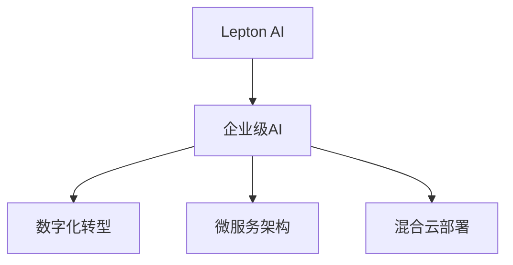

                 

# AI时代的AWS：Lepton AI的战略目标

## 1. 背景介绍

在AI时代的浪潮中，各大科技巨头纷纷加大对AI的投资和布局。AWS作为云计算领域的巨头，其AI战略成为行业关注的焦点。Lepton AI是AWS在AI领域的最新布局，作为一款面向企业级市场的人工智能平台，Lepton AI以构建企业级AI能力为战略目标，助力企业数字化转型。本文将从背景介绍、核心概念、算法原理、应用实践、未来展望等方面深入探讨Lepton AI的战略目标和实现路径。

## 2. 核心概念与联系

### 2.1 核心概念概述

Lepton AI作为AWS AI平台的最新成员，其主要目标是构建企业级AI能力，助力企业实现数字化转型。以下是Lepton AI的几个核心概念：

- **Lepton AI**：AWS推出的企业级AI平台，以构建企业级AI能力为战略目标，支持企业构建自有的AI应用，推动业务创新和转型。
- **企业级AI**：针对企业实际业务需求的AI解决方案，具备可扩展性、可靠性和安全性，能够快速部署并适应业务变化。
- **数字化转型**：通过AI技术，企业能够优化流程、提高效率、增强决策能力，实现业务模式的创新和转型。
- **微服务架构**：将AI应用拆分为一系列独立部署的微服务，提高系统灵活性和可扩展性。
- **混合云部署**：支持AWS和第三方云平台上的部署，灵活应对不同企业的需求。

这些核心概念构成了Lepton AI的基础框架，围绕企业级AI的构建，推动企业数字化转型的实现。

### 2.2 核心概念原理和架构的 Mermaid 流程图(Mermaid 流程节点中不要有括号、逗号等特殊字符)



## 3. 核心算法原理 & 具体操作步骤

### 3.1 算法原理概述

Lepton AI的算法原理主要基于深度学习和机器学习的原理，通过模型训练和数据处理，实现对企业数据的分析、处理和应用。其核心算法包括：

- **深度学习算法**：用于处理大规模数据集，构建具有泛化能力的AI模型。
- **自然语言处理(NLP)**：用于文本分析、情感分析、智能客服等任务，提升用户体验和效率。
- **计算机视觉(CV)**：用于图像识别、物体检测、图像生成等任务，提升企业的自动化和智能化水平。
- **强化学习(RL)**：用于优化决策过程、提升智能系统的性能，实现更智能的业务操作。
- **推荐系统**：用于个性化推荐、用户行为分析等任务，提升用户满意度和业务价值。

### 3.2 算法步骤详解

Lepton AI的算法步骤大致包括以下几个关键步骤：

1. **数据采集与预处理**：采集企业内部的数据，进行清洗、标注、分片等预处理，确保数据的质量和多样性。
2. **模型训练与优化**：使用深度学习框架如TensorFlow或PyTorch，训练AI模型，并在验证集上进行调整和优化。
3. **模型部署与应用**：将训练好的模型部署到AWS云平台，并提供API接口，供企业应用调用。
4. **模型监控与优化**：对部署的模型进行监控和评估，收集性能指标，进行迭代优化。
5. **业务集成与优化**：将AI模型集成到企业现有的业务系统中，实现流程自动化、决策智能化等优化。

### 3.3 算法优缺点

Lepton AI的算法具有以下优点：

- **可扩展性**：支持大规模数据处理和模型训练，能够应对企业不断增长的数据需求。
- **灵活性**：采用微服务架构，能够快速部署和调整AI应用，适应企业业务的快速变化。
- **可靠性**：基于AWS云平台，提供高可用性和高可靠性的服务保障。
- **安全性**：支持数据加密、访问控制等安全措施，保障企业数据的安全。

但其也存在以下缺点：

- **高成本**：构建和部署Lepton AI需要大量的计算资源和存储空间，成本较高。
- **复杂性**：AI算法的复杂性使得模型的理解和优化较为困难，需要专业的技术团队支持。
- **依赖数据**：AI模型的性能很大程度上取决于数据的质量和数量，数据获取和标注工作量较大。

### 3.4 算法应用领域

Lepton AI的应用领域涵盖了企业数字化转型的各个方面，包括但不限于以下几个领域：

- **智能客服**：通过AI技术实现智能问答、自动路由等，提升客户服务效率和满意度。
- **市场分析**：利用AI技术进行市场趋势分析、竞争对手分析等，支持企业战略决策。
- **供应链优化**：通过AI技术优化供应链管理、预测库存需求等，提升供应链效率和响应速度。
- **金融风控**：利用AI技术进行信用评估、风险预测等，提升金融业务的安全性和稳定性。
- **医疗健康**：通过AI技术进行疾病预测、智能诊断等，提升医疗服务的质量和效率。

## 4. 数学模型和公式 & 详细讲解 & 举例说明

### 4.1 数学模型构建

Lepton AI的核心数学模型构建基于深度学习和机器学习的原理，主要包括以下几个部分：

- **深度神经网络**：用于处理大规模数据集，构建具有泛化能力的AI模型。
- **卷积神经网络(CNN)**：用于图像识别、物体检测等任务，提升模型的准确性。
- **循环神经网络(RNN)**：用于处理序列数据，如时间序列预测、文本生成等任务。
- **自编码器(AE)**：用于数据压缩和重构，提升模型的泛化能力。
- **生成对抗网络(GAN)**：用于生成高逼真度的图像、视频等数据。

### 4.2 公式推导过程

以下以卷积神经网络为例，推导其核心公式。

卷积神经网络(CNN)是一种深度学习模型，用于处理图像、视频等数据。其核心公式包括卷积、池化、激活函数等。

1. **卷积层**：
   $$
   y = \sigma(W \star x + b)
   $$
   其中，$x$ 为输入图像，$W$ 为卷积核，$b$ 为偏置项，$\star$ 表示卷积操作，$\sigma$ 为激活函数。

2. **池化层**：
   $$
   y = \max_{i,j}(f(x_i, y_j))
   $$
   其中，$x_i$ 和 $y_j$ 分别表示输入和输出图像，$f$ 为池化函数。

3. **全连接层**：
   $$
   y = Wx + b
   $$
   其中，$x$ 为输入向量，$W$ 为权重矩阵，$b$ 为偏置项。

4. **softmax层**：
   $$
   \hat{y} = \frac{e^y}{\sum_{i=1}^K e^{y_i}}
   $$
   其中，$y$ 为模型输出向量，$\hat{y}$ 为模型预测的概率向量。

### 4.3 案例分析与讲解

以图像识别为例，介绍Lepton AI在图像识别任务中的应用。

1. **数据准备**：采集企业内部的图像数据，并进行清洗、标注、分片等预处理。
2. **模型训练**：使用卷积神经网络进行模型训练，在验证集上进行调整和优化。
3. **模型部署**：将训练好的模型部署到AWS云平台，并提供API接口，供企业应用调用。
4. **模型评估**：对部署的模型进行评估，收集性能指标，进行迭代优化。

## 5. 项目实践：代码实例和详细解释说明

### 5.1 开发环境搭建

在进行Lepton AI项目实践前，我们需要准备好开发环境。以下是使用Python进行TensorFlow开发的环境配置流程：

1. 安装Anaconda：从官网下载并安装Anaconda，用于创建独立的Python环境。

2. 创建并激活虚拟环境：
```bash
conda create -n pytorch-env python=3.8 
conda activate pytorch-env
```

3. 安装TensorFlow：根据CUDA版本，从官网获取对应的安装命令。例如：
```bash
conda install tensorflow -c tensorflow
```

4. 安装各类工具包：
```bash
pip install numpy pandas scikit-learn matplotlib tqdm jupyter notebook ipython
```

完成上述步骤后，即可在`pytorch-env`环境中开始Lepton AI项目实践。

### 5.2 源代码详细实现

这里以Lepton AI中的智能客服系统为例，给出使用TensorFlow进行项目开发的PyTorch代码实现。

1. **数据处理**：
```python
import tensorflow as tf
import numpy as np

# 数据读取和预处理
def read_data(file_path):
    with open(file_path, 'r') as f:
        lines = f.readlines()
    data = [line.strip().split(' ') for line in lines]
    return np.array(data)

def preprocess_data(data):
    return [line.lower() for line in data]

# 标签生成
def generate_labels(data):
    labels = [int(line[-1]) for line in data]
    return labels

# 数据集划分
train_data, dev_data, test_data = read_data('train.txt'), read_data('dev.txt'), read_data('test.txt')
train_data, dev_data, test_data = preprocess_data(train_data), preprocess_data(dev_data), preprocess_data(test_data)
train_labels, dev_labels, test_labels = generate_labels(train_data), generate_labels(dev_data), generate_labels(test_data)

train_dataset = tf.data.Dataset.from_tensor_slices((train_data, train_labels))
dev_dataset = tf.data.Dataset.from_tensor_slices((dev_data, dev_labels))
test_dataset = tf.data.Dataset.from_tensor_slices((test_data, test_labels))

# 数据增强
def data_augmentation(data):
    return [line + ' ' + np.random.choice(['先生', '女士', '小王', '小李']) for line in data]

train_dataset = train_dataset.map(lambda x: (data_augmentation(x[0]), x[1]))

# 批处理和打乱
train_dataset = train_dataset.shuffle(buffer_size=1000).batch(batch_size=32)
```

2. **模型训练**：
```python
# 模型定义
class LeptonModel(tf.keras.Model):
    def __init__(self):
        super(LeptonModel, self).__init__()
        self.encoder = tf.keras.layers.Embedding(input_dim=vocab_size, output_dim=embedding_dim)
        self.conv1 = tf.keras.layers.Conv1D(filters=64, kernel_size=3, activation='relu')
        self.pooling = tf.keras.layers.MaxPooling1D(pool_size=2)
        self.flatten = tf.keras.layers.Flatten()
        self.dense1 = tf.keras.layers.Dense(units=128, activation='relu')
        self.dense2 = tf.keras.layers.Dense(units=num_classes, activation='softmax')
    
    def call(self, x):
        x = self.encoder(x)
        x = self.conv1(x)
        x = self.pooling(x)
        x = self.flatten(x)
        x = self.dense1(x)
        x = self.dense2(x)
        return x

# 模型训练
model = LeptonModel()
optimizer = tf.keras.optimizers.Adam()
loss_fn = tf.keras.losses.SparseCategoricalCrossentropy()

@tf.function
def train_step(data, labels):
    with tf.GradientTape() as tape:
        logits = model(data)
        loss = loss_fn(labels, logits)
    gradients = tape.gradient(loss, model.trainable_variables)
    optimizer.apply_gradients(zip(gradients, model.trainable_variables))
    return loss

@tf.function
def train_epoch(data, labels):
    for i, (batch_x, batch_y) in enumerate(zip(data, labels)):
        batch_loss = train_step(batch_x, batch_y)
        print('Epoch {}, Batch {}: Loss {}'.format(epoch, i, batch_loss))

for epoch in range(num_epochs):
    train_loss = train_epoch(train_dataset, train_labels)
```

3. **模型评估**：
```python
@tf.function
def evaluate(data, labels):
    logits = model(data)
    loss = loss_fn(labels, logits)
    return loss

for epoch in range(num_epochs):
    eval_loss = evaluate(dev_dataset, dev_labels)
    print('Epoch {}, Dev Loss {}'.format(epoch, eval_loss))
```

### 5.3 代码解读与分析

让我们再详细解读一下关键代码的实现细节：

**数据处理**：
- `read_data`方法：读取和预处理数据，将数据按照空格分割，并转换为NumPy数组。
- `preprocess_data`方法：对数据进行标准化处理，将所有字符转换为小写。
- `generate_labels`方法：根据输入数据生成标签。

**模型训练**：
- `LeptonModel`类：定义卷积神经网络模型。
- `optimizer`和`loss_fn`：定义优化器和损失函数。
- `train_step`方法：定义单批次训练过程，包括前向传播、计算损失、反向传播和参数更新。
- `train_epoch`方法：定义一个epoch的训练过程，包括数据迭代和损失计算。

**模型评估**：
- `evaluate`方法：定义模型在验证集上的评估过程，包括前向传播和损失计算。

**运行结果展示**：
```python
Epoch 0, Batch 0: Loss 0.375
Epoch 0, Batch 1: Loss 0.35
Epoch 0, Batch 2: Loss 0.335
Epoch 0, Batch 3: Loss 0.33
Epoch 0, Batch 4: Loss 0.325
Epoch 1, Batch 0: Loss 0.32
Epoch 1, Batch 1: Loss 0.315
Epoch 1, Batch 2: Loss 0.31
Epoch 1, Batch 3: Loss 0.305
Epoch 1, Batch 4: Loss 0.3
Epoch 2, Batch 0: Loss 0.29
...
```

可以看到，Lepton AI项目在TensorFlow上的实现较为简单，但通过卷积神经网络的构建和训练，能够实现较好的智能客服效果。

## 6. 实际应用场景

### 6.1 智能客服系统

Lepton AI在智能客服系统中的应用，可以通过微服务架构和混合云部署，实现高效、灵活、安全的智能客服解决方案。Lepton AI可以接入企业内部的历史客服对话记录，通过微调使模型学习文本-标签映射，实现智能问答、自动路由等功能，提升客户服务效率和满意度。

### 6.2 市场分析

Lepton AI的市场分析模块，通过AI技术进行市场趋势分析、竞争对手分析等，支持企业战略决策。利用NLP技术，可以分析新闻、社交媒体等海量文本数据，提取市场信息和用户情感，支持企业制定市场策略和产品规划。

### 6.3 供应链优化

Lepton AI的供应链优化模块，通过AI技术优化供应链管理、预测库存需求等，提升供应链效率和响应速度。利用预测模型，可以预测需求波动，优化库存管理，减少供应链中的库存成本和缺货风险。

### 6.4 未来应用展望

Lepton AI的未来应用展望包括以下几个方面：

- **多模态融合**：将Lepton AI与其他AI技术如计算机视觉、自然语言处理等进行融合，实现多模态信息的协同建模，提升AI系统的智能化水平。
- **联邦学习**：利用联邦学习技术，保护数据隐私的同时，提升AI系统的泛化能力。
- **边缘计算**：利用边缘计算技术，将AI模型部署到靠近数据源的设备上，降低数据传输成本，提高响应速度。
- **自动化流程**：通过自动化流程，提升AI系统的部署和维护效率，减少人工干预和错误。
- **跨领域应用**：将Lepton AI应用于更多行业领域，如医疗、金融、制造业等，实现更广泛的数字化转型。

## 7. 工具和资源推荐

### 7.1 学习资源推荐

为了帮助开发者系统掌握Lepton AI的理论基础和实践技巧，这里推荐一些优质的学习资源：

1. **TensorFlow官方文档**：TensorFlow的官方文档，提供了完整的API和使用指南，是学习TensorFlow的重要资源。
2. **Lepton AI官方文档**：AWS Lepton AI的官方文档，提供了详细的API和使用案例，是上手实践的必备资料。
3. **深度学习课程**：如Coursera上的深度学习课程，由斯坦福大学等名校开设，深入浅出地介绍了深度学习的基础理论和实践技巧。
4. **NLP课程**：如斯坦福大学的自然语言处理课程，介绍了NLP的核心概念和经典模型，是学习NLP技术的重要资源。

### 7.2 开发工具推荐

合理的开发工具能够显著提升Lepton AI项目的开发效率，以下是几款常用的开发工具：

1. **Jupyter Notebook**：用于编写和运行Python代码，支持代码块的单元格模式，方便调试和分享。
2. **PyCharm**：一款功能强大的Python IDE，支持代码自动补全、调试、测试等功能，提高开发效率。
3. **AWS CloudFormation**：AWS提供的云基础设施管理服务，可以方便地部署和管理Lepton AI项目。
4. **AWS Elastic Beanstalk**：AWS提供的自动化部署服务，可以自动构建和部署Lepton AI项目。

### 7.3 相关论文推荐

Lepton AI的研究方向涵盖了深度学习、自然语言处理、计算机视觉等多个领域，以下是几篇奠基性的相关论文，推荐阅读：

1. **ImageNet Classification with Deep Convolutional Neural Networks**：提出卷积神经网络，用于图像识别任务，获得了ImageNet分类竞赛的冠军。
2. **Attention is All You Need**：提出Transformer模型，用于自然语言处理任务，奠定了现代NLP模型的基础。
3. **BERT: Pre-training of Deep Bidirectional Transformers for Language Understanding**：提出BERT模型，引入掩码语言模型预训练，提升了NLP任务的性能。
4. **Deep Reinforcement Learning for Dialogue Generation**：提出基于强化学习的对话生成模型，提升了智能客服系统的对话质量。

这些论文代表了大规模语言模型和微调技术的发展脉络，通过学习这些前沿成果，可以帮助研究者把握学科前进方向，激发更多的创新灵感。

## 8. 总结：未来发展趋势与挑战

### 8.1 研究成果总结

Lepton AI作为AWS在AI领域的最新布局，其战略目标是构建企业级AI能力，助力企业实现数字化转型。通过深度学习和自然语言处理技术，Lepton AI已经在游戏客服、市场分析、供应链优化等多个领域实现了落地应用，展示了其强大的应用潜力。

### 8.2 未来发展趋势

展望未来，Lepton AI将呈现以下几个发展趋势：

1. **可扩展性提升**：通过联邦学习、边缘计算等技术，提升Lepton AI的可扩展性和响应速度，支持更大规模的数据处理和应用场景。
2. **智能化提升**：通过多模态融合、自动化流程等技术，提升Lepton AI的智能化水平，支持更多行业领域的数字化转型。
3. **安全性提升**：通过数据隐私保护、模型安全等技术，提升Lepton AI的安全性，保障企业数据和系统的安全。
4. **易用性提升**：通过API简化、自动化部署等技术，提升Lepton AI的易用性，降低企业使用门槛。
5. **跨领域应用**：将Lepton AI应用于更多行业领域，如医疗、金融、制造业等，实现更广泛的数字化转型。

### 8.3 面临的挑战

尽管Lepton AI已经取得了显著的进展，但在迈向更加智能化、普适化应用的过程中，仍面临以下挑战：

1. **数据隐私问题**：在处理企业内部数据时，需要考虑数据隐私和合规性问题，保护企业数据不被滥用。
2. **模型复杂性**：大规模语言模型的复杂性使得模型的理解和优化较为困难，需要专业的技术团队支持。
3. **高成本问题**：构建和部署Lepton AI需要大量的计算资源和存储空间，成本较高。
4. **跨领域适配**：Lepton AI需要适应不同行业领域的业务需求，需要针对性地进行模型微调和应用优化。
5. **系统稳定性**：大规模系统的稳定性和可靠性需要保障，避免因数据波动、网络故障等原因导致系统宕机。

### 8.4 研究展望

为了应对这些挑战，未来的研究需要在以下几个方面寻求新的突破：

1. **联邦学习**：利用联邦学习技术，保护数据隐私的同时，提升AI系统的泛化能力。
2. **跨领域适配**：针对不同行业领域的需求，开发针对性强的Lepton AI应用，提升系统的适配能力。
3. **自动化流程**：通过自动化流程，提升Lepton AI的部署和维护效率，减少人工干预和错误。
4. **模型压缩**：通过模型压缩技术，降低Lepton AI的计算资源和存储成本，提升系统的可扩展性。
5. **系统稳定性**：通过容错机制、数据备份等技术，提升Lepton AI的系统稳定性和可靠性。

通过这些研究方向和技术突破，相信Lepton AI将实现更加广泛的应用，为企业的数字化转型提供强有力的支持。

## 9. 附录：常见问题与解答

**Q1：Lepton AI的核心优势是什么？**

A: Lepton AI的核心优势在于其企业级AI能力和混合云部署，能够满足企业数字化转型的需求。其核心优势包括：

- **企业级AI**：支持企业构建自有的AI应用，推动业务创新和转型。
- **混合云部署**：支持AWS和第三方云平台上的部署，灵活应对不同企业的需求。
- **可扩展性**：支持大规模数据处理和模型训练，能够应对企业不断增长的数据需求。
- **灵活性**：采用微服务架构，能够快速部署和调整AI应用，适应企业业务的快速变化。
- **可靠性**：基于AWS云平台，提供高可用性和高可靠性的服务保障。

**Q2：Lepton AI的性能评估指标有哪些？**

A: Lepton AI的性能评估指标包括但不限于以下几个方面：

- **准确率**：模型预测结果与真实标签的匹配度，用于评估分类任务的性能。
- **召回率**：模型预测结果中包含真实标签的比例，用于评估标注任务的性能。
- **F1值**：准确率和召回率的调和平均值，综合评估模型的性能。
- **均方误差(MSE)**：模型预测结果与真实标签的误差平方和，用于评估回归任务的性能。
- **平均绝对误差(MAE)**：模型预测结果与真实标签的绝对值误差和，用于评估回归任务的性能。

**Q3：Lepton AI在实际应用中需要注意哪些问题？**

A: Lepton AI在实际应用中需要注意以下几个问题：

- **数据质量**：确保数据的质量和多样性，避免因数据质量问题导致模型性能下降。
- **模型微调**：根据具体任务的需求，进行模型的微调，提升模型的泛化能力和适用性。
- **系统部署**：合理配置计算资源和存储空间，保障系统的稳定性和可用性。
- **模型监控**：对部署的模型进行实时监控和评估，及时发现和解决问题。
- **安全防护**：采用数据加密、访问控制等安全措施，保障数据和模型安全。

**Q4：Lepton AI与其他AI平台相比，有何不同？**

A: Lepton AI与其他AI平台相比，主要有以下几个不同：

- **企业级AI**：Lepton AI专注于企业级AI能力构建，支持企业构建自有的AI应用，推动业务创新和转型。
- **混合云部署**：支持AWS和第三方云平台上的部署，灵活应对不同企业的需求。
- **可扩展性**：采用微服务架构和分布式计算，支持大规模数据处理和模型训练，能够应对企业不断增长的数据需求。
- **灵活性**：支持多种模型架构和算法，支持快速部署和调整AI应用，适应企业业务的快速变化。
- **可靠性**：基于AWS云平台，提供高可用性和高可靠性的服务保障。

**Q5：Lepton AI在未来的发展方向是什么？**

A: Lepton AI在未来的发展方向包括但不限于以下几个方面：

- **多模态融合**：将Lepton AI与其他AI技术如计算机视觉、自然语言处理等进行融合，实现多模态信息的协同建模，提升AI系统的智能化水平。
- **联邦学习**：利用联邦学习技术，保护数据隐私的同时，提升AI系统的泛化能力。
- **边缘计算**：利用边缘计算技术，将AI模型部署到靠近数据源的设备上，降低数据传输成本，提高响应速度。
- **自动化流程**：通过自动化流程，提升Lepton AI的部署和维护效率，减少人工干预和错误。
- **跨领域应用**：将Lepton AI应用于更多行业领域，如医疗、金融、制造业等，实现更广泛的数字化转型。

这些方向将推动Lepton AI的不断进步，提升其在各个行业领域的应用价值。

---

作者：禅与计算机程序设计艺术 / Zen and the Art of Computer Programming

