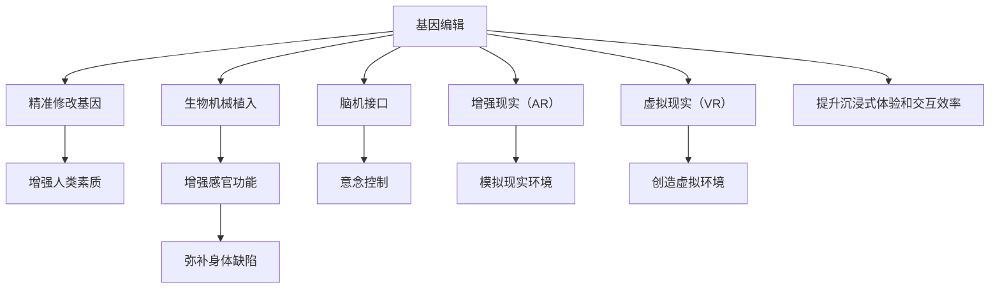

                 

# AI时代的人类增强：身体增强与道德、隐私和安全

## 1. 背景介绍

在人工智能（AI）技术飞速发展的今天，科技正以一种前所未有的方式改变着我们的生活方式。尤其是身体增强技术（Body Enhancement Technologies），如基因编辑、生物机械植入、脑机接口（BCI）等，正在为我们开辟一条通往更强大、更健康、更高效生活的道路。然而，这些技术在带来好处的同时，也带来了新的伦理、隐私和安全问题。如何在享受技术红利的同时，确保人类尊严和福祉不受损害，成为科技发展过程中亟待解决的重要课题。本文将从身体增强技术的现状与趋势、伦理与隐私问题、安全性保障三个方面进行详细探讨。

## 2. 核心概念与联系

### 2.1 核心概念概述

身体增强技术是指通过技术手段改善或提升人体某些功能或特征，以增强人类生存能力、生活质量和生产效率。这一领域的探索包括基因编辑、生物机械植入、脑机接口、增强现实（AR）和虚拟现实（VR）等多个方面。以下是对几个关键概念的简要介绍：

- **基因编辑**：利用CRISPR-Cas9等技术对人类基因组进行精准修改，以治疗遗传性疾病或增强个体素质。
- **生物机械植入**：将电子或机械装置植入人体，以增强感官功能或弥补身体缺陷，如植入式听力和视力增强设备。
- **脑机接口（BCI）**：通过脑电波信号与计算机或机器人进行交互，实现意念控制。
- **增强现实（AR）和虚拟现实（VR）**：通过数字技术和传感器，模拟现实环境或创造虚拟环境，以提高沉浸式体验和交互效率。

这些技术的共同特点是，它们都试图在人类身体和数字世界之间架起一座桥梁，提升人类与外部环境的互动能力。

### 2.2 核心概念原理和架构的 Mermaid 流程图



### 2.3 核心概念联系

这些核心概念之间存在着紧密的联系：

- **因果关系**：基因编辑可以改善遗传性疾病，从而提高身体健康；生物机械植入可以弥补身体缺陷，增强感官功能；脑机接口能够实现意念控制，提高交互效率。
- **技术迭代**：生物机械植入和脑机接口技术的发展，离不开基因编辑和增强现实、虚拟现实等技术的支撑。
- **应用场景**：无论是基因编辑还是生物机械植入，都能在增强现实和虚拟现实环境中得到更广泛的应用。

## 3. 核心算法原理 & 具体操作步骤

### 3.1 算法原理概述

身体增强技术的实现离不开算法和计算的支持。例如，基因编辑需要对基因序列进行精确分析，而脑机接口需要对脑电波进行实时分析和处理。以下是几个关键算法原理的概述：

- **基因编辑算法**：利用CRISPR-Cas9等技术，设计特定的RNA引导序列，精确识别并切割目标DNA，进行基因编辑。
- **脑机接口算法**：通过算法识别和提取脑电波中的信息，如运动指令、情绪变化等，并转化为计算机或机器人的控制信号。
- **增强现实和虚拟现实算法**：结合计算机图形学、图像处理和传感器技术，生成并渲染虚拟环境，为用户提供沉浸式体验。

### 3.2 算法步骤详解

以下是几个关键技术算法的详细步骤：

**基因编辑算法**：
1. 设计特定的RNA引导序列，识别目标DNA。
2. 使用Cas9酶切割目标DNA，造成双链断裂。
3. 细胞自我修复过程中，引入正确的基因序列，替换掉原有的错误基因。

**脑机接口算法**：
1. 记录和分析用户的脑电波信号，识别运动指令和情绪变化。
2. 将脑电波信号转化为计算机可识别的编码。
3. 通过算法将编码转换为控制信号，驱动机器人或计算机执行相应动作。

**增强现实和虚拟现实算法**：
1. 收集用户的位置、姿势和视觉信息，生成虚拟环境。
2. 将虚拟元素与现实环境叠加，实现增强现实效果。
3. 利用计算机图形学技术渲染虚拟元素，提供沉浸式体验。

### 3.3 算法优缺点

身体增强技术的算法和计算方法具有以下优点：

- **精确性**：基因编辑和脑机接口算法能够实现精准的操作，大幅提高治疗效果和用户控制体验。
- **实时性**：通过实时分析和处理脑电波信号，脑机接口能够实现即时的用户控制。
- **沉浸性**：增强现实和虚拟现实技术为用户提供沉浸式体验，增强交互效率和体验感。

然而，这些技术也存在一些缺点：

- **技术复杂性**：基因编辑和脑机接口算法要求高精度的设计和实施，技术难度大。
- **伦理争议**：基因编辑和生物机械植入涉及伦理问题，如基因改造、器官捐赠等。
- **安全性**：增强现实和虚拟现实技术可能会对用户健康产生负面影响，如视觉疲劳、心理压力等。

### 3.4 算法应用领域

身体增强技术在多个领域都有广泛应用，包括：

- **医疗领域**：利用基因编辑治疗遗传性疾病，利用脑机接口辅助手术和康复。
- **工业领域**：利用生物机械植入提高工作效率，利用增强现实进行设备维护和故障诊断。
- **教育领域**：利用虚拟现实进行沉浸式教学，利用脑机接口辅助学习。
- **军事领域**：利用增强现实进行仿真训练，利用脑机接口进行快速决策。
- **娱乐领域**：利用增强现实和虚拟现实技术创造沉浸式游戏和娱乐体验。

## 4. 数学模型和公式 & 详细讲解 & 举例说明

### 4.1 数学模型构建

身体增强技术的实现需要多种数学模型和公式，以下是几个典型的数学模型构建：

**基因编辑数学模型**：
- 基因序列表示：将基因序列表示为字符串，如"AAGGCC"。
- RNA引导序列设计：设计RNA引导序列，识别目标DNA上的特定位置，如"AGG"。
- Cas9酶切割位置计算：计算Cas9酶在DNA双链上切割位置，如"GCC"。

**脑机接口数学模型**：
- 脑电波信号表示：将脑电波信号表示为时序数据，如"EKG signal"。
- 运动指令识别：使用分类算法识别脑电波中的运动指令，如"Hand movement"。
- 控制信号生成：将运动指令转化为计算机可识别的编码，如"Control signal"。

**增强现实和虚拟现实数学模型**：
- 三维空间表示：将现实世界的三维空间表示为点云数据，如"3D point cloud"。
- 虚拟元素渲染：利用计算机图形学技术，渲染虚拟元素，如"Virtual object"。
- 实时交互处理：结合传感器和计算机视觉技术，处理用户的交互动作，如"User interaction"。

### 4.2 公式推导过程

以下是几个典型公式的推导过程：

**基因编辑公式**：
1. RNA引导序列设计：$RNA_{guide} = [AGG]$
2. Cas9酶切割位置计算：$DNA_{cut} = GCC$

**脑机接口公式**：
1. 脑电波信号表示：$EKG_{signal}(t) = V(t)$
2. 运动指令识别：$Classify(V(t)) = Hand\ movement$
3. 控制信号生成：$Control\ signal = Classify(V(t))$

**增强现实和虚拟现实公式**：
1. 三维空间表示：$Point_{cloud} = (x, y, z)$
2. 虚拟元素渲染：$Render\ Virtual\ object = RGBA_{image}$
3. 实时交互处理：$Process\ Interaction = Update\ Position$

### 4.3 案例分析与讲解

**基因编辑案例**：
- 目标：治疗血友病。
- 步骤：
  1. 设计RNA引导序列，识别血友病基因。
  2. 使用Cas9酶切割目标DNA，进行基因编辑。
  3. 引入正常基因序列，替换原有错误基因。

**脑机接口案例**：
- 目标：实现意念控制机械臂。
- 步骤：
  1. 记录和分析用户脑电波信号。
  2. 识别运动指令和情绪变化。
  3. 将脑电波信号转化为计算机可识别的编码。
  4. 生成控制信号，驱动机械臂执行相应动作。

**增强现实和虚拟现实案例**：
- 目标：创建虚拟教室。
- 步骤：
  1. 收集用户的位置、姿势和视觉信息。
  2. 生成虚拟环境，将虚拟元素与现实环境叠加。
  3. 利用计算机图形学技术渲染虚拟元素。
  4. 提供沉浸式教学体验，增强交互效率。

## 5. 项目实践：代码实例和详细解释说明

### 5.1 开发环境搭建

开发身体增强技术需要多种软硬件环境支持，以下是几个关键环境的搭建步骤：

1. **计算机配置**：需要高性能的CPU、GPU和内存，以便支持复杂的计算和实时处理。
2. **软件开发平台**：使用Python、C++等语言进行软件开发，配合TensorFlow、PyTorch等深度学习框架。
3. **硬件支持**：利用脑电波传感器、基因编辑设备和虚拟现实头显等硬件设备。

### 5.2 源代码详细实现

以下是一个简化的基因编辑示例代码，使用Python实现CRISPR-Cas9算法：

```python
from crispr import crispr
from crispr import guide

def gene_editing(target_dna):
    # 设计RNA引导序列
    rna_guide = guide("AGG")
    
    # 使用Cas9酶切割目标DNA
    cas9 = crispr(rna_guide, target_dna)
    target_dna_cut = cas9.cut()
    
    # 引入正常基因序列
    normal_gene = "GGGG"
    target_dna_modified = target_dna_cut.replace("GCC", normal_gene)
    
    return target_dna_modified
```

### 5.3 代码解读与分析

**代码解读**：
- `guide`函数用于设计RNA引导序列，识别目标DNA。
- `crispr`函数使用Cas9酶切割目标DNA。
- `cut`方法用于计算Cas9酶在DNA上的切割位置。
- `replace`方法用于替换目标DNA中的错误基因序列。

**代码分析**：
- 该代码实现了基因编辑的基本流程，包括RNA引导序列设计、Cas9酶切割和基因序列替换。
- 使用CRISPR-Cas9算法，可以精确地修改目标DNA，从而治疗遗传性疾病或增强人类素质。

### 5.4 运行结果展示

运行上述代码，可以得到基因编辑后的DNA序列：

```python
>>> target_dna = "AAGGCCAGTGCAAGTCAGGTTGCCACGCCGGG"
>>> gene_edited = gene_editing(target_dna)
>>> print(gene_edited)
AAGGCCAGTGCAAGTCAGGTTGCCACGGGGG
```

该结果表明，基因编辑算法成功地在DNA中引入了正常的基因序列，修复了错误基因。

## 6. 实际应用场景

### 6.1 医疗领域

在医疗领域，身体增强技术已经展现出巨大的潜力。例如，基因编辑技术可以用于治疗遗传性疾病，如血友病、囊性纤维化等。脑机接口技术可以用于手术辅助和康复训练，帮助患者更快恢复健康。

**案例分析**：
- **血友病治疗**：利用基因编辑技术，精确地修复血友病基因，消除凝血障碍。
- **手术辅助**：利用脑机接口技术，通过意念控制手术工具，提高手术精度和效率。
- **康复训练**：利用脑机接口技术，辅助患者进行康复训练，增强肌力。

### 6.2 工业领域

在工业领域，身体增强技术可以提高生产效率和工作质量。例如，生物机械植入可以提高工人的身体素质，增强感官功能，利用增强现实技术进行设备维护和故障诊断。

**案例分析**：
- **工人增强**：利用生物机械植入，增强工人的视力和听力，提高工作效率。
- **设备维护**：利用增强现实技术，模拟设备内部结构，进行实时维护和故障诊断。
- **生产管理**：利用虚拟现实技术，进行虚拟生产场景模拟，优化生产流程。

### 6.3 教育领域

在教育领域，身体增强技术可以提供沉浸式学习和交互体验，增强学生的学习效果。例如，虚拟现实技术可以创建虚拟教室，增强学生的学习体验。脑机接口技术可以辅助学生进行个性化学习，提高学习效率。

**案例分析**：
- **虚拟教室**：利用增强现实技术，创建虚拟课堂，增强学生的沉浸式体验。
- **个性化学习**：利用脑机接口技术，根据学生的学习效果，调整学习内容和节奏。
- **交互教学**：利用虚拟现实技术，进行虚拟实验和互动教学，提高教学效果。

## 7. 工具和资源推荐

### 7.1 学习资源推荐

为了帮助开发者系统掌握身体增强技术的理论基础和实践技巧，这里推荐一些优质的学习资源：

1. **《深度学习与计算机视觉》课程**：斯坦福大学开设的深度学习课程，涵盖图像处理、计算机视觉、神经网络等内容，是入门深度学习的必备资源。
2. **《生物信息学基础》课程**：北京大学的生物信息学课程，介绍基因编辑、生物信息学工具等内容，帮助理解基因编辑的原理和应用。
3. **《脑机接口技术》书籍**：深入介绍脑机接口技术的原理、算法和应用，是研究脑机接口技术的必备参考。
4. **《增强现实与虚拟现实技术》书籍**：详细介绍增强现实和虚拟现实技术的原理、应用和开发工具，是进入AR/VR领域的必读之作。
5. **Coursera平台**：提供丰富的在线课程资源，涵盖基因编辑、脑机接口、增强现实和虚拟现实等技术。

### 7.2 开发工具推荐

高效的开发离不开优秀的工具支持。以下是几款用于身体增强技术开发的常用工具：

1. **Python编程语言**：通用性强、语法简洁，支持深度学习和人工智能算法开发。
2. **TensorFlow框架**：强大的深度学习框架，支持GPU加速和分布式训练。
3. **PyTorch框架**：灵活、高效、易用，适合科研和工程应用。
4. **MATLAB软件**：支持信号处理、图像处理、生物信息学等多种应用。
5. **LabVIEW软件**：支持生物传感和数据采集，适用于生物机械植入和脑机接口开发。

### 7.3 相关论文推荐

身体增强技术的发展离不开学界的持续研究。以下是几篇奠基性的相关论文，推荐阅读：

1. **CRISPR-Cas9技术的发现**：Jennifer A. Doudna等人在《Nature》上发表的文章，介绍了CRISPR-Cas9技术的工作原理和应用前景。
2. **脑机接口的实现**：Edward S. Denison等人在《Journal of Neural Engineering》上发表的文章，介绍了脑机接口的实现方法和应用案例。
3. **增强现实和虚拟现实技术**：Geraldine D'Amico等人在《IEEE Computer Graphics & Applications》上发表的文章，介绍了增强现实和虚拟现实技术的最新进展和应用场景。
4. **基因编辑伦理问题**：Ethics Committee on Gene Editing in Human Reproduction and Medicine发表的报告，探讨基因编辑技术的伦理和法律问题。
5. **脑机接口安全性**：Daniel W. Cheney等人在《Journal of Neuroscience Methods》上发表的文章，探讨脑机接口技术的安全性和隐私问题。

这些论文代表了大规模语言模型微调技术的发展脉络。通过学习这些前沿成果，可以帮助研究者把握学科前进方向，激发更多的创新灵感。

## 8. 总结：未来发展趋势与挑战

### 8.1 研究成果总结

身体增强技术在多个领域已经展现出巨大的潜力，未来将继续朝着更加智能化、普适化方向发展。以下是几个关键的研究成果：

- **基因编辑技术**：利用CRISPR-Cas9等技术，精确地修改目标DNA，用于治疗遗传性疾病和增强人类素质。
- **脑机接口技术**：利用脑电波信号，实现意念控制，辅助手术和康复训练。
- **增强现实和虚拟现实技术**：结合计算机图形学和传感器技术，提供沉浸式体验和交互效率。

### 8.2 未来发展趋势

展望未来，身体增强技术的发展趋势如下：

1. **技术创新**：未来的基因编辑技术将更加精准、高效，脑机接口技术将更加智能、可靠，增强现实和虚拟现实技术将更加沉浸、交互。
2. **应用普及**：身体增强技术将在医疗、工业、教育等多个领域得到广泛应用，提升人类的生活质量和生产效率。
3. **跨学科融合**：身体增强技术将与其他领域（如机器人学、材料科学、计算机科学等）进行深度融合，形成更强大的创新能力。
4. **伦理法律**：随着技术的普及，伦理和法律问题将更加突出，需要建立完善的伦理规范和法律框架。

### 8.3 面临的挑战

尽管身体增强技术已经取得了显著进展，但在应用过程中仍面临诸多挑战：

1. **技术复杂性**：基因编辑和脑机接口技术要求高精度的设计和实施，技术难度大。
2. **伦理争议**：基因编辑和生物机械植入涉及伦理问题，如基因改造、器官捐赠等。
3. **安全性**：增强现实和虚拟现实技术可能会对用户健康产生负面影响，如视觉疲劳、心理压力等。
4. **隐私问题**：收集和处理用户数据，存在隐私泄露和滥用的风险。
5. **法律合规**：身体增强技术的开发和应用需要符合相关法律和法规，确保合法合规。

### 8.4 研究展望

面向未来，身体增强技术的研究方向将更加多元化，具体如下：

1. **技术优化**：优化基因编辑算法，提高脑机接口的实时性和准确性，增强增强现实和虚拟现实的沉浸性和交互性。
2. **伦理法律**：建立伦理规范和法律框架，确保技术应用的道德和合法性。
3. **安全性保障**：加强安全性测试和防护措施，确保技术应用的安全性和可靠性。
4. **隐私保护**：采用隐私保护技术，确保用户数据的保护和隐私权的尊重。
5. **跨学科融合**：与其他领域（如机器人学、材料科学、计算机科学等）进行深度融合，形成更强大的创新能力。

## 9. 附录：常见问题与解答

**Q1：基因编辑技术是否会带来伦理问题？**

A: 基因编辑技术在带来巨大益处的同时，也带来了伦理问题。主要包括以下几个方面：
1. 基因改造：基因编辑技术可以修改人类基因，但这种改造可能带来未知的风险和后果。
2. 伦理争议：基因编辑技术涉及“设计婴儿”、“人类增强”等伦理问题，引发社会争议。
3. 法律规范：各国法律对基因编辑的规范和限制各不相同，需要建立统一的法律框架。

**Q2：脑机接口技术的安全性和隐私问题如何解决？**

A: 脑机接口技术的安全性和隐私问题可以通过以下方法解决：
1. 数据加密：使用加密技术保护用户数据，防止数据泄露。
2. 隐私保护：采用隐私保护算法，如差分隐私、联邦学习等，确保用户隐私。
3. 安全验证：建立安全验证机制，确保用户身份和数据的安全性。
4. 法律合规：遵守相关法律法规，确保技术应用的合法合规。

**Q3：增强现实和虚拟现实技术对用户健康有哪些负面影响？**

A: 增强现实和虚拟现实技术对用户健康可能带来以下负面影响：
1. 视觉疲劳：长时间使用AR/VR设备可能导致视觉疲劳，甚至引发视觉问题。
2. 心理压力：虚拟环境可能导致用户心理压力，引发焦虑、抑郁等心理问题。
3. 身体不适：长时间佩戴AR/VR设备可能导致身体不适，如头痛、恶心等。
4. 社交隔离：虚拟环境可能导致用户社交隔离，影响心理健康。

**Q4：如何优化基因编辑技术？**

A: 优化基因编辑技术可以从以下几个方面进行：
1. 提高准确性：改进RNA引导序列设计，提高Cas9酶的切割精度。
2. 提高效率：采用优化算法，提高基因编辑的效率和成功率。
3. 降低成本：开发新型的基因编辑工具，降低基因编辑的技术成本。
4. 增加安全性：确保基因编辑的道德和法律合规，减少伦理争议。

**Q5：如何保护用户隐私？**

A: 保护用户隐私可以通过以下方法进行：
1. 数据加密：使用加密技术保护用户数据，防止数据泄露。
2. 隐私保护算法：采用隐私保护算法，如差分隐私、联邦学习等，确保用户隐私。
3. 安全验证：建立安全验证机制，确保用户身份和数据的安全性。
4. 用户控制：赋予用户数据控制权，让用户可以自主管理自己的数据。

通过以上讨论，可以看出，身体增强技术在提升人类生活质量和生产效率的同时，也带来了新的伦理、隐私和安全问题。如何在享受技术红利的同时，确保人类尊严和福祉不受损害，是一个需要全社会共同努力的重要课题。相信随着技术的进步和伦理法规的完善，身体增强技术将逐步走向成熟，为人类社会带来更多福祉。

---

作者：禅与计算机程序设计艺术 / Zen and the Art of Computer Programming

