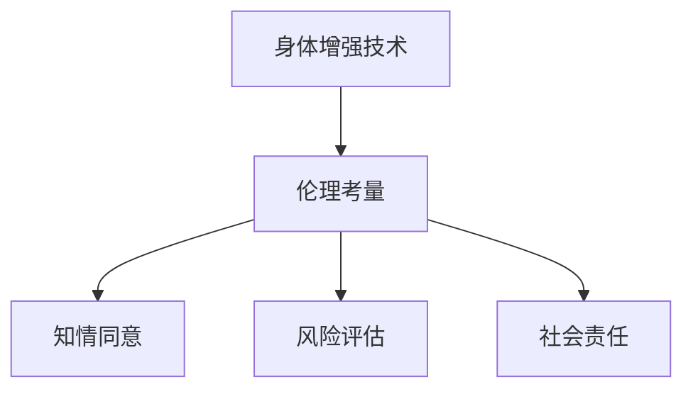

                 

# AI时代的人类增强：身体增强的道德考虑

## 1. 背景介绍

在AI时代，技术的飞速发展为人类社会带来了前所未有的便利与机遇，但同时也伴随着诸多伦理和道德挑战。其中，身体增强技术（Body Enhancement Technologies）以其潜在的巨大变革能力，引起了广泛的社会关注。身体增强不仅包括生物医学技术的运用，如基因编辑、器官移植、仿生机械等，也包括基于AI的虚拟现实（VR）、增强现实（AR）等技术的应用。

从根本上说，身体增强是通过提升人类身体的物理或认知功能，改善生活质量的技术手段。它能够帮助人们克服疾病、延长寿命、提高生产力，甚至实现人类机能的扩展与超越。然而，在追求这些技术进步的同时，我们也需要冷静地思考其可能带来的伦理问题，避免技术滥用，确保其在道德框架内的健康发展。

## 2. 核心概念与联系

### 2.1 核心概念概述

- **身体增强**：指通过技术手段增强人类的物理或认知能力，涵盖基因编辑、器官移植、仿生机械、AI驱动的虚拟现实等。
- **伦理考量**：指在应用身体增强技术时，应考虑的道德问题，如公平、正义、隐私、自主性等。
- **知情同意**：指在进行任何身体增强操作之前，必须确保参与者充分了解操作可能的风险与收益，并在知情的基础上给予同意。
- **风险评估**：指在应用身体增强技术之前，对其可能带来的风险进行全面评估，并采取相应的防范措施。
- **社会责任**：指身体增强技术研发与应用过程中，开发者、政府、社会应承担的伦理责任，确保技术的公平、安全与可持续发展。

这些核心概念之间存在密切联系。身体增强技术的研发与应用需要考虑到伦理道德的各个方面，而伦理道德问题又会对技术的发展产生深远的影响。只有在一个健全的伦理框架内，身体增强技术才能健康、有序地发展，造福全人类。

### 2.2 核心概念原理和架构的 Mermaid 流程图



## 3. 核心算法原理 & 具体操作步骤

### 3.1 算法原理概述

身体增强技术中，AI驱动的虚拟现实和增强现实是其重要的组成部分。AI通过学习人类的行为模式、环境感知，提供沉浸式体验，从而增强认知和身体功能。其核心算法原理包括以下几个方面：

1. **环境感知**：通过摄像头、传感器等设备，获取用户的环境信息，包括空间位置、物体特征等。
2. **行为预测**：利用深度学习模型（如CNN、RNN、Transformer等）预测用户的行为轨迹，预测其行动的合理性。
3. **虚拟空间构建**：根据环境感知和行为预测的结果，构建虚拟现实环境，用户可以在虚拟空间中进行互动和操作。
4. **交互反馈**：通过声音、触觉、视觉等反馈，增强用户的沉浸感和体验，进一步提升认知和身体功能。

### 3.2 算法步骤详解

基于上述核心算法原理，身体增强技术的开发和应用一般包括以下步骤：

1. **环境感知模块设计**：选择适合的传感器和设备，实现环境信息的实时采集。
2. **行为预测模型训练**：收集大量的行为数据，训练深度学习模型，预测用户行为。
3. **虚拟空间构建**：根据环境信息和行为预测结果，构建虚拟空间，设计合理的互动场景。
4. **交互反馈设计**：选择合适的反馈方式，如声音、触觉等，增强用户体验。
5. **系统集成与测试**：将各模块集成到统一的系统中，进行全面的测试和优化，确保系统的稳定性和可靠性。

### 3.3 算法优缺点

**优点**：

1. **沉浸体验**：通过虚拟现实和增强现实技术，提供沉浸式的用户体验，增强认知和身体功能。
2. **个性化定制**：根据用户偏好和需求，实现个性化的虚拟环境设计和反馈方式。
3. **多感官融合**：结合视觉、听觉、触觉等多感官信息，提升用户交互体验。

**缺点**：

1. **技术依赖**：依赖于高性能计算设备和数据采集设备，成本较高。
2. **环境适应性**：目前的技术在复杂、多变的环境下，可能适应性不足。
3. **用户体验问题**：长时间使用可能造成视觉疲劳，甚至引发身体不适。
4. **伦理争议**：可能引发隐私、自主性、公平性等伦理问题。

### 3.4 算法应用领域

基于AI的身体增强技术，已经在多个领域得到应用：

- **医疗康复**：利用虚拟现实技术，辅助康复训练，帮助残疾人恢复身体功能。
- **运动训练**：通过增强现实技术，提供虚拟教练指导，提升运动训练效果。
- **虚拟教育**：使用虚拟现实技术，模拟实验环境，增强教学效果。
- **军事训练**：利用虚拟现实和增强现实技术，进行模拟战场演练，提升士兵的实战能力。

## 4. 数学模型和公式 & 详细讲解 & 举例说明

### 4.1 数学模型构建

在身体增强技术中，环境感知和行为预测是核心部分。以行为预测为例，常用的深度学习模型为卷积神经网络（CNN）和循环神经网络（RNN）。下面以CNN为例，介绍其数学模型构建。

设输入为行为数据$X$，输出为行为预测结果$Y$，则行为预测问题可形式化为回归问题，即$Y=f(X)$。其中，$f$为行为预测函数。使用CNN模型进行训练时，输入$X$经过卷积层、池化层等操作，得到特征表示$H$。然后将$H$输入全连接层，得到预测结果$Y$。其数学模型为：

$$
Y=f(X)=W_h\sigma(H)+b
$$

其中，$W_h$和$b$为全连接层的权重和偏置项，$\sigma$为激活函数，$\sigma(H)=\frac{1}{1+e^{-H}}$为sigmoid激活函数。

### 4.2 公式推导过程

行为预测模型的训练过程主要分为前向传播和反向传播两个步骤。前向传播计算模型输出$Y$，反向传播计算损失函数$L$对权重$W_h$和偏置$b$的梯度，更新模型参数。

设训练集为$D=\{(x_i,y_i)\}_{i=1}^N$，损失函数为均方误差损失函数：

$$
L=\frac{1}{N}\sum_{i=1}^N (y_i-f(x_i))^2
$$

则反向传播时，损失函数对$W_h$的梯度为：

$$
\frac{\partial L}{\partial W_h}=\frac{\partial L}{\partial H}\frac{\partial H}{\partial W_h}=\frac{1}{N}\sum_{i=1}^N 2(y_i-f(x_i))(y_i-f(x_i))(H_i-W_h\sigma(H_i)-b)\sigma(H_i)(1-\sigma(H_i))
$$

其中$H_i$为输入$x_i$通过卷积层和池化层后的特征表示。

### 4.3 案例分析与讲解

以运动训练为例，假设用户进行跑步训练，系统通过传感器获取其速度、步频等数据。利用CNN模型预测用户的跑步节奏，输出最优的步频和速度。

首先，将原始数据预处理为适当的大小和格式，输入到CNN模型中进行训练。然后，将训练后的模型应用到实际运动训练中，根据实时采集的数据，预测和调整跑步节奏，提高训练效果。

## 5. 项目实践：代码实例和详细解释说明

### 5.1 开发环境搭建

在进行身体增强技术的项目实践前，需要搭建好开发环境。以下是使用Python进行TensorFlow开发的环境配置流程：

1. 安装Anaconda：从官网下载并安装Anaconda，用于创建独立的Python环境。

2. 创建并激活虚拟环境：
```bash
conda create -n tf-env python=3.8 
conda activate tf-env
```

3. 安装TensorFlow：根据CUDA版本，从官网获取对应的安装命令。例如：
```bash
conda install tensorflow
```

4. 安装TensorFlow Addons：用于增强TensorFlow的功能，例如对模型进行量化和剪枝。

```bash
conda install tensorflow-io
```

5. 安装各类工具包：
```bash
pip install numpy pandas scikit-learn matplotlib tqdm jupyter notebook ipython
```

完成上述步骤后，即可在`tf-env`环境中开始项目实践。

### 5.2 源代码详细实现

以下是使用TensorFlow实现跑步训练行为预测的代码示例：

```python
import tensorflow as tf
from tensorflow.keras import layers, models

# 定义行为预测模型
def build_model(input_shape, output_shape):
    model = models.Sequential([
        layers.Conv2D(32, (3, 3), activation='relu', input_shape=input_shape),
        layers.MaxPooling2D((2, 2)),
        layers.Conv2D(64, (3, 3), activation='relu'),
        layers.MaxPooling2D((2, 2)),
        layers.Flatten(),
        layers.Dense(64, activation='relu'),
        layers.Dense(output_shape, activation='sigmoid')
    ])
    return model

# 准备数据集
train_dataset = tf.data.Dataset.from_tensor_slices((train_data, train_labels))
train_dataset = train_dataset.shuffle(buffer_size=1024).batch(batch_size)

# 编译模型
model = build_model(input_shape, output_shape)
model.compile(optimizer='adam', loss='binary_crossentropy', metrics=['accuracy'])

# 训练模型
model.fit(train_dataset, epochs=10, validation_data=(val_data, val_labels))

# 使用模型进行预测
test_dataset = tf.data.Dataset.from_tensor_slices((test_data, test_labels))
test_dataset = test_dataset.batch(batch_size)
test_loss, test_accuracy = model.evaluate(test_dataset)
```

### 5.3 代码解读与分析

上述代码实现了跑步训练行为预测的深度学习模型。以下是关键代码的解读：

**build_model函数**：定义行为预测模型的结构。使用两个卷积层和两个池化层对输入数据进行处理，得到特征表示。然后通过两个全连接层输出预测结果。

**train_dataset和test_dataset**：分别从训练集和测试集中读取数据，并进行批处理和打乱操作。

**model.compile和model.fit**：编译模型，设置损失函数和优化器。训练模型，并指定训练轮数和验证集。

**model.evaluate**：使用测试集评估模型性能，输出损失和精度。

**模型预测**：使用训练好的模型对新数据进行预测，输出预测结果。

### 5.4 运行结果展示

训练过程中，可以使用TensorBoard可视化模型的训练效果，如损失函数和精度曲线等。

## 6. 实际应用场景

### 6.1 医疗康复

在医疗康复领域，身体增强技术具有重要的应用价值。通过虚拟现实技术，帮助残疾人士进行康复训练，恢复身体功能。例如，利用虚拟现实技术模拟失重的太空环境，帮助宇航员训练平衡和协调能力，预防肌肉萎缩和骨质疏松。

**实际案例**：NASA利用虚拟现实技术，为宇航员提供虚拟太空训练环境，帮助他们适应太空环境，提高任务执行能力。

### 6.2 运动训练

在运动训练领域，利用增强现实技术，提供虚拟教练指导，提升运动训练效果。例如，利用增强现实技术模拟竞技场景，帮助运动员进行模拟比赛训练。

**实际案例**：耐克利用增强现实技术，为运动爱好者提供虚拟教练指导，帮助他们进行体能训练和运动技巧的提升。

### 6.3 虚拟教育

在虚拟教育领域，利用虚拟现实和增强现实技术，模拟实验环境，增强教学效果。例如，利用虚拟现实技术，为学生提供虚拟实验室，进行化学实验操作和安全演练。

**实际案例**：哈佛大学利用虚拟现实技术，为医学学生提供虚拟手术训练环境，提高手术操作技能。

## 7. 工具和资源推荐

### 7.1 学习资源推荐

为了帮助开发者系统掌握身体增强技术的理论基础和实践技巧，这里推荐一些优质的学习资源：

1. TensorFlow官方文档：提供全面详细的TensorFlow教程和API文档，是学习TensorFlow的最佳资源。
2. OpenAI的博文系列：详细介绍了增强现实技术的基础知识和应用案例。
3. NVIDIA的GPU加速课程：介绍如何利用NVIDIA GPU进行深度学习训练，提升计算效率。
4. Google的机器学习课程：介绍机器学习的基础理论和算法，为身体增强技术提供理论支持。
5. Coursera的虚拟现实课程：介绍虚拟现实技术的原理和应用，为身体增强技术提供实践参考。

通过学习这些资源，相信你一定能够快速掌握身体增强技术的精髓，并用于解决实际的康复、训练、教育等问题。

### 7.2 开发工具推荐

高效的开发离不开优秀的工具支持。以下是几款用于身体增强技术开发的常用工具：

1. TensorFlow：基于Python的开源深度学习框架，灵活动态的计算图，适合快速迭代研究。
2. PyTorch：基于Python的深度学习框架，灵活性高，适合各种应用场景。
3. NVIDIA DGX-A100：高性能计算平台，适合大规模深度学习模型训练。
4. Oculus Rift：虚拟现实头显设备，提供沉浸式的虚拟现实体验。
5. Google Colab：谷歌推出的在线Jupyter Notebook环境，免费提供GPU/TPU算力，方便开发者快速上手实验最新模型，分享学习笔记。

合理利用这些工具，可以显著提升身体增强技术开发的速度和质量，加快创新迭代的步伐。

### 7.3 相关论文推荐

身体增强技术的发展源于学界的持续研究。以下是几篇奠基性的相关论文，推荐阅读：

1. "3D Vision for Wearable Health Monitoring Devices"：介绍3D计算机视觉技术在可穿戴设备中的应用，为身体增强技术提供硬件支持。
2. "Augmented Reality for Medical Training: A Review"：综述了增强现实技术在医疗培训中的应用，为身体增强技术提供理论支持。
3. "Deep Learning for Augmented Reality"：介绍深度学习技术在增强现实中的应用，为身体增强技术提供算法支持。
4. "Virtual Reality in Physical Rehabilitation: A Review"：综述了虚拟现实技术在物理康复中的应用，为身体增强技术提供实际案例。
5. "Body Enhancement Technologies: Ethical Considerations"：探讨身体增强技术中的伦理问题，为身体增强技术的可持续发展提供指导。

这些论文代表了大身体增强技术的发展脉络。通过学习这些前沿成果，可以帮助研究者把握学科前进方向，激发更多的创新灵感。

## 8. 总结：未来发展趋势与挑战

### 8.1 总结

本文对基于AI的身体增强技术进行了全面系统的介绍。首先阐述了身体增强技术的背景和意义，明确了其对于提升人类生活质量和生产力的重要价值。其次，从原理到实践，详细讲解了身体增强技术的核心算法和具体操作步骤，给出了具体的代码示例。同时，本文还广泛探讨了身体增强技术在医疗康复、运动训练、虚拟教育等多个行业领域的应用前景，展示了其广阔的应用范围。最后，本文精选了学习资源、开发工具和相关论文，力求为读者提供全方位的技术指引。

通过本文的系统梳理，可以看到，基于AI的身体增强技术正在成为医疗、运动、教育等领域的重要技术手段，显著提升了人类的生活质量和生产力。然而，在追求这些技术进步的同时，我们也必须认真思考其可能带来的伦理问题，确保其健康、有序地发展。

### 8.2 未来发展趋势

展望未来，身体增强技术将呈现以下几个发展趋势：

1. **技术进步**：伴随计算技术的不断进步，身体增强技术的精度和性能将不断提升，应用场景将更加多样化。
2. **多模态融合**：结合视觉、听觉、触觉等多模态信息，实现更加全面、立体的身体增强效果。
3. **普惠化应用**：通过开源项目和公共数据集，身体增强技术将更加普及，惠及更多人。
4. **伦理规范**：身体增强技术的应用将逐步建立健全的伦理规范，确保技术的公平、安全和可持续发展。

这些趋势凸显了身体增强技术的广阔前景。技术的不断进步和伦理规范的完善，必将使身体增强技术在医疗、运动、教育等领域发挥更大的作用，为人类社会带来更多福祉。

### 8.3 面临的挑战

尽管身体增强技术已经取得了显著进展，但在迈向更加智能化、普适化应用的过程中，它仍面临着诸多挑战：

1. **技术成熟度**：身体增强技术的算法和硬件仍在不断发展中，技术成熟度不足，仍需进一步优化和提升。
2. **数据隐私**：身体增强技术的应用涉及大量个人数据，数据隐私和安全问题亟需解决。
3. **伦理争议**：身体增强技术可能引发伦理争议，如自主性、公平性等问题，需要更多理论和实践的积累。
4. **成本问题**：高性能计算设备和数据采集设备的成本较高，制约了技术的应用普及。
5. **社会接受度**：身体增强技术的应用需要社会的广泛接受和认同，才能实现大规模落地。

这些挑战需要社会各界共同努力，积极探索解决方案，确保身体增强技术的健康、有序发展。

### 8.4 研究展望

面对身体增强技术面临的诸多挑战，未来的研究需要在以下几个方面寻求新的突破：

1. **多模态融合技术**：结合视觉、听觉、触觉等多模态信息，实现更加全面、立体的身体增强效果。
2. **隐私保护技术**：开发更加安全和隐私保护的数据采集和存储技术，确保用户数据安全。
3. **伦理规范制定**：建立健全的伦理规范，确保技术的公平、安全和可持续发展。
4. **普惠化应用策略**：通过开源项目和公共数据集，推广身体增强技术的普及应用，惠及更多人。
5. **社会接受度提升**：加强社会公众的科普教育和认知普及，提升社会对身体增强技术的接受度。

这些研究方向的探索，必将引领身体增强技术迈向更高的台阶，为人类社会带来更多福祉。面向未来，身体增强技术需要与其他AI技术进行更深入的融合，共同推动人类的健康与进步。

## 9. 附录：常见问题与解答

**Q1：身体增强技术是否适用于所有人群？**

A: 身体增强技术目前主要针对残障人士、运动员和科研人员等特定群体。然而，随着技术的不断发展，未来身体增强技术有望应用于更广泛的领域，如普通学生、老年人等。

**Q2：身体增强技术是否会导致伦理问题？**

A: 是的，身体增强技术可能引发伦理问题，如自主性、公平性、隐私等。需要在技术设计和应用过程中，严格遵循伦理规范，确保技术的健康发展。

**Q3：身体增强技术的成本问题如何解决？**

A: 目前，身体增强技术的硬件设备和数据采集成本较高。未来的解决方案包括降低硬件成本、优化算法性能、提高数据采集效率等。

**Q4：身体增强技术是否会对人类健康产生负面影响？**

A: 是的，身体增强技术可能引发健康问题，如过度依赖、依赖成瘾等。需要在技术设计和应用过程中，充分考虑健康风险，确保技术的安全性。

**Q5：身体增强技术如何应对伦理争议？**

A: 应对伦理争议的关键在于建立健全的伦理规范和监管机制，确保技术的公平、安全和可持续发展。同时，加强公众科普教育，提升社会对技术风险的认知。

---

作者：禅与计算机程序设计艺术 / Zen and the Art of Computer Programming

