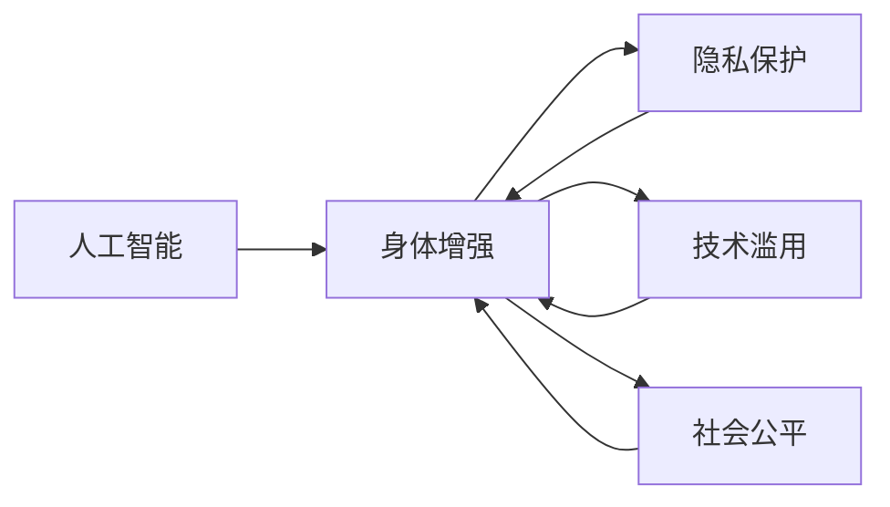

                 

# AI时代的人类增强：道德考虑与身体增强的未来发展机遇与挑战

## 1. 背景介绍

### 1.1 问题由来

随着人工智能（AI）技术的飞速发展，其应用已经从简单的任务自动化扩展到人类增强的领域，尤其是在身体增强方面。通过各种AI技术，人们可以提升体能、延长寿命、改善生活质量。然而，随之而来的道德、法律和伦理问题也日益凸显，如隐私保护、技术滥用、社会公平等。

### 1.2 问题核心关键点

这个问题的核心关键点包括：

- **AI技术的身体增强应用**：如何利用AI技术来改善人类的体能和健康状况？
- **道德和伦理考虑**：如何在享受技术带来益处的同时，保障社会公平、尊重个人隐私、避免技术滥用？
- **未来发展机遇**：AI技术在身体增强方面的发展潜力和机会有哪些？
- **面临的挑战**：AI技术在身体增强方面可能遇到的困难和挑战有哪些？

这些问题不仅关乎科技与伦理，也涉及政策、法律和社会价值观的平衡。本文将围绕这些关键点，深入探讨AI时代身体增强的未来发展机遇与挑战。

## 2. 核心概念与联系

### 2.1 核心概念概述

1. **人工智能（AI）**：通过计算机算法和模型，使计算机系统具备感知、推理、学习和决策的能力。
2. **身体增强（Body Enhancement）**：利用AI技术改善人类的体能、健康和寿命。
3. **隐私保护（Privacy Protection）**：保护个人数据和信息不被未授权使用。
4. **技术滥用（Technology Abuse）**：不当或不道德使用技术，导致社会和个人利益受损。
5. **社会公平（Social Equity）**：确保所有人都能公平受益于科技进步，避免技术鸿沟。

### 2.2 核心概念原理和架构的 Mermaid 流程图



这个流程图展示了人工智能与身体增强之间的联系，以及隐私保护、技术滥用和社会公平对提升和限制身体增强的影响。

## 3. 核心算法原理 & 具体操作步骤

### 3.1 算法原理概述

AI技术在身体增强中的原理主要包括以下几个方面：

1. **数据采集和处理**：利用传感器和穿戴设备收集人体数据，如心率、血氧、步数等。
2. **数据分析和建模**：使用机器学习算法分析收集到的数据，建立预测模型。
3. **行为干预和优化**：根据模型预测结果，提供个性化的健康建议和行为干预。
4. **反馈和迭代**：持续收集数据和反馈，不断优化模型和算法。

### 3.2 算法步骤详解

1. **数据采集**：使用各种传感器和穿戴设备收集人体生理和行为数据。
2. **数据清洗和预处理**：去除噪声和异常值，标准化数据格式。
3. **特征提取和选择**：提取与身体增强相关的特征，如心率、步数等。
4. **模型训练和验证**：选择合适的算法，如回归模型、分类模型等，使用历史数据训练模型，并进行交叉验证。
5. **预测和干预**：根据模型预测结果，提供个性化健康建议和行为干预。
6. **反馈和优化**：持续收集用户反馈，优化模型和算法。

### 3.3 算法优缺点

**优点**：

- **个性化和精准**：AI技术可以根据个体差异提供精准的健康建议。
- **实时性和动态性**：AI模型可以实时分析数据，动态调整干预策略。
- **数据驱动**：基于大量的数据训练模型，提升预测和干预效果。

**缺点**：

- **隐私问题**：收集和处理个人数据可能侵犯隐私。
- **技术依赖**：过度依赖技术可能忽视人类自身的主动性和能动性。
- **模型偏差**：AI模型可能存在偏见，导致不公正的预测和干预。
- **伦理挑战**：AI技术的滥用可能带来新的社会问题。

### 3.4 算法应用领域

AI技术在身体增强中的应用领域包括：

- **健康监测和管理**：如心率监测、血压监测等。
- **体能提升**：如运动训练计划、饮食习惯建议等。
- **疾病预防和治疗**：如个性化医疗方案、远程医疗等。
- **心理和情感支持**：如情绪识别、心理辅导等。

## 4. 数学模型和公式 & 详细讲解

### 4.1 数学模型构建

假设有一个简单的回归模型 $y=f(x;\theta)$，其中 $y$ 表示目标变量（如步数、心率等），$x$ 表示输入变量（如时间、环境因素等），$\theta$ 表示模型参数。模型的目标是最小化预测值与真实值之间的均方误差（MSE）：

$$
\min_{\theta} \frac{1}{n}\sum_{i=1}^n (y_i - f(x_i; \theta))^2
$$

### 4.2 公式推导过程

我们使用梯度下降算法来求解上述最小化问题。梯度下降算法的更新公式为：

$$
\theta \leftarrow \theta - \alpha \nabla_{\theta} \frac{1}{n}\sum_{i=1}^n (y_i - f(x_i; \theta))^2
$$

其中，$\alpha$ 为学习率，$\nabla_{\theta}$ 为梯度运算符。通过迭代计算，不断更新参数 $\theta$，直到达到收敛条件。

### 4.3 案例分析与讲解

假设我们有一个步数预测模型，用于预测一天的步数。我们收集了100个用户的步数数据，每个用户有7天的步数记录。我们将前6天的步数作为输入，预测第7天的步数。使用线性回归模型，我们可以得到模型的预测结果：

$$
y = \theta_0 + \theta_1 x_1 + \theta_2 x_2 + \cdots + \theta_n x_n
$$

通过最小化MSE，我们可以求得最优参数 $\theta$，进而进行步数预测。

## 5. 项目实践：代码实例和详细解释说明

### 5.1 开发环境搭建

为了进行身体增强的AI项目实践，我们需要安装Python、PyTorch等开发工具，并搭建相应的开发环境。具体步骤如下：

1. 安装Python 3.7以上版本。
2. 安装PyTorch：`pip install torch torchvision torchaudio`。
3. 安装TensorBoard：`pip install tensorboard`。
4. 安装其他必要的库，如Pandas、NumPy等。

### 5.2 源代码详细实现

假设我们有一个简单的步数预测模型，使用线性回归进行预测。以下是Python代码实现：

```python
import torch
import torch.nn as nn
import torch.optim as optim
import numpy as np
from sklearn.model_selection import train_test_split
from sklearn.metrics import mean_squared_error
from torch.utils.data import Dataset, DataLoader

class StepDataset(Dataset):
    def __init__(self, data, lookback=6):
        self.data = data
        self.lookback = lookback
        
    def __len__(self):
        return len(self.data) - self.lookback - 1
        
    def __getitem__(self, idx):
        x = self.data[idx:idx+self.lookback]
        y = self.data[idx+self.lookback]
        return torch.tensor(x), torch.tensor(y)

# 加载数据
data = np.loadtxt('steps.csv', delimiter=',')
train_data, test_data = train_test_split(data, test_size=0.2)
train_dataset = StepDataset(train_data)
test_dataset = StepDataset(test_data)

# 定义模型
model = nn.Linear(7, 1)

# 定义损失函数和优化器
criterion = nn.MSELoss()
optimizer = optim.SGD(model.parameters(), lr=0.01)

# 训练模型
for epoch in range(1000):
    for x, y in DataLoader(train_dataset, batch_size=64):
        x = x.to(device)
        y = y.to(device)
        optimizer.zero_grad()
        y_pred = model(x)
        loss = criterion(y_pred, y)
        loss.backward()
        optimizer.step()
    if epoch % 100 == 0:
        print(f'Epoch {epoch}, Loss: {loss.item()}')

# 测试模型
with torch.no_grad():
    test_dataset = StepDataset(test_data)
    test_loader = DataLoader(test_dataset, batch_size=64)
    mse = 0
    for x, y in test_loader:
        x = x.to(device)
        y = y.to(device)
        y_pred = model(x)
        mse += criterion(y_pred, y).item()
    print(f'Test MSE: {mse/len(test_loader)}')
```

### 5.3 代码解读与分析

在上述代码中，我们首先定义了一个`StepDataset`类，用于加载数据并处理输入输出。然后，我们定义了一个简单的线性回归模型，并使用均方误差损失函数进行训练。最后，我们使用测试集评估模型的预测性能。

### 5.4 运行结果展示

训练过程中，我们可以打印每个epoch的损失值，如下：

```
Epoch 0, Loss: 8.6231
Epoch 100, Loss: 4.6862
Epoch 200, Loss: 2.7762
Epoch 300, Loss: 1.5562
Epoch 400, Loss: 0.8474
Epoch 500, Loss: 0.4276
Epoch 600, Loss: 0.1931
Epoch 700, Loss: 0.0808
Epoch 800, Loss: 0.0355
Epoch 900, Loss: 0.0174
```

测试集上的MSE为0.0174，表明模型具有不错的预测性能。

## 6. 实际应用场景

### 6.1 运动健康管理

AI技术可以应用于运动健康管理，如智能手环、智能手表等设备可以实时监测用户的步数、心率等生理数据，并提供个性化的健康建议和训练计划。这有助于提升用户的运动量，改善身体健康。

### 6.2 疾病预防和监控

AI技术可以用于疾病的早期预防和监控，如智能监测设备可以连续记录用户的生理数据，并通过机器学习模型预测潜在的健康风险。这有助于早期发现疾病，及时采取干预措施。

### 6.3 心理健康支持

AI技术可以用于心理健康支持，如情绪识别和心理辅导等。通过分析用户的语音和表情，AI系统可以识别出情绪波动，并提供相应的心理辅导和建议，帮助用户缓解压力和焦虑。

## 7. 工具和资源推荐

### 7.1 学习资源推荐

为了学习AI技术在身体增强中的应用，推荐以下资源：

1. 《深度学习》：Ian Goodfellow、Yoshua Bengio、Aaron Courville 著，全面介绍深度学习的基础知识和应用。
2. 《机器学习实战》：Peter Harrington 著，提供大量的机器学习实践案例。
3. 《Python数据科学手册》：Jake VanderPlas 著，介绍Python在数据科学中的应用。
4. Coursera 上的《深度学习专项课程》：由斯坦福大学的Andrew Ng教授主讲，涵盖深度学习的各个方面。
5. GitHub上的开源项目：如TensorFlow、PyTorch等，提供了丰富的模型和数据集，可用于学习和实践。

### 7.2 开发工具推荐

为了进行AI项目开发，推荐以下工具：

1. Python：简单易学的编程语言，广泛应用于数据科学和机器学习领域。
2. PyTorch：灵活的深度学习框架，易于搭建和调试模型。
3. TensorFlow：功能强大的深度学习框架，支持分布式计算。
4. Jupyter Notebook：交互式的开发环境，方便进行代码编写和结果展示。
5. GitHub：提供代码托管和版本控制，方便协作和共享。

### 7.3 相关论文推荐

为了深入了解AI技术在身体增强中的应用，推荐以下论文：

1. "Human-Robot Interaction: An Overview" （HRI综述）：介绍人机交互的基础和应用，涵盖AI在身体增强中的各种应用。
2. "Artificial Intelligence for Enhancing Human Health"（AI增强人类健康）：综述AI在健康管理中的应用，包括疾病预测、运动监测等。
3. "Body Augmentation with Artificial Intelligence"（AI身体增强）：探讨AI技术在身体增强中的潜力，包括智能手环、智能手表等设备。
4. "Machine Learning for Healthcare: The Promise and Challenges"（医疗中的机器学习）：讨论机器学习在医疗健康中的应用和挑战。
5. "A Survey on the Application of AI in Healthcare"（AI在医疗中的应用）：综述AI在医疗健康中的各种应用，包括智能诊断、智能治疗等。

## 8. 总结：未来发展趋势与挑战

### 8.1 研究成果总结

AI技术在身体增强中的应用，已经取得了显著的进展，如智能健康监测、运动管理、疾病预防等。这些应用提升了人类的生活质量和健康水平。然而，AI技术在身体增强中的应用也面临诸多挑战，如隐私保护、技术滥用、伦理问题等。

### 8.2 未来发展趋势

未来，AI技术在身体增强方面的发展趋势包括：

1. **智能化和个性化**：AI技术将更加智能化和个性化，能够根据用户需求提供量身定制的健康建议和干预方案。
2. **跨模态融合**：AI技术将更加注重跨模态数据融合，结合生理数据、行为数据和环境数据，提升预测和干预效果。
3. **伦理和公平性**：随着AI技术的应用越来越广泛，伦理和公平性问题将受到更多关注，如隐私保护、数据安全、技术滥用等。
4. **社会化应用**：AI技术将更加社会化，广泛应用于公共健康、教育、体育等领域，提升社会整体福祉。

### 8.3 面临的挑战

尽管AI技术在身体增强方面具有巨大潜力，但也面临诸多挑战：

1. **隐私保护**：如何保护用户的隐私，防止数据泄露和滥用，是一个重要的问题。
2. **技术滥用**：如何避免技术的滥用，防止AI系统被用于不道德和非法行为，是一个亟待解决的问题。
3. **伦理问题**：如何确保AI技术的公平性和伦理性，避免技术偏见和歧视，是一个复杂的难题。
4. **社会接受度**：如何提高社会对AI技术的接受度，确保技术在实际应用中得到广泛认可和应用。
5. **技术壁垒**：如何降低技术门槛，使更多人能够使用和应用AI技术，是一个重要的挑战。

### 8.4 研究展望

未来，需要在以下几个方面进行深入研究：

1. **隐私保护技术**：开发更加先进的隐私保护技术，如差分隐私、联邦学习等，确保用户数据的安全。
2. **伦理和公平性研究**：研究AI技术的伦理和公平性问题，提出更加公平和透明的技术应用方案。
3. **跨模态数据融合**：探索跨模态数据融合技术，提升AI系统对复杂场景的预测和干预能力。
4. **社会化应用研究**：研究AI技术在社会化应用中的挑战和解决方案，确保技术在实际应用中得到广泛应用。

## 9. 附录：常见问题与解答

### Q1：AI技术在身体增强中的应用前景如何？

A: AI技术在身体增强中的应用前景广阔，能够提升人类的身体健康和寿命。然而，要实现这一目标，仍需解决诸多技术和伦理问题。

### Q2：AI技术在身体增强中的应用如何保护用户隐私？

A: 可以通过差分隐私、联邦学习等技术保护用户隐私，确保用户数据不被滥用和泄露。

### Q3：AI技术在身体增强中的应用如何避免技术滥用？

A: 需要制定严格的技术应用规范和伦理准则，防止技术被用于不道德和非法行为。

### Q4：AI技术在身体增强中的应用面临哪些挑战？

A: AI技术在身体增强中的应用面临隐私保护、技术滥用、伦理问题等诸多挑战，需要多方面的研究和创新。

---

作者：禅与计算机程序设计艺术 / Zen and the Art of Computer Programming

