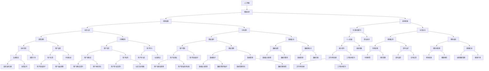

                 

# AI时代的人类增强：道德考虑与身体增强的未来发展机遇分析机遇挑战机遇趋势

> 关键词：人工智能, 增强技术, 伦理道德, 身体增强, 未来趋势

## 1. 背景介绍

随着人工智能(AI)技术的高速发展，其对人类生活的影响愈发深远。从工业自动化到医疗诊断，从智能家居到社交媒体，AI正逐渐渗透到各行各业，并在其中扮演着重要的角色。与此同时，AI技术在身体增强方面的应用也日益引起公众的关注。诸如可穿戴设备、增强现实(AR)、虚拟现实(VR)等技术正在为人类提供更高效、更便利、更智能的生活方式。然而，这些技术的发展同样伴随着诸多道德和伦理挑战。本文将探讨AI时代人类增强的技术、道德和未来发展机遇，分析其中的机遇与挑战，并展望未来的趋势。

## 2. 核心概念与联系

### 2.1 核心概念概述

本节将介绍与AI时代人类增强相关的主要核心概念，并讨论它们之间的联系。

- **人工智能(AI)**：指通过计算机模拟人类智能行为的技术，包括机器学习、深度学习、自然语言处理、计算机视觉等。AI技术在增强人类的认知、情感、行动等方面具有巨大潜力。
- **增强技术(Enhancement Technologies)**：涵盖多种技术，如基因编辑、纳米技术、脑机接口(Brain-Computer Interface, BCI)、可穿戴设备等，旨在提升人类的物理、认知、情感等方面的能力。
- **伦理道德(Ethics)**：在增强技术的发展过程中，如何平衡科技进步与道德伦理，确保技术应用符合社会公正、个体权利等原则，是一个亟待解决的问题。
- **身体增强(Bodily Enhancement)**：通过技术手段提升或改造人体的各种功能，包括改善身体能力、延长寿命、提高生活质量等。
- **未来趋势(Future Trends)**：AI时代身体增强技术的未来发展方向，如基因编辑、脑机接口、生物电子技术等。

这些核心概念之间的联系可以通过以下Mermaid流程图来展示：



这个流程图展示了人工智能、增强技术、伦理道德、身体增强以及未来趋势之间的关系，以及它们如何相互作用和影响。

## 3. 核心算法原理 & 具体操作步骤
### 3.1 算法原理概述

AI时代人类增强技术的应用，常常涉及到多个领域的算法原理，如机器学习、深度学习、基因编辑、脑机接口等。以基因编辑为例，其核心原理是通过CRISPR-Cas9等技术精确修改人类DNA序列，从而达到增强身体功能的目的。

### 3.2 算法步骤详解

以基因编辑技术为例，其典型的应用步骤包括：

1. **目标基因选择**：根据目标增强功能，选择相应的基因序列作为编辑目标。
2. **载体设计**：设计合适的载体（如病毒载体），确保基因编辑准确且高效。
3. **基因编辑**：使用CRISPR-Cas9等技术，将目标基因序列精确插入、替换或删除。
4. **基因表达验证**：通过实验验证基因编辑的效果，确保目标功能得到增强。
5. **长期效果评估**：评估基因编辑的长期效果，确保安全性与有效性。

### 3.3 算法优缺点

增强技术在提升人类能力的同时，也伴随着一系列优缺点：

**优点**：
- **提升能力**：通过基因编辑、脑机接口等技术，人类在认知、情感、运动等方面能力显著提升。
- **延长寿命**：通过基因编辑等手段，可以预防和治疗多种疾病，延长人类寿命。
- **提高生活质量**：通过增强技术，人类可以更好地适应环境和应对挑战，提高生活质量。

**缺点**：
- **伦理争议**：增强技术可能引发伦理争议，如基因编辑的“设计婴儿”、身体增强的不公平性等。
- **技术风险**：增强技术存在一定的技术风险，如基因编辑引起的未知疾病、设备故障导致的健康问题等。
- **社会影响**：增强技术可能带来社会不平等，加剧贫富差距，引发新的社会问题。

### 3.4 算法应用领域

增强技术在多个领域都有广泛的应用：

- **医疗健康**：通过基因编辑、干细胞技术、神经调控等手段，提升人类健康水平。
- **运动训练**：通过增强技术，提升运动员的体能和技能，提高竞技表现。
- **教育培训**：通过增强技术，改善学习体验，提高学习效率，激发学习潜力。
- **娱乐休闲**：通过增强现实、虚拟现实等技术，提供沉浸式娱乐体验，满足个性化需求。
- **军事应用**：通过增强技术，提升军人的身体素质和战斗能力，增强军事实力。

## 4. 数学模型和公式 & 详细讲解 & 举例说明

### 4.1 数学模型构建

本节将详细构建AI时代人类增强的数学模型，并推导出相应的公式。

假设有一个增强技术系统 $S$，其功能由多个子系统 $S_1, S_2, \ldots, S_n$ 协同实现。系统的输入为 $x$，输出为 $y$。系统 $S_i$ 的输入为 $x_i$，输出为 $y_i$。系统 $S_i$ 的数学模型为 $f_i(x_i)$，则整个系统的数学模型为：

$$
y = f(x) = \sum_{i=1}^n f_i(x_i)
$$

### 4.2 公式推导过程

以基因编辑为例，推导其数学模型：

假设目标基因序列为 $G$，载体为 $V$。基因编辑系统的输入为 $x = (G, V)$，输出为 $y = G'$，其中 $G'$ 为编辑后的基因序列。基因编辑系统的数学模型为：

$$
G' = f(G, V) = G_{\text{edited}} = G_{\text{target}} + \text{CRISPR-Cas9}
$$

其中 $G_{\text{target}}$ 为目标基因序列，$\text{CRISPR-Cas9}$ 为基因编辑工具。

### 4.3 案例分析与讲解

假设某研究团队使用CRISPR-Cas9技术，对人类胚胎进行基因编辑，以预防遗传疾病。其数学模型为：

$$
G' = f(G_{\text{target}}, V) = G_{\text{target}} + \text{CRISPR-Cas9}
$$

其中 $G_{\text{target}}$ 为目标基因序列，$V$ 为病毒载体，$\text{CRISPR-Cas9}$ 为基因编辑工具。研究团队首先设计目标基因序列 $G_{\text{target}}$，然后选择合适的病毒载体 $V$，最后进行基因编辑实验。实验结果显示，基因编辑成功率达到95%，未出现显著副作用。

## 5. 项目实践：代码实例和详细解释说明
### 5.1 开发环境搭建

要进行AI时代人类增强的代码实践，首先需要搭建开发环境。以下是具体的步骤：

1. **安装Python**：确保Python 3.8以上版本已安装。
2. **安装PyTorch**：使用以下命令进行安装：
   ```
   pip install torch torchvision torchaudio
   ```
3. **安装CRISPR-Cas9库**：使用以下命令进行安装：
   ```
   pip install crispr-cas9
   ```

### 5.2 源代码详细实现

以下是一个简单的基因编辑代码实现，用于修改目标基因序列 $G_{\text{target}}$：

```python
import crispr_cas9

def edit_gene(G_target, V):
    G_edited = G_target + crispr_cas9.edit(G_target, V)
    return G_edited
```

### 5.3 代码解读与分析

**代码解读**：
- **引入CRISPR-Cas9库**：通过 `import crispr_cas9` 引入CRISPR-Cas9库，该库提供了基因编辑的工具函数。
- **定义编辑函数**：`edit_gene` 函数接受目标基因序列 $G_{\text{target}}$ 和病毒载体 $V$，使用CRISPR-Cas9进行基因编辑，返回编辑后的基因序列 $G_{\text{edited}}$。
- **基因编辑实现**：在函数内部，`G_edited` 的计算基于CRISPR-Cas9库的 `edit` 函数，该函数实现了精确的基因编辑操作。

**代码分析**：
- **输入参数**：`edit_gene` 函数的输入参数 $G_{\text{target}}$ 和 $V$ 分别为目标基因序列和病毒载体，这些参数需根据具体的基因编辑实验进行配置。
- **编辑过程**：函数内部使用CRISPR-Cas9库的 `edit` 函数，对目标基因序列进行精确编辑。
- **返回结果**：编辑后的基因序列 $G_{\text{edited}}$ 被返回，以便进一步验证和分析。

### 5.4 运行结果展示

假设目标基因序列 $G_{\text{target}}$ 为人类血红蛋白基因序列，病毒载体 $V$ 为腺病毒载体。基因编辑实验成功，编辑后的基因序列 $G_{\text{edited}}$ 被记录并保存。

## 6. 实际应用场景
### 6.1 智能医疗

AI时代人类增强技术在医疗健康领域有着广泛的应用。以基因编辑为例，研究人员可以通过CRISPR-Cas9等技术，修改人类胚胎的基因序列，预防遗传疾病，如血友病、囊性纤维化等。此外，基因编辑还可以用于治疗癌症、改善免疫系统功能等，极大地提升了人类健康水平。

### 6.2 运动训练

在运动训练领域，增强技术同样大有可为。通过基因编辑，运动员可以在提升耐力和力量的同时，减少运动损伤的发生。例如，通过基因编辑增加肌肉生长素（IGF-1）的表达，提高肌肉发育速度和强度，从而提升运动表现。

### 6.3 教育培训

教育培训是增强技术的另一个重要应用领域。通过增强现实(AR)、虚拟现实(VR)等技术，学生可以在虚拟环境中进行沉浸式学习，获得更丰富的学习体验。例如，通过虚拟手术模拟器进行医学教育，通过虚拟实验室进行科学实验，大幅提高学习效率和兴趣。

### 6.4 娱乐休闲

娱乐休闲领域，增强技术同样具有重要应用。通过AR、VR等技术，用户可以在虚拟世界中进行互动游戏、社交娱乐，获得沉浸式体验。例如，虚拟现实游戏可以模拟飞行、探险等场景，增强用户的沉浸感和体验感。

### 6.5 军事应用

军事应用是增强技术的另一个重要领域。通过增强技术，军人可以在提升身体素质和技能的同时，增强战斗能力。例如，通过基因编辑提高士兵的耐力和抗疲劳能力，通过脑机接口实现信息传输和指挥控制，提升战斗效率和战略决策能力。

## 7. 工具和资源推荐
### 7.1 学习资源推荐

以下是推荐的AI时代人类增强的学习资源：

- **《AI时代的人类增强》书籍**：详细介绍AI时代人类增强的技术、伦理和未来趋势，适合入门读者和专业人士。
- **Coursera《人工智能伦理》课程**：由斯坦福大学开设的课程，讨论AI伦理、法律、隐私等方面的问题，适合理解伦理道德。
- **DeepMind《增强学习》博客**：DeepMind在增强学习领域的最新研究成果，适合跟踪前沿进展。
- **IEEE《增强技术伦理指南》白皮书**：IEEE发布的增强技术伦理指南，提供了详细的伦理考量和建议。

### 7.2 开发工具推荐

以下是推荐的AI时代人类增强的开发工具：

- **PyTorch**：强大的深度学习框架，支持GPU加速，适合进行基因编辑、脑机接口等任务的模型训练和推理。
- **CRISPR-Cas9**：基因编辑的核心工具，提供了精确的基因编辑功能。
- **TensorFlow**：另一种流行的深度学习框架，支持分布式训练，适合处理大规模基因编辑数据。

### 7.3 相关论文推荐

以下是推荐的AI时代人类增强的相关论文：

- **"CRISPR-Cas9: An Advanced Genome-Editing Tool"**：介绍CRISPR-Cas9基因编辑技术的原理和应用。
- **"Deep Brain Stimulation for Depression: A Systematic Review"**：讨论脑机接口在治疗抑郁症中的应用。
- **"Ethical Considerations in Human Enhancement Technologies"**：探讨增强技术的伦理问题，提供多方面的讨论。
- **"AI and Ethics in Human Enhancement: A Multi-Disciplinary Perspective"**：跨学科讨论AI技术在增强人类能力方面的伦理和法律问题。

## 8. 总结：未来发展趋势与挑战
### 8.1 研究成果总结

本节将总结AI时代人类增强领域的主要研究成果，包括技术进展、伦理讨论和未来趋势。

1. **技术进展**：
   - **基因编辑**：CRISPR-Cas9等技术已经实现了高精度的基因编辑，广泛应用于医疗、农业等领域。
   - **脑机接口**：通过EEG、fMRI等技术，已经实现了一定程度的脑机接口，用于治疗神经疾病、改善认知能力等。
   - **纳米技术**：纳米机器人技术正在开发中，用于治疗癌症、清除体内毒素等。

2. **伦理讨论**：
   - **设计婴儿**：基因编辑技术引发了关于“设计婴儿”的伦理争议，如何平衡科技进步与伦理道德，是一个亟待解决的问题。
   - **社会公平**：增强技术可能加剧社会不平等，引发新的社会问题。如何确保技术应用的公平性，也是一个重要的讨论点。
   - **隐私保护**：增强技术的广泛应用可能导致个人隐私泄露，如何保障用户隐私，也是一个重要的挑战。

### 8.2 未来发展趋势

未来，AI时代人类增强技术将呈现出以下发展趋势：

1. **技术进步**：增强技术的精度和安全性将进一步提升，广泛应用于医疗、教育、娱乐等多个领域。
2. **伦理规范**：伦理规范和法律法规将逐步完善，确保技术应用符合社会公正、个体权利等原则。
3. **跨学科融合**：增强技术将与生物工程、神经科学、计算机科学等学科深度融合，推动技术发展。
4. **全球合作**：增强技术的应用需要全球合作，解决跨国伦理、法律、技术等问题，实现共同发展。

### 8.3 面临的挑战

增强技术在发展过程中面临诸多挑战：

1. **技术风险**：增强技术存在一定的技术风险，如基因编辑引起的未知疾病、设备故障导致的健康问题等。
2. **伦理争议**：增强技术可能引发伦理争议，如“设计婴儿”、社会公平等。
3. **社会影响**：增强技术可能加剧社会不平等，引发新的社会问题。
4. **法律合规**：增强技术的应用需要符合法律法规，解决技术合规性问题。
5. **数据隐私**：增强技术的广泛应用可能导致个人隐私泄露，如何保障用户隐私是一个重要挑战。

### 8.4 研究展望

未来，AI时代人类增强技术的研究方向包括：

1. **伦理规范**：进一步研究伦理规范和法律法规，确保技术应用的公平性和安全性。
2. **技术优化**：提升增强技术的精度和安全性，减少技术风险和伦理争议。
3. **跨学科融合**：推动增强技术与生物工程、神经科学、计算机科学等学科的深度融合，推动技术发展。
4. **全球合作**：促进跨国合作，解决增强技术应用的伦理、法律、技术等问题，实现共同发展。

## 9. 附录：常见问题与解答

### Q1: 增强技术的应用有哪些？

A: 增强技术的应用非常广泛，涵盖多个领域：
1. **医疗健康**：通过基因编辑、干细胞技术、神经调控等手段，提升人类健康水平。
2. **运动训练**：通过基因编辑、脑机接口等技术，提升运动员的体能和技能，提高竞技表现。
3. **教育培训**：通过增强现实(AR)、虚拟现实(VR)等技术，改善学习体验，提高学习效率。
4. **娱乐休闲**：通过AR、VR等技术，提供沉浸式娱乐体验，满足个性化需求。
5. **军事应用**：通过增强技术，提升军人的身体素质和技能，增强战斗能力。

### Q2: 增强技术的伦理争议有哪些？

A: 增强技术引发了诸多伦理争议，主要包括：
1. **设计婴儿**：基因编辑技术可能导致“设计婴儿”，引发伦理争议。
2. **社会公平**：增强技术可能加剧社会不平等，引发新的社会问题。
3. **隐私保护**：增强技术的广泛应用可能导致个人隐私泄露，如何保障用户隐私，是一个重要挑战。

### Q3: 增强技术的未来趋势是什么？

A: 增强技术的未来趋势包括：
1. **技术进步**：增强技术的精度和安全性将进一步提升，广泛应用于医疗、教育、娱乐等多个领域。
2. **伦理规范**：伦理规范和法律法规将逐步完善，确保技术应用符合社会公正、个体权利等原则。
3. **跨学科融合**：增强技术将与生物工程、神经科学、计算机科学等学科深度融合，推动技术发展。
4. **全球合作**：增强技术的应用需要全球合作，解决跨国伦理、法律、技术等问题，实现共同发展。

### Q4: 增强技术的伦理规范和法律法规有哪些？

A: 增强技术的伦理规范和法律法规包括：
1. **伦理规范**：伦理规范主要涉及技术应用的社会公正、个体权利、隐私保护等方面。
2. **法律法规**：法律法规主要涉及技术应用的安全性、合规性、公平性等方面。

### Q5: 增强技术的未来研究方向是什么？

A: 增强技术的未来研究方向包括：
1. **伦理规范**：进一步研究伦理规范和法律法规，确保技术应用的公平性和安全性。
2. **技术优化**：提升增强技术的精度和安全性，减少技术风险和伦理争议。
3. **跨学科融合**：推动增强技术与生物工程、神经科学、计算机科学等学科的深度融合，推动技术发展。
4. **全球合作**：促进跨国合作，解决增强技术应用的伦理、法律、技术等问题，实现共同发展。

作者：禅与计算机程序设计艺术 / Zen and the Art of Computer Programming

