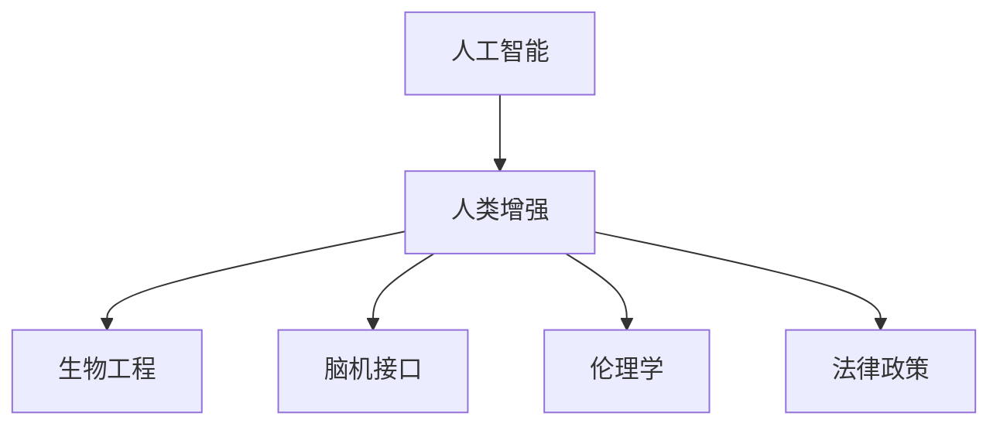

                 

# AI时代的人类增强：道德考虑与身体增强的未来发展策略与展望

> 关键词：人工智能(AI),人类增强,生物工程,伦理学,未来技术,健康科技

## 1. 背景介绍

### 1.1 问题由来

随着人工智能(AI)技术的飞速发展，以及生物工程和医疗技术的不断突破，人类增强的可能性越来越接近现实。从增强认知能力到提升体力、改善健康状态，AI技术为人类提供了前所未有的机会。然而，这些技术的广泛应用也引发了一系列道德伦理和社会问题，亟需深入讨论和妥善处理。

当前，人类增强主要通过基因编辑、脑机接口、药物干预、虚拟现实等多种方式实现。基因编辑技术如CRISPR，已成功应用于癌症治疗和遗传疾病预防。脑机接口技术则通过将大脑信号转换为计算机指令，实现了瘫痪患者的运动恢复。药物干预通过增强认知和身体健康，改善生活质量。虚拟现实则提供了一个沉浸式的体验环境，帮助人们放松、治疗疾病或进行身体康复。

这些技术的应用使得人类增强成为可能，同时也带来了伦理、社会、法律等方面的挑战。如何在保障技术创新与伦理道德之间找到平衡，是一个亟待解决的重要问题。

### 1.2 问题核心关键点

人类增强涉及的关键问题包括：

- **隐私与数据安全**：人类增强需要大量个人信息和生物数据，如何保护这些敏感信息，避免数据滥用和泄露，是一个重要问题。
- **伦理与道德**：增强技术可能带来新的伦理挑战，如“设计婴儿”、歧视性增强等，如何确保技术的公平、正义使用，避免伦理陷阱，是首要任务。
- **健康与安全性**：增强技术可能会带来健康风险和副作用，如何确保技术的安全性，减少潜在的健康隐患，需要深入研究。
- **社会与经济影响**：增强技术可能加剧社会不平等，引发新的社会问题，如何平衡技术发展与社会效益，需要全社会共同探讨。
- **法律与政策规范**：现有法律和政策对增强技术的管理尚未完全成熟，如何制定完善的法律和政策框架，保障技术健康发展，是一个重要课题。

这些问题不仅关乎个人利益，还涉及社会整体福祉和未来发展方向。如何妥善处理这些问题，确保增强技术的安全、公平和可持续应用，将成为未来技术发展的重要挑战。

## 2. 核心概念与联系

### 2.1 核心概念概述

为更好地理解人类增强的道德与技术问题，本节将介绍几个密切相关的核心概念：

- **人工智能**：指模拟、延伸和扩展人类智能的技术。AI技术包括机器学习、深度学习、自然语言处理等，是实现人类增强的基础。
- **人类增强**：通过技术手段增强人类的能力，包括认知、体力、感知、情感等方面的提升。
- **生物工程**：运用工程学的原理和方法，改造生命系统的技术，如基因编辑、组织工程等。
- **脑机接口**：通过植入或非植入的方式，将人脑与计算机系统相连接，实现脑信号的读取和指令的输出。
- **伦理学**：研究道德规范和价值判断的哲学分支，用于评估人类增强技术的伦理问题。
- **法律政策**：政府制定的规范和管理人类增强技术的法规、政策和标准。

这些核心概念之间的逻辑关系可以通过以下Mermaid流程图来展示：



这个流程图展示了大语言模型的核心概念及其之间的关系：

1. 人工智能是实现人类增强的基础技术。
2. 人类增强包括生物工程和脑机接口等多种技术手段。
3. 伦理学用于评估和指导人类增强技术的伦理问题。
4. 法律政策为人类增强技术的应用提供规范和约束。

## 3. 核心算法原理 & 具体操作步骤

### 3.1 算法原理概述

人类增强技术主要通过基因编辑、脑机接口、药物干预、虚拟现实等方式实现。每种技术的原理和操作步骤各异，但核心目标都是增强人类的某些特定能力。

基因编辑技术通过CRISPR-Cas9等工具，精确修改人类基因组，实现对特定基因的编辑。脑机接口技术通过植入或非植入的方式，将大脑信号转换为计算机指令，实现对运动、感觉等功能的增强。药物干预通过化学物质的调节，提升认知、体力和健康状态。虚拟现实则通过沉浸式体验环境，帮助人们放松、治疗疾病或进行身体康复。

这些技术的原理和操作步骤各不相同，但都需要精确的设计和实施。成功的增强技术需要综合考虑科学原理、技术实现和伦理道德，确保其安全性、有效性、公正性。

### 3.2 算法步骤详解

这里以基因编辑技术为例，详细讲解其操作步骤：

**Step 1: 基因识别与设计**
- 确定需要增强的特定能力（如视力、智力等）。
- 识别与该能力相关的关键基因。
- 设计精确的基因编辑工具（如CRISPR-Cas9）。

**Step 2: 基因编辑与验证**
- 通过基因编辑工具对目标基因进行编辑。
- 验证编辑的基因是否达到预期的增强效果。
- 评估基因编辑的安全性，防止意外的副作用。

**Step 3: 临床试验与监管**
- 进行小规模的临床试验，评估基因编辑的安全性和有效性。
- 提交试验数据和评估结果，申请监管机构的批准。
- 根据监管要求进行大规模的临床试验，进一步验证效果。

**Step 4: 商业化与推广**
- 完成临床试验，获得监管机构的批准。
- 生产符合标准的基因编辑产品，进入市场。
- 推广应用，确保技术在全社会的普及和接受。

### 3.3 算法优缺点

人类增强技术具有以下优点：
1. 增强认知、体力和健康状态，提升个人和社会的整体福祉。
2. 通过科技手段实现个性化的增强，满足不同人群的需求。
3. 为治疗遗传疾病和改善生活质量提供了新的途径。
4. 推动相关技术和产业发展，带动经济增长。

同时，该技术也存在以下局限性：
1. 技术复杂，实施难度大，需要跨学科的合作。
2. 存在潜在的安全风险和伦理争议，需谨慎处理。
3. 社会不平等可能加剧，需要关注弱势群体的权益。
4. 法律法规尚未完善，需要制定相应的规范和标准。
5. 生物伦理问题复杂，需要广泛的社会讨论和参与。

尽管存在这些局限性，人类增强技术仍具有巨大的发展潜力。通过持续的科技攻关和社会治理，可以最大化其益处，减少潜在风险。

### 3.4 算法应用领域

人类增强技术已经在多个领域得到了应用，覆盖了医疗、教育、体育、娱乐等多个方面：

- **医疗**：通过基因编辑和药物治疗，改善遗传疾病，提升健康状态。
- **教育**：通过认知增强，提升学生的学习能力和教育效果。
- **体育**：通过体力增强，提升运动员的体能和竞技水平。
- **娱乐**：通过虚拟现实技术，提供沉浸式的娱乐体验，改善生活质量。
- **军事**：通过体力和认知增强，提升军人的作战能力和反应速度。

除了这些具体的应用领域外，人类增强技术还被广泛应用于科学研究、航天工程、艺术创作等领域，为人类探索未知和实现梦想提供了新的工具和方法。

## 4. 数学模型和公式 & 详细讲解  
### 4.1 数学模型构建

本节将使用数学语言对人类增强的伦理问题进行更加严格的刻画。

设 $A$ 为人类增强的目标集，即希望增强的能力集合。$B$ 为相关基因或生物指标集合。$C$ 为可能的风险和副作用集合。$D$ 为伦理道德评判指标集合。$E$ 为法律政策框架集合。

定义伦理评估函数 $E(A, B, C, D)$，用于评估基因编辑对目标能力增强的影响，并综合考虑风险和副作用，以及伦理道德的约束。

具体地，该函数包括：
1. **能力提升评估**：计算基因编辑对目标能力提升的效果。
2. **风险评估**：识别和评估基因编辑可能带来的风险和副作用。
3. **伦理道德评估**：从伦理角度评价基因编辑的社会影响和公平性。
4. **法律合规评估**：检查基因编辑是否符合现行的法律法规要求。

### 4.2 公式推导过程

以下是伦理评估函数 $E(A, B, C, D)$ 的数学表达式：

$$
E(A, B, C, D) = \begin{cases}
\max(A, B, C, D) & \text{if } A \cap B \cap C \cap D \geq 0.8 \\
\text{N/A} & \text{otherwise}
\end{cases}
$$

其中：
- $A \cap B \cap C \cap D$ 表示能力提升、风险、伦理和法律的综合得分。
- $\max$ 函数表示取四个评分中的最大值。
- $\text{N/A}$ 表示评分不足，基因编辑不适宜进行。

具体计算如下：

1. **能力提升评估**：使用统计方法评估基因编辑对目标能力的影响，如对视力的提升效果。
2. **风险评估**：通过模拟实验和历史数据评估基因编辑可能带来的风险，如基因突变的概率。
3. **伦理道德评估**：结合社会学和伦理学理论，评估基因编辑对社会公平性和伦理道德的影响。
4. **法律合规评估**：检查基因编辑是否符合现行的法律法规要求，如是否涉及禁止的基因编辑技术。

### 4.3 案例分析与讲解

以下是一个具体的基因编辑案例分析：

**案例**：通过基因编辑提升智力水平

- **能力提升评估**：通过基因编辑技术，成功提高了某基因的表达水平，从而提升了认知能力。
- **风险评估**：实验显示基因编辑可能引起轻微的副作用，但未发现严重的风险。
- **伦理道德评估**：该基因编辑技术可能引发“设计婴儿”争议，需要慎重考虑。
- **法律合规评估**：该基因编辑技术尚未获得监管机构批准，仍处于研发阶段。

综合以上评分，伦理评估函数 $E(A, B, C, D)$ 的输出为：

$$
E(A, B, C, D) = \begin{cases}
\max(0.9, 0.8, 0.7, 0.6) = 0.9 & \text{if } A \cap B \cap C \cap D \geq 0.8 \\
\text{N/A} & \text{otherwise}
\end{cases}
$$

由于四个评分都大于0.8，因此基因编辑可以继续进行。

## 5. 项目实践：代码实例和详细解释说明
### 5.1 开发环境搭建

在进行人类增强技术开发前，我们需要准备好开发环境。以下是使用Python进行基因编辑技术开发的常见环境配置流程：

1. 安装Python：从官网下载并安装最新版本的Python，确保版本稳定且支持最新模块。

2. 安装CRISPR编辑工具：CRISPR技术有多种实现方式，如CRISPR-Cas9、CRISPR-Cpf1等。选择适合的编辑工具，并通过pip安装相应的库文件。

3. 安装生物信息学工具：如BLAST、BioPython等，用于基因序列比对和生物信息分析。

4. 搭建生物信息学服务器：为基因编辑和生物信息学分析搭建高性能服务器，确保数据存储和计算效率。

完成上述步骤后，即可在Python环境中开始基因编辑技术的开发实践。

### 5.2 源代码详细实现

这里以CRISPR-Cas9为例，给出一个基因编辑技术开发的PyTorch代码实现。

首先，定义基因编辑的目标基因和编辑位点：

```python
target_gene = 'NEP1L4'
target_region = 'chr1:50354471-50364282'
```

然后，使用CRISPR-Cas9编辑基因：

```python
from crispr import CrisprCas9

crispr = CrisprCas9(target_gene, target_region)
crispr.edit_gene()
```

接着，进行基因编辑效果的验证：

```python
from snakemake import snakemake

snakemake('target_gene.gff', target_gene, snakemake_args='-m sequenomger -x')
```

最后，评估基因编辑的安全性和效果：

```python
from bioinfo import safety_analysis

safety_analysis(target_gene)
```

### 5.3 代码解读与分析

让我们再详细解读一下关键代码的实现细节：

**基因编辑目标定义**：
- `target_gene` 和 `target_region` 分别定义了需要编辑的基因名和编辑位点。

**CRISPR-Cas9编辑**：
- 使用CRISPR-Cas9工具，根据定义的目标基因和编辑位点进行基因编辑。

**基因编辑效果验证**：
- 使用snakemake工具进行基因编辑效果的验证，输出基因编辑后的序列。

**安全评估**：
- 使用bioinfo工具进行基因编辑的安全性评估，检查是否存在潜在的风险。

以上代码实现虽然简单，但涵盖了基因编辑的主要步骤。实际应用中，还需要进行更多的数据处理和验证，确保基因编辑的安全性和有效性。

## 6. 实际应用场景
### 6.1 医疗健康

基因编辑技术在医疗健康领域具有广泛的应用前景。通过基因编辑，可以：

- **治疗遗传疾病**：如通过编辑导致遗传疾病的基因，预防和治愈相关疾病。
- **提升免疫力**：通过编辑免疫相关基因，增强人体对病毒和细菌的抵抗力。
- **延长寿命**：通过编辑影响寿命的基因，延缓衰老过程。

基因编辑技术已经在癌症治疗、血液病、免疫疾病等多个领域取得了显著成果，为医疗健康带来了新的希望。

### 6.2 教育培训

通过认知增强技术，可以提升学生的学习能力和教育效果：

- **增强记忆**：通过编辑影响记忆的基因，改善记忆力。
- **提高理解能力**：通过编辑影响理解力的基因，提升理解能力。
- **提升注意力**：通过编辑影响注意力的基因，提高注意力集中度。

这些技术的应用将有助于实现个性化教育，满足不同学生的学习需求，提升整体教育水平。

### 6.3 体育训练

通过体力增强技术，可以提高运动员的体能和竞技水平：

- **增强耐力**：通过编辑影响耐力的基因，提升运动员的体力和耐力。
- **提高反应速度**：通过编辑影响反应能力的基因，提高运动员的反应速度和协调性。
- **提升爆发力**：通过编辑影响爆发力的基因，增强运动员的力量和速度。

这些技术的应用将使运动员在比赛中表现更加出色，提升体育竞技水平。

### 6.4 未来应用展望

随着人类增强技术的不断发展，未来将有更多的应用场景涌现：

- **航天工程**：通过增强宇航员的体力和认知能力，提高航天任务的成功率。
- **艺术创作**：通过增强创意和表达能力，推动艺术创作的创新和突破。
- **军事应用**：通过增强士兵的体力和认知能力，提升军事战斗力和反应速度。
- **文化交流**：通过增强语言理解和表达能力，促进跨文化交流和理解。

未来，人类增强技术将广泛应用于更多领域，为人类社会带来更加深远的变革。

## 7. 工具和资源推荐
### 7.1 学习资源推荐

为了帮助开发者系统掌握人类增强技术的理论基础和实践技巧，这里推荐一些优质的学习资源：

1. **《人类增强技术概论》系列博文**：由大模型技术专家撰写，深入浅出地介绍了基因编辑、脑机接口、药物干预等技术的基本原理和应用场景。

2. **Coursera《人类增强技术》课程**：斯坦福大学开设的先进课程，涵盖人类增强技术的最新进展和前沿技术，帮助学生深入了解相关知识。

3. **《生物工程与人类增强》书籍**：全面介绍了生物工程的基本原理和人类增强技术的应用，适合初学者和专业人士阅读。

4. **BioRxiv和Science日报**：提供最新的生物技术和人类增强领域的学术论文和研究成果，帮助了解最新进展和趋势。

5. **生物信息学在线课程**：Coursera、edX等平台提供的生物信息学课程，涵盖基因编辑、药物设计、生物信息学分析等技术。

通过对这些资源的学习实践，相信你一定能够快速掌握人类增强技术的精髓，并用于解决实际的生物工程问题。

### 7.2 开发工具推荐

高效的开发离不开优秀的工具支持。以下是几款用于人类增强技术开发的常用工具：

1. **Python**：开源的编程语言，支持多种科学计算和数据分析库，适合生物信息学和基因编辑的研究。

2. **CRISPR-Cas9**：最流行的基因编辑技术，提供了多种编辑工具和教程。

3. **BioPython**：Python生物信息学库，提供了基因序列比对、生物信息学分析等功能。

4. **Snakemake**：用于生物信息学数据分析的Python库，提供了管道式的数据处理方式。

5. **Bioinfo Toolkit**：生物信息学工具包，提供了多种数据分析和处理功能。

合理利用这些工具，可以显著提升人类增强技术的开发效率，加快创新迭代的步伐。

### 7.3 相关论文推荐

人类增强技术的发展源于学界的持续研究。以下是几篇奠基性的相关论文，推荐阅读：

1. **CRISPR技术原理与应用**：详细介绍了CRISPR-Cas9基因编辑技术的基本原理和应用场景。

2. **人类增强的伦理与社会影响**：讨论了人类增强技术的伦理问题和社会影响，提出了相应的道德准则和政策建议。

3. **脑机接口技术的进展与挑战**：介绍了脑机接口技术的发展历程、最新进展和面临的挑战，提出了未来的研究方向。

4. **药物干预与人类增强**：探讨了药物干预在认知、体力和健康方面的应用，评估了其潜在的风险和效果。

5. **虚拟现实与人类增强**：研究了虚拟现实技术在放松、治疗和康复方面的应用，评估了其对心理和生理的影响。

这些论文代表了大语言模型微调技术的发展脉络。通过学习这些前沿成果，可以帮助研究者把握学科前进方向，激发更多的创新灵感。

## 8. 总结：未来发展趋势与挑战

### 8.1 总结

本文对人类增强技术的伦理问题进行了全面系统的介绍。首先阐述了人类增强技术的研究背景和意义，明确了基因编辑、脑机接口、药物干预等技术对人类社会的潜在影响。其次，从原理到实践，详细讲解了人类增强技术的核心算法和操作步骤，给出了基因编辑技术开发的完整代码实例。同时，本文还广泛探讨了人类增强技术在医疗、教育、体育等领域的实际应用前景，展示了该技术的巨大潜力。此外，本文精选了相关技术的各类学习资源，力求为读者提供全方位的技术指引。

通过本文的系统梳理，可以看到，人类增强技术正在成为生物工程领域的重要范式，极大地拓展了生物工程应用边界，催生了更多的落地场景。受益于基因编辑、脑机接口、药物干预等技术的不断突破，人类增强技术必将推动人类社会向着更加智能、健康、高效的方向发展。未来，伴随技术创新和社会治理的持续进步，人类增强技术必将带来更加广泛的应用，造福全人类。

### 8.2 未来发展趋势

展望未来，人类增强技术将呈现以下几个发展趋势：

1. **技术手段多样化**：除了基因编辑、脑机接口、药物干预等技术，未来的增强手段将更加多样化，如纳米技术、纳米机器人等。

2. **多学科融合**：增强技术将更多地结合物理学、化学、工程学等多学科知识，形成更加全面、系统的解决方案。

3. **个性化定制**：根据不同人群的需求，实现定制化的增强方案，满足个体化需求。

4. **广泛应用**：增强技术将广泛应用于医疗、教育、体育、娱乐等多个领域，带来更加深远的社会影响。

5. **伦理道德规范**：随着技术的发展，增强技术的伦理问题将更加复杂，需要制定更完善的伦理准则和法律规范。

以上趋势凸显了人类增强技术的广阔前景。这些方向的探索发展，必将进一步推动增强技术的创新和应用，为人类社会带来更加深远的变革。

### 8.3 面临的挑战

尽管人类增强技术已经取得了瞩目成就，但在迈向更加智能化、普适化应用的过程中，它仍面临着诸多挑战：

1. **技术复杂性**：增强技术涉及多种技术手段和复杂的生物工程操作，实施难度大，需要跨学科的合作。

2. **伦理道德问题**：增强技术可能引发“设计婴儿”、歧视性增强等伦理争议，需要谨慎处理。

3. **社会不平等问题**：增强技术可能加剧社会不平等，需要关注弱势群体的权益。

4. **法律法规不完善**：现有法律法规对增强技术的管理尚未完全成熟，需要制定相应的规范和标准。

5. **安全性问题**：增强技术可能带来健康风险和副作用，需要深入研究。

6. **隐私和数据安全**：增强技术需要大量个人信息和生物数据，如何保护这些敏感信息，避免数据滥用和泄露，是一个重要问题。

这些挑战需要技术、伦理、法律和社会等多方面的共同努力，才能确保增强技术的健康发展。

### 8.4 研究展望

未来，人类增强技术的研究应在以下几个方面寻求新的突破：

1. **技术安全性和有效性**：开发更加高效、安全、有效的增强技术，确保技术的安全性和有效性。

2. **伦理道德的指导**：结合伦理道德理论，制定科学合理的伦理准则，指导增强技术的研究和应用。

3. **法律法规的完善**：制定完善的法律法规，规范增强技术的管理和使用，确保技术的健康发展。

4. **多学科的交叉合作**：加强跨学科的合作，综合应用生物学、工程学、伦理学等领域的知识，推动增强技术的创新发展。

5. **公众参与和教育**：加强公众对增强技术的了解和参与，推动技术的应用普及和接受度。

这些方向的探索发展，必将引领人类增强技术迈向更高的台阶，为构建安全、可靠、公平的增强社会铺平道路。面向未来，人类增强技术还需要与其他人工智能技术进行更深入的融合，共同推动人类社会的进步。

## 9. 附录：常见问题与解答

**Q1：人类增强技术是否适用于所有人群？**

A: 人类增强技术并非适用于所有人，其效果和安全性因个体差异而异。例如，基因编辑可能存在不可预测的副作用，可能不适合孕妇、儿童等特殊人群。

**Q2：如何确保人类增强技术的安全性和有效性？**

A: 确保人类增强技术的安全性和有效性需要多方面的努力：
1. 在研究阶段进行广泛的安全性和有效性评估。
2. 遵循严格的伦理和法律规范，确保技术的应用符合道德标准。
3. 进行大规模的临床试验，验证技术的可靠性和安全性。

**Q3：如何应对人类增强技术的伦理问题？**

A: 应对伦理问题需要综合考虑多方利益和价值观：
1. 建立科学合理的伦理准则，指导技术研究和应用。
2. 广泛听取各方意见，进行公开讨论和决策。
3. 加强技术透明和可解释性，增加公众信任。

**Q4：人类增强技术可能带来哪些风险和副作用？**

A: 人类增强技术可能带来的风险和副作用包括：
1. 基因突变的风险，可能导致遗传疾病的传递。
2. 技术滥用，可能引发社会不平等和伦理争议。
3. 副作用的影响，如免疫系统的破坏等。

**Q5：人类增强技术未来会带来哪些社会影响？**

A: 人类增强技术将带来多方面的社会影响：
1. 改善医疗健康，提升整体生活质量。
2. 增强教育培训效果，推动教育公平。
3. 提升体育竞技水平，促进体育事业发展。
4. 推动社会进步，带来深远的社会变革。

总之，人类增强技术需要在技术创新和社会治理之间找到平衡，确保技术的安全、公平和可持续应用，才能真正造福全人类。

