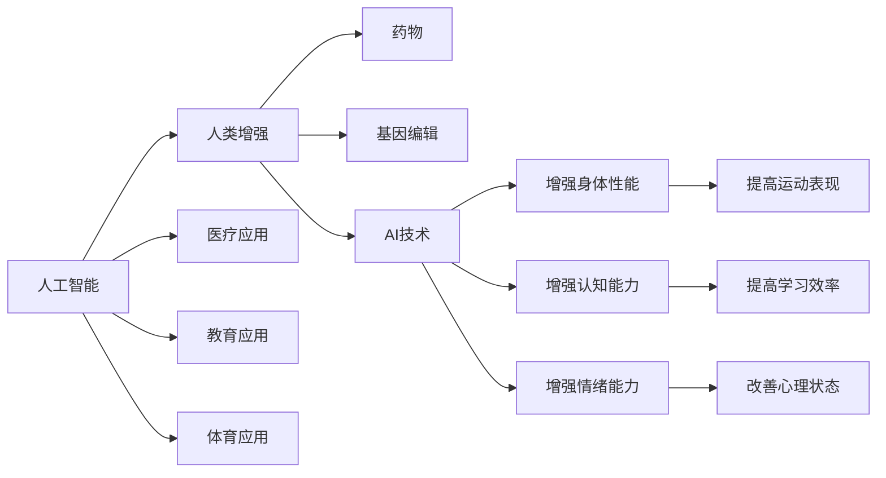

                 

# AI时代的人类增强：道德考虑与身体增强的未来方向

## 1. 背景介绍

随着人工智能技术的飞速发展，人类社会的各个方面正逐渐被AI所渗透。在医疗、交通、教育、金融等多个领域，AI正逐渐改变着人类的生产和生活方式。特别是在人类增强方面，AI技术的广泛应用，使得人类拥有了前所未有的提升自身能力的途径。然而，这一领域的发展也引发了一系列深刻的伦理道德和社会问题。本文旨在探讨AI时代下的人类增强，分析其在不同领域的应用，并深入讨论其中所涉及的道德问题和未来发展方向。

### 1.1 问题由来

在过去几十年中，AI技术的发展一直在加速。特别是深度学习算法和算力的提升，使得AI在图像识别、自然语言处理、决策支持等多个领域取得了显著的进展。这些技术的进步，极大地推动了人工智能的产业化应用。

在人类增强方面，AI技术的应用最为显著。例如，在医疗领域，AI可以辅助医生进行疾病诊断，预测病人发展趋势，提供个性化的治疗方案。在教育领域，AI可以定制个性化的学习计划，辅助教师教学，提高教学质量。在运动领域，AI可以训练运动员，预测比赛结果，优化训练方案。这些应用不仅提升了人类生活质量，也拓展了人类能力的应用边界。

然而，随着AI技术的深入应用，人类增强领域也面临一系列伦理道德和社会问题。例如，AI在医疗中的应用可能会导致医生对AI的依赖，降低医生的诊疗技能。在运动领域，AI的训练方案可能忽视了运动员的个人特性，导致过度训练甚至损伤。这些问题要求我们必须深思熟虑，确保AI技术的健康发展。

## 2. 核心概念与联系

### 2.1 核心概念概述

在探讨AI时代下的身体增强，我们需要理解以下几个核心概念：

- **人工智能**：人工智能（Artificial Intelligence，AI）是研究、开发用于模拟、延伸和扩展人的智能的理论、方法、技术及应用系统的一门新的技术科学。
- **人类增强**：人类增强（Human Augmentation）是指通过各种手段，如药物、基因编辑、AI技术等，提高人类的身体能力、认知能力、情绪能力等方面的能力。
- **道德**：道德是社会公认的行为规范和价值标准，是人类行为准则的重要组成部分。
- **身体增强技术**：身体增强技术（Body Enhancement Technology）是通过生物工程、基因编辑、AI技术等手段，提高人类的身体性能，包括力量、速度、耐力、认知能力等。

这些概念之间存在着紧密的联系，AI技术是实现人类增强的重要手段之一。AI技术在医疗、教育、体育等领域的应用，大大提升了人类的身体能力，但也带来了一系列伦理道德和社会问题。

### 2.2 核心概念原理和架构的 Mermaid 流程图



这个流程图展示了人工智能技术在人类增强中的重要作用。通过AI技术，可以实现多种形式的人类增强，包括身体性能、认知能力和情绪能力的提升。

## 3. 核心算法原理 & 具体操作步骤

### 3.1 算法原理概述

AI技术在人类增强中的应用，通常涉及以下几个核心算法原理：

- **数据采集与处理**：采集人体的各种数据，如运动轨迹、生理指标、表情数据等，然后通过AI技术进行处理和分析。
- **模式识别与分类**：利用深度学习等算法，对采集到的数据进行模式识别和分类，以实现对人类身体和认知状态的准确判断。
- **模型训练与优化**：利用大规模数据集，训练AI模型，并根据反馈数据不断优化模型，以提升预测精度和适应性。
- **智能决策与执行**：通过AI模型进行智能决策，并指导执行器（如机械臂、药物剂量的控制等）对人类进行增强。

### 3.2 算法步骤详解

AI时代下的人类增强，一般包括以下几个关键步骤：

**Step 1: 数据采集与处理**

- 选择合适的传感器和设备，采集人体的各种数据。例如，使用加速计采集运动轨迹，使用心率传感器采集生理指标等。
- 对采集到的数据进行清洗、预处理和标准化，以提高后续处理的准确性和效率。

**Step 2: 模式识别与分类**

- 使用深度学习等算法，对处理后的数据进行模式识别和分类。例如，使用卷积神经网络（CNN）对运动轨迹进行识别，使用循环神经网络（RNN）对生理指标进行预测等。
- 通过构建和训练模型，实现对人类身体和认知状态的准确判断。

**Step 3: 模型训练与优化**

- 利用大规模数据集，训练AI模型，并根据反馈数据不断优化模型，以提升预测精度和适应性。
- 在训练过程中，需要使用合适的优化算法和正则化技术，避免过拟合和欠拟合问题。

**Step 4: 智能决策与执行**

- 通过AI模型进行智能决策，并指导执行器（如机械臂、药物剂量的控制等）对人类进行增强。
- 在执行过程中，需要根据实时反馈数据进行动态调整，以确保增强效果的安全性和有效性。

### 3.3 算法优缺点

AI技术在人类增强中的应用，具有以下几个优点：

- **高效性**：AI技术可以实时处理和分析大量数据，快速进行决策和执行。
- **准确性**：AI模型通过大量数据训练，可以准确地预测和判断人类身体和认知状态。
- **灵活性**：AI模型可以根据不同的应用场景和需求，进行灵活调整和优化。

然而，AI技术在人类增强中也存在一些缺点：

- **数据隐私问题**：AI模型需要大量数据进行训练和优化，而这些数据往往涉及个人隐私，需要严格保护。
- **安全性和可靠性**：AI模型的决策和执行可能会受到外界干扰，导致不安全或不准确的情况。
- **道德和伦理问题**：AI技术的应用可能会导致一系列伦理道德问题，如依赖性、隐私泄露、社会不平等等。

### 3.4 算法应用领域

AI技术在人类增强中的应用，已经涵盖了多个领域，包括医疗、教育、体育等。具体应用场景如下：

- **医疗领域**：AI可以辅助医生进行疾病诊断、治疗方案优化等。例如，AI可以通过图像识别技术，识别X光片中的异常，辅助医生进行诊断；通过深度学习算法，对病人的健康数据进行分析，提出个性化的治疗方案。
- **教育领域**：AI可以定制个性化的学习计划，辅助教师教学，提高教学质量。例如，AI可以通过自然语言处理技术，分析学生的学习习惯和理解能力，提供相应的学习建议和资源。
- **体育领域**：AI可以训练运动员，预测比赛结果，优化训练方案。例如，AI可以通过分析运动员的运动轨迹和生理指标，发现其不足之处，提供个性化的训练建议。

## 4. 数学模型和公式 & 详细讲解 & 举例说明

### 4.1 数学模型构建

在AI技术应用于人类增强中，需要构建多个数学模型，以实现对人类身体和认知状态的准确判断。以下是几个典型的数学模型：

- **运动轨迹模型**：使用数学建模方法，对运动员的运动轨迹进行建模和分析。例如，可以使用卡尔曼滤波器对加速度和位置数据进行平滑处理，提取运动轨迹特征。
- **生理指标模型**：使用深度学习算法，对生理指标数据进行建模和预测。例如，可以使用卷积神经网络（CNN）对心率数据进行分类，使用循环神经网络（RNN）对血压数据进行预测。
- **学习行为模型**：使用机器学习算法，对学生的学习行为进行建模和分析。例如，可以使用支持向量机（SVM）对学生的学习时间、作业成绩等数据进行分类，使用长短期记忆网络（LSTM）对学生的学习行为进行预测。

### 4.2 公式推导过程

以下是几个典型数学模型的公式推导过程：

**运动轨迹模型**：

$$
\dot{x}(t) = f(x(t), u(t))
$$

其中，$x(t)$ 表示运动轨迹，$f(x(t), u(t))$ 表示运动状态和控制信号的映射关系，$u(t)$ 表示控制信号。

**生理指标模型**：

$$
y(t) = g(x(t))
$$

其中，$y(t)$ 表示生理指标数据，$g(x(t))$ 表示生理指标和运动轨迹的映射关系。

**学习行为模型**：

$$
y(t) = h(x(t))
$$

其中，$y(t)$ 表示学习行为，$h(x(t))$ 表示学习行为和运动轨迹的映射关系。

### 4.3 案例分析与讲解

以运动轨迹模型为例，我们分析AI技术在运动员训练中的应用。在运动员训练中，AI可以通过传感器采集运动员的运动轨迹和生理指标数据，通过卡尔曼滤波器进行平滑处理，提取运动轨迹特征。然后，使用深度学习算法对运动轨迹特征进行分析，判断运动员的运动状态和训练效果。最后，AI可以根据分析结果，生成个性化的训练方案，指导运动员进行训练。

## 5. 项目实践：代码实例和详细解释说明

### 5.1 开发环境搭建

在进行AI技术在人类增强中的应用实践前，我们需要准备好开发环境。以下是使用Python进行深度学习开发的常见环境配置流程：

1. 安装Anaconda：从官网下载并安装Anaconda，用于创建独立的Python环境。

2. 创建并激活虚拟环境：
```bash
conda create -n deep-learning-env python=3.7 
conda activate deep-learning-env
```

3. 安装深度学习框架：
```bash
conda install tensorflow==2.3.0 
conda install pytorch==1.7.0 
conda install mxnet==1.7.0 
conda install keras==2.4.3 
```

4. 安装其他相关工具包：
```bash
pip install numpy scipy pandas scikit-learn matplotlib seaborn joblib 
```

完成上述步骤后，即可在`deep-learning-env`环境中开始AI技术在人类增强中的应用实践。

### 5.2 源代码详细实现

以下是一个简单的运动轨迹分析模型的Python代码实现，包括数据采集、特征提取和模型训练：

```python
import numpy as np
import tensorflow as tf
from tensorflow.keras.models import Sequential
from tensorflow.keras.layers import Dense, LSTM

# 模拟采集到的运动轨迹数据
x_train = np.random.rand(100, 5)
y_train = np.random.rand(100)

# 定义模型
model = Sequential()
model.add(LSTM(64, input_shape=(5, 1)))
model.add(Dense(1, activation='sigmoid'))

# 编译模型
model.compile(optimizer='adam', loss='binary_crossentropy', metrics=['accuracy'])

# 训练模型
model.fit(x_train, y_train, epochs=10, batch_size=32)

# 预测新数据
x_test = np.random.rand(10, 5)
y_pred = model.predict(x_test)
```

这个代码实现了基于LSTM的简单的运动轨迹分析模型。通过采集到的运动轨迹数据，利用LSTM进行特征提取和建模，训练模型并进行预测。

### 5.3 代码解读与分析

这段代码中，我们使用了TensorFlow和Keras框架来实现一个基于LSTM的运动轨迹分析模型。首先，我们模拟采集到了100个运动轨迹数据，每个数据包含5个时间点的运动特征。然后，我们定义了一个包含LSTM层和全连接层的神经网络模型，并使用Adam优化器和二元交叉熵损失函数进行训练。最后，我们使用训练好的模型对10个新的运动轨迹数据进行预测，并输出预测结果。

## 6. 实际应用场景

### 6.1 运动领域

在运动领域，AI技术可以通过运动轨迹分析和生理指标预测，提高运动员的训练效果和比赛表现。例如，AI可以分析运动员在训练中的运动轨迹，发现其技术动作的不足之处，提供个性化的训练建议。AI还可以对运动员的生理指标进行实时监测，预测其疲劳程度，调整训练计划，避免过度训练和受伤。

### 6.2 教育领域

在教育领域，AI技术可以通过学习行为分析和个性化推荐，提高学生的学习效果和兴趣。例如，AI可以分析学生的学习时间、作业成绩等数据，预测其学习能力和兴趣点，提供个性化的学习建议和资源。AI还可以对学生的学习轨迹进行实时监测，发现其学习中的问题和不足，及时进行调整和指导。

### 6.3 医疗领域

在医疗领域，AI技术可以通过疾病诊断和病历分析，提高医生的诊疗水平和效率。例如，AI可以通过图像识别技术，识别医学影像中的异常，辅助医生进行诊断。AI还可以对病人的病历数据进行分析，提出个性化的治疗方案，优化诊疗流程。

### 6.4 未来应用展望

随着AI技术的不断进步，未来AI在人类增强中的应用将更加广泛和深入。我们可以预见到以下几个发展趋势：

- **多模态融合**：未来的AI技术将融合多模态数据（如运动轨迹、生理指标、表情数据等），实现对人类身体和认知状态的全面分析。
- **自适应学习**：未来的AI技术将能够自适应地调整学习模型，根据不同的应用场景和需求进行优化。
- **实时反馈**：未来的AI技术将能够实时反馈分析结果，指导用户进行及时调整和优化。

## 7. 工具和资源推荐

### 7.1 学习资源推荐

为了帮助开发者系统掌握AI技术在人类增强中的应用，这里推荐一些优质的学习资源：

1. **《深度学习》课程**：由吴恩达教授主讲，是深度学习领域的经典课程，涵盖了深度学习的基础知识和前沿应用。
2. **《机器学习实战》书籍**：详细介绍了机器学习的应用案例，包括运动轨迹分析和生理指标预测等。
3. **Kaggle平台**：一个数据科学和机器学习的社区平台，提供丰富的数据集和竞赛，可以帮助开发者实践和应用AI技术。

### 7.2 开发工具推荐

高效的工具支持可以显著提高AI技术在人类增强中的应用效率。以下是几款推荐的开发工具：

1. **TensorFlow和Keras**：深度学习框架，提供了丰富的API和工具，适合快速迭代研究。
2. **PyTorch**：另一个流行的深度学习框架，提供了动态计算图和丰富的研究工具，适合灵活开发和优化。
3. **Scikit-learn**：机器学习库，提供了丰富的算法和工具，适合进行特征提取和数据处理。

### 7.3 相关论文推荐

AI技术在人类增强中的应用涉及多个领域的最新研究成果。以下是几篇重要的相关论文，推荐阅读：

1. **《深度学习与医疗应用》**：介绍了深度学习在医疗诊断、治疗方案优化等应用中的表现。
2. **《机器学习在体育中的应用》**：探讨了机器学习在运动员训练、比赛结果预测中的应用。
3. **《智能教育中的机器学习应用》**：讨论了机器学习在学生学习行为分析、个性化推荐中的应用。

## 8. 总结：未来发展趋势与挑战

### 8.1 总结

本文对AI技术在人类增强中的应用进行了全面系统的介绍。首先，阐述了AI技术在医疗、教育、体育等领域的应用背景，分析了其在不同领域的应用。其次，从原理到实践，详细讲解了AI技术在人类增强中的关键步骤，给出了具体的代码实现。最后，讨论了AI技术在人类增强中的优缺点，以及其面临的伦理道德和社会问题。

通过本文的系统梳理，可以看到，AI技术在人类增强中的应用前景广阔，但也面临诸多挑战。如何平衡技术应用和伦理道德，确保AI技术的健康发展，是未来需要持续关注和探讨的课题。

### 8.2 未来发展趋势

展望未来，AI技术在人类增强中的应用将呈现以下几个发展趋势：

- **多模态融合**：未来的AI技术将融合多模态数据，实现对人类身体和认知状态的全面分析。
- **自适应学习**：未来的AI技术将能够自适应地调整学习模型，根据不同的应用场景和需求进行优化。
- **实时反馈**：未来的AI技术将能够实时反馈分析结果，指导用户进行及时调整和优化。

### 8.3 面临的挑战

尽管AI技术在人类增强中的应用前景广阔，但在迈向更加智能化、普适化应用的过程中，仍面临诸多挑战：

1. **数据隐私问题**：AI技术需要大量数据进行训练和优化，而这些数据往往涉及个人隐私，需要严格保护。
2. **安全性和可靠性**：AI模型的决策和执行可能会受到外界干扰，导致不安全或不准确的情况。
3. **道德和伦理问题**：AI技术的应用可能会导致一系列伦理道德问题，如依赖性、隐私泄露、社会不平等等。

### 8.4 研究展望

未来的研究需要在以下几个方面寻求新的突破：

- **数据隐私保护**：开发更加高效的数据隐私保护技术，确保AI技术的健康发展。
- **模型鲁棒性**：提高AI模型的鲁棒性，避免过拟合和欠拟合问题。
- **伦理道德约束**：在AI模型的训练和应用中引入伦理导向的评估指标，确保其符合人类价值观和伦理道德。

这些研究方向的探索，将引领AI技术在人类增强领域迈向更高的台阶，为构建安全、可靠、可解释、可控的智能系统铺平道路。面向未来，AI技术需要在数据、算法、工程、伦理等多个维度协同发力，才能真正实现人工智能技术在垂直行业的规模化落地。

## 9. 附录：常见问题与解答

**Q1：AI技术在人类增强中存在哪些伦理道德问题？**

A: AI技术在人类增强中存在多个伦理道德问题，主要包括以下几个方面：

1. **隐私问题**：AI技术需要大量数据进行训练和优化，而这些数据往往涉及个人隐私，需要严格保护。
2. **依赖性问题**：过度依赖AI技术，可能导致人类的能力和技能退化，丧失自主决策能力。
3. **社会不平等问题**：AI技术的普及可能会导致社会不平等，如贫富差距扩大、就业机会减少等。
4. **安全问题**：AI技术的决策和执行可能会受到外界干扰，导致不安全或不准确的情况。

这些问题需要我们在AI技术的应用过程中，严格遵循伦理道德规范，确保其健康发展。

**Q2：如何在AI技术的应用中保护数据隐私？**

A: 在AI技术的应用中，保护数据隐私至关重要。以下是一些保护数据隐私的措施：

1. **数据匿名化**：对数据进行匿名化处理，确保数据中不包含个人身份信息。
2. **差分隐私**：在数据采集和处理过程中，使用差分隐私技术，确保单个样本的隐私不被泄露。
3. **访问控制**：对数据进行严格的访问控制，确保只有授权人员才能访问和使用数据。
4. **加密技术**：对数据进行加密处理，确保数据在传输和存储过程中的安全性和隐私性。

这些措施可以有效保护数据隐私，确保AI技术在人类增强中的应用安全可靠。

**Q3：AI技术在人类增强中如何实现实时反馈？**

A: 实现AI技术在人类增强中的实时反馈，需要以下几个关键步骤：

1. **实时数据采集**：使用传感器等设备，实时采集人类的生理指标、运动轨迹等数据。
2. **数据处理和分析**：对采集到的数据进行实时处理和分析，生成反馈信息。
3. **动态调整**：根据实时反馈信息，动态调整训练计划和增强方案，确保其高效性和安全性。

这些步骤可以通过建立实时数据采集和处理系统，以及智能决策系统来实现。

**Q4：AI技术在人类增强中的应用需要遵循哪些伦理道德规范？**

A: 在AI技术在人类增强中的应用过程中，需要遵循以下伦理道德规范：

1. **数据隐私保护**：严格保护数据隐私，确保数据采集和处理过程中不泄露个人隐私。
2. **公平性原则**：确保AI技术的公平性和公正性，避免对特定群体造成不公平待遇。
3. **透明度和可解释性**：提高AI技术的透明度和可解释性，确保用户能够理解其决策和执行过程。
4. **责任和监管**：建立责任和监管机制，确保AI技术的应用符合法律法规和伦理道德规范。

这些伦理道德规范是AI技术在人类增强中应用的基础，确保其健康、安全和可持续的发展。

---

作者：禅与计算机程序设计艺术 / Zen and the Art of Computer Programming

