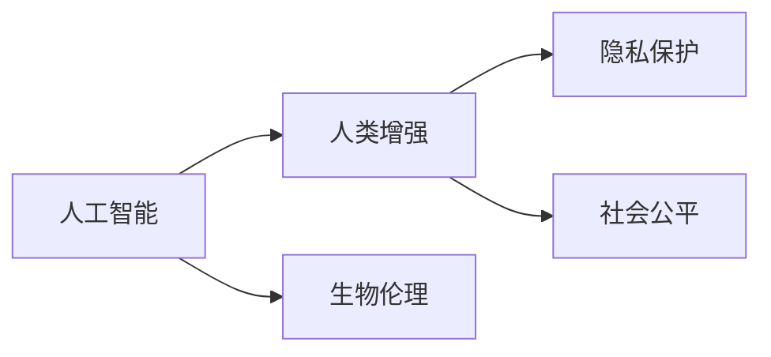

                 

# AI时代的人类增强：道德考虑和身体增强技术的挑战

## 1. 背景介绍

随着人工智能（AI）技术的飞速发展，人类社会正步入一个以智能为核心驱动力的全新时代。AI的广泛应用，不仅重塑了生产力和生产关系，也深刻影响了人类生活的方方面面。其中，AI驱动的身体增强技术（Physical Enhancement Technology），更是成为最具争议的话题之一。它不仅关乎技术进步和人类福祉，还涉及一系列复杂的伦理、法律和道德问题。

### 1.1 人类增强的兴起

人类增强技术主要指的是利用AI技术提升人类身体功能和认知能力的实践，包括但不限于生物工程、神经科学、基因编辑、脑机接口等领域。其核心目标是通过优化和升级人类生理和心理特征，实现更高效、更健康、更幸福的生活。然而，随着技术的进步，这一领域的探索逐渐走向了道德和法律的边缘。

### 1.2 伦理和法律的挑战

人类增强技术的发展引发了一系列伦理和法律问题。例如，基因编辑技术如CRISPR，虽然为治疗遗传疾病提供了新希望，但其潜在的社会公平性、生物安全性和伦理道德问题也引起了广泛关注。此外，增强技术的应用也可能引发就业、隐私、人权等社会问题，亟需制定相应的政策和法规进行规范。

## 2. 核心概念与联系

### 2.1 核心概念概述

要深入探讨AI时代的人类增强问题，首先需要明确一系列核心概念及其相互关系。以下是几个关键概念：

- **人工智能（AI）**：利用算法和计算技术模拟人类智能的科学和工程领域。
- **人类增强（Human Enhancement）**：通过技术手段提升人类的身体和认知能力，包括但不限于基因编辑、脑机接口、神经调控等。
- **生物伦理（Bioethics）**：研究与人类生物学相关的伦理问题，如基因编辑、克隆等。
- **隐私保护（Privacy Protection）**：保护个人信息，防止其被非法获取和滥用。
- **社会公平（Social Equity）**：确保技术进步惠及社会各阶层，避免技术鸿沟。

这些概念之间的逻辑关系可以通过以下Mermaid流程图来展示：



这个流程图展示了人工智能、人类增强、生物伦理、隐私保护和社会公平之间的内在联系。

## 3. 核心算法原理 & 具体操作步骤

### 3.1 算法原理概述

AI驱动的人类增强技术涉及多种算法和模型，但核心原理可归纳为以下几个方面：

- **数据驱动的模型训练**：通过大量生物和生理数据，训练出能够预测和优化人类生理特征的AI模型。
- **神经调控技术**：通过脑机接口等技术，实时监控和调节大脑活动，增强认知和行为能力。
- **基因编辑技术**：利用CRISPR等基因编辑工具，修改基因序列，修复遗传疾病或增强特定能力。
- **虚拟现实（VR）与增强现实（AR）**：通过虚拟和增强现实技术，提供沉浸式训练和模拟环境，提升身体和认知能力。

### 3.2 算法步骤详解

以基因编辑技术为例，其操作步骤可以大致分为以下几个环节：

1. **基因序列分析**：使用AI算法分析目标基因序列，确定需要修改的具体位置和突变类型。
2. **设计指导RNA（gRNA）**：根据分析结果设计gRNA，指导CRISPR-Cas9系统精确切割DNA双链。
3. **细胞培养与基因编辑**：将目标细胞置于CRISPR-Cas9系统中，进行基因编辑。
4. **编辑效果评估**：通过分子生物学技术，评估基因编辑效果，验证是否达到预期目的。
5. **临床试验与伦理审查**：在实验室基础上进行大规模临床试验，同时接受伦理委员会的严格审查。

### 3.3 算法优缺点

人类增强技术的算法优势主要体现在以下几个方面：

- **精准性**：AI驱动的基因编辑技术具有高度的精准性，能够在基因层面实现精确的修复和增强。
- **效率高**：自动化和计算机辅助的流程大大提高了基因编辑的效率，缩短了研发周期。
- **应用广泛**：技术覆盖基因组学、神经科学、医学等多个领域，具有广泛的潜在应用。

然而，这些技术也存在一些显著的局限和风险：

- **伦理争议**：基因编辑技术可能引发一系列伦理问题，如设计婴儿、基因歧视等。
- **社会公平性**：技术的不平等访问可能导致贫富差距和社会不公。
- **安全风险**：基因编辑可能带来不可预测的副作用，甚至引发生态和遗传多样性问题。
- **隐私保护**：大规模基因数据的应用可能引发隐私泄露和数据滥用问题。

### 3.4 算法应用领域

人类增强技术的应用领域非常广泛，涵盖了医疗健康、体育训练、军事防御、教育培训等多个领域。例如，在医疗领域，基因编辑技术可用于治疗遗传性疾病，如镰状细胞贫血、囊性纤维化等。在体育领域，通过神经调控技术提升运动员的注意力和反应速度。在军事领域，通过增强现实技术进行虚拟训练，提高作战效率。在教育领域，利用VR技术提供沉浸式学习体验，提升教学效果。

## 4. 数学模型和公式 & 详细讲解

### 4.1 数学模型构建

在基因编辑技术中，AI模型主要用于基因序列分析和设计。以基因序列分析为例，构建的数学模型可以表示为：

$$ f(x) = W^T \cdot h(W \cdot x + b) + c $$

其中，$x$ 为输入的基因序列，$h$ 为隐藏层激活函数，$W$ 和 $b$ 为模型参数，$c$ 为常数项。

### 4.2 公式推导过程

以基因编辑中的指导RNA（gRNA）设计为例，推导过程如下：

1. **序列比对**：将目标基因序列与参考序列进行比对，确定需要编辑的特定区域。
2. **位点选择**：使用AI算法预测最优编辑位点，确保编辑效果最大化。
3. **gRNA设计**：根据预测位点设计gRNA序列，确保与目标位点精确匹配。

### 4.3 案例分析与讲解

以CRISPR-Cas9技术为例，基因编辑的具体步骤如下：

1. **gRNA设计**：设计能够精确识别目标基因位点的gRNA序列。
2. **Cas9蛋白结合**：将gRNA与Cas9蛋白结合，形成复合物。
3. **DNA双链切割**：复合物进入目标细胞，根据gRNA引导，Cas9蛋白切割DNA双链。
4. **基因修复**：细胞利用自身的DNA修复机制，修复切割产生的双链断裂，实现基因编辑。
5. **效果评估**：通过PCR等技术，评估基因编辑效果，确认目标基因是否成功修改。

## 5. 项目实践：代码实例和详细解释说明

### 5.1 开发环境搭建

为了进行基因编辑技术的具体实践，需要以下开发环境：

1. **Python编程语言**：广泛支持科学计算和机器学习库。
2. **Jupyter Notebook**：交互式编程和数据可视化工具。
3. **CRISPR-Cas9工具**：如CRISPR Director等，用于设计gRNA和实现基因编辑。

### 5.2 源代码详细实现

以下是一个简单的基因序列分析代码示例：

```python
import numpy as np
from sklearn.neural_network import MLPRegressor

# 构建基因序列分析模型
X = np.random.rand(100, 10)  # 随机生成的基因序列数据
y = np.random.rand(100, 1)   # 随机生成的基因编辑效果

model = MLPRegressor(hidden_layer_sizes=(10, 10), activation='relu', solver='adam')
model.fit(X, y)

# 预测新基因序列的编辑效果
new_X = np.random.rand(10, 10)
new_y = model.predict(new_X)
print(new_y)
```

### 5.3 代码解读与分析

在这个代码示例中，我们使用MLPRegressor模型进行基因序列分析和预测。首先，我们生成100个随机基因序列和对应的编辑效果，然后训练一个多层感知器（MLP）模型。在模型训练完成后，我们可以使用训练好的模型对新的基因序列进行预测。

## 6. 实际应用场景

### 6.1 医疗健康

在医疗健康领域，基因编辑技术具有广阔的应用前景。例如，利用基因编辑技术治疗遗传性疾病，如脊髓性肌萎缩症（SMA）、地中海贫血等。此外，基因编辑还可以用于癌症免疫治疗，增强患者对免疫系统的反应能力，提高治疗效果。

### 6.2 体育训练

在体育训练领域，神经调控技术被广泛应用于提升运动员的认知和身体能力。例如，通过脑机接口技术，实时监测和调节运动员的大脑活动，提升其注意力、反应速度和决策能力。

### 6.3 军事防御

在军事防御领域，增强现实技术被广泛应用于虚拟训练和模拟演习。通过VR和AR技术，士兵可以在虚拟环境中进行实战演练，提高作战效率和反应速度。

### 6.4 教育培训

在教育培训领域，VR和AR技术被广泛应用于模拟实验和虚拟课堂。通过沉浸式学习体验，学生能够更好地理解和掌握复杂知识点，提升教学效果。

## 7. 工具和资源推荐

### 7.1 学习资源推荐

为了帮助开发者系统掌握人类增强技术的理论基础和实践技巧，这里推荐一些优质的学习资源：

1. **《人类增强技术：伦理、法律和社会影响》**：一本全面介绍人类增强技术及其伦理、法律和社会影响的书籍。
2. **Coursera上的《基因编辑技术》课程**：由斯坦福大学开设，涵盖基因编辑技术的原理、应用和伦理问题。
3. **Bioethics and Society的论文集**：收集了大量关于人类增强技术伦理问题的研究论文，适合深入学习。

### 7.2 开发工具推荐

高效的工具支持是成功开发人类增强技术的重要保障。以下是几款常用工具：

1. **Python编程语言**：灵活性强，广泛支持科学计算和机器学习库。
2. **Jupyter Notebook**：交互式编程和数据可视化工具。
3. **CRISPR-Cas9工具**：如CRISPR Director等，用于设计gRNA和实现基因编辑。
4. **Biopython**：生物信息学编程库，提供大量基因编辑和数据分析工具。
5. **DeepLearning4J**：深度学习框架，支持大规模神经网络模型训练。

### 7.3 相关论文推荐

人类增强技术的发展源于学界的持续研究。以下是几篇奠基性的相关论文，推荐阅读：

1. **《CRISPR-Cas9的基因编辑原理和应用》**：详细介绍了CRISPR-Cas9技术的工作原理和基因编辑方法。
2. **《神经调控技术在体育训练中的应用》**：探讨了神经调控技术在提升运动员认知和身体能力方面的潜力。
3. **《基因编辑技术的伦理和社会影响》**：分析了基因编辑技术可能引发的伦理和社会问题，提出了一系列应对策略。

## 8. 总结：未来发展趋势与挑战

### 8.1 研究成果总结

人类增强技术的发展离不开学界和产业界的共同努力。经过多年的探索，该领域取得了显著的进展，但依然面临许多挑战。

### 8.2 未来发展趋势

展望未来，人类增强技术将呈现以下几个发展趋势：

1. **技术不断进步**：随着AI和神经科学的不断发展，基因编辑和神经调控技术将更加精准和高效。
2. **应用领域扩大**：人类增强技术将应用于更多领域，如教育、娱乐、心理健康等。
3. **伦理和社会讨论深化**：随着技术的发展，社会对人类增强技术的伦理和法律问题的讨论将更加深入。
4. **国际合作加强**：全球科技竞争的加剧将促使各国加强在人类增强技术领域的合作。

### 8.3 面临的挑战

尽管人类增强技术取得了一定进展，但在迈向更加智能化、普适化应用的过程中，仍面临诸多挑战：

1. **伦理争议**：基因编辑技术可能引发一系列伦理问题，如设计婴儿、基因歧视等。
2. **社会公平性**：技术的不平等访问可能导致贫富差距和社会不公。
3. **安全风险**：基因编辑可能带来不可预测的副作用，甚至引发生态和遗传多样性问题。
4. **隐私保护**：大规模基因数据的应用可能引发隐私泄露和数据滥用问题。

### 8.4 研究展望

未来，人类增强技术的研究需要在以下几个方面寻求新的突破：

1. **技术创新**：开发更加精准、高效、安全的基因编辑和神经调控技术。
2. **伦理和社会讨论**：建立完善的人类增强技术伦理和社会讨论机制，促进公众理解和技术接受。
3. **国际合作**：加强国际科技合作，制定全球统一的技术标准和伦理规范。

## 9. 附录：常见问题与解答

**Q1：什么是人类增强技术？**

A: 人类增强技术指的是利用AI技术提升人类身体和认知能力的实践，包括但不限于基因编辑、脑机接口、神经调控等。

**Q2：人类增强技术的应用场景有哪些？**

A: 人类增强技术的应用场景非常广泛，涵盖了医疗健康、体育训练、军事防御、教育培训等多个领域。

**Q3：基因编辑技术可能带来哪些风险？**

A: 基因编辑技术可能带来伦理争议、社会公平性问题、安全风险和隐私保护问题。

**Q4：如何应对人类增强技术的伦理和社会问题？**

A: 应对人类增强技术的伦理和社会问题，需要建立完善的伦理和社会讨论机制，确保技术的公正和透明。

**Q5：未来人类增强技术的发展趋势是什么？**

A: 未来人类增强技术的发展趋势是技术不断进步、应用领域扩大、伦理和社会讨论深化、国际合作加强。

---

作者：禅与计算机程序设计艺术 / Zen and the Art of Computer Programming

