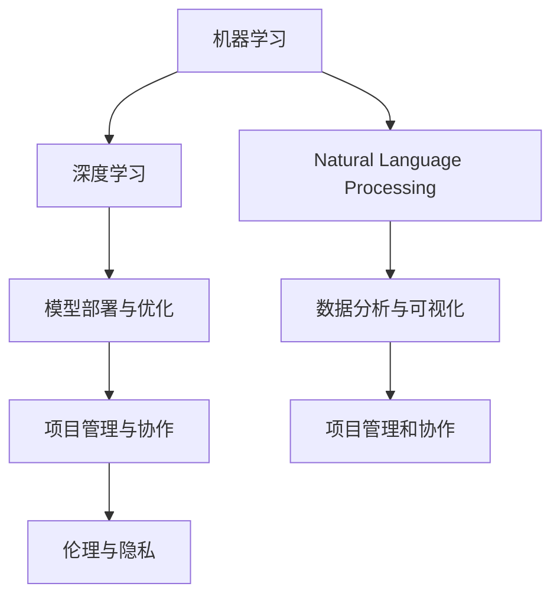

                 

# AI时代程序员必备技能

在数字化、智能化飞速发展的今天，AI技术已经渗透到各个行业，从智能推荐、自动驾驶到医疗诊断、金融风控，AI的应用无处不在。面对AI浪潮的兴起，程序员必须紧跟时代步伐，掌握必要的AI技能，以保持竞争力。本文将详细介绍AI时代程序员必备的技能，涵盖机器学习、深度学习、自然语言处理等多个方向，为读者提供全面系统的技术指引。

## 1. 背景介绍

### 1.1 问题由来
随着人工智能技术的不断发展，程序员面临的挑战也在不断升级。AI技术的深入应用，要求程序员不仅掌握传统的软件开发技能，还要了解机器学习、深度学习、自然语言处理等前沿技术，以实现高效开发和智能化应用。然而，由于AI技术涉及多学科知识，许多程序员难以全面掌握。为此，本文将系统梳理AI时代程序员必备的技能，帮助读者在技术浪潮中游刃有余。

### 1.2 问题核心关键点
AI时代程序员必备的技能包括但不限于：
- 机器学习基础
- 深度学习框架
- 自然语言处理（NLP）
- 数据分析与可视化
- 模型部署与优化
- 项目管理与协作
- 伦理与隐私

这些技能不仅帮助程序员应对当前的AI应用，还为未来的技术发展奠定了坚实的基础。

## 2. 核心概念与联系

### 2.1 核心概念概述

为更好地理解AI时代程序员必备的技能，本节将介绍几个密切相关的核心概念：

- 机器学习：一种利用数据和算法使计算机系统从经验中学习的技术，通过归纳推理和模式识别，使计算机能够执行某些特定任务。
- 深度学习：机器学习的一个子领域，通过多层神经网络进行特征提取和模式识别，用于图像识别、语音识别、自然语言处理等复杂任务。
- 自然语言处理（NLP）：使计算机能够理解、处理和生成自然语言的技术，包括文本分析、文本生成、机器翻译等。
- 数据分析与可视化：通过数据收集、清洗、分析和可视化，揭示数据背后的规律和趋势，为决策提供支持。
- 模型部署与优化：将训练好的模型应用到实际生产环境，并进行性能调优，以提升模型效率和准确性。
- 项目管理与协作：项目管理技能确保项目按时按质完成，协作技能则促进跨团队、跨领域的合作与交流。
- 伦理与隐私：确保AI技术的开发和应用符合伦理标准，保护用户隐私，避免偏见和歧视。

这些核心概念之间的逻辑关系可以通过以下Mermaid流程图来展示：



这个流程图展示了一系列核心概念及其之间的关系：

1. 机器学习是基础，深度学习是其一个子领域。
2. 自然语言处理是机器学习的重要应用方向。
3. 模型部署与优化、数据分析与可视化是机器学习、深度学习任务的具体实践环节。
4. 项目管理与协作是保障项目成功的重要因素。
5. 伦理与隐私是AI技术应用必须遵守的原则。

这些概念共同构成了AI时代程序员的知识体系，助力其在技术创新和业务应用中游刃有余。

## 3. 核心算法原理 & 具体操作步骤
### 3.1 算法原理概述

AI时代程序员必备的技能涵盖了多个领域的算法和技术，以下重点介绍几个核心算法原理和具体操作步骤：

- 线性回归与逻辑回归：线性回归用于预测连续值，逻辑回归用于预测二分类问题。
- 决策树与随机森林：基于特征空间的分割，决策树和随机森林能够处理分类和回归问题。
- 支持向量机（SVM）：通过寻找最优超平面，SVM能够在高维空间中实现分类和回归。
- 卷积神经网络（CNN）：通过卷积层和池化层提取图像特征，用于图像识别和分类。
- 循环神经网络（RNN）与长短期记忆网络（LSTM）：通过时间步序列处理，RNN和LSTM用于文本生成和机器翻译。
- 注意力机制：通过自注意力机制，使模型能够动态选择输入特征，提升模型性能。
- 生成对抗网络（GAN）：通过对抗训练，生成对抗网络能够生成逼真的图像和文本。

### 3.2 算法步骤详解

以下以线性回归算法为例，详细讲解其具体操作步骤：

1. 数据准备：收集和清洗数据集，确保数据质量和完整性。
2. 特征工程：选择合适的特征，并进行特征缩放和标准化。
3. 模型训练：使用梯度下降算法优化模型参数，最小化预测误差。
4. 模型评估：使用测试集评估模型性能，确定模型参数。
5. 模型优化：调整模型超参数，如学习率、迭代次数等，进一步提升模型精度。

### 3.3 算法优缺点

AI时代程序员必备的技能各有优缺点，需根据具体任务选择合适的方法：

- 线性回归：简单易懂，适合小规模数据，但难以处理非线性问题。
- 决策树：易于解释，但容易过拟合，需要通过剪枝和随机森林等方法改进。
- 支持向量机：在高维空间中表现优异，但计算复杂度高。
- 卷积神经网络：适用于图像处理，需要大量标注数据和计算资源。
- 循环神经网络：能够处理序列数据，但训练复杂度高，需要大量时间。
- 注意力机制：能够提升模型性能，但实现复杂度较高。
- 生成对抗网络：生成高质量的图像和文本，但训练过程不稳定。

### 3.4 算法应用领域

AI时代程序员必备的技能广泛应用于多个领域，如：

- 金融风控：利用机器学习和深度学习进行信用评分、欺诈检测等。
- 医疗诊断：通过自然语言处理和深度学习分析医学影像和病历，辅助医生诊断。
- 自动驾驶：结合计算机视觉和深度学习，实现车辆自主导航。
- 智能推荐：通过数据分析和机器学习推荐系统，提升用户体验。
- 语音识别：利用深度学习和自然语言处理技术，实现语音到文本的转换。
- 智能客服：结合自然语言处理和机器学习，实现自动客服和问答系统。

## 4. 数学模型和公式 & 详细讲解 & 举例说明

### 4.1 数学模型构建

以下以线性回归模型为例，构建数学模型：

假设已知样本集 $(x_i, y_i)$，其中 $x_i \in \mathbb{R}^n$ 为特征向量，$y_i \in \mathbb{R}$ 为目标值。构建线性回归模型：

$$
y_i = \theta^T x_i + b
$$

其中 $\theta$ 为模型参数，$b$ 为偏置项。目标是最小化预测误差：

$$
\min_{\theta} \sum_{i=1}^N (y_i - \theta^T x_i - b)^2
$$

### 4.2 公式推导过程

在线性回归模型中，最小化误差的目标函数可转化为优化问题：

$$
\min_{\theta} \frac{1}{2N} \sum_{i=1}^N (y_i - \theta^T x_i - b)^2
$$

通过对误差函数求导，可得参数 $\theta$ 和偏置 $b$ 的求解公式：

$$
\theta = (\sum_{i=1}^N x_i x_i^T)^{-1} \sum_{i=1}^N x_i y_i
$$

$$
b = \bar{y} - \theta^T \bar{x}
$$

其中 $\bar{x}$ 和 $\bar{y}$ 分别为特征向量和目标值的均值。

### 4.3 案例分析与讲解

假设有一个房价预测任务，已知数据集包含房屋面积 $x_i$ 和价格 $y_i$，使用线性回归模型进行预测。

首先，对数据进行特征工程，选择房屋面积作为特征 $x_i$，预测价格 $y_i$。

然后，使用梯度下降算法优化模型参数 $\theta$ 和 $b$，最小化预测误差。

最后，使用测试集评估模型性能，确定模型参数。

## 5. 项目实践：代码实例和详细解释说明

### 5.1 开发环境搭建

在进行项目实践前，我们需要准备好开发环境。以下是使用Python进行PyTorch开发的环境配置流程：

1. 安装Anaconda：从官网下载并安装Anaconda，用于创建独立的Python环境。

2. 创建并激活虚拟环境：
```bash
conda create -n pytorch-env python=3.8 
conda activate pytorch-env
```

3. 安装PyTorch：根据CUDA版本，从官网获取对应的安装命令。例如：
```bash
conda install pytorch torchvision torchaudio cudatoolkit=11.1 -c pytorch -c conda-forge
```

4. 安装Transformers库：
```bash
pip install transformers
```

5. 安装各类工具包：
```bash
pip install numpy pandas scikit-learn matplotlib tqdm jupyter notebook ipython
```

完成上述步骤后，即可在`pytorch-env`环境中开始项目实践。

### 5.2 源代码详细实现

下面以房价预测为例，给出使用PyTorch进行线性回归的代码实现。

首先，定义线性回归模型：

```python
import torch
import torch.nn as nn

class LinearRegression(nn.Module):
    def __init__(self, input_dim):
        super(LinearRegression, self).__init__()
        self.linear = nn.Linear(input_dim, 1)
        
    def forward(self, x):
        return self.linear(x)
```

然后，定义损失函数和优化器：

```python
criterion = nn.MSELoss()
optimizer = torch.optim.SGD(model.parameters(), lr=0.01)
```

接着，定义训练和评估函数：

```python
def train_epoch(model, data_loader, optimizer, criterion):
    model.train()
    loss_sum = 0
    for data, target in data_loader:
        optimizer.zero_grad()
        output = model(data)
        loss = criterion(output, target)
        loss_sum += loss.item()
        loss.backward()
        optimizer.step()
    return loss_sum / len(data_loader)

def evaluate(model, data_loader, criterion):
    model.eval()
    loss_sum = 0
    for data, target in data_loader:
        output = model(data)
        loss = criterion(output, target)
        loss_sum += loss.item()
    return loss_sum / len(data_loader)
```

最后，启动训练流程并在测试集上评估：

```python
epochs = 1000
batch_size = 32
learning_rate = 0.01

train_loader = ...
test_loader = ...

model = LinearRegression(input_dim)
criterion = nn.MSELoss()
optimizer = torch.optim.SGD(model.parameters(), lr=learning_rate)

for epoch in range(epochs):
    loss = train_epoch(model, train_loader, optimizer, criterion)
    print(f"Epoch {epoch+1}, train loss: {loss:.3f}")
    
    print(f"Epoch {epoch+1}, test loss: {evaluate(model, test_loader, criterion):.3f}")
```

以上就是使用PyTorch进行线性回归的完整代码实现。可以看到，借助PyTorch的封装，线性回归模型的实现变得简洁高效。

### 5.3 代码解读与分析

让我们再详细解读一下关键代码的实现细节：

**LinearRegression类**：
- `__init__`方法：初始化模型参数。
- `forward`方法：定义模型前向传播的计算流程。

**损失函数和优化器**：
- `nn.MSELoss`：均方误差损失函数，用于衡量模型预测值和真实值之间的差异。
- `torch.optim.SGD`：随机梯度下降优化器，用于更新模型参数。

**训练和评估函数**：
- `train_epoch`函数：对数据集进行迭代，使用随机梯度下降算法更新模型参数。
- `evaluate`函数：在测试集上评估模型性能，计算损失函数。

**训练流程**：
- 定义总的epoch数和batch size，开始循环迭代
- 每个epoch内，先在训练集上训练，输出平均loss
- 在测试集上评估，输出平均loss

可以看到，PyTorch配合TensorFlow库使得线性回归的代码实现变得简洁高效。开发者可以将更多精力放在数据处理、模型改进等高层逻辑上，而不必过多关注底层的实现细节。

当然，工业级的系统实现还需考虑更多因素，如模型的保存和部署、超参数的自动搜索、更灵活的任务适配层等。但核心的机器学习算法基本与此类似。

## 6. 实际应用场景

### 6.1 金融风控

在金融风控领域，AI技术可以用于信用评分、欺诈检测、反洗钱等任务。通过机器学习模型，金融机构可以更准确地评估客户的信用风险，及时发现潜在的欺诈行为，保护自身利益。

### 6.2 医疗诊断

AI技术在医疗领域的应用同样广泛，可以用于病历分析、影像诊断、基因分析等。通过深度学习和自然语言处理技术，AI可以帮助医生更快速、准确地诊断疾病，提高诊疗效率和质量。

### 6.3 自动驾驶

自动驾驶是AI技术的另一个重要应用领域，通过计算机视觉和深度学习，自动驾驶系统可以实现车辆的自主导航和避障。AI技术的应用，使自动驾驶更加安全和可靠。

### 6.4 智能推荐

AI技术在电商、新闻、社交媒体等领域也有广泛应用。通过数据分析和机器学习，AI可以帮助平台推荐用户感兴趣的内容，提升用户体验和平台粘性。

### 6.5 语音识别

语音识别是AI技术的另一个重要方向，通过深度学习和自然语言处理技术，AI可以将语音转换成文本，实现语音助手、智能客服等功能。

### 6.6 智能客服

智能客服是AI技术的重要应用之一，通过自然语言处理和机器学习，AI可以处理用户咨询，提供快速、准确的答复，提高客户满意度。

## 7. 工具和资源推荐

### 7.1 学习资源推荐

为了帮助程序员系统掌握AI时代必备的技能，这里推荐一些优质的学习资源：

1. 《机器学习》系列书籍：由机器学习领域的经典教材，系统介绍机器学习的基础理论和算法。
2. 《深度学习》系列课程：斯坦福大学、Coursera等平台的深度学习课程，涵盖深度学习的基本概念和实现。
3. 《自然语言处理》系列书籍：介绍自然语言处理的基本技术和应用，涵盖文本分析、机器翻译等方向。
4. 《Python数据科学手册》：介绍Python在数据科学中的应用，包括数据分析、可视化等技能。
5. 《TensorFlow官方文档》：提供详细的TensorFlow框架使用指南和样例代码。
6. 《Kaggle竞赛平台》：提供大量数据集和竞赛，锻炼实战能力。

通过对这些资源的学习实践，相信你一定能够快速掌握AI时代程序员必备的技能，并用于解决实际的AI问题。

### 7.2 开发工具推荐

高效的开发离不开优秀的工具支持。以下是几款用于AI开发常用的工具：

1. Python：简单易学，生态丰富，是AI开发的首选语言。
2. PyTorch：基于Python的开源深度学习框架，灵活的动态计算图，适合快速迭代研究。
3. TensorFlow：由Google主导开发的开源深度学习框架，生产部署方便，适合大规模工程应用。
4. Weights & Biases：模型训练的实验跟踪工具，可以记录和可视化模型训练过程中的各项指标，方便对比和调优。
5. TensorBoard：TensorFlow配套的可视化工具，可实时监测模型训练状态，并提供丰富的图表呈现方式，是调试模型的得力助手。

合理利用这些工具，可以显著提升AI开发效率，加快创新迭代的步伐。

### 7.3 相关论文推荐

AI技术的发展源于学界的持续研究。以下是几篇奠基性的相关论文，推荐阅读：

1. 《深度学习》论文：深度学习领域的经典论文，介绍深度神经网络的架构和训练方法。
2. 《自然语言处理综述》论文：综述自然语言处理领域的经典算法和应用。
3. 《机器学习算法综述》论文：综述机器学习领域的经典算法和应用。
4. 《计算机视觉与模式识别》论文：综述计算机视觉领域的经典算法和应用。
5. 《强化学习综述》论文：综述强化学习领域的经典算法和应用。

这些论文代表了大数据、人工智能技术的发展脉络。通过学习这些前沿成果，可以帮助程序员掌握最新的AI技术，推动技术创新。

## 8. 总结：未来发展趋势与挑战

### 8.1 总结

本文对AI时代程序员必备的技能进行了全面系统的介绍。首先阐述了AI技术的发展背景和趋势，明确了程序员需要掌握的多个方向的技能。其次，从原理到实践，详细讲解了线性回归、决策树、卷积神经网络等核心算法，并给出了具体的代码实现。同时，本文还探讨了AI技术在金融风控、医疗诊断、自动驾驶等多个领域的实际应用，展示了AI技术的广阔前景。此外，本文精选了AI技术的各类学习资源和工具，力求为程序员提供全方位的技术指引。

通过本文的系统梳理，可以看到，AI时代程序员必备的技能涵盖了机器学习、深度学习、自然语言处理等多个方向，为程序员应对未来的技术挑战奠定了坚实的基础。AI技术的持续发展，必将为程序员带来更多的机遇和挑战。

### 8.2 未来发展趋势

展望未来，AI技术的发展趋势如下：

1. 自动化和智能化：自动化工具将更加普及，智能化应用将更加广泛。
2. 多模态融合：视觉、语音、文本等多模态数据的融合，将使AI应用更加全面和深入。
3. 实时计算和低延迟：实时计算和低延迟处理技术将使AI应用更加高效。
4. 联邦学习和隐私保护：联邦学习和差分隐私等技术将使AI应用更加安全和可控。
5. 跨学科融合：AI技术将与其他学科，如医学、工程等深度融合，推动更多领域的创新。

这些趋势预示着AI技术的未来发展方向，程序员需要不断学习和适应，才能在这波技术浪潮中保持竞争力。

### 8.3 面临的挑战

尽管AI技术在多个领域取得了显著进展，但在迈向更加智能化、普适化应用的过程中，它仍面临着诸多挑战：

1. 数据质量与隐私：数据是AI技术的基石，但数据质量和隐私问题常常成为制约因素。如何获取高质量、隐私保护的数据，是AI技术应用的重大挑战。
2. 模型泛化能力：AI模型往往在训练数据上表现优异，但在测试数据上泛化能力不足。如何提升模型的泛化能力，是AI技术应用的难点。
3. 计算资源与效率：大规模深度学习模型的训练和推理需要大量的计算资源，如何优化模型结构，提高计算效率，是AI技术应用的关键。
4. 模型可解释性：AI模型往往被视为"黑盒"，难以解释其内部工作机制。如何提升模型的可解释性，是AI技术应用的挑战之一。
5. 伦理与安全性：AI技术的应用必须符合伦理标准，避免偏见和歧视。如何建立伦理约束机制，保障AI技术的安全性，是AI技术应用的重要课题。

正视这些挑战，积极应对并寻求突破，将是大数据、人工智能技术不断进步的必由之路。

### 8.4 研究展望

面对AI技术所面临的挑战，未来的研究需要在以下几个方面寻求新的突破：

1. 改进数据收集与处理技术：提升数据质量和隐私保护水平，优化数据预处理和特征工程。
2. 提升模型泛化能力：开发更加泛化能力强、鲁棒性高的模型，减少对训练数据的依赖。
3. 优化计算资源使用：改进模型结构，提升计算效率，降低对高算力资源的依赖。
4. 提升模型可解释性：开发可解释性更强、透明度更高的模型，使AI技术的决策过程更加透明和可控。
5. 建立伦理约束机制：制定AI技术应用的伦理标准，保护用户隐私，确保技术的公平性和安全性。

这些研究方向将推动AI技术的不断进步，为程序员在AI时代提供更多的技术创新和应用机会。

## 9. 附录：常见问题与解答

**Q1：AI技术需要哪些基础知识？**

A: AI技术需要掌握的基础知识包括但不限于：
- 计算机科学基础：数据结构、算法、编程语言等。
- 数学与统计学：线性代数、概率论、统计学等。
- 信号与系统：数字信号处理、图像处理等。
- 机器学习与深度学习：监督学习、无监督学习、强化学习等。

掌握这些基础知识，能够帮助程序员更好地理解和应用AI技术。

**Q2：如何快速学习AI技术？**

A: 以下是快速学习AI技术的几个步骤：
1. 选择一门合适的语言：Python是学习AI技术的首选语言。
2. 学习机器学习与深度学习：掌握基本的机器学习算法和深度学习框架。
3. 学习自然语言处理：掌握自然语言处理的基本技术和应用。
4. 参与开源项目：通过参与开源项目，积累实战经验。
5. 参加在线课程和竞赛：通过在线课程和竞赛，学习最新技术，提升实践能力。

**Q3：AI技术有哪些应用场景？**

A: AI技术在多个领域都有广泛应用，如：
- 金融风控：信用评分、欺诈检测等。
- 医疗诊断：病历分析、影像诊断等。
- 自动驾驶：车辆自主导航、避障等。
- 智能推荐：电商、新闻、社交媒体等。
- 语音识别：语音助手、智能客服等。
- 智能客服：处理用户咨询，提供快速、准确的答复。

**Q4：AI技术有哪些发展趋势？**

A: AI技术的发展趋势包括：
1. 自动化和智能化：自动化工具将更加普及，智能化应用将更加广泛。
2. 多模态融合：视觉、语音、文本等多模态数据的融合，将使AI应用更加全面和深入。
3. 实时计算和低延迟：实时计算和低延迟处理技术将使AI应用更加高效。
4. 联邦学习和隐私保护：联邦学习和差分隐私等技术将使AI应用更加安全和可控。
5. 跨学科融合：AI技术将与其他学科，如医学、工程等深度融合，推动更多领域的创新。

**Q5：AI技术有哪些挑战？**

A: AI技术面临的挑战包括：
1. 数据质量与隐私：数据是AI技术的基石，但数据质量和隐私问题常常成为制约因素。
2. 模型泛化能力：AI模型往往在训练数据上表现优异，但在测试数据上泛化能力不足。
3. 计算资源与效率：大规模深度学习模型的训练和推理需要大量的计算资源，如何优化模型结构，提高计算效率，是AI技术应用的关键。
4. 模型可解释性：AI模型往往被视为"黑盒"，难以解释其内部工作机制。
5. 伦理与安全性：AI技术的应用必须符合伦理标准，避免偏见和歧视。

---

作者：禅与计算机程序设计艺术 / Zen and the Art of Computer Programming

