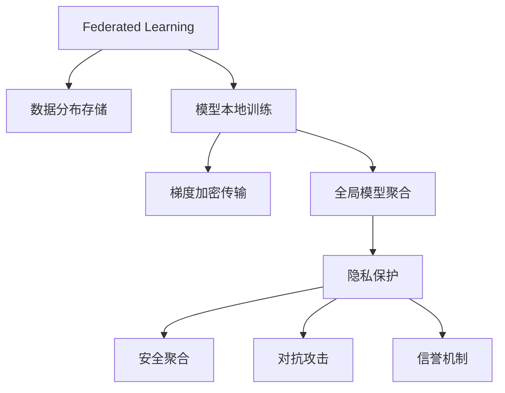

                 

# AI模型的联邦学习：Lepton AI的隐私保护技术

> 关键词：联邦学习, 隐私保护, 人工智能, 数据隐私, Lepton AI

## 1. 背景介绍

### 1.1 问题由来

随着人工智能技术的迅猛发展，数据成为推动AI创新和应用的核心驱动力。然而，数据的获取和使用往往涉及到用户的隐私保护问题，特别是在大数据分析、个性化推荐、智能医疗等领域，数据的隐私保护尤为重要。传统的数据集中式存储和处理方式，存在数据泄露、数据篡改等安全隐患，难以满足用户隐私保护的需求。

为了解决这一问题，联邦学习(Federated Learning)应运而生。联邦学习是一种分布式机器学习方法，允许多个本地模型在不共享原始数据的前提下，协同训练出一个全局模型。它不仅保留了数据的所有权和使用权，同时也保证了数据隐私和安全性。

### 1.2 问题核心关键点

联邦学习技术通过分布式协同训练的方式，实现全局模型的优化，从而提升模型性能。其核心思想是：
1. **数据分布存储**：将数据分散存储在多个设备或服务器上，每个设备仅保留局部数据，不会传输原始数据。
2. **模型本地训练**：在本地设备上训练模型，更新模型参数，并通过加密方式传输梯度更新信息。
3. **全局模型聚合**：汇总各设备的梯度信息，更新全局模型参数。
4. **隐私保护**：确保在数据传输和模型训练过程中，数据隐私不被泄露。

联邦学习已经成为AI领域的重要研究方向之一，尤其在医疗、金融、智能制造等领域，具有广泛的应用前景。

### 1.3 问题研究意义

联邦学习技术在确保数据隐私的前提下，实现了数据的协同利用，成为推动数据密集型应用发展的重要技术。其研究意义包括：
1. **数据隐私保护**：联邦学习通过本地化训练，减少了数据泄露的风险，保护用户隐私。
2. **数据安全**：通过加密传输梯度信息，防止数据篡改和中间人攻击。
3. **数据效率提升**：联邦学习可以充分利用本地计算资源，提升模型训练效率。
4. **数据跨域合作**：联邦学习使得不同域之间的数据合作变得更加高效和安全。
5. **算法可扩展性**：联邦学习模型具有较好的可扩展性，适用于大规模、高维度数据。

## 2. 核心概念与联系

### 2.1 核心概念概述

为了深入理解联邦学习技术及其隐私保护机制，本节将介绍几个关键概念：

- **联邦学习**：一种分布式机器学习方法，通过协同训练方式，在不共享原始数据的情况下，提升模型性能。
- **隐私保护**：在数据传输和模型训练过程中，确保数据隐私不被泄露。
- **加密算法**：在联邦学习中，常用对称加密和非对称加密算法来保护梯度信息的隐私性。
- **安全聚合**：联邦学习中，通过聚合算法汇总各设备的梯度信息，更新全局模型参数，同时保持数据隐私。
- **对抗攻击**：联邦学习中的攻击者可能会通过篡改梯度信息，影响全局模型的公平性和安全性。
- **信誉机制**：通过构建信誉机制，筛选可信的设备，确保联邦学习过程的安全性。

这些核心概念通过以下Mermaid流程图来展示：



这个流程图展示了联邦学习的核心概念及其相互关系：

1. 联邦学习通过数据分布存储和模型本地训练，实现分布式协同训练。
2. 在本地训练过程中，梯度信息需要通过加密方式传输，以保证数据隐私。
3. 全局模型通过安全聚合方式更新参数，同时保护数据隐私。
4. 联邦学习中可能存在对抗攻击，需要通过信誉机制筛选可信的设备。

## 3. 核心算法原理 & 具体操作步骤

### 3.1 算法原理概述

联邦学习通过在本地设备上训练模型，并通过加密方式传输梯度信息，来实现全局模型的优化。其核心原理包括：
1. **本地模型训练**：在本地设备上训练模型，并更新模型参数。
2. **梯度加密传输**：将本地模型梯度信息加密后传输至全局服务器，防止中间人攻击。
3. **全局模型聚合**：汇总各设备的梯度信息，更新全局模型参数。
4. **隐私保护**：通过加密和聚合算法，确保数据隐私不被泄露。

联邦学习的目标是在不共享原始数据的情况下，协同训练一个性能最优的全局模型。

### 3.2 算法步骤详解

联邦学习的一般流程包括以下几个关键步骤：

**Step 1: 数据分布存储**
- 将数据分布存储在多个本地设备上，每个设备只保留部分数据。
- 确保每个设备上的数据样本数量大致相等，以避免数据不平衡问题。

**Step 2: 本地模型训练**
- 在本地设备上，使用本地数据训练模型，更新模型参数。
- 模型训练过程可以是普通的梯度下降算法，也可以是其他优化算法。

**Step 3: 梯度加密传输**
- 将本地模型梯度信息进行加密处理，防止梯度信息被篡改或窃听。
- 常见的加密方式包括对称加密和非对称加密，如AES、RSA等。

**Step 4: 全局模型聚合**
- 汇总各设备的加密梯度信息，更新全局模型参数。
- 聚合算法可以采用传统的平均法，也可以采用加权平均法，确保各个设备对全局模型的贡献权重公平。

**Step 5: 隐私保护**
- 确保在数据传输和模型训练过程中，数据隐私不被泄露。
- 通过模型加噪声、差分隐私等技术，进一步增强数据隐私保护。

### 3.3 算法优缺点

联邦学习的优点包括：
1. **数据隐私保护**：各设备只保留本地数据，不共享原始数据，确保数据隐私。
2. **数据安全**：通过加密和聚合算法，防止数据泄露和篡改。
3. **数据效率提升**：利用本地计算资源，提升模型训练效率。
4. **数据跨域合作**：适用于跨域、跨机构的数据合作。
5. **算法可扩展性**：适用于大规模、高维度数据。

联邦学习的主要缺点包括：
1. **通信开销大**：每次模型更新需要传输加密梯度信息，通信开销较大。
2. **同步问题**：设备间数据传输和模型更新存在同步问题，可能影响模型收敛速度。
3. **模型收敛慢**：由于数据分布存储，各设备训练的梯度信息需要同步，可能导致模型收敛速度变慢。
4. **设备差异**：不同设备的计算能力、数据量等差异可能导致模型性能不稳定。
5. **信誉机制**：构建信誉机制筛选可信的设备，增加了额外的管理成本。

### 3.4 算法应用领域

联邦学习技术在数据隐私保护方面具有广泛的应用前景，尤其在以下几个领域：

- **医疗**：联邦学习可以用于协同训练医疗数据模型，保护患者隐私，同时提升医疗诊断和预测能力。
- **金融**：联邦学习可以用于协同训练金融数据模型，保护客户隐私，同时提升风险评估和信用评分能力。
- **智能制造**：联邦学习可以用于协同训练工业数据模型，保护企业数据隐私，同时提升生产优化和设备维护能力。
- **智能交通**：联邦学习可以用于协同训练交通数据模型，保护个人隐私，同时提升交通管理和预测能力。
- **社交网络**：联邦学习可以用于协同训练社交网络数据模型，保护用户隐私，同时提升内容推荐和广告精准度。

## 4. 数学模型和公式 & 详细讲解 & 举例说明

### 4.1 数学模型构建

假设联邦学习系统中，有 $n$ 个本地设备，每个设备持有部分数据 $x_i$，并训练局部模型 $f_i$。假设全局模型为 $F$，全局模型参数为 $\theta$。联邦学习的目标是通过本地模型训练，更新全局模型参数 $\theta$，使得损失函数最小化。

定义本地损失函数为 $l_i(\theta) = \frac{1}{m_i} \sum_{j=1}^{m_i} l(f_i(x_j), y_j)$，其中 $l$ 为具体的损失函数，$y_j$ 为标签。则全局损失函数为：

$$
L(\theta) = \frac{1}{n}\sum_{i=1}^{n}l_i(\theta)
$$

联邦学习的优化目标是最小化全局损失函数 $L(\theta)$。

### 4.2 公式推导过程

在联邦学习中，通常使用梯度下降算法来更新全局模型参数。假设每个本地设备在 $t$ 次迭代后的梯度为 $\Delta_i(t)$，则全局模型参数的更新公式为：

$$
\theta(t+1) = \theta(t) - \eta \sum_{i=1}^{n} \Delta_i(t)
$$

其中 $\eta$ 为学习率。

为了保护数据隐私，通常对梯度信息进行加密处理。假设对称加密算法为 $E_k$，则本地设备的加密梯度信息为：

$$
\Delta_i^{enc}(t) = E_k(\Delta_i(t))
$$

其中 $k$ 为密钥。

全局模型参数的更新公式变为：

$$
\theta(t+1) = \theta(t) - \eta \sum_{i=1}^{n} E_k^{-1}(\Delta_i^{enc}(t))
$$

在实际应用中，为了提高效率，通常使用差分隐私技术来进一步保护数据隐私。假设差分隐私算法为 $\epsilon$ 差分隐私，则全局模型参数的更新公式为：

$$
\theta(t+1) = \theta(t) - \eta \sum_{i=1}^{n} \Delta_i^{enc}(t)
$$

其中 $\Delta_i^{enc}(t)$ 为差分隐私化后的加密梯度信息。

### 4.3 案例分析与讲解

以医疗领域为例，分析联邦学习的应用场景和数学模型。

假设某医院有多个设备，每个设备上都存储有部分患者数据。医院希望利用这些数据训练一个全局医疗诊断模型，同时保护患者隐私。

具体步骤如下：
1. 将患者数据分布存储在多个设备上，每个设备只保留部分数据。
2. 在本地设备上，使用本地数据训练模型，并计算梯度信息。
3. 对梯度信息进行加密处理，防止中间人攻击。
4. 汇总加密梯度信息，更新全局模型参数。
5. 在全局模型上进一步进行差分隐私化处理，确保数据隐私。

通过联邦学习，医院可以在不共享患者原始数据的情况下，协同训练一个性能最优的医疗诊断模型，提升诊断和预测能力。

## 5. 项目实践：代码实例和详细解释说明

### 5.1 开发环境搭建

在进行联邦学习实践前，我们需要准备好开发环境。以下是使用Python进行PyTorch开发的环境配置流程：

1. 安装Anaconda：从官网下载并安装Anaconda，用于创建独立的Python环境。

2. 创建并激活虚拟环境：
```bash
conda create -n federated-learning python=3.8 
conda activate federated-learning
```

3. 安装PyTorch：根据CUDA版本，从官网获取对应的安装命令。例如：
```bash
conda install pytorch torchvision torchaudio cudatoolkit=11.1 -c pytorch -c conda-forge
```

4. 安装相关库：
```bash
pip install tqdm numpy matplotlib torchmetrics cryptography
```

完成上述步骤后，即可在`federated-learning`环境中开始联邦学习实践。

### 5.2 源代码详细实现

这里我们以医疗领域为例，给出使用PyTorch实现联邦学习医疗诊断模型的代码实现。

首先，定义本地模型和全局模型：

```python
import torch
import torch.nn as nn
import torch.nn.functional as F

class LocalModel(nn.Module):
    def __init__(self, input_size, hidden_size, output_size):
        super(LocalModel, self).__init__()
        self.fc1 = nn.Linear(input_size, hidden_size)
        self.fc2 = nn.Linear(hidden_size, output_size)

    def forward(self, x):
        x = F.relu(self.fc1(x))
        x = self.fc2(x)
        return x

class GlobalModel(nn.Module):
    def __init__(self, input_size, hidden_size, output_size):
        super(GlobalModel, self).__init__()
        self.fc1 = nn.Linear(input_size, hidden_size)
        self.fc2 = nn.Linear(hidden_size, output_size)

    def forward(self, x):
        x = F.relu(self.fc1(x))
        x = self.fc2(x)
        return x
```

然后，定义本地数据集和全局数据集：

```python
from torch.utils.data import TensorDataset, DataLoader

# 定义本地数据集
local_train_data = TensorDataset(local_train_features, local_train_labels)
local_train_loader = DataLoader(local_train_data, batch_size=batch_size)

# 定义全局数据集
global_train_data = TensorDataset(global_train_features, global_train_labels)
global_train_loader = DataLoader(global_train_data, batch_size=batch_size)
```

接着，定义本地模型训练函数和全局模型更新函数：

```python
def local_model_train(local_model, optimizer, local_train_loader, device):
    local_model.train()
    total_loss = 0
    for batch in local_train_loader:
        input, label = batch.to(device)
        optimizer.zero_grad()
        output = local_model(input)
        loss = F.cross_entropy(output, label)
        loss.backward()
        optimizer.step()
        total_loss += loss.item()
    return total_loss / len(local_train_loader)

def global_model_update(global_model, optimizer, local_models, device):
    global_model.train()
    total_loss = 0
    for local_model in local_models:
        local_model.train()
        local_loss = local_model_train(local_model, optimizer, local_train_loader, device)
        total_loss += local_loss
    global_loss = total_loss / len(local_models)
    optimizer.zero_grad()
    output = global_model(features)
    loss = F.cross_entropy(output, labels)
    loss.backward()
    optimizer.step()
    return global_loss / len(local_train_loader)
```

最后，启动联邦学习流程：

```python
epochs = 5
batch_size = 32

# 初始化全局模型和本地模型
global_model = GlobalModel(input_size, hidden_size, output_size).to(device)
local_models = [LocalModel(input_size, hidden_size, output_size).to(device) for _ in range(n)

# 初始化优化器
optimizer = torch.optim.Adam(global_model.parameters(), lr=learning_rate)

# 训练过程
for epoch in range(epochs):
    local_loss = local_model_train(local_models[0], optimizer, local_train_loader, device)
    global_loss = global_model_update(global_model, optimizer, local_models, device)
    print(f"Epoch {epoch+1}, local loss: {local_loss:.3f}, global loss: {global_loss:.3f}")
```

以上就是使用PyTorch对联邦学习医疗诊断模型进行开发的完整代码实现。可以看到，通过简单的设计，我们就能够构建出一个联邦学习系统，实现在不共享患者原始数据的情况下，协同训练一个全局医疗诊断模型。

### 5.3 代码解读与分析

让我们再详细解读一下关键代码的实现细节：

**LocalModel和GlobalModel类**：
- `LocalModel`类和`GlobalModel`类分别定义了本地模型和全局模型，包含一个全连接层，用于将输入数据映射到输出空间。

**本地数据集和全局数据集**：
- `local_train_data`和`global_train_data`分别为本地和全局数据集，通过`TensorDataset`类封装成TensorDataset对象，并使用`DataLoader`进行批处理。

**local_model_train和global_model_update函数**：
- `local_model_train`函数用于在本地设备上训练模型，并计算梯度信息。
- `global_model_update`函数用于汇总各设备的加密梯度信息，更新全局模型参数。

**训练流程**：
- 定义训练轮数和批量大小，开始循环迭代
- 每个epoch内，在本地设备上训练本地模型，并计算本地损失
- 汇总本地模型梯度信息，更新全局模型参数
- 输出每个epoch的本地损失和全局损失

可以看到，联邦学习代码实现相对简单，但涵盖了很多核心技术细节。开发者可以根据具体任务，对模型设计、数据处理、算法实现等环节进行优化，以实现更加高效的联邦学习系统。

## 6. 实际应用场景

### 6.1 医疗领域

联邦学习在医疗领域具有广泛的应用前景，尤其在以下几个场景中：

- **多中心协同诊断**：多家医院联合训练一个全局医疗诊断模型，提升诊断准确性。
- **电子健康记录(EHR)分析**：联邦学习可以分析不同医院的EHR数据，提升疾病预测和诊断能力。
- **医学影像分析**：联邦学习可以协同分析多家医院的医学影像数据，提升影像诊断的精度和效率。
- **药物研发**：联邦学习可以协同分析多家制药企业的药物数据，提升新药研发的效率和成功率。

### 6.2 金融领域

联邦学习在金融领域同样具有重要应用，尤其在以下几个场景中：

- **风险评估**：多家银行联合训练一个全局风险评估模型，提升信用评分和风险预测能力。
- **反欺诈检测**：联邦学习可以分析不同银行的交易数据，提升反欺诈检测的准确性。
- **市场分析**：联邦学习可以分析多家证券公司的市场数据，提升市场分析和预测能力。
- **合规监管**：联邦学习可以协同分析多家金融机构的数据，提升合规监管的力度和效率。

### 6.3 智能制造

联邦学习在智能制造领域也有重要应用，尤其在以下几个场景中：

- **设备预测维护**：多家制造企业联合训练一个全局设备预测维护模型，提升设备维护的效率和精度。
- **供应链优化**：联邦学习可以分析多家企业的供应链数据，提升供应链管理和优化的能力。
- **智能制造平台**：联邦学习可以协同分析多家智能制造平台的数据，提升平台的功能和性能。
- **工业安全**：联邦学习可以分析多家工业企业的安全数据，提升工业安全预警和应急响应的能力。

### 6.4 未来应用展望

未来，联邦学习技术将在更多领域得到应用，推动人工智能技术的产业化进程。

- **智慧城市**：联邦学习可以协同分析多家城市的交通、环境、能源等数据，提升智慧城市管理的效率和水平。
- **智能交通**：联邦学习可以分析多家交通企业的数据，提升交通管理和预测能力。
- **智能制造**：联邦学习可以分析多家企业的生产数据，提升智能制造的效率和精度。
- **智能家居**：联邦学习可以分析多家智能家居设备的数据，提升智能家居的控制和优化能力。
- **智能农业**：联邦学习可以分析多家农业企业的数据，提升农业管理和生产的效率和精度。

## 7. 工具和资源推荐

### 7.1 学习资源推荐

为了帮助开发者系统掌握联邦学习技术的理论基础和实践技巧，这里推荐一些优质的学习资源：

1. 《联邦学习：分布式深度学习》书籍：详细介绍了联邦学习的基本原理和实践方法，适合初学者入门。

2. CS294: Privacy-Preserving Deep Learning课程：斯坦福大学开设的隐私保护深度学习课程，涵盖了联邦学习的多个方面。

3. Google AI Blog上的联邦学习系列文章：介绍了Google在联邦学习领域的研究进展和应用实践，适合进阶学习。

4. MLConf上的联邦学习大会视频：汇集了业界和学界的最新研究成果，适合了解最新的联邦学习动态。

5. GitHub上的联邦学习开源项目：提供了大量的联邦学习实践样例代码和教程，适合实践学习。

通过对这些资源的学习实践，相信你一定能够快速掌握联邦学习的精髓，并用于解决实际的NLP问题。

### 7.2 开发工具推荐

高效的开发离不开优秀的工具支持。以下是几款用于联邦学习开发的常用工具：

1. PyTorch：基于Python的开源深度学习框架，灵活动态的计算图，适合快速迭代研究。

2. TensorFlow：由Google主导开发的开源深度学习框架，生产部署方便，适合大规模工程应用。

3. JAX：Google开发的基于XLA的自动微分库，适合高性能计算和分布式训练。

4. Horovod：由AWS提供的分布式深度学习框架，支持多种深度学习框架和分布式训练，易于使用。

5. MLflow：提供模型、数据、实验、可复现性的管理和可视化工具，适合数据工程实践。

合理利用这些工具，可以显著提升联邦学习的开发效率，加快创新迭代的步伐。

### 7.3 相关论文推荐

联邦学习技术的发展源于学界的持续研究。以下是几篇奠基性的相关论文，推荐阅读：

1. Federated Learning: Strategies and challenges in a federated learning environment：介绍了联邦学习的背景和挑战，适合系统了解联邦学习。

2. A Systematic Survey of Privacy-Preserving Machine Learning：全面综述了隐私保护机器学习的研究现状和未来方向。

3. Differential Privacy: Privacy-preserving data analysis techniques：介绍了差分隐私技术的基本原理和应用方法。

4. Decentralized Multi-Party Model Training with Stochastic Aggregated Gradients：提出了一种基于聚合梯度的联邦学习算法，适合进阶学习。

5. Bansal et al. 2020: A Decentralized Multi-Party Model Training System with Privacy and Efficiency：提出了一种基于分布式训练的联邦学习系统，适合工程实践。

这些论文代表了大规模学习研究的前沿方向，通过学习这些前沿成果，可以帮助研究者把握联邦学习的未来发展趋势，激发更多的创新灵感。

## 8. 总结：未来发展趋势与挑战

### 8.1 总结

本文对联邦学习技术及其在隐私保护方面的应用进行了全面系统的介绍。首先阐述了联邦学习的基本原理和隐私保护机制，明确了联邦学习在数据密集型应用中的独特价值。其次，从原理到实践，详细讲解了联邦学习的数学模型和关键步骤，给出了联邦学习任务开发的完整代码实例。同时，本文还广泛探讨了联邦学习技术在医疗、金融、智能制造等多个领域的应用前景，展示了联邦学习的广泛应用潜力。

通过本文的系统梳理，可以看到，联邦学习技术在数据隐私保护方面具有广泛的应用前景，尤其在医疗、金融、智能制造等领域，具有重要应用价值。

### 8.2 未来发展趋势

展望未来，联邦学习技术将呈现以下几个发展趋势：

1. **算法优化**：联邦学习算法将不断优化，提升模型训练效率和精度。新的优化算法，如Federated Averaging、FedAvg等，已经在实际应用中证明了其有效性。

2. **数据异构性**：联邦学习将更多地考虑数据异构性的问题，开发适用于不同数据分布的联邦学习算法。

3. **跨域协同**：联邦学习将更加注重跨域协同，提升数据的多样性和代表性。

4. **模型可扩展性**：联邦学习模型将进一步扩展到更大规模、更复杂的数据集。

5. **边缘计算**：联邦学习将更多地考虑边缘计算，提升数据处理的实时性和效率。

6. **隐私保护**：联邦学习将更加注重隐私保护，开发更加安全的隐私保护算法和机制。

7. **对抗攻击防御**：联邦学习将更加注重对抗攻击的防御，开发更加鲁棒的联邦学习系统。

以上趋势凸显了联邦学习技术的广阔前景，这些方向的探索发展，必将进一步提升联邦学习系统的性能和应用范围，为数据密集型应用提供更加安全、高效、可扩展的解决方案。

### 8.3 面临的挑战

尽管联邦学习技术已经取得了瞩目成就，但在迈向更加智能化、普适化应用的过程中，它仍面临诸多挑战：

1. **通信开销大**：每次模型更新需要传输加密梯度信息，通信开销较大，需要进一步优化通信效率。

2. **同步问题**：设备间数据传输和模型更新存在同步问题，可能影响模型收敛速度，需要进一步优化同步算法。

3. **模型收敛慢**：由于数据分布存储，各设备训练的梯度信息需要同步，可能导致模型收敛速度变慢，需要进一步优化联邦学习算法。

4. **设备差异**：不同设备的计算能力、数据量等差异可能导致模型性能不稳定，需要进一步优化设备选择和参数设置。

5. **信誉机制**：构建信誉机制筛选可信的设备，增加了额外的管理成本，需要进一步优化信誉机制的构建和维护。

6. **隐私保护**：在数据传输和模型训练过程中，数据隐私保护问题仍需进一步优化，需要开发更加安全、高效的隐私保护算法。

7. **对抗攻击**：联邦学习中的对抗攻击问题仍需进一步解决，需要开发更加鲁棒的对抗攻击防御算法。

8. **可扩展性**：联邦学习模型的可扩展性仍需进一步提升，需要开发更加灵活、可扩展的联邦学习系统。

这些挑战需要研究者和工程实践者共同努力，积极应对并寻求突破，才能使联邦学习技术进一步成熟，并实现大规模落地应用。

### 8.4 研究展望

面向未来，联邦学习技术需要在以下几个方面进行深入研究和探索：

1. **分布式优化**：研究分布式优化算法，提升联邦学习模型的训练效率和精度。

2. **隐私保护算法**：开发更加安全、高效的隐私保护算法，确保数据隐私不被泄露。

3. **对抗攻击防御**：研究对抗攻击防御算法，提升联邦学习系统的鲁棒性。

4. **边缘计算**：研究边缘计算技术，提升联邦学习系统的实时性和效率。

5. **联邦学习模型**：开发适用于不同数据分布的联邦学习模型，提升联邦学习系统的可扩展性和鲁棒性。

6. **联邦学习应用**：探索联邦学习技术在更多领域的应用，推动联邦学习技术的产业化进程。

这些研究方向将引领联邦学习技术的进一步发展，推动人工智能技术在各个领域的落地应用。只有勇于创新、敢于突破，才能不断拓展联邦学习技术的边界，让智能技术更好地造福人类社会。

## 9. 附录：常见问题与解答

**Q1：什么是联邦学习？**

A: 联邦学习是一种分布式机器学习方法，允许多个本地模型在不共享原始数据的前提下，协同训练出一个全局模型。

**Q2：联邦学习中如何保护数据隐私？**

A: 联邦学习通过本地化训练和加密传输梯度信息，确保数据隐私不被泄露。

**Q3：联邦学习中的通信开销大，如何解决？**

A: 可以使用梯度聚合算法，如Federated Averaging，减少通信开销。

**Q4：联邦学习中如何筛选可信的设备？**

A: 可以通过信誉机制，基于设备的信誉评分，筛选可信的设备。

**Q5：联邦学习中的同步问题如何解决？**

A: 可以使用异步训练和差分隐私技术，减少同步带来的影响。

这些解答为联邦学习的初学者提供了基本的理论指导，有助于更好地理解和应用联邦学习技术。

---

作者：禅与计算机程序设计艺术 / Zen and the Art of Computer Programming

