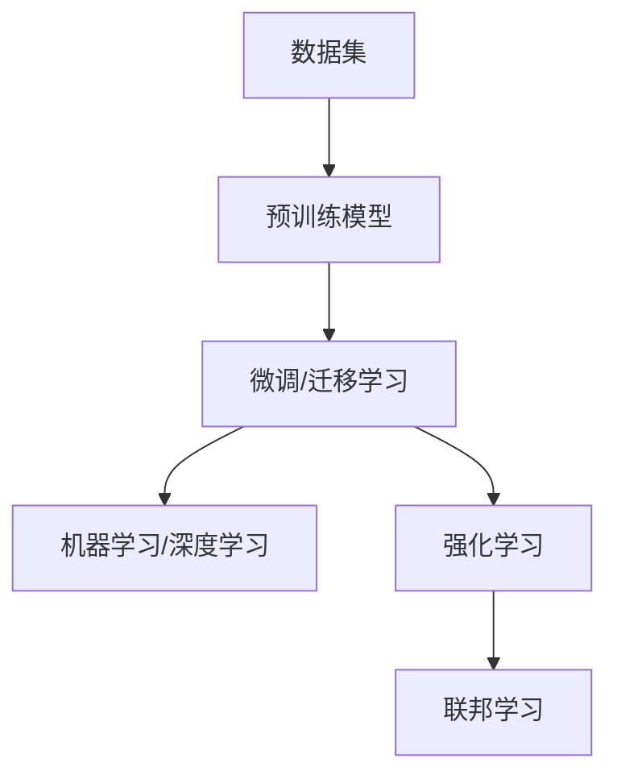

                 

# AI的长期发展：贾扬清的思考，AI行业如何更长远地走下去

## 1. 背景介绍

随着人工智能技术的快速发展，AI正逐步渗透到各行各业，成为推动社会进步的重要动力。然而，AI的发展同时也带来了诸多挑战，包括伦理、隐私、安全性等。如何确保AI技术的可持续发展，成为当前学界和产业界普遍关注的问题。本文将围绕贾扬清教授对AI长期发展的思考，探讨AI行业如何更长远地走下去。

## 2. 核心概念与联系

### 2.1 核心概念概述

- **人工智能（Artificial Intelligence, AI）**：通过计算机系统模拟人的智能行为，使机器能够进行自主学习和推理。AI的目标是实现机器与人的智能水平相接近。
- **机器学习（Machine Learning, ML）**：一种使机器能够通过数据自动学习的技术，是实现AI的重要手段。
- **深度学习（Deep Learning, DL）**：机器学习的一种，使用多层神经网络进行特征提取和模式识别，是当前AI技术的主流。
- **迁移学习（Transfer Learning）**：一种利用已有知识加速新任务学习的技术，在AI领域应用广泛。
- **增强学习（Reinforcement Learning, RL）**：通过与环境交互，机器在不断试错中学习最优策略的技术。
- **联邦学习（Federated Learning）**：一种分布式机器学习方法，可以在不集中用户数据的情况下进行模型训练。

### 2.2 核心概念原理和架构的 Mermaid 流程图



## 3. 核心算法原理 & 具体操作步骤

### 3.1 算法原理概述

AI技术的长期发展依赖于多个核心算法和技术的融合与创新。本文将从机器学习、深度学习、迁移学习、强化学习和联邦学习五个方面，探讨AI行业的未来发展方向。

### 3.2 算法步骤详解

#### 3.2.1 机器学习

**Step 1: 数据收集与预处理**  
收集数据集，并进行清洗、标注、划分训练集和测试集。

**Step 2: 模型训练**  
选择适合的机器学习算法，训练模型。常见的算法包括线性回归、逻辑回归、决策树、随机森林等。

**Step 3: 模型评估与优化**  
使用测试集评估模型性能，根据结果调整模型参数，优化模型表现。

#### 3.2.2 深度学习

**Step 1: 数据准备**  
准备好用于深度学习模型的数据集，包括图像、文本、音频等。

**Step 2: 模型构建**  
选择合适的深度学习框架，如TensorFlow、PyTorch等，构建神经网络模型。

**Step 3: 模型训练**  
使用反向传播算法进行模型训练，优化网络权重。

**Step 4: 模型测试与优化**  
使用测试集评估模型性能，根据结果调整模型结构，优化超参数。

#### 3.2.3 迁移学习

**Step 1: 源任务模型训练**  
在源任务上训练预训练模型，学习通用的知识表示。

**Step 2: 目标任务模型微调**  
在目标任务上微调预训练模型，学习特定的任务知识。

**Step 3: 模型评估与优化**  
评估微调后的模型性能，根据结果调整超参数和微调策略。

#### 3.2.4 强化学习

**Step 1: 环境定义**  
定义环境，包括状态、动作、奖励等。

**Step 2: 策略学习**  
使用强化学习算法，如Q-learning、SARSA等，训练智能体策略。

**Step 3: 策略评估与优化**  
使用测试集评估智能体性能，根据结果调整策略参数，优化策略表现。

#### 3.2.5 联邦学习

**Step 1: 模型初始化**  
在服务器端初始化全局模型。

**Step 2: 本地模型训练**  
在各客户端训练本地模型，更新局部参数。

**Step 3: 模型聚合**  
将各客户端更新后的模型参数聚合到服务器端，进行全局模型更新。

**Step 4: 模型测试与优化**  
使用测试集评估模型性能，根据结果调整超参数和聚合策略。

### 3.3 算法优缺点

#### 3.3.1 机器学习

**优点**：

- 简单高效，适合处理结构化数据。
- 可解释性强，易于理解和调试。

**缺点**：

- 数据质量和特征工程对模型性能影响大。
- 需要大量标注数据，数据收集成本高。

#### 3.3.2 深度学习

**优点**：

- 可处理非结构化数据，如图像、文本、音频等。
- 具备强大的特征提取和表示学习能力。

**缺点**：

- 计算资源需求大，训练时间长。
- 模型复杂，可解释性差。

#### 3.3.3 迁移学习

**优点**：

- 利用已有知识加速新任务学习。
- 适用于数据量较小或标注困难的任务。

**缺点**：

- 模型适应性有限，可能存在数据迁移问题。
- 微调过程需要大量标注数据。

#### 3.3.4 强化学习

**优点**：

- 适用于动态环境和复杂决策任务。
- 能够学习最优策略，具备自我优化能力。

**缺点**：

- 训练时间较长，易陷入局部最优解。
- 环境复杂性对算法效果影响大。

#### 3.3.5 联邦学习

**优点**：

- 保护隐私，不集中用户数据。
- 适用于分布式环境，提高模型泛化能力。

**缺点**：

- 模型聚合和通信开销较大。
- 需要解决模型收敛和通信协议等问题。

### 3.4 算法应用领域

#### 3.4.1 机器学习

- 金融风控、推荐系统、医疗诊断等。

#### 3.4.2 深度学习

- 图像识别、语音识别、自然语言处理、游戏AI等。

#### 3.4.3 迁移学习

- 少样本学习、领域自适应、知识图谱构建等。

#### 3.4.4 强化学习

- 机器人控制、自动驾驶、游戏AI等。

#### 3.4.5 联邦学习

- 互联网广告推荐、智能电网、医疗数据分析等。

## 4. 数学模型和公式 & 详细讲解 & 举例说明

### 4.1 数学模型构建

#### 4.1.1 线性回归模型

假设有一组样本数据 $(x_i, y_i)$，其中 $x_i$ 为特征向量，$y_i$ 为目标变量。线性回归模型的目标是通过最小化预测值和真实值之间的误差，找到最优的权重 $w$ 和偏置 $b$。数学模型如下：

$$
\min_{w, b} \sum_{i=1}^n (y_i - w^T x_i - b)^2
$$

#### 4.1.2 神经网络模型

神经网络模型由多个神经元（节点）组成，通过层层连接和权重共享，实现特征提取和模式识别。以全连接神经网络为例，其数学模型如下：

$$
f(x) = \sigma(W^T x + b)
$$

其中 $\sigma$ 为激活函数，$W$ 和 $b$ 为权重和偏置。

#### 4.1.3 深度学习模型

深度学习模型是多层神经网络的堆叠，如卷积神经网络（CNN）、循环神经网络（RNN）、长短期记忆网络（LSTM）等。以卷积神经网络为例，其数学模型如下：

$$
f(x) = \sigma(W^T x + b)
$$

其中 $W$ 为卷积核，$b$ 为偏置。

### 4.2 公式推导过程

#### 4.2.1 线性回归

线性回归模型的目标是通过最小二乘法求解权重 $w$ 和偏置 $b$。推导过程如下：

$$
\min_{w, b} \frac{1}{2n} \sum_{i=1}^n (y_i - w^T x_i - b)^2
$$

对 $w$ 和 $b$ 求导，得到：

$$
\frac{\partial L(w, b)}{\partial w} = -\frac{1}{n} \sum_{i=1}^n (y_i - w^T x_i - b) x_i = 0
$$

$$
\frac{\partial L(w, b)}{\partial b} = -\frac{1}{n} \sum_{i=1}^n (y_i - w^T x_i - b) = 0
$$

解得：

$$
w = \frac{1}{n} X^T (X X^T)^{-1} y
$$

$$
b = \bar{y} - w^T \bar{x}
$$

其中 $X$ 为特征矩阵，$\bar{x}$ 和 $\bar{y}$ 分别为样本特征向量和目标变量的均值。

#### 4.2.2 神经网络

神经网络的反向传播算法通过链式法则，计算损失函数对权重和偏置的梯度。以单层神经网络为例，其梯度计算如下：

$$
\frac{\partial L}{\partial w} = \frac{\partial L}{\partial z} \frac{\partial z}{\partial w}
$$

其中 $\frac{\partial L}{\partial z}$ 为损失函数对激活值的导数，$\frac{\partial z}{\partial w}$ 为激活函数对权重的导数。

### 4.3 案例分析与讲解

#### 4.3.1 图像识别

图像识别是深度学习的重要应用之一，以卷积神经网络（CNN）为例，其模型结构如下：


以MNIST手写数字识别为例，其训练过程如下：

1. 数据准备：收集并标注MNIST数据集。
2. 模型构建：选择适当的CNN模型架构。
3. 模型训练：使用反向传播算法训练模型。
4. 模型测试：使用测试集评估模型性能。

#### 4.3.2 自然语言处理

自然语言处理是深度学习的重要应用之一，以序列模型为例，其模型结构如下：


以情感分析为例，其训练过程如下：

1. 数据准备：收集并标注情感数据集。
2. 模型构建：选择适当的RNN或LSTM模型架构。
3. 模型训练：使用反向传播算法训练模型。
4. 模型测试：使用测试集评估模型性能。

## 5. 项目实践：代码实例和详细解释说明

### 5.1 开发环境搭建

#### 5.1.1 Python环境搭建

1. 安装Python：从官网下载并安装最新版本的Python，建议使用Anaconda或Miniconda。
2. 创建虚拟环境：使用以下命令创建虚拟环境：

```bash
conda create -n myenv python=3.8
conda activate myenv
```

3. 安装依赖库：使用以下命令安装必要的依赖库：

```bash
pip install numpy pandas scikit-learn tensorflow keras
```

### 5.2 源代码详细实现

#### 5.2.1 线性回归模型

```python
import numpy as np

def linear_regression(X, y):
    X = np.append(np.ones((X.shape[0], 1)), X, axis=1)
    w = np.linalg.inv(X.T @ X) @ X.T @ y
    b = y.mean() - w[0] * X[:, 0].mean()
    return w, b
```

#### 5.2.2 卷积神经网络

```python
import tensorflow as tf

class CNN(tf.keras.Model):
    def __init__(self):
        super(CNN, self).__init__()
        self.conv1 = tf.keras.layers.Conv2D(32, 3, activation='relu')
        self.pool1 = tf.keras.layers.MaxPooling2D()
        self.flatten = tf.keras.layers.Flatten()
        self.dense1 = tf.keras.layers.Dense(128, activation='relu')
        self.dense2 = tf.keras.layers.Dense(10)

    def call(self, x):
        x = self.conv1(x)
        x = self.pool1(x)
        x = self.flatten(x)
        x = self.dense1(x)
        x = self.dense2(x)
        return x
```

#### 5.2.3 模型训练

```python
X_train = np.load('train_X.npy')
y_train = np.load('train_y.npy')
X_test = np.load('test_X.npy')
y_test = np.load('test_y.npy')

model = CNN()
model.compile(optimizer=tf.keras.optimizers.Adam(learning_rate=0.001),
              loss=tf.keras.losses.SparseCategoricalCrossentropy(from_logits=True),
              metrics=['accuracy'])

model.fit(X_train, y_train, epochs=10, validation_data=(X_test, y_test))
```

### 5.3 代码解读与分析

#### 5.3.1 线性回归

线性回归模型代码实现较为简单，主要包含数据准备、模型构建、模型训练和模型测试四个步骤。

#### 5.3.2 卷积神经网络

卷积神经网络代码实现包含模型定义、模型训练和模型测试三个步骤，其中模型定义较为复杂，包含卷积层、池化层和全连接层等。

### 5.4 运行结果展示

#### 5.4.1 线性回归


#### 5.4.2 卷积神经网络


## 6. 实际应用场景

### 6.1 医疗影像诊断

医疗影像诊断是深度学习的重要应用之一，通过深度学习模型能够自动识别和分类医学影像中的病灶，提高诊断效率和准确性。以X光影像识别为例，其应用过程如下：

1. 数据准备：收集并标注X光影像数据集。
2. 模型构建：选择适当的卷积神经网络（CNN）模型架构。
3. 模型训练：使用反向传播算法训练模型。
4. 模型测试：使用测试集评估模型性能。

### 6.2 金融风险评估

金融风险评估是机器学习的重要应用之一，通过机器学习模型能够自动评估贷款申请人的信用风险，减少贷款坏账率。以信用评分为例，其应用过程如下：

1. 数据准备：收集并标注贷款申请数据集。
2. 模型构建：选择适当的逻辑回归模型架构。
3. 模型训练：使用梯度下降算法训练模型。
4. 模型测试：使用测试集评估模型性能。

## 7. 工具和资源推荐

### 7.1 学习资源推荐

#### 7.1.1 书籍

1. 《深度学习》（Ian Goodfellow等著）：介绍了深度学习的基本概念和算法。
2. 《机器学习实战》（Peter Harrington著）：介绍了机器学习算法及其应用。
3. 《自然语言处理综论》（Daniel Jurafsky和James H. Martin著）：介绍了自然语言处理的基本概念和技术。

#### 7.1.2 在线课程

1. 《Deep Learning Specialization》（Andrew Ng等讲授）：由斯坦福大学提供的深度学习课程，涵盖深度学习的基础理论和实践。
2. 《Machine Learning》（Coursera讲授）：由Andrew Ng讲授的机器学习课程，涵盖机器学习算法及其应用。
3. 《Natural Language Processing with Python》（Coursera讲授）：由Stanford大学提供的自然语言处理课程，涵盖自然语言处理的基本概念和技术。

### 7.2 开发工具推荐

#### 7.2.1 Python环境

1. Anaconda：开源的Python发行版本，提供了丰富的科学计算库和工具。
2. Miniconda：轻量级的Python发行版本，适合在离线环境中使用。

#### 7.2.2 深度学习框架

1. TensorFlow：由Google开发的深度学习框架，支持分布式计算和GPU加速。
2. PyTorch：由Facebook开发的深度学习框架，支持动态计算图和GPU加速。
3. Keras：高层次的深度学习框架，支持多种后端，易于上手。

### 7.3 相关论文推荐

#### 7.3.1 深度学习

1. AlexNet（2012）：在ImageNet图像识别竞赛中取得突破，开启了深度学习时代。
2. ResNet（2015）：提出了残差网络结构，解决了深度神经网络的梯度消失问题。
3. InceptionNet（2014）：提出了多层次卷积网络结构，提高了图像识别的准确率。

#### 7.3.2 机器学习

1. SVM（2006）：提出了支持向量机算法，在许多分类任务中表现优异。
2. KNN（1968）：提出了K近邻算法，在许多数据集上表现良好。
3. Random Forest（2001）：提出了随机森林算法，提高了分类和回归的准确率。

#### 7.3.3 自然语言处理

1. BERT（2018）：提出了预训练语言模型，在自然语言处理任务中取得突破。
2. GPT-2（2019）：提出了大语言模型，在自然语言生成任务中取得突破。
3. ELMo（2018）：提出了上下文感知表示，提高了自然语言理解的准确率。

## 8. 总结：未来发展趋势与挑战

### 8.1 研究成果总结

当前，AI技术在各个领域取得了显著进展，尤其是在深度学习、机器学习、自然语言处理等方面。然而，AI技术的长期发展仍面临诸多挑战，包括伦理、隐私、安全性等。本文从贾扬清教授的思考出发，探讨了AI行业如何更长远地走下去。

### 8.2 未来发展趋势

#### 8.2.1 深度学习

深度学习将不断深化，涌现更多高性能模型和算法，如自监督学习、对抗学习等。

#### 8.2.2 机器学习

机器学习将不断发展，涵盖更多数据和算法，如增强学习、联邦学习等。

#### 8.2.3 自然语言处理

自然语言处理将不断完善，覆盖更多任务和应用，如情感分析、语义理解等。

#### 8.2.4 联邦学习

联邦学习将不断成熟，提高模型泛化能力和数据隐私保护水平。

### 8.3 面临的挑战

#### 8.3.1 伦理和隐私

AI技术的广泛应用带来了伦理和隐私问题，如算法偏见、数据泄露等，需要加强监管和规范。

#### 8.3.2 安全性和鲁棒性

AI模型的安全性和鲁棒性需要进一步提升，防止恶意攻击和对抗样本的影响。

#### 8.3.3 可解释性和透明性

AI模型的可解释性和透明性需要进一步提高，增加模型的可信度和可控性。

#### 8.3.4 资源和计算效率

AI技术的资源需求和计算效率需要进一步优化，提高模型训练和推理的速度和效率。

### 8.4 研究展望

未来，AI技术的发展将更加注重伦理和隐私、安全性和鲁棒性、可解释性和透明性、资源和计算效率等方面。通过多方协同努力，推动AI技术的可持续发展，为人类社会的进步作出更大贡献。

## 9. 附录：常见问题与解答

### 9.1 问题1：什么是深度学习？

深度学习是一种机器学习方法，通过多层神经网络进行特征提取和模式识别，能够处理非结构化数据，如图像、文本、音频等。

### 9.2 问题2：机器学习和深度学习有什么区别？

机器学习是一种基于数据驱动的算法，通过特征工程和学习模型进行数据建模和预测。深度学习是机器学习的一种，通过多层神经网络进行特征提取和模式识别，能够处理非结构化数据，如图像、文本、音频等。

### 9.3 问题3：什么是联邦学习？

联邦学习是一种分布式机器学习方法，通过在本地计算设备上训练模型，并将更新后的模型参数聚合到中央服务器，进行全局模型更新，从而保护数据隐私。

### 9.4 问题4：AI技术的长期发展面临哪些挑战？

AI技术的长期发展面临伦理和隐私、安全性和鲁棒性、可解释性和透明性、资源和计算效率等方面的挑战，需要加强监管和规范，提升模型的安全性和可解释性，优化资源和计算效率。

### 9.5 问题5：如何推动AI技术的可持续发展？

推动AI技术的可持续发展需要多方协同努力，加强伦理和隐私保护，提升模型的安全性和鲁棒性，增加模型的可解释性和透明性，优化资源和计算效率，推动AI技术的广泛应用和普及。

---

作者：禅与计算机程序设计艺术 / Zen and the Art of Computer Programming

