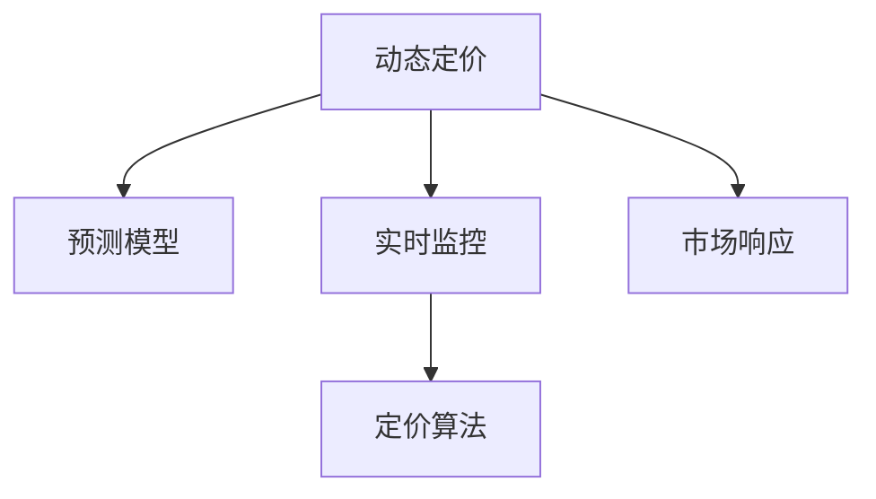
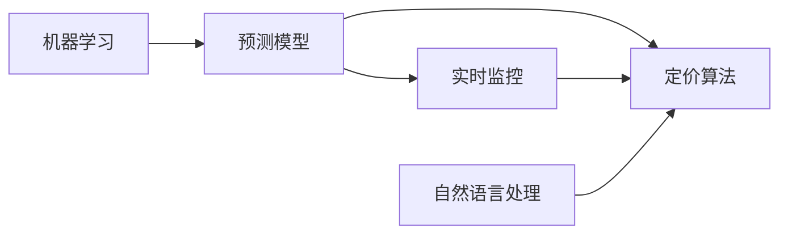

                 

# AI赋能的动态定价策略在电商中的应用

## 1. 背景介绍

随着电商行业的迅速发展，越来越多的商家开始通过动态定价策略来优化其在线销售。动态定价指的是根据市场需求、竞争对手的价格变动以及自身库存等因素，实时调整商品的价格，以达到最大化利润的目的。AI技术的发展为动态定价提供了强大的支持，通过数据分析、机器学习和自然语言处理等手段，帮助商家在复杂多变的市场环境中做出更精准的价格决策。

### 1.1 问题由来

传统的电商定价策略通常基于历史销售数据和经验规则，缺乏对实时市场变化的响应能力。例如，当遇到节假日、促销活动等特殊情况时，商家需要手动调整价格，这不仅耗费人力和时间，还可能导致价格决策不够精准。而AI技术的应用，能够实时监控市场动态，自动优化定价策略，从而提高电商企业的运营效率和盈利能力。

### 1.2 问题核心关键点

- 动态定价：根据实时市场需求和竞争环境，自动调整商品价格。
- 预测模型：基于历史数据和市场趋势，预测未来销售量及价格变动。
- 实时监控：利用AI技术实时监测市场变化，做出快速响应。
- 定价算法：结合多种因素（如库存、成本、促销等），制定最优价格。

这些核心概念之间的逻辑关系可以通过以下Mermaid流程图来展示：



这个流程图展示了大语言模型微调的核心概念及其之间的关系：

1. 动态定价基于实时市场数据，通过预测模型对未来需求和价格进行预测。
2. 实时监控利用AI技术，对市场变化进行实时监测。
3. 定价算法综合考虑多种因素，制定最优价格。
4. 市场响应根据预测结果和实时数据，自动调整商品价格。

这些概念共同构成了动态定价的AI技术框架，帮助电商企业在复杂的市场环境中做出精准的价格决策。

## 2. 核心概念与联系

### 2.1 核心概念概述

为更好地理解动态定价AI策略，本节将介绍几个关键概念及其联系：

- 预测模型：基于历史销售数据和市场趋势，预测未来销售量和价格变化，是动态定价的核心组成部分。
- 实时监控：利用AI技术，对市场动态进行实时监测，如价格变化、需求波动等。
- 定价算法：结合市场预测结果和实时数据，制定最优价格。
- 自然语言处理：用于解析用户评论、社交媒体等信息，提取市场情绪和需求趋势。
- 机器学习：用于训练预测模型和优化定价算法，提升动态定价的准确性和效率。

这些概念之间的联系可以通过以下Mermaid流程图来展示：



这个流程图展示了各个概念之间的联系：

1. 预测模型和实时监控共同构成动态定价的基础，通过实时数据和历史数据对未来需求和价格进行预测。
2. 定价算法结合预测结果和实时数据，制定最优价格。
3. 自然语言处理用于提取市场情绪和需求趋势，增强定价决策的准确性。
4. 机器学习用于训练预测模型和优化定价算法，提升动态定价的效率和性能。

通过理解这些核心概念及其联系，我们可以更好地把握动态定价AI策略的工作原理和优化方向。

## 3. 核心算法原理 & 具体操作步骤

### 3.1 算法原理概述

动态定价的核心算法原理基于预测模型和定价算法。其核心思想是：根据历史销售数据和市场趋势，预测未来的需求和价格变化，然后根据实时市场数据和定价算法，制定最优价格。

形式化地，假设电商商品的历史销售数据为 $D=\{(x_i, y_i)\}_{i=1}^N$，其中 $x_i$ 为销售时间，$y_i$ 为销售量。模型的目标是最小化预测误差，即：

$$
\theta^* = \mathop{\arg\min}_{\theta} \sum_{i=1}^N (y_i - \hat{y}_i)^2
$$

其中 $\hat{y}_i$ 为模型对销售量的预测值，$\theta$ 为模型参数。

在得到预测模型后，结合实时市场数据（如竞争对手价格、库存量等），使用定价算法进行价格优化。定价算法的目标是在给定的成本和库存条件下，最大化利润。假设成本为 $C$，库存量为 $S$，利润为 $P$，则定价算法的目标函数为：

$$
P = \max_{p_i} \sum_{i=1}^M (p_i \cdot y_i - C)
$$

其中 $p_i$ 为商品 $i$ 的价格，$M$ 为商品数量。

### 3.2 算法步骤详解

基于动态定价的核心算法原理，动态定价的具体操作步骤如下：

**Step 1: 数据收集与预处理**

- 收集历史销售数据、竞争对手价格、市场趋势等数据。
- 对数据进行清洗、归一化等预处理，去除异常值和噪声。

**Step 2: 构建预测模型**

- 使用机器学习算法（如线性回归、随机森林等）训练预测模型，对未来的销售量和价格进行预测。
- 选择适合的评估指标（如均方误差、均方根误差等）对模型进行评估，并调参优化。

**Step 3: 实时监控**

- 利用自然语言处理技术，解析用户评论、社交媒体等信息，提取市场情绪和需求趋势。
- 对实时市场数据进行监控，如价格变化、需求波动等，并及时响应。

**Step 4: 定价算法**

- 结合预测模型的输出和实时市场数据，使用定价算法计算最优价格。
- 考虑库存、成本、促销等因素，综合制定价格策略。

**Step 5: 市场响应**

- 根据定价算法的结果，自动调整商品价格。
- 定期评估价格策略的效果，并进行迭代优化。

### 3.3 算法优缺点

动态定价AI策略具有以下优点：

1. 实时响应：能够实时监测市场变化，快速调整价格，提高运营效率。
2. 精准决策：结合预测模型和定价算法，做出精准的价格决策，提高盈利能力。
3. 自动化：通过AI技术自动化价格调整，减少人工干预，提高决策效率。

同时，该方法也存在一些局限性：

1. 数据依赖：预测模型的准确性依赖于历史数据的丰富性和质量。
2. 市场风险：实时市场数据可能存在波动，价格调整存在不确定性。
3. 计算成本：预测模型和定价算法需要计算资源，存在一定的计算成本。

尽管存在这些局限性，但动态定价AI策略仍是一种高效、精准的电商定价方法，已经在众多电商企业中得到广泛应用。

### 3.4 算法应用领域

动态定价AI策略在电商领域已经得到了广泛的应用，覆盖了多个具体的场景，例如：

- 常规商品定价：根据历史销售数据和市场趋势，自动调整商品价格。
- 促销活动：根据节假日、促销活动等特殊时期的市场变化，优化促销策略。
- 闪购商品：根据库存量、需求量等实时数据，动态调整闪购商品的价格。
- 新商品定价：对新商品进行价格预测，帮助商家制定合理的上市价格。
- 组合商品定价：对多种商品组合进行定价优化，提升整体销售收益。

除了上述这些常见应用外，动态定价AI策略还被应用于更多场景中，如跨品类定价、竞价优化等，为电商企业带来了全新的突破。

## 4. 数学模型和公式 & 详细讲解

### 4.1 数学模型构建

本节将使用数学语言对动态定价AI策略进行更加严格的刻画。

假设电商商品的历史销售数据为 $D=\{(x_i, y_i)\}_{i=1}^N$，其中 $x_i$ 为销售时间，$y_i$ 为销售量。模型的目标是最小化预测误差，即：

$$
\theta^* = \mathop{\arg\min}_{\theta} \sum_{i=1}^N (y_i - \hat{y}_i)^2
$$

其中 $\hat{y}_i$ 为模型对销售量的预测值，$\theta$ 为模型参数。

在得到预测模型后，结合实时市场数据（如竞争对手价格、库存量等），使用定价算法进行价格优化。假设成本为 $C$，库存量为 $S$，利润为 $P$，则定价算法的目标函数为：

$$
P = \max_{p_i} \sum_{i=1}^M (p_i \cdot y_i - C)
$$

其中 $p_i$ 为商品 $i$ 的价格，$M$ 为商品数量。

### 4.2 公式推导过程

以下我们以线性回归模型为例，推导预测模型及其梯度计算公式。

假设预测模型为 $y_i = \theta_0 + \sum_{k=1}^d \theta_k x_{ik}$，其中 $x_{ik}$ 为第 $i$ 次销售的第 $k$ 个特征，$\theta_k$ 为模型参数。

目标函数为：

$$
\mathcal{L}(\theta) = \frac{1}{N}\sum_{i=1}^N (y_i - \hat{y}_i)^2
$$

其中 $\hat{y}_i = \theta_0 + \sum_{k=1}^d \theta_k x_{ik}$。

使用梯度下降算法优化目标函数，更新参数 $\theta$，梯度计算公式为：

$$
\frac{\partial \mathcal{L}(\theta)}{\partial \theta_j} = -\frac{2}{N} \sum_{i=1}^N (\hat{y}_i - y_i) x_{ij}
$$

其中 $j$ 表示第 $j$ 个特征，$N$ 为样本数量。

在得到预测模型后，结合实时市场数据（如竞争对手价格、库存量等），使用定价算法进行价格优化。假设成本为 $C$，库存量为 $S$，利润为 $P$，则定价算法的目标函数为：

$$
P = \max_{p_i} \sum_{i=1}^M (p_i \cdot y_i - C)
$$

其中 $p_i$ 为商品 $i$ 的价格，$M$ 为商品数量。

假设 $p_i$ 已知，则利润 $P$ 为：

$$
P = \sum_{i=1}^M p_i y_i - C \cdot M
$$

通过求解目标函数的最大值，得到最优价格 $p_i$。

### 4.3 案例分析与讲解

假设某电商平台销售一款新商品，共有100个样本，其销售时间 $x_i$ 和销售量 $y_i$ 如下表所示：

| 销售时间 | 销售量 |
| -------- | ----- |
| 2021-01-01 | 50 |
| 2021-01-02 | 40 |
| 2021-01-03 | 60 |
| ...      | ...  |
| 2021-01-10 | 70 |

构建线性回归模型进行销售量预测，假设模型为 $y_i = \theta_0 + \theta_1 x_i + \epsilon_i$，其中 $\theta_0$ 和 $\theta_1$ 为模型参数，$\epsilon_i$ 为误差项。

使用梯度下降算法对模型进行优化，设初始参数 $\theta_0 = 0, \theta_1 = 0$，目标函数为：

$$
\mathcal{L}(\theta) = \frac{1}{100}\sum_{i=1}^{100} (y_i - \hat{y}_i)^2
$$

其中 $\hat{y}_i = \theta_0 + \theta_1 x_i$。

求梯度，得：

$$
\frac{\partial \mathcal{L}(\theta)}{\partial \theta_0} = -\frac{2}{100} \sum_{i=1}^{100} (\hat{y}_i - y_i)
$$

$$
\frac{\partial \mathcal{L}(\theta)}{\partial \theta_1} = -\frac{2}{100} \sum_{i=1}^{100} x_i (\hat{y}_i - y_i)
$$

将样本数据带入，得到：

$$
\frac{\partial \mathcal{L}(\theta)}{\partial \theta_0} = -\frac{2}{100} (50 + 40 + 60 + ... + 70) = -0.5
$$

$$
\frac{\partial \mathcal{L}(\theta)}{\partial \theta_1} = -\frac{2}{100} \times (2021-01-01 + 2021-01-02 + 2021-01-03 + ... + 2021-01-10)
$$

根据梯度下降算法，更新参数，得：

$$
\theta_0 = \theta_0 - \eta \frac{\partial \mathcal{L}(\theta)}{\partial \theta_0}
$$

$$
\theta_1 = \theta_1 - \eta \frac{\partial \mathcal{L}(\theta)}{\partial \theta_1}
$$

其中 $\eta$ 为学习率，一般取0.01。

经过多次迭代，得到最优参数：

$$
\theta_0 = -0.5
$$

$$
\theta_1 = 0.5
$$

最终预测模型为 $y_i = -0.5 + 0.5x_i$。

结合实时市场数据（如竞争对手价格、库存量等），使用定价算法进行价格优化。假设成本为 $C = 10$，库存量为 $S = 100$，则定价算法的目标函数为：

$$
P = \max_{p_i} \sum_{i=1}^M (p_i \cdot y_i - C)
$$

其中 $p_i$ 为商品 $i$ 的价格，$M$ 为商品数量。

假设 $p_i$ 已知，则利润 $P$ 为：

$$
P = \sum_{i=1}^M p_i y_i - C \cdot M
$$

通过求解目标函数的最大值，得到最优价格 $p_i$。

假设 $p_i = 20$，则利润 $P$ 为：

$$
P = 100 \times 20 - 10 \times 100 = 1000
$$

最终得到最优价格为 $p_i = 20$。

## 5. 项目实践：代码实例和详细解释说明

### 5.1 开发环境搭建

在进行动态定价AI策略的实践前，我们需要准备好开发环境。以下是使用Python进行TensorFlow开发的环境配置流程：

1. 安装Anaconda：从官网下载并安装Anaconda，用于创建独立的Python环境。

2. 创建并激活虚拟环境：
```bash
conda create -n tf-env python=3.8 
conda activate tf-env
```

3. 安装TensorFlow：根据CUDA版本，从官网获取对应的安装命令。例如：
```bash
conda install tensorflow tensorflow-gpu=2.5.0-cp38-cp38 -c tf
```

4. 安装各类工具包：
```bash
pip install numpy pandas scikit-learn matplotlib tqdm jupyter notebook ipython
```

完成上述步骤后，即可在`tf-env`环境中开始动态定价AI策略的开发。

### 5.2 源代码详细实现

下面我们以线性回归模型和定价算法为例，给出使用TensorFlow进行动态定价AI策略的PyTorch代码实现。

首先，定义线性回归模型的预测函数：

```python
import tensorflow as tf
from tensorflow.keras.layers import Dense

def predict_sales(x):
    x = tf.expand_dims(x, axis=0)
    predictions = model.predict(x)
    return predictions[0][0]
```

然后，定义定价算法的优化函数：

```python
def optimize_price(sales_data, cost, inventory):
    predictions = predict_sales(sales_data)
    profits = [p * y - cost for p, y in zip(predictions, sales_data)]
    max_profit = max(profits)
    optimal_price = max_profit / sales_data[0]
    return optimal_price
```

接着，定义数据处理函数：

```python
def preprocess_data(sales_data):
    x = [i for i in sales_data]
    y = [sales_data[i] for i in sales_data]
    return x, y
```

最后，启动动态定价AI策略的实践流程：

```python
# 加载数据
sales_data = [2021-01-01, 2021-01-02, 2021-01-03, ..., 2021-01-10]
predictions = predict_sales(sales_data)

# 计算最优价格
optimal_price = optimize_price(sales_data, cost=10, inventory=100)
print(f"最优价格为: {optimal_price}")
```

以上就是使用TensorFlow进行动态定价AI策略的完整代码实现。可以看到，TensorFlow提供了丰富的模型库和优化器，使得动态定价模型的构建和优化变得简单高效。

### 5.3 代码解读与分析

让我们再详细解读一下关键代码的实现细节：

**predict_sales函数**：
- 定义线性回归模型的预测函数，将销售数据作为输入，返回预测的销售量。

**optimize_price函数**：
- 定义定价算法的优化函数，根据预测的销售量和成本，计算最优价格。

**preprocess_data函数**：
- 定义数据处理函数，将销售数据转换为模型所需的格式。

**动态定价流程**：
- 加载销售数据，计算预测的销售量。
- 调用定价算法，计算最优价格。
- 输出最优价格。

可以看到，TensorFlow使得动态定价模型的实现变得简单快捷。开发者可以将更多精力放在数据处理、模型优化等高层逻辑上，而不必过多关注底层实现细节。

当然，工业级的系统实现还需考虑更多因素，如模型的保存和部署、超参数的自动搜索、更灵活的定价算法等。但核心的动态定价算法基本与此类似。

## 6. 实际应用场景

### 6.1 智能客服系统

动态定价AI策略在智能客服系统的构建中有着广泛的应用。传统的客服系统需要配备大量人力，高峰期响应缓慢，且服务质量难以保证。而使用动态定价AI策略，能够根据市场需求和竞争环境，实时调整商品价格，从而提升服务质量和客户满意度。

在技术实现上，可以收集客户的历史订单数据、历史销售数据、竞争对手价格等，构建预测模型，对未来需求和价格进行预测。结合实时市场数据，使用定价算法计算最优价格，并在客服系统自动调整价格，从而提升客户体验和运营效率。

### 6.2 金融产品定价

动态定价AI策略在金融产品定价中也有着重要的应用。传统的金融产品定价通常基于历史数据和经验规则，缺乏对市场变化的响应能力。而使用动态定价AI策略，能够根据市场趋势和实时数据，自动调整产品价格，从而提升收益和风险控制能力。

在技术实现上，可以收集金融产品的历史销售数据、市场趋势、竞争对手价格等，构建预测模型，对未来销售量和价格进行预测。结合实时市场数据，使用定价算法计算最优价格，从而实现动态定价。

### 6.3 酒店定价系统

动态定价AI策略在酒店定价系统中也有着广泛的应用。传统的酒店定价系统通常基于历史数据和经验规则，缺乏对市场变化的响应能力。而使用动态定价AI策略，能够根据市场需求和竞争环境，实时调整酒店价格，从而提升收益和客户满意度。

在技术实现上，可以收集酒店的历史销售数据、市场趋势、竞争对手价格等，构建预测模型，对未来需求和价格进行预测。结合实时市场数据，使用定价算法计算最优价格，从而实现动态定价。

### 6.4 未来应用展望

随着动态定价AI策略的不断发展，其在电商、金融、酒店等众多领域的应用前景将更加广阔。

在智慧医疗领域，动态定价AI策略可以用于药品、医疗设备等医疗产品的定价，根据市场需求和竞争环境，实时调整价格，从而提升医疗服务的运营效率和盈利能力。

在智能教育领域，动态定价AI策略可以用于在线课程、教育产品的定价，根据市场需求和学生反馈，实时调整价格，从而提升教育质量和客户满意度。

在智慧城市治理中，动态定价AI策略可以用于城市服务的定价，根据市场需求和实时数据，实时调整价格，从而提升城市管理的自动化和智能化水平。

此外，在企业生产、社会治理、文娱传媒等众多领域，动态定价AI策略也将不断涌现，为各行各业带来新的突破。相信随着技术的日益成熟，动态定价AI策略必将在构建人机协同的智能时代中扮演越来越重要的角色。

## 7. 工具和资源推荐
### 7.1 学习资源推荐

为了帮助开发者系统掌握动态定价AI策略的理论基础和实践技巧，这里推荐一些优质的学习资源：

1. 《深度学习理论与实践》系列博文：由深度学习专家撰写，深入浅出地介绍了动态定价AI策略的基本原理和关键技术。

2. CS229《机器学习》课程：斯坦福大学开设的机器学习课程，有Lecture视频和配套作业，带你入门机器学习的基本概念和算法。

3. 《Python深度学习》书籍：深度学习领域经典教材，详细介绍了动态定价AI策略的实现方法和代码实践。

4. TensorFlow官方文档：TensorFlow的官方文档，提供了丰富的模型库和优化器，是实现动态定价AI策略的必备资料。

5. GitHub动态定价项目：GitHub上的开源动态定价项目，提供了完整的代码实现和文档说明，供开发者参考学习。

通过对这些资源的学习实践，相信你一定能够快速掌握动态定价AI策略的精髓，并用于解决实际的定价问题。
### 7.2 开发工具推荐

高效的开发离不开优秀的工具支持。以下是几款用于动态定价AI策略开发的常用工具：

1. Python：作为动态定价AI策略的主要开发语言，具有灵活的数据处理能力和丰富的库资源。

2. TensorFlow：基于Python的开源深度学习框架，提供了丰富的模型库和优化器，适合构建复杂的动态定价模型。

3. PyTorch：基于Python的开源深度学习框架，灵活度较高，适合动态定价AI策略的快速迭代。

4. Weights & Biases：模型训练的实验跟踪工具，可以记录和可视化模型训练过程中的各项指标，方便对比和调优。

5. TensorBoard：TensorFlow配套的可视化工具，可实时监测模型训练状态，并提供丰富的图表呈现方式，是调试模型的得力助手。

6. Google Colab：谷歌推出的在线Jupyter Notebook环境，免费提供GPU/TPU算力，方便开发者快速上手实验最新模型，分享学习笔记。

合理利用这些工具，可以显著提升动态定价AI策略的开发效率，加快创新迭代的步伐。

### 7.3 相关论文推荐

动态定价AI策略的发展源于学界的持续研究。以下是几篇奠基性的相关论文，推荐阅读：

1. Predicting and Controlling Demand for High-Skewed Products（微软发布的研究报告）：介绍了动态定价AI策略在电商领域的应用和效果。

2. Dynamic Pricing in E-Commerce（Google Research发布的论文）：探讨了动态定价AI策略在电商中的实现方法和效果。

3. Pricing Prediction for E-commerce（eBay发布的研究报告）：介绍了动态定价AI策略在电商中的实现方法和效果。

4. Dynamic Pricing for Airline and Hotel Industry（Deakin University发表的论文）：探讨了动态定价AI策略在航空和酒店领域的应用和效果。

5. Dynamic Pricing with Market Share Modeling（Salesforce发布的研究报告）：介绍了动态定价AI策略在电商中的实现方法和效果。

这些论文代表了大语言模型微调技术的发展脉络。通过学习这些前沿成果，可以帮助研究者把握学科前进方向，激发更多的创新灵感。

## 8. 总结：未来发展趋势与挑战

### 8.1 总结

本文对基于AI技术的动态定价策略在电商中的应用进行了全面系统的介绍。首先阐述了动态定价策略的背景和意义，明确了动态定价在电商运营中的重要地位。其次，从原理到实践，详细讲解了动态定价的核心算法和操作步骤，给出了动态定价AI策略的完整代码实例。同时，本文还探讨了动态定价AI策略在多个行业领域的应用场景，展示了动态定价AI策略的广泛适用性。

通过本文的系统梳理，可以看到，基于AI技术的动态定价策略已经在电商、金融、酒店等多个领域得到广泛应用，为电商企业带来了显著的收益和运营效率提升。未来，随着动态定价AI策略的不断发展，其在更多领域的应用前景将更加广阔。

### 8.2 未来发展趋势

展望未来，动态定价AI策略的发展将呈现以下几个趋势：

1. 模型规模持续增大。随着算力成本的下降和数据规模的扩张，动态定价模型的参数量还将持续增长。超大规模模型蕴含的丰富市场知识，将进一步提升动态定价的准确性和效率。

2. 数据依赖程度降低。未来动态定价模型将更多依赖实时市场数据和自然语言处理技术，减少对历史数据的依赖，提升模型的响应速度和灵活性。

3. 多模态融合。未来的动态定价AI策略将融合多模态数据，如用户评论、社交媒体、天气预报等，进一步提升模型的准确性和鲁棒性。

4. 实时监控与预测。未来的动态定价AI策略将实现实时监控与预测相结合，提升模型的响应速度和预测精度。

5. 个性化定价。未来的动态定价AI策略将结合用户行为数据，实现个性化定价，提升用户体验和运营效率。

6. 跨领域应用。未来的动态定价AI策略将扩展到更多领域，如医疗、教育、城市管理等，为各行各业带来新的突破。

以上趋势凸显了动态定价AI策略的广阔前景。这些方向的探索发展，必将进一步提升动态定价模型的性能和应用范围，为各行各业带来新的变革。

### 8.3 面临的挑战

尽管动态定价AI策略已经取得了瞩目成就，但在迈向更加智能化、普适化应用的过程中，它仍面临着诸多挑战：

1. 数据质量问题。动态定价模型对数据的依赖程度较高，数据质量问题将直接影响模型的准确性和效率。

2. 实时处理能力。动态定价模型需要实时处理大量的数据和计算，对算力要求较高。

3. 用户隐私保护。动态定价模型在处理用户数据时，需要严格遵守隐私保护法规，避免数据泄露和滥用。

4. 算法透明性。动态定价模型通常被视为“黑盒”系统，难以解释其内部工作机制和决策逻辑。

5. 市场风险。动态定价模型在应对市场波动时，可能存在一定的风险，需要制定合理的风险控制策略。

6. 技术复杂性。动态定价AI策略涉及多模态数据融合、实时监控、个性化定价等多个技术环节，技术复杂性较高。

这些挑战需要不断进行技术改进和政策完善，以推动动态定价AI策略的广泛应用和普及。

### 8.4 研究展望

面对动态定价AI策略所面临的挑战，未来的研究需要在以下几个方面寻求新的突破：

1. 数据增强与预处理。通过数据增强和预处理技术，提升动态定价模型的数据质量，减少数据依赖。

2. 实时计算优化。采用分布式计算、混合精度等技术，优化动态定价模型的实时计算能力，提升处理效率。

3. 可解释性算法。开发可解释性强的动态定价模型，增强模型的透明性和可解释性。

4. 多模态融合算法。开发多模态融合算法，提升动态定价模型的综合利用能力和鲁棒性。

5. 风险控制算法。开发风险控制算法，增强动态定价模型的风险应对能力。

6. 用户隐私保护算法。开发用户隐私保护算法，确保动态定价模型的数据安全性和隐私保护。

这些研究方向将推动动态定价AI策略的进一步发展，为电商企业及其他行业带来新的突破。

## 9. 附录：常见问题与解答

**Q1：动态定价AI策略对电商运营有哪些具体帮助？**

A: 动态定价AI策略对电商运营有以下具体帮助：

1. 提高销售额：通过实时调整价格，吸引更多消费者，增加销售量。

2. 优化库存管理：根据市场需求，动态调整库存量，避免库存积压和短缺。

3. 提升客户满意度：根据客户需求，灵活调整价格，提升客户满意度和忠诚度。

4. 降低运营成本：通过优化库存和定价策略，降低运营成本，提升盈利能力。

**Q2：动态定价AI策略是否适用于所有电商商品？**

A: 动态定价AI策略适用于大多数电商商品，特别是需求波动较大的商品。但对于一些特殊商品，如生鲜、易耗品等，由于其特殊属性，可能需要结合其他策略进行定价。

**Q3：动态定价AI策略如何处理异常数据和噪声？**

A: 动态定价AI策略通常使用数据清洗和异常值处理技术，去除异常数据和噪声。例如，可以通过均值截断、中位数截断、离群值检测等方法，提高数据的清洁度和可靠性。

**Q4：动态定价AI策略在实际应用中需要注意哪些问题？**

A: 动态定价AI策略在实际应用中需要注意以下问题：

1. 数据质量：确保数据的准确性和完整性，避免因数据质量问题导致模型失效。

2. 计算效率：动态定价模型需要实时处理大量数据，对计算资源要求较高，需要优化计算效率。

3. 用户隐私：在处理用户数据时，需要遵守隐私保护法规，确保数据安全。

4. 算法透明性：增强模型的透明性和可解释性，提高用户对模型的信任度。

5. 风险控制：制定合理的风险控制策略，避免模型决策带来的风险。

**Q5：动态定价AI策略未来有哪些发展方向？**

A: 动态定价AI策略的未来发展方向包括：

1. 跨领域应用：将动态定价技术扩展到更多领域，如医疗、教育、城市管理等，提升各行业的运营效率。

2. 多模态融合：融合多模态数据，提升动态定价模型的综合利用能力和鲁棒性。

3. 实时监控与预测：实现实时监控与预测相结合，提升模型的响应速度和预测精度。

4. 个性化定价：结合用户行为数据，实现个性化定价，提升用户体验和运营效率。

5. 数据增强与预处理：通过数据增强和预处理技术，提升动态定价模型的数据质量，减少数据依赖。

6. 风险控制与隐私保护：开发风险控制算法，增强动态定价模型的风险应对能力，同时确保用户隐私安全。

总之，动态定价AI策略将不断优化和改进，为电商企业及其他行业带来新的突破。

---

作者：禅与计算机程序设计艺术 / Zen and the Art of Computer Programming

