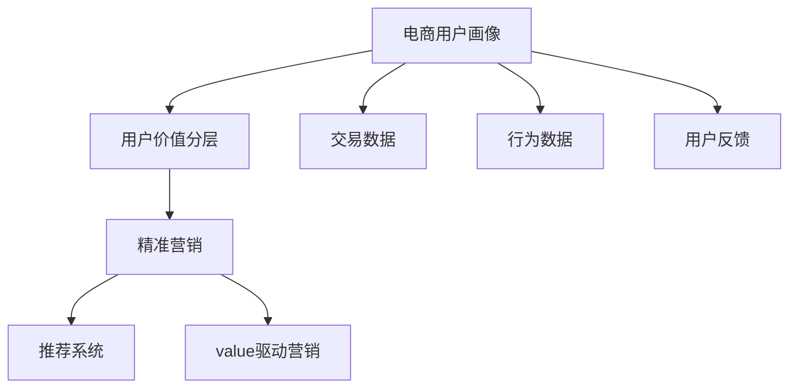

                 

# AI赋能的电商用户价值分层与精准营销

## 1. 背景介绍

### 1.1 问题由来

随着电商市场的不断扩大和竞争的加剧，如何精准识别和定位目标用户，实现个性化推荐和营销，成为电商平台亟需解决的核心问题。传统的基于人口统计、行为数据的用户画像构建方法，存在维度单一、覆盖面窄、准确性低等缺点，难以满足复杂多变的用户需求。

大数据分析、人工智能技术的发展为电商用户价值分层和精准营销提供了新的解决方案。通过构建全量用户画像，并利用机器学习算法进行深度分析，可以更准确地识别用户行为模式和价值贡献，从而实现更有效的个性化推荐和精准营销。

### 1.2 问题核心关键点

本文聚焦于基于人工智能技术对电商用户进行价值分层与精准营销的实践。核心关键点在于：

1. **全量用户画像构建**：从电商网站和应用的所有用户行为数据中提取全量用户画像，包含基本信息、行为历史、交易记录等关键特征。
2. **用户价值分层模型**：设计机器学习模型，对用户进行多维度价值评分，识别高价值用户、高潜力用户和低价值用户。
3. **精准营销策略**：基于用户价值分层，设计有针对性的精准营销策略，提升用户体验和电商转化率。

## 2. 核心概念与联系

### 2.1 核心概念概述

为更好地理解AI赋能的电商用户价值分层与精准营销，本节将介绍几个密切相关的核心概念：

- **电商用户画像**：通过数据收集和分析，构建电商用户的行为、兴趣、需求等全维度画像，用于精准营销和个性化推荐。
- **用户价值分层**：利用机器学习模型，对电商用户进行多维度价值评分，识别不同价值层级的用户，指导精准营销策略的制定。
- **精准营销**：通过个性化的内容推荐、广告投放、优惠券发放等手段，提升用户购物体验和电商转化率，实现精细化运营。
- **推荐系统**：基于用户画像和行为数据，设计推荐算法，实现商品、内容、服务的精准推荐。
- **价值驱动营销**：以用户价值为导向，设计差异化的营销策略，提升高价值用户粘性和忠诚度，盘活低价值用户潜力。

这些核心概念之间的逻辑关系可以通过以下Mermaid流程图来展示：



这个流程图展示电商用户价值分层与精准营销的核心概念及其之间的关系：

1. 电商用户画像通过收集交易、行为、反馈等数据，形成用户的全维度画像。
2. 用户价值分层模型利用机器学习对用户进行价值评分，识别不同价值层级的用户。
3. 精准营销基于用户价值分层，设计个性化推荐、广告投放、优惠券等策略，提升用户购物体验和转化率。
4. 推荐系统通过用户画像和行为数据，实现商品、内容、服务的精准推荐。
5. 价值驱动营销以用户价值为导向，设计差异化营销策略，提升高价值用户粘性和忠诚度。

这些概念共同构成了电商用户价值分层与精准营销的理论基础和实践框架，使其能够在电商业务场景中发挥重要作用。

## 3. 核心算法原理 & 具体操作步骤
### 3.1 算法原理概述

基于AI技术的电商用户价值分层与精准营销，本质上是一种基于数据驱动的用户行为分析与预测。其核心思想是：通过构建电商用户画像，并利用机器学习算法进行深度分析，识别不同价值层级的用户，从而实现更有效的个性化推荐和精准营销。

形式化地，假设电商平台拥有全量用户画像数据 $D=\{(x_i, y_i)\}_{i=1}^N$，其中 $x_i$ 表示用户 $i$ 的全量行为数据（如浏览记录、购买记录、评价记录等），$y_i$ 表示用户 $i$ 的价值评分（如贡献度、复购率、流失率等）。

用户价值分层模型的目标是通过训练一个机器学习模型 $M$，最小化损失函数 $\mathcal{L}(M, D)$，使得模型能够对用户 $x$ 预测其价值评分 $y$。常见的损失函数包括均方误差损失、交叉熵损失等。

### 3.2 算法步骤详解

基于AI技术的电商用户价值分层与精准营销的一般流程如下：

**Step 1: 准备数据集**

- 收集电商平台的交易数据、行为数据、用户反馈等全量数据。
- 数据预处理，包括数据清洗、特征工程、标准化处理等。
- 将数据划分为训练集、验证集和测试集。

**Step 2: 构建用户画像**

- 通过数据整合，形成每个用户的全量行为数据，包括交易历史、浏览历史、评价历史等。
- 利用NLP技术，对用户的浏览记录、评论内容等进行情感分析、关键词提取等处理。
- 将用户的全量行为数据和处理后的文本信息进行特征提取，形成用户画像特征向量。

**Step 3: 设计价值分层模型**

- 选择合适的机器学习模型，如随机森林、梯度提升树、深度神经网络等，作为用户价值分层模型。
- 设定模型的输入特征，如用户ID、交易金额、浏览次数等。
- 定义模型的输出目标，如用户价值评分。
- 设计合适的损失函数，如均方误差损失、交叉熵损失等。

**Step 4: 模型训练与调优**

- 使用训练集数据，利用优化算法（如梯度下降、Adam等）训练模型。
- 在验证集上评估模型性能，根据评估结果调整模型超参数，如学习率、正则化系数等。
- 重复训练调优过程，直至模型在验证集上取得理想性能。

**Step 5: 用户价值分层**

- 利用训练好的模型对全量用户进行预测，得到每个用户的价值评分。
- 根据用户价值评分，将用户分为高价值用户、高潜力用户和低价值用户。

**Step 6: 精准营销策略设计**

- 根据用户价值分层结果，设计有针对性的精准营销策略。
- 针对高价值用户，设计个性化推荐、专属折扣等策略。
- 针对高潜力用户，设计引导购买、优惠券等策略。
- 针对低价值用户，设计回访提醒、重新引导等策略。

**Step 7: 模型评估与反馈**

- 在测试集上评估营销策略的效果，如转化率提升、流失率下降等指标。
- 根据评估结果和用户反馈，不断优化模型和营销策略。

### 3.3 算法优缺点

基于AI技术的电商用户价值分层与精准营销方法具有以下优点：

1. **精准性高**：通过构建全量用户画像，利用机器学习算法进行深度分析，能够更准确地识别不同价值层级的用户。
2. **个性化强**：基于用户价值分层结果，设计有针对性的精准营销策略，提升用户体验和电商转化率。
3. **效率高**：机器学习模型能够高效处理大规模数据，快速实现用户价值分层和精准营销。
4. **灵活性大**：可以针对不同的电商业务场景，设计多维度的价值评分体系，灵活调整营销策略。

同时，该方法也存在一定的局限性：

1. **数据依赖性大**：模型的效果很大程度上依赖于数据的质量和多样性。
2. **模型复杂度高**：深度神经网络等复杂模型需要大量的计算资源和时间进行训练。
3. **泛化能力受限**：模型可能对未见过的数据泛化能力不足。
4. **隐私风险**：涉及用户隐私数据的收集和分析，可能带来隐私保护问题。

尽管存在这些局限性，但就目前而言，基于AI技术的用户价值分层与精准营销方法仍是大数据分析在电商领域的重要应用手段。未来相关研究的重点在于如何进一步降低数据依赖性，提高模型的泛化能力，同时兼顾隐私保护。

### 3.4 算法应用领域

基于AI技术的电商用户价值分层与精准营销，已经在电商行业的多个环节得到广泛应用，如：

- **个性化推荐**：通过分析用户行为数据，推荐用户感兴趣的商品和内容，提升用户体验和转化率。
- **广告投放**：根据用户价值分层结果，设计针对性的广告投放策略，提升广告转化效果。
- **优惠券策略**：根据用户价值分层，设计个性化优惠券发放策略，促进用户复购。
- **用户留存**：通过分析用户流失数据，设计回访提醒、引导等策略，提升用户留存率。
- **新客获取**：利用用户画像和价值分层模型，设计精准的营销活动，吸引新用户。

除了上述这些经典应用外，AI技术还在电商的客户细分、渠道优化、库存管理等领域得到创新应用，为电商业务的数字化转型和精细化运营提供了有力支撑。

## 4. 数学模型和公式 & 详细讲解 & 举例说明

### 4.1 数学模型构建

本节将使用数学语言对基于AI技术的电商用户价值分层与精准营销过程进行更加严格的刻画。

假设电商平台全量用户画像数据为 $D=\{(x_i, y_i)\}_{i=1}^N$，其中 $x_i$ 表示用户 $i$ 的全量行为数据，$y_i$ 表示用户 $i$ 的价值评分。构建机器学习模型 $M$ 对用户进行价值评分预测，损失函数为均方误差损失：

$$
\mathcal{L}(M, D) = \frac{1}{N} \sum_{i=1}^N (y_i - M(x_i))^2
$$

通过最小化损失函数，训练得到用户价值评分预测模型 $M$，从而实现用户价值分层。

### 4.2 公式推导过程

以下我们以随机森林模型为例，推导用户价值分层模型的公式。

假设用户 $i$ 的全量行为数据为 $\mathbf{x}_i=(x_{i1}, x_{i2}, \ldots, x_{in})$，其中 $x_{ik}$ 表示第 $k$ 个行为特征。假设用户价值评分 $y_i$ 为一个连续值，构建随机森林模型 $M$ 对用户价值评分进行预测。

随机森林模型的决策树由以下公式计算：

$$
M(x_i) = \sum_{j=1}^J M_j(x_i)
$$

其中 $J$ 表示决策树的数量，$M_j(x_i)$ 表示第 $j$ 个决策树对用户 $x_i$ 的预测值。假设每个决策树的预测值为 $y_{ij}$，则 $M_j(x_i)$ 的计算公式为：

$$
M_j(x_i) = \sum_{k=1}^K \alpha_{jk} y_{ijk}
$$

其中 $K$ 表示特征的数量，$\alpha_{jk}$ 表示第 $j$ 个决策树中第 $k$ 个特征的权重。权重 $\alpha_{jk}$ 通过训练数据 $D$ 中的特征 $x_{ik}$ 和标签 $y_i$ 进行求解，利用随机森林算法中的Bagging和随机特征选择技术，避免过拟合和泛化能力不足的问题。

将上述公式代入用户价值分层模型的损失函数：

$$
\mathcal{L}(M, D) = \frac{1}{N} \sum_{i=1}^N (y_i - \sum_{j=1}^J M_j(x_i))^2
$$

利用梯度下降等优化算法，求解最小化损失函数：

$$
\frac{\partial \mathcal{L}(M, D)}{\partial \alpha_{jk}} = \frac{2}{N} \sum_{i=1}^N (y_i - M(x_i))(x_{ik} - \sum_{j=1}^K \alpha_{jk} y_{ijk})
$$

通过求解上述梯度，更新模型参数 $\alpha_{jk}$，直至收敛。

### 4.3 案例分析与讲解

假设一个电商平台的交易数据如下：

| UserID | 交易金额 | 浏览次数 | 评价星级 | 复购率 |
| --- | --- | --- | --- | --- |
| 1 | 1000 | 100 | 5 | 0.2 |
| 2 | 500 | 200 | 3 | 0.5 |
| 3 | 200 | 50 | 4 | 0.3 |
| 4 | 1500 | 120 | 2 | 0.1 |
| 5 | 300 | 80 | 4 | 0.4 |

构建随机森林模型对用户进行价值评分预测。

1. **数据预处理**：将交易金额、浏览次数、评价星级等数据标准化处理，形成特征向量 $\mathbf{x}_i=(x_{i1}, x_{i2}, x_{i3}, x_{i4}, x_{i5})$。

2. **模型训练**：假设随机森林模型由3棵决策树构成，每棵决策树有5个特征。通过训练数据 $D$，求解每个决策树的权重 $\alpha_{jk}$，得到每个用户的行为预测值 $M_j(x_i)$。

3. **价值评分预测**：将用户行为预测值 $M_j(x_i)$ 进行加权求和，得到每个用户的价值评分预测 $M(x_i)$。

4. **用户价值分层**：根据预测价值评分 $M(x_i)$，将用户分为高价值用户、高潜力用户和低价值用户。

假设模型训练后，得到用户价值评分预测值如下：

| UserID | 预测价值评分 |
| --- | --- |
| 1 | 0.8 |
| 2 | 0.6 |
| 3 | 0.4 |
| 4 | 0.9 |
| 5 | 0.7 |

根据预测值，将用户分为高价值用户（预测值 > 0.7）、高潜力用户（预测值 ∈ [0.5, 0.7]）和低价值用户（预测值 < 0.5）。

## 5. 项目实践：代码实例和详细解释说明

### 5.1 开发环境搭建

在进行项目实践前，我们需要准备好开发环境。以下是使用Python进行Scikit-learn开发的开发环境配置流程：

1. 安装Anaconda：从官网下载并安装Anaconda，用于创建独立的Python环境。

2. 创建并激活虚拟环境：
```bash
conda create -n py3-env python=3.8 
conda activate py3-env
```

3. 安装Scikit-learn：
```bash
pip install scikit-learn
```

4. 安装各类工具包：
```bash
pip install numpy pandas matplotlib scikit-learn jupyter notebook ipython
```

完成上述步骤后，即可在`py3-env`环境中开始项目实践。

### 5.2 源代码详细实现

下面以随机森林模型为例，给出使用Scikit-learn库对电商平台用户进行价值分层的Python代码实现。

首先，定义用户价值分层模型：

```python
from sklearn.ensemble import RandomForestRegressor

# 定义随机森林模型
model = RandomForestRegressor(n_estimators=100, max_depth=5, random_state=42)
```

然后，准备数据集并进行训练：

```python
from sklearn.model_selection import train_test_split
import pandas as pd

# 读取交易数据
df = pd.read_csv('transaction_data.csv')

# 将交易金额、浏览次数、评价星级等作为特征，复购率作为标签
X = df[['transaction_amount', 'browsing_times', 'review_score']]
y = df['repeat_purchase_rate']

# 将数据集划分为训练集和测试集
X_train, X_test, y_train, y_test = train_test_split(X, y, test_size=0.2, random_state=42)

# 训练模型
model.fit(X_train, y_train)
```

接着，进行用户价值评分预测和分层：

```python
# 对测试集进行预测
y_pred = model.predict(X_test)

# 根据预测值进行用户价值分层
high_value_users = y_pred > 0.7
medium_value_users = (y_pred >= 0.5) & (y_pred <= 0.7)
low_value_users = y_pred < 0.5

# 输出用户价值分层结果
print("高价值用户数：", len(high_value_users))
print("高潜力用户数：", len(medium_value_users))
print("低价值用户数：", len(low_value_users))
```

以上就是使用Scikit-learn库对电商平台用户进行价值分层的完整代码实现。可以看到，利用Scikit-learn库的强大封装，我们可以用相对简洁的代码完成随机森林模型的构建和训练，实现用户价值评分预测和分层。

### 5.3 代码解读与分析

让我们再详细解读一下关键代码的实现细节：

**RandomForestRegressor**：
- 定义了一个随机森林回归模型，通过设置 `n_estimators` 参数控制决策树数量，`max_depth` 参数控制决策树深度。

**train_test_split**：
- 使用 `train_test_split` 函数将数据集划分为训练集和测试集，`test_size` 参数控制测试集的比例，`random_state` 参数设置随机种子，保证结果的可重复性。

**特征工程**：
- 使用 `pandas` 库读取交易数据，将交易金额、浏览次数、评价星级等作为特征，复购率作为标签。

**模型训练**：
- 使用 `fit` 函数训练随机森林模型，输入特征 `X_train` 和标签 `y_train`。

**预测和分层**：
- 使用 `predict` 函数对测试集进行预测，得到每个用户的价值评分预测值。
- 根据预测值对用户进行分层，分为高价值用户、高潜力用户和低价值用户。

可以看到，Scikit-learn库使得机器学习模型的构建和训练变得简单高效，开发者可以将更多精力放在特征工程和模型调参等高层逻辑上，而不必过多关注底层的实现细节。

当然，工业级的系统实现还需考虑更多因素，如模型保存和部署、超参数的自动搜索、更灵活的任务适配层等。但核心的价值分层和精准营销流程基本与此类似。

## 6. 实际应用场景

### 6.1 智能推荐系统

基于AI技术的用户价值分层与精准营销，可以在智能推荐系统中发挥重要作用。通过分析用户行为数据，构建全量用户画像，利用机器学习模型进行价值评分预测，可以实现更加精准的个性化推荐。

在技术实现上，可以设计推荐算法，根据用户价值分层结果，设计有针对性的推荐策略。例如：

1. 对于高价值用户，设计推荐新商品、新品牌的策略，提升其购物体验和忠诚度。
2. 对于高潜力用户，设计推荐热门商品、限时优惠策略，促进其首次购买。
3. 对于低价值用户，设计回访提醒、重新引导策略，提升其再访率和转化率。

如此构建的智能推荐系统，能大幅提升电商平台的转化率和用户满意度，增强市场竞争力。

### 6.2 个性化广告投放

在电商平台中，广告投放是重要的收入来源之一。基于用户价值分层，可以设计更加精准的广告投放策略，提高广告转化效果和ROI。

具体而言，可以根据用户价值分层结果，设计差异化的广告投放策略：

1. 对于高价值用户，设计品牌形象广告、高价值商品广告，提升品牌认知和产品转化。
2. 对于高潜力用户，设计折扣广告、限时促销广告，促进其首次购买。
3. 对于低价值用户，设计回访提醒广告、重新引导广告，提升其再访率和转化率。

通过精准广告投放，可以最大化广告预算的利用效率，提升电商平台的收入和利润。

### 6.3 用户留存与流失管理

用户的留存和流失是电商平台运营的重要指标。通过分析用户行为数据，构建用户画像，利用机器学习模型进行价值评分预测，可以实现更有效的用户留存和流失管理。

具体而言，可以设计以下策略：

1. 对于高价值用户，设计会员特权、专属活动策略，提升其粘性和忠诚度。
2. 对于高潜力用户，设计推荐新商品、优惠券策略，促进其复购和留存。
3. 对于低价值用户，设计回访提醒、重新引导策略，提升其再访率和转化率。

通过精准的用户留存与流失管理，可以提升平台的用户粘性和长期价值，增加收入和利润。

### 6.4 未来应用展望

随着AI技术的不断发展，基于用户价值分层与精准营销的方法将在电商领域得到更广泛的应用，带来更多创新和突破。

1. **跨平台数据整合**：将电商平台的交易数据、社交平台的用户互动数据、智能设备的用户行为数据等进行整合，构建更全面的用户画像，提升推荐和营销的精准性。
2. **多模态数据融合**：将文本数据、图像数据、音频数据等进行融合，构建更丰富的用户画像，提升推荐和营销的效果。
3. **实时数据处理**：利用流式计算和大数据技术，实时处理用户行为数据，实现实时推荐和营销，提升用户体验和转化率。
4. **联邦学习**：通过联邦学习技术，保护用户隐私的同时，提升模型泛化能力和推荐精度。
5. **情感分析**：利用自然语言处理技术，对用户评论、社交媒体等文本数据进行情感分析，设计更加个性化的推荐和营销策略。

未来，伴随AI技术的不断进步，基于用户价值分层与精准营销的方法将在电商领域带来更多变革性应用，为电商业务的数字化转型和精细化运营提供有力支撑。

## 7. 工具和资源推荐
### 7.1 学习资源推荐

为了帮助开发者系统掌握基于AI技术的电商用户价值分层与精准营销的理论基础和实践技巧，这里推荐一些优质的学习资源：

1. **《Python机器学习》（第二版）**：本书由Sebastian Raschka编写，全面介绍了机器学习算法及其在电商领域的应用，是系统学习AI技术的入门必读。

2. **《Hands-On Machine Learning with Scikit-Learn, Keras, and TensorFlow》**：本书由Aurélien Géron编写，介绍了Scikit-Learn、Keras、TensorFlow等主流机器学习库，并详细讲解了其在电商领域的应用案例。

3. **《推荐系统实战》**：本书由鲍越编写，介绍了推荐系统的主要算法和实际案例，是了解推荐系统理论基础和实践方法的好书。

4. **《深度学习与推荐系统》**：本书由蒋逸康编写，介绍了深度学习在推荐系统中的应用，包括序列推荐、协同过滤等方法。

5. **Kaggle竞赛平台**：Kaggle是一个数据科学竞赛平台，提供大量的电商数据集和推荐系统竞赛，是实战学习的好去处。

通过对这些资源的学习实践，相信你一定能够快速掌握基于AI技术的电商用户价值分层与精准营销的精髓，并用于解决实际的电商业务问题。

### 7.2 开发工具推荐

高效的开发离不开优秀的工具支持。以下是几款用于基于AI技术的电商用户价值分层与精准营销开发的常用工具：

1. **Scikit-learn**：一个开源的Python机器学习库，提供了大量的机器学习算法和工具，适合进行数据建模和分析。

2. **TensorFlow**：由Google主导开发的开源深度学习框架，生产部署方便，适合大规模工程应用。

3. **PyTorch**：基于Python的开源深度学习框架，灵活动态的计算图，适合快速迭代研究。

4. **Jupyter Notebook**：一个交互式的Python编程环境，支持代码编辑、数据可视化等，方便快速实验和调试。

5. **AWS SageMaker**：亚马逊提供的机器学习平台，支持模型训练、部署和监控，适合云上环境开发和部署。

6. **Google Cloud AI Platform**：Google提供的机器学习平台，支持模型训练、部署、预测等，适合云上环境开发和部署。

合理利用这些工具，可以显著提升基于AI技术的电商用户价值分层与精准营销的开发效率，加快创新迭代的步伐。

### 7.3 相关论文推荐

大语言模型和微调技术的发展源于学界的持续研究。以下是几篇奠基性的相关论文，推荐阅读：

1. **"Introduction to Statistical Learning"**：由Gareth James、Daniela Witten、Trevor Hastie和Robert Tibshirani编写，是机器学习领域的经典教材，涵盖统计学习的基本概念和算法。

2. **"Random Forests"**：由Tibshirani和Breiman等编写，详细介绍了随机森林算法及其应用，是机器学习领域的经典论文。

3. **"Deep Learning for Recommender Systems: A Survey and Outlook"**：由He et al. 编写，介绍了深度学习在推荐系统中的应用，包括深度神经网络、深度矩阵分解等方法。

4. **"ClickBert: A pre-trained model for e-commerce clicks"**：由Najouhi et al. 编写，介绍了基于Bert的电商点击预测模型，提升了电商平台的点击率。

5. **"Deep Multi-Task Learning for Personalized Recommendation"**：由Wu et al. 编写，介绍了多任务深度学习在推荐系统中的应用，提升了推荐模型的泛化能力和精度。

这些论文代表了大语言模型微调技术的发展脉络。通过学习这些前沿成果，可以帮助研究者把握学科前进方向，激发更多的创新灵感。

## 8. 总结：未来发展趋势与挑战

### 8.1 总结

本文对基于AI技术的电商用户价值分层与精准营销方法进行了全面系统的介绍。首先阐述了全量用户画像构建、用户价值分层模型设计、精准营销策略设计等核心概念及其关系，明确了基于AI技术的电商用户价值分层与精准营销在电商业务中的应用场景和效果。

通过本文的系统梳理，可以看到，基于AI技术的用户价值分层与精准营销方法在电商业务场景中发挥了重要作用，能够提升电商平台的转化率、用户满意度和长期价值，增强市场竞争力。未来，伴随AI技术的不断进步，基于用户价值分层与精准营销的方法将带来更多创新和突破，为电商业务的数字化转型和精细化运营提供有力支撑。

### 8.2 未来发展趋势

展望未来，基于AI技术的电商用户价值分层与精准营销将呈现以下几个发展趋势：

1. **全量数据驱动**：伴随AI技术的不断进步，电商平台将能够整合更全面的用户数据，构建更全量、多维度的用户画像，提升推荐和营销的精准性。
2. **实时数据处理**：利用流式计算和大数据技术，实时处理用户行为数据，实现实时推荐和营销，提升用户体验和转化率。
3. **跨平台数据整合**：将电商平台的交易数据、社交平台的用户互动数据、智能设备的用户行为数据等进行整合，构建更全面的用户画像，提升推荐和营销的精准性。
4. **多模态数据融合**：将文本数据、图像数据、音频数据等进行融合，构建更丰富的用户画像，提升推荐和营销的效果。
5. **联邦学习**：通过联邦学习技术，保护用户隐私的同时，提升模型泛化能力和推荐精度。
6. **情感分析**：利用自然语言处理技术，对用户评论、社交媒体等文本数据进行情感分析，设计更加个性化的推荐和营销策略。

这些趋势凸显了基于AI技术的电商用户价值分层与精准营销的广阔前景。这些方向的探索发展，必将进一步提升电商平台的转化率、用户满意度和长期价值，增强市场竞争力。

### 8.3 面临的挑战

尽管基于AI技术的用户价值分层与精准营销方法已经取得了瞩目成就，但在迈向更加智能化、普适化应用的过程中，它仍面临着诸多挑战：

1. **数据隐私保护**：涉及用户隐私数据的收集和分析，可能带来隐私保护问题。如何在数据利用和隐私保护之间取得平衡，是未来的重要课题。
2. **模型泛化能力**：模型可能对未见过的数据泛化能力不足。如何提升模型的泛化能力，避免过拟合，是一个需要不断探索的问题。
3. **计算资源消耗**：深度神经网络等复杂模型需要大量的计算资源和时间进行训练，如何高效利用计算资源，优化模型结构，是一个需要不断探索的问题。
4. **模型解释性**：当前基于AI技术的推荐系统往往被认为是"黑盒"系统，难以解释其内部工作机制和决策逻辑。如何提升模型的可解释性，是未来的重要课题。
5. **技术落地应用**：如何将AI技术更好地融入电商业务，实现技术和业务的无缝对接，是一个需要不断探索的问题。

尽管存在这些挑战，但基于AI技术的电商用户价值分层与精准营销方法仍是大数据分析在电商领域的重要应用手段。未来相关研究的重点在于如何进一步提升模型的泛化能力、可解释性和隐私保护，同时兼顾计算资源和业务需求。

### 8.4 研究展望

未来的研究需要在以下几个方面寻求新的突破：

1. **无监督和半监督学习**：摆脱对大规模标注数据的依赖，利用无监督和半监督学习范式，最大限度利用非结构化数据，实现更加灵活高效的推荐和营销。
2. **跨领域迁移学习**：将不同领域的数据和知识进行融合，构建更加全面和通用的推荐模型，提升模型的泛化能力和应用范围。
3. **模型压缩与优化**：通过模型压缩和优化技术，减小模型尺寸，提升推理速度和资源利用效率，实现更加轻量级、实时性的部署。
4. **隐私保护技术**：利用隐私保护技术，如差分隐私、联邦学习等，保护用户隐私的同时，提升模型的泛化能力和推荐精度。
5. **多模态数据融合**：将文本数据、图像数据、音频数据等进行融合，构建更丰富的用户画像，提升推荐和营销的效果。

这些研究方向的探索，必将引领基于AI技术的电商用户价值分层与精准营销技术迈向更高的台阶，为电商业务的数字化转型和精细化运营提供有力支撑。

## 9. 附录：常见问题与解答

**Q1：如何构建全量用户画像？**

A: 构建全量用户画像需要收集电商平台的所有用户行为数据，包括交易数据、浏览数据、评价数据等。然后，利用自然语言处理技术，对用户的浏览记录、评论内容等进行情感分析、关键词提取等处理。最后，将用户的全量行为数据和处理后的文本信息进行特征提取，形成用户画像特征向量。

**Q2：如何选择机器学习模型进行用户价值评分预测？**

A: 选择机器学习模型时需要考虑数据特征、模型复杂度、训练效率等因素。一般来说，随机森林、梯度提升树、深度神经网络等模型都可以用于用户价值评分预测。具体选择哪种模型，需要根据数据集的大小、特征数量、计算资源等因素进行综合评估。

**Q3：如何进行模型调参和超参数选择？**

A: 模型调参和超参数选择需要通过交叉验证等方法，在验证集上评估模型性能，调整模型超参数。一般来说，可以通过网格搜索、随机搜索等方法，寻找最优的超参数组合。同时，需要注意避免过拟合和泛化能力不足的问题。

**Q4：如何评估推荐和营销策略的效果？**

A: 评估推荐和营销策略的效果需要定义合适的指标，如推荐准确率、点击率、转化率等。可以通过A/B测试等方法，将推荐和营销策略的效果与基准策略进行对比，评估策略的提升效果。同时，还需要考虑用户反馈和实际业务效果，不断优化策略。

**Q5：如何处理用户隐私问题？**

A: 处理用户隐私问题需要采取隐私保护技术，如差分隐私、联邦学习等。具体措施包括：
- 匿名化处理：对用户数据进行匿名化处理，保护用户隐私。
- 差分隐私：在模型训练和预测过程中，添加噪声，保护用户隐私。
- 联邦学习：在分布式环境中，通过联邦学习技术，保护用户隐私的同时，提升模型的泛化能力和推荐精度。

通过这些措施，可以有效保护用户隐私，提升基于AI技术的电商用户价值分层与精准营销的效果。

---

作者：禅与计算机程序设计艺术 / Zen and the Art of Computer Programming

